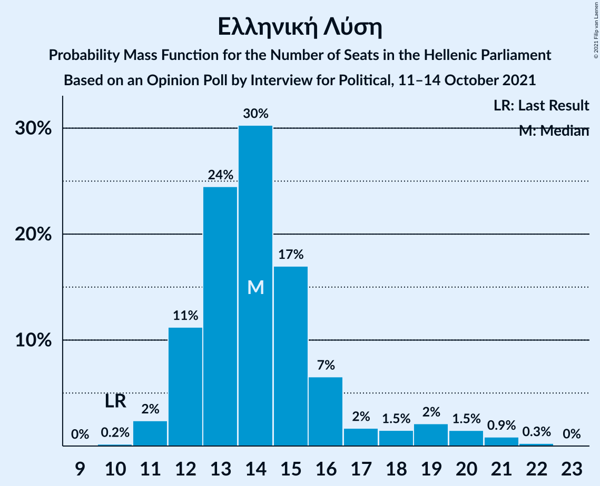

# Opinion Poll by Interview for Political, 11–14 October 2021

<a href="#voting-intentions">Voting Intentions</a> | <a href="#seats">Seats</a> | <a href="#coalitions">Coalitions</a> | <a href="#technical-information">Technical Information</a>

## Voting Intentions

### Confidence Intervals

| Party | Last Result | Poll Result | 80% Confidence Interval | 90% Confidence Interval | 95% Confidence Interval | 99% Confidence Interval |
|:-----:|:-----------:|:-----------:|:-----------------------:|:-----------------------:|:-----------------------:|:-----------------------:|
| Νέα Δημοκρατία | 39.8% | 40.0% | 38.1–41.9% |37.6–42.4% |37.2–42.9% |36.3–43.8% |
| Συνασπισμός Ριζοσπαστικής Αριστεράς | 31.5% | 25.3% | 23.7–27.0% |23.2–27.5% |22.8–27.9% |22.1–28.8% |
| Κίνημα Αλλαγής | 8.1% | 7.9% | 6.9–9.0% |6.7–9.3% |6.4–9.6% |6.0–10.2% |
| Κομμουνιστικό Κόμμα Ελλάδας | 5.3% | 6.2% | 5.3–7.2% |5.1–7.5% |4.9–7.8% |4.5–8.3% |
| Ελληνική Λύση | 3.7% | 5.4% | 4.6–6.4% |4.4–6.6% |4.2–6.9% |3.9–7.4% |
| Μέτωπο Ευρωπαϊκής Ρεαλιστικής Ανυπακοής | 3.4% | 4.4% | 3.7–5.3% |3.5–5.5% |3.3–5.8% |3.0–6.2% |
| Πλεύση Ελευθερίας | 1.5% | 1.8% | 1.4–2.4% |1.2–2.6% |1.2–2.8% |1.0–3.1% |

*Note:* The poll result column reflects the actual value used in the calculations. Published results may vary slightly, and in addition be rounded to fewer digits.

## Seats

### Confidence Intervals

| Party | Last Result | Median | 80% Confidence Interval | 90% Confidence Interval | 95% Confidence Interval | 99% Confidence Interval |
|:-----:|:-----------:|:------:|:-----------------------:|:-----------------------:|:-----------------------:|:-----------------------:|
| <a href="#νέα-δημοκρατία">Νέα Δημοκρατία</a> | 158 | 162 | 157–167 |156–168 |154–170 |151–172 |
| <a href="#συνασπισμός-ριζοσπαστικής-αριστεράς">Συνασπισμός Ριζοσπαστικής Αριστεράς</a> | 86 | 71 | 66–75 |65–77 |64–78 |62–80 |
| <a href="#κίνημα-αλλαγής">Κίνημα Αλλαγής</a> | 22 | 23 | 20–26 |19–27 |19–27 |17–29 |
| <a href="#κομμουνιστικό-κόμμα-ελλάδας">Κομμουνιστικό Κόμμα Ελλάδας</a> | 15 | 18 | 16–21 |15–21 |14–22 |13–23 |
| <a href="#ελληνική-λύση">Ελληνική Λύση</a> | 10 | 14 | 12–16 |12–18 |11–20 |11–21 |
| <a href="#μέτωπο-ευρωπαϊκής-ρεαλιστικής-ανυπακοής">Μέτωπο Ευρωπαϊκής Ρεαλιστικής Ανυπακοής</a> | 9 | 12 | 10–14 |10–15 |9–15 |0–17 |
| <a href="#πλεύση-ελευθερίας">Πλεύση Ελευθερίας</a> | 0 | 0 | 0 |0 |0 |0–8 |

### Νέα Δημοκρατία

*For a full overview of the results for this party, see the [Νέα Δημοκρατία](party-νέαδημοκρατία.html) page.*

| Number of Seats | Probability | Accumulated | Special Marks |
|:---------------:|:-----------:|:-----------:|:-------------:|
| 149 | 0% | 100% |  |
| 150 | 0.1% | 99.9% |  |
| 151 | 0.3% | 99.8% | Majority |
| 152 | 0.3% | 99.5% |  |
| 153 | 1.1% | 99.2% |  |
| 154 | 1.3% | 98% |  |
| 155 | 2% | 97% |  |
| 156 | 5% | 95% |  |
| 157 | 3% | 90% |  |
| 158 | 9% | 88% | Last Result |
| 159 | 6% | 79% |  |
| 160 | 8% | 73% |  |
| 161 | 12% | 64% |  |
| 162 | 6% | 52% | Median |
| 163 | 13% | 46% |  |
| 164 | 7% | 32% |  |
| 165 | 7% | 25% |  |
| 166 | 7% | 18% |  |
| 167 | 3% | 11% |  |
| 168 | 4% | 9% |  |
| 169 | 2% | 5% |  |
| 170 | 1.1% | 3% |  |
| 171 | 1.0% | 2% |  |
| 172 | 0.3% | 0.7% |  |
| 173 | 0.3% | 0.5% |  |
| 174 | 0.1% | 0.2% |  |
| 175 | 0% | 0.1% |  |
| 176 | 0% | 0.1% |  |
| 177 | 0% | 0% |  |

### Συνασπισμός Ριζοσπαστικής Αριστεράς

*For a full overview of the results for this party, see the [Συνασπισμός Ριζοσπαστικής Αριστεράς](party-συνασπισμόςριζοσπαστικήςαριστεράς.html) page.*

| Number of Seats | Probability | Accumulated | Special Marks |
|:---------------:|:-----------:|:-----------:|:-------------:|
| 59 | 0% | 100% |  |
| 60 | 0.1% | 99.9% |  |
| 61 | 0.2% | 99.9% |  |
| 62 | 0.5% | 99.6% |  |
| 63 | 1.0% | 99.1% |  |
| 64 | 2% | 98% |  |
| 65 | 3% | 96% |  |
| 66 | 4% | 93% |  |
| 67 | 7% | 89% |  |
| 68 | 9% | 82% |  |
| 69 | 11% | 74% |  |
| 70 | 10% | 63% |  |
| 71 | 11% | 53% | Median |
| 72 | 10% | 41% |  |
| 73 | 9% | 32% |  |
| 74 | 7% | 22% |  |
| 75 | 6% | 15% |  |
| 76 | 4% | 9% |  |
| 77 | 2% | 6% |  |
| 78 | 1.5% | 3% |  |
| 79 | 0.9% | 2% |  |
| 80 | 0.5% | 0.9% |  |
| 81 | 0.2% | 0.4% |  |
| 82 | 0.1% | 0.2% |  |
| 83 | 0.1% | 0.1% |  |
| 84 | 0% | 0% |  |
| 85 | 0% | 0% |  |
| 86 | 0% | 0% | Last Result |

### Κίνημα Αλλαγής

*For a full overview of the results for this party, see the [Κίνημα Αλλαγής](party-κίνημααλλαγής.html) page.*

| Number of Seats | Probability | Accumulated | Special Marks |
|:---------------:|:-----------:|:-----------:|:-------------:|
| 16 | 0.2% | 100% |  |
| 17 | 0.5% | 99.8% |  |
| 18 | 2% | 99.3% |  |
| 19 | 4% | 98% |  |
| 20 | 7% | 94% |  |
| 21 | 12% | 88% |  |
| 22 | 17% | 76% | Last Result |
| 23 | 17% | 59% | Median |
| 24 | 18% | 42% |  |
| 25 | 11% | 24% |  |
| 26 | 7% | 13% |  |
| 27 | 4% | 6% |  |
| 28 | 2% | 2% |  |
| 29 | 0.5% | 0.7% |  |
| 30 | 0.2% | 0.2% |  |
| 31 | 0% | 0.1% |  |
| 32 | 0% | 0% |  |

### Κομμουνιστικό Κόμμα Ελλάδας

*For a full overview of the results for this party, see the [Κομμουνιστικό Κόμμα Ελλάδας](party-κομμουνιστικόκόμμαελλάδας.html) page.*

| Number of Seats | Probability | Accumulated | Special Marks |
|:---------------:|:-----------:|:-----------:|:-------------:|
| 12 | 0.2% | 100% |  |
| 13 | 0.8% | 99.8% |  |
| 14 | 2% | 99.0% |  |
| 15 | 6% | 97% | Last Result |
| 16 | 11% | 91% |  |
| 17 | 16% | 79% |  |
| 18 | 20% | 63% | Median |
| 19 | 17% | 43% |  |
| 20 | 13% | 26% |  |
| 21 | 7% | 12% |  |
| 22 | 3% | 5% |  |
| 23 | 1.3% | 2% |  |
| 24 | 0.4% | 0.5% |  |
| 25 | 0.1% | 0.1% |  |
| 26 | 0% | 0% |  |

### Ελληνική Λύση

*For a full overview of the results for this party, see the [Ελληνική Λύση](party-ελληνικήλύση.html) page.*

| Number of Seats | Probability | Accumulated | Special Marks |
|:---------------:|:-----------:|:-----------:|:-------------:|
| 10 | 0.2% | 100% | Last Result |
| 11 | 2% | 99.8% |  |
| 12 | 11% | 97% |  |
| 13 | 24% | 86% |  |
| 14 | 30% | 62% | Median |
| 15 | 17% | 31% |  |
| 16 | 7% | 14% |  |
| 17 | 2% | 8% |  |
| 18 | 1.5% | 6% |  |
| 19 | 2% | 5% |  |
| 20 | 1.5% | 3% |  |
| 21 | 0.9% | 1.2% |  |
| 22 | 0.3% | 0.3% |  |
| 23 | 0% | 0% |  |

### Μέτωπο Ευρωπαϊκής Ρεαλιστικής Ανυπακοής

*For a full overview of the results for this party, see the [Μέτωπο Ευρωπαϊκής Ρεαλιστικής Ανυπακοής](party-μέτωποευρωπαϊκήςρεαλιστικήςανυπακοής.html) page.*

| Number of Seats | Probability | Accumulated | Special Marks |
|:---------------:|:-----------:|:-----------:|:-------------:|
| 0 | 0.7% | 100% |  |
| 1 | 0% | 99.3% |  |
| 2 | 0% | 99.3% |  |
| 3 | 0% | 99.3% |  |
| 4 | 0% | 99.3% |  |
| 5 | 0% | 99.3% |  |
| 6 | 0% | 99.3% |  |
| 7 | 0% | 99.3% |  |
| 8 | 0.2% | 99.3% |  |
| 9 | 4% | 99.1% | Last Result |
| 10 | 14% | 95% |  |
| 11 | 21% | 81% |  |
| 12 | 25% | 61% | Median |
| 13 | 18% | 35% |  |
| 14 | 10% | 17% |  |
| 15 | 5% | 7% |  |
| 16 | 2% | 2% |  |
| 17 | 0.6% | 0.8% |  |
| 18 | 0.2% | 0.3% |  |
| 19 | 0.1% | 0.1% |  |
| 20 | 0% | 0% |  |

### Πλεύση Ελευθερίας

*For a full overview of the results for this party, see the [Πλεύση Ελευθερίας](party-πλεύσηελευθερίας.html) page.*

| Number of Seats | Probability | Accumulated | Special Marks |
|:---------------:|:-----------:|:-----------:|:-------------:|
| 0 | 99.3% | 100% | Last Result, Median |
| 1 | 0% | 0.7% |  |
| 2 | 0% | 0.7% |  |
| 3 | 0% | 0.7% |  |
| 4 | 0% | 0.7% |  |
| 5 | 0% | 0.7% |  |
| 6 | 0% | 0.7% |  |
| 7 | 0% | 0.7% |  |
| 8 | 0.2% | 0.7% |  |
| 9 | 0.4% | 0.5% |  |
| 10 | 0.1% | 0.1% |  |
| 11 | 0% | 0% |  |

## Coalitions

### Confidence Intervals

| Coalition | Last Result | Median | Majority? | 80% Confidence Interval | 90% Confidence Interval | 95% Confidence Interval | 99% Confidence Interval |
|:---------:|:-----------:|:------:|:---------:|:-----------------------:|:-----------------------:|:-----------------------:|:-----------------------:|
| Νέα Δημοκρατία – Κίνημα Αλλαγής | 180 | 185 | 100% | 180–190 | 178–191 | 177–193 | 174–195 |
| Νέα Δημοκρατία | 158 | 162 | 99.8% | 157–167 | 156–168 | 154–170 | 151–172 |
| Συνασπισμός Ριζοσπαστικής Αριστεράς – Μέτωπο Ευρωπαϊκής Ρεαλιστικής Ανυπακοής | 95 | 83 | 0% | 78–87 | 77–89 | 75–90 | 73–92 |
| Συνασπισμός Ριζοσπαστικής Αριστεράς | 86 | 71 | 0% | 66–75 | 65–77 | 64–78 | 62–80 |

### Νέα Δημοκρατία – Κίνημα Αλλαγής

| Number of Seats | Probability | Accumulated | Special Marks |
|:---------------:|:-----------:|:-----------:|:-------------:|
| 171 | 0% | 100% |  |
| 172 | 0.1% | 99.9% |  |
| 173 | 0.1% | 99.8% |  |
| 174 | 0.3% | 99.7% |  |
| 175 | 0.5% | 99.4% |  |
| 176 | 1.1% | 98.9% |  |
| 177 | 1.4% | 98% |  |
| 178 | 2% | 96% |  |
| 179 | 3% | 94% |  |
| 180 | 4% | 91% | Last Result |
| 181 | 7% | 87% |  |
| 182 | 7% | 80% |  |
| 183 | 10% | 74% |  |
| 184 | 8% | 64% |  |
| 185 | 12% | 55% | Median |
| 186 | 9% | 43% |  |
| 187 | 8% | 34% |  |
| 188 | 7% | 25% |  |
| 189 | 6% | 18% |  |
| 190 | 5% | 13% |  |
| 191 | 3% | 8% |  |
| 192 | 2% | 5% |  |
| 193 | 1.3% | 3% |  |
| 194 | 0.8% | 2% |  |
| 195 | 0.3% | 0.7% |  |
| 196 | 0.2% | 0.4% |  |
| 197 | 0.1% | 0.2% |  |
| 198 | 0.1% | 0.1% |  |
| 199 | 0% | 0% |  |

### Νέα Δημοκρατία

| Number of Seats | Probability | Accumulated | Special Marks |
|:---------------:|:-----------:|:-----------:|:-------------:|
| 149 | 0% | 100% |  |
| 150 | 0.1% | 99.9% |  |
| 151 | 0.3% | 99.8% | Majority |
| 152 | 0.3% | 99.5% |  |
| 153 | 1.1% | 99.2% |  |
| 154 | 1.3% | 98% |  |
| 155 | 2% | 97% |  |
| 156 | 5% | 95% |  |
| 157 | 3% | 90% |  |
| 158 | 9% | 88% | Last Result |
| 159 | 6% | 79% |  |
| 160 | 8% | 73% |  |
| 161 | 12% | 64% |  |
| 162 | 6% | 52% | Median |
| 163 | 13% | 46% |  |
| 164 | 7% | 32% |  |
| 165 | 7% | 25% |  |
| 166 | 7% | 18% |  |
| 167 | 3% | 11% |  |
| 168 | 4% | 9% |  |
| 169 | 2% | 5% |  |
| 170 | 1.1% | 3% |  |
| 171 | 1.0% | 2% |  |
| 172 | 0.3% | 0.7% |  |
| 173 | 0.3% | 0.5% |  |
| 174 | 0.1% | 0.2% |  |
| 175 | 0% | 0.1% |  |
| 176 | 0% | 0.1% |  |
| 177 | 0% | 0% |  |

### Συνασπισμός Ριζοσπαστικής Αριστεράς – Μέτωπο Ευρωπαϊκής Ρεαλιστικής Ανυπακοής

| Number of Seats | Probability | Accumulated | Special Marks |
|:---------------:|:-----------:|:-----------:|:-------------:|
| 69 | 0% | 100% |  |
| 70 | 0.1% | 99.9% |  |
| 71 | 0.1% | 99.9% |  |
| 72 | 0.2% | 99.8% |  |
| 73 | 0.3% | 99.6% |  |
| 74 | 0.7% | 99.2% |  |
| 75 | 1.3% | 98% |  |
| 76 | 2% | 97% |  |
| 77 | 3% | 95% |  |
| 78 | 4% | 92% |  |
| 79 | 7% | 88% |  |
| 80 | 8% | 81% |  |
| 81 | 10% | 72% |  |
| 82 | 10% | 63% |  |
| 83 | 12% | 53% | Median |
| 84 | 8% | 41% |  |
| 85 | 11% | 33% |  |
| 86 | 6% | 22% |  |
| 87 | 6% | 16% |  |
| 88 | 3% | 10% |  |
| 89 | 3% | 6% |  |
| 90 | 1.4% | 4% |  |
| 91 | 1.2% | 2% |  |
| 92 | 0.6% | 1.1% |  |
| 93 | 0.2% | 0.5% |  |
| 94 | 0.1% | 0.2% |  |
| 95 | 0% | 0.1% | Last Result |
| 96 | 0% | 0% |  |

### Συνασπισμός Ριζοσπαστικής Αριστεράς

| Number of Seats | Probability | Accumulated | Special Marks |
|:---------------:|:-----------:|:-----------:|:-------------:|
| 59 | 0% | 100% |  |
| 60 | 0.1% | 99.9% |  |
| 61 | 0.2% | 99.9% |  |
| 62 | 0.5% | 99.6% |  |
| 63 | 1.0% | 99.1% |  |
| 64 | 2% | 98% |  |
| 65 | 3% | 96% |  |
| 66 | 4% | 93% |  |
| 67 | 7% | 89% |  |
| 68 | 9% | 82% |  |
| 69 | 11% | 74% |  |
| 70 | 10% | 63% |  |
| 71 | 11% | 53% | Median |
| 72 | 10% | 41% |  |
| 73 | 9% | 32% |  |
| 74 | 7% | 22% |  |
| 75 | 6% | 15% |  |
| 76 | 4% | 9% |  |
| 77 | 2% | 6% |  |
| 78 | 1.5% | 3% |  |
| 79 | 0.9% | 2% |  |
| 80 | 0.5% | 0.9% |  |
| 81 | 0.2% | 0.4% |  |
| 82 | 0.1% | 0.2% |  |
| 83 | 0.1% | 0.1% |  |
| 84 | 0% | 0% |  |
| 85 | 0% | 0% |  |
| 86 | 0% | 0% | Last Result |

## Technical Information

### Opinion Poll

+ **Polling firm:** Interview
+ **Commissioner(s):** Political
+ **Fieldwork period:** 11–14 October 2021

### Calculations

+ **Sample size:** 1115
+ **Simulations done:** 1,048,576
+ **Error estimate:** 0.52%

