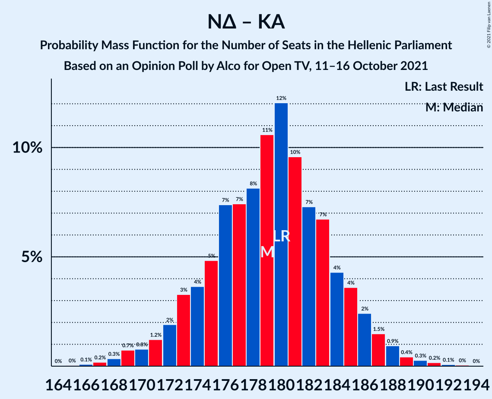
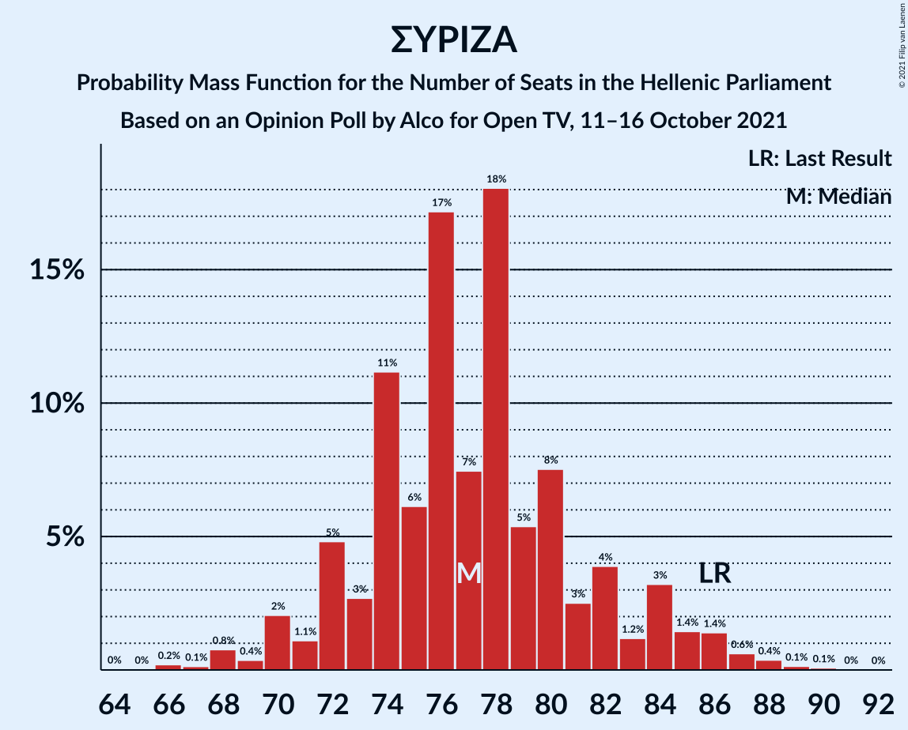

# Opinion Poll by Alco for Open TV, 11–16 October 2021

<a href="#voting-intentions">Voting Intentions</a> | <a href="#seats">Seats</a> | <a href="#coalitions">Coalitions</a> | <a href="#technical-information">Technical Information</a>

## Voting Intentions

### Confidence Intervals

| Party | Last Result | Poll Result | 80% Confidence Interval | 90% Confidence Interval | 95% Confidence Interval | 99% Confidence Interval |
|:-----:|:-----------:|:-----------:|:-----------------------:|:-----------------------:|:-----------------------:|:-----------------------:|
| Νέα Δημοκρατία | 39.8% | 39.7% | 37.7–41.7% |37.2–42.3% |36.7–42.8% |35.8–43.7% |
| Συνασπισμός Ριζοσπαστικής Αριστεράς | 31.5% | 28.3% | 26.5–30.2% |26.0–30.7% |25.6–31.2% |24.8–32.1% |
| Κίνημα Αλλαγής | 8.1% | 7.3% | 6.3–8.5% |6.1–8.8% |5.8–9.1% |5.4–9.7% |
| Κομμουνιστικό Κόμμα Ελλάδας | 5.3% | 6.0% | 5.1–7.1% |4.9–7.4% |4.7–7.7% |4.3–8.2% |
| Ελληνική Λύση | 3.7% | 5.0% | 4.2–6.0% |4.0–6.3% |3.8–6.5% |3.5–7.1% |
| Μέτωπο Ευρωπαϊκής Ρεαλιστικής Ανυπακοής | 3.4% | 4.6% | 3.9–5.6% |3.6–5.9% |3.5–6.1% |3.1–6.6% |
| Πλεύση Ελευθερίας | 1.5% | 1.8% | 1.4–2.5% |1.2–2.7% |1.1–2.8% |1.0–3.2% |

*Note:* The poll result column reflects the actual value used in the calculations. Published results may vary slightly, and in addition be rounded to fewer digits.

## Seats

### Confidence Intervals

| Party | Last Result | Median | 80% Confidence Interval | 90% Confidence Interval | 95% Confidence Interval | 99% Confidence Interval |
|:-----:|:-----------:|:------:|:-----------------------:|:-----------------------:|:-----------------------:|:-----------------------:|
| <a href="#νέα-δημοκρατία">Νέα Δημοκρατία</a> | 158 | 159 | 153–164 |152–165 |151–167 |148–169 |
| <a href="#συνασπισμός-ριζοσπαστικής-αριστεράς">Συνασπισμός Ριζοσπαστικής Αριστεράς</a> | 86 | 77 | 73–82 |72–84 |70–86 |68–88 |
| <a href="#κίνημα-αλλαγής">Κίνημα Αλλαγής</a> | 22 | 20 | 18–23 |17–24 |16–25 |15–27 |
| <a href="#κομμουνιστικό-κόμμα-ελλάδας">Κομμουνιστικό Κόμμα Ελλάδας</a> | 15 | 17 | 14–20 |14–21 |13–21 |12–23 |
| <a href="#ελληνική-λύση">Ελληνική Λύση</a> | 10 | 13 | 11–17 |11–18 |10–18 |9–19 |
| <a href="#μέτωπο-ευρωπαϊκής-ρεαλιστικής-ανυπακοής">Μέτωπο Ευρωπαϊκής Ρεαλιστικής Ανυπακοής</a> | 9 | 13 | 11–15 |10–16 |10–17 |9–18 |
| <a href="#πλεύση-ελευθερίας">Πλεύση Ελευθερίας</a> | 0 | 0 | 0 |0 |0 |0–8 |

### Νέα Δημοκρατία

*For a full overview of the results for this party, see the [Νέα Δημοκρατία](party-νέαδημοκρατία.html) page.*

| Number of Seats | Probability | Accumulated | Special Marks |
|:---------------:|:-----------:|:-----------:|:-------------:|
| 145 | 0% | 100% |  |
| 146 | 0.1% | 99.9% |  |
| 147 | 0.2% | 99.9% |  |
| 148 | 0.3% | 99.7% |  |
| 149 | 0.6% | 99.4% |  |
| 150 | 1.2% | 98.8% |  |
| 151 | 1.5% | 98% | Majority |
| 152 | 2% | 96% |  |
| 153 | 4% | 94% |  |
| 154 | 4% | 90% |  |
| 155 | 7% | 86% |  |
| 156 | 7% | 79% |  |
| 157 | 8% | 71% |  |
| 158 | 10% | 64% | Last Result |
| 159 | 12% | 54% | Median |
| 160 | 6% | 42% |  |
| 161 | 9% | 36% |  |
| 162 | 10% | 26% |  |
| 163 | 4% | 16% |  |
| 164 | 4% | 13% |  |
| 165 | 4% | 8% |  |
| 166 | 2% | 5% |  |
| 167 | 1.4% | 3% |  |
| 168 | 0.9% | 2% |  |
| 169 | 0.3% | 0.8% |  |
| 170 | 0.3% | 0.5% |  |
| 171 | 0.1% | 0.2% |  |
| 172 | 0.1% | 0.1% |  |
| 173 | 0% | 0% |  |

### Συνασπισμός Ριζοσπαστικής Αριστεράς

*For a full overview of the results for this party, see the [Συνασπισμός Ριζοσπαστικής Αριστεράς](party-συνασπισμόςριζοσπαστικήςαριστεράς.html) page.*

| Number of Seats | Probability | Accumulated | Special Marks |
|:---------------:|:-----------:|:-----------:|:-------------:|
| 65 | 0% | 100% |  |
| 66 | 0.2% | 99.9% |  |
| 67 | 0.1% | 99.7% |  |
| 68 | 0.8% | 99.6% |  |
| 69 | 0.4% | 98.8% |  |
| 70 | 2% | 98% |  |
| 71 | 1.1% | 96% |  |
| 72 | 5% | 95% |  |
| 73 | 3% | 90% |  |
| 74 | 11% | 88% |  |
| 75 | 6% | 77% |  |
| 76 | 17% | 70% |  |
| 77 | 7% | 53% | Median |
| 78 | 18% | 46% |  |
| 79 | 5% | 28% |  |
| 80 | 8% | 22% |  |
| 81 | 3% | 15% |  |
| 82 | 4% | 12% |  |
| 83 | 1.2% | 9% |  |
| 84 | 3% | 7% |  |
| 85 | 1.4% | 4% |  |
| 86 | 1.4% | 3% | Last Result |
| 87 | 0.6% | 1.3% |  |
| 88 | 0.4% | 0.6% |  |
| 89 | 0.1% | 0.3% |  |
| 90 | 0.1% | 0.1% |  |
| 91 | 0% | 0% |  |

### Κίνημα Αλλαγής

*For a full overview of the results for this party, see the [Κίνημα Αλλαγής](party-κίνημααλλαγής.html) page.*

| Number of Seats | Probability | Accumulated | Special Marks |
|:---------------:|:-----------:|:-----------:|:-------------:|
| 13 | 0.1% | 100% |  |
| 14 | 0.3% | 99.9% |  |
| 15 | 0.9% | 99.7% |  |
| 16 | 3% | 98.8% |  |
| 17 | 6% | 96% |  |
| 18 | 9% | 90% |  |
| 19 | 14% | 81% |  |
| 20 | 19% | 67% | Median |
| 21 | 19% | 48% |  |
| 22 | 13% | 30% | Last Result |
| 23 | 8% | 17% |  |
| 24 | 5% | 9% |  |
| 25 | 2% | 3% |  |
| 26 | 0.9% | 1.5% |  |
| 27 | 0.4% | 0.6% |  |
| 28 | 0.1% | 0.2% |  |
| 29 | 0% | 0.1% |  |
| 30 | 0% | 0% |  |

### Κομμουνιστικό Κόμμα Ελλάδας

*For a full overview of the results for this party, see the [Κομμουνιστικό Κόμμα Ελλάδας](party-κομμουνιστικόκόμμαελλάδας.html) page.*

| Number of Seats | Probability | Accumulated | Special Marks |
|:---------------:|:-----------:|:-----------:|:-------------:|
| 11 | 0.3% | 100% |  |
| 12 | 1.0% | 99.7% |  |
| 13 | 4% | 98.7% |  |
| 14 | 8% | 95% |  |
| 15 | 13% | 87% | Last Result |
| 16 | 19% | 74% |  |
| 17 | 16% | 55% | Median |
| 18 | 17% | 39% |  |
| 19 | 10% | 22% |  |
| 20 | 7% | 12% |  |
| 21 | 3% | 5% |  |
| 22 | 1.1% | 2% |  |
| 23 | 0.5% | 0.6% |  |
| 24 | 0.1% | 0.2% |  |
| 25 | 0% | 0% |  |

### Ελληνική Λύση

*For a full overview of the results for this party, see the [Ελληνική Λύση](party-ελληνικήλύση.html) page.*

| Number of Seats | Probability | Accumulated | Special Marks |
|:---------------:|:-----------:|:-----------:|:-------------:|
| 8 | 0% | 100% |  |
| 9 | 0.5% | 99.9% |  |
| 10 | 2% | 99.5% | Last Result |
| 11 | 10% | 97% |  |
| 12 | 19% | 88% |  |
| 13 | 22% | 69% | Median |
| 14 | 20% | 47% |  |
| 15 | 8% | 27% |  |
| 16 | 8% | 19% |  |
| 17 | 5% | 11% |  |
| 18 | 4% | 6% |  |
| 19 | 1.2% | 2% |  |
| 20 | 0.3% | 0.4% |  |
| 21 | 0.1% | 0.1% |  |
| 22 | 0% | 0% |  |

### Μέτωπο Ευρωπαϊκής Ρεαλιστικής Ανυπακοής

*For a full overview of the results for this party, see the [Μέτωπο Ευρωπαϊκής Ρεαλιστικής Ανυπακοής](party-μέτωποευρωπαϊκήςρεαλιστικήςανυπακοής.html) page.*

| Number of Seats | Probability | Accumulated | Special Marks |
|:---------------:|:-----------:|:-----------:|:-------------:|
| 0 | 0.2% | 100% |  |
| 1 | 0% | 99.8% |  |
| 2 | 0% | 99.8% |  |
| 3 | 0% | 99.8% |  |
| 4 | 0% | 99.8% |  |
| 5 | 0% | 99.8% |  |
| 6 | 0% | 99.8% |  |
| 7 | 0% | 99.8% |  |
| 8 | 0.2% | 99.8% |  |
| 9 | 2% | 99.6% | Last Result |
| 10 | 6% | 98% |  |
| 11 | 13% | 92% |  |
| 12 | 20% | 79% |  |
| 13 | 21% | 59% | Median |
| 14 | 18% | 38% |  |
| 15 | 11% | 20% |  |
| 16 | 6% | 9% |  |
| 17 | 2% | 3% |  |
| 18 | 0.8% | 1.1% |  |
| 19 | 0.2% | 0.3% |  |
| 20 | 0.1% | 0.1% |  |
| 21 | 0% | 0% |  |

### Πλεύση Ελευθερίας

*For a full overview of the results for this party, see the [Πλεύση Ελευθερίας](party-πλεύσηελευθερίας.html) page.*

| Number of Seats | Probability | Accumulated | Special Marks |
|:---------------:|:-----------:|:-----------:|:-------------:|
| 0 | 99.0% | 100% | Last Result, Median |
| 1 | 0% | 1.0% |  |
| 2 | 0% | 1.0% |  |
| 3 | 0% | 1.0% |  |
| 4 | 0% | 1.0% |  |
| 5 | 0% | 1.0% |  |
| 6 | 0% | 1.0% |  |
| 7 | 0% | 1.0% |  |
| 8 | 0.5% | 1.0% |  |
| 9 | 0.4% | 0.5% |  |
| 10 | 0.1% | 0.1% |  |
| 11 | 0% | 0% |  |

## Coalitions

### Confidence Intervals

| Coalition | Last Result | Median | Majority? | 80% Confidence Interval | 90% Confidence Interval | 95% Confidence Interval | 99% Confidence Interval |
|:---------:|:-----------:|:------:|:---------:|:-----------------------:|:-----------------------:|:-----------------------:|:-----------------------:|
| Νέα Δημοκρατία – Κίνημα Αλλαγής | 180 | 179 | 100% | 174–184 | 172–186 | 171–187 | 168–190 |
| Νέα Δημοκρατία | 158 | 159 | 98% | 153–164 | 152–165 | 151–167 | 148–169 |
| Συνασπισμός Ριζοσπαστικής Αριστεράς – Μέτωπο Ευρωπαϊκής Ρεαλιστικής Ανυπακοής | 95 | 90 | 0% | 86–95 | 84–97 | 82–98 | 80–101 |
| Συνασπισμός Ριζοσπαστικής Αριστεράς | 86 | 77 | 0% | 73–82 | 72–84 | 70–86 | 68–88 |

### Νέα Δημοκρατία – Κίνημα Αλλαγής

| Number of Seats | Probability | Accumulated | Special Marks |
|:---------------:|:-----------:|:-----------:|:-------------:|
| 165 | 0% | 100% |  |
| 166 | 0.1% | 99.9% |  |
| 167 | 0.2% | 99.8% |  |
| 168 | 0.3% | 99.7% |  |
| 169 | 0.7% | 99.3% |  |
| 170 | 0.8% | 98.6% |  |
| 171 | 1.2% | 98% |  |
| 172 | 2% | 97% |  |
| 173 | 3% | 95% |  |
| 174 | 4% | 91% |  |
| 175 | 5% | 88% |  |
| 176 | 7% | 83% |  |
| 177 | 7% | 76% |  |
| 178 | 8% | 68% |  |
| 179 | 11% | 60% | Median |
| 180 | 12% | 49% | Last Result |
| 181 | 10% | 37% |  |
| 182 | 7% | 28% |  |
| 183 | 7% | 20% |  |
| 184 | 4% | 14% |  |
| 185 | 4% | 9% |  |
| 186 | 2% | 6% |  |
| 187 | 1.5% | 3% |  |
| 188 | 0.9% | 2% |  |
| 189 | 0.4% | 1.0% |  |
| 190 | 0.3% | 0.6% |  |
| 191 | 0.2% | 0.3% |  |
| 192 | 0.1% | 0.2% |  |
| 193 | 0% | 0.1% |  |
| 194 | 0% | 0% |  |

### Νέα Δημοκρατία

| Number of Seats | Probability | Accumulated | Special Marks |
|:---------------:|:-----------:|:-----------:|:-------------:|
| 145 | 0% | 100% |  |
| 146 | 0.1% | 99.9% |  |
| 147 | 0.2% | 99.9% |  |
| 148 | 0.3% | 99.7% |  |
| 149 | 0.6% | 99.4% |  |
| 150 | 1.2% | 98.8% |  |
| 151 | 1.5% | 98% | Majority |
| 152 | 2% | 96% |  |
| 153 | 4% | 94% |  |
| 154 | 4% | 90% |  |
| 155 | 7% | 86% |  |
| 156 | 7% | 79% |  |
| 157 | 8% | 71% |  |
| 158 | 10% | 64% | Last Result |
| 159 | 12% | 54% | Median |
| 160 | 6% | 42% |  |
| 161 | 9% | 36% |  |
| 162 | 10% | 26% |  |
| 163 | 4% | 16% |  |
| 164 | 4% | 13% |  |
| 165 | 4% | 8% |  |
| 166 | 2% | 5% |  |
| 167 | 1.4% | 3% |  |
| 168 | 0.9% | 2% |  |
| 169 | 0.3% | 0.8% |  |
| 170 | 0.3% | 0.5% |  |
| 171 | 0.1% | 0.2% |  |
| 172 | 0.1% | 0.1% |  |
| 173 | 0% | 0% |  |

### Συνασπισμός Ριζοσπαστικής Αριστεράς – Μέτωπο Ευρωπαϊκής Ρεαλιστικής Ανυπακοής

| Number of Seats | Probability | Accumulated | Special Marks |
|:---------------:|:-----------:|:-----------:|:-------------:|
| 77 | 0% | 100% |  |
| 78 | 0.1% | 99.9% |  |
| 79 | 0.2% | 99.8% |  |
| 80 | 0.4% | 99.5% |  |
| 81 | 0.7% | 99.1% |  |
| 82 | 1.0% | 98% |  |
| 83 | 1.3% | 97% |  |
| 84 | 2% | 96% |  |
| 85 | 3% | 94% |  |
| 86 | 5% | 92% |  |
| 87 | 8% | 87% |  |
| 88 | 10% | 79% |  |
| 89 | 13% | 69% |  |
| 90 | 15% | 56% | Median |
| 91 | 10% | 41% |  |
| 92 | 10% | 31% |  |
| 93 | 6% | 21% |  |
| 94 | 4% | 15% |  |
| 95 | 3% | 12% | Last Result |
| 96 | 3% | 9% |  |
| 97 | 2% | 6% |  |
| 98 | 2% | 4% |  |
| 99 | 1.1% | 2% |  |
| 100 | 0.7% | 1.3% |  |
| 101 | 0.4% | 0.6% |  |
| 102 | 0.1% | 0.2% |  |
| 103 | 0.1% | 0.1% |  |
| 104 | 0% | 0% |  |

### Συνασπισμός Ριζοσπαστικής Αριστεράς

| Number of Seats | Probability | Accumulated | Special Marks |
|:---------------:|:-----------:|:-----------:|:-------------:|
| 65 | 0% | 100% |  |
| 66 | 0.2% | 99.9% |  |
| 67 | 0.1% | 99.7% |  |
| 68 | 0.8% | 99.6% |  |
| 69 | 0.4% | 98.8% |  |
| 70 | 2% | 98% |  |
| 71 | 1.1% | 96% |  |
| 72 | 5% | 95% |  |
| 73 | 3% | 90% |  |
| 74 | 11% | 88% |  |
| 75 | 6% | 77% |  |
| 76 | 17% | 70% |  |
| 77 | 7% | 53% | Median |
| 78 | 18% | 46% |  |
| 79 | 5% | 28% |  |
| 80 | 8% | 22% |  |
| 81 | 3% | 15% |  |
| 82 | 4% | 12% |  |
| 83 | 1.2% | 9% |  |
| 84 | 3% | 7% |  |
| 85 | 1.4% | 4% |  |
| 86 | 1.4% | 3% | Last Result |
| 87 | 0.6% | 1.3% |  |
| 88 | 0.4% | 0.6% |  |
| 89 | 0.1% | 0.3% |  |
| 90 | 0.1% | 0.1% |  |
| 91 | 0% | 0% |  |

## Technical Information

### Opinion Poll

+ **Polling firm:** Alco
+ **Commissioner(s):** Open TV
+ **Fieldwork period:** 11–16 October 2021

### Calculations

+ **Sample size:** 1000
+ **Simulations done:** 1,048,576
+ **Error estimate:** 1.59%

