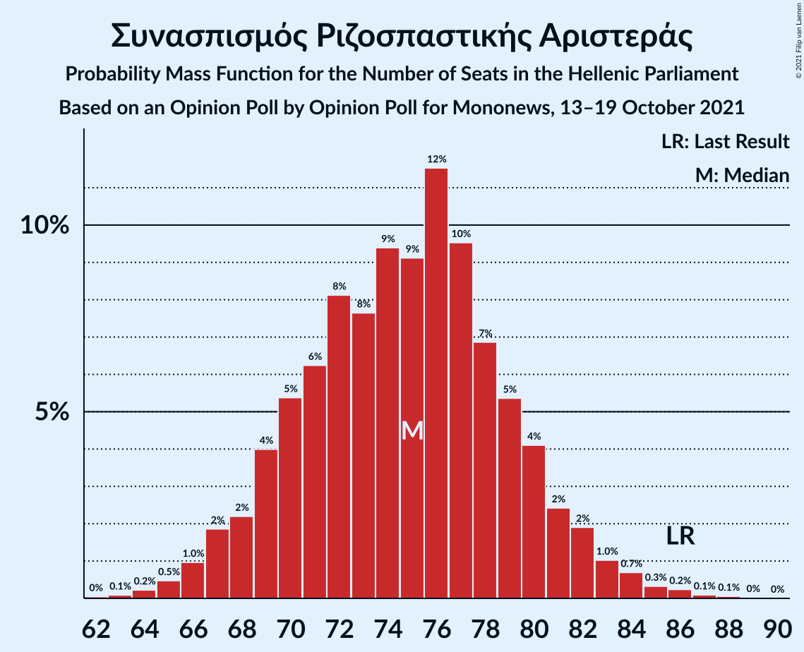
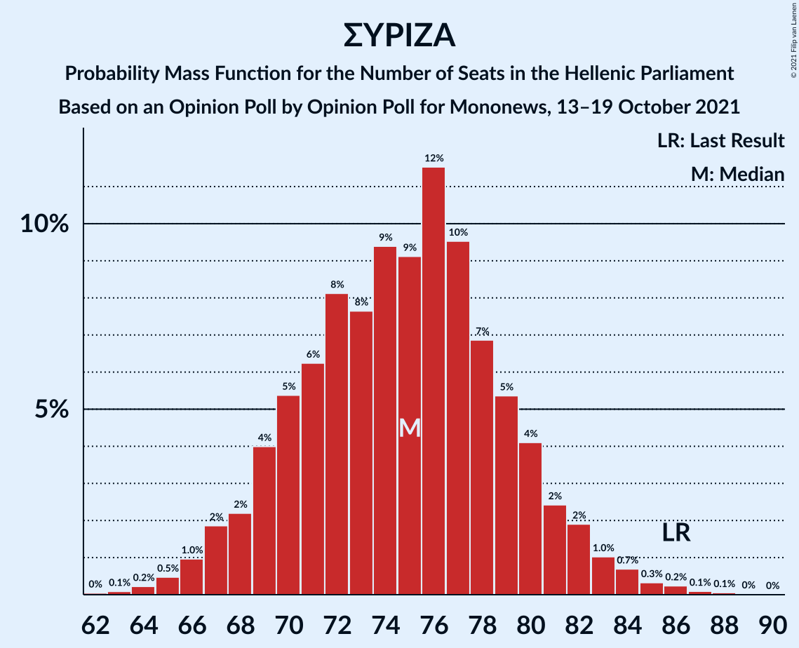

# Opinion Poll by Opinion Poll for Mononews, 13–19 October 2021

<a href="#voting-intentions">Voting Intentions</a> | <a href="#seats">Seats</a> | <a href="#coalitions">Coalitions</a> | <a href="#technical-information">Technical Information</a>

## Voting Intentions

### Confidence Intervals

| Party | Last Result | Poll Result | 80% Confidence Interval | 90% Confidence Interval | 95% Confidence Interval | 99% Confidence Interval |
|:-----:|:-----------:|:-----------:|:-----------------------:|:-----------------------:|:-----------------------:|:-----------------------:|
| Νέα Δημοκρατία | 39.8% | 43.7% | 41.7–45.7% |41.1–46.3% |40.6–46.8% |39.7–47.8% |
| Συνασπισμός Ριζοσπαστικής Αριστεράς | 31.5% | 27.3% | 25.5–29.1% |25.0–29.6% |24.6–30.1% |23.8–31.0% |
| Κίνημα Αλλαγής | 8.1% | 7.5% | 6.5–8.6% |6.2–9.0% |6.0–9.3% |5.6–9.8% |
| Κομμουνιστικό Κόμμα Ελλάδας | 5.3% | 6.5% | 5.6–7.6% |5.3–7.9% |5.1–8.2% |4.7–8.7% |
| Ελληνική Λύση | 3.7% | 5.0% | 4.2–6.0% |4.0–6.2% |3.8–6.5% |3.4–7.0% |
| Μέτωπο Ευρωπαϊκής Ρεαλιστικής Ανυπακοής | 3.4% | 2.8% | 2.2–3.6% |2.1–3.8% |1.9–4.0% |1.7–4.4% |
| Πλεύση Ελευθερίας | 1.5% | 1.5% | 1.1–2.1% |1.0–2.3% |0.9–2.5% |0.7–2.8% |

*Note:* The poll result column reflects the actual value used in the calculations. Published results may vary slightly, and in addition be rounded to fewer digits.

## Seats

### Confidence Intervals

| Party | Last Result | Median | 80% Confidence Interval | 90% Confidence Interval | 95% Confidence Interval | 99% Confidence Interval |
|:-----:|:-----------:|:------:|:-----------------------:|:-----------------------:|:-----------------------:|:-----------------------:|
| <a href="#νέα-δημοκρατία">Νέα Δημοκρατία</a> | 158 | 170 | 163–175 |162–177 |161–178 |157–182 |
| <a href="#συνασπισμός-ριζοσπαστικής-αριστεράς">Συνασπισμός Ριζοσπαστικής Αριστεράς</a> | 86 | 74 | 69–80 |68–82 |67–83 |65–85 |
| <a href="#κίνημα-αλλαγής">Κίνημα Αλλαγής</a> | 22 | 21 | 18–24 |17–25 |16–26 |15–27 |
| <a href="#κομμουνιστικό-κόμμα-ελλάδας">Κομμουνιστικό Κόμμα Ελλάδας</a> | 15 | 18 | 15–21 |15–22 |14–23 |13–24 |
| <a href="#ελληνική-λύση">Ελληνική Λύση</a> | 10 | 13 | 11–16 |11–18 |10–18 |9–19 |
| <a href="#μέτωπο-ευρωπαϊκής-ρεαλιστικής-ανυπακοής">Μέτωπο Ευρωπαϊκής Ρεαλιστικής Ανυπακοής</a> | 9 | 0 | 0–10 |0–10 |0–11 |0–12 |
| <a href="#πλεύση-ελευθερίας">Πλεύση Ελευθερίας</a> | 0 | 0 | 0 |0 |0 |0 |

### Νέα Δημοκρατία

*For a full overview of the results for this party, see the [Νέα Δημοκρατία](party-νέαδημοκρατία.html) page.*

| Number of Seats | Probability | Accumulated | Special Marks |
|:---------------:|:-----------:|:-----------:|:-------------:|
| 154 | 0% | 100% |  |
| 155 | 0% | 99.9% |  |
| 156 | 0.1% | 99.9% |  |
| 157 | 0.3% | 99.8% |  |
| 158 | 0.6% | 99.5% | Last Result |
| 159 | 0.5% | 98.9% |  |
| 160 | 0.7% | 98% |  |
| 161 | 2% | 98% |  |
| 162 | 4% | 96% |  |
| 163 | 4% | 91% |  |
| 164 | 2% | 87% |  |
| 165 | 5% | 85% |  |
| 166 | 10% | 80% |  |
| 167 | 7% | 70% |  |
| 168 | 4% | 63% |  |
| 169 | 5% | 59% |  |
| 170 | 15% | 54% | Median |
| 171 | 10% | 39% |  |
| 172 | 4% | 29% |  |
| 173 | 7% | 26% |  |
| 174 | 6% | 19% |  |
| 175 | 4% | 13% |  |
| 176 | 1.0% | 8% |  |
| 177 | 4% | 7% |  |
| 178 | 2% | 3% |  |
| 179 | 0.3% | 2% |  |
| 180 | 0.2% | 1.3% |  |
| 181 | 0.4% | 1.1% |  |
| 182 | 0.4% | 0.8% |  |
| 183 | 0.3% | 0.4% |  |
| 184 | 0.1% | 0.1% |  |
| 185 | 0% | 0% |  |

### Συνασπισμός Ριζοσπαστικής Αριστεράς

*For a full overview of the results for this party, see the [Συνασπισμός Ριζοσπαστικής Αριστεράς](party-συνασπισμόςριζοσπαστικήςαριστεράς.html) page.*

| Number of Seats | Probability | Accumulated | Special Marks |
|:---------------:|:-----------:|:-----------:|:-------------:|
| 62 | 0% | 100% |  |
| 63 | 0.1% | 99.9% |  |
| 64 | 0.1% | 99.8% |  |
| 65 | 0.4% | 99.7% |  |
| 66 | 2% | 99.3% |  |
| 67 | 1.0% | 98% |  |
| 68 | 5% | 97% |  |
| 69 | 4% | 92% |  |
| 70 | 10% | 88% |  |
| 71 | 4% | 79% |  |
| 72 | 12% | 75% |  |
| 73 | 8% | 63% |  |
| 74 | 8% | 55% | Median |
| 75 | 10% | 48% |  |
| 76 | 5% | 38% |  |
| 77 | 9% | 33% |  |
| 78 | 5% | 24% |  |
| 79 | 3% | 20% |  |
| 80 | 7% | 17% |  |
| 81 | 2% | 9% |  |
| 82 | 4% | 7% |  |
| 83 | 0.8% | 3% |  |
| 84 | 0.8% | 2% |  |
| 85 | 0.6% | 1.0% |  |
| 86 | 0.2% | 0.4% | Last Result |
| 87 | 0% | 0.1% |  |
| 88 | 0.1% | 0.1% |  |
| 89 | 0% | 0% |  |

### Κίνημα Αλλαγής

*For a full overview of the results for this party, see the [Κίνημα Αλλαγής](party-κίνημααλλαγής.html) page.*

| Number of Seats | Probability | Accumulated | Special Marks |
|:---------------:|:-----------:|:-----------:|:-------------:|
| 14 | 0.1% | 100% |  |
| 15 | 0.6% | 99.8% |  |
| 16 | 2% | 99.2% |  |
| 17 | 4% | 97% |  |
| 18 | 11% | 93% |  |
| 19 | 17% | 83% |  |
| 20 | 12% | 65% |  |
| 21 | 17% | 53% | Median |
| 22 | 17% | 36% | Last Result |
| 23 | 7% | 19% |  |
| 24 | 6% | 12% |  |
| 25 | 3% | 6% |  |
| 26 | 2% | 3% |  |
| 27 | 0.7% | 1.0% |  |
| 28 | 0.2% | 0.3% |  |
| 29 | 0.1% | 0.1% |  |
| 30 | 0% | 0% |  |

### Κομμουνιστικό Κόμμα Ελλάδας

*For a full overview of the results for this party, see the [Κομμουνιστικό Κόμμα Ελλάδας](party-κομμουνιστικόκόμμαελλάδας.html) page.*

| Number of Seats | Probability | Accumulated | Special Marks |
|:---------------:|:-----------:|:-----------:|:-------------:|
| 12 | 0.3% | 100% |  |
| 13 | 1.3% | 99.7% |  |
| 14 | 2% | 98% |  |
| 15 | 11% | 96% | Last Result |
| 16 | 11% | 85% |  |
| 17 | 12% | 74% |  |
| 18 | 25% | 62% | Median |
| 19 | 9% | 37% |  |
| 20 | 10% | 28% |  |
| 21 | 13% | 18% |  |
| 22 | 3% | 6% |  |
| 23 | 1.4% | 3% |  |
| 24 | 0.9% | 1.2% |  |
| 25 | 0.2% | 0.3% |  |
| 26 | 0.1% | 0.1% |  |
| 27 | 0% | 0% |  |

### Ελληνική Λύση

*For a full overview of the results for this party, see the [Ελληνική Λύση](party-ελληνικήλύση.html) page.*

| Number of Seats | Probability | Accumulated | Special Marks |
|:---------------:|:-----------:|:-----------:|:-------------:|
| 8 | 0% | 100% |  |
| 9 | 0.8% | 99.9% |  |
| 10 | 3% | 99.1% | Last Result |
| 11 | 7% | 96% |  |
| 12 | 12% | 89% |  |
| 13 | 26% | 76% | Median |
| 14 | 21% | 50% |  |
| 15 | 12% | 29% |  |
| 16 | 7% | 16% |  |
| 17 | 4% | 9% |  |
| 18 | 4% | 5% |  |
| 19 | 1.2% | 1.5% |  |
| 20 | 0.2% | 0.3% |  |
| 21 | 0.1% | 0.1% |  |
| 22 | 0% | 0% |  |

### Μέτωπο Ευρωπαϊκής Ρεαλιστικής Ανυπακοής

*For a full overview of the results for this party, see the [Μέτωπο Ευρωπαϊκής Ρεαλιστικής Ανυπακοής](party-μέτωποευρωπαϊκήςρεαλιστικήςανυπακοής.html) page.*

| Number of Seats | Probability | Accumulated | Special Marks |
|:---------------:|:-----------:|:-----------:|:-------------:|
| 0 | 59% | 100% | Median |
| 1 | 0% | 41% |  |
| 2 | 0% | 41% |  |
| 3 | 0% | 41% |  |
| 4 | 0% | 41% |  |
| 5 | 0% | 41% |  |
| 6 | 0% | 41% |  |
| 7 | 0% | 41% |  |
| 8 | 8% | 41% |  |
| 9 | 19% | 32% | Last Result |
| 10 | 10% | 14% |  |
| 11 | 2% | 3% |  |
| 12 | 0.9% | 1.0% |  |
| 13 | 0.1% | 0.1% |  |
| 14 | 0% | 0% |  |

### Πλεύση Ελευθερίας

*For a full overview of the results for this party, see the [Πλεύση Ελευθερίας](party-πλεύσηελευθερίας.html) page.*

| Number of Seats | Probability | Accumulated | Special Marks |
|:---------------:|:-----------:|:-----------:|:-------------:|
| 0 | 99.8% | 100% | Last Result, Median |
| 1 | 0% | 0.2% |  |
| 2 | 0% | 0.2% |  |
| 3 | 0% | 0.2% |  |
| 4 | 0% | 0.2% |  |
| 5 | 0% | 0.2% |  |
| 6 | 0% | 0.2% |  |
| 7 | 0% | 0.2% |  |
| 8 | 0.1% | 0.2% |  |
| 9 | 0.1% | 0.1% |  |
| 10 | 0% | 0% |  |

## Coalitions

### Confidence Intervals

| Coalition | Last Result | Median | Majority? | 80% Confidence Interval | 90% Confidence Interval | 95% Confidence Interval | 99% Confidence Interval |
|:---------:|:-----------:|:------:|:---------:|:-----------------------:|:-----------------------:|:-----------------------:|:-----------------------:|
| Νέα Δημοκρατία – Κίνημα Αλλαγής | 180 | 190 | 100% | 185–197 | 182–199 | 181–199 | 177–202 |
| Νέα Δημοκρατία | 158 | 170 | 100% | 163–175 | 162–177 | 161–178 | 157–182 |
| Συνασπισμός Ριζοσπαστικής Αριστεράς – Μέτωπο Ευρωπαϊκής Ρεαλιστικής Ανυπακοής | 95 | 79 | 0% | 72–84 | 70–87 | 69–88 | 66–91 |
| Συνασπισμός Ριζοσπαστικής Αριστεράς | 86 | 74 | 0% | 69–80 | 68–82 | 67–83 | 65–85 |

### Νέα Δημοκρατία – Κίνημα Αλλαγής

| Number of Seats | Probability | Accumulated | Special Marks |
|:---------------:|:-----------:|:-----------:|:-------------:|
| 175 | 0% | 100% |  |
| 176 | 0.1% | 99.9% |  |
| 177 | 0.4% | 99.9% |  |
| 178 | 0.2% | 99.4% |  |
| 179 | 0.6% | 99.3% |  |
| 180 | 0.8% | 98.7% | Last Result |
| 181 | 2% | 98% |  |
| 182 | 2% | 96% |  |
| 183 | 3% | 94% |  |
| 184 | 0.4% | 91% |  |
| 185 | 8% | 90% |  |
| 186 | 8% | 82% |  |
| 187 | 5% | 74% |  |
| 188 | 5% | 69% |  |
| 189 | 12% | 63% |  |
| 190 | 9% | 52% |  |
| 191 | 8% | 43% | Median |
| 192 | 5% | 35% |  |
| 193 | 7% | 30% |  |
| 194 | 5% | 22% |  |
| 195 | 4% | 17% |  |
| 196 | 3% | 13% |  |
| 197 | 1.0% | 10% |  |
| 198 | 2% | 9% |  |
| 199 | 5% | 7% |  |
| 200 | 0.2% | 2% |  |
| 201 | 0.5% | 2% |  |
| 202 | 0.9% | 1.2% |  |
| 203 | 0.2% | 0.3% |  |
| 204 | 0% | 0.1% |  |
| 205 | 0.1% | 0.1% |  |
| 206 | 0% | 0% |  |

### Νέα Δημοκρατία

| Number of Seats | Probability | Accumulated | Special Marks |
|:---------------:|:-----------:|:-----------:|:-------------:|
| 154 | 0% | 100% |  |
| 155 | 0% | 99.9% |  |
| 156 | 0.1% | 99.9% |  |
| 157 | 0.3% | 99.8% |  |
| 158 | 0.6% | 99.5% | Last Result |
| 159 | 0.5% | 98.9% |  |
| 160 | 0.7% | 98% |  |
| 161 | 2% | 98% |  |
| 162 | 4% | 96% |  |
| 163 | 4% | 91% |  |
| 164 | 2% | 87% |  |
| 165 | 5% | 85% |  |
| 166 | 10% | 80% |  |
| 167 | 7% | 70% |  |
| 168 | 4% | 63% |  |
| 169 | 5% | 59% |  |
| 170 | 15% | 54% | Median |
| 171 | 10% | 39% |  |
| 172 | 4% | 29% |  |
| 173 | 7% | 26% |  |
| 174 | 6% | 19% |  |
| 175 | 4% | 13% |  |
| 176 | 1.0% | 8% |  |
| 177 | 4% | 7% |  |
| 178 | 2% | 3% |  |
| 179 | 0.3% | 2% |  |
| 180 | 0.2% | 1.3% |  |
| 181 | 0.4% | 1.1% |  |
| 182 | 0.4% | 0.8% |  |
| 183 | 0.3% | 0.4% |  |
| 184 | 0.1% | 0.1% |  |
| 185 | 0% | 0% |  |

### Συνασπισμός Ριζοσπαστικής Αριστεράς – Μέτωπο Ευρωπαϊκής Ρεαλιστικής Ανυπακοής

| Number of Seats | Probability | Accumulated | Special Marks |
|:---------------:|:-----------:|:-----------:|:-------------:|
| 64 | 0% | 100% |  |
| 65 | 0.1% | 99.9% |  |
| 66 | 0.5% | 99.8% |  |
| 67 | 0.4% | 99.3% |  |
| 68 | 1.1% | 98.9% |  |
| 69 | 0.8% | 98% |  |
| 70 | 4% | 97% |  |
| 71 | 2% | 93% |  |
| 72 | 5% | 91% |  |
| 73 | 6% | 86% |  |
| 74 | 4% | 80% | Median |
| 75 | 8% | 77% |  |
| 76 | 2% | 68% |  |
| 77 | 10% | 66% |  |
| 78 | 5% | 56% |  |
| 79 | 8% | 51% |  |
| 80 | 11% | 43% |  |
| 81 | 5% | 32% |  |
| 82 | 10% | 27% |  |
| 83 | 4% | 17% |  |
| 84 | 4% | 13% |  |
| 85 | 3% | 10% |  |
| 86 | 1.2% | 6% |  |
| 87 | 2% | 5% |  |
| 88 | 0.9% | 3% |  |
| 89 | 1.2% | 2% |  |
| 90 | 0.4% | 0.9% |  |
| 91 | 0.3% | 0.5% |  |
| 92 | 0.1% | 0.2% |  |
| 93 | 0% | 0.1% |  |
| 94 | 0.1% | 0.1% |  |
| 95 | 0% | 0% | Last Result |

### Συνασπισμός Ριζοσπαστικής Αριστεράς

| Number of Seats | Probability | Accumulated | Special Marks |
|:---------------:|:-----------:|:-----------:|:-------------:|
| 62 | 0% | 100% |  |
| 63 | 0.1% | 99.9% |  |
| 64 | 0.1% | 99.8% |  |
| 65 | 0.4% | 99.7% |  |
| 66 | 2% | 99.3% |  |
| 67 | 1.0% | 98% |  |
| 68 | 5% | 97% |  |
| 69 | 4% | 92% |  |
| 70 | 10% | 88% |  |
| 71 | 4% | 79% |  |
| 72 | 12% | 75% |  |
| 73 | 8% | 63% |  |
| 74 | 8% | 55% | Median |
| 75 | 10% | 48% |  |
| 76 | 5% | 38% |  |
| 77 | 9% | 33% |  |
| 78 | 5% | 24% |  |
| 79 | 3% | 20% |  |
| 80 | 7% | 17% |  |
| 81 | 2% | 9% |  |
| 82 | 4% | 7% |  |
| 83 | 0.8% | 3% |  |
| 84 | 0.8% | 2% |  |
| 85 | 0.6% | 1.0% |  |
| 86 | 0.2% | 0.4% | Last Result |
| 87 | 0% | 0.1% |  |
| 88 | 0.1% | 0.1% |  |
| 89 | 0% | 0% |  |

## Technical Information

### Opinion Poll

+ **Polling firm:** Opinion Poll
+ **Commissioner(s):** Mononews
+ **Fieldwork period:** 13–19 October 2021

### Calculations

+ **Sample size:** 1005
+ **Simulations done:** 131,072
+ **Error estimate:** 1.74%

