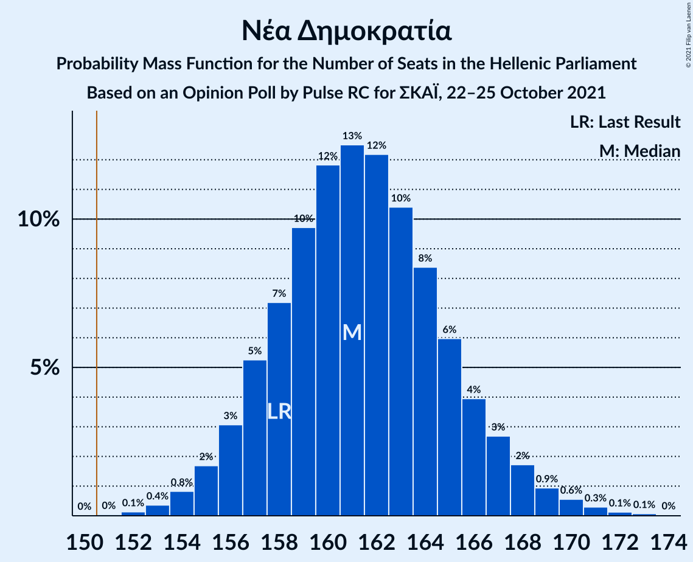
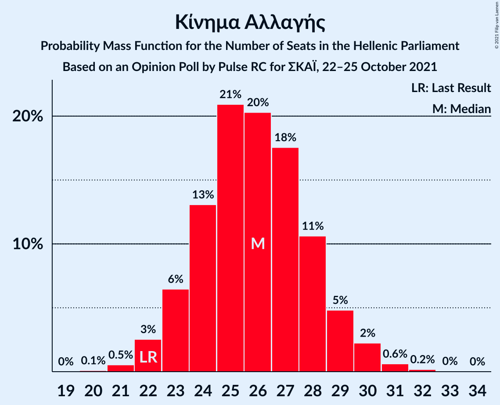
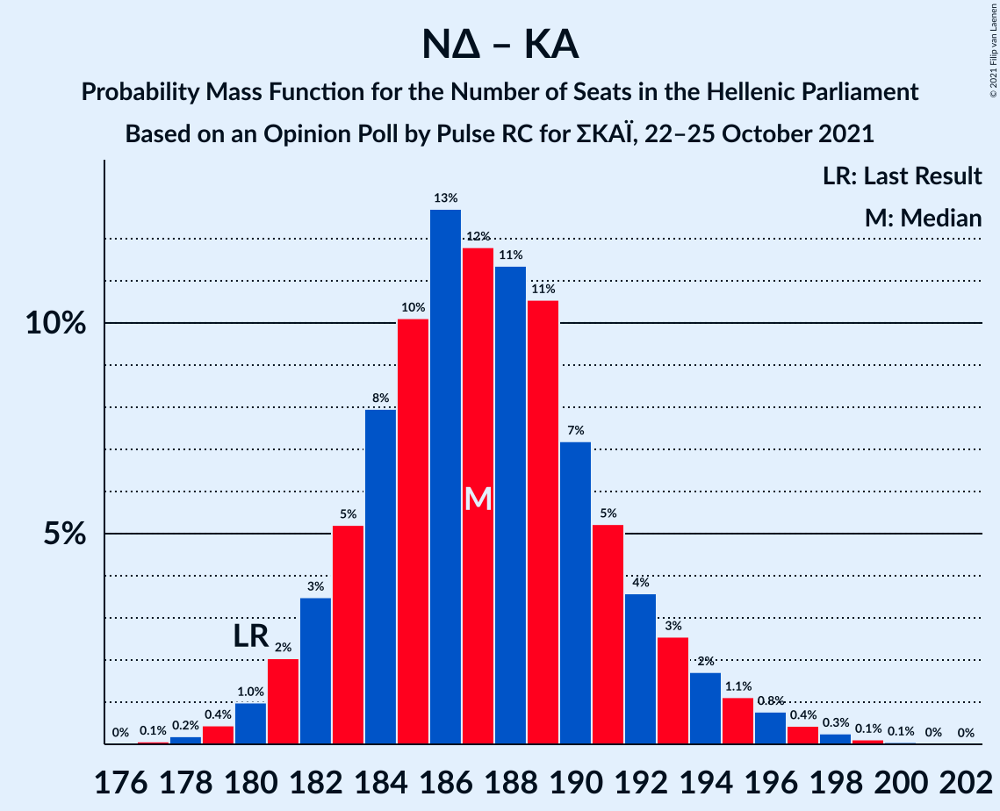
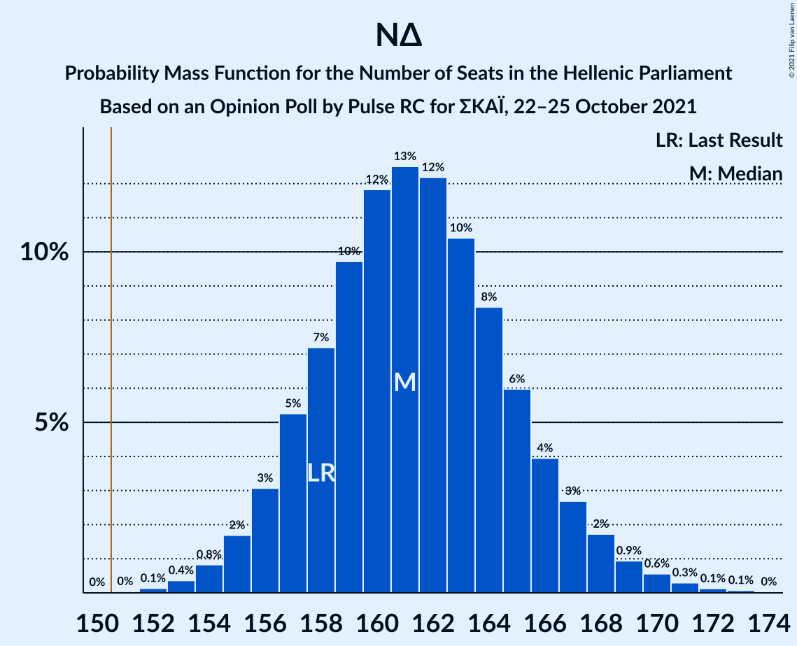
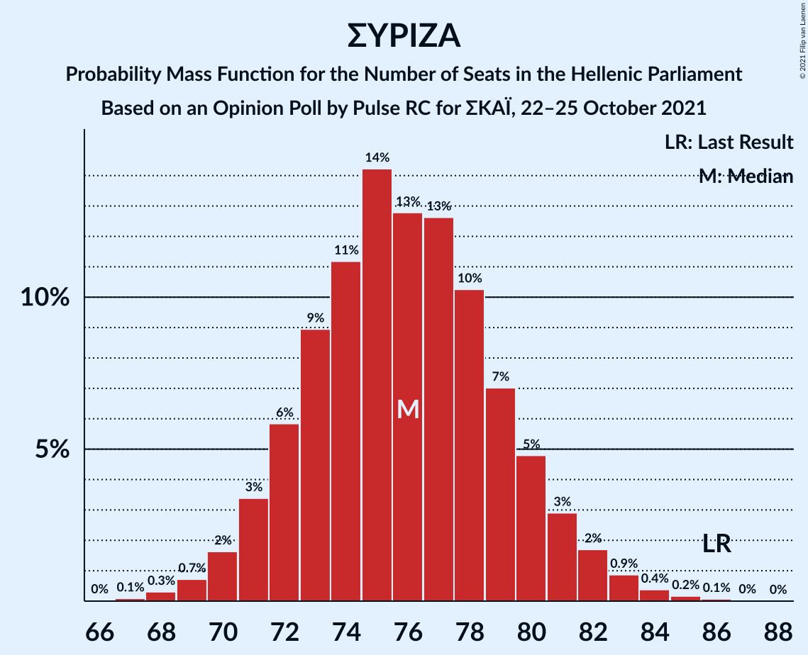

# Opinion Poll by Pulse RC for ΣΚΑΪ, 22–25 October 2021

<a href="#voting-intentions">Voting Intentions</a> | <a href="#seats">Seats</a> | <a href="#coalitions">Coalitions</a> | <a href="#technical-information">Technical Information</a>

## Voting Intentions

### Confidence Intervals

| Party | Last Result | Poll Result | 80% Confidence Interval | 90% Confidence Interval | 95% Confidence Interval | 99% Confidence Interval |
|:-----:|:-----------:|:-----------:|:-----------------------:|:-----------------------:|:-----------------------:|:-----------------------:|
| Νέα Δημοκρατία | 39.8% | 40.1% | 38.7–41.6% |38.3–42.0% |37.9–42.3% |37.3–43.0% |
| Συνασπισμός Ριζοσπαστικής Αριστεράς | 31.5% | 27.3% | 26.0–28.7% |25.7–29.0% |25.4–29.4% |24.8–30.0% |
| Κίνημα Αλλαγής | 8.1% | 9.3% | 8.5–10.2% |8.2–10.5% |8.0–10.7% |7.7–11.1% |
| Κομμουνιστικό Κόμμα Ελλάδας | 5.3% | 5.8% | 5.2–6.6% |5.0–6.8% |4.8–7.0% |4.6–7.3% |
| Ελληνική Λύση | 3.7% | 4.1% | 3.6–4.7% |3.4–4.9% |3.3–5.1% |3.0–5.4% |
| Μέτωπο Ευρωπαϊκής Ρεαλιστικής Ανυπακοής | 3.4% | 3.5% | 3.0–4.1% |2.9–4.3% |2.8–4.5% |2.6–4.8% |

*Note:* The poll result column reflects the actual value used in the calculations. Published results may vary slightly, and in addition be rounded to fewer digits.

## Seats

### Confidence Intervals

| Party | Last Result | Median | 80% Confidence Interval | 90% Confidence Interval | 95% Confidence Interval | 99% Confidence Interval |
|:-----:|:-----------:|:------:|:-----------------------:|:-----------------------:|:-----------------------:|:-----------------------:|
| <a href="#νέα-δημοκρατία">Νέα Δημοκρατία</a> | 158 | 161 | 157–166 |156–168 |155–168 |153–170 |
| <a href="#συνασπισμός-ριζοσπαστικής-αριστεράς">Συνασπισμός Ριζοσπαστικής Αριστεράς</a> | 86 | 76 | 72–80 |71–81 |71–82 |68–83 |
| <a href="#κίνημα-αλλαγής">Κίνημα Αλλαγής</a> | 22 | 26 | 24–28 |23–29 |22–30 |21–31 |
| <a href="#κομμουνιστικό-κόμμα-ελλάδας">Κομμουνιστικό Κόμμα Ελλάδας</a> | 15 | 16 | 14–18 |14–19 |13–19 |13–20 |
| <a href="#ελληνική-λύση">Ελληνική Λύση</a> | 10 | 12 | 10–13 |9–14 |9–14 |8–15 |
| <a href="#μέτωπο-ευρωπαϊκής-ρεαλιστικής-ανυπακοής">Μέτωπο Ευρωπαϊκής Ρεαλιστικής Ανυπακοής</a> | 9 | 10 | 0–11 |0–12 |0–12 |0–13 |

### Νέα Δημοκρατία

*For a full overview of the results for this party, see the [Νέα Δημοκρατία](party-νέαδημοκρατία.html) page.*

| Number of Seats | Probability | Accumulated | Special Marks |
|:---------------:|:-----------:|:-----------:|:-------------:|
| 151 | 0% | 100% | Majority |
| 152 | 0.1% | 99.9% |  |
| 153 | 0.4% | 99.8% |  |
| 154 | 0.8% | 99.5% |  |
| 155 | 2% | 98.7% |  |
| 156 | 4% | 97% |  |
| 157 | 5% | 93% |  |
| 158 | 5% | 89% | Last Result |
| 159 | 10% | 84% |  |
| 160 | 10% | 74% |  |
| 161 | 14% | 63% | Median |
| 162 | 14% | 50% |  |
| 163 | 10% | 35% |  |
| 164 | 7% | 25% |  |
| 165 | 6% | 18% |  |
| 166 | 3% | 12% |  |
| 167 | 3% | 8% |  |
| 168 | 3% | 5% |  |
| 169 | 1.2% | 2% |  |
| 170 | 0.7% | 1.2% |  |
| 171 | 0.2% | 0.4% |  |
| 172 | 0.1% | 0.3% |  |
| 173 | 0.1% | 0.1% |  |
| 174 | 0% | 0% |  |

### Συνασπισμός Ριζοσπαστικής Αριστεράς

*For a full overview of the results for this party, see the [Συνασπισμός Ριζοσπαστικής Αριστεράς](party-συνασπισμόςριζοσπαστικήςαριστεράς.html) page.*

| Number of Seats | Probability | Accumulated | Special Marks |
|:---------------:|:-----------:|:-----------:|:-------------:|
| 67 | 0.1% | 100% |  |
| 68 | 0.6% | 99.9% |  |
| 69 | 0.4% | 99.3% |  |
| 70 | 1.3% | 98.9% |  |
| 71 | 3% | 98% |  |
| 72 | 7% | 94% |  |
| 73 | 10% | 88% |  |
| 74 | 13% | 77% |  |
| 75 | 12% | 64% |  |
| 76 | 12% | 52% | Median |
| 77 | 14% | 41% |  |
| 78 | 7% | 26% |  |
| 79 | 9% | 19% |  |
| 80 | 3% | 10% |  |
| 81 | 4% | 7% |  |
| 82 | 1.2% | 3% |  |
| 83 | 0.8% | 1.3% |  |
| 84 | 0.2% | 0.5% |  |
| 85 | 0.1% | 0.3% |  |
| 86 | 0.1% | 0.2% | Last Result |
| 87 | 0% | 0.1% |  |
| 88 | 0% | 0% |  |

### Κίνημα Αλλαγής

*For a full overview of the results for this party, see the [Κίνημα Αλλαγής](party-κίνημααλλαγής.html) page.*

| Number of Seats | Probability | Accumulated | Special Marks |
|:---------------:|:-----------:|:-----------:|:-------------:|
| 20 | 0.1% | 100% |  |
| 21 | 0.6% | 99.9% |  |
| 22 | 4% | 99.3% | Last Result |
| 23 | 4% | 96% |  |
| 24 | 14% | 92% |  |
| 25 | 27% | 78% |  |
| 26 | 13% | 51% | Median |
| 27 | 18% | 38% |  |
| 28 | 13% | 20% |  |
| 29 | 4% | 8% |  |
| 30 | 3% | 3% |  |
| 31 | 0.6% | 0.8% |  |
| 32 | 0.1% | 0.2% |  |
| 33 | 0.1% | 0.1% |  |
| 34 | 0% | 0% |  |

### Κομμουνιστικό Κόμμα Ελλάδας

*For a full overview of the results for this party, see the [Κομμουνιστικό Κόμμα Ελλάδας](party-κομμουνιστικόκόμμαελλάδας.html) page.*

| Number of Seats | Probability | Accumulated | Special Marks |
|:---------------:|:-----------:|:-----------:|:-------------:|
| 12 | 0.4% | 100% |  |
| 13 | 2% | 99.6% |  |
| 14 | 10% | 97% |  |
| 15 | 19% | 87% | Last Result |
| 16 | 28% | 68% | Median |
| 17 | 19% | 40% |  |
| 18 | 12% | 21% |  |
| 19 | 7% | 9% |  |
| 20 | 1.4% | 2% |  |
| 21 | 0.4% | 0.5% |  |
| 22 | 0.1% | 0.1% |  |
| 23 | 0% | 0% |  |

### Ελληνική Λύση

*For a full overview of the results for this party, see the [Ελληνική Λύση](party-ελληνικήλύση.html) page.*

| Number of Seats | Probability | Accumulated | Special Marks |
|:---------------:|:-----------:|:-----------:|:-------------:|
| 0 | 0.4% | 100% |  |
| 1 | 0% | 99.6% |  |
| 2 | 0% | 99.6% |  |
| 3 | 0% | 99.6% |  |
| 4 | 0% | 99.6% |  |
| 5 | 0% | 99.6% |  |
| 6 | 0% | 99.6% |  |
| 7 | 0% | 99.6% |  |
| 8 | 0.2% | 99.6% |  |
| 9 | 5% | 99.4% |  |
| 10 | 14% | 95% | Last Result |
| 11 | 26% | 80% |  |
| 12 | 30% | 54% | Median |
| 13 | 17% | 24% |  |
| 14 | 5% | 6% |  |
| 15 | 0.9% | 1.1% |  |
| 16 | 0.2% | 0.2% |  |
| 17 | 0% | 0% |  |

### Μέτωπο Ευρωπαϊκής Ρεαλιστικής Ανυπακοής

*For a full overview of the results for this party, see the [Μέτωπο Ευρωπαϊκής Ρεαλιστικής Ανυπακοής](party-μέτωποευρωπαϊκήςρεαλιστικήςανυπακοής.html) page.*

| Number of Seats | Probability | Accumulated | Special Marks |
|:---------------:|:-----------:|:-----------:|:-------------:|
| 0 | 11% | 100% |  |
| 1 | 0% | 89% |  |
| 2 | 0% | 89% |  |
| 3 | 0% | 89% |  |
| 4 | 0% | 89% |  |
| 5 | 0% | 89% |  |
| 6 | 0% | 89% |  |
| 7 | 0% | 89% |  |
| 8 | 3% | 89% |  |
| 9 | 23% | 86% | Last Result |
| 10 | 34% | 62% | Median |
| 11 | 18% | 28% |  |
| 12 | 8% | 10% |  |
| 13 | 1.3% | 2% |  |
| 14 | 0.2% | 0.3% |  |
| 15 | 0% | 0% |  |

## Coalitions

### Confidence Intervals

| Coalition | Last Result | Median | Majority? | 80% Confidence Interval | 90% Confidence Interval | 95% Confidence Interval | 99% Confidence Interval |
|:---------:|:-----------:|:------:|:---------:|:-----------------------:|:-----------------------:|:-----------------------:|:-----------------------:|
| Νέα Δημοκρατία – Κίνημα Αλλαγής | 180 | 187 | 100% | 183–192 | 182–194 | 181–195 | 179–197 |
| Νέα Δημοκρατία | 158 | 161 | 100% | 157–166 | 156–168 | 155–168 | 153–170 |
| Συνασπισμός Ριζοσπαστικής Αριστεράς – Μέτωπο Ευρωπαϊκής Ρεαλιστικής Ανυπακοής | 95 | 85 | 0% | 80–89 | 78–90 | 76–91 | 75–93 |
| Συνασπισμός Ριζοσπαστικής Αριστεράς | 86 | 76 | 0% | 72–80 | 71–81 | 71–82 | 68–83 |

### Νέα Δημοκρατία – Κίνημα Αλλαγής

| Number of Seats | Probability | Accumulated | Special Marks |
|:---------------:|:-----------:|:-----------:|:-------------:|
| 177 | 0.1% | 100% |  |
| 178 | 0.2% | 99.9% |  |
| 179 | 0.5% | 99.7% |  |
| 180 | 1.1% | 99.3% | Last Result |
| 181 | 2% | 98% |  |
| 182 | 3% | 96% |  |
| 183 | 5% | 94% |  |
| 184 | 7% | 89% |  |
| 185 | 10% | 82% |  |
| 186 | 14% | 72% |  |
| 187 | 13% | 58% | Median |
| 188 | 13% | 45% |  |
| 189 | 9% | 32% |  |
| 190 | 5% | 23% |  |
| 191 | 5% | 18% |  |
| 192 | 4% | 13% |  |
| 193 | 4% | 9% |  |
| 194 | 2% | 6% |  |
| 195 | 1.3% | 4% |  |
| 196 | 2% | 2% |  |
| 197 | 0.2% | 0.6% |  |
| 198 | 0.2% | 0.4% |  |
| 199 | 0.1% | 0.2% |  |
| 200 | 0% | 0.1% |  |
| 201 | 0% | 0% |  |

### Νέα Δημοκρατία

| Number of Seats | Probability | Accumulated | Special Marks |
|:---------------:|:-----------:|:-----------:|:-------------:|
| 151 | 0% | 100% | Majority |
| 152 | 0.1% | 99.9% |  |
| 153 | 0.4% | 99.8% |  |
| 154 | 0.8% | 99.5% |  |
| 155 | 2% | 98.7% |  |
| 156 | 4% | 97% |  |
| 157 | 5% | 93% |  |
| 158 | 5% | 89% | Last Result |
| 159 | 10% | 84% |  |
| 160 | 10% | 74% |  |
| 161 | 14% | 63% | Median |
| 162 | 14% | 50% |  |
| 163 | 10% | 35% |  |
| 164 | 7% | 25% |  |
| 165 | 6% | 18% |  |
| 166 | 3% | 12% |  |
| 167 | 3% | 8% |  |
| 168 | 3% | 5% |  |
| 169 | 1.2% | 2% |  |
| 170 | 0.7% | 1.2% |  |
| 171 | 0.2% | 0.4% |  |
| 172 | 0.1% | 0.3% |  |
| 173 | 0.1% | 0.1% |  |
| 174 | 0% | 0% |  |

### Συνασπισμός Ριζοσπαστικής Αριστεράς – Μέτωπο Ευρωπαϊκής Ρεαλιστικής Ανυπακοής

| Number of Seats | Probability | Accumulated | Special Marks |
|:---------------:|:-----------:|:-----------:|:-------------:|
| 71 | 0% | 100% |  |
| 72 | 0.1% | 99.9% |  |
| 73 | 0.1% | 99.8% |  |
| 74 | 0.2% | 99.7% |  |
| 75 | 0.3% | 99.5% |  |
| 76 | 2% | 99.2% |  |
| 77 | 2% | 97% |  |
| 78 | 1.4% | 96% |  |
| 79 | 3% | 94% |  |
| 80 | 3% | 92% |  |
| 81 | 6% | 89% |  |
| 82 | 4% | 83% |  |
| 83 | 12% | 78% |  |
| 84 | 9% | 66% |  |
| 85 | 12% | 57% |  |
| 86 | 10% | 44% | Median |
| 87 | 12% | 34% |  |
| 88 | 9% | 22% |  |
| 89 | 5% | 13% |  |
| 90 | 5% | 8% |  |
| 91 | 1.4% | 4% |  |
| 92 | 1.3% | 2% |  |
| 93 | 0.5% | 0.8% |  |
| 94 | 0.2% | 0.3% |  |
| 95 | 0.1% | 0.1% | Last Result |
| 96 | 0% | 0% |  |

### Συνασπισμός Ριζοσπαστικής Αριστεράς

| Number of Seats | Probability | Accumulated | Special Marks |
|:---------------:|:-----------:|:-----------:|:-------------:|
| 67 | 0.1% | 100% |  |
| 68 | 0.6% | 99.9% |  |
| 69 | 0.4% | 99.3% |  |
| 70 | 1.3% | 98.9% |  |
| 71 | 3% | 98% |  |
| 72 | 7% | 94% |  |
| 73 | 10% | 88% |  |
| 74 | 13% | 77% |  |
| 75 | 12% | 64% |  |
| 76 | 12% | 52% | Median |
| 77 | 14% | 41% |  |
| 78 | 7% | 26% |  |
| 79 | 9% | 19% |  |
| 80 | 3% | 10% |  |
| 81 | 4% | 7% |  |
| 82 | 1.2% | 3% |  |
| 83 | 0.8% | 1.3% |  |
| 84 | 0.2% | 0.5% |  |
| 85 | 0.1% | 0.3% |  |
| 86 | 0.1% | 0.2% | Last Result |
| 87 | 0% | 0.1% |  |
| 88 | 0% | 0% |  |

## Technical Information

### Opinion Poll

+ **Polling firm:** Pulse RC
+ **Commissioner(s):** ΣΚΑΪ
+ **Fieldwork period:** 22–25 October 2021

### Calculations

+ **Sample size:** 1907
+ **Simulations done:** 131,072
+ **Error estimate:** 0.82%

