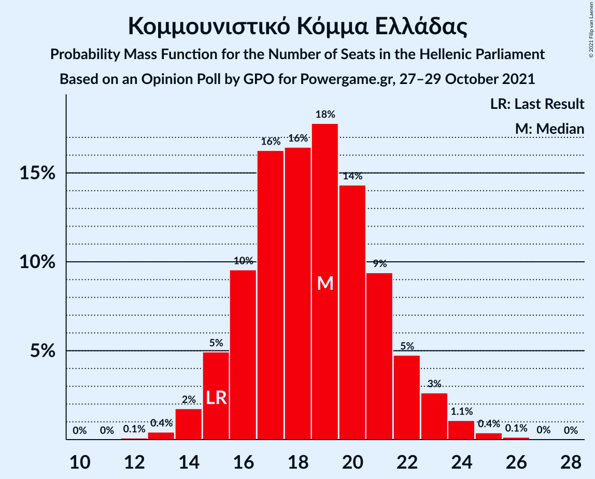

# Opinion Poll by GPO for Powergame.gr, 27–29 October 2021

<a href="#voting-intentions">Voting Intentions</a> | <a href="#seats">Seats</a> | <a href="#coalitions">Coalitions</a> | <a href="#technical-information">Technical Information</a>

## Voting Intentions

### Confidence Intervals

| Party | Last Result | Poll Result | 80% Confidence Interval | 90% Confidence Interval | 95% Confidence Interval | 99% Confidence Interval |
|:-----:|:-----------:|:-----------:|:-----------------------:|:-----------------------:|:-----------------------:|:-----------------------:|
| Νέα Δημοκρατία | 39.8% | 41.6% | 39.6–43.6% |39.1–44.2% |38.6–44.7% |37.6–45.7% |
| Συνασπισμός Ριζοσπαστικής Αριστεράς | 31.5% | 28.7% | 26.9–30.6% |26.4–31.1% |26.0–31.6% |25.1–32.5% |
| Κίνημα Αλλαγής | 8.1% | 8.3% | 7.3–9.5% |7.0–9.9% |6.7–10.2% |6.3–10.8% |
| Κομμουνιστικό Κόμμα Ελλάδας | 5.3% | 6.8% | 5.9–7.9% |5.6–8.3% |5.4–8.5% |5.0–9.1% |
| Ελληνική Λύση | 3.7% | 4.1% | 3.4–5.0% |3.2–5.3% |3.0–5.5% |2.7–6.0% |
| Μέτωπο Ευρωπαϊκής Ρεαλιστικής Ανυπακοής | 3.4% | 3.4% | 2.8–4.3% |2.6–4.5% |2.4–4.7% |2.2–5.2% |

*Note:* The poll result column reflects the actual value used in the calculations. Published results may vary slightly, and in addition be rounded to fewer digits.

## Seats

### Confidence Intervals

| Party | Last Result | Median | 80% Confidence Interval | 90% Confidence Interval | 95% Confidence Interval | 99% Confidence Interval |
|:-----:|:-----------:|:------:|:-----------------------:|:-----------------------:|:-----------------------:|:-----------------------:|
| <a href="#νέα-δημοκρατία">Νέα Δημοκρατία</a> | 158 | 163 | 157–168 |155–170 |153–171 |152–174 |
| <a href="#συνασπισμός-ριζοσπαστικής-αριστεράς">Συνασπισμός Ριζοσπαστικής Αριστεράς</a> | 86 | 77 | 73–82 |72–85 |69–87 |68–88 |
| <a href="#κίνημα-αλλαγής">Κίνημα Αλλαγής</a> | 22 | 23 | 20–25 |19–27 |18–28 |17–29 |
| <a href="#κομμουνιστικό-κόμμα-ελλάδας">Κομμουνιστικό Κόμμα Ελλάδας</a> | 15 | 18 | 16–21 |15–22 |15–23 |14–25 |
| <a href="#ελληνική-λύση">Ελληνική Λύση</a> | 10 | 11 | 9–14 |9–14 |8–15 |0–16 |
| <a href="#μέτωπο-ευρωπαϊκής-ρεαλιστικής-ανυπακοής">Μέτωπο Ευρωπαϊκής Ρεαλιστικής Ανυπακοής</a> | 9 | 9 | 0–11 |0–12 |0–13 |0–14 |

### Νέα Δημοκρατία

*For a full overview of the results for this party, see the [Νέα Δημοκρατία](party-νέαδημοκρατία.html) page.*

| Number of Seats | Probability | Accumulated | Special Marks |
|:---------------:|:-----------:|:-----------:|:-------------:|
| 148 | 0.1% | 100% |  |
| 149 | 0% | 99.9% |  |
| 150 | 0.2% | 99.9% |  |
| 151 | 0.2% | 99.7% | Majority |
| 152 | 0.3% | 99.5% |  |
| 153 | 2% | 99.2% |  |
| 154 | 0.4% | 97% |  |
| 155 | 3% | 97% |  |
| 156 | 3% | 94% |  |
| 157 | 2% | 91% |  |
| 158 | 12% | 89% | Last Result |
| 159 | 4% | 77% |  |
| 160 | 10% | 74% |  |
| 161 | 7% | 63% |  |
| 162 | 5% | 57% |  |
| 163 | 14% | 52% | Median |
| 164 | 6% | 37% |  |
| 165 | 6% | 32% |  |
| 166 | 6% | 26% |  |
| 167 | 7% | 20% |  |
| 168 | 5% | 13% |  |
| 169 | 2% | 8% |  |
| 170 | 2% | 6% |  |
| 171 | 2% | 4% |  |
| 172 | 0.9% | 2% |  |
| 173 | 0.4% | 1.2% |  |
| 174 | 0.5% | 0.9% |  |
| 175 | 0.1% | 0.4% |  |
| 176 | 0.1% | 0.3% |  |
| 177 | 0.1% | 0.2% |  |
| 178 | 0% | 0.1% |  |
| 179 | 0% | 0.1% |  |
| 180 | 0% | 0% |  |

### Συνασπισμός Ριζοσπαστικής Αριστεράς

*For a full overview of the results for this party, see the [Συνασπισμός Ριζοσπαστικής Αριστεράς](party-συνασπισμόςριζοσπαστικήςαριστεράς.html) page.*

| Number of Seats | Probability | Accumulated | Special Marks |
|:---------------:|:-----------:|:-----------:|:-------------:|
| 65 | 0.1% | 100% |  |
| 66 | 0.1% | 99.9% |  |
| 67 | 0% | 99.8% |  |
| 68 | 0.7% | 99.8% |  |
| 69 | 2% | 99.1% |  |
| 70 | 1.4% | 97% |  |
| 71 | 0.1% | 96% |  |
| 72 | 3% | 96% |  |
| 73 | 14% | 93% |  |
| 74 | 9% | 79% |  |
| 75 | 2% | 71% |  |
| 76 | 3% | 68% |  |
| 77 | 21% | 65% | Median |
| 78 | 9% | 45% |  |
| 79 | 9% | 35% |  |
| 80 | 2% | 26% |  |
| 81 | 10% | 24% |  |
| 82 | 4% | 14% |  |
| 83 | 3% | 10% |  |
| 84 | 1.3% | 7% |  |
| 85 | 1.2% | 6% |  |
| 86 | 1.2% | 4% | Last Result |
| 87 | 2% | 3% |  |
| 88 | 1.2% | 2% |  |
| 89 | 0.2% | 0.4% |  |
| 90 | 0.1% | 0.2% |  |
| 91 | 0.1% | 0.1% |  |
| 92 | 0% | 0% |  |

### Κίνημα Αλλαγής

*For a full overview of the results for this party, see the [Κίνημα Αλλαγής](party-κίνημααλλαγής.html) page.*

| Number of Seats | Probability | Accumulated | Special Marks |
|:---------------:|:-----------:|:-----------:|:-------------:|
| 15 | 0% | 100% |  |
| 16 | 0.2% | 99.9% |  |
| 17 | 0.9% | 99.8% |  |
| 18 | 2% | 98.9% |  |
| 19 | 5% | 97% |  |
| 20 | 8% | 93% |  |
| 21 | 12% | 84% |  |
| 22 | 18% | 72% | Last Result |
| 23 | 21% | 55% | Median |
| 24 | 13% | 33% |  |
| 25 | 11% | 20% |  |
| 26 | 4% | 10% |  |
| 27 | 3% | 6% |  |
| 28 | 2% | 3% |  |
| 29 | 0.7% | 1.0% |  |
| 30 | 0.3% | 0.4% |  |
| 31 | 0.1% | 0.1% |  |
| 32 | 0% | 0% |  |

### Κομμουνιστικό Κόμμα Ελλάδας

*For a full overview of the results for this party, see the [Κομμουνιστικό Κόμμα Ελλάδας](party-κομμουνιστικόκόμμαελλάδας.html) page.*

| Number of Seats | Probability | Accumulated | Special Marks |
|:---------------:|:-----------:|:-----------:|:-------------:|
| 12 | 0.1% | 100% |  |
| 13 | 0.4% | 99.9% |  |
| 14 | 2% | 99.6% |  |
| 15 | 5% | 98% | Last Result |
| 16 | 8% | 93% |  |
| 17 | 18% | 85% |  |
| 18 | 18% | 67% | Median |
| 19 | 14% | 49% |  |
| 20 | 17% | 35% |  |
| 21 | 8% | 18% |  |
| 22 | 6% | 10% |  |
| 23 | 2% | 4% |  |
| 24 | 0.7% | 1.4% |  |
| 25 | 0.6% | 0.7% |  |
| 26 | 0.1% | 0.2% |  |
| 27 | 0% | 0.1% |  |
| 28 | 0% | 0% |  |

### Ελληνική Λύση

*For a full overview of the results for this party, see the [Ελληνική Λύση](party-ελληνικήλύση.html) page.*

| Number of Seats | Probability | Accumulated | Special Marks |
|:---------------:|:-----------:|:-----------:|:-------------:|
| 0 | 2% | 100% |  |
| 1 | 0% | 98% |  |
| 2 | 0% | 98% |  |
| 3 | 0% | 98% |  |
| 4 | 0% | 98% |  |
| 5 | 0% | 98% |  |
| 6 | 0% | 98% |  |
| 7 | 0% | 98% |  |
| 8 | 2% | 98% |  |
| 9 | 9% | 96% |  |
| 10 | 14% | 87% | Last Result |
| 11 | 31% | 73% | Median |
| 12 | 21% | 42% |  |
| 13 | 11% | 21% |  |
| 14 | 7% | 10% |  |
| 15 | 2% | 4% |  |
| 16 | 0.9% | 1.3% |  |
| 17 | 0.3% | 0.4% |  |
| 18 | 0% | 0.1% |  |
| 19 | 0% | 0% |  |

### Μέτωπο Ευρωπαϊκής Ρεαλιστικής Ανυπακοής

*For a full overview of the results for this party, see the [Μέτωπο Ευρωπαϊκής Ρεαλιστικής Ανυπακοής](party-μέτωποευρωπαϊκήςρεαλιστικήςανυπακοής.html) page.*

| Number of Seats | Probability | Accumulated | Special Marks |
|:---------------:|:-----------:|:-----------:|:-------------:|
| 0 | 22% | 100% |  |
| 1 | 0% | 78% |  |
| 2 | 0% | 78% |  |
| 3 | 0% | 78% |  |
| 4 | 0% | 78% |  |
| 5 | 0% | 78% |  |
| 6 | 0% | 78% |  |
| 7 | 0% | 78% |  |
| 8 | 11% | 78% |  |
| 9 | 22% | 67% | Last Result, Median |
| 10 | 19% | 45% |  |
| 11 | 16% | 26% |  |
| 12 | 7% | 10% |  |
| 13 | 3% | 3% |  |
| 14 | 0.4% | 0.6% |  |
| 15 | 0.1% | 0.2% |  |
| 16 | 0% | 0% |  |

## Coalitions

### Confidence Intervals

| Coalition | Last Result | Median | Majority? | 80% Confidence Interval | 90% Confidence Interval | 95% Confidence Interval | 99% Confidence Interval |
|:---------:|:-----------:|:------:|:---------:|:-----------------------:|:-----------------------:|:-----------------------:|:-----------------------:|
| Νέα Δημοκρατία – Κίνημα Αλλαγής | 180 | 185 | 100% | 179–191 | 178–193 | 177–194 | 174–198 |
| Νέα Δημοκρατία | 158 | 163 | 99.7% | 157–168 | 155–170 | 153–171 | 152–174 |
| Συνασπισμός Ριζοσπαστικής Αριστεράς – Μέτωπο Ευρωπαϊκής Ρεαλιστικής Ανυπακοής | 95 | 85 | 0% | 79–91 | 78–93 | 75–94 | 74–96 |
| Συνασπισμός Ριζοσπαστικής Αριστεράς | 86 | 77 | 0% | 73–82 | 72–85 | 69–87 | 68–88 |

### Νέα Δημοκρατία – Κίνημα Αλλαγής

| Number of Seats | Probability | Accumulated | Special Marks |
|:---------------:|:-----------:|:-----------:|:-------------:|
| 171 | 0.1% | 100% |  |
| 172 | 0.1% | 99.9% |  |
| 173 | 0.2% | 99.7% |  |
| 174 | 0.3% | 99.5% |  |
| 175 | 0.5% | 99.2% |  |
| 176 | 1.0% | 98.7% |  |
| 177 | 2% | 98% |  |
| 178 | 3% | 95% |  |
| 179 | 3% | 92% |  |
| 180 | 8% | 89% | Last Result |
| 181 | 6% | 80% |  |
| 182 | 3% | 75% |  |
| 183 | 6% | 72% |  |
| 184 | 7% | 66% |  |
| 185 | 10% | 59% |  |
| 186 | 10% | 48% | Median |
| 187 | 9% | 38% |  |
| 188 | 5% | 29% |  |
| 189 | 6% | 24% |  |
| 190 | 7% | 18% |  |
| 191 | 3% | 11% |  |
| 192 | 2% | 8% |  |
| 193 | 1.1% | 5% |  |
| 194 | 2% | 4% |  |
| 195 | 0.7% | 2% |  |
| 196 | 0.6% | 2% |  |
| 197 | 0.4% | 1.0% |  |
| 198 | 0.2% | 0.6% |  |
| 199 | 0.2% | 0.4% |  |
| 200 | 0.1% | 0.2% |  |
| 201 | 0.1% | 0.1% |  |
| 202 | 0% | 0% |  |

### Νέα Δημοκρατία

| Number of Seats | Probability | Accumulated | Special Marks |
|:---------------:|:-----------:|:-----------:|:-------------:|
| 148 | 0.1% | 100% |  |
| 149 | 0% | 99.9% |  |
| 150 | 0.2% | 99.9% |  |
| 151 | 0.2% | 99.7% | Majority |
| 152 | 0.3% | 99.5% |  |
| 153 | 2% | 99.2% |  |
| 154 | 0.4% | 97% |  |
| 155 | 3% | 97% |  |
| 156 | 3% | 94% |  |
| 157 | 2% | 91% |  |
| 158 | 12% | 89% | Last Result |
| 159 | 4% | 77% |  |
| 160 | 10% | 74% |  |
| 161 | 7% | 63% |  |
| 162 | 5% | 57% |  |
| 163 | 14% | 52% | Median |
| 164 | 6% | 37% |  |
| 165 | 6% | 32% |  |
| 166 | 6% | 26% |  |
| 167 | 7% | 20% |  |
| 168 | 5% | 13% |  |
| 169 | 2% | 8% |  |
| 170 | 2% | 6% |  |
| 171 | 2% | 4% |  |
| 172 | 0.9% | 2% |  |
| 173 | 0.4% | 1.2% |  |
| 174 | 0.5% | 0.9% |  |
| 175 | 0.1% | 0.4% |  |
| 176 | 0.1% | 0.3% |  |
| 177 | 0.1% | 0.2% |  |
| 178 | 0% | 0.1% |  |
| 179 | 0% | 0.1% |  |
| 180 | 0% | 0% |  |

### Συνασπισμός Ριζοσπαστικής Αριστεράς – Μέτωπο Ευρωπαϊκής Ρεαλιστικής Ανυπακοής

| Number of Seats | Probability | Accumulated | Special Marks |
|:---------------:|:-----------:|:-----------:|:-------------:|
| 70 | 0.3% | 100% |  |
| 71 | 0% | 99.7% |  |
| 72 | 0% | 99.6% |  |
| 73 | 0.1% | 99.6% |  |
| 74 | 0.8% | 99.5% |  |
| 75 | 2% | 98.7% |  |
| 76 | 0.7% | 97% |  |
| 77 | 0.7% | 96% |  |
| 78 | 4% | 96% |  |
| 79 | 9% | 92% |  |
| 80 | 1.2% | 83% |  |
| 81 | 3% | 81% |  |
| 82 | 3% | 78% |  |
| 83 | 8% | 75% |  |
| 84 | 9% | 67% |  |
| 85 | 9% | 58% |  |
| 86 | 14% | 49% | Median |
| 87 | 6% | 35% |  |
| 88 | 6% | 30% |  |
| 89 | 2% | 23% |  |
| 90 | 6% | 21% |  |
| 91 | 6% | 14% |  |
| 92 | 2% | 8% |  |
| 93 | 3% | 6% |  |
| 94 | 2% | 3% |  |
| 95 | 0.6% | 1.4% | Last Result |
| 96 | 0.3% | 0.8% |  |
| 97 | 0.1% | 0.5% |  |
| 98 | 0.2% | 0.3% |  |
| 99 | 0% | 0.1% |  |
| 100 | 0.1% | 0.1% |  |
| 101 | 0% | 0% |  |

### Συνασπισμός Ριζοσπαστικής Αριστεράς

| Number of Seats | Probability | Accumulated | Special Marks |
|:---------------:|:-----------:|:-----------:|:-------------:|
| 65 | 0.1% | 100% |  |
| 66 | 0.1% | 99.9% |  |
| 67 | 0% | 99.8% |  |
| 68 | 0.7% | 99.8% |  |
| 69 | 2% | 99.1% |  |
| 70 | 1.4% | 97% |  |
| 71 | 0.1% | 96% |  |
| 72 | 3% | 96% |  |
| 73 | 14% | 93% |  |
| 74 | 9% | 79% |  |
| 75 | 2% | 71% |  |
| 76 | 3% | 68% |  |
| 77 | 21% | 65% | Median |
| 78 | 9% | 45% |  |
| 79 | 9% | 35% |  |
| 80 | 2% | 26% |  |
| 81 | 10% | 24% |  |
| 82 | 4% | 14% |  |
| 83 | 3% | 10% |  |
| 84 | 1.3% | 7% |  |
| 85 | 1.2% | 6% |  |
| 86 | 1.2% | 4% | Last Result |
| 87 | 2% | 3% |  |
| 88 | 1.2% | 2% |  |
| 89 | 0.2% | 0.4% |  |
| 90 | 0.1% | 0.2% |  |
| 91 | 0.1% | 0.1% |  |
| 92 | 0% | 0% |  |

## Technical Information

### Opinion Poll

+ **Polling firm:** GPO
+ **Commissioner(s):** Powergame.gr
+ **Fieldwork period:** 27–29 October 2021

### Calculations

+ **Sample size:** 1000
+ **Simulations done:** 131,072
+ **Error estimate:** 0.85%

