# Opinion Poll by Interview for Politic.gr, 3–8 November 2021

<a href="#voting-intentions">Voting Intentions</a> | <a href="#seats">Seats</a> | <a href="#coalitions">Coalitions</a> | <a href="#technical-information">Technical Information</a>

## Voting Intentions

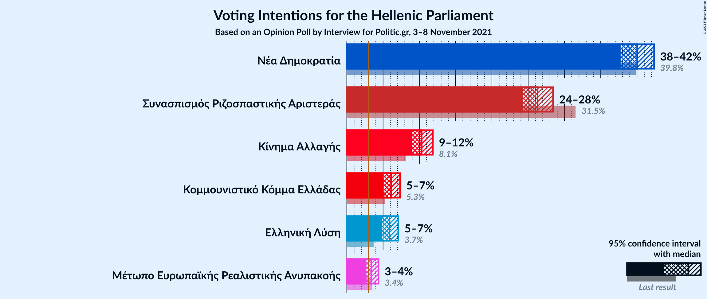

### Confidence Intervals

| Party | Last Result | Poll Result | 80% Confidence Interval | 90% Confidence Interval | 95% Confidence Interval | 99% Confidence Interval |
|:-----:|:-----------:|:-----------:|:-----------------------:|:-----------------------:|:-----------------------:|:-----------------------:|
| Νέα Δημοκρατία | 39.8% | 40.0% | 38.5–41.5% |38.1–42.0% |37.7–42.4% |37.0–43.1% |
| Συνασπισμός Ριζοσπαστικής Αριστεράς | 31.5% | 26.3% | 25.0–27.7% |24.6–28.1% |24.3–28.4% |23.7–29.1% |
| Κίνημα Αλλαγής | 8.1% | 10.3% | 9.4–11.3% |9.2–11.6% |9.0–11.9% |8.6–12.3% |
| Κομμουνιστικό Κόμμα Ελλάδας | 5.3% | 6.1% | 5.4–6.9% |5.2–7.1% |5.1–7.3% |4.8–7.8% |
| Ελληνική Λύση | 3.7% | 5.9% | 5.2–6.7% |5.0–6.9% |4.9–7.1% |4.6–7.5% |
| Μέτωπο Ευρωπαϊκής Ρεαλιστικής Ανυπακοής | 3.4% | 3.4% | 2.9–4.0% |2.8–4.2% |2.6–4.4% |2.4–4.7% |

*Note:* The poll result column reflects the actual value used in the calculations. Published results may vary slightly, and in addition be rounded to fewer digits.

## Seats

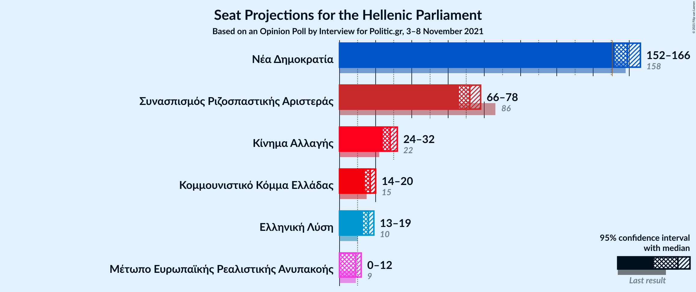

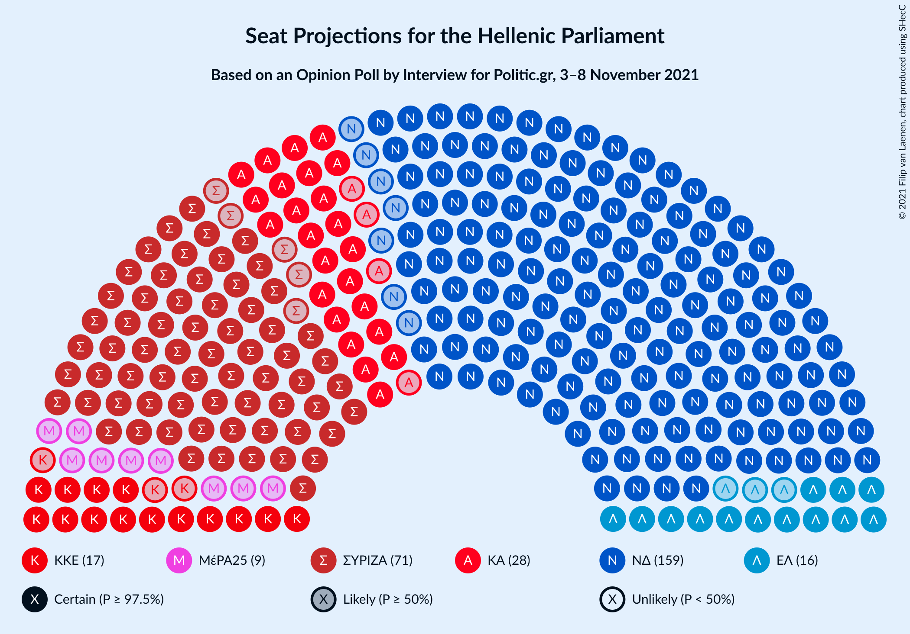

### Confidence Intervals

| Party | Last Result | Median | 80% Confidence Interval | 90% Confidence Interval | 95% Confidence Interval | 99% Confidence Interval |
|:-----:|:-----------:|:------:|:-----------------------:|:-----------------------:|:-----------------------:|:-----------------------:|
| <a href="#νέα-δημοκρατία">Νέα Δημοκρατία</a> | 158 | 159 | 155–163 |153–165 |152–166 |151–168 |
| <a href="#συνασπισμός-ριζοσπαστικής-αριστεράς">Συνασπισμός Ριζοσπαστικής Αριστεράς</a> | 86 | 72 | 68–75 |67–77 |66–78 |64–79 |
| <a href="#κίνημα-αλλαγής">Κίνημα Αλλαγής</a> | 22 | 28 | 26–31 |25–32 |24–32 |23–34 |
| <a href="#κομμουνιστικό-κόμμα-ελλάδας">Κομμουνιστικό Κόμμα Ελλάδας</a> | 15 | 17 | 15–19 |14–19 |14–20 |13–21 |
| <a href="#ελληνική-λύση">Ελληνική Λύση</a> | 10 | 16 | 14–18 |14–19 |13–19 |12–20 |
| <a href="#μέτωπο-ευρωπαϊκής-ρεαλιστικής-ανυπακοής">Μέτωπο Ευρωπαϊκής Ρεαλιστικής Ανυπακοής</a> | 9 | 9 | 0–11 |0–11 |0–12 |0–13 |

### Νέα Δημοκρατία

*For a full overview of the results for this party, see the [Νέα Δημοκρατία](party-νέαδημοκρατία.html) page.*

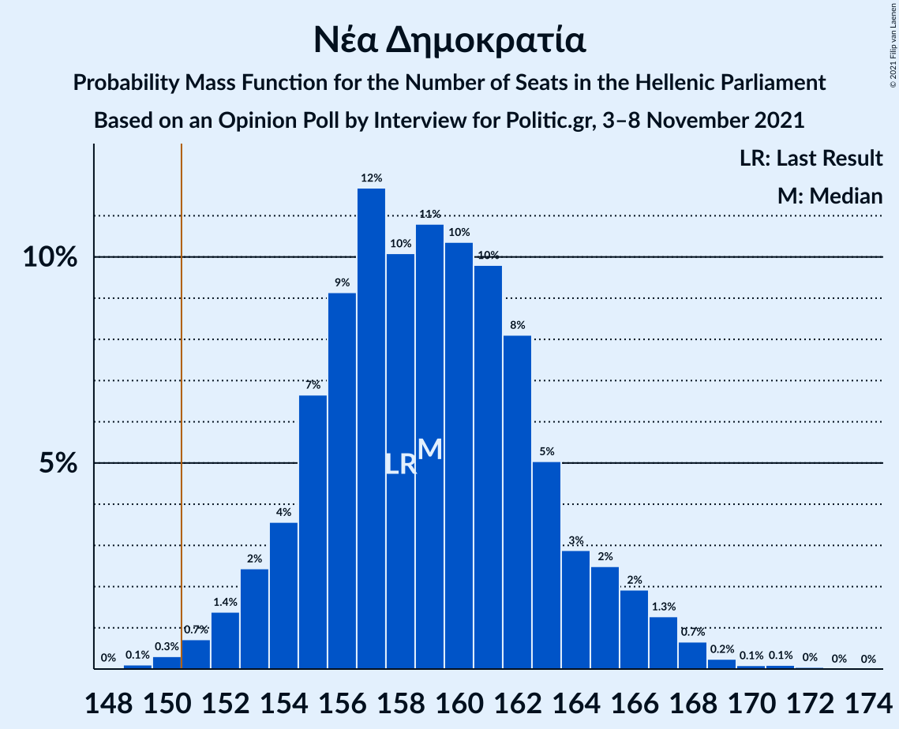

| Number of Seats | Probability | Accumulated | Special Marks |
|:---------------:|:-----------:|:-----------:|:-------------:|
| 148 | 0% | 100% |  |
| 149 | 0.1% | 99.9% |  |
| 150 | 0.3% | 99.8% |  |
| 151 | 0.7% | 99.5% | Majority |
| 152 | 1.4% | 98.8% |  |
| 153 | 2% | 97% |  |
| 154 | 4% | 95% |  |
| 155 | 7% | 91% |  |
| 156 | 9% | 85% |  |
| 157 | 12% | 76% |  |
| 158 | 10% | 64% | Last Result |
| 159 | 11% | 54% | Median |
| 160 | 10% | 43% |  |
| 161 | 10% | 33% |  |
| 162 | 8% | 23% |  |
| 163 | 5% | 15% |  |
| 164 | 3% | 10% |  |
| 165 | 2% | 7% |  |
| 166 | 2% | 4% |  |
| 167 | 1.3% | 2% |  |
| 168 | 0.7% | 1.2% |  |
| 169 | 0.2% | 0.5% |  |
| 170 | 0.1% | 0.3% |  |
| 171 | 0.1% | 0.2% |  |
| 172 | 0% | 0.1% |  |
| 173 | 0% | 0% |  |

### Συνασπισμός Ριζοσπαστικής Αριστεράς

*For a full overview of the results for this party, see the [Συνασπισμός Ριζοσπαστικής Αριστεράς](party-συνασπισμόςριζοσπαστικήςαριστεράς.html) page.*

| Number of Seats | Probability | Accumulated | Special Marks |
|:---------------:|:-----------:|:-----------:|:-------------:|
| 62 | 0% | 100% |  |
| 63 | 0.1% | 99.9% |  |
| 64 | 0.4% | 99.8% |  |
| 65 | 1.0% | 99.4% |  |
| 66 | 2% | 98% |  |
| 67 | 4% | 96% |  |
| 68 | 7% | 92% |  |
| 69 | 9% | 85% |  |
| 70 | 11% | 77% |  |
| 71 | 13% | 66% |  |
| 72 | 14% | 53% | Median |
| 73 | 14% | 39% |  |
| 74 | 9% | 25% |  |
| 75 | 6% | 16% |  |
| 76 | 4% | 10% |  |
| 77 | 3% | 6% |  |
| 78 | 2% | 3% |  |
| 79 | 0.8% | 1.3% |  |
| 80 | 0.3% | 0.5% |  |
| 81 | 0.1% | 0.2% |  |
| 82 | 0.1% | 0.1% |  |
| 83 | 0% | 0% |  |
| 84 | 0% | 0% |  |
| 85 | 0% | 0% |  |
| 86 | 0% | 0% | Last Result |

### Κίνημα Αλλαγής

*For a full overview of the results for this party, see the [Κίνημα Αλλαγής](party-κίνημααλλαγής.html) page.*

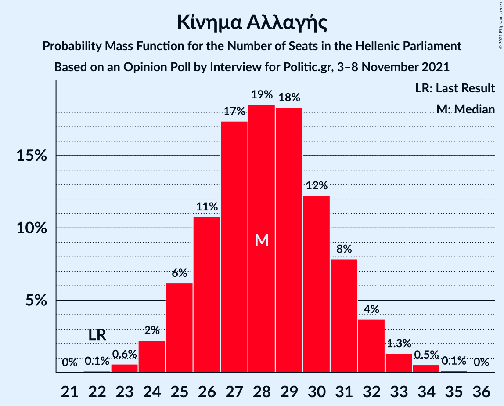

| Number of Seats | Probability | Accumulated | Special Marks |
|:---------------:|:-----------:|:-----------:|:-------------:|
| 22 | 0.1% | 100% | Last Result |
| 23 | 0.6% | 99.9% |  |
| 24 | 2% | 99.3% |  |
| 25 | 6% | 97% |  |
| 26 | 11% | 91% |  |
| 27 | 17% | 80% |  |
| 28 | 19% | 63% | Median |
| 29 | 18% | 44% |  |
| 30 | 12% | 26% |  |
| 31 | 8% | 14% |  |
| 32 | 4% | 6% |  |
| 33 | 1.3% | 2% |  |
| 34 | 0.5% | 0.7% |  |
| 35 | 0.1% | 0.2% |  |
| 36 | 0% | 0% |  |

### Κομμουνιστικό Κόμμα Ελλάδας

*For a full overview of the results for this party, see the [Κομμουνιστικό Κόμμα Ελλάδας](party-κομμουνιστικόκόμμαελλάδας.html) page.*

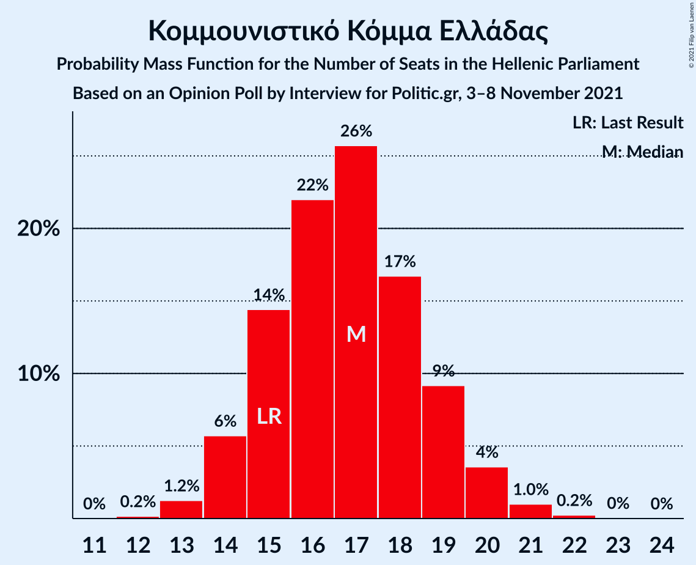

| Number of Seats | Probability | Accumulated | Special Marks |
|:---------------:|:-----------:|:-----------:|:-------------:|
| 12 | 0.2% | 100% |  |
| 13 | 1.2% | 99.8% |  |
| 14 | 6% | 98.6% |  |
| 15 | 14% | 93% | Last Result |
| 16 | 22% | 78% |  |
| 17 | 26% | 56% | Median |
| 18 | 17% | 31% |  |
| 19 | 9% | 14% |  |
| 20 | 4% | 5% |  |
| 21 | 1.0% | 1.3% |  |
| 22 | 0.2% | 0.3% |  |
| 23 | 0% | 0.1% |  |
| 24 | 0% | 0% |  |

### Ελληνική Λύση

*For a full overview of the results for this party, see the [Ελληνική Λύση](party-ελληνικήλύση.html) page.*

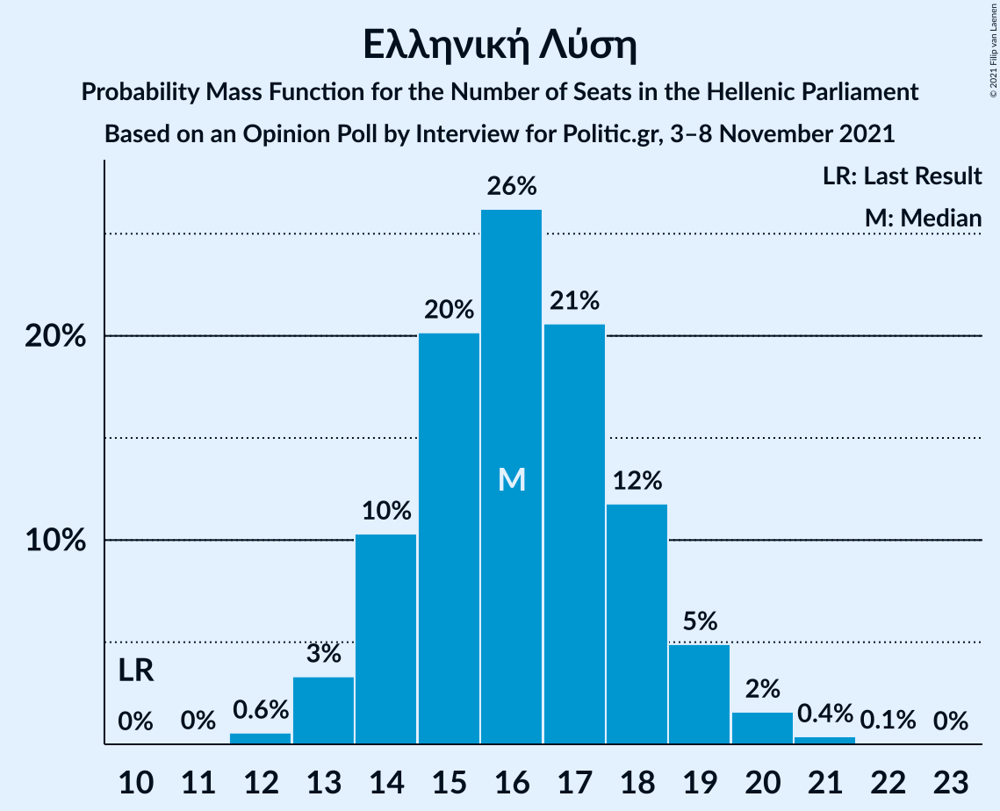

| Number of Seats | Probability | Accumulated | Special Marks |
|:---------------:|:-----------:|:-----------:|:-------------:|
| 10 | 0% | 100% | Last Result |
| 11 | 0% | 100% |  |
| 12 | 0.6% | 100% |  |
| 13 | 3% | 99.4% |  |
| 14 | 10% | 96% |  |
| 15 | 20% | 86% |  |
| 16 | 26% | 66% | Median |
| 17 | 21% | 39% |  |
| 18 | 12% | 19% |  |
| 19 | 5% | 7% |  |
| 20 | 2% | 2% |  |
| 21 | 0.4% | 0.5% |  |
| 22 | 0.1% | 0.1% |  |
| 23 | 0% | 0% |  |

### Μέτωπο Ευρωπαϊκής Ρεαλιστικής Ανυπακοής

*For a full overview of the results for this party, see the [Μέτωπο Ευρωπαϊκής Ρεαλιστικής Ανυπακοής](party-μέτωποευρωπαϊκήςρεαλιστικήςανυπακοής.html) page.*

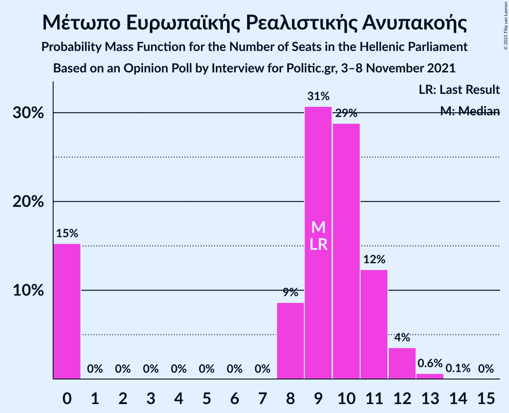

| Number of Seats | Probability | Accumulated | Special Marks |
|:---------------:|:-----------:|:-----------:|:-------------:|
| 0 | 15% | 100% |  |
| 1 | 0% | 85% |  |
| 2 | 0% | 85% |  |
| 3 | 0% | 85% |  |
| 4 | 0% | 85% |  |
| 5 | 0% | 85% |  |
| 6 | 0% | 85% |  |
| 7 | 0% | 85% |  |
| 8 | 9% | 85% |  |
| 9 | 31% | 76% | Last Result, Median |
| 10 | 29% | 45% |  |
| 11 | 12% | 17% |  |
| 12 | 4% | 4% |  |
| 13 | 0.6% | 0.7% |  |
| 14 | 0.1% | 0.1% |  |
| 15 | 0% | 0% |  |

## Coalitions

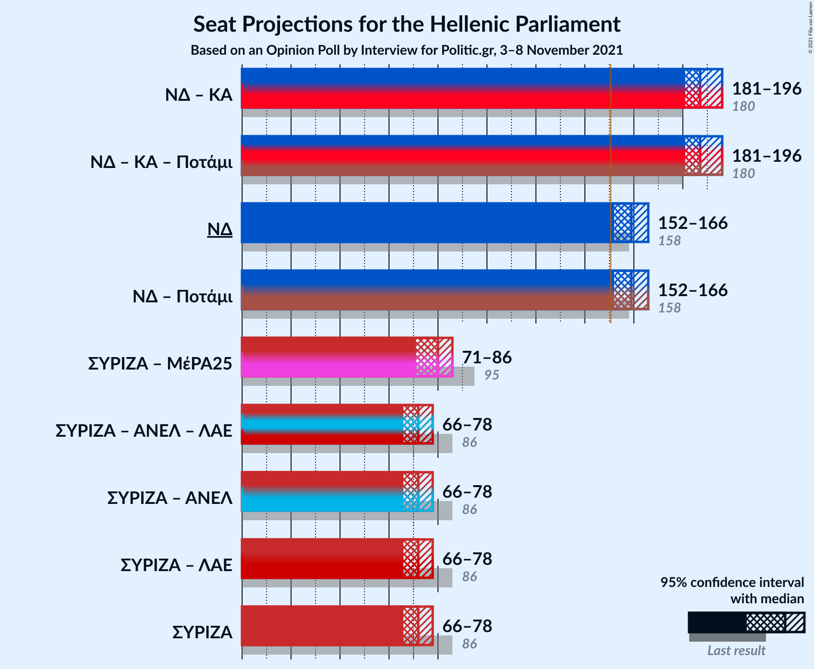

### Confidence Intervals

| Coalition | Last Result | Median | Majority? | 80% Confidence Interval | 90% Confidence Interval | 95% Confidence Interval | 99% Confidence Interval |
|:---------:|:-----------:|:------:|:---------:|:-----------------------:|:-----------------------:|:-----------------------:|:-----------------------:|
| Νέα Δημοκρατία – Κίνημα Αλλαγής | 180 | 187 | 100% | 183–192 | 181–194 | 181–196 | 179–198 |
| Νέα Δημοκρατία | 158 | 159 | 99.5% | 155–163 | 153–165 | 152–166 | 151–168 |
| Συνασπισμός Ριζοσπαστικής Αριστεράς – Μέτωπο Ευρωπαϊκής Ρεαλιστικής Ανυπακοής | 95 | 80 | 0% | 74–84 | 72–85 | 71–86 | 68–88 |
| Συνασπισμός Ριζοσπαστικής Αριστεράς | 86 | 72 | 0% | 68–75 | 67–77 | 66–78 | 64–79 |

### Νέα Δημοκρατία – Κίνημα Αλλαγής

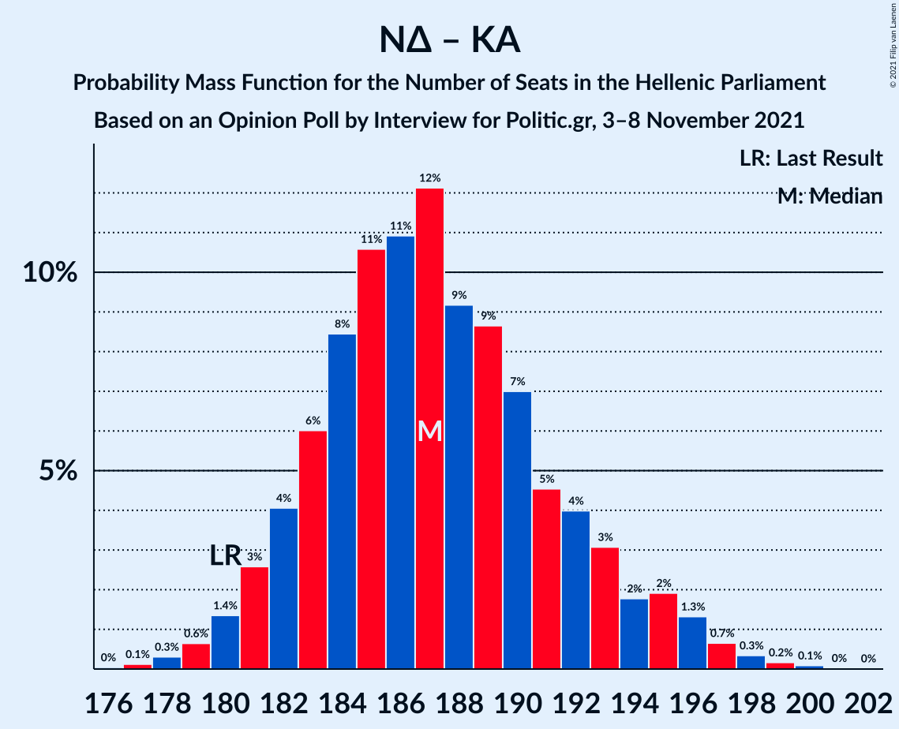

| Number of Seats | Probability | Accumulated | Special Marks |
|:---------------:|:-----------:|:-----------:|:-------------:|
| 176 | 0% | 100% |  |
| 177 | 0.1% | 99.9% |  |
| 178 | 0.3% | 99.8% |  |
| 179 | 0.6% | 99.5% |  |
| 180 | 1.4% | 98.9% | Last Result |
| 181 | 3% | 98% |  |
| 182 | 4% | 95% |  |
| 183 | 6% | 91% |  |
| 184 | 8% | 85% |  |
| 185 | 11% | 76% |  |
| 186 | 11% | 66% |  |
| 187 | 12% | 55% | Median |
| 188 | 9% | 43% |  |
| 189 | 9% | 34% |  |
| 190 | 7% | 25% |  |
| 191 | 5% | 18% |  |
| 192 | 4% | 13% |  |
| 193 | 3% | 9% |  |
| 194 | 2% | 6% |  |
| 195 | 2% | 5% |  |
| 196 | 1.3% | 3% |  |
| 197 | 0.7% | 1.3% |  |
| 198 | 0.3% | 0.6% |  |
| 199 | 0.2% | 0.3% |  |
| 200 | 0.1% | 0.1% |  |
| 201 | 0% | 0% |  |

### Νέα Δημοκρατία

| Number of Seats | Probability | Accumulated | Special Marks |
|:---------------:|:-----------:|:-----------:|:-------------:|
| 148 | 0% | 100% |  |
| 149 | 0.1% | 99.9% |  |
| 150 | 0.3% | 99.8% |  |
| 151 | 0.7% | 99.5% | Majority |
| 152 | 1.4% | 98.8% |  |
| 153 | 2% | 97% |  |
| 154 | 4% | 95% |  |
| 155 | 7% | 91% |  |
| 156 | 9% | 85% |  |
| 157 | 12% | 76% |  |
| 158 | 10% | 64% | Last Result |
| 159 | 11% | 54% | Median |
| 160 | 10% | 43% |  |
| 161 | 10% | 33% |  |
| 162 | 8% | 23% |  |
| 163 | 5% | 15% |  |
| 164 | 3% | 10% |  |
| 165 | 2% | 7% |  |
| 166 | 2% | 4% |  |
| 167 | 1.3% | 2% |  |
| 168 | 0.7% | 1.2% |  |
| 169 | 0.2% | 0.5% |  |
| 170 | 0.1% | 0.3% |  |
| 171 | 0.1% | 0.2% |  |
| 172 | 0% | 0.1% |  |
| 173 | 0% | 0% |  |

### Συνασπισμός Ριζοσπαστικής Αριστεράς – Μέτωπο Ευρωπαϊκής Ρεαλιστικής Ανυπακοής

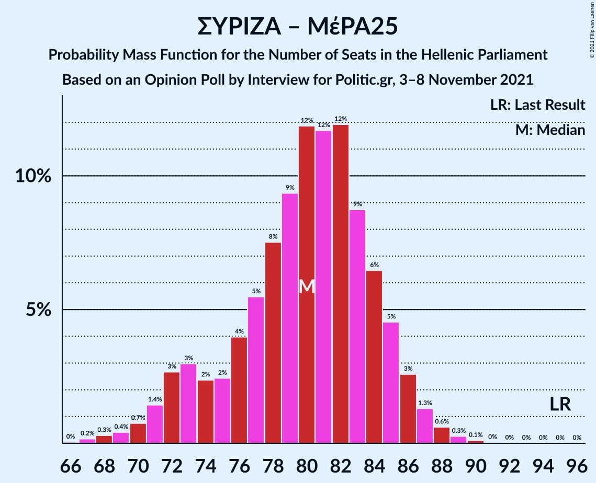

| Number of Seats | Probability | Accumulated | Special Marks |
|:---------------:|:-----------:|:-----------:|:-------------:|
| 66 | 0% | 100% |  |
| 67 | 0.2% | 99.9% |  |
| 68 | 0.3% | 99.8% |  |
| 69 | 0.4% | 99.5% |  |
| 70 | 0.7% | 99.1% |  |
| 71 | 1.4% | 98% |  |
| 72 | 3% | 97% |  |
| 73 | 3% | 94% |  |
| 74 | 2% | 91% |  |
| 75 | 2% | 89% |  |
| 76 | 4% | 86% |  |
| 77 | 5% | 82% |  |
| 78 | 8% | 77% |  |
| 79 | 9% | 69% |  |
| 80 | 12% | 60% |  |
| 81 | 12% | 48% | Median |
| 82 | 12% | 37% |  |
| 83 | 9% | 25% |  |
| 84 | 6% | 16% |  |
| 85 | 5% | 9% |  |
| 86 | 3% | 5% |  |
| 87 | 1.3% | 2% |  |
| 88 | 0.6% | 1.0% |  |
| 89 | 0.3% | 0.4% |  |
| 90 | 0.1% | 0.2% |  |
| 91 | 0% | 0% |  |
| 92 | 0% | 0% |  |
| 93 | 0% | 0% |  |
| 94 | 0% | 0% |  |
| 95 | 0% | 0% | Last Result |

### Συνασπισμός Ριζοσπαστικής Αριστεράς

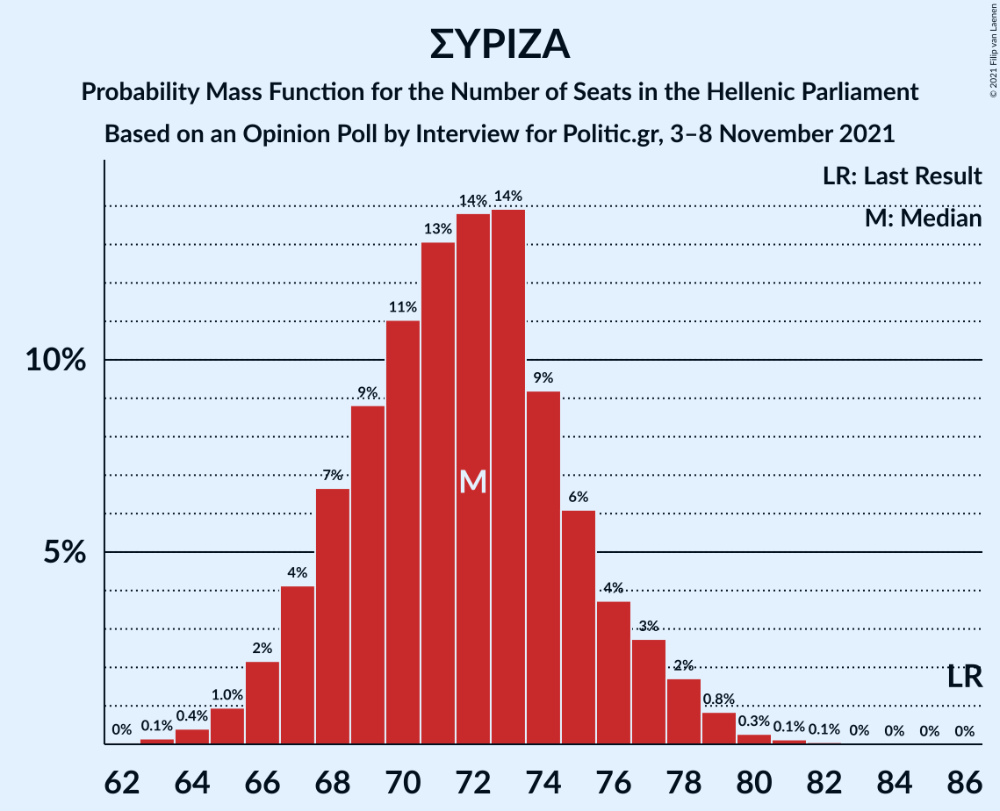

| Number of Seats | Probability | Accumulated | Special Marks |
|:---------------:|:-----------:|:-----------:|:-------------:|
| 62 | 0% | 100% |  |
| 63 | 0.1% | 99.9% |  |
| 64 | 0.4% | 99.8% |  |
| 65 | 1.0% | 99.4% |  |
| 66 | 2% | 98% |  |
| 67 | 4% | 96% |  |
| 68 | 7% | 92% |  |
| 69 | 9% | 85% |  |
| 70 | 11% | 77% |  |
| 71 | 13% | 66% |  |
| 72 | 14% | 53% | Median |
| 73 | 14% | 39% |  |
| 74 | 9% | 25% |  |
| 75 | 6% | 16% |  |
| 76 | 4% | 10% |  |
| 77 | 3% | 6% |  |
| 78 | 2% | 3% |  |
| 79 | 0.8% | 1.3% |  |
| 80 | 0.3% | 0.5% |  |
| 81 | 0.1% | 0.2% |  |
| 82 | 0.1% | 0.1% |  |
| 83 | 0% | 0% |  |
| 84 | 0% | 0% |  |
| 85 | 0% | 0% |  |
| 86 | 0% | 0% | Last Result |

## Technical Information

### Opinion Poll

+ **Polling firm:** Interview
+ **Commissioner(s):** Politic.gr
+ **Fieldwork period:** 3–8 November 2021

### Calculations

+ **Sample size:** 1734
+ **Simulations done:** 1,048,576
+ **Error estimate:** 1.14%

