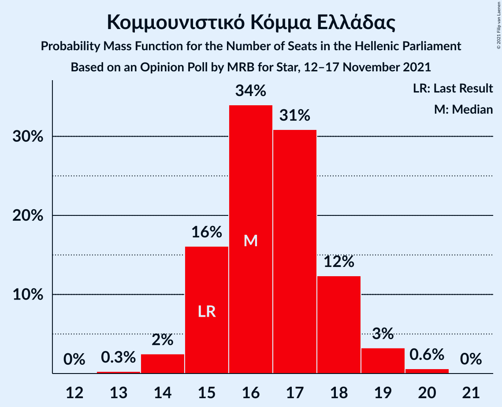

# Opinion Poll by MRB for Star, 12–17 November 2021

<a href="#voting-intentions">Voting Intentions</a> | <a href="#seats">Seats</a> | <a href="#coalitions">Coalitions</a> | <a href="#technical-information">Technical Information</a>

## Voting Intentions

### Confidence Intervals

| Party | Last Result | Poll Result | 80% Confidence Interval | 90% Confidence Interval | 95% Confidence Interval | 99% Confidence Interval |
|:-----:|:-----------:|:-----------:|:-----------------------:|:-----------------------:|:-----------------------:|:-----------------------:|
| Νέα Δημοκρατία | 39.8% | 38.2% | 37.1–39.3% |36.8–39.6% |36.5–39.9% |36.0–40.4% |
| Συνασπισμός Ριζοσπαστικής Αριστεράς | 31.5% | 26.6% | 25.6–27.6% |25.3–27.9% |25.1–28.2% |24.7–28.6% |
| Κίνημα Αλλαγής | 8.1% | 11.0% | 10.3–11.7% |10.1–11.9% |10.0–12.1% |9.7–12.5% |
| Κομμουνιστικό Κόμμα Ελλάδας | 5.3% | 6.0% | 5.5–6.6% |5.3–6.7% |5.2–6.9% |5.0–7.2% |
| Ελληνική Λύση | 3.7% | 5.1% | 4.6–5.6% |4.5–5.8% |4.4–5.9% |4.2–6.2% |
| Μέτωπο Ευρωπαϊκής Ρεαλιστικής Ανυπακοής | 3.4% | 4.4% | 4.0–4.9% |3.8–5.0% |3.7–5.2% |3.5–5.4% |
| Χρυσή Αυγή | 2.9% | 1.2% | 1.0–1.5% |0.9–1.6% |0.9–1.6% |0.8–1.8% |

*Note:* The poll result column reflects the actual value used in the calculations. Published results may vary slightly, and in addition be rounded to fewer digits.

## Seats

### Confidence Intervals

| Party | Last Result | Median | 80% Confidence Interval | 90% Confidence Interval | 95% Confidence Interval | 99% Confidence Interval |
|:-----:|:-----------:|:------:|:-----------------------:|:-----------------------:|:-----------------------:|:-----------------------:|
| <a href="#νέα-δημοκρατία">Νέα Δημοκρατία</a> | 158 | 154 | 152–157 |151–158 |150–159 |149–160 |
| <a href="#συνασπισμός-ριζοσπαστικής-αριστεράς">Συνασπισμός Ριζοσπαστικής Αριστεράς</a> | 86 | 73 | 70–75 |69–76 |69–77 |67–78 |
| <a href="#κίνημα-αλλαγής">Κίνημα Αλλαγής</a> | 22 | 30 | 28–32 |28–33 |27–33 |27–34 |
| <a href="#κομμουνιστικό-κόμμα-ελλάδας">Κομμουνιστικό Κόμμα Ελλάδας</a> | 15 | 16 | 15–18 |15–18 |14–19 |14–20 |
| <a href="#ελληνική-λύση">Ελληνική Λύση</a> | 10 | 14 | 13–15 |12–16 |12–16 |11–17 |
| <a href="#μέτωπο-ευρωπαϊκής-ρεαλιστικής-ανυπακοής">Μέτωπο Ευρωπαϊκής Ρεαλιστικής Ανυπακοής</a> | 9 | 12 | 11–13 |10–14 |10–14 |10–15 |
| <a href="#χρυσή-αυγή">Χρυσή Αυγή</a> | 0 | 0 | 0 |0 |0 |0 |

### Νέα Δημοκρατία

*For a full overview of the results for this party, see the [Νέα Δημοκρατία](party-νέαδημοκρατία.html) page.*

| Number of Seats | Probability | Accumulated | Special Marks |
|:---------------:|:-----------:|:-----------:|:-------------:|
| 147 | 0.1% | 100% |  |
| 148 | 0.3% | 99.9% |  |
| 149 | 0.9% | 99.6% |  |
| 150 | 2% | 98.8% |  |
| 151 | 5% | 97% | Majority |
| 152 | 10% | 91% |  |
| 153 | 14% | 81% |  |
| 154 | 17% | 67% | Median |
| 155 | 18% | 50% |  |
| 156 | 14% | 32% |  |
| 157 | 9% | 18% |  |
| 158 | 5% | 9% | Last Result |
| 159 | 2% | 4% |  |
| 160 | 0.9% | 1.2% |  |
| 161 | 0.3% | 0.3% |  |
| 162 | 0.1% | 0.1% |  |
| 163 | 0% | 0% |  |

### Συνασπισμός Ριζοσπαστικής Αριστεράς

*For a full overview of the results for this party, see the [Συνασπισμός Ριζοσπαστικής Αριστεράς](party-συνασπισμόςριζοσπαστικήςαριστεράς.html) page.*

| Number of Seats | Probability | Accumulated | Special Marks |
|:---------------:|:-----------:|:-----------:|:-------------:|
| 66 | 0.1% | 100% |  |
| 67 | 0.4% | 99.9% |  |
| 68 | 1.4% | 99.5% |  |
| 69 | 4% | 98% |  |
| 70 | 6% | 94% |  |
| 71 | 10% | 88% |  |
| 72 | 18% | 78% |  |
| 73 | 22% | 60% | Median |
| 74 | 18% | 38% |  |
| 75 | 11% | 20% |  |
| 76 | 6% | 9% |  |
| 77 | 2% | 3% |  |
| 78 | 0.7% | 1.1% |  |
| 79 | 0.3% | 0.4% |  |
| 80 | 0.1% | 0.1% |  |
| 81 | 0% | 0% |  |
| 82 | 0% | 0% |  |
| 83 | 0% | 0% |  |
| 84 | 0% | 0% |  |
| 85 | 0% | 0% |  |
| 86 | 0% | 0% | Last Result |

### Κίνημα Αλλαγής

*For a full overview of the results for this party, see the [Κίνημα Αλλαγής](party-κίνημααλλαγής.html) page.*

| Number of Seats | Probability | Accumulated | Special Marks |
|:---------------:|:-----------:|:-----------:|:-------------:|
| 22 | 0% | 100% | Last Result |
| 23 | 0% | 100% |  |
| 24 | 0% | 100% |  |
| 25 | 0% | 100% |  |
| 26 | 0.4% | 99.9% |  |
| 27 | 3% | 99.5% |  |
| 28 | 10% | 97% |  |
| 29 | 20% | 87% |  |
| 30 | 28% | 67% | Median |
| 31 | 22% | 38% |  |
| 32 | 11% | 16% |  |
| 33 | 4% | 5% |  |
| 34 | 1.1% | 1.3% |  |
| 35 | 0.2% | 0.2% |  |
| 36 | 0% | 0% |  |

### Κομμουνιστικό Κόμμα Ελλάδας

*For a full overview of the results for this party, see the [Κομμουνιστικό Κόμμα Ελλάδας](party-κομμουνιστικόκόμμαελλάδας.html) page.*

| Number of Seats | Probability | Accumulated | Special Marks |
|:---------------:|:-----------:|:-----------:|:-------------:|
| 13 | 0.3% | 100% |  |
| 14 | 2% | 99.7% |  |
| 15 | 16% | 97% | Last Result |
| 16 | 34% | 81% | Median |
| 17 | 31% | 47% |  |
| 18 | 12% | 16% |  |
| 19 | 3% | 4% |  |
| 20 | 0.6% | 0.7% |  |
| 21 | 0% | 0% |  |

### Ελληνική Λύση

*For a full overview of the results for this party, see the [Ελληνική Λύση](party-ελληνικήλύση.html) page.*

| Number of Seats | Probability | Accumulated | Special Marks |
|:---------------:|:-----------:|:-----------:|:-------------:|
| 10 | 0% | 100% | Last Result |
| 11 | 0.6% | 100% |  |
| 12 | 8% | 99.4% |  |
| 13 | 21% | 92% |  |
| 14 | 40% | 70% | Median |
| 15 | 22% | 30% |  |
| 16 | 6% | 7% |  |
| 17 | 1.2% | 1.3% |  |
| 18 | 0.1% | 0.1% |  |
| 19 | 0% | 0% |  |

### Μέτωπο Ευρωπαϊκής Ρεαλιστικής Ανυπακοής

*For a full overview of the results for this party, see the [Μέτωπο Ευρωπαϊκής Ρεαλιστικής Ανυπακοής](party-μέτωποευρωπαϊκήςρεαλιστικήςανυπακοής.html) page.*

| Number of Seats | Probability | Accumulated | Special Marks |
|:---------------:|:-----------:|:-----------:|:-------------:|
| 9 | 0.2% | 100% | Last Result |
| 10 | 5% | 99.8% |  |
| 11 | 26% | 95% |  |
| 12 | 35% | 69% | Median |
| 13 | 26% | 34% |  |
| 14 | 7% | 7% |  |
| 15 | 0.9% | 0.9% |  |
| 16 | 0.1% | 0.1% |  |
| 17 | 0% | 0% |  |

### Χρυσή Αυγή

*For a full overview of the results for this party, see the [Χρυσή Αυγή](party-χρυσήαυγή.html) page.*

| Number of Seats | Probability | Accumulated | Special Marks |
|:---------------:|:-----------:|:-----------:|:-------------:|
| 0 | 100% | 100% | Last Result, Median |

## Coalitions

### Confidence Intervals

| Coalition | Last Result | Median | Majority? | 80% Confidence Interval | 90% Confidence Interval | 95% Confidence Interval | 99% Confidence Interval |
|:---------:|:-----------:|:------:|:---------:|:-----------------------:|:-----------------------:|:-----------------------:|:-----------------------:|
| Νέα Δημοκρατία – Κίνημα Αλλαγής | 180 | 185 | 100% | 182–187 | 181–188 | 180–189 | 179–191 |
| Νέα Δημοκρατία | 158 | 154 | 97% | 152–157 | 151–158 | 150–159 | 149–160 |
| Συνασπισμός Ριζοσπαστικής Αριστεράς – Μέτωπο Ευρωπαϊκής Ρεαλιστικής Ανυπακοής | 95 | 85 | 0% | 82–88 | 81–88 | 81–89 | 79–90 |
| Συνασπισμός Ριζοσπαστικής Αριστεράς | 86 | 73 | 0% | 70–75 | 69–76 | 69–77 | 67–78 |

### Νέα Δημοκρατία – Κίνημα Αλλαγής

| Number of Seats | Probability | Accumulated | Special Marks |
|:---------------:|:-----------:|:-----------:|:-------------:|
| 177 | 0.1% | 100% |  |
| 178 | 0.3% | 99.9% |  |
| 179 | 0.8% | 99.6% |  |
| 180 | 2% | 98.8% | Last Result |
| 181 | 6% | 97% |  |
| 182 | 9% | 91% |  |
| 183 | 13% | 82% |  |
| 184 | 18% | 70% | Median |
| 185 | 18% | 52% |  |
| 186 | 14% | 34% |  |
| 187 | 10% | 19% |  |
| 188 | 5% | 10% |  |
| 189 | 3% | 5% |  |
| 190 | 1.2% | 2% |  |
| 191 | 0.4% | 0.6% |  |
| 192 | 0.1% | 0.1% |  |
| 193 | 0% | 0% |  |

### Νέα Δημοκρατία

| Number of Seats | Probability | Accumulated | Special Marks |
|:---------------:|:-----------:|:-----------:|:-------------:|
| 147 | 0.1% | 100% |  |
| 148 | 0.3% | 99.9% |  |
| 149 | 0.9% | 99.6% |  |
| 150 | 2% | 98.8% |  |
| 151 | 5% | 97% | Majority |
| 152 | 10% | 91% |  |
| 153 | 14% | 81% |  |
| 154 | 17% | 67% | Median |
| 155 | 18% | 50% |  |
| 156 | 14% | 32% |  |
| 157 | 9% | 18% |  |
| 158 | 5% | 9% | Last Result |
| 159 | 2% | 4% |  |
| 160 | 0.9% | 1.2% |  |
| 161 | 0.3% | 0.3% |  |
| 162 | 0.1% | 0.1% |  |
| 163 | 0% | 0% |  |

### Συνασπισμός Ριζοσπαστικής Αριστεράς – Μέτωπο Ευρωπαϊκής Ρεαλιστικής Ανυπακοής

| Number of Seats | Probability | Accumulated | Special Marks |
|:---------------:|:-----------:|:-----------:|:-------------:|
| 78 | 0.1% | 100% |  |
| 79 | 0.5% | 99.9% |  |
| 80 | 1.3% | 99.3% |  |
| 81 | 4% | 98% |  |
| 82 | 6% | 94% |  |
| 83 | 12% | 88% |  |
| 84 | 18% | 76% |  |
| 85 | 20% | 58% | Median |
| 86 | 15% | 39% |  |
| 87 | 12% | 24% |  |
| 88 | 7% | 11% |  |
| 89 | 3% | 4% |  |
| 90 | 1.1% | 2% |  |
| 91 | 0.4% | 0.5% |  |
| 92 | 0.1% | 0.1% |  |
| 93 | 0% | 0% |  |
| 94 | 0% | 0% |  |
| 95 | 0% | 0% | Last Result |

### Συνασπισμός Ριζοσπαστικής Αριστεράς

| Number of Seats | Probability | Accumulated | Special Marks |
|:---------------:|:-----------:|:-----------:|:-------------:|
| 66 | 0.1% | 100% |  |
| 67 | 0.4% | 99.9% |  |
| 68 | 1.4% | 99.5% |  |
| 69 | 4% | 98% |  |
| 70 | 6% | 94% |  |
| 71 | 10% | 88% |  |
| 72 | 18% | 78% |  |
| 73 | 22% | 60% | Median |
| 74 | 18% | 38% |  |
| 75 | 11% | 20% |  |
| 76 | 6% | 9% |  |
| 77 | 2% | 3% |  |
| 78 | 0.7% | 1.1% |  |
| 79 | 0.3% | 0.4% |  |
| 80 | 0.1% | 0.1% |  |
| 81 | 0% | 0% |  |
| 82 | 0% | 0% |  |
| 83 | 0% | 0% |  |
| 84 | 0% | 0% |  |
| 85 | 0% | 0% |  |
| 86 | 0% | 0% | Last Result |

## Technical Information

### Opinion Poll

+ **Polling firm:** MRB
+ **Commissioner(s):** Star
+ **Fieldwork period:** 12–17 November 2021

### Calculations

+ **Sample size:** 3281
+ **Simulations done:** 1,048,576
+ **Error estimate:** 0.47%

