# Opinion Poll by Marc for Πρώτο ΘΕΜΑ, 14–18 November 2021

<a href="#voting-intentions">Voting Intentions</a> | <a href="#seats">Seats</a> | <a href="#coalitions">Coalitions</a> | <a href="#technical-information">Technical Information</a>

## Voting Intentions

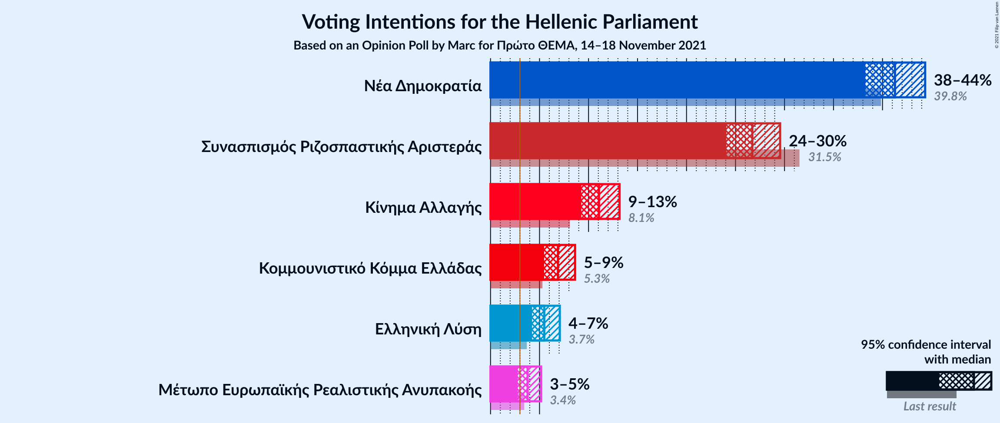

### Confidence Intervals

| Party | Last Result | Poll Result | 80% Confidence Interval | 90% Confidence Interval | 95% Confidence Interval | 99% Confidence Interval |
|:-----:|:-----------:|:-----------:|:-----------------------:|:-----------------------:|:-----------------------:|:-----------------------:|
| Νέα Δημοκρατία | 39.8% | 41.3% | 39.3–43.3% |38.7–43.9% |38.3–44.4% |37.3–45.3% |
| Συνασπισμός Ριζοσπαστικής Αριστεράς | 31.5% | 26.7% | 25.0–28.6% |24.5–29.1% |24.1–29.6% |23.3–30.5% |
| Κίνημα Αλλαγής | 8.1% | 11.1% | 9.9–12.4% |9.6–12.8% |9.3–13.2% |8.7–13.9% |
| Κομμουνιστικό Κόμμα Ελλάδας | 5.3% | 6.9% | 5.9–8.0% |5.7–8.3% |5.5–8.6% |5.1–9.2% |
| Ελληνική Λύση | 3.7% | 5.5% | 4.7–6.5% |4.4–6.8% |4.2–7.1% |3.9–7.6% |
| Μέτωπο Ευρωπαϊκής Ρεαλιστικής Ανυπακοής | 3.4% | 3.8% | 3.1–4.7% |2.9–4.9% |2.8–5.2% |2.5–5.6% |

*Note:* The poll result column reflects the actual value used in the calculations. Published results may vary slightly, and in addition be rounded to fewer digits.

## Seats

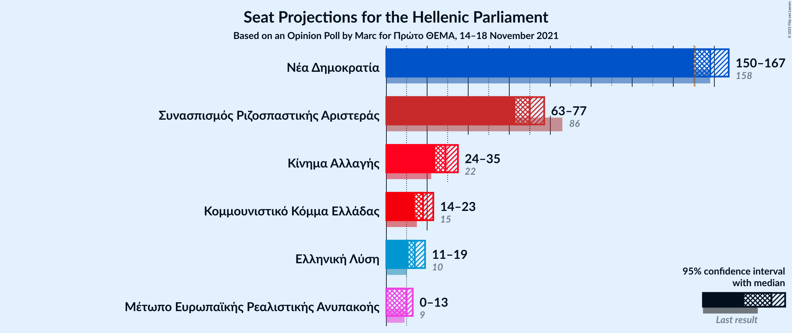

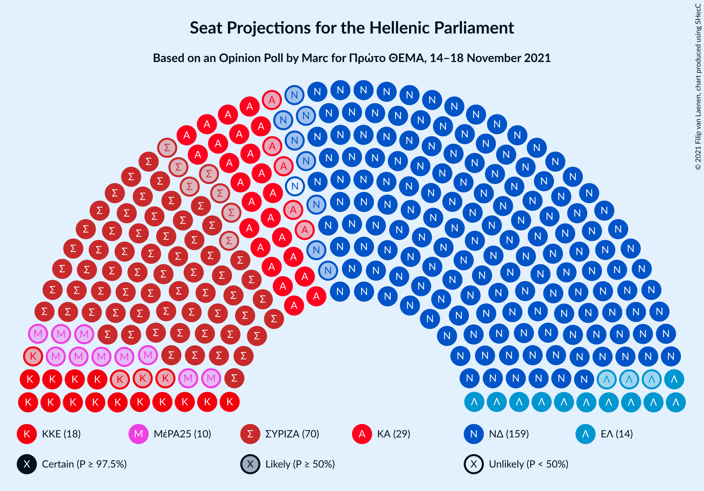

### Confidence Intervals

| Party | Last Result | Median | 80% Confidence Interval | 90% Confidence Interval | 95% Confidence Interval | 99% Confidence Interval |
|:-----:|:-----------:|:------:|:-----------------------:|:-----------------------:|:-----------------------:|:-----------------------:|
| <a href="#νέα-δημοκρατία">Νέα Δημοκρατία</a> | 158 | 158 | 153–164 |151–165 |150–167 |148–170 |
| <a href="#συνασπισμός-ριζοσπαστικής-αριστεράς">Συνασπισμός Ριζοσπαστικής Αριστεράς</a> | 86 | 70 | 65–75 |64–76 |63–77 |61–80 |
| <a href="#κίνημα-αλλαγής">Κίνημα Αλλαγής</a> | 22 | 29 | 26–33 |25–34 |24–35 |23–36 |
| <a href="#κομμουνιστικό-κόμμα-ελλάδας">Κομμουνιστικό Κόμμα Ελλάδας</a> | 15 | 18 | 16–21 |15–22 |14–23 |13–24 |
| <a href="#ελληνική-λύση">Ελληνική Λύση</a> | 10 | 14 | 12–17 |12–18 |11–19 |10–20 |
| <a href="#μέτωπο-ευρωπαϊκής-ρεαλιστικής-ανυπακοής">Μέτωπο Ευρωπαϊκής Ρεαλιστικής Ανυπακοής</a> | 9 | 10 | 8–12 |0–13 |0–13 |0–15 |

### Νέα Δημοκρατία

*For a full overview of the results for this party, see the [Νέα Δημοκρατία](party-νέαδημοκρατία.html) page.*

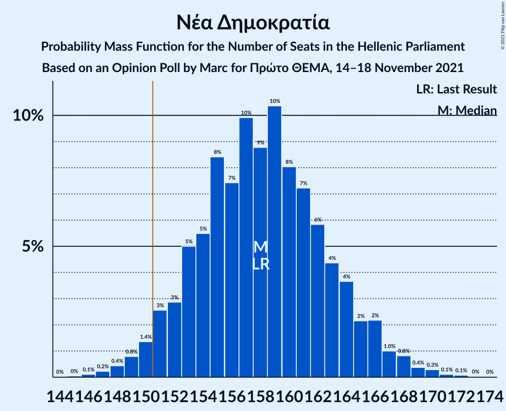

| Number of Seats | Probability | Accumulated | Special Marks |
|:---------------:|:-----------:|:-----------:|:-------------:|
| 145 | 0% | 100% |  |
| 146 | 0.1% | 99.9% |  |
| 147 | 0.2% | 99.8% |  |
| 148 | 0.4% | 99.6% |  |
| 149 | 0.8% | 99.1% |  |
| 150 | 1.4% | 98% |  |
| 151 | 3% | 97% | Majority |
| 152 | 3% | 94% |  |
| 153 | 5% | 92% |  |
| 154 | 5% | 87% |  |
| 155 | 8% | 81% |  |
| 156 | 7% | 73% |  |
| 157 | 10% | 65% |  |
| 158 | 9% | 55% | Last Result, Median |
| 159 | 10% | 47% |  |
| 160 | 8% | 36% |  |
| 161 | 7% | 28% |  |
| 162 | 6% | 21% |  |
| 163 | 4% | 15% |  |
| 164 | 4% | 11% |  |
| 165 | 2% | 7% |  |
| 166 | 2% | 5% |  |
| 167 | 1.0% | 3% |  |
| 168 | 0.8% | 2% |  |
| 169 | 0.4% | 0.9% |  |
| 170 | 0.3% | 0.5% |  |
| 171 | 0.1% | 0.2% |  |
| 172 | 0.1% | 0.1% |  |
| 173 | 0% | 0.1% |  |
| 174 | 0% | 0% |  |

### Συνασπισμός Ριζοσπαστικής Αριστεράς

*For a full overview of the results for this party, see the [Συνασπισμός Ριζοσπαστικής Αριστεράς](party-συνασπισμόςριζοσπαστικήςαριστεράς.html) page.*

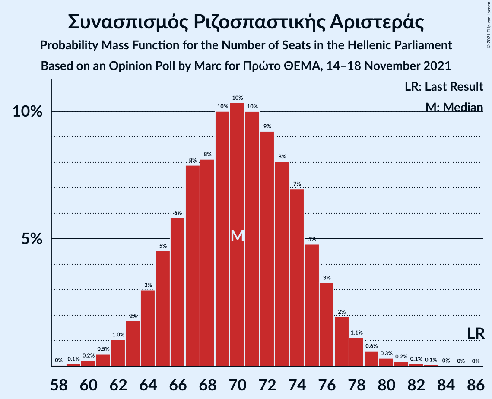

| Number of Seats | Probability | Accumulated | Special Marks |
|:---------------:|:-----------:|:-----------:|:-------------:|
| 58 | 0% | 100% |  |
| 59 | 0.1% | 99.9% |  |
| 60 | 0.2% | 99.9% |  |
| 61 | 0.5% | 99.6% |  |
| 62 | 1.0% | 99.1% |  |
| 63 | 2% | 98% |  |
| 64 | 3% | 96% |  |
| 65 | 5% | 93% |  |
| 66 | 6% | 89% |  |
| 67 | 8% | 83% |  |
| 68 | 8% | 75% |  |
| 69 | 10% | 67% |  |
| 70 | 10% | 57% | Median |
| 71 | 10% | 47% |  |
| 72 | 9% | 37% |  |
| 73 | 8% | 27% |  |
| 74 | 7% | 19% |  |
| 75 | 5% | 12% |  |
| 76 | 3% | 8% |  |
| 77 | 2% | 4% |  |
| 78 | 1.1% | 2% |  |
| 79 | 0.6% | 1.3% |  |
| 80 | 0.3% | 0.7% |  |
| 81 | 0.2% | 0.4% |  |
| 82 | 0.1% | 0.2% |  |
| 83 | 0.1% | 0.1% |  |
| 84 | 0% | 0% |  |
| 85 | 0% | 0% |  |
| 86 | 0% | 0% | Last Result |

### Κίνημα Αλλαγής

*For a full overview of the results for this party, see the [Κίνημα Αλλαγής](party-κίνημααλλαγής.html) page.*

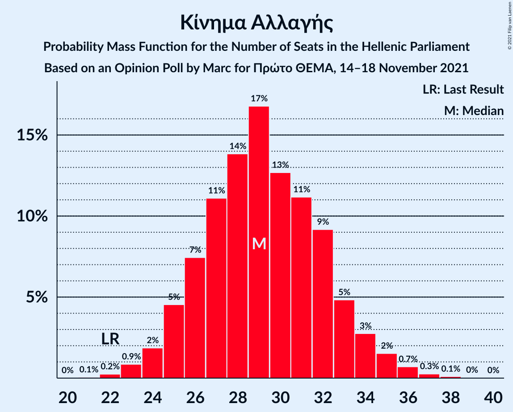

| Number of Seats | Probability | Accumulated | Special Marks |
|:---------------:|:-----------:|:-----------:|:-------------:|
| 21 | 0.1% | 100% |  |
| 22 | 0.2% | 99.9% | Last Result |
| 23 | 0.9% | 99.7% |  |
| 24 | 2% | 98.8% |  |
| 25 | 5% | 97% |  |
| 26 | 7% | 92% |  |
| 27 | 11% | 85% |  |
| 28 | 14% | 74% |  |
| 29 | 17% | 60% | Median |
| 30 | 13% | 43% |  |
| 31 | 11% | 31% |  |
| 32 | 9% | 19% |  |
| 33 | 5% | 10% |  |
| 34 | 3% | 5% |  |
| 35 | 2% | 3% |  |
| 36 | 0.7% | 1.1% |  |
| 37 | 0.3% | 0.4% |  |
| 38 | 0.1% | 0.2% |  |
| 39 | 0% | 0.1% |  |
| 40 | 0% | 0% |  |

### Κομμουνιστικό Κόμμα Ελλάδας

*For a full overview of the results for this party, see the [Κομμουνιστικό Κόμμα Ελλάδας](party-κομμουνιστικόκόμμαελλάδας.html) page.*

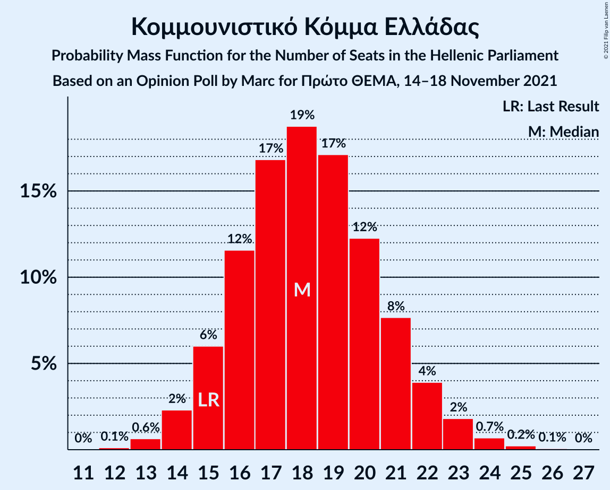

| Number of Seats | Probability | Accumulated | Special Marks |
|:---------------:|:-----------:|:-----------:|:-------------:|
| 12 | 0.1% | 100% |  |
| 13 | 0.6% | 99.9% |  |
| 14 | 2% | 99.2% |  |
| 15 | 6% | 97% | Last Result |
| 16 | 12% | 91% |  |
| 17 | 17% | 79% |  |
| 18 | 19% | 63% | Median |
| 19 | 17% | 44% |  |
| 20 | 12% | 27% |  |
| 21 | 8% | 14% |  |
| 22 | 4% | 7% |  |
| 23 | 2% | 3% |  |
| 24 | 0.7% | 1.0% |  |
| 25 | 0.2% | 0.3% |  |
| 26 | 0.1% | 0.1% |  |
| 27 | 0% | 0% |  |

### Ελληνική Λύση

*For a full overview of the results for this party, see the [Ελληνική Λύση](party-ελληνικήλύση.html) page.*

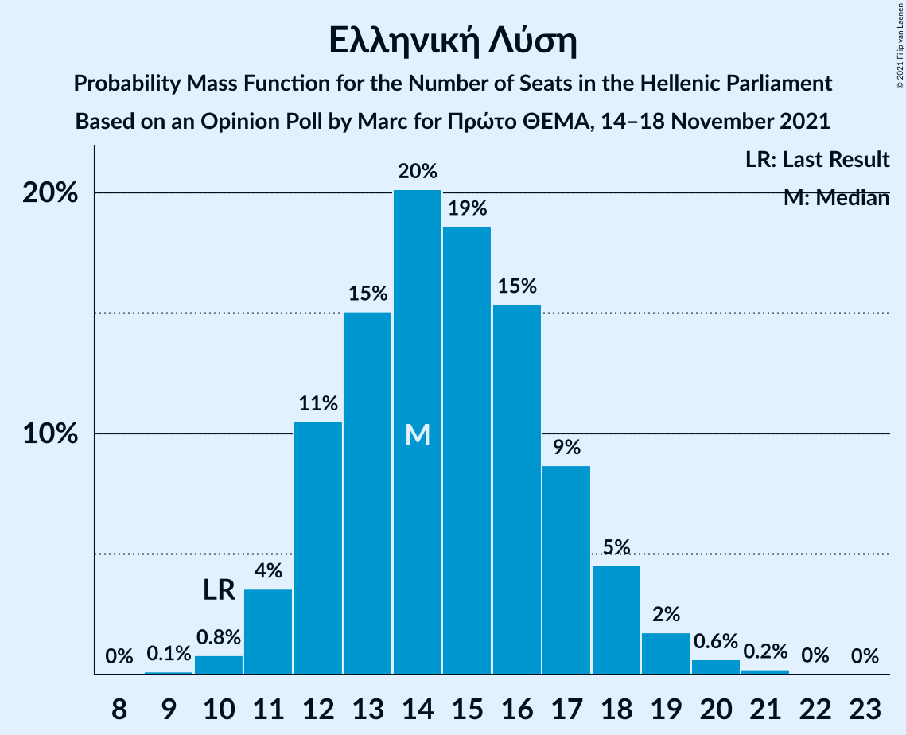

| Number of Seats | Probability | Accumulated | Special Marks |
|:---------------:|:-----------:|:-----------:|:-------------:|
| 9 | 0.1% | 100% |  |
| 10 | 0.8% | 99.9% | Last Result |
| 11 | 4% | 99.1% |  |
| 12 | 11% | 96% |  |
| 13 | 15% | 85% |  |
| 14 | 20% | 70% | Median |
| 15 | 19% | 50% |  |
| 16 | 15% | 31% |  |
| 17 | 9% | 16% |  |
| 18 | 5% | 7% |  |
| 19 | 2% | 3% |  |
| 20 | 0.6% | 0.9% |  |
| 21 | 0.2% | 0.3% |  |
| 22 | 0% | 0.1% |  |
| 23 | 0% | 0% |  |

### Μέτωπο Ευρωπαϊκής Ρεαλιστικής Ανυπακοής

*For a full overview of the results for this party, see the [Μέτωπο Ευρωπαϊκής Ρεαλιστικής Ανυπακοής](party-μέτωποευρωπαϊκήςρεαλιστικήςανυπακοής.html) page.*

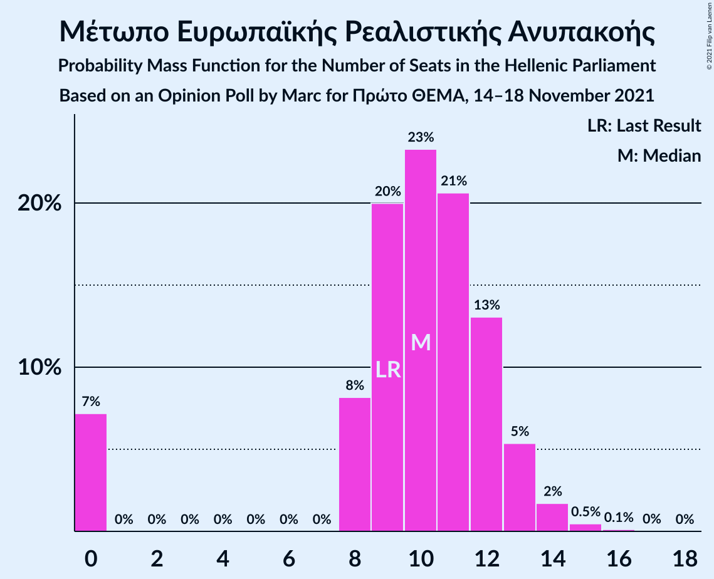

| Number of Seats | Probability | Accumulated | Special Marks |
|:---------------:|:-----------:|:-----------:|:-------------:|
| 0 | 7% | 100% |  |
| 1 | 0% | 93% |  |
| 2 | 0% | 93% |  |
| 3 | 0% | 93% |  |
| 4 | 0% | 93% |  |
| 5 | 0% | 93% |  |
| 6 | 0% | 93% |  |
| 7 | 0% | 93% |  |
| 8 | 8% | 93% |  |
| 9 | 20% | 85% | Last Result |
| 10 | 23% | 65% | Median |
| 11 | 21% | 41% |  |
| 12 | 13% | 21% |  |
| 13 | 5% | 8% |  |
| 14 | 2% | 2% |  |
| 15 | 0.5% | 0.6% |  |
| 16 | 0.1% | 0.2% |  |
| 17 | 0% | 0% |  |

## Coalitions

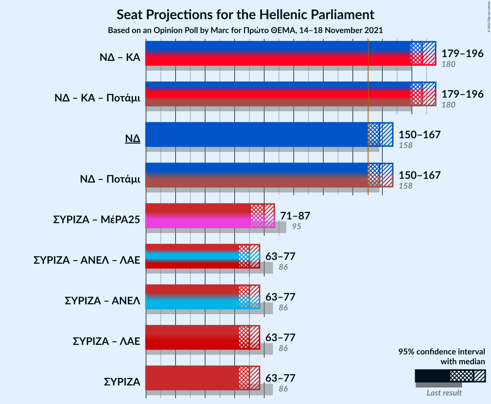

### Confidence Intervals

| Coalition | Last Result | Median | Majority? | 80% Confidence Interval | 90% Confidence Interval | 95% Confidence Interval | 99% Confidence Interval |
|:---------:|:-----------:|:------:|:---------:|:-----------------------:|:-----------------------:|:-----------------------:|:-----------------------:|
| Νέα Δημοκρατία – Κίνημα Αλλαγής | 180 | 187 | 100% | 182–193 | 180–195 | 179–196 | 177–199 |
| Νέα Δημοκρατία | 158 | 158 | 97% | 153–164 | 151–165 | 150–167 | 148–170 |
| Συνασπισμός Ριζοσπαστικής Αριστεράς – Μέτωπο Ευρωπαϊκής Ρεαλιστικής Ανυπακοής | 95 | 80 | 0% | 74–85 | 72–86 | 71–87 | 68–90 |
| Συνασπισμός Ριζοσπαστικής Αριστεράς | 86 | 70 | 0% | 65–75 | 64–76 | 63–77 | 61–80 |

### Νέα Δημοκρατία – Κίνημα Αλλαγής

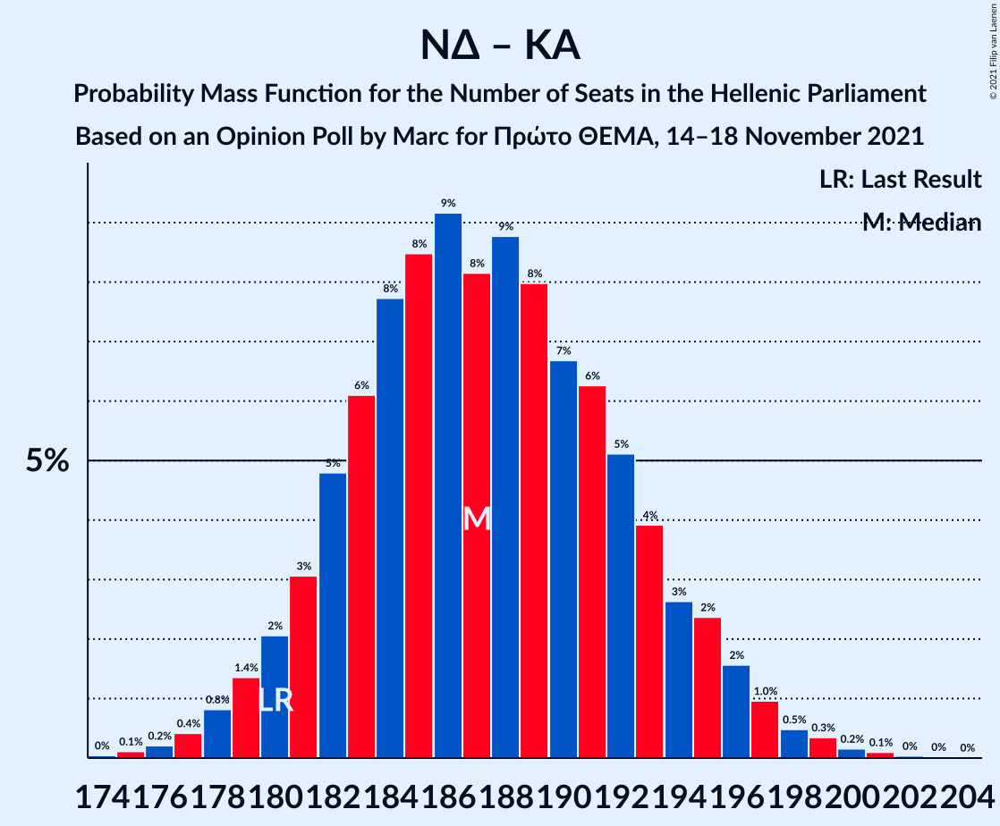

| Number of Seats | Probability | Accumulated | Special Marks |
|:---------------:|:-----------:|:-----------:|:-------------:|
| 174 | 0% | 100% |  |
| 175 | 0.1% | 99.9% |  |
| 176 | 0.2% | 99.8% |  |
| 177 | 0.4% | 99.6% |  |
| 178 | 0.8% | 99.2% |  |
| 179 | 1.4% | 98% |  |
| 180 | 2% | 97% | Last Result |
| 181 | 3% | 95% |  |
| 182 | 5% | 92% |  |
| 183 | 6% | 87% |  |
| 184 | 8% | 81% |  |
| 185 | 8% | 73% |  |
| 186 | 9% | 65% |  |
| 187 | 8% | 56% | Median |
| 188 | 9% | 47% |  |
| 189 | 8% | 39% |  |
| 190 | 7% | 31% |  |
| 191 | 6% | 24% |  |
| 192 | 5% | 18% |  |
| 193 | 4% | 13% |  |
| 194 | 3% | 9% |  |
| 195 | 2% | 6% |  |
| 196 | 2% | 4% |  |
| 197 | 1.0% | 2% |  |
| 198 | 0.5% | 1.2% |  |
| 199 | 0.3% | 0.7% |  |
| 200 | 0.2% | 0.3% |  |
| 201 | 0.1% | 0.2% |  |
| 202 | 0% | 0.1% |  |
| 203 | 0% | 0% |  |

### Νέα Δημοκρατία

| Number of Seats | Probability | Accumulated | Special Marks |
|:---------------:|:-----------:|:-----------:|:-------------:|
| 145 | 0% | 100% |  |
| 146 | 0.1% | 99.9% |  |
| 147 | 0.2% | 99.8% |  |
| 148 | 0.4% | 99.6% |  |
| 149 | 0.8% | 99.1% |  |
| 150 | 1.4% | 98% |  |
| 151 | 3% | 97% | Majority |
| 152 | 3% | 94% |  |
| 153 | 5% | 92% |  |
| 154 | 5% | 87% |  |
| 155 | 8% | 81% |  |
| 156 | 7% | 73% |  |
| 157 | 10% | 65% |  |
| 158 | 9% | 55% | Last Result, Median |
| 159 | 10% | 47% |  |
| 160 | 8% | 36% |  |
| 161 | 7% | 28% |  |
| 162 | 6% | 21% |  |
| 163 | 4% | 15% |  |
| 164 | 4% | 11% |  |
| 165 | 2% | 7% |  |
| 166 | 2% | 5% |  |
| 167 | 1.0% | 3% |  |
| 168 | 0.8% | 2% |  |
| 169 | 0.4% | 0.9% |  |
| 170 | 0.3% | 0.5% |  |
| 171 | 0.1% | 0.2% |  |
| 172 | 0.1% | 0.1% |  |
| 173 | 0% | 0.1% |  |
| 174 | 0% | 0% |  |

### Συνασπισμός Ριζοσπαστικής Αριστεράς – Μέτωπο Ευρωπαϊκής Ρεαλιστικής Ανυπακοής

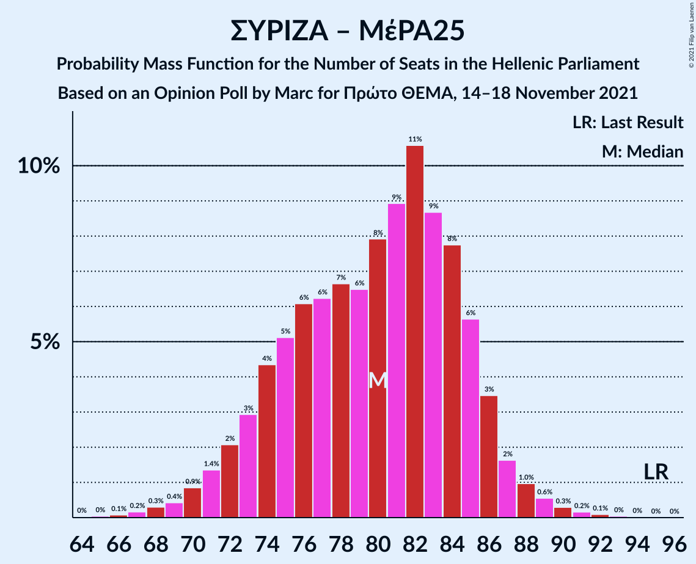

| Number of Seats | Probability | Accumulated | Special Marks |
|:---------------:|:-----------:|:-----------:|:-------------:|
| 64 | 0% | 100% |  |
| 65 | 0% | 99.9% |  |
| 66 | 0.1% | 99.9% |  |
| 67 | 0.2% | 99.8% |  |
| 68 | 0.3% | 99.6% |  |
| 69 | 0.4% | 99.3% |  |
| 70 | 0.9% | 98.9% |  |
| 71 | 1.4% | 98% |  |
| 72 | 2% | 97% |  |
| 73 | 3% | 95% |  |
| 74 | 4% | 92% |  |
| 75 | 5% | 87% |  |
| 76 | 6% | 82% |  |
| 77 | 6% | 76% |  |
| 78 | 7% | 70% |  |
| 79 | 6% | 63% |  |
| 80 | 8% | 57% | Median |
| 81 | 9% | 49% |  |
| 82 | 11% | 40% |  |
| 83 | 9% | 29% |  |
| 84 | 8% | 21% |  |
| 85 | 6% | 13% |  |
| 86 | 3% | 7% |  |
| 87 | 2% | 4% |  |
| 88 | 1.0% | 2% |  |
| 89 | 0.6% | 1.2% |  |
| 90 | 0.3% | 0.6% |  |
| 91 | 0.2% | 0.3% |  |
| 92 | 0.1% | 0.2% |  |
| 93 | 0% | 0.1% |  |
| 94 | 0% | 0% |  |
| 95 | 0% | 0% | Last Result |

### Συνασπισμός Ριζοσπαστικής Αριστεράς

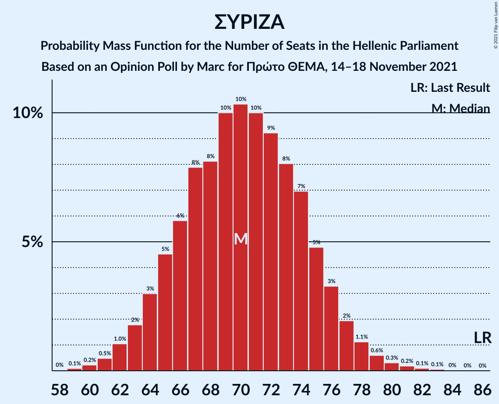

| Number of Seats | Probability | Accumulated | Special Marks |
|:---------------:|:-----------:|:-----------:|:-------------:|
| 58 | 0% | 100% |  |
| 59 | 0.1% | 99.9% |  |
| 60 | 0.2% | 99.9% |  |
| 61 | 0.5% | 99.6% |  |
| 62 | 1.0% | 99.1% |  |
| 63 | 2% | 98% |  |
| 64 | 3% | 96% |  |
| 65 | 5% | 93% |  |
| 66 | 6% | 89% |  |
| 67 | 8% | 83% |  |
| 68 | 8% | 75% |  |
| 69 | 10% | 67% |  |
| 70 | 10% | 57% | Median |
| 71 | 10% | 47% |  |
| 72 | 9% | 37% |  |
| 73 | 8% | 27% |  |
| 74 | 7% | 19% |  |
| 75 | 5% | 12% |  |
| 76 | 3% | 8% |  |
| 77 | 2% | 4% |  |
| 78 | 1.1% | 2% |  |
| 79 | 0.6% | 1.3% |  |
| 80 | 0.3% | 0.7% |  |
| 81 | 0.2% | 0.4% |  |
| 82 | 0.1% | 0.2% |  |
| 83 | 0.1% | 0.1% |  |
| 84 | 0% | 0% |  |
| 85 | 0% | 0% |  |
| 86 | 0% | 0% | Last Result |

## Technical Information

### Opinion Poll

+ **Polling firm:** Marc
+ **Commissioner(s):** Πρώτο ΘΕΜΑ
+ **Fieldwork period:** 14–18 November 2021

### Calculations

+ **Sample size:** 1003
+ **Simulations done:** 1,048,576
+ **Error estimate:** 0.90%

