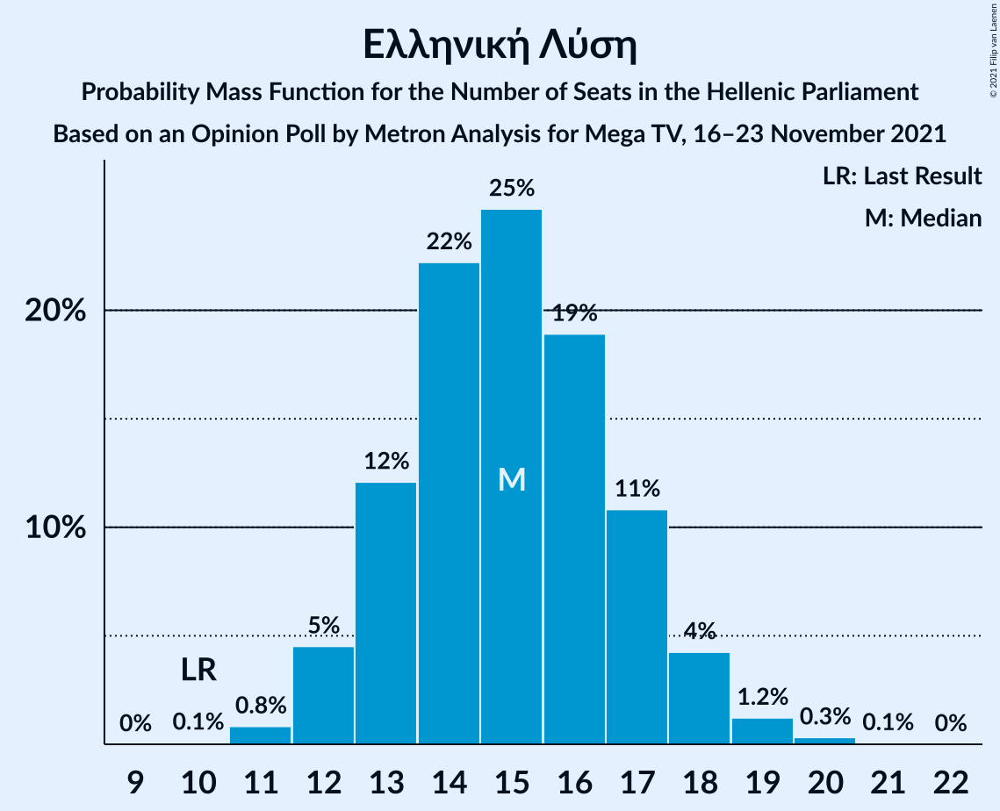

# Opinion Poll by Metron Analysis for Mega TV, 16–23 November 2021

<a href="#voting-intentions">Voting Intentions</a> | <a href="#seats">Seats</a> | <a href="#coalitions">Coalitions</a> | <a href="#technical-information">Technical Information</a>

## Voting Intentions

### Confidence Intervals

| Party | Last Result | Poll Result | 80% Confidence Interval | 90% Confidence Interval | 95% Confidence Interval | 99% Confidence Interval |
|:-----:|:-----------:|:-----------:|:-----------------------:|:-----------------------:|:-----------------------:|:-----------------------:|
| Νέα Δημοκρατία | 39.8% | 40.0% | 38.4–41.6% |37.9–42.1% |37.5–42.5% |36.8–43.3% |
| Συνασπισμός Ριζοσπαστικής Αριστεράς | 31.5% | 24.8% | 23.4–26.3% |23.0–26.7% |22.7–27.1% |22.0–27.8% |
| Κίνημα Αλλαγής | 8.1% | 12.8% | 11.7–13.9% |11.4–14.3% |11.2–14.6% |10.7–15.1% |
| Κομμουνιστικό Κόμμα Ελλάδας | 5.3% | 6.5% | 5.8–7.4% |5.5–7.7% |5.4–7.9% |5.0–8.3% |
| Ελληνική Λύση | 3.7% | 5.6% | 4.9–6.4% |4.7–6.7% |4.5–6.9% |4.2–7.3% |
| Μέτωπο Ευρωπαϊκής Ρεαλιστικής Ανυπακοής | 3.4% | 4.4% | 3.8–5.2% |3.6–5.4% |3.5–5.6% |3.2–5.9% |

*Note:* The poll result column reflects the actual value used in the calculations. Published results may vary slightly, and in addition be rounded to fewer digits.

## Seats

### Confidence Intervals

| Party | Last Result | Median | 80% Confidence Interval | 90% Confidence Interval | 95% Confidence Interval | 99% Confidence Interval |
|:-----:|:-----------:|:------:|:-----------------------:|:-----------------------:|:-----------------------:|:-----------------------:|
| <a href="#νέα-δημοκρατία">Νέα Δημοκρατία</a> | 158 | 156 | 152–160 |151–161 |150–162 |148–165 |
| <a href="#συνασπισμός-ριζοσπαστικής-αριστεράς">Συνασπισμός Ριζοσπαστικής Αριστεράς</a> | 86 | 66 | 62–70 |61–71 |60–72 |58–74 |
| <a href="#κίνημα-αλλαγής">Κίνημα Αλλαγής</a> | 22 | 34 | 31–37 |30–38 |30–39 |28–40 |
| <a href="#κομμουνιστικό-κόμμα-ελλάδας">Κομμουνιστικό Κόμμα Ελλάδας</a> | 15 | 17 | 15–20 |15–20 |14–21 |13–22 |
| <a href="#ελληνική-λύση">Ελληνική Λύση</a> | 10 | 15 | 13–17 |12–18 |12–18 |11–19 |
| <a href="#μέτωπο-ευρωπαϊκής-ρεαλιστικής-ανυπακοής">Μέτωπο Ευρωπαϊκής Ρεαλιστικής Ανυπακοής</a> | 9 | 12 | 10–14 |10–14 |9–15 |8–16 |

### Νέα Δημοκρατία

*For a full overview of the results for this party, see the [Νέα Δημοκρατία](party-νέαδημοκρατία.html) page.*

| Number of Seats | Probability | Accumulated | Special Marks |
|:---------------:|:-----------:|:-----------:|:-------------:|
| 145 | 0% | 100% |  |
| 146 | 0.1% | 99.9% |  |
| 147 | 0.3% | 99.8% |  |
| 148 | 0.6% | 99.5% |  |
| 149 | 1.2% | 98.9% |  |
| 150 | 2% | 98% |  |
| 151 | 4% | 95% | Majority |
| 152 | 6% | 92% |  |
| 153 | 7% | 85% |  |
| 154 | 10% | 78% |  |
| 155 | 12% | 68% |  |
| 156 | 12% | 56% | Median |
| 157 | 11% | 44% |  |
| 158 | 10% | 32% | Last Result |
| 159 | 8% | 22% |  |
| 160 | 6% | 14% |  |
| 161 | 4% | 8% |  |
| 162 | 2% | 5% |  |
| 163 | 1.2% | 2% |  |
| 164 | 0.7% | 1.2% |  |
| 165 | 0.3% | 0.5% |  |
| 166 | 0.1% | 0.2% |  |
| 167 | 0.1% | 0.1% |  |
| 168 | 0% | 0% |  |

### Συνασπισμός Ριζοσπαστικής Αριστεράς

*For a full overview of the results for this party, see the [Συνασπισμός Ριζοσπαστικής Αριστεράς](party-συνασπισμόςριζοσπαστικήςαριστεράς.html) page.*

| Number of Seats | Probability | Accumulated | Special Marks |
|:---------------:|:-----------:|:-----------:|:-------------:|
| 57 | 0.1% | 100% |  |
| 58 | 0.3% | 99.8% |  |
| 59 | 0.8% | 99.5% |  |
| 60 | 2% | 98.7% |  |
| 61 | 3% | 97% |  |
| 62 | 7% | 94% |  |
| 63 | 8% | 87% |  |
| 64 | 11% | 79% |  |
| 65 | 14% | 68% |  |
| 66 | 12% | 54% | Median |
| 67 | 14% | 42% |  |
| 68 | 8% | 27% |  |
| 69 | 9% | 19% |  |
| 70 | 5% | 10% |  |
| 71 | 2% | 6% |  |
| 72 | 2% | 3% |  |
| 73 | 0.6% | 1.2% |  |
| 74 | 0.4% | 0.6% |  |
| 75 | 0.1% | 0.2% |  |
| 76 | 0% | 0.1% |  |
| 77 | 0% | 0% |  |
| 78 | 0% | 0% |  |
| 79 | 0% | 0% |  |
| 80 | 0% | 0% |  |
| 81 | 0% | 0% |  |
| 82 | 0% | 0% |  |
| 83 | 0% | 0% |  |
| 84 | 0% | 0% |  |
| 85 | 0% | 0% |  |
| 86 | 0% | 0% | Last Result |

### Κίνημα Αλλαγής

*For a full overview of the results for this party, see the [Κίνημα Αλλαγής](party-κίνημααλλαγής.html) page.*

| Number of Seats | Probability | Accumulated | Special Marks |
|:---------------:|:-----------:|:-----------:|:-------------:|
| 22 | 0% | 100% | Last Result |
| 23 | 0% | 100% |  |
| 24 | 0% | 100% |  |
| 25 | 0% | 100% |  |
| 26 | 0% | 100% |  |
| 27 | 0.1% | 100% |  |
| 28 | 0.5% | 99.9% |  |
| 29 | 2% | 99.4% |  |
| 30 | 4% | 98% |  |
| 31 | 8% | 94% |  |
| 32 | 12% | 86% |  |
| 33 | 17% | 74% |  |
| 34 | 17% | 58% | Median |
| 35 | 15% | 40% |  |
| 36 | 11% | 25% |  |
| 37 | 7% | 14% |  |
| 38 | 4% | 7% |  |
| 39 | 2% | 3% |  |
| 40 | 0.7% | 1.0% |  |
| 41 | 0.2% | 0.3% |  |
| 42 | 0.1% | 0.1% |  |
| 43 | 0% | 0% |  |

### Κομμουνιστικό Κόμμα Ελλάδας

*For a full overview of the results for this party, see the [Κομμουνιστικό Κόμμα Ελλάδας](party-κομμουνιστικόκόμμαελλάδας.html) page.*

| Number of Seats | Probability | Accumulated | Special Marks |
|:---------------:|:-----------:|:-----------:|:-------------:|
| 12 | 0.1% | 100% |  |
| 13 | 0.6% | 99.9% |  |
| 14 | 3% | 99.3% |  |
| 15 | 9% | 96% | Last Result |
| 16 | 18% | 87% |  |
| 17 | 22% | 69% | Median |
| 18 | 21% | 47% |  |
| 19 | 15% | 26% |  |
| 20 | 7% | 11% |  |
| 21 | 3% | 4% |  |
| 22 | 0.8% | 1.1% |  |
| 23 | 0.2% | 0.3% |  |
| 24 | 0% | 0.1% |  |
| 25 | 0% | 0% |  |

### Ελληνική Λύση

*For a full overview of the results for this party, see the [Ελληνική Λύση](party-ελληνικήλύση.html) page.*

| Number of Seats | Probability | Accumulated | Special Marks |
|:---------------:|:-----------:|:-----------:|:-------------:|
| 10 | 0.1% | 100% | Last Result |
| 11 | 0.8% | 99.9% |  |
| 12 | 5% | 99.1% |  |
| 13 | 12% | 95% |  |
| 14 | 22% | 82% |  |
| 15 | 25% | 60% | Median |
| 16 | 19% | 36% |  |
| 17 | 11% | 17% |  |
| 18 | 4% | 6% |  |
| 19 | 1.2% | 2% |  |
| 20 | 0.3% | 0.4% |  |
| 21 | 0.1% | 0.1% |  |
| 22 | 0% | 0% |  |

### Μέτωπο Ευρωπαϊκής Ρεαλιστικής Ανυπακοής

*For a full overview of the results for this party, see the [Μέτωπο Ευρωπαϊκής Ρεαλιστικής Ανυπακοής](party-μέτωποευρωπαϊκήςρεαλιστικήςανυπακοής.html) page.*

| Number of Seats | Probability | Accumulated | Special Marks |
|:---------------:|:-----------:|:-----------:|:-------------:|
| 0 | 0.2% | 100% |  |
| 1 | 0% | 99.8% |  |
| 2 | 0% | 99.8% |  |
| 3 | 0% | 99.8% |  |
| 4 | 0% | 99.8% |  |
| 5 | 0% | 99.8% |  |
| 6 | 0% | 99.8% |  |
| 7 | 0% | 99.8% |  |
| 8 | 0.4% | 99.8% |  |
| 9 | 3% | 99.5% | Last Result |
| 10 | 16% | 96% |  |
| 11 | 26% | 80% |  |
| 12 | 22% | 55% | Median |
| 13 | 21% | 33% |  |
| 14 | 9% | 12% |  |
| 15 | 2% | 3% |  |
| 16 | 0.7% | 0.9% |  |
| 17 | 0.1% | 0.1% |  |
| 18 | 0% | 0% |  |

## Coalitions

### Confidence Intervals

| Coalition | Last Result | Median | Majority? | 80% Confidence Interval | 90% Confidence Interval | 95% Confidence Interval | 99% Confidence Interval |
|:---------:|:-----------:|:------:|:---------:|:-----------------------:|:-----------------------:|:-----------------------:|:-----------------------:|
| Νέα Δημοκρατία – Κίνημα Αλλαγής | 180 | 190 | 100% | 186–194 | 185–195 | 183–196 | 181–199 |
| Νέα Δημοκρατία | 158 | 156 | 95% | 152–160 | 151–161 | 150–162 | 148–165 |
| Συνασπισμός Ριζοσπαστικής Αριστεράς – Μέτωπο Ευρωπαϊκής Ρεαλιστικής Ανυπακοής | 95 | 78 | 0% | 74–82 | 72–83 | 72–84 | 70–86 |
| Συνασπισμός Ριζοσπαστικής Αριστεράς | 86 | 66 | 0% | 62–70 | 61–71 | 60–72 | 58–74 |

### Νέα Δημοκρατία – Κίνημα Αλλαγής

| Number of Seats | Probability | Accumulated | Special Marks |
|:---------------:|:-----------:|:-----------:|:-------------:|
| 179 | 0.1% | 100% |  |
| 180 | 0.1% | 99.9% | Last Result |
| 181 | 0.3% | 99.8% |  |
| 182 | 0.7% | 99.5% |  |
| 183 | 1.4% | 98.8% |  |
| 184 | 2% | 97% |  |
| 185 | 4% | 95% |  |
| 186 | 5% | 91% |  |
| 187 | 9% | 86% |  |
| 188 | 9% | 77% |  |
| 189 | 13% | 68% |  |
| 190 | 11% | 55% | Median |
| 191 | 12% | 44% |  |
| 192 | 10% | 32% |  |
| 193 | 8% | 23% |  |
| 194 | 6% | 14% |  |
| 195 | 4% | 9% |  |
| 196 | 2% | 5% |  |
| 197 | 1.4% | 2% |  |
| 198 | 0.6% | 1.1% |  |
| 199 | 0.3% | 0.5% |  |
| 200 | 0.1% | 0.2% |  |
| 201 | 0% | 0.1% |  |
| 202 | 0% | 0% |  |

### Νέα Δημοκρατία

| Number of Seats | Probability | Accumulated | Special Marks |
|:---------------:|:-----------:|:-----------:|:-------------:|
| 145 | 0% | 100% |  |
| 146 | 0.1% | 99.9% |  |
| 147 | 0.3% | 99.8% |  |
| 148 | 0.6% | 99.5% |  |
| 149 | 1.2% | 98.9% |  |
| 150 | 2% | 98% |  |
| 151 | 4% | 95% | Majority |
| 152 | 6% | 92% |  |
| 153 | 7% | 85% |  |
| 154 | 10% | 78% |  |
| 155 | 12% | 68% |  |
| 156 | 12% | 56% | Median |
| 157 | 11% | 44% |  |
| 158 | 10% | 32% | Last Result |
| 159 | 8% | 22% |  |
| 160 | 6% | 14% |  |
| 161 | 4% | 8% |  |
| 162 | 2% | 5% |  |
| 163 | 1.2% | 2% |  |
| 164 | 0.7% | 1.2% |  |
| 165 | 0.3% | 0.5% |  |
| 166 | 0.1% | 0.2% |  |
| 167 | 0.1% | 0.1% |  |
| 168 | 0% | 0% |  |

### Συνασπισμός Ριζοσπαστικής Αριστεράς – Μέτωπο Ευρωπαϊκής Ρεαλιστικής Ανυπακοής

| Number of Seats | Probability | Accumulated | Special Marks |
|:---------------:|:-----------:|:-----------:|:-------------:|
| 67 | 0% | 100% |  |
| 68 | 0.1% | 99.9% |  |
| 69 | 0.3% | 99.8% |  |
| 70 | 0.5% | 99.5% |  |
| 71 | 1.4% | 99.1% |  |
| 72 | 3% | 98% |  |
| 73 | 4% | 95% |  |
| 74 | 6% | 91% |  |
| 75 | 10% | 85% |  |
| 76 | 12% | 75% |  |
| 77 | 13% | 64% |  |
| 78 | 12% | 50% | Median |
| 79 | 10% | 39% |  |
| 80 | 10% | 28% |  |
| 81 | 7% | 18% |  |
| 82 | 5% | 10% |  |
| 83 | 3% | 6% |  |
| 84 | 1.5% | 3% |  |
| 85 | 0.9% | 1.5% |  |
| 86 | 0.4% | 0.6% |  |
| 87 | 0.2% | 0.2% |  |
| 88 | 0% | 0.1% |  |
| 89 | 0% | 0% |  |
| 90 | 0% | 0% |  |
| 91 | 0% | 0% |  |
| 92 | 0% | 0% |  |
| 93 | 0% | 0% |  |
| 94 | 0% | 0% |  |
| 95 | 0% | 0% | Last Result |

### Συνασπισμός Ριζοσπαστικής Αριστεράς

| Number of Seats | Probability | Accumulated | Special Marks |
|:---------------:|:-----------:|:-----------:|:-------------:|
| 57 | 0.1% | 100% |  |
| 58 | 0.3% | 99.8% |  |
| 59 | 0.8% | 99.5% |  |
| 60 | 2% | 98.7% |  |
| 61 | 3% | 97% |  |
| 62 | 7% | 94% |  |
| 63 | 8% | 87% |  |
| 64 | 11% | 79% |  |
| 65 | 14% | 68% |  |
| 66 | 12% | 54% | Median |
| 67 | 14% | 42% |  |
| 68 | 8% | 27% |  |
| 69 | 9% | 19% |  |
| 70 | 5% | 10% |  |
| 71 | 2% | 6% |  |
| 72 | 2% | 3% |  |
| 73 | 0.6% | 1.2% |  |
| 74 | 0.4% | 0.6% |  |
| 75 | 0.1% | 0.2% |  |
| 76 | 0% | 0.1% |  |
| 77 | 0% | 0% |  |
| 78 | 0% | 0% |  |
| 79 | 0% | 0% |  |
| 80 | 0% | 0% |  |
| 81 | 0% | 0% |  |
| 82 | 0% | 0% |  |
| 83 | 0% | 0% |  |
| 84 | 0% | 0% |  |
| 85 | 0% | 0% |  |
| 86 | 0% | 0% | Last Result |

## Technical Information

### Opinion Poll

+ **Polling firm:** Metron Analysis
+ **Commissioner(s):** Mega TV
+ **Fieldwork period:** 16–23 November 2021

### Calculations

+ **Sample size:** 1503
+ **Simulations done:** 1,048,576
+ **Error estimate:** 0.81%

