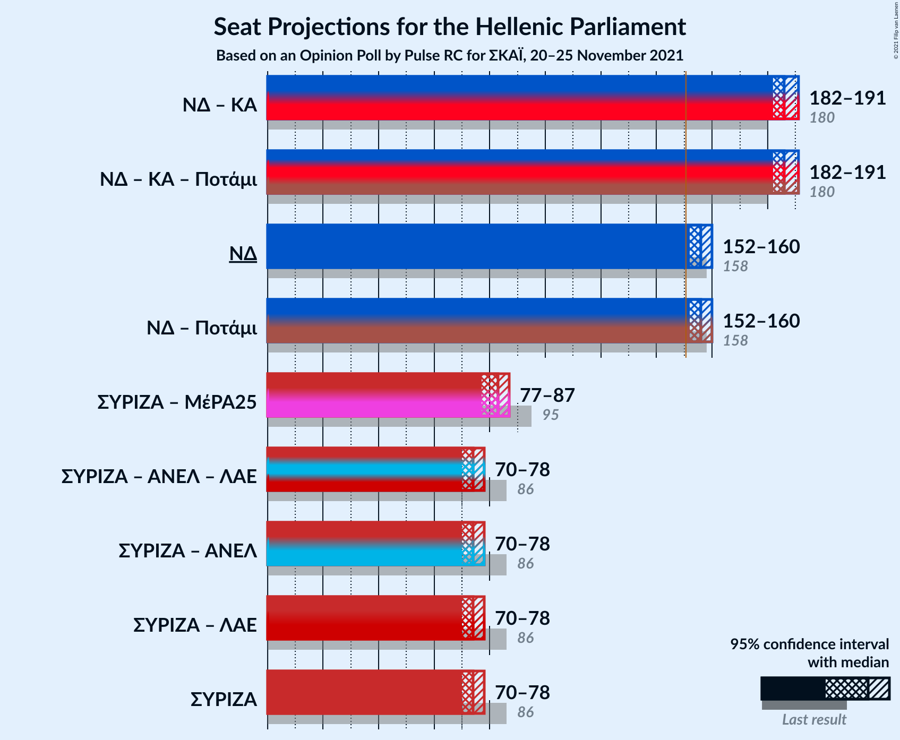

# Opinion Poll by Pulse RC for ΣΚΑΪ, 20–25 November 2021

<a href="#voting-intentions">Voting Intentions</a> | <a href="#seats">Seats</a> | <a href="#coalitions">Coalitions</a> | <a href="#technical-information">Technical Information</a>

## Voting Intentions

### Confidence Intervals

| Party | Last Result | Poll Result | 80% Confidence Interval | 90% Confidence Interval | 95% Confidence Interval | 99% Confidence Interval |
|:-----:|:-----------:|:-----------:|:-----------------------:|:-----------------------:|:-----------------------:|:-----------------------:|
| Νέα Δημοκρατία | 39.8% | 38.2% | 37.2–39.2% |36.9–39.5% |36.7–39.7% |36.2–40.2% |
| Συνασπισμός Ριζοσπαστικής Αριστεράς | 31.5% | 26.6% | 25.7–27.5% |25.5–27.8% |25.2–28.0% |24.8–28.4% |
| Κίνημα Αλλαγής | 8.1% | 11.0% | 10.4–11.7% |10.2–11.8% |10.1–12.0% |9.8–12.3% |
| Κομμουνιστικό Κόμμα Ελλάδας | 5.3% | 6.4% | 5.9–6.9% |5.8–7.1% |5.7–7.2% |5.5–7.5% |
| Ελληνική Λύση | 3.7% | 4.6% | 4.2–5.1% |4.1–5.2% |4.0–5.3% |3.8–5.5% |
| Μέτωπο Ευρωπαϊκής Ρεαλιστικής Ανυπακοής | 3.4% | 3.5% | 3.1–3.9% |3.0–4.0% |3.0–4.1% |2.8–4.3% |

*Note:* The poll result column reflects the actual value used in the calculations. Published results may vary slightly, and in addition be rounded to fewer digits.

## Seats

### Confidence Intervals

| Party | Last Result | Median | 80% Confidence Interval | 90% Confidence Interval | 95% Confidence Interval | 99% Confidence Interval |
|:-----:|:-----------:|:------:|:-----------------------:|:-----------------------:|:-----------------------:|:-----------------------:|
| <a href="#νέα-δημοκρατία">Νέα Δημοκρατία</a> | 158 | 156 | 153–159 |152–160 |152–160 |150–162 |
| <a href="#συνασπισμός-ριζοσπαστικής-αριστεράς">Συνασπισμός Ριζοσπαστικής Αριστεράς</a> | 86 | 74 | 71–76 |70–77 |70–78 |69–79 |
| <a href="#κίνημα-αλλαγής">Κίνημα Αλλαγής</a> | 22 | 30 | 29–32 |28–33 |28–33 |27–34 |
| <a href="#κομμουνιστικό-κόμμα-ελλάδας">Κομμουνιστικό Κόμμα Ελλάδας</a> | 15 | 18 | 16–19 |16–20 |16–20 |15–21 |
| <a href="#ελληνική-λύση">Ελληνική Λύση</a> | 10 | 13 | 12–14 |11–14 |11–15 |11–15 |
| <a href="#μέτωπο-ευρωπαϊκής-ρεαλιστικής-ανυπακοής">Μέτωπο Ευρωπαϊκής Ρεαλιστικής Ανυπακοής</a> | 9 | 10 | 9–11 |8–11 |0–11 |0–12 |

### Νέα Δημοκρατία

*For a full overview of the results for this party, see the [Νέα Δημοκρατία](party-νέαδημοκρατία.html) page.*

| Number of Seats | Probability | Accumulated | Special Marks |
|:---------------:|:-----------:|:-----------:|:-------------:|
| 149 | 0.1% | 100% |  |
| 150 | 0.4% | 99.9% |  |
| 151 | 2% | 99.4% | Majority |
| 152 | 4% | 98% |  |
| 153 | 9% | 94% |  |
| 154 | 13% | 85% |  |
| 155 | 18% | 73% |  |
| 156 | 18% | 54% | Median |
| 157 | 16% | 36% |  |
| 158 | 10% | 21% | Last Result |
| 159 | 6% | 11% |  |
| 160 | 3% | 5% |  |
| 161 | 1.2% | 2% |  |
| 162 | 0.6% | 1.1% |  |
| 163 | 0.3% | 0.5% |  |
| 164 | 0.1% | 0.2% |  |
| 165 | 0% | 0.1% |  |
| 166 | 0% | 0% |  |

### Συνασπισμός Ριζοσπαστικής Αριστεράς

*For a full overview of the results for this party, see the [Συνασπισμός Ριζοσπαστικής Αριστεράς](party-συνασπισμόςριζοσπαστικήςαριστεράς.html) page.*

| Number of Seats | Probability | Accumulated | Special Marks |
|:---------------:|:-----------:|:-----------:|:-------------:|
| 67 | 0% | 100% |  |
| 68 | 0.3% | 99.9% |  |
| 69 | 1.2% | 99.7% |  |
| 70 | 4% | 98% |  |
| 71 | 9% | 94% |  |
| 72 | 15% | 85% |  |
| 73 | 20% | 71% |  |
| 74 | 19% | 51% | Median |
| 75 | 15% | 33% |  |
| 76 | 9% | 17% |  |
| 77 | 5% | 8% |  |
| 78 | 2% | 3% |  |
| 79 | 0.8% | 1.1% |  |
| 80 | 0.2% | 0.3% |  |
| 81 | 0.1% | 0.1% |  |
| 82 | 0% | 0% |  |
| 83 | 0% | 0% |  |
| 84 | 0% | 0% |  |
| 85 | 0% | 0% |  |
| 86 | 0% | 0% | Last Result |

### Κίνημα Αλλαγής

*For a full overview of the results for this party, see the [Κίνημα Αλλαγής](party-κίνημααλλαγής.html) page.*

| Number of Seats | Probability | Accumulated | Special Marks |
|:---------------:|:-----------:|:-----------:|:-------------:|
| 22 | 0% | 100% | Last Result |
| 23 | 0% | 100% |  |
| 24 | 0% | 100% |  |
| 25 | 0% | 100% |  |
| 26 | 0.1% | 100% |  |
| 27 | 1.2% | 99.9% |  |
| 28 | 6% | 98.7% |  |
| 29 | 17% | 93% |  |
| 30 | 27% | 76% | Median |
| 31 | 26% | 49% |  |
| 32 | 15% | 23% |  |
| 33 | 6% | 8% |  |
| 34 | 2% | 2% |  |
| 35 | 0.2% | 0.3% |  |
| 36 | 0% | 0% |  |

### Κομμουνιστικό Κόμμα Ελλάδας

*For a full overview of the results for this party, see the [Κομμουνιστικό Κόμμα Ελλάδας](party-κομμουνιστικόκόμμαελλάδας.html) page.*

| Number of Seats | Probability | Accumulated | Special Marks |
|:---------------:|:-----------:|:-----------:|:-------------:|
| 14 | 0.1% | 100% |  |
| 15 | 1.3% | 99.9% | Last Result |
| 16 | 9% | 98.6% |  |
| 17 | 30% | 89% |  |
| 18 | 33% | 59% | Median |
| 19 | 21% | 27% |  |
| 20 | 5% | 6% |  |
| 21 | 0.8% | 0.9% |  |
| 22 | 0.1% | 0.1% |  |
| 23 | 0% | 0% |  |

### Ελληνική Λύση

*For a full overview of the results for this party, see the [Ελληνική Λύση](party-ελληνικήλύση.html) page.*

| Number of Seats | Probability | Accumulated | Special Marks |
|:---------------:|:-----------:|:-----------:|:-------------:|
| 10 | 0.5% | 100% | Last Result |
| 11 | 7% | 99.5% |  |
| 12 | 29% | 93% |  |
| 13 | 40% | 64% | Median |
| 14 | 19% | 23% |  |
| 15 | 4% | 4% |  |
| 16 | 0.3% | 0.3% |  |
| 17 | 0% | 0% |  |

### Μέτωπο Ευρωπαϊκής Ρεαλιστικής Ανυπακοής

*For a full overview of the results for this party, see the [Μέτωπο Ευρωπαϊκής Ρεαλιστικής Ανυπακοής](party-μέτωποευρωπαϊκήςρεαλιστικήςανυπακοής.html) page.*

| Number of Seats | Probability | Accumulated | Special Marks |
|:---------------:|:-----------:|:-----------:|:-------------:|
| 0 | 4% | 100% |  |
| 1 | 0% | 96% |  |
| 2 | 0% | 96% |  |
| 3 | 0% | 96% |  |
| 4 | 0% | 96% |  |
| 5 | 0% | 96% |  |
| 6 | 0% | 96% |  |
| 7 | 0% | 96% |  |
| 8 | 3% | 96% |  |
| 9 | 33% | 93% | Last Result |
| 10 | 43% | 60% | Median |
| 11 | 16% | 18% |  |
| 12 | 2% | 2% |  |
| 13 | 0.1% | 0.1% |  |
| 14 | 0% | 0% |  |

## Coalitions

### Confidence Intervals

| Coalition | Last Result | Median | Majority? | 80% Confidence Interval | 90% Confidence Interval | 95% Confidence Interval | 99% Confidence Interval |
|:---------:|:-----------:|:------:|:---------:|:-----------------------:|:-----------------------:|:-----------------------:|:-----------------------:|
| Νέα Δημοκρατία – Κίνημα Αλλαγής | 180 | 186 | 100% | 184–189 | 183–190 | 182–191 | 181–194 |
| Νέα Δημοκρατία | 158 | 156 | 99.4% | 153–159 | 152–160 | 152–160 | 150–162 |
| Συνασπισμός Ριζοσπαστικής Αριστεράς – Μέτωπο Ευρωπαϊκής Ρεαλιστικής Ανυπακοής | 95 | 83 | 0% | 80–86 | 79–87 | 77–87 | 74–88 |
| Συνασπισμός Ριζοσπαστικής Αριστεράς | 86 | 74 | 0% | 71–76 | 70–77 | 70–78 | 69–79 |

### Νέα Δημοκρατία – Κίνημα Αλλαγής

| Number of Seats | Probability | Accumulated | Special Marks |
|:---------------:|:-----------:|:-----------:|:-------------:|
| 179 | 0.1% | 100% |  |
| 180 | 0.3% | 99.9% | Last Result |
| 181 | 1.1% | 99.7% |  |
| 182 | 3% | 98.6% |  |
| 183 | 6% | 96% |  |
| 184 | 11% | 90% |  |
| 185 | 16% | 79% |  |
| 186 | 19% | 63% | Median |
| 187 | 16% | 43% |  |
| 188 | 12% | 28% |  |
| 189 | 7% | 15% |  |
| 190 | 4% | 8% |  |
| 191 | 2% | 4% |  |
| 192 | 1.1% | 2% |  |
| 193 | 0.6% | 1.3% |  |
| 194 | 0.4% | 0.7% |  |
| 195 | 0.2% | 0.3% |  |
| 196 | 0.1% | 0.1% |  |
| 197 | 0% | 0% |  |

### Νέα Δημοκρατία

| Number of Seats | Probability | Accumulated | Special Marks |
|:---------------:|:-----------:|:-----------:|:-------------:|
| 149 | 0.1% | 100% |  |
| 150 | 0.4% | 99.9% |  |
| 151 | 2% | 99.4% | Majority |
| 152 | 4% | 98% |  |
| 153 | 9% | 94% |  |
| 154 | 13% | 85% |  |
| 155 | 18% | 73% |  |
| 156 | 18% | 54% | Median |
| 157 | 16% | 36% |  |
| 158 | 10% | 21% | Last Result |
| 159 | 6% | 11% |  |
| 160 | 3% | 5% |  |
| 161 | 1.2% | 2% |  |
| 162 | 0.6% | 1.1% |  |
| 163 | 0.3% | 0.5% |  |
| 164 | 0.1% | 0.2% |  |
| 165 | 0% | 0.1% |  |
| 166 | 0% | 0% |  |

### Συνασπισμός Ριζοσπαστικής Αριστεράς – Μέτωπο Ευρωπαϊκής Ρεαλιστικής Ανυπακοής

| Number of Seats | Probability | Accumulated | Special Marks |
|:---------------:|:-----------:|:-----------:|:-------------:|
| 72 | 0% | 100% |  |
| 73 | 0.1% | 99.9% |  |
| 74 | 0.3% | 99.8% |  |
| 75 | 0.5% | 99.5% |  |
| 76 | 0.8% | 99.0% |  |
| 77 | 0.8% | 98% |  |
| 78 | 1.1% | 97% |  |
| 79 | 2% | 96% |  |
| 80 | 5% | 94% |  |
| 81 | 9% | 89% |  |
| 82 | 17% | 79% |  |
| 83 | 19% | 63% |  |
| 84 | 18% | 44% | Median |
| 85 | 14% | 26% |  |
| 86 | 8% | 13% |  |
| 87 | 4% | 5% |  |
| 88 | 1.2% | 2% |  |
| 89 | 0.3% | 0.4% |  |
| 90 | 0.1% | 0.1% |  |
| 91 | 0% | 0% |  |
| 92 | 0% | 0% |  |
| 93 | 0% | 0% |  |
| 94 | 0% | 0% |  |
| 95 | 0% | 0% | Last Result |

### Συνασπισμός Ριζοσπαστικής Αριστεράς

| Number of Seats | Probability | Accumulated | Special Marks |
|:---------------:|:-----------:|:-----------:|:-------------:|
| 67 | 0% | 100% |  |
| 68 | 0.3% | 99.9% |  |
| 69 | 1.2% | 99.7% |  |
| 70 | 4% | 98% |  |
| 71 | 9% | 94% |  |
| 72 | 15% | 85% |  |
| 73 | 20% | 71% |  |
| 74 | 19% | 51% | Median |
| 75 | 15% | 33% |  |
| 76 | 9% | 17% |  |
| 77 | 5% | 8% |  |
| 78 | 2% | 3% |  |
| 79 | 0.8% | 1.1% |  |
| 80 | 0.2% | 0.3% |  |
| 81 | 0.1% | 0.1% |  |
| 82 | 0% | 0% |  |
| 83 | 0% | 0% |  |
| 84 | 0% | 0% |  |
| 85 | 0% | 0% |  |
| 86 | 0% | 0% | Last Result |

## Technical Information

### Opinion Poll

+ **Polling firm:** Pulse RC
+ **Commissioner(s):** ΣΚΑΪ
+ **Fieldwork period:** 20–25 November 2021

### Calculations

+ **Sample size:** 4012
+ **Simulations done:** 1,048,576
+ **Error estimate:** 0.34%

