# Opinion Poll by MRB, 13–14 December 2021

<a href="#voting-intentions">Voting Intentions</a> | <a href="#seats">Seats</a> | <a href="#coalitions">Coalitions</a> | <a href="#technical-information">Technical Information</a>

## Voting Intentions

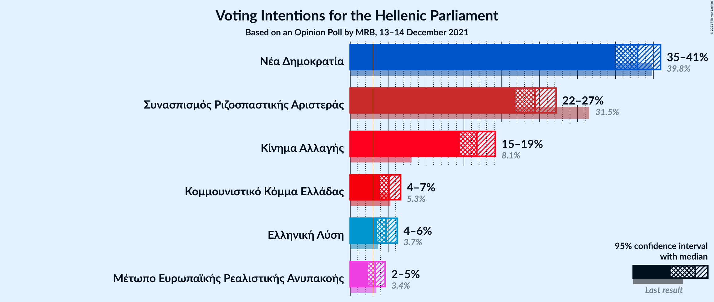

### Confidence Intervals

| Party | Last Result | Poll Result | 80% Confidence Interval | 90% Confidence Interval | 95% Confidence Interval | 99% Confidence Interval |
|:-----:|:-----------:|:-----------:|:-----------------------:|:-----------------------:|:-----------------------:|:-----------------------:|
| Νέα Δημοκρατία | 39.8% | 37.9% | 36.0–39.9% |35.4–40.5% |34.9–41.0% |34.0–41.9% |
| Συνασπισμός Ριζοσπαστικής Αριστεράς | 31.5% | 24.4% | 22.7–26.2% |22.2–26.7% |21.8–27.2% |21.0–28.0% |
| Κίνημα Αλλαγής | 8.1% | 16.7% | 15.3–18.3% |14.9–18.7% |14.5–19.1% |13.9–19.9% |
| Κομμουνιστικό Κόμμα Ελλάδας | 5.3% | 5.1% | 4.3–6.1% |4.1–6.4% |3.9–6.6% |3.6–7.2% |
| Ελληνική Λύση | 3.7% | 4.7% | 3.9–5.7% |3.7–6.0% |3.6–6.2% |3.2–6.7% |
| Μέτωπο Ευρωπαϊκής Ρεαλιστικής Ανυπακοής | 3.4% | 3.3% | 2.7–4.1% |2.5–4.4% |2.4–4.6% |2.1–5.0% |

*Note:* The poll result column reflects the actual value used in the calculations. Published results may vary slightly, and in addition be rounded to fewer digits.

## Seats

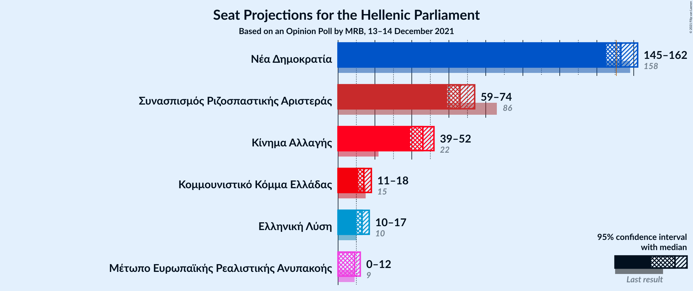

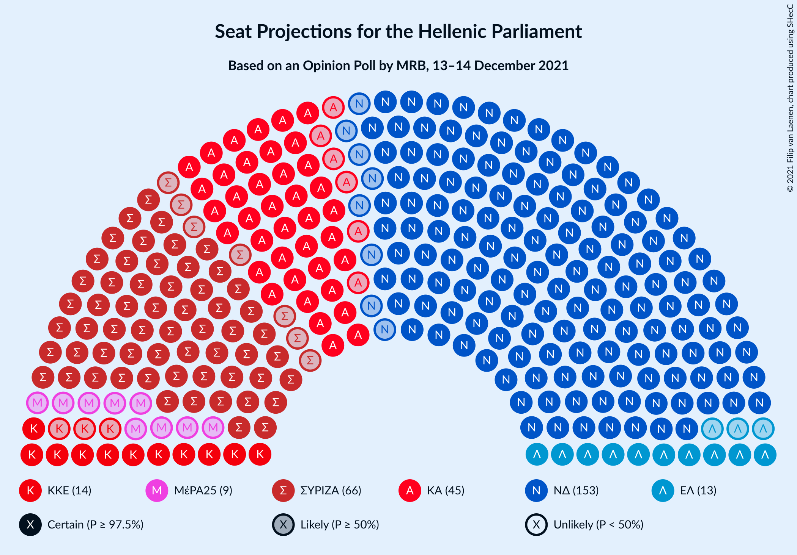

### Confidence Intervals

| Party | Last Result | Median | 80% Confidence Interval | 90% Confidence Interval | 95% Confidence Interval | 99% Confidence Interval |
|:-----:|:-----------:|:------:|:-----------------------:|:-----------------------:|:-----------------------:|:-----------------------:|
| <a href="#νέα-δημοκρατία">Νέα Δημοκρατία</a> | 158 | 153 | 148–159 |146–161 |145–162 |142–165 |
| <a href="#συνασπισμός-ριζοσπαστικής-αριστεράς">Συνασπισμός Ριζοσπαστικής Αριστεράς</a> | 86 | 66 | 62–71 |60–73 |59–74 |57–77 |
| <a href="#κίνημα-αλλαγής">Κίνημα Αλλαγής</a> | 22 | 46 | 41–50 |40–51 |39–52 |38–55 |
| <a href="#κομμουνιστικό-κόμμα-ελλάδας">Κομμουνιστικό Κόμμα Ελλάδας</a> | 15 | 14 | 12–17 |11–17 |11–18 |10–20 |
| <a href="#ελληνική-λύση">Ελληνική Λύση</a> | 10 | 13 | 11–16 |10–16 |10–17 |9–18 |
| <a href="#μέτωπο-ευρωπαϊκής-ρεαλιστικής-ανυπακοής">Μέτωπο Ευρωπαϊκής Ρεαλιστικής Ανυπακοής</a> | 9 | 9 | 0–11 |0–12 |0–12 |0–14 |

### Νέα Δημοκρατία

*For a full overview of the results for this party, see the [Νέα Δημοκρατία](party-νέαδημοκρατία.html) page.*

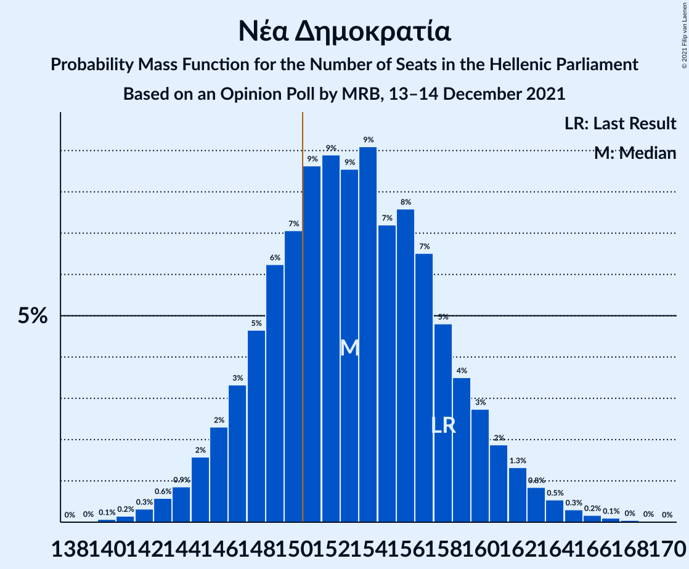

| Number of Seats | Probability | Accumulated | Special Marks |
|:---------------:|:-----------:|:-----------:|:-------------:|
| 140 | 0.1% | 100% |  |
| 141 | 0.2% | 99.9% |  |
| 142 | 0.3% | 99.7% |  |
| 143 | 0.6% | 99.4% |  |
| 144 | 0.9% | 98.8% |  |
| 145 | 2% | 98% |  |
| 146 | 2% | 96% |  |
| 147 | 3% | 94% |  |
| 148 | 5% | 91% |  |
| 149 | 6% | 86% |  |
| 150 | 7% | 80% |  |
| 151 | 9% | 73% | Majority |
| 152 | 9% | 64% |  |
| 153 | 9% | 55% | Median |
| 154 | 9% | 47% |  |
| 155 | 7% | 38% |  |
| 156 | 8% | 30% |  |
| 157 | 7% | 23% |  |
| 158 | 5% | 16% | Last Result |
| 159 | 4% | 12% |  |
| 160 | 3% | 8% |  |
| 161 | 2% | 5% |  |
| 162 | 1.3% | 3% |  |
| 163 | 0.8% | 2% |  |
| 164 | 0.5% | 1.2% |  |
| 165 | 0.3% | 0.7% |  |
| 166 | 0.2% | 0.4% |  |
| 167 | 0.1% | 0.2% |  |
| 168 | 0% | 0.1% |  |
| 169 | 0% | 0.1% |  |
| 170 | 0% | 0% |  |

### Συνασπισμός Ριζοσπαστικής Αριστεράς

*For a full overview of the results for this party, see the [Συνασπισμός Ριζοσπαστικής Αριστεράς](party-συνασπισμόςριζοσπαστικήςαριστεράς.html) page.*

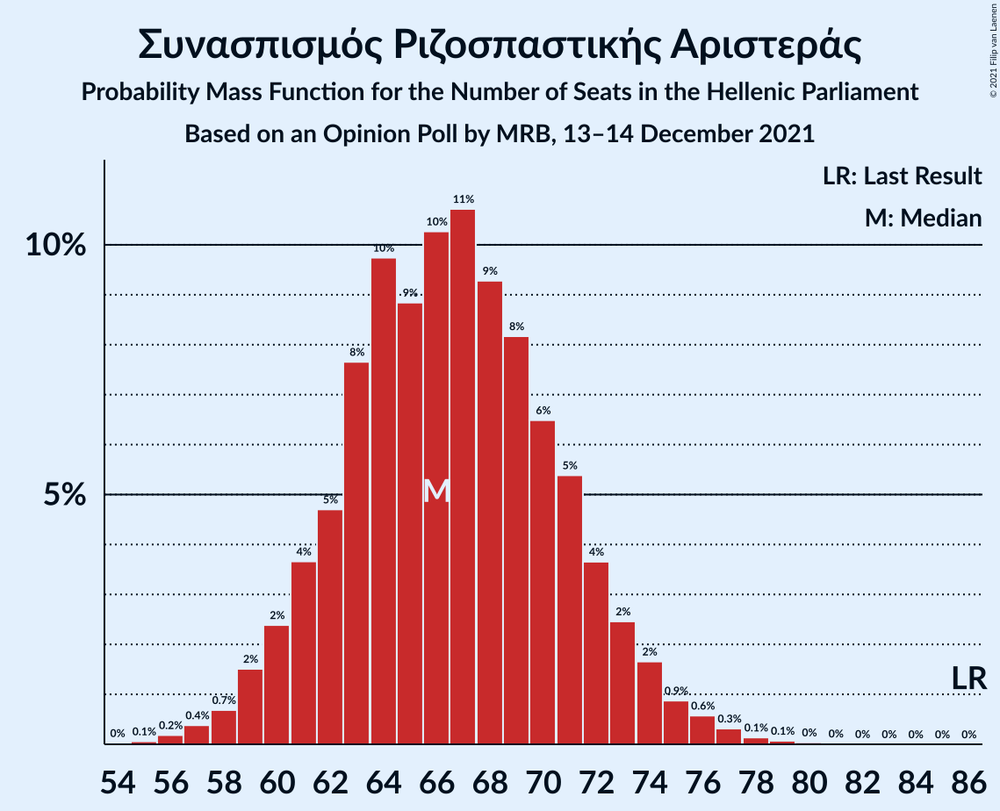

| Number of Seats | Probability | Accumulated | Special Marks |
|:---------------:|:-----------:|:-----------:|:-------------:|
| 55 | 0.1% | 100% |  |
| 56 | 0.2% | 99.9% |  |
| 57 | 0.4% | 99.7% |  |
| 58 | 0.7% | 99.3% |  |
| 59 | 2% | 98.6% |  |
| 60 | 2% | 97% |  |
| 61 | 4% | 95% |  |
| 62 | 5% | 91% |  |
| 63 | 8% | 86% |  |
| 64 | 10% | 79% |  |
| 65 | 9% | 69% |  |
| 66 | 10% | 60% | Median |
| 67 | 11% | 50% |  |
| 68 | 9% | 39% |  |
| 69 | 8% | 30% |  |
| 70 | 6% | 22% |  |
| 71 | 5% | 15% |  |
| 72 | 4% | 10% |  |
| 73 | 2% | 6% |  |
| 74 | 2% | 4% |  |
| 75 | 0.9% | 2% |  |
| 76 | 0.6% | 1.2% |  |
| 77 | 0.3% | 0.6% |  |
| 78 | 0.1% | 0.3% |  |
| 79 | 0.1% | 0.1% |  |
| 80 | 0% | 0.1% |  |
| 81 | 0% | 0% |  |
| 82 | 0% | 0% |  |
| 83 | 0% | 0% |  |
| 84 | 0% | 0% |  |
| 85 | 0% | 0% |  |
| 86 | 0% | 0% | Last Result |

### Κίνημα Αλλαγής

*For a full overview of the results for this party, see the [Κίνημα Αλλαγής](party-κίνημααλλαγής.html) page.*

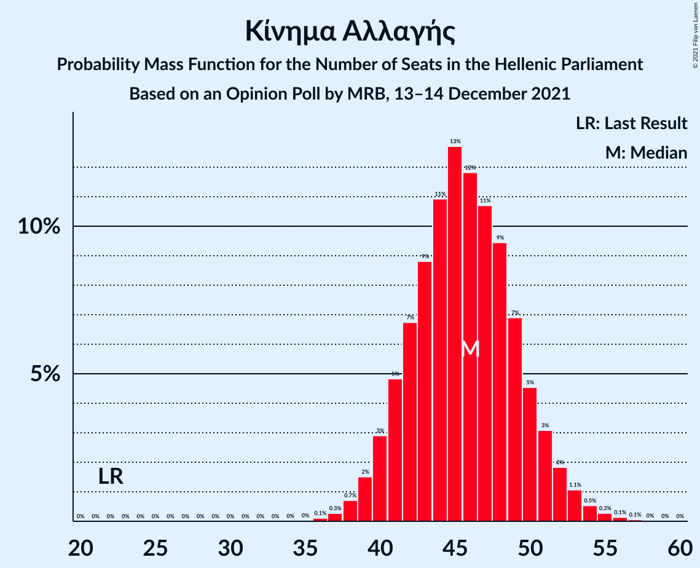

| Number of Seats | Probability | Accumulated | Special Marks |
|:---------------:|:-----------:|:-----------:|:-------------:|
| 22 | 0% | 100% | Last Result |
| 23 | 0% | 100% |  |
| 24 | 0% | 100% |  |
| 25 | 0% | 100% |  |
| 26 | 0% | 100% |  |
| 27 | 0% | 100% |  |
| 28 | 0% | 100% |  |
| 29 | 0% | 100% |  |
| 30 | 0% | 100% |  |
| 31 | 0% | 100% |  |
| 32 | 0% | 100% |  |
| 33 | 0% | 100% |  |
| 34 | 0% | 100% |  |
| 35 | 0% | 100% |  |
| 36 | 0.1% | 100% |  |
| 37 | 0.3% | 99.9% |  |
| 38 | 0.7% | 99.6% |  |
| 39 | 2% | 98.9% |  |
| 40 | 3% | 97% |  |
| 41 | 5% | 94% |  |
| 42 | 7% | 90% |  |
| 43 | 9% | 83% |  |
| 44 | 11% | 74% |  |
| 45 | 13% | 63% |  |
| 46 | 12% | 50% | Median |
| 47 | 11% | 39% |  |
| 48 | 9% | 28% |  |
| 49 | 7% | 18% |  |
| 50 | 5% | 12% |  |
| 51 | 3% | 7% |  |
| 52 | 2% | 4% |  |
| 53 | 1.1% | 2% |  |
| 54 | 0.5% | 1.0% |  |
| 55 | 0.3% | 0.5% |  |
| 56 | 0.1% | 0.2% |  |
| 57 | 0.1% | 0.1% |  |
| 58 | 0% | 0% |  |

### Κομμουνιστικό Κόμμα Ελλάδας

*For a full overview of the results for this party, see the [Κομμουνιστικό Κόμμα Ελλάδας](party-κομμουνιστικόκόμμαελλάδας.html) page.*

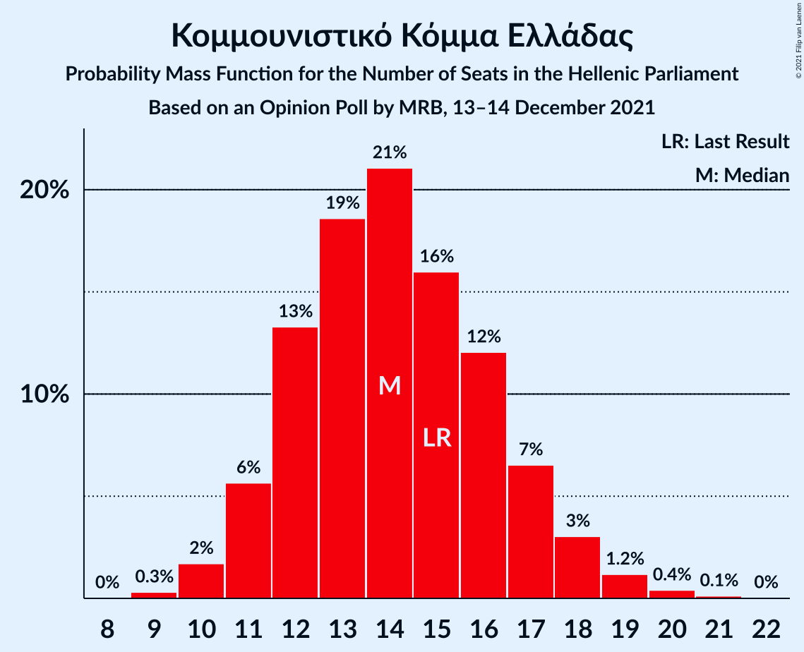

| Number of Seats | Probability | Accumulated | Special Marks |
|:---------------:|:-----------:|:-----------:|:-------------:|
| 9 | 0.3% | 100% |  |
| 10 | 2% | 99.7% |  |
| 11 | 6% | 98% |  |
| 12 | 13% | 92% |  |
| 13 | 19% | 79% |  |
| 14 | 21% | 60% | Median |
| 15 | 16% | 39% | Last Result |
| 16 | 12% | 23% |  |
| 17 | 7% | 11% |  |
| 18 | 3% | 5% |  |
| 19 | 1.2% | 2% |  |
| 20 | 0.4% | 0.6% |  |
| 21 | 0.1% | 0.2% |  |
| 22 | 0% | 0% |  |

### Ελληνική Λύση

*For a full overview of the results for this party, see the [Ελληνική Λύση](party-ελληνικήλύση.html) page.*

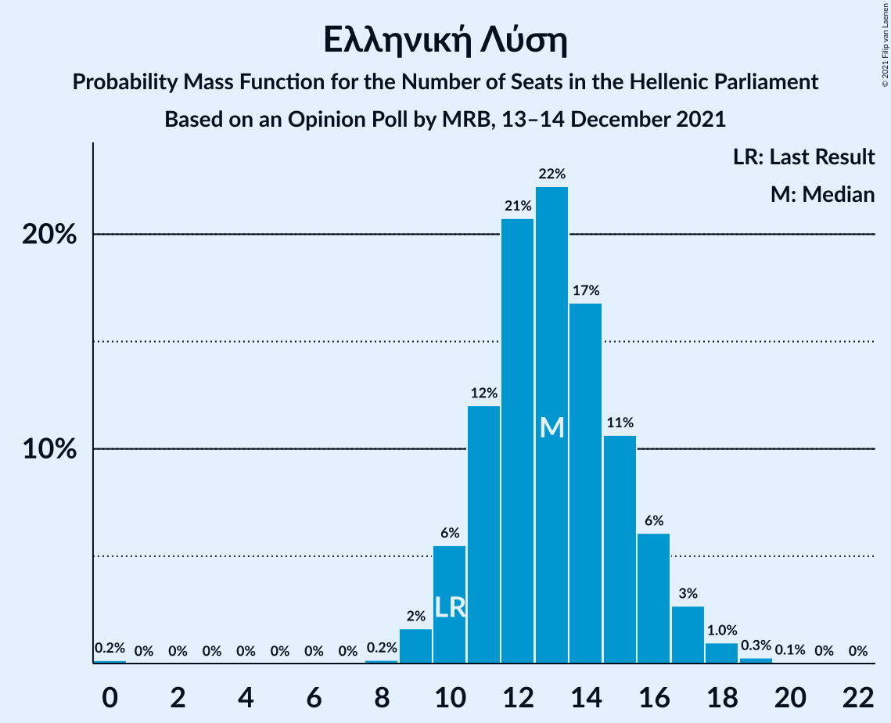

| Number of Seats | Probability | Accumulated | Special Marks |
|:---------------:|:-----------:|:-----------:|:-------------:|
| 0 | 0.2% | 100% |  |
| 1 | 0% | 99.8% |  |
| 2 | 0% | 99.8% |  |
| 3 | 0% | 99.8% |  |
| 4 | 0% | 99.8% |  |
| 5 | 0% | 99.8% |  |
| 6 | 0% | 99.8% |  |
| 7 | 0% | 99.8% |  |
| 8 | 0.2% | 99.8% |  |
| 9 | 2% | 99.7% |  |
| 10 | 6% | 98% | Last Result |
| 11 | 12% | 93% |  |
| 12 | 21% | 81% |  |
| 13 | 22% | 60% | Median |
| 14 | 17% | 38% |  |
| 15 | 11% | 21% |  |
| 16 | 6% | 10% |  |
| 17 | 3% | 4% |  |
| 18 | 1.0% | 1.3% |  |
| 19 | 0.3% | 0.4% |  |
| 20 | 0.1% | 0.1% |  |
| 21 | 0% | 0% |  |

### Μέτωπο Ευρωπαϊκής Ρεαλιστικής Ανυπακοής

*For a full overview of the results for this party, see the [Μέτωπο Ευρωπαϊκής Ρεαλιστικής Ανυπακοής](party-μέτωποευρωπαϊκήςρεαλιστικήςανυπακοής.html) page.*

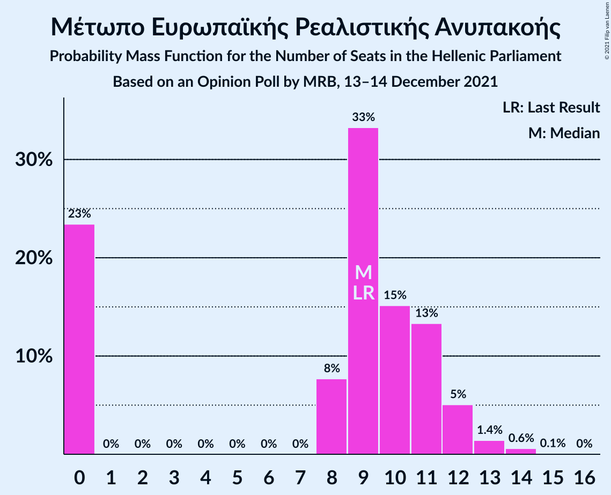

| Number of Seats | Probability | Accumulated | Special Marks |
|:---------------:|:-----------:|:-----------:|:-------------:|
| 0 | 23% | 100% |  |
| 1 | 0% | 77% |  |
| 2 | 0% | 77% |  |
| 3 | 0% | 77% |  |
| 4 | 0% | 77% |  |
| 5 | 0% | 77% |  |
| 6 | 0% | 77% |  |
| 7 | 0% | 77% |  |
| 8 | 8% | 77% |  |
| 9 | 33% | 69% | Last Result, Median |
| 10 | 15% | 36% |  |
| 11 | 13% | 20% |  |
| 12 | 5% | 7% |  |
| 13 | 1.4% | 2% |  |
| 14 | 0.6% | 0.7% |  |
| 15 | 0.1% | 0.1% |  |
| 16 | 0% | 0% |  |

## Coalitions

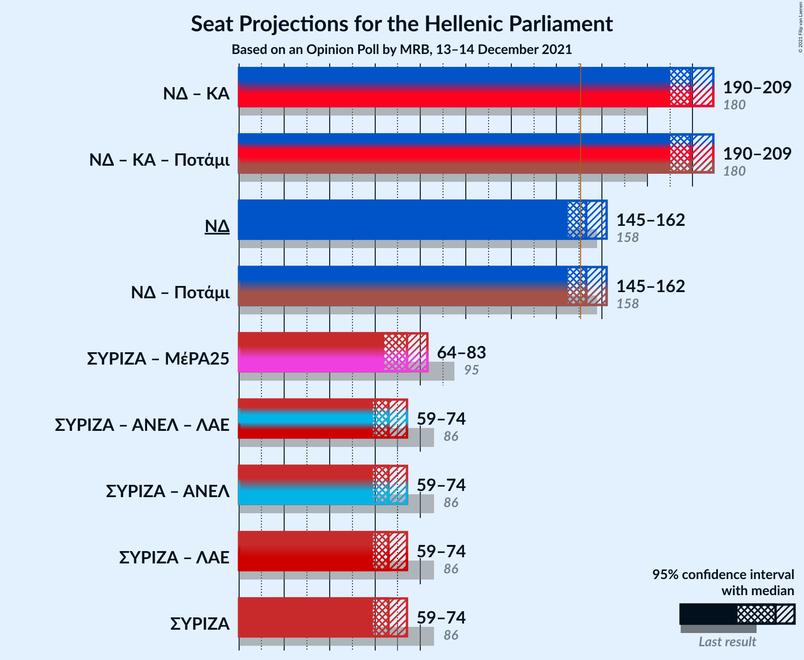

### Confidence Intervals

| Coalition | Last Result | Median | Majority? | 80% Confidence Interval | 90% Confidence Interval | 95% Confidence Interval | 99% Confidence Interval |
|:---------:|:-----------:|:------:|:---------:|:-----------------------:|:-----------------------:|:-----------------------:|:-----------------------:|
| Νέα Δημοκρατία – Κίνημα Αλλαγής | 180 | 199 | 100% | 193–205 | 191–207 | 190–209 | 188–212 |
| Νέα Δημοκρατία | 158 | 153 | 73% | 148–159 | 146–161 | 145–162 | 142–165 |
| Συνασπισμός Ριζοσπαστικής Αριστεράς – Μέτωπο Ευρωπαϊκής Ρεαλιστικής Ανυπακοής | 95 | 74 | 0% | 68–80 | 65–81 | 64–83 | 61–85 |
| Συνασπισμός Ριζοσπαστικής Αριστεράς | 86 | 66 | 0% | 62–71 | 60–73 | 59–74 | 57–77 |

### Νέα Δημοκρατία – Κίνημα Αλλαγής

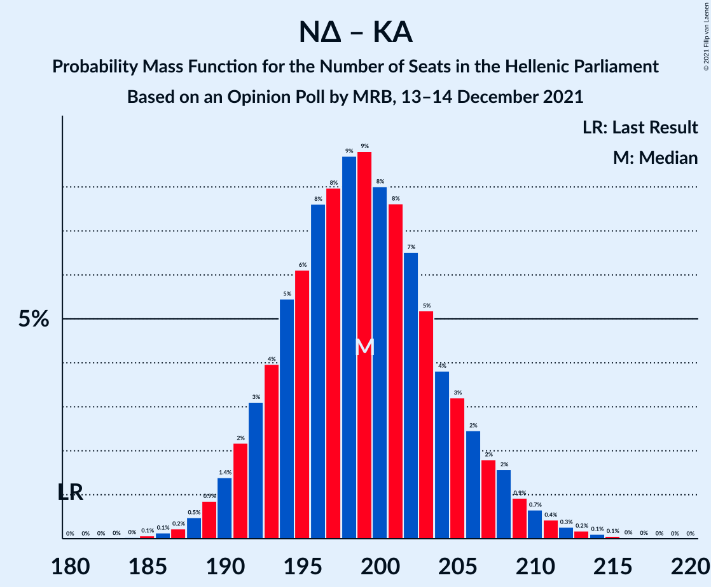

| Number of Seats | Probability | Accumulated | Special Marks |
|:---------------:|:-----------:|:-----------:|:-------------:|
| 180 | 0% | 100% | Last Result |
| 181 | 0% | 100% |  |
| 182 | 0% | 100% |  |
| 183 | 0% | 100% |  |
| 184 | 0% | 100% |  |
| 185 | 0.1% | 99.9% |  |
| 186 | 0.1% | 99.9% |  |
| 187 | 0.2% | 99.7% |  |
| 188 | 0.5% | 99.5% |  |
| 189 | 0.9% | 99.0% |  |
| 190 | 1.4% | 98% |  |
| 191 | 2% | 97% |  |
| 192 | 3% | 95% |  |
| 193 | 4% | 92% |  |
| 194 | 5% | 88% |  |
| 195 | 6% | 82% |  |
| 196 | 8% | 76% |  |
| 197 | 8% | 68% |  |
| 198 | 9% | 60% |  |
| 199 | 9% | 52% | Median |
| 200 | 8% | 43% |  |
| 201 | 8% | 35% |  |
| 202 | 7% | 27% |  |
| 203 | 5% | 21% |  |
| 204 | 4% | 16% |  |
| 205 | 3% | 12% |  |
| 206 | 2% | 9% |  |
| 207 | 2% | 6% |  |
| 208 | 2% | 4% |  |
| 209 | 0.9% | 3% |  |
| 210 | 0.7% | 2% |  |
| 211 | 0.4% | 1.1% |  |
| 212 | 0.3% | 0.7% |  |
| 213 | 0.2% | 0.4% |  |
| 214 | 0.1% | 0.2% |  |
| 215 | 0.1% | 0.1% |  |
| 216 | 0% | 0% |  |

### Νέα Δημοκρατία

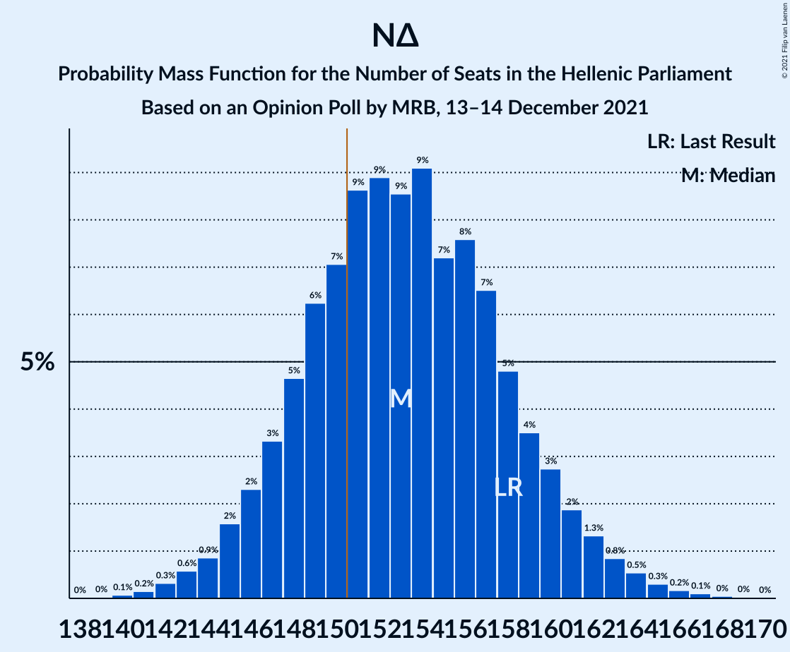

| Number of Seats | Probability | Accumulated | Special Marks |
|:---------------:|:-----------:|:-----------:|:-------------:|
| 140 | 0.1% | 100% |  |
| 141 | 0.2% | 99.9% |  |
| 142 | 0.3% | 99.7% |  |
| 143 | 0.6% | 99.4% |  |
| 144 | 0.9% | 98.8% |  |
| 145 | 2% | 98% |  |
| 146 | 2% | 96% |  |
| 147 | 3% | 94% |  |
| 148 | 5% | 91% |  |
| 149 | 6% | 86% |  |
| 150 | 7% | 80% |  |
| 151 | 9% | 73% | Majority |
| 152 | 9% | 64% |  |
| 153 | 9% | 55% | Median |
| 154 | 9% | 47% |  |
| 155 | 7% | 38% |  |
| 156 | 8% | 30% |  |
| 157 | 7% | 23% |  |
| 158 | 5% | 16% | Last Result |
| 159 | 4% | 12% |  |
| 160 | 3% | 8% |  |
| 161 | 2% | 5% |  |
| 162 | 1.3% | 3% |  |
| 163 | 0.8% | 2% |  |
| 164 | 0.5% | 1.2% |  |
| 165 | 0.3% | 0.7% |  |
| 166 | 0.2% | 0.4% |  |
| 167 | 0.1% | 0.2% |  |
| 168 | 0% | 0.1% |  |
| 169 | 0% | 0.1% |  |
| 170 | 0% | 0% |  |

### Συνασπισμός Ριζοσπαστικής Αριστεράς – Μέτωπο Ευρωπαϊκής Ρεαλιστικής Ανυπακοής

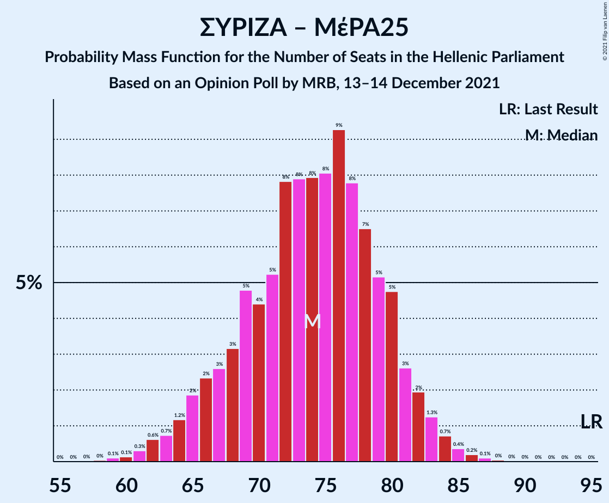

| Number of Seats | Probability | Accumulated | Special Marks |
|:---------------:|:-----------:|:-----------:|:-------------:|
| 58 | 0% | 100% |  |
| 59 | 0.1% | 99.9% |  |
| 60 | 0.1% | 99.8% |  |
| 61 | 0.3% | 99.7% |  |
| 62 | 0.6% | 99.4% |  |
| 63 | 0.7% | 98.8% |  |
| 64 | 1.2% | 98% |  |
| 65 | 2% | 97% |  |
| 66 | 2% | 95% |  |
| 67 | 3% | 93% |  |
| 68 | 3% | 90% |  |
| 69 | 5% | 87% |  |
| 70 | 4% | 82% |  |
| 71 | 5% | 78% |  |
| 72 | 8% | 72% |  |
| 73 | 8% | 65% |  |
| 74 | 8% | 57% |  |
| 75 | 8% | 49% | Median |
| 76 | 9% | 41% |  |
| 77 | 8% | 31% |  |
| 78 | 7% | 24% |  |
| 79 | 5% | 17% |  |
| 80 | 5% | 12% |  |
| 81 | 3% | 7% |  |
| 82 | 2% | 5% |  |
| 83 | 1.3% | 3% |  |
| 84 | 0.7% | 1.5% |  |
| 85 | 0.4% | 0.7% |  |
| 86 | 0.2% | 0.4% |  |
| 87 | 0.1% | 0.2% |  |
| 88 | 0% | 0.1% |  |
| 89 | 0% | 0% |  |
| 90 | 0% | 0% |  |
| 91 | 0% | 0% |  |
| 92 | 0% | 0% |  |
| 93 | 0% | 0% |  |
| 94 | 0% | 0% |  |
| 95 | 0% | 0% | Last Result |

### Συνασπισμός Ριζοσπαστικής Αριστεράς

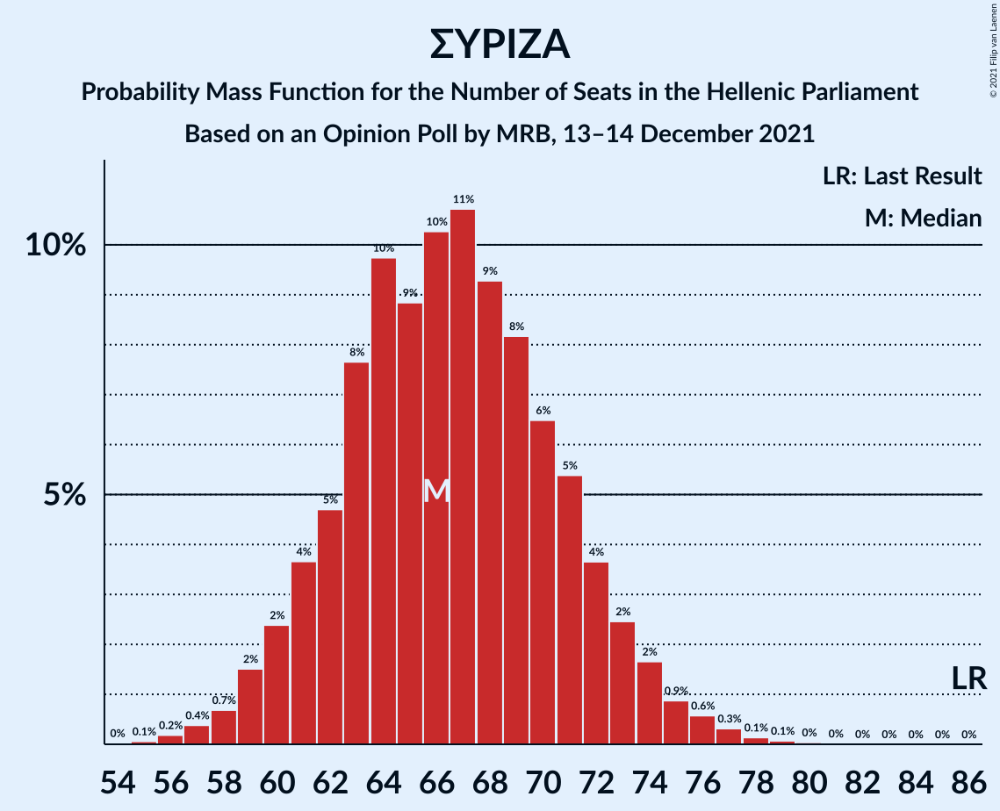

| Number of Seats | Probability | Accumulated | Special Marks |
|:---------------:|:-----------:|:-----------:|:-------------:|
| 55 | 0.1% | 100% |  |
| 56 | 0.2% | 99.9% |  |
| 57 | 0.4% | 99.7% |  |
| 58 | 0.7% | 99.3% |  |
| 59 | 2% | 98.6% |  |
| 60 | 2% | 97% |  |
| 61 | 4% | 95% |  |
| 62 | 5% | 91% |  |
| 63 | 8% | 86% |  |
| 64 | 10% | 79% |  |
| 65 | 9% | 69% |  |
| 66 | 10% | 60% | Median |
| 67 | 11% | 50% |  |
| 68 | 9% | 39% |  |
| 69 | 8% | 30% |  |
| 70 | 6% | 22% |  |
| 71 | 5% | 15% |  |
| 72 | 4% | 10% |  |
| 73 | 2% | 6% |  |
| 74 | 2% | 4% |  |
| 75 | 0.9% | 2% |  |
| 76 | 0.6% | 1.2% |  |
| 77 | 0.3% | 0.6% |  |
| 78 | 0.1% | 0.3% |  |
| 79 | 0.1% | 0.1% |  |
| 80 | 0% | 0.1% |  |
| 81 | 0% | 0% |  |
| 82 | 0% | 0% |  |
| 83 | 0% | 0% |  |
| 84 | 0% | 0% |  |
| 85 | 0% | 0% |  |
| 86 | 0% | 0% | Last Result |

## Technical Information

### Opinion Poll

+ **Polling firm:** MRB
+ **Commissioner(s):** —
+ **Fieldwork period:** 13–14 December 2021

### Calculations

+ **Sample size:** 1000
+ **Simulations done:** 1,048,576
+ **Error estimate:** 0.69%

