# Opinion Poll by Interview for Politic.gr, 13–15 December 2021

<a href="#voting-intentions">Voting Intentions</a> | <a href="#seats">Seats</a> | <a href="#coalitions">Coalitions</a> | <a href="#technical-information">Technical Information</a>

## Voting Intentions

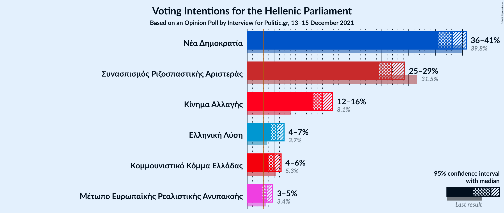

### Confidence Intervals

| Party | Last Result | Poll Result | 80% Confidence Interval | 90% Confidence Interval | 95% Confidence Interval | 99% Confidence Interval |
|:-----:|:-----------:|:-----------:|:-----------------------:|:-----------------------:|:-----------------------:|:-----------------------:|
| Νέα Δημοκρατία | 39.8% | 38.1% | 36.4–39.8% |36.0–40.3% |35.5–40.7% |34.8–41.5% |
| Συνασπισμός Ριζοσπαστικής Αριστεράς | 31.5% | 26.8% | 25.3–28.4% |24.9–28.8% |24.5–29.2% |23.8–30.0% |
| Κίνημα Αλλαγής | 8.1% | 13.9% | 12.8–15.2% |12.5–15.5% |12.2–15.9% |11.6–16.5% |
| Ελληνική Λύση | 3.7% | 5.5% | 4.8–6.4% |4.6–6.6% |4.4–6.8% |4.1–7.3% |
| Κομμουνιστικό Κόμμα Ελλάδας | 5.3% | 5.0% | 4.3–5.8% |4.1–6.1% |3.9–6.3% |3.6–6.7% |
| Μέτωπο Ευρωπαϊκής Ρεαλιστικής Ανυπακοής | 3.4% | 3.6% | 3.0–4.3% |2.9–4.5% |2.7–4.7% |2.5–5.1% |

*Note:* The poll result column reflects the actual value used in the calculations. Published results may vary slightly, and in addition be rounded to fewer digits.

## Seats

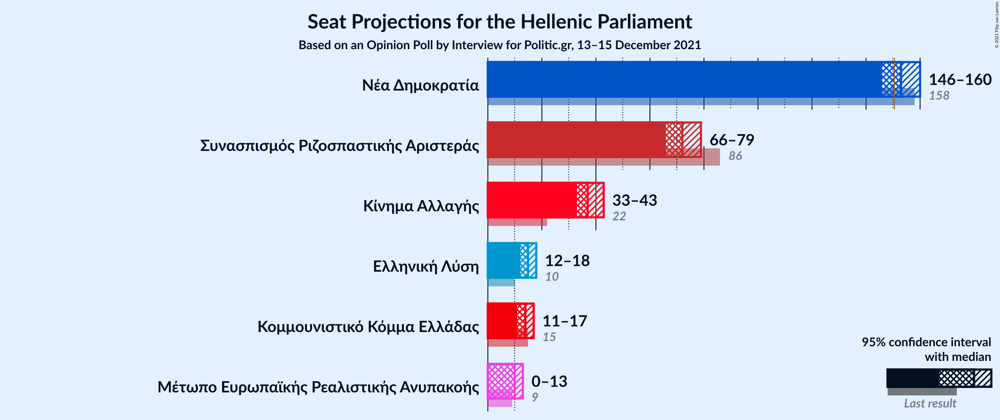

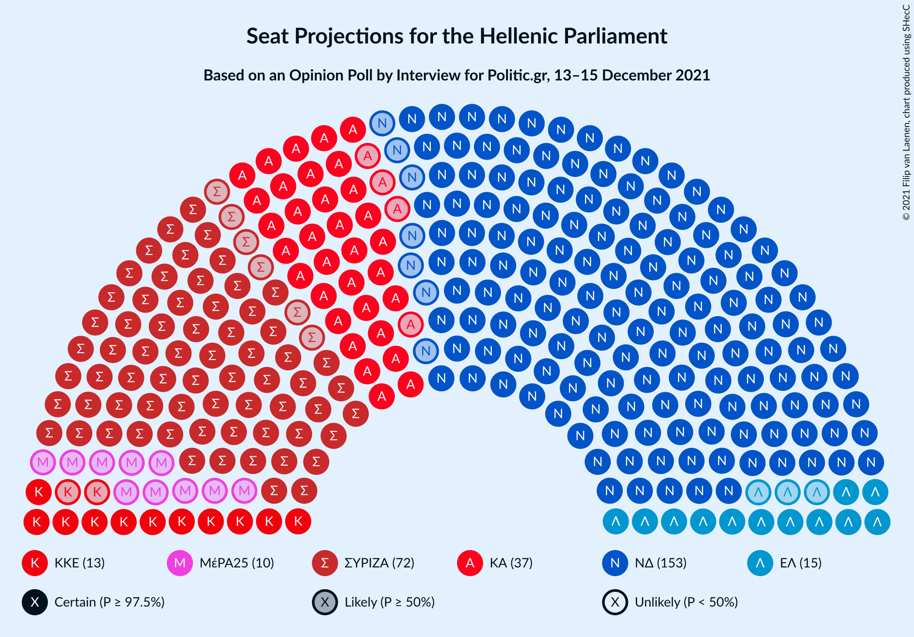

### Confidence Intervals

| Party | Last Result | Median | 80% Confidence Interval | 90% Confidence Interval | 95% Confidence Interval | 99% Confidence Interval |
|:-----:|:-----------:|:------:|:-----------------------:|:-----------------------:|:-----------------------:|:-----------------------:|
| <a href="#νέα-δημοκρατία">Νέα Δημοκρατία</a> | 158 | 153 | 148–157 |147–159 |146–160 |144–163 |
| <a href="#συνασπισμός-ριζοσπαστικής-αριστεράς">Συνασπισμός Ριζοσπαστικής Αριστεράς</a> | 86 | 72 | 68–76 |67–78 |66–79 |64–81 |
| <a href="#κίνημα-αλλαγής">Κίνημα Αλλαγής</a> | 22 | 37 | 34–41 |34–42 |33–43 |31–45 |
| <a href="#ελληνική-λύση">Ελληνική Λύση</a> | 10 | 15 | 13–17 |12–18 |12–18 |11–20 |
| <a href="#κομμουνιστικό-κόμμα-ελλάδας">Κομμουνιστικό Κόμμα Ελλάδας</a> | 15 | 14 | 12–16 |11–16 |11–17 |10–18 |
| <a href="#μέτωπο-ευρωπαϊκής-ρεαλιστικής-ανυπακοής">Μέτωπο Ευρωπαϊκής Ρεαλιστικής Ανυπακοής</a> | 9 | 10 | 8–12 |0–12 |0–13 |0–14 |

### Νέα Δημοκρατία

*For a full overview of the results for this party, see the [Νέα Δημοκρατία](party-νέαδημοκρατία.html) page.*

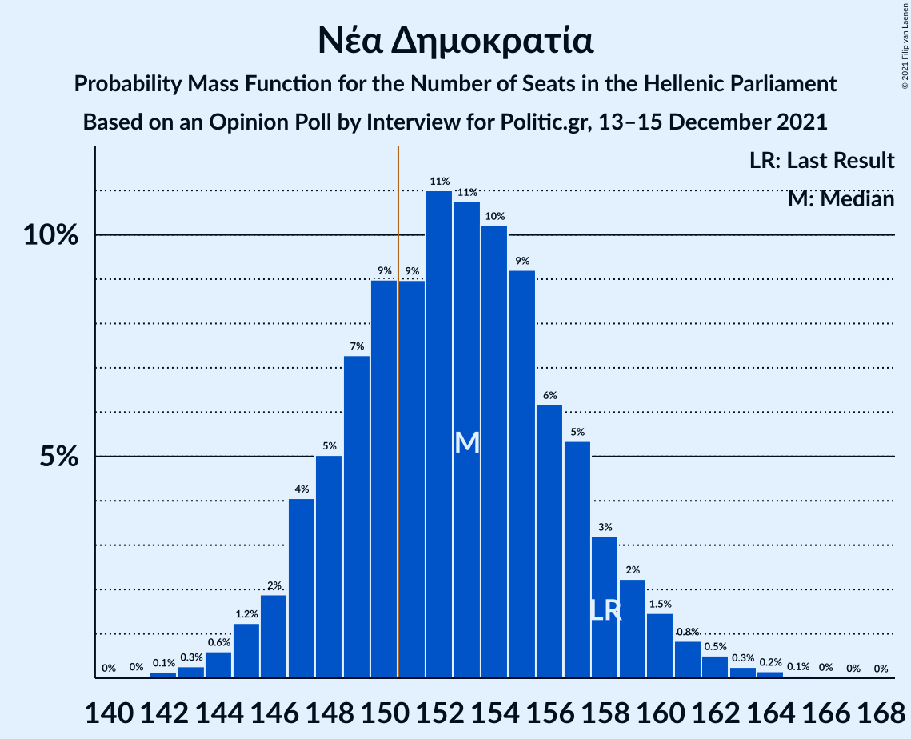

| Number of Seats | Probability | Accumulated | Special Marks |
|:---------------:|:-----------:|:-----------:|:-------------:|
| 141 | 0% | 100% |  |
| 142 | 0.1% | 99.9% |  |
| 143 | 0.3% | 99.8% |  |
| 144 | 0.6% | 99.5% |  |
| 145 | 1.2% | 98.9% |  |
| 146 | 2% | 98% |  |
| 147 | 4% | 96% |  |
| 148 | 5% | 92% |  |
| 149 | 7% | 87% |  |
| 150 | 9% | 79% |  |
| 151 | 9% | 70% | Majority |
| 152 | 11% | 61% |  |
| 153 | 11% | 50% | Median |
| 154 | 10% | 40% |  |
| 155 | 9% | 29% |  |
| 156 | 6% | 20% |  |
| 157 | 5% | 14% |  |
| 158 | 3% | 9% | Last Result |
| 159 | 2% | 6% |  |
| 160 | 1.5% | 3% |  |
| 161 | 0.8% | 2% |  |
| 162 | 0.5% | 1.0% |  |
| 163 | 0.3% | 0.5% |  |
| 164 | 0.2% | 0.3% |  |
| 165 | 0.1% | 0.1% |  |
| 166 | 0% | 0.1% |  |
| 167 | 0% | 0% |  |

### Συνασπισμός Ριζοσπαστικής Αριστεράς

*For a full overview of the results for this party, see the [Συνασπισμός Ριζοσπαστικής Αριστεράς](party-συνασπισμόςριζοσπαστικήςαριστεράς.html) page.*

| Number of Seats | Probability | Accumulated | Special Marks |
|:---------------:|:-----------:|:-----------:|:-------------:|
| 62 | 0.1% | 100% |  |
| 63 | 0.2% | 99.9% |  |
| 64 | 0.4% | 99.7% |  |
| 65 | 1.0% | 99.3% |  |
| 66 | 2% | 98% |  |
| 67 | 3% | 96% |  |
| 68 | 5% | 93% |  |
| 69 | 9% | 88% |  |
| 70 | 9% | 79% |  |
| 71 | 11% | 70% |  |
| 72 | 14% | 59% | Median |
| 73 | 12% | 46% |  |
| 74 | 9% | 34% |  |
| 75 | 9% | 24% |  |
| 76 | 6% | 15% |  |
| 77 | 4% | 10% |  |
| 78 | 3% | 6% |  |
| 79 | 2% | 3% |  |
| 80 | 0.8% | 2% |  |
| 81 | 0.5% | 0.8% |  |
| 82 | 0.2% | 0.4% |  |
| 83 | 0.1% | 0.2% |  |
| 84 | 0.1% | 0.1% |  |
| 85 | 0% | 0% |  |
| 86 | 0% | 0% | Last Result |

### Κίνημα Αλλαγής

*For a full overview of the results for this party, see the [Κίνημα Αλλαγής](party-κίνημααλλαγής.html) page.*

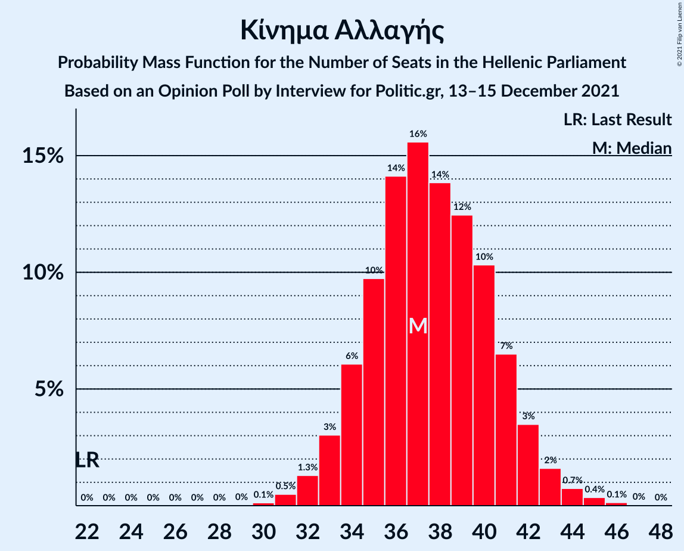

| Number of Seats | Probability | Accumulated | Special Marks |
|:---------------:|:-----------:|:-----------:|:-------------:|
| 22 | 0% | 100% | Last Result |
| 23 | 0% | 100% |  |
| 24 | 0% | 100% |  |
| 25 | 0% | 100% |  |
| 26 | 0% | 100% |  |
| 27 | 0% | 100% |  |
| 28 | 0% | 100% |  |
| 29 | 0% | 100% |  |
| 30 | 0.1% | 100% |  |
| 31 | 0.5% | 99.8% |  |
| 32 | 1.3% | 99.3% |  |
| 33 | 3% | 98% |  |
| 34 | 6% | 95% |  |
| 35 | 10% | 89% |  |
| 36 | 14% | 79% |  |
| 37 | 16% | 65% | Median |
| 38 | 14% | 49% |  |
| 39 | 12% | 36% |  |
| 40 | 10% | 23% |  |
| 41 | 7% | 13% |  |
| 42 | 3% | 6% |  |
| 43 | 2% | 3% |  |
| 44 | 0.7% | 1.3% |  |
| 45 | 0.4% | 0.5% |  |
| 46 | 0.1% | 0.2% |  |
| 47 | 0% | 0.1% |  |
| 48 | 0% | 0% |  |

### Ελληνική Λύση

*For a full overview of the results for this party, see the [Ελληνική Λύση](party-ελληνικήλύση.html) page.*

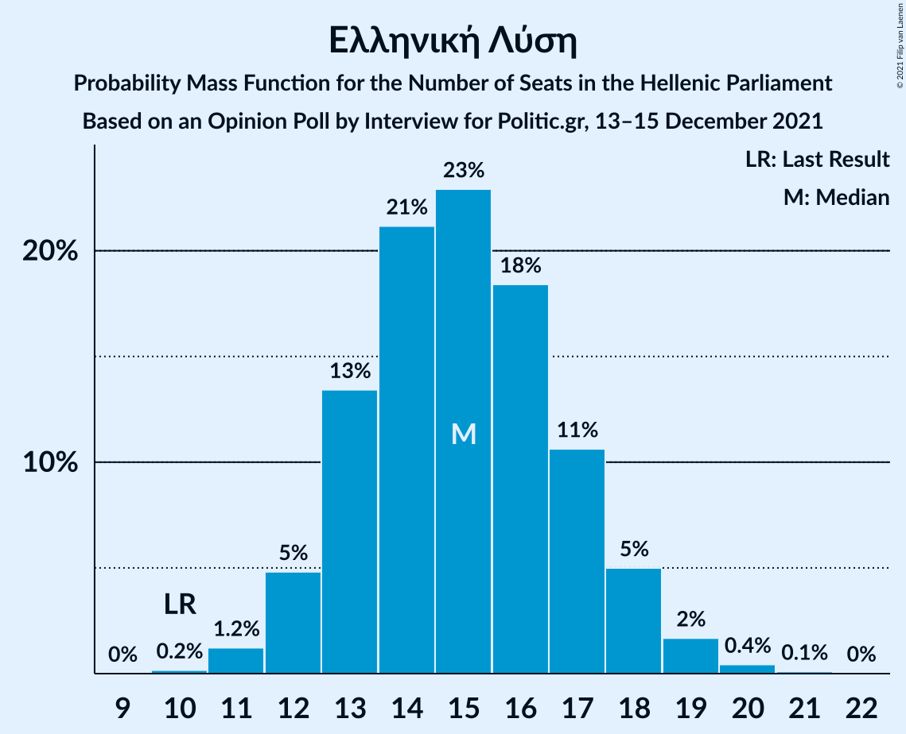

| Number of Seats | Probability | Accumulated | Special Marks |
|:---------------:|:-----------:|:-----------:|:-------------:|
| 10 | 0.2% | 100% | Last Result |
| 11 | 1.2% | 99.8% |  |
| 12 | 5% | 98.6% |  |
| 13 | 13% | 94% |  |
| 14 | 21% | 80% |  |
| 15 | 23% | 59% | Median |
| 16 | 18% | 36% |  |
| 17 | 11% | 18% |  |
| 18 | 5% | 7% |  |
| 19 | 2% | 2% |  |
| 20 | 0.4% | 0.6% |  |
| 21 | 0.1% | 0.1% |  |
| 22 | 0% | 0% |  |

### Κομμουνιστικό Κόμμα Ελλάδας

*For a full overview of the results for this party, see the [Κομμουνιστικό Κόμμα Ελλάδας](party-κομμουνιστικόκόμμαελλάδας.html) page.*

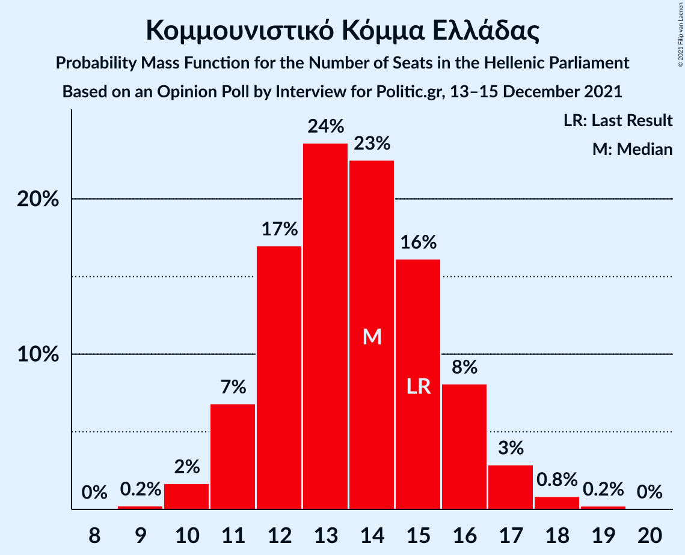

| Number of Seats | Probability | Accumulated | Special Marks |
|:---------------:|:-----------:|:-----------:|:-------------:|
| 9 | 0.2% | 100% |  |
| 10 | 2% | 99.8% |  |
| 11 | 7% | 98% |  |
| 12 | 17% | 91% |  |
| 13 | 24% | 74% |  |
| 14 | 23% | 51% | Median |
| 15 | 16% | 28% | Last Result |
| 16 | 8% | 12% |  |
| 17 | 3% | 4% |  |
| 18 | 0.8% | 1.1% |  |
| 19 | 0.2% | 0.3% |  |
| 20 | 0% | 0% |  |

### Μέτωπο Ευρωπαϊκής Ρεαλιστικής Ανυπακοής

*For a full overview of the results for this party, see the [Μέτωπο Ευρωπαϊκής Ρεαλιστικής Ανυπακοής](party-μέτωποευρωπαϊκήςρεαλιστικήςανυπακοής.html) page.*

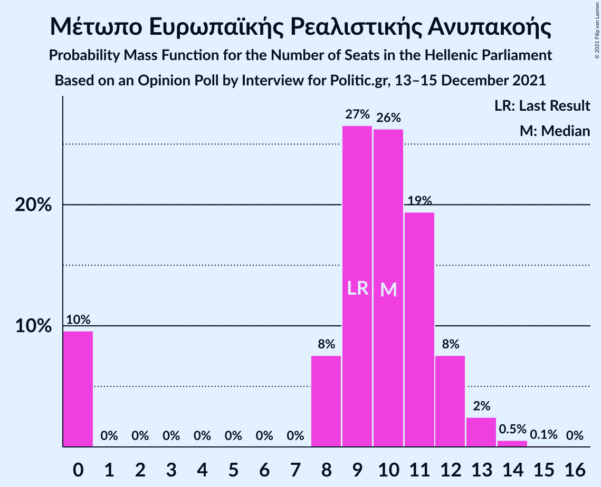

| Number of Seats | Probability | Accumulated | Special Marks |
|:---------------:|:-----------:|:-----------:|:-------------:|
| 0 | 10% | 100% |  |
| 1 | 0% | 90% |  |
| 2 | 0% | 90% |  |
| 3 | 0% | 90% |  |
| 4 | 0% | 90% |  |
| 5 | 0% | 90% |  |
| 6 | 0% | 90% |  |
| 7 | 0% | 90% |  |
| 8 | 8% | 90% |  |
| 9 | 27% | 83% | Last Result |
| 10 | 26% | 56% | Median |
| 11 | 19% | 30% |  |
| 12 | 8% | 11% |  |
| 13 | 2% | 3% |  |
| 14 | 0.5% | 0.7% |  |
| 15 | 0.1% | 0.1% |  |
| 16 | 0% | 0% |  |

## Coalitions

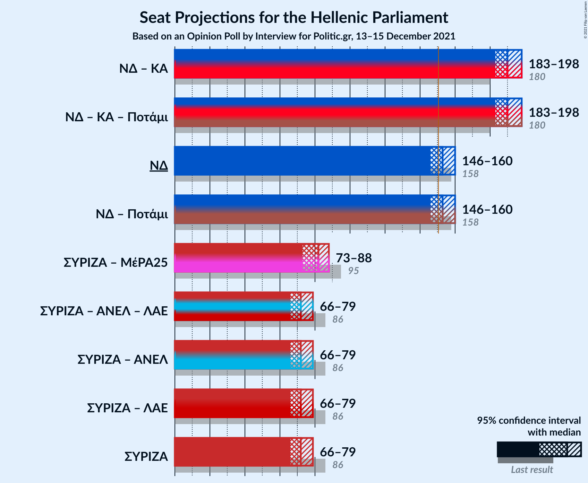

### Confidence Intervals

| Coalition | Last Result | Median | Majority? | 80% Confidence Interval | 90% Confidence Interval | 95% Confidence Interval | 99% Confidence Interval |
|:---------:|:-----------:|:------:|:---------:|:-----------------------:|:-----------------------:|:-----------------------:|:-----------------------:|
| Νέα Δημοκρατία – Κίνημα Αλλαγής | 180 | 190 | 100% | 185–195 | 184–197 | 183–198 | 181–201 |
| Νέα Δημοκρατία | 158 | 153 | 70% | 148–157 | 147–159 | 146–160 | 144–163 |
| Συνασπισμός Ριζοσπαστικής Αριστεράς – Μέτωπο Ευρωπαϊκής Ρεαλιστικής Ανυπακοής | 95 | 82 | 0% | 76–86 | 74–87 | 73–88 | 70–90 |
| Συνασπισμός Ριζοσπαστικής Αριστεράς | 86 | 72 | 0% | 68–76 | 67–78 | 66–79 | 64–81 |

### Νέα Δημοκρατία – Κίνημα Αλλαγής

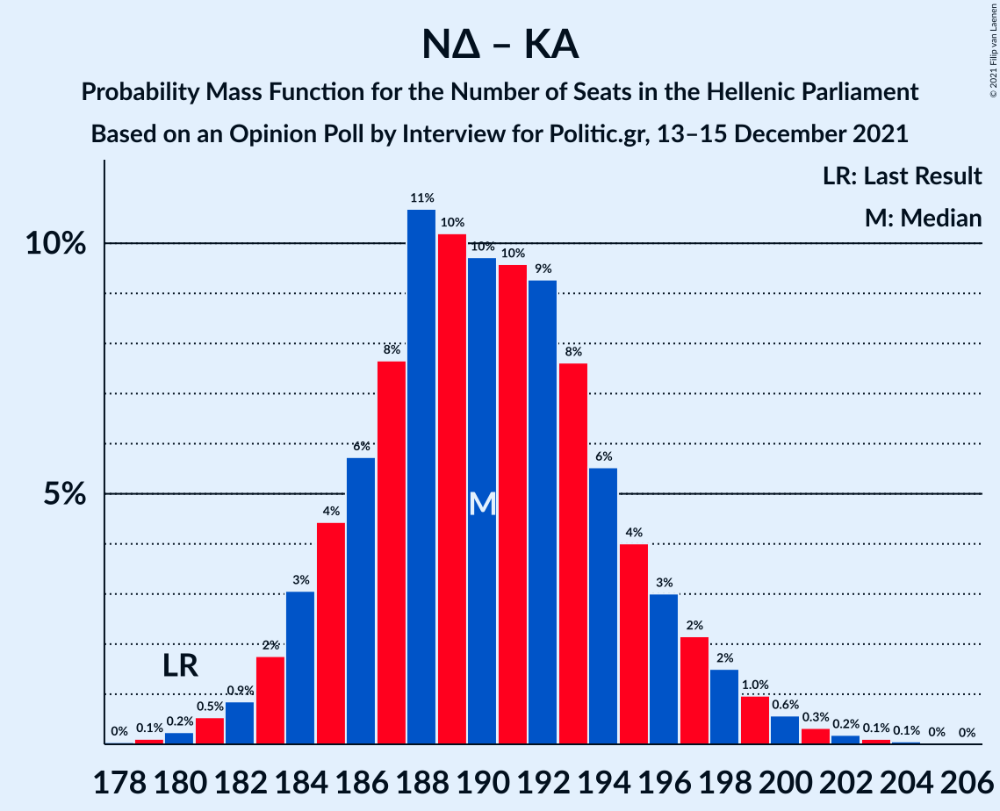

| Number of Seats | Probability | Accumulated | Special Marks |
|:---------------:|:-----------:|:-----------:|:-------------:|
| 178 | 0% | 100% |  |
| 179 | 0.1% | 99.9% |  |
| 180 | 0.2% | 99.8% | Last Result |
| 181 | 0.5% | 99.6% |  |
| 182 | 0.9% | 99.0% |  |
| 183 | 2% | 98% |  |
| 184 | 3% | 96% |  |
| 185 | 4% | 93% |  |
| 186 | 6% | 89% |  |
| 187 | 8% | 83% |  |
| 188 | 11% | 76% |  |
| 189 | 10% | 65% |  |
| 190 | 10% | 55% | Median |
| 191 | 10% | 45% |  |
| 192 | 9% | 35% |  |
| 193 | 8% | 26% |  |
| 194 | 6% | 18% |  |
| 195 | 4% | 13% |  |
| 196 | 3% | 9% |  |
| 197 | 2% | 6% |  |
| 198 | 2% | 4% |  |
| 199 | 1.0% | 2% |  |
| 200 | 0.6% | 1.3% |  |
| 201 | 0.3% | 0.7% |  |
| 202 | 0.2% | 0.4% |  |
| 203 | 0.1% | 0.2% |  |
| 204 | 0.1% | 0.1% |  |
| 205 | 0% | 0% |  |

### Νέα Δημοκρατία

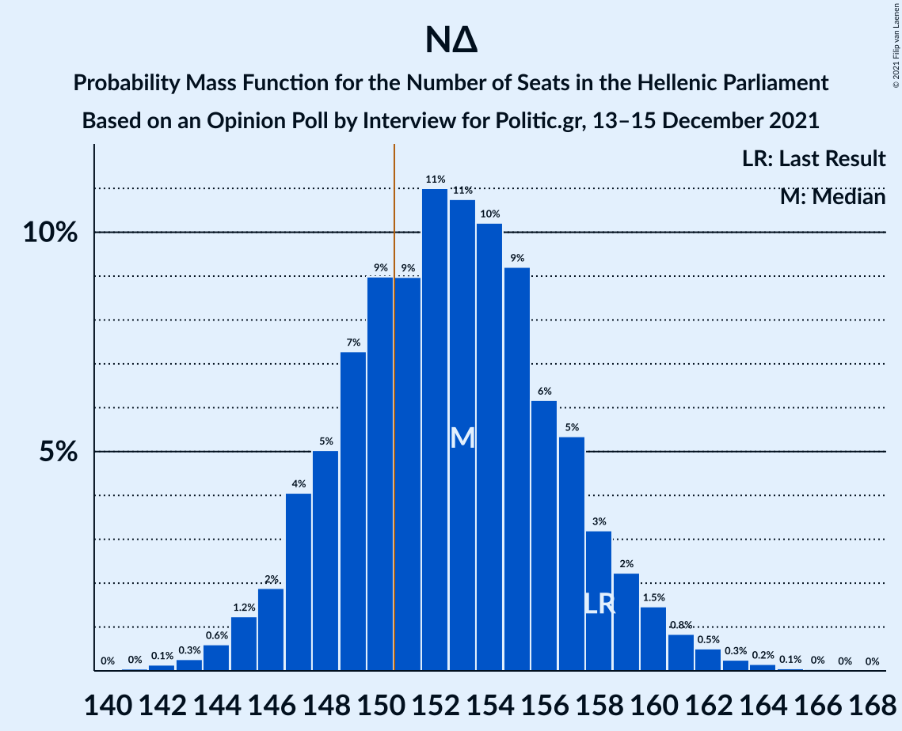

| Number of Seats | Probability | Accumulated | Special Marks |
|:---------------:|:-----------:|:-----------:|:-------------:|
| 141 | 0% | 100% |  |
| 142 | 0.1% | 99.9% |  |
| 143 | 0.3% | 99.8% |  |
| 144 | 0.6% | 99.5% |  |
| 145 | 1.2% | 98.9% |  |
| 146 | 2% | 98% |  |
| 147 | 4% | 96% |  |
| 148 | 5% | 92% |  |
| 149 | 7% | 87% |  |
| 150 | 9% | 79% |  |
| 151 | 9% | 70% | Majority |
| 152 | 11% | 61% |  |
| 153 | 11% | 50% | Median |
| 154 | 10% | 40% |  |
| 155 | 9% | 29% |  |
| 156 | 6% | 20% |  |
| 157 | 5% | 14% |  |
| 158 | 3% | 9% | Last Result |
| 159 | 2% | 6% |  |
| 160 | 1.5% | 3% |  |
| 161 | 0.8% | 2% |  |
| 162 | 0.5% | 1.0% |  |
| 163 | 0.3% | 0.5% |  |
| 164 | 0.2% | 0.3% |  |
| 165 | 0.1% | 0.1% |  |
| 166 | 0% | 0.1% |  |
| 167 | 0% | 0% |  |

### Συνασπισμός Ριζοσπαστικής Αριστεράς – Μέτωπο Ευρωπαϊκής Ρεαλιστικής Ανυπακοής

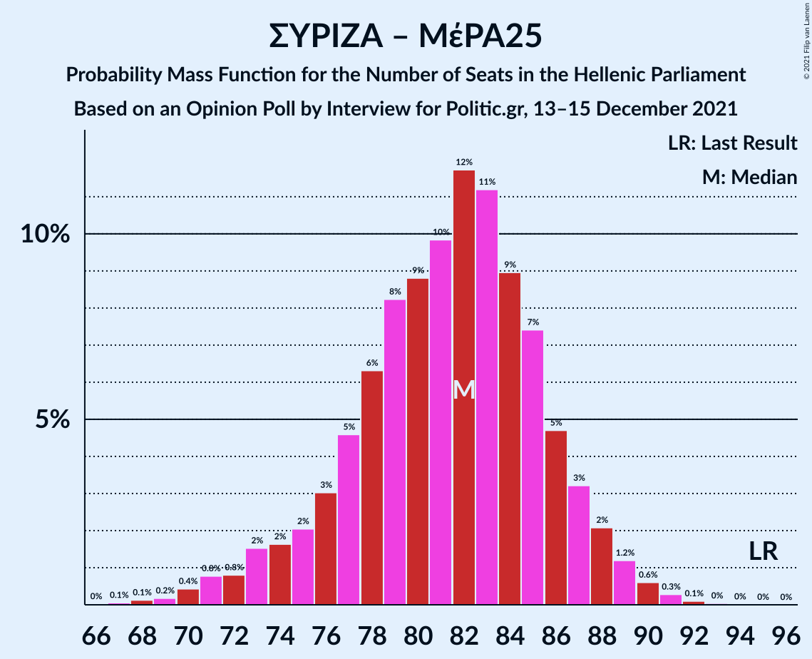

| Number of Seats | Probability | Accumulated | Special Marks |
|:---------------:|:-----------:|:-----------:|:-------------:|
| 67 | 0.1% | 100% |  |
| 68 | 0.1% | 99.9% |  |
| 69 | 0.2% | 99.8% |  |
| 70 | 0.4% | 99.6% |  |
| 71 | 0.8% | 99.2% |  |
| 72 | 0.8% | 98% |  |
| 73 | 2% | 98% |  |
| 74 | 2% | 96% |  |
| 75 | 2% | 94% |  |
| 76 | 3% | 92% |  |
| 77 | 5% | 89% |  |
| 78 | 6% | 85% |  |
| 79 | 8% | 78% |  |
| 80 | 9% | 70% |  |
| 81 | 10% | 61% |  |
| 82 | 12% | 52% | Median |
| 83 | 11% | 40% |  |
| 84 | 9% | 29% |  |
| 85 | 7% | 20% |  |
| 86 | 5% | 12% |  |
| 87 | 3% | 8% |  |
| 88 | 2% | 4% |  |
| 89 | 1.2% | 2% |  |
| 90 | 0.6% | 1.1% |  |
| 91 | 0.3% | 0.5% |  |
| 92 | 0.1% | 0.2% |  |
| 93 | 0% | 0.1% |  |
| 94 | 0% | 0% |  |
| 95 | 0% | 0% | Last Result |

### Συνασπισμός Ριζοσπαστικής Αριστεράς

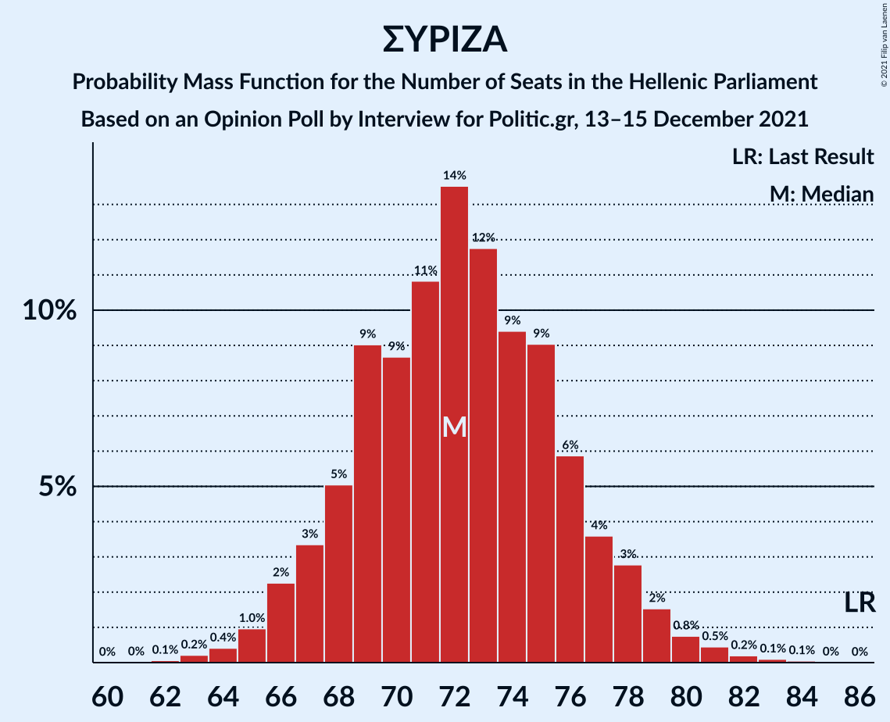

| Number of Seats | Probability | Accumulated | Special Marks |
|:---------------:|:-----------:|:-----------:|:-------------:|
| 62 | 0.1% | 100% |  |
| 63 | 0.2% | 99.9% |  |
| 64 | 0.4% | 99.7% |  |
| 65 | 1.0% | 99.3% |  |
| 66 | 2% | 98% |  |
| 67 | 3% | 96% |  |
| 68 | 5% | 93% |  |
| 69 | 9% | 88% |  |
| 70 | 9% | 79% |  |
| 71 | 11% | 70% |  |
| 72 | 14% | 59% | Median |
| 73 | 12% | 46% |  |
| 74 | 9% | 34% |  |
| 75 | 9% | 24% |  |
| 76 | 6% | 15% |  |
| 77 | 4% | 10% |  |
| 78 | 3% | 6% |  |
| 79 | 2% | 3% |  |
| 80 | 0.8% | 2% |  |
| 81 | 0.5% | 0.8% |  |
| 82 | 0.2% | 0.4% |  |
| 83 | 0.1% | 0.2% |  |
| 84 | 0.1% | 0.1% |  |
| 85 | 0% | 0% |  |
| 86 | 0% | 0% | Last Result |

## Technical Information

### Opinion Poll

+ **Polling firm:** Interview
+ **Commissioner(s):** Politic.gr
+ **Fieldwork period:** 13–15 December 2021

### Calculations

+ **Sample size:** 1365
+ **Simulations done:** 1,048,576
+ **Error estimate:** 0.73%

