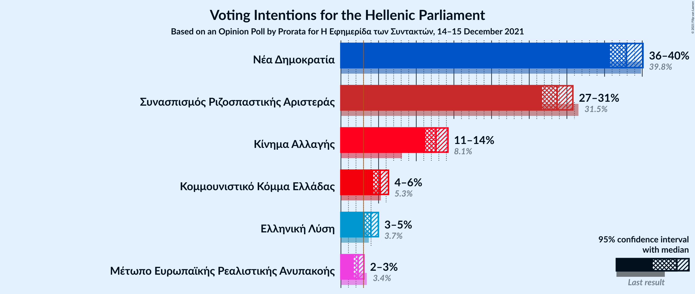

# Opinion Poll by Prorata for Η Εφημερίδα των Συντακτών, 14–15 December 2021

<a href="#voting-intentions">Voting Intentions</a> | <a href="#seats">Seats</a> | <a href="#coalitions">Coalitions</a> | <a href="#technical-information">Technical Information</a>

## Voting Intentions

### Confidence Intervals

| Party | Last Result | Poll Result | 80% Confidence Interval | 90% Confidence Interval | 95% Confidence Interval | 99% Confidence Interval |
|:-----:|:-----------:|:-----------:|:-----------------------:|:-----------------------:|:-----------------------:|:-----------------------:|
| Νέα Δημοκρατία | 39.8% | 37.9% | 36.5–39.3% |36.1–39.7% |35.7–40.1% |35.0–40.8% |
| Συνασπισμός Ριζοσπαστικής Αριστεράς | 31.5% | 28.7% | 27.4–30.1% |27.0–30.5% |26.7–30.8% |26.1–31.5% |
| Κίνημα Αλλαγής | 8.1% | 12.6% | 11.7–13.7% |11.4–14.0% |11.2–14.2% |10.8–14.7% |
| Κομμουνιστικό Κόμμα Ελλάδας | 5.3% | 5.2% | 4.6–5.9% |4.4–6.1% |4.3–6.3% |4.0–6.7% |
| Ελληνική Λύση | 3.7% | 4.0% | 3.4–4.6% |3.3–4.8% |3.2–5.0% |2.9–5.3% |
| Μέτωπο Ευρωπαϊκής Ρεαλιστικής Ανυπακοής | 3.4% | 2.3% | 1.9–2.8% |1.8–2.9% |1.7–3.1% |1.5–3.3% |

*Note:* The poll result column reflects the actual value used in the calculations. Published results may vary slightly, and in addition be rounded to fewer digits.

## Seats

### Confidence Intervals

| Party | Last Result | Median | 80% Confidence Interval | 90% Confidence Interval | 95% Confidence Interval | 99% Confidence Interval |
|:-----:|:-----------:|:------:|:-----------------------:|:-----------------------:|:-----------------------:|:-----------------------:|
| <a href="#νέα-δημοκρατία">Νέα Δημοκρατία</a> | 158 | 157 | 153–161 |152–162 |151–163 |149–165 |
| <a href="#συνασπισμός-ριζοσπαστικής-αριστεράς">Συνασπισμός Ριζοσπαστικής Αριστεράς</a> | 86 | 81 | 77–85 |76–86 |75–87 |74–89 |
| <a href="#κίνημα-αλλαγής">Κίνημα Αλλαγής</a> | 22 | 36 | 33–38 |32–39 |32–40 |30–41 |
| <a href="#κομμουνιστικό-κόμμα-ελλάδας">Κομμουνιστικό Κόμμα Ελλάδας</a> | 15 | 15 | 13–17 |12–17 |12–18 |11–19 |
| <a href="#ελληνική-λύση">Ελληνική Λύση</a> | 10 | 11 | 10–13 |9–14 |9–14 |0–15 |
| <a href="#μέτωπο-ευρωπαϊκής-ρεαλιστικής-ανυπακοής">Μέτωπο Ευρωπαϊκής Ρεαλιστικής Ανυπακοής</a> | 9 | 0 | 0 |0 |0–8 |0–9 |

### Νέα Δημοκρατία

*For a full overview of the results for this party, see the [Νέα Δημοκρατία](party-νέαδημοκρατία.html) page.*

| Number of Seats | Probability | Accumulated | Special Marks |
|:---------------:|:-----------:|:-----------:|:-------------:|
| 146 | 0% | 100% |  |
| 147 | 0.1% | 99.9% |  |
| 148 | 0.2% | 99.8% |  |
| 149 | 0.6% | 99.6% |  |
| 150 | 1.1% | 99.0% |  |
| 151 | 2% | 98% | Majority |
| 152 | 4% | 96% |  |
| 153 | 6% | 92% |  |
| 154 | 9% | 86% |  |
| 155 | 11% | 78% |  |
| 156 | 12% | 67% |  |
| 157 | 13% | 55% | Median |
| 158 | 12% | 42% | Last Result |
| 159 | 10% | 30% |  |
| 160 | 8% | 20% |  |
| 161 | 6% | 12% |  |
| 162 | 3% | 7% |  |
| 163 | 2% | 3% |  |
| 164 | 0.9% | 2% |  |
| 165 | 0.4% | 0.7% |  |
| 166 | 0.2% | 0.3% |  |
| 167 | 0.1% | 0.1% |  |
| 168 | 0% | 0.1% |  |
| 169 | 0% | 0% |  |

### Συνασπισμός Ριζοσπαστικής Αριστεράς

*For a full overview of the results for this party, see the [Συνασπισμός Ριζοσπαστικής Αριστεράς](party-συνασπισμόςριζοσπαστικήςαριστεράς.html) page.*

| Number of Seats | Probability | Accumulated | Special Marks |
|:---------------:|:-----------:|:-----------:|:-------------:|
| 71 | 0% | 100% |  |
| 72 | 0.1% | 99.9% |  |
| 73 | 0.3% | 99.8% |  |
| 74 | 0.7% | 99.5% |  |
| 75 | 2% | 98.8% |  |
| 76 | 3% | 97% |  |
| 77 | 5% | 94% |  |
| 78 | 8% | 89% |  |
| 79 | 11% | 81% |  |
| 80 | 13% | 70% |  |
| 81 | 14% | 57% | Median |
| 82 | 13% | 44% |  |
| 83 | 11% | 31% |  |
| 84 | 8% | 19% |  |
| 85 | 5% | 11% |  |
| 86 | 3% | 6% | Last Result |
| 87 | 2% | 3% |  |
| 88 | 0.8% | 1.4% |  |
| 89 | 0.4% | 0.6% |  |
| 90 | 0.1% | 0.2% |  |
| 91 | 0.1% | 0.1% |  |
| 92 | 0% | 0% |  |

### Κίνημα Αλλαγής

*For a full overview of the results for this party, see the [Κίνημα Αλλαγής](party-κίνημααλλαγής.html) page.*

| Number of Seats | Probability | Accumulated | Special Marks |
|:---------------:|:-----------:|:-----------:|:-------------:|
| 22 | 0% | 100% | Last Result |
| 23 | 0% | 100% |  |
| 24 | 0% | 100% |  |
| 25 | 0% | 100% |  |
| 26 | 0% | 100% |  |
| 27 | 0% | 100% |  |
| 28 | 0% | 100% |  |
| 29 | 0.1% | 100% |  |
| 30 | 0.5% | 99.9% |  |
| 31 | 2% | 99.4% |  |
| 32 | 4% | 98% |  |
| 33 | 9% | 94% |  |
| 34 | 14% | 85% |  |
| 35 | 17% | 71% |  |
| 36 | 18% | 53% | Median |
| 37 | 15% | 35% |  |
| 38 | 11% | 21% |  |
| 39 | 6% | 10% |  |
| 40 | 3% | 4% |  |
| 41 | 1.1% | 2% |  |
| 42 | 0.4% | 0.5% |  |
| 43 | 0.1% | 0.1% |  |
| 44 | 0% | 0% |  |

### Κομμουνιστικό Κόμμα Ελλάδας

*For a full overview of the results for this party, see the [Κομμουνιστικό Κόμμα Ελλάδας](party-κομμουνιστικόκόμμαελλάδας.html) page.*

| Number of Seats | Probability | Accumulated | Special Marks |
|:---------------:|:-----------:|:-----------:|:-------------:|
| 10 | 0.1% | 100% |  |
| 11 | 0.7% | 99.9% |  |
| 12 | 4% | 99.3% |  |
| 13 | 13% | 95% |  |
| 14 | 24% | 82% |  |
| 15 | 26% | 57% | Last Result, Median |
| 16 | 19% | 31% |  |
| 17 | 9% | 12% |  |
| 18 | 3% | 4% |  |
| 19 | 0.7% | 0.8% |  |
| 20 | 0.1% | 0.1% |  |
| 21 | 0% | 0% |  |

### Ελληνική Λύση

*For a full overview of the results for this party, see the [Ελληνική Λύση](party-ελληνικήλύση.html) page.*

| Number of Seats | Probability | Accumulated | Special Marks |
|:---------------:|:-----------:|:-----------:|:-------------:|
| 0 | 0.7% | 100% |  |
| 1 | 0% | 99.3% |  |
| 2 | 0% | 99.3% |  |
| 3 | 0% | 99.3% |  |
| 4 | 0% | 99.3% |  |
| 5 | 0% | 99.3% |  |
| 6 | 0% | 99.3% |  |
| 7 | 0% | 99.3% |  |
| 8 | 0.2% | 99.3% |  |
| 9 | 6% | 99.1% |  |
| 10 | 19% | 93% | Last Result |
| 11 | 30% | 75% | Median |
| 12 | 26% | 44% |  |
| 13 | 13% | 18% |  |
| 14 | 4% | 5% |  |
| 15 | 0.9% | 1.0% |  |
| 16 | 0.1% | 0.2% |  |
| 17 | 0% | 0% |  |

### Μέτωπο Ευρωπαϊκής Ρεαλιστικής Ανυπακοής

*For a full overview of the results for this party, see the [Μέτωπο Ευρωπαϊκής Ρεαλιστικής Ανυπακοής](party-μέτωποευρωπαϊκήςρεαλιστικήςανυπακοής.html) page.*

| Number of Seats | Probability | Accumulated | Special Marks |
|:---------------:|:-----------:|:-----------:|:-------------:|
| 0 | 97% | 100% | Median |
| 1 | 0% | 3% |  |
| 2 | 0% | 3% |  |
| 3 | 0% | 3% |  |
| 4 | 0% | 3% |  |
| 5 | 0% | 3% |  |
| 6 | 0% | 3% |  |
| 7 | 0% | 3% |  |
| 8 | 1.2% | 3% |  |
| 9 | 2% | 2% | Last Result |
| 10 | 0.2% | 0.2% |  |
| 11 | 0% | 0% |  |

## Coalitions

### Confidence Intervals

| Coalition | Last Result | Median | Majority? | 80% Confidence Interval | 90% Confidence Interval | 95% Confidence Interval | 99% Confidence Interval |
|:---------:|:-----------:|:------:|:---------:|:-----------------------:|:-----------------------:|:-----------------------:|:-----------------------:|
| Νέα Δημοκρατία – Κίνημα Αλλαγής | 180 | 193 | 100% | 189–197 | 187–198 | 186–199 | 184–201 |
| Νέα Δημοκρατία | 158 | 157 | 98% | 153–161 | 152–162 | 151–163 | 149–165 |
| Συνασπισμός Ριζοσπαστικής Αριστεράς – Μέτωπο Ευρωπαϊκής Ρεαλιστικής Ανυπακοής | 95 | 81 | 0% | 78–85 | 76–86 | 76–88 | 74–90 |
| Συνασπισμός Ριζοσπαστικής Αριστεράς | 86 | 81 | 0% | 77–85 | 76–86 | 75–87 | 74–89 |

### Νέα Δημοκρατία – Κίνημα Αλλαγής

| Number of Seats | Probability | Accumulated | Special Marks |
|:---------------:|:-----------:|:-----------:|:-------------:|
| 180 | 0% | 100% | Last Result |
| 181 | 0% | 100% |  |
| 182 | 0.1% | 99.9% |  |
| 183 | 0.2% | 99.9% |  |
| 184 | 0.4% | 99.6% |  |
| 185 | 0.8% | 99.2% |  |
| 186 | 2% | 98% |  |
| 187 | 2% | 97% |  |
| 188 | 4% | 94% |  |
| 189 | 7% | 90% |  |
| 190 | 9% | 84% |  |
| 191 | 11% | 75% |  |
| 192 | 12% | 64% |  |
| 193 | 13% | 51% | Median |
| 194 | 11% | 39% |  |
| 195 | 10% | 27% |  |
| 196 | 7% | 17% |  |
| 197 | 5% | 11% |  |
| 198 | 3% | 6% |  |
| 199 | 2% | 3% |  |
| 200 | 0.8% | 2% |  |
| 201 | 0.4% | 0.7% |  |
| 202 | 0.2% | 0.3% |  |
| 203 | 0.1% | 0.2% |  |
| 204 | 0% | 0.1% |  |
| 205 | 0% | 0% |  |

### Νέα Δημοκρατία

| Number of Seats | Probability | Accumulated | Special Marks |
|:---------------:|:-----------:|:-----------:|:-------------:|
| 146 | 0% | 100% |  |
| 147 | 0.1% | 99.9% |  |
| 148 | 0.2% | 99.8% |  |
| 149 | 0.6% | 99.6% |  |
| 150 | 1.1% | 99.0% |  |
| 151 | 2% | 98% | Majority |
| 152 | 4% | 96% |  |
| 153 | 6% | 92% |  |
| 154 | 9% | 86% |  |
| 155 | 11% | 78% |  |
| 156 | 12% | 67% |  |
| 157 | 13% | 55% | Median |
| 158 | 12% | 42% | Last Result |
| 159 | 10% | 30% |  |
| 160 | 8% | 20% |  |
| 161 | 6% | 12% |  |
| 162 | 3% | 7% |  |
| 163 | 2% | 3% |  |
| 164 | 0.9% | 2% |  |
| 165 | 0.4% | 0.7% |  |
| 166 | 0.2% | 0.3% |  |
| 167 | 0.1% | 0.1% |  |
| 168 | 0% | 0.1% |  |
| 169 | 0% | 0% |  |

### Συνασπισμός Ριζοσπαστικής Αριστεράς – Μέτωπο Ευρωπαϊκής Ρεαλιστικής Ανυπακοής

| Number of Seats | Probability | Accumulated | Special Marks |
|:---------------:|:-----------:|:-----------:|:-------------:|
| 72 | 0.1% | 100% |  |
| 73 | 0.2% | 99.9% |  |
| 74 | 0.6% | 99.7% |  |
| 75 | 1.4% | 99.0% |  |
| 76 | 3% | 98% |  |
| 77 | 5% | 95% |  |
| 78 | 7% | 90% |  |
| 79 | 11% | 83% |  |
| 80 | 12% | 72% |  |
| 81 | 14% | 60% | Median |
| 82 | 13% | 46% |  |
| 83 | 11% | 33% |  |
| 84 | 8% | 22% |  |
| 85 | 6% | 14% |  |
| 86 | 4% | 8% |  |
| 87 | 2% | 5% |  |
| 88 | 1.3% | 3% |  |
| 89 | 0.6% | 2% |  |
| 90 | 0.4% | 0.9% |  |
| 91 | 0.3% | 0.5% |  |
| 92 | 0.1% | 0.2% |  |
| 93 | 0.1% | 0.1% |  |
| 94 | 0% | 0% |  |
| 95 | 0% | 0% | Last Result |

### Συνασπισμός Ριζοσπαστικής Αριστεράς

| Number of Seats | Probability | Accumulated | Special Marks |
|:---------------:|:-----------:|:-----------:|:-------------:|
| 71 | 0% | 100% |  |
| 72 | 0.1% | 99.9% |  |
| 73 | 0.3% | 99.8% |  |
| 74 | 0.7% | 99.5% |  |
| 75 | 2% | 98.8% |  |
| 76 | 3% | 97% |  |
| 77 | 5% | 94% |  |
| 78 | 8% | 89% |  |
| 79 | 11% | 81% |  |
| 80 | 13% | 70% |  |
| 81 | 14% | 57% | Median |
| 82 | 13% | 44% |  |
| 83 | 11% | 31% |  |
| 84 | 8% | 19% |  |
| 85 | 5% | 11% |  |
| 86 | 3% | 6% | Last Result |
| 87 | 2% | 3% |  |
| 88 | 0.8% | 1.4% |  |
| 89 | 0.4% | 0.6% |  |
| 90 | 0.1% | 0.2% |  |
| 91 | 0.1% | 0.1% |  |
| 92 | 0% | 0% |  |

## Technical Information

### Opinion Poll

+ **Polling firm:** Prorata
+ **Commissioner(s):** Η Εφημερίδα των Συντακτών
+ **Fieldwork period:** 14–15 December 2021

### Calculations

+ **Sample size:** 1885
+ **Simulations done:** 1,048,576
+ **Error estimate:** 1.02%

