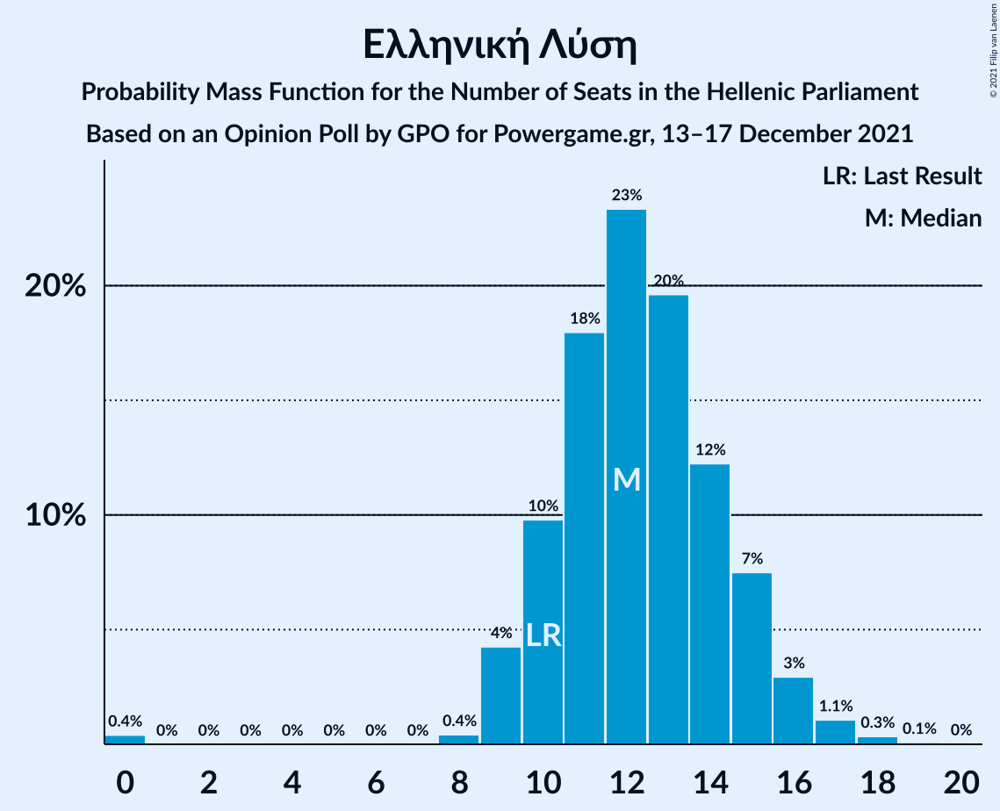

# Opinion Poll by GPO for Powergame.gr, 13–17 December 2021

<a href="#voting-intentions">Voting Intentions</a> | <a href="#seats">Seats</a> | <a href="#coalitions">Coalitions</a> | <a href="#technical-information">Technical Information</a>

## Voting Intentions

### Confidence Intervals

| Party | Last Result | Poll Result | 80% Confidence Interval | 90% Confidence Interval | 95% Confidence Interval | 99% Confidence Interval |
|:-----:|:-----------:|:-----------:|:-----------------------:|:-----------------------:|:-----------------------:|:-----------------------:|
| Νέα Δημοκρατία | 39.8% | 38.0% | 36.1–40.0% |35.5–40.6% |35.0–41.1% |34.1–42.0% |
| Συνασπισμός Ριζοσπαστικής Αριστεράς | 31.5% | 25.4% | 23.7–27.2% |23.2–27.7% |22.8–28.2% |22.0–29.1% |
| Κίνημα Αλλαγής | 8.1% | 15.5% | 14.1–17.1% |13.7–17.5% |13.4–17.9% |12.7–18.7% |
| Κομμουνιστικό Κόμμα Ελλάδας | 5.3% | 6.5% | 5.6–7.6% |5.3–7.9% |5.1–8.2% |4.7–8.8% |
| Ελληνική Λύση | 3.7% | 4.5% | 3.8–5.5% |3.6–5.7% |3.4–6.0% |3.0–6.5% |
| Μέτωπο Ευρωπαϊκής Ρεαλιστικής Ανυπακοής | 3.4% | 3.4% | 2.8–4.3% |2.6–4.5% |2.4–4.7% |2.2–5.2% |

*Note:* The poll result column reflects the actual value used in the calculations. Published results may vary slightly, and in addition be rounded to fewer digits.

## Seats

### Confidence Intervals

| Party | Last Result | Median | 80% Confidence Interval | 90% Confidence Interval | 95% Confidence Interval | 99% Confidence Interval |
|:-----:|:-----------:|:------:|:-----------------------:|:-----------------------:|:-----------------------:|:-----------------------:|
| <a href="#νέα-δημοκρατία">Νέα Δημοκρατία</a> | 158 | 152 | 147–158 |145–159 |144–161 |141–164 |
| <a href="#συνασπισμός-ριζοσπαστικής-αριστεράς">Συνασπισμός Ριζοσπαστικής Αριστεράς</a> | 86 | 68 | 64–73 |62–75 |61–76 |59–79 |
| <a href="#κίνημα-αλλαγής">Κίνημα Αλλαγής</a> | 22 | 42 | 38–46 |37–47 |36–48 |34–50 |
| <a href="#κομμουνιστικό-κόμμα-ελλάδας">Κομμουνιστικό Κόμμα Ελλάδας</a> | 15 | 18 | 15–20 |14–21 |14–22 |13–24 |
| <a href="#ελληνική-λύση">Ελληνική Λύση</a> | 10 | 12 | 10–15 |9–15 |9–16 |8–17 |
| <a href="#μέτωπο-ευρωπαϊκής-ρεαλιστικής-ανυπακοής">Μέτωπο Ευρωπαϊκής Ρεαλιστικής Ανυπακοής</a> | 9 | 9 | 0–11 |0–12 |0–13 |0–14 |

### Νέα Δημοκρατία

*For a full overview of the results for this party, see the [Νέα Δημοκρατία](party-νέαδημοκρατία.html) page.*

| Number of Seats | Probability | Accumulated | Special Marks |
|:---------------:|:-----------:|:-----------:|:-------------:|
| 139 | 0.1% | 100% |  |
| 140 | 0.1% | 99.9% |  |
| 141 | 0.3% | 99.7% |  |
| 142 | 0.5% | 99.5% |  |
| 143 | 1.0% | 98.9% |  |
| 144 | 2% | 98% |  |
| 145 | 2% | 96% |  |
| 146 | 4% | 94% |  |
| 147 | 4% | 90% |  |
| 148 | 6% | 86% |  |
| 149 | 7% | 80% |  |
| 150 | 8% | 72% |  |
| 151 | 9% | 64% | Majority |
| 152 | 10% | 55% | Median |
| 153 | 9% | 45% |  |
| 154 | 8% | 36% |  |
| 155 | 7% | 29% |  |
| 156 | 6% | 22% |  |
| 157 | 5% | 16% |  |
| 158 | 3% | 11% | Last Result |
| 159 | 3% | 7% |  |
| 160 | 2% | 5% |  |
| 161 | 1.2% | 3% |  |
| 162 | 0.8% | 2% |  |
| 163 | 0.5% | 1.1% |  |
| 164 | 0.3% | 0.6% |  |
| 165 | 0.1% | 0.3% |  |
| 166 | 0.1% | 0.2% |  |
| 167 | 0% | 0.1% |  |
| 168 | 0% | 0% |  |

### Συνασπισμός Ριζοσπαστικής Αριστεράς

*For a full overview of the results for this party, see the [Συνασπισμός Ριζοσπαστικής Αριστεράς](party-συνασπισμόςριζοσπαστικήςαριστεράς.html) page.*

| Number of Seats | Probability | Accumulated | Special Marks |
|:---------------:|:-----------:|:-----------:|:-------------:|
| 56 | 0% | 100% |  |
| 57 | 0.1% | 99.9% |  |
| 58 | 0.2% | 99.9% |  |
| 59 | 0.4% | 99.7% |  |
| 60 | 0.9% | 99.2% |  |
| 61 | 2% | 98% |  |
| 62 | 3% | 97% |  |
| 63 | 4% | 94% |  |
| 64 | 6% | 90% |  |
| 65 | 8% | 84% |  |
| 66 | 9% | 76% |  |
| 67 | 10% | 68% |  |
| 68 | 11% | 58% | Median |
| 69 | 10% | 47% |  |
| 70 | 9% | 37% |  |
| 71 | 9% | 29% |  |
| 72 | 6% | 20% |  |
| 73 | 5% | 14% |  |
| 74 | 4% | 9% |  |
| 75 | 2% | 6% |  |
| 76 | 1.4% | 3% |  |
| 77 | 0.9% | 2% |  |
| 78 | 0.6% | 1.2% |  |
| 79 | 0.3% | 0.6% |  |
| 80 | 0.1% | 0.3% |  |
| 81 | 0.1% | 0.1% |  |
| 82 | 0% | 0.1% |  |
| 83 | 0% | 0% |  |
| 84 | 0% | 0% |  |
| 85 | 0% | 0% |  |
| 86 | 0% | 0% | Last Result |

### Κίνημα Αλλαγής

*For a full overview of the results for this party, see the [Κίνημα Αλλαγής](party-κίνημααλλαγής.html) page.*

| Number of Seats | Probability | Accumulated | Special Marks |
|:---------------:|:-----------:|:-----------:|:-------------:|
| 22 | 0% | 100% | Last Result |
| 23 | 0% | 100% |  |
| 24 | 0% | 100% |  |
| 25 | 0% | 100% |  |
| 26 | 0% | 100% |  |
| 27 | 0% | 100% |  |
| 28 | 0% | 100% |  |
| 29 | 0% | 100% |  |
| 30 | 0% | 100% |  |
| 31 | 0% | 100% |  |
| 32 | 0.1% | 100% |  |
| 33 | 0.2% | 99.9% |  |
| 34 | 0.5% | 99.8% |  |
| 35 | 1.0% | 99.3% |  |
| 36 | 2% | 98% |  |
| 37 | 4% | 96% |  |
| 38 | 6% | 92% |  |
| 39 | 10% | 86% |  |
| 40 | 10% | 76% |  |
| 41 | 13% | 66% |  |
| 42 | 13% | 53% | Median |
| 43 | 11% | 41% |  |
| 44 | 10% | 29% |  |
| 45 | 7% | 19% |  |
| 46 | 5% | 12% |  |
| 47 | 3% | 7% |  |
| 48 | 2% | 4% |  |
| 49 | 1.1% | 2% |  |
| 50 | 0.5% | 0.9% |  |
| 51 | 0.2% | 0.4% |  |
| 52 | 0.1% | 0.2% |  |
| 53 | 0.1% | 0.1% |  |
| 54 | 0% | 0% |  |

### Κομμουνιστικό Κόμμα Ελλάδας

*For a full overview of the results for this party, see the [Κομμουνιστικό Κόμμα Ελλάδας](party-κομμουνιστικόκόμμαελλάδας.html) page.*

| Number of Seats | Probability | Accumulated | Special Marks |
|:---------------:|:-----------:|:-----------:|:-------------:|
| 12 | 0.3% | 100% |  |
| 13 | 2% | 99.6% |  |
| 14 | 4% | 98% |  |
| 15 | 8% | 94% | Last Result |
| 16 | 14% | 85% |  |
| 17 | 19% | 71% |  |
| 18 | 19% | 52% | Median |
| 19 | 14% | 33% |  |
| 20 | 9% | 19% |  |
| 21 | 5% | 9% |  |
| 22 | 3% | 4% |  |
| 23 | 1.2% | 2% |  |
| 24 | 0.4% | 0.6% |  |
| 25 | 0.1% | 0.2% |  |
| 26 | 0% | 0% |  |

### Ελληνική Λύση

*For a full overview of the results for this party, see the [Ελληνική Λύση](party-ελληνικήλύση.html) page.*

| Number of Seats | Probability | Accumulated | Special Marks |
|:---------------:|:-----------:|:-----------:|:-------------:|
| 0 | 0.4% | 100% |  |
| 1 | 0% | 99.6% |  |
| 2 | 0% | 99.6% |  |
| 3 | 0% | 99.6% |  |
| 4 | 0% | 99.6% |  |
| 5 | 0% | 99.6% |  |
| 6 | 0% | 99.6% |  |
| 7 | 0% | 99.6% |  |
| 8 | 0.4% | 99.6% |  |
| 9 | 4% | 99.2% |  |
| 10 | 10% | 95% | Last Result |
| 11 | 18% | 85% |  |
| 12 | 23% | 67% | Median |
| 13 | 20% | 44% |  |
| 14 | 12% | 24% |  |
| 15 | 7% | 12% |  |
| 16 | 3% | 4% |  |
| 17 | 1.1% | 2% |  |
| 18 | 0.3% | 0.5% |  |
| 19 | 0.1% | 0.1% |  |
| 20 | 0% | 0% |  |

### Μέτωπο Ευρωπαϊκής Ρεαλιστικής Ανυπακοής

*For a full overview of the results for this party, see the [Μέτωπο Ευρωπαϊκής Ρεαλιστικής Ανυπακοής](party-μέτωποευρωπαϊκήςρεαλιστικήςανυπακοής.html) page.*

| Number of Seats | Probability | Accumulated | Special Marks |
|:---------------:|:-----------:|:-----------:|:-------------:|
| 0 | 21% | 100% |  |
| 1 | 0% | 79% |  |
| 2 | 0% | 79% |  |
| 3 | 0% | 79% |  |
| 4 | 0% | 79% |  |
| 5 | 0% | 79% |  |
| 6 | 0% | 79% |  |
| 7 | 0% | 79% |  |
| 8 | 12% | 79% |  |
| 9 | 24% | 67% | Last Result, Median |
| 10 | 22% | 44% |  |
| 11 | 13% | 21% |  |
| 12 | 6% | 9% |  |
| 13 | 2% | 3% |  |
| 14 | 0.5% | 0.7% |  |
| 15 | 0.2% | 0.2% |  |
| 16 | 0% | 0% |  |

## Coalitions

### Confidence Intervals

| Coalition | Last Result | Median | Majority? | 80% Confidence Interval | 90% Confidence Interval | 95% Confidence Interval | 99% Confidence Interval |
|:---------:|:-----------:|:------:|:---------:|:-----------------------:|:-----------------------:|:-----------------------:|:-----------------------:|
| Νέα Δημοκρατία – Κίνημα Αλλαγής | 180 | 194 | 100% | 188–200 | 187–202 | 185–204 | 183–207 |
| Νέα Δημοκρατία | 158 | 152 | 64% | 147–158 | 145–159 | 144–161 | 141–164 |
| Συνασπισμός Ριζοσπαστικής Αριστεράς – Μέτωπο Ευρωπαϊκής Ρεαλιστικής Ανυπακοής | 95 | 76 | 0% | 70–82 | 68–83 | 66–85 | 63–87 |
| Συνασπισμός Ριζοσπαστικής Αριστεράς | 86 | 68 | 0% | 64–73 | 62–75 | 61–76 | 59–79 |

### Νέα Δημοκρατία – Κίνημα Αλλαγής

| Number of Seats | Probability | Accumulated | Special Marks |
|:---------------:|:-----------:|:-----------:|:-------------:|
| 180 | 0.1% | 100% | Last Result |
| 181 | 0.1% | 99.9% |  |
| 182 | 0.2% | 99.8% |  |
| 183 | 0.4% | 99.5% |  |
| 184 | 0.8% | 99.1% |  |
| 185 | 1.3% | 98% |  |
| 186 | 2% | 97% |  |
| 187 | 3% | 95% |  |
| 188 | 4% | 92% |  |
| 189 | 5% | 88% |  |
| 190 | 7% | 83% |  |
| 191 | 7% | 76% |  |
| 192 | 8% | 69% |  |
| 193 | 9% | 61% |  |
| 194 | 9% | 52% | Median |
| 195 | 8% | 43% |  |
| 196 | 7% | 35% |  |
| 197 | 7% | 28% |  |
| 198 | 5% | 21% |  |
| 199 | 5% | 16% |  |
| 200 | 3% | 12% |  |
| 201 | 3% | 9% |  |
| 202 | 2% | 6% |  |
| 203 | 2% | 4% |  |
| 204 | 0.9% | 3% |  |
| 205 | 0.8% | 2% |  |
| 206 | 0.4% | 1.1% |  |
| 207 | 0.3% | 0.7% |  |
| 208 | 0.2% | 0.4% |  |
| 209 | 0.1% | 0.2% |  |
| 210 | 0.1% | 0.1% |  |
| 211 | 0% | 0% |  |

### Νέα Δημοκρατία

| Number of Seats | Probability | Accumulated | Special Marks |
|:---------------:|:-----------:|:-----------:|:-------------:|
| 139 | 0.1% | 100% |  |
| 140 | 0.1% | 99.9% |  |
| 141 | 0.3% | 99.7% |  |
| 142 | 0.5% | 99.5% |  |
| 143 | 1.0% | 98.9% |  |
| 144 | 2% | 98% |  |
| 145 | 2% | 96% |  |
| 146 | 4% | 94% |  |
| 147 | 4% | 90% |  |
| 148 | 6% | 86% |  |
| 149 | 7% | 80% |  |
| 150 | 8% | 72% |  |
| 151 | 9% | 64% | Majority |
| 152 | 10% | 55% | Median |
| 153 | 9% | 45% |  |
| 154 | 8% | 36% |  |
| 155 | 7% | 29% |  |
| 156 | 6% | 22% |  |
| 157 | 5% | 16% |  |
| 158 | 3% | 11% | Last Result |
| 159 | 3% | 7% |  |
| 160 | 2% | 5% |  |
| 161 | 1.2% | 3% |  |
| 162 | 0.8% | 2% |  |
| 163 | 0.5% | 1.1% |  |
| 164 | 0.3% | 0.6% |  |
| 165 | 0.1% | 0.3% |  |
| 166 | 0.1% | 0.2% |  |
| 167 | 0% | 0.1% |  |
| 168 | 0% | 0% |  |

### Συνασπισμός Ριζοσπαστικής Αριστεράς – Μέτωπο Ευρωπαϊκής Ρεαλιστικής Ανυπακοής

| Number of Seats | Probability | Accumulated | Special Marks |
|:---------------:|:-----------:|:-----------:|:-------------:|
| 60 | 0% | 100% |  |
| 61 | 0.1% | 99.9% |  |
| 62 | 0.2% | 99.9% |  |
| 63 | 0.3% | 99.7% |  |
| 64 | 0.5% | 99.3% |  |
| 65 | 0.8% | 98.9% |  |
| 66 | 1.1% | 98% |  |
| 67 | 2% | 97% |  |
| 68 | 2% | 95% |  |
| 69 | 2% | 93% |  |
| 70 | 3% | 91% |  |
| 71 | 4% | 88% |  |
| 72 | 5% | 84% |  |
| 73 | 5% | 78% |  |
| 74 | 7% | 73% |  |
| 75 | 8% | 66% |  |
| 76 | 9% | 58% |  |
| 77 | 9% | 49% | Median |
| 78 | 8% | 40% |  |
| 79 | 8% | 32% |  |
| 80 | 7% | 24% |  |
| 81 | 5% | 17% |  |
| 82 | 4% | 12% |  |
| 83 | 3% | 8% |  |
| 84 | 2% | 4% |  |
| 85 | 1.1% | 3% |  |
| 86 | 0.7% | 2% |  |
| 87 | 0.4% | 0.8% |  |
| 88 | 0.2% | 0.4% |  |
| 89 | 0.1% | 0.2% |  |
| 90 | 0% | 0.1% |  |
| 91 | 0% | 0% |  |
| 92 | 0% | 0% |  |
| 93 | 0% | 0% |  |
| 94 | 0% | 0% |  |
| 95 | 0% | 0% | Last Result |

### Συνασπισμός Ριζοσπαστικής Αριστεράς

| Number of Seats | Probability | Accumulated | Special Marks |
|:---------------:|:-----------:|:-----------:|:-------------:|
| 56 | 0% | 100% |  |
| 57 | 0.1% | 99.9% |  |
| 58 | 0.2% | 99.9% |  |
| 59 | 0.4% | 99.7% |  |
| 60 | 0.9% | 99.2% |  |
| 61 | 2% | 98% |  |
| 62 | 3% | 97% |  |
| 63 | 4% | 94% |  |
| 64 | 6% | 90% |  |
| 65 | 8% | 84% |  |
| 66 | 9% | 76% |  |
| 67 | 10% | 68% |  |
| 68 | 11% | 58% | Median |
| 69 | 10% | 47% |  |
| 70 | 9% | 37% |  |
| 71 | 9% | 29% |  |
| 72 | 6% | 20% |  |
| 73 | 5% | 14% |  |
| 74 | 4% | 9% |  |
| 75 | 2% | 6% |  |
| 76 | 1.4% | 3% |  |
| 77 | 0.9% | 2% |  |
| 78 | 0.6% | 1.2% |  |
| 79 | 0.3% | 0.6% |  |
| 80 | 0.1% | 0.3% |  |
| 81 | 0.1% | 0.1% |  |
| 82 | 0% | 0.1% |  |
| 83 | 0% | 0% |  |
| 84 | 0% | 0% |  |
| 85 | 0% | 0% |  |
| 86 | 0% | 0% | Last Result |

## Technical Information

### Opinion Poll

+ **Polling firm:** GPO
+ **Commissioner(s):** Powergame.gr
+ **Fieldwork period:** 13–17 December 2021

### Calculations

+ **Sample size:** 1000
+ **Simulations done:** 1,048,576
+ **Error estimate:** 0.66%

