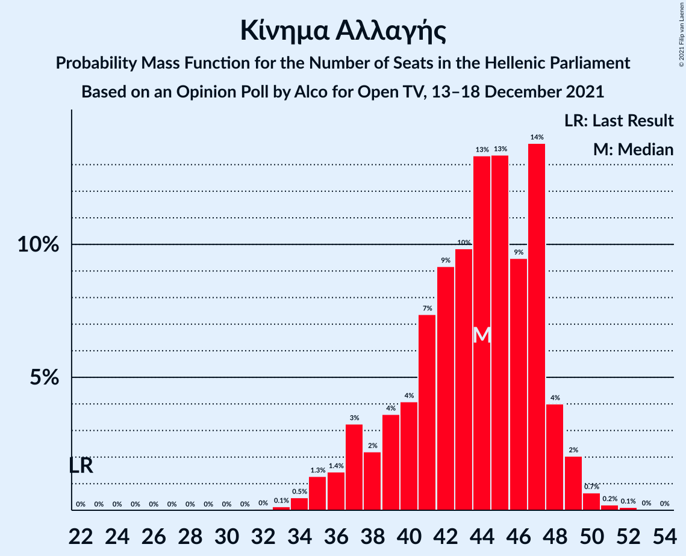

# Opinion Poll by Alco for Open TV, 13–18 December 2021

<a href="#voting-intentions">Voting Intentions</a> | <a href="#seats">Seats</a> | <a href="#coalitions">Coalitions</a> | <a href="#technical-information">Technical Information</a>

## Voting Intentions

### Confidence Intervals

| Party | Last Result | Poll Result | 80% Confidence Interval | 90% Confidence Interval | 95% Confidence Interval | 99% Confidence Interval |
|:-----:|:-----------:|:-----------:|:-----------------------:|:-----------------------:|:-----------------------:|:-----------------------:|
| Νέα Δημοκρατία | 39.8% | 37.3% | 35.4–39.3% |34.8–39.9% |34.4–40.3% |33.4–41.3% |
| Συνασπισμός Ριζοσπαστικής Αριστεράς | 31.5% | 24.2% | 22.5–26.0% |22.1–26.5% |21.6–27.0% |20.9–27.8% |
| Κίνημα Αλλαγής | 8.1% | 15.6% | 14.2–17.2% |13.8–17.6% |13.5–18.0% |12.8–18.8% |
| Κομμουνιστικό Κόμμα Ελλάδας | 5.3% | 6.2% | 5.3–7.3% |5.1–7.6% |4.9–7.9% |4.5–8.4% |
| Ελληνική Λύση | 3.7% | 4.2% | 3.5–5.1% |3.3–5.4% |3.1–5.6% |2.8–6.1% |
| Μέτωπο Ευρωπαϊκής Ρεαλιστικής Ανυπακοής | 3.4% | 4.0% | 3.3–4.9% |3.1–5.2% |2.9–5.4% |2.7–5.9% |
| Χρυσή Αυγή | 2.9% | 2.5% | 2.0–3.3% |1.8–3.5% |1.7–3.7% |1.5–4.1% |
| Πλεύση Ελευθερίας | 1.5% | 1.3% | 0.9–1.9% |0.8–2.1% |0.8–2.2% |0.6–2.5% |

*Note:* The poll result column reflects the actual value used in the calculations. Published results may vary slightly, and in addition be rounded to fewer digits.

## Seats

### Confidence Intervals

| Party | Last Result | Median | 80% Confidence Interval | 90% Confidence Interval | 95% Confidence Interval | 99% Confidence Interval |
|:-----:|:-----------:|:------:|:-----------------------:|:-----------------------:|:-----------------------:|:-----------------------:|
| <a href="#νέα-δημοκρατία">Νέα Δημοκρατία</a> | 158 | 150 | 145–156 |144–158 |143–159 |140–162 |
| <a href="#συνασπισμός-ριζοσπαστικής-αριστεράς">Συνασπισμός Ριζοσπαστικής Αριστεράς</a> | 86 | 65 | 61–70 |59–71 |58–73 |56–76 |
| <a href="#κίνημα-αλλαγής">Κίνημα Αλλαγής</a> | 22 | 44 | 39–47 |37–48 |36–49 |34–50 |
| <a href="#κομμουνιστικό-κόμμα-ελλάδας">Κομμουνιστικό Κόμμα Ελλάδας</a> | 15 | 17 | 15–20 |14–21 |13–22 |12–23 |
| <a href="#ελληνική-λύση">Ελληνική Λύση</a> | 10 | 11 | 9–14 |9–14 |8–15 |0–16 |
| <a href="#μέτωπο-ευρωπαϊκής-ρεαλιστικής-ανυπακοής">Μέτωπο Ευρωπαϊκής Ρεαλιστικής Ανυπακοής</a> | 9 | 11 | 9–14 |8–14 |0–15 |0–16 |
| <a href="#χρυσή-αυγή">Χρυσή Αυγή</a> | 0 | 0 | 0–9 |0–9 |0–10 |0–11 |
| <a href="#πλεύση-ελευθερίας">Πλεύση Ελευθερίας</a> | 0 | 0 | 0 |0 |0 |0 |

### Νέα Δημοκρατία

*For a full overview of the results for this party, see the [Νέα Δημοκρατία](party-νέαδημοκρατία.html) page.*

| Number of Seats | Probability | Accumulated | Special Marks |
|:---------------:|:-----------:|:-----------:|:-------------:|
| 137 | 0% | 100% |  |
| 138 | 0.1% | 99.9% |  |
| 139 | 0.2% | 99.8% |  |
| 140 | 0.2% | 99.6% |  |
| 141 | 0.6% | 99.4% |  |
| 142 | 1.1% | 98.8% |  |
| 143 | 2% | 98% |  |
| 144 | 4% | 95% |  |
| 145 | 4% | 91% |  |
| 146 | 5% | 87% |  |
| 147 | 7% | 82% |  |
| 148 | 14% | 75% |  |
| 149 | 9% | 61% |  |
| 150 | 9% | 52% | Median |
| 151 | 11% | 43% | Majority |
| 152 | 7% | 32% |  |
| 153 | 5% | 25% |  |
| 154 | 7% | 20% |  |
| 155 | 2% | 14% |  |
| 156 | 4% | 12% |  |
| 157 | 2% | 8% |  |
| 158 | 2% | 6% | Last Result |
| 159 | 1.2% | 4% |  |
| 160 | 1.0% | 2% |  |
| 161 | 0.7% | 1.4% |  |
| 162 | 0.2% | 0.7% |  |
| 163 | 0.3% | 0.5% |  |
| 164 | 0.1% | 0.2% |  |
| 165 | 0.1% | 0.2% |  |
| 166 | 0% | 0.1% |  |
| 167 | 0% | 0% |  |

### Συνασπισμός Ριζοσπαστικής Αριστεράς

*For a full overview of the results for this party, see the [Συνασπισμός Ριζοσπαστικής Αριστεράς](party-συνασπισμόςριζοσπαστικήςαριστεράς.html) page.*

| Number of Seats | Probability | Accumulated | Special Marks |
|:---------------:|:-----------:|:-----------:|:-------------:|
| 53 | 0% | 100% |  |
| 54 | 0.1% | 99.9% |  |
| 55 | 0.2% | 99.9% |  |
| 56 | 0.5% | 99.7% |  |
| 57 | 1.1% | 99.2% |  |
| 58 | 1.4% | 98% |  |
| 59 | 3% | 97% |  |
| 60 | 3% | 94% |  |
| 61 | 5% | 91% |  |
| 62 | 7% | 86% |  |
| 63 | 8% | 79% |  |
| 64 | 12% | 71% |  |
| 65 | 12% | 59% | Median |
| 66 | 10% | 47% |  |
| 67 | 10% | 37% |  |
| 68 | 9% | 28% |  |
| 69 | 6% | 19% |  |
| 70 | 5% | 12% |  |
| 71 | 3% | 7% |  |
| 72 | 2% | 5% |  |
| 73 | 1.1% | 3% |  |
| 74 | 0.6% | 2% |  |
| 75 | 0.4% | 1.0% |  |
| 76 | 0.3% | 0.6% |  |
| 77 | 0.2% | 0.3% |  |
| 78 | 0.1% | 0.2% |  |
| 79 | 0% | 0.1% |  |
| 80 | 0% | 0% |  |
| 81 | 0% | 0% |  |
| 82 | 0% | 0% |  |
| 83 | 0% | 0% |  |
| 84 | 0% | 0% |  |
| 85 | 0% | 0% |  |
| 86 | 0% | 0% | Last Result |

### Κίνημα Αλλαγής

*For a full overview of the results for this party, see the [Κίνημα Αλλαγής](party-κίνημααλλαγής.html) page.*

| Number of Seats | Probability | Accumulated | Special Marks |
|:---------------:|:-----------:|:-----------:|:-------------:|
| 22 | 0% | 100% | Last Result |
| 23 | 0% | 100% |  |
| 24 | 0% | 100% |  |
| 25 | 0% | 100% |  |
| 26 | 0% | 100% |  |
| 27 | 0% | 100% |  |
| 28 | 0% | 100% |  |
| 29 | 0% | 100% |  |
| 30 | 0% | 100% |  |
| 31 | 0% | 100% |  |
| 32 | 0% | 100% |  |
| 33 | 0.1% | 99.9% |  |
| 34 | 0.5% | 99.8% |  |
| 35 | 1.3% | 99.3% |  |
| 36 | 1.4% | 98% |  |
| 37 | 3% | 97% |  |
| 38 | 2% | 93% |  |
| 39 | 4% | 91% |  |
| 40 | 4% | 88% |  |
| 41 | 7% | 83% |  |
| 42 | 9% | 76% |  |
| 43 | 10% | 67% |  |
| 44 | 13% | 57% | Median |
| 45 | 13% | 44% |  |
| 46 | 9% | 30% |  |
| 47 | 14% | 21% |  |
| 48 | 4% | 7% |  |
| 49 | 2% | 3% |  |
| 50 | 0.7% | 1.1% |  |
| 51 | 0.2% | 0.4% |  |
| 52 | 0.1% | 0.2% |  |
| 53 | 0% | 0.1% |  |
| 54 | 0% | 0% |  |

### Κομμουνιστικό Κόμμα Ελλάδας

*For a full overview of the results for this party, see the [Κομμουνιστικό Κόμμα Ελλάδας](party-κομμουνιστικόκόμμαελλάδας.html) page.*

| Number of Seats | Probability | Accumulated | Special Marks |
|:---------------:|:-----------:|:-----------:|:-------------:|
| 11 | 0.1% | 100% |  |
| 12 | 0.7% | 99.9% |  |
| 13 | 2% | 99.2% |  |
| 14 | 4% | 97% |  |
| 15 | 9% | 92% | Last Result |
| 16 | 16% | 83% |  |
| 17 | 24% | 67% | Median |
| 18 | 20% | 43% |  |
| 19 | 9% | 23% |  |
| 20 | 6% | 13% |  |
| 21 | 3% | 7% |  |
| 22 | 3% | 4% |  |
| 23 | 1.1% | 1.4% |  |
| 24 | 0.3% | 0.3% |  |
| 25 | 0.1% | 0.1% |  |
| 26 | 0% | 0% |  |

### Ελληνική Λύση

*For a full overview of the results for this party, see the [Ελληνική Λύση](party-ελληνικήλύση.html) page.*

| Number of Seats | Probability | Accumulated | Special Marks |
|:---------------:|:-----------:|:-----------:|:-------------:|
| 0 | 2% | 100% |  |
| 1 | 0% | 98% |  |
| 2 | 0% | 98% |  |
| 3 | 0% | 98% |  |
| 4 | 0% | 98% |  |
| 5 | 0% | 98% |  |
| 6 | 0% | 98% |  |
| 7 | 0% | 98% |  |
| 8 | 2% | 98% |  |
| 9 | 10% | 96% |  |
| 10 | 15% | 86% | Last Result |
| 11 | 26% | 71% | Median |
| 12 | 21% | 45% |  |
| 13 | 13% | 25% |  |
| 14 | 8% | 12% |  |
| 15 | 3% | 4% |  |
| 16 | 1.0% | 1.5% |  |
| 17 | 0.3% | 0.4% |  |
| 18 | 0.1% | 0.1% |  |
| 19 | 0% | 0% |  |

### Μέτωπο Ευρωπαϊκής Ρεαλιστικής Ανυπακοής

*For a full overview of the results for this party, see the [Μέτωπο Ευρωπαϊκής Ρεαλιστικής Ανυπακοής](party-μέτωποευρωπαϊκήςρεαλιστικήςανυπακοής.html) page.*

| Number of Seats | Probability | Accumulated | Special Marks |
|:---------------:|:-----------:|:-----------:|:-------------:|
| 0 | 3% | 100% |  |
| 1 | 0% | 97% |  |
| 2 | 0% | 97% |  |
| 3 | 0% | 97% |  |
| 4 | 0% | 97% |  |
| 5 | 0% | 97% |  |
| 6 | 0% | 97% |  |
| 7 | 0% | 97% |  |
| 8 | 2% | 97% |  |
| 9 | 12% | 95% | Last Result |
| 10 | 23% | 83% |  |
| 11 | 22% | 60% | Median |
| 12 | 16% | 38% |  |
| 13 | 10% | 22% |  |
| 14 | 8% | 12% |  |
| 15 | 2% | 4% |  |
| 16 | 1.0% | 1.3% |  |
| 17 | 0.2% | 0.3% |  |
| 18 | 0% | 0% |  |

### Χρυσή Αυγή

*For a full overview of the results for this party, see the [Χρυσή Αυγή](party-χρυσήαυγή.html) page.*

| Number of Seats | Probability | Accumulated | Special Marks |
|:---------------:|:-----------:|:-----------:|:-------------:|
| 0 | 83% | 100% | Last Result, Median |
| 1 | 0% | 17% |  |
| 2 | 0% | 17% |  |
| 3 | 0% | 17% |  |
| 4 | 0% | 17% |  |
| 5 | 0% | 17% |  |
| 6 | 0% | 17% |  |
| 7 | 0% | 17% |  |
| 8 | 6% | 17% |  |
| 9 | 8% | 11% |  |
| 10 | 3% | 3% |  |
| 11 | 0.5% | 0.6% |  |
| 12 | 0.1% | 0.1% |  |
| 13 | 0% | 0% |  |

### Πλεύση Ελευθερίας

*For a full overview of the results for this party, see the [Πλεύση Ελευθερίας](party-πλεύσηελευθερίας.html) page.*

| Number of Seats | Probability | Accumulated | Special Marks |
|:---------------:|:-----------:|:-----------:|:-------------:|
| 0 | 100% | 100% | Last Result, Median |

## Coalitions

### Confidence Intervals

| Coalition | Last Result | Median | Majority? | 80% Confidence Interval | 90% Confidence Interval | 95% Confidence Interval | 99% Confidence Interval |
|:---------:|:-----------:|:------:|:---------:|:-----------------------:|:-----------------------:|:-----------------------:|:-----------------------:|
| Νέα Δημοκρατία – Κίνημα Αλλαγής | 180 | 193 | 100% | 188–199 | 186–201 | 184–203 | 181–206 |
| Νέα Δημοκρατία | 158 | 150 | 43% | 145–156 | 144–158 | 143–159 | 140–162 |
| Συνασπισμός Ριζοσπαστικής Αριστεράς – Μέτωπο Ευρωπαϊκής Ρεαλιστικής Ανυπακοής | 95 | 76 | 0% | 71–81 | 69–83 | 67–84 | 65–87 |
| Συνασπισμός Ριζοσπαστικής Αριστεράς | 86 | 65 | 0% | 61–70 | 59–71 | 58–73 | 56–76 |

### Νέα Δημοκρατία – Κίνημα Αλλαγής

| Number of Seats | Probability | Accumulated | Special Marks |
|:---------------:|:-----------:|:-----------:|:-------------:|
| 178 | 0% | 100% |  |
| 179 | 0.1% | 99.9% |  |
| 180 | 0.1% | 99.9% | Last Result |
| 181 | 0.2% | 99.7% |  |
| 182 | 0.4% | 99.5% |  |
| 183 | 0.9% | 99.0% |  |
| 184 | 1.2% | 98% |  |
| 185 | 1.5% | 97% |  |
| 186 | 2% | 95% |  |
| 187 | 3% | 93% |  |
| 188 | 4% | 91% |  |
| 189 | 6% | 87% |  |
| 190 | 7% | 81% |  |
| 191 | 7% | 75% |  |
| 192 | 9% | 68% |  |
| 193 | 10% | 59% |  |
| 194 | 6% | 49% | Median |
| 195 | 7% | 44% |  |
| 196 | 7% | 37% |  |
| 197 | 9% | 29% |  |
| 198 | 8% | 21% |  |
| 199 | 4% | 12% |  |
| 200 | 2% | 9% |  |
| 201 | 2% | 6% |  |
| 202 | 1.3% | 4% |  |
| 203 | 0.8% | 3% |  |
| 204 | 0.8% | 2% |  |
| 205 | 0.4% | 1.1% |  |
| 206 | 0.4% | 0.7% |  |
| 207 | 0.1% | 0.3% |  |
| 208 | 0.1% | 0.2% |  |
| 209 | 0% | 0.1% |  |
| 210 | 0.1% | 0.1% |  |
| 211 | 0% | 0% |  |

### Νέα Δημοκρατία

| Number of Seats | Probability | Accumulated | Special Marks |
|:---------------:|:-----------:|:-----------:|:-------------:|
| 137 | 0% | 100% |  |
| 138 | 0.1% | 99.9% |  |
| 139 | 0.2% | 99.8% |  |
| 140 | 0.2% | 99.6% |  |
| 141 | 0.6% | 99.4% |  |
| 142 | 1.1% | 98.8% |  |
| 143 | 2% | 98% |  |
| 144 | 4% | 95% |  |
| 145 | 4% | 91% |  |
| 146 | 5% | 87% |  |
| 147 | 7% | 82% |  |
| 148 | 14% | 75% |  |
| 149 | 9% | 61% |  |
| 150 | 9% | 52% | Median |
| 151 | 11% | 43% | Majority |
| 152 | 7% | 32% |  |
| 153 | 5% | 25% |  |
| 154 | 7% | 20% |  |
| 155 | 2% | 14% |  |
| 156 | 4% | 12% |  |
| 157 | 2% | 8% |  |
| 158 | 2% | 6% | Last Result |
| 159 | 1.2% | 4% |  |
| 160 | 1.0% | 2% |  |
| 161 | 0.7% | 1.4% |  |
| 162 | 0.2% | 0.7% |  |
| 163 | 0.3% | 0.5% |  |
| 164 | 0.1% | 0.2% |  |
| 165 | 0.1% | 0.2% |  |
| 166 | 0% | 0.1% |  |
| 167 | 0% | 0% |  |

### Συνασπισμός Ριζοσπαστικής Αριστεράς – Μέτωπο Ευρωπαϊκής Ρεαλιστικής Ανυπακοής

| Number of Seats | Probability | Accumulated | Special Marks |
|:---------------:|:-----------:|:-----------:|:-------------:|
| 61 | 0.1% | 100% |  |
| 62 | 0.1% | 99.9% |  |
| 63 | 0.1% | 99.8% |  |
| 64 | 0.2% | 99.7% |  |
| 65 | 0.4% | 99.5% |  |
| 66 | 0.5% | 99.2% |  |
| 67 | 1.2% | 98.7% |  |
| 68 | 1.1% | 97% |  |
| 69 | 2% | 96% |  |
| 70 | 2% | 95% |  |
| 71 | 3% | 92% |  |
| 72 | 5% | 89% |  |
| 73 | 8% | 85% |  |
| 74 | 10% | 77% |  |
| 75 | 10% | 67% |  |
| 76 | 10% | 57% | Median |
| 77 | 8% | 47% |  |
| 78 | 10% | 39% |  |
| 79 | 8% | 29% |  |
| 80 | 7% | 21% |  |
| 81 | 5% | 14% |  |
| 82 | 3% | 9% |  |
| 83 | 2% | 6% |  |
| 84 | 2% | 4% |  |
| 85 | 1.3% | 2% |  |
| 86 | 0.6% | 1.1% |  |
| 87 | 0.2% | 0.5% |  |
| 88 | 0.2% | 0.3% |  |
| 89 | 0.1% | 0.1% |  |
| 90 | 0% | 0.1% |  |
| 91 | 0% | 0% |  |
| 92 | 0% | 0% |  |
| 93 | 0% | 0% |  |
| 94 | 0% | 0% |  |
| 95 | 0% | 0% | Last Result |

### Συνασπισμός Ριζοσπαστικής Αριστεράς

| Number of Seats | Probability | Accumulated | Special Marks |
|:---------------:|:-----------:|:-----------:|:-------------:|
| 53 | 0% | 100% |  |
| 54 | 0.1% | 99.9% |  |
| 55 | 0.2% | 99.9% |  |
| 56 | 0.5% | 99.7% |  |
| 57 | 1.1% | 99.2% |  |
| 58 | 1.4% | 98% |  |
| 59 | 3% | 97% |  |
| 60 | 3% | 94% |  |
| 61 | 5% | 91% |  |
| 62 | 7% | 86% |  |
| 63 | 8% | 79% |  |
| 64 | 12% | 71% |  |
| 65 | 12% | 59% | Median |
| 66 | 10% | 47% |  |
| 67 | 10% | 37% |  |
| 68 | 9% | 28% |  |
| 69 | 6% | 19% |  |
| 70 | 5% | 12% |  |
| 71 | 3% | 7% |  |
| 72 | 2% | 5% |  |
| 73 | 1.1% | 3% |  |
| 74 | 0.6% | 2% |  |
| 75 | 0.4% | 1.0% |  |
| 76 | 0.3% | 0.6% |  |
| 77 | 0.2% | 0.3% |  |
| 78 | 0.1% | 0.2% |  |
| 79 | 0% | 0.1% |  |
| 80 | 0% | 0% |  |
| 81 | 0% | 0% |  |
| 82 | 0% | 0% |  |
| 83 | 0% | 0% |  |
| 84 | 0% | 0% |  |
| 85 | 0% | 0% |  |
| 86 | 0% | 0% | Last Result |

## Technical Information

### Opinion Poll

+ **Polling firm:** Alco
+ **Commissioner(s):** Open TV
+ **Fieldwork period:** 13–18 December 2021

### Calculations

+ **Sample size:** 1000
+ **Simulations done:** 1,048,576
+ **Error estimate:** 1.19%

