# Opinion Poll by Interview for Politic.gr, 10–12 January 2022

<a href="#voting-intentions">Voting Intentions</a> | <a href="#seats">Seats</a> | <a href="#coalitions">Coalitions</a> | <a href="#technical-information">Technical Information</a>

## Voting Intentions

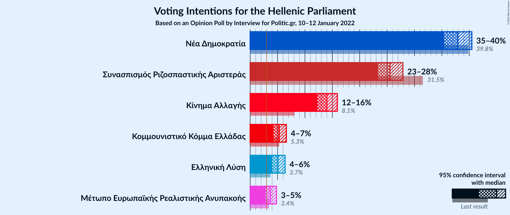

### Confidence Intervals

| Party | Last Result | Poll Result | 80% Confidence Interval | 90% Confidence Interval | 95% Confidence Interval | 99% Confidence Interval |
|:-----:|:-----------:|:-----------:|:-----------------------:|:-----------------------:|:-----------------------:|:-----------------------:|
| Νέα Δημοκρατία | 39.8% | 37.9% | 36.3–39.6% |35.8–40.1% |35.4–40.5% |34.6–41.3% |
| Συνασπισμός Ριζοσπαστικής Αριστεράς | 31.5% | 25.5% | 24.1–27.1% |23.7–27.5% |23.3–27.9% |22.6–28.6% |
| Κίνημα Αλλαγής | 8.1% | 14.0% | 12.9–15.3% |12.6–15.6% |12.3–15.9% |11.8–16.5% |
| Κομμουνιστικό Κόμμα Ελλάδας | 5.3% | 5.3% | 4.6–6.2% |4.4–6.4% |4.3–6.6% |3.9–7.0% |
| Ελληνική Λύση | 3.7% | 5.1% | 4.4–5.9% |4.2–6.2% |4.1–6.4% |3.7–6.8% |
| Μέτωπο Ευρωπαϊκής Ρεαλιστικής Ανυπακοής | 3.4% | 3.7% | 3.1–4.4% |2.9–4.6% |2.8–4.8% |2.6–5.2% |

*Note:* The poll result column reflects the actual value used in the calculations. Published results may vary slightly, and in addition be rounded to fewer digits.

## Seats

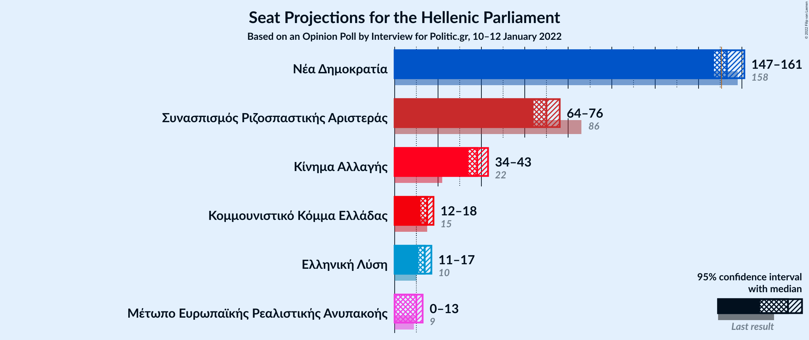

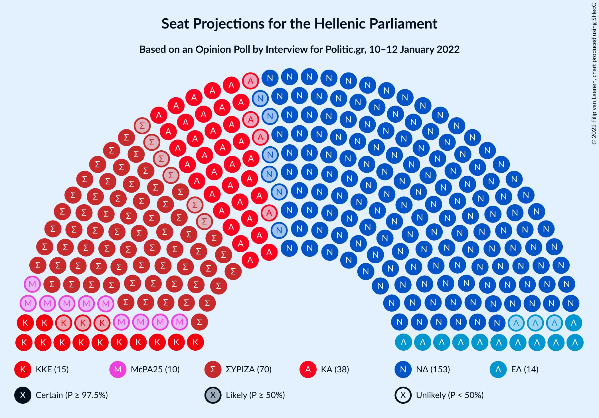

### Confidence Intervals

| Party | Last Result | Median | 80% Confidence Interval | 90% Confidence Interval | 95% Confidence Interval | 99% Confidence Interval |
|:-----:|:-----------:|:------:|:-----------------------:|:-----------------------:|:-----------------------:|:-----------------------:|
| <a href="#νέα-δημοκρατία">Νέα Δημοκρατία</a> | 158 | 153 | 149–158 |148–160 |147–161 |145–163 |
| <a href="#συνασπισμός-ριζοσπαστικής-αριστεράς">Συνασπισμός Ριζοσπαστικής Αριστεράς</a> | 86 | 70 | 66–74 |65–75 |64–76 |62–78 |
| <a href="#κίνημα-αλλαγής">Κίνημα Αλλαγής</a> | 22 | 38 | 35–42 |34–43 |34–43 |32–45 |
| <a href="#κομμουνιστικό-κόμμα-ελλάδας">Κομμουνιστικό Κόμμα Ελλάδας</a> | 15 | 15 | 13–17 |12–17 |12–18 |11–19 |
| <a href="#ελληνική-λύση">Ελληνική Λύση</a> | 10 | 14 | 12–16 |12–17 |11–17 |10–19 |
| <a href="#μέτωπο-ευρωπαϊκής-ρεαλιστικής-ανυπακοής">Μέτωπο Ευρωπαϊκής Ρεαλιστικής Ανυπακοής</a> | 9 | 10 | 8–12 |0–13 |0–13 |0–14 |

### Νέα Δημοκρατία

*For a full overview of the results for this party, see the [Νέα Δημοκρατία](party-νέαδημοκρατία.html) page.*

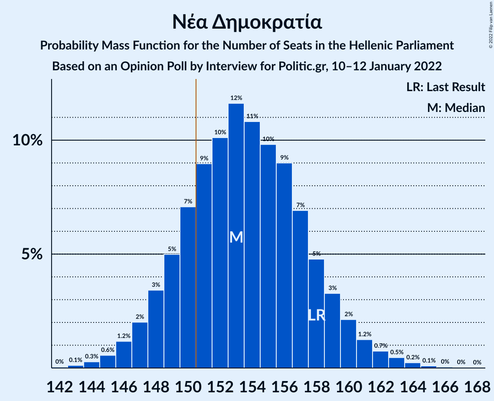

| Number of Seats | Probability | Accumulated | Special Marks |
|:---------------:|:-----------:|:-----------:|:-------------:|
| 142 | 0% | 100% |  |
| 143 | 0.1% | 99.9% |  |
| 144 | 0.3% | 99.8% |  |
| 145 | 0.6% | 99.5% |  |
| 146 | 1.2% | 99.0% |  |
| 147 | 2% | 98% |  |
| 148 | 3% | 96% |  |
| 149 | 5% | 92% |  |
| 150 | 7% | 87% |  |
| 151 | 9% | 80% | Majority |
| 152 | 10% | 71% |  |
| 153 | 12% | 61% | Median |
| 154 | 11% | 50% |  |
| 155 | 10% | 39% |  |
| 156 | 9% | 29% |  |
| 157 | 7% | 20% |  |
| 158 | 5% | 13% | Last Result |
| 159 | 3% | 8% |  |
| 160 | 2% | 5% |  |
| 161 | 1.2% | 3% |  |
| 162 | 0.7% | 2% |  |
| 163 | 0.5% | 0.9% |  |
| 164 | 0.2% | 0.4% |  |
| 165 | 0.1% | 0.2% |  |
| 166 | 0% | 0.1% |  |
| 167 | 0% | 0% |  |

### Συνασπισμός Ριζοσπαστικής Αριστεράς

*For a full overview of the results for this party, see the [Συνασπισμός Ριζοσπαστικής Αριστεράς](party-συνασπισμόςριζοσπαστικήςαριστεράς.html) page.*

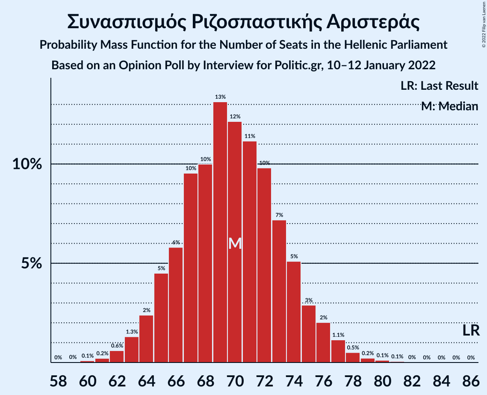

| Number of Seats | Probability | Accumulated | Special Marks |
|:---------------:|:-----------:|:-----------:|:-------------:|
| 60 | 0.1% | 100% |  |
| 61 | 0.2% | 99.9% |  |
| 62 | 0.6% | 99.7% |  |
| 63 | 1.3% | 99.1% |  |
| 64 | 2% | 98% |  |
| 65 | 5% | 95% |  |
| 66 | 6% | 91% |  |
| 67 | 10% | 85% |  |
| 68 | 10% | 76% |  |
| 69 | 13% | 66% |  |
| 70 | 12% | 52% | Median |
| 71 | 11% | 40% |  |
| 72 | 10% | 29% |  |
| 73 | 7% | 19% |  |
| 74 | 5% | 12% |  |
| 75 | 3% | 7% |  |
| 76 | 2% | 4% |  |
| 77 | 1.1% | 2% |  |
| 78 | 0.5% | 0.9% |  |
| 79 | 0.2% | 0.4% |  |
| 80 | 0.1% | 0.2% |  |
| 81 | 0.1% | 0.1% |  |
| 82 | 0% | 0% |  |
| 83 | 0% | 0% |  |
| 84 | 0% | 0% |  |
| 85 | 0% | 0% |  |
| 86 | 0% | 0% | Last Result |

### Κίνημα Αλλαγής

*For a full overview of the results for this party, see the [Κίνημα Αλλαγής](party-κίνημααλλαγής.html) page.*

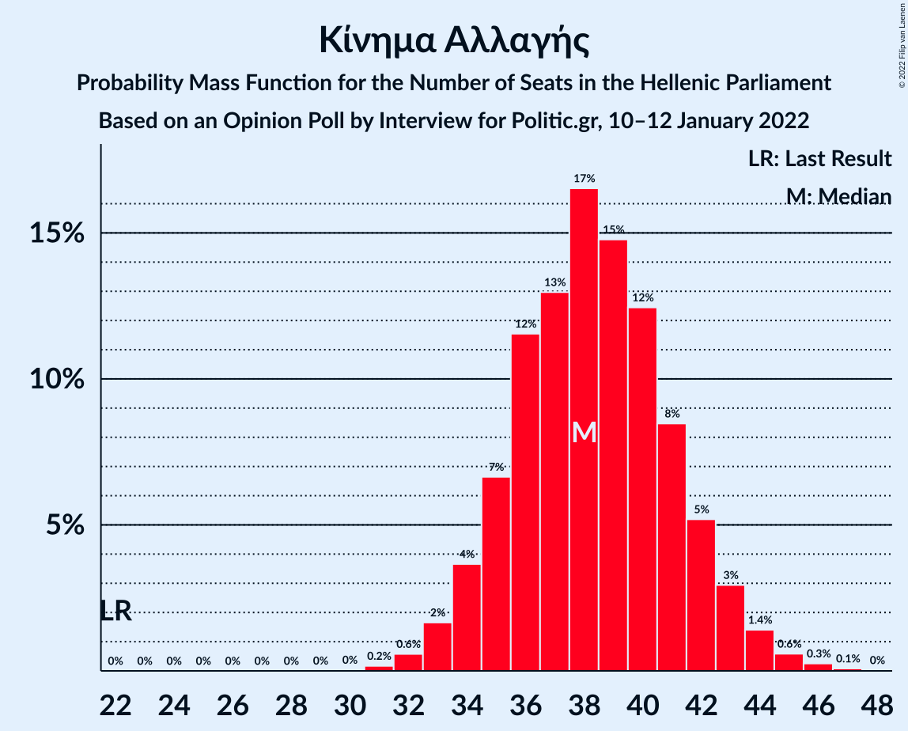

| Number of Seats | Probability | Accumulated | Special Marks |
|:---------------:|:-----------:|:-----------:|:-------------:|
| 22 | 0% | 100% | Last Result |
| 23 | 0% | 100% |  |
| 24 | 0% | 100% |  |
| 25 | 0% | 100% |  |
| 26 | 0% | 100% |  |
| 27 | 0% | 100% |  |
| 28 | 0% | 100% |  |
| 29 | 0% | 100% |  |
| 30 | 0% | 100% |  |
| 31 | 0.2% | 100% |  |
| 32 | 0.6% | 99.8% |  |
| 33 | 2% | 99.2% |  |
| 34 | 4% | 98% |  |
| 35 | 7% | 94% |  |
| 36 | 12% | 87% |  |
| 37 | 13% | 76% |  |
| 38 | 17% | 63% | Median |
| 39 | 15% | 46% |  |
| 40 | 12% | 31% |  |
| 41 | 8% | 19% |  |
| 42 | 5% | 10% |  |
| 43 | 3% | 5% |  |
| 44 | 1.4% | 2% |  |
| 45 | 0.6% | 1.0% |  |
| 46 | 0.3% | 0.4% |  |
| 47 | 0.1% | 0.1% |  |
| 48 | 0% | 0% |  |

### Κομμουνιστικό Κόμμα Ελλάδας

*For a full overview of the results for this party, see the [Κομμουνιστικό Κόμμα Ελλάδας](party-κομμουνιστικόκόμμαελλάδας.html) page.*

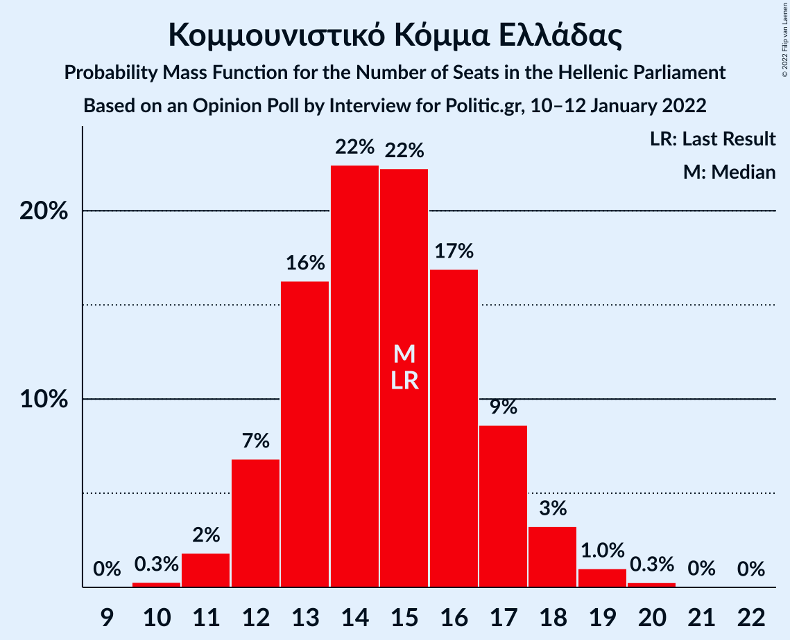

| Number of Seats | Probability | Accumulated | Special Marks |
|:---------------:|:-----------:|:-----------:|:-------------:|
| 10 | 0.3% | 100% |  |
| 11 | 2% | 99.7% |  |
| 12 | 7% | 98% |  |
| 13 | 16% | 91% |  |
| 14 | 22% | 75% |  |
| 15 | 22% | 52% | Last Result, Median |
| 16 | 17% | 30% |  |
| 17 | 9% | 13% |  |
| 18 | 3% | 5% |  |
| 19 | 1.0% | 1.3% |  |
| 20 | 0.3% | 0.3% |  |
| 21 | 0% | 0.1% |  |
| 22 | 0% | 0% |  |

### Ελληνική Λύση

*For a full overview of the results for this party, see the [Ελληνική Λύση](party-ελληνικήλύση.html) page.*

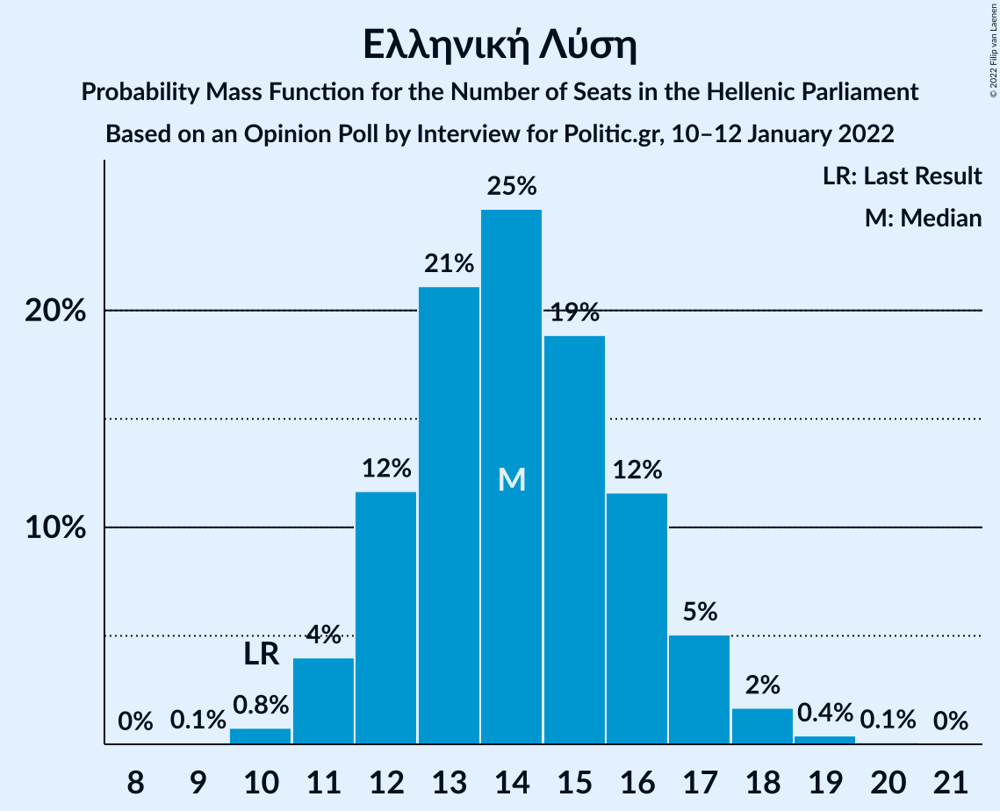

| Number of Seats | Probability | Accumulated | Special Marks |
|:---------------:|:-----------:|:-----------:|:-------------:|
| 9 | 0.1% | 100% |  |
| 10 | 0.8% | 99.9% | Last Result |
| 11 | 4% | 99.2% |  |
| 12 | 12% | 95% |  |
| 13 | 21% | 83% |  |
| 14 | 25% | 62% | Median |
| 15 | 19% | 38% |  |
| 16 | 12% | 19% |  |
| 17 | 5% | 7% |  |
| 18 | 2% | 2% |  |
| 19 | 0.4% | 0.5% |  |
| 20 | 0.1% | 0.1% |  |
| 21 | 0% | 0% |  |

### Μέτωπο Ευρωπαϊκής Ρεαλιστικής Ανυπακοής

*For a full overview of the results for this party, see the [Μέτωπο Ευρωπαϊκής Ρεαλιστικής Ανυπακοής](party-μέτωποευρωπαϊκήςρεαλιστικήςανυπακοής.html) page.*

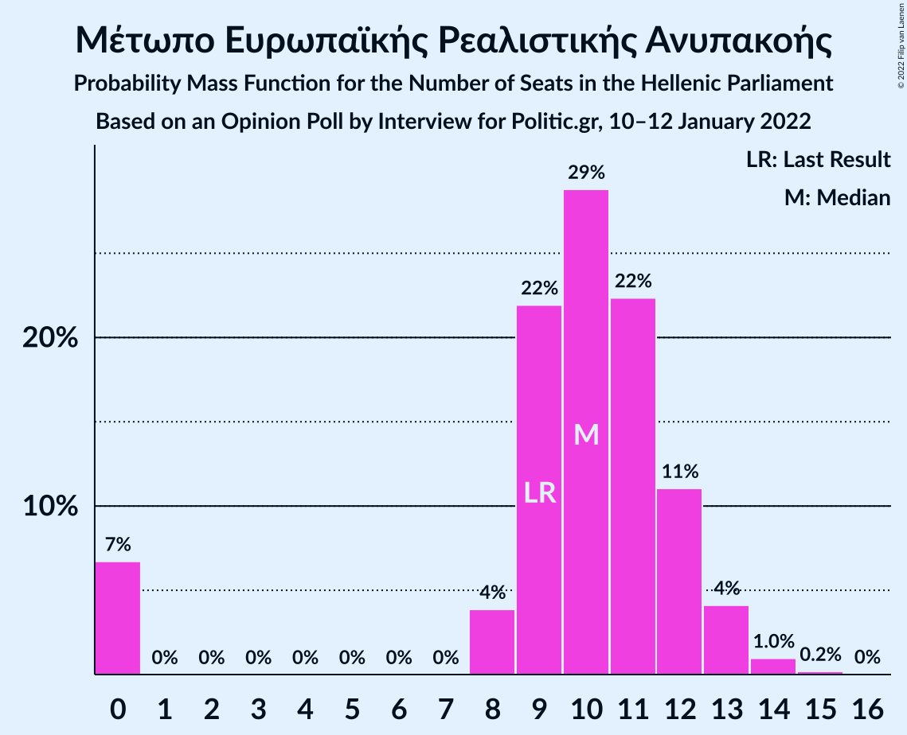

| Number of Seats | Probability | Accumulated | Special Marks |
|:---------------:|:-----------:|:-----------:|:-------------:|
| 0 | 7% | 100% |  |
| 1 | 0% | 93% |  |
| 2 | 0% | 93% |  |
| 3 | 0% | 93% |  |
| 4 | 0% | 93% |  |
| 5 | 0% | 93% |  |
| 6 | 0% | 93% |  |
| 7 | 0% | 93% |  |
| 8 | 4% | 93% |  |
| 9 | 22% | 89% | Last Result |
| 10 | 29% | 67% | Median |
| 11 | 22% | 39% |  |
| 12 | 11% | 16% |  |
| 13 | 4% | 5% |  |
| 14 | 1.0% | 1.2% |  |
| 15 | 0.2% | 0.2% |  |
| 16 | 0% | 0% |  |

## Coalitions

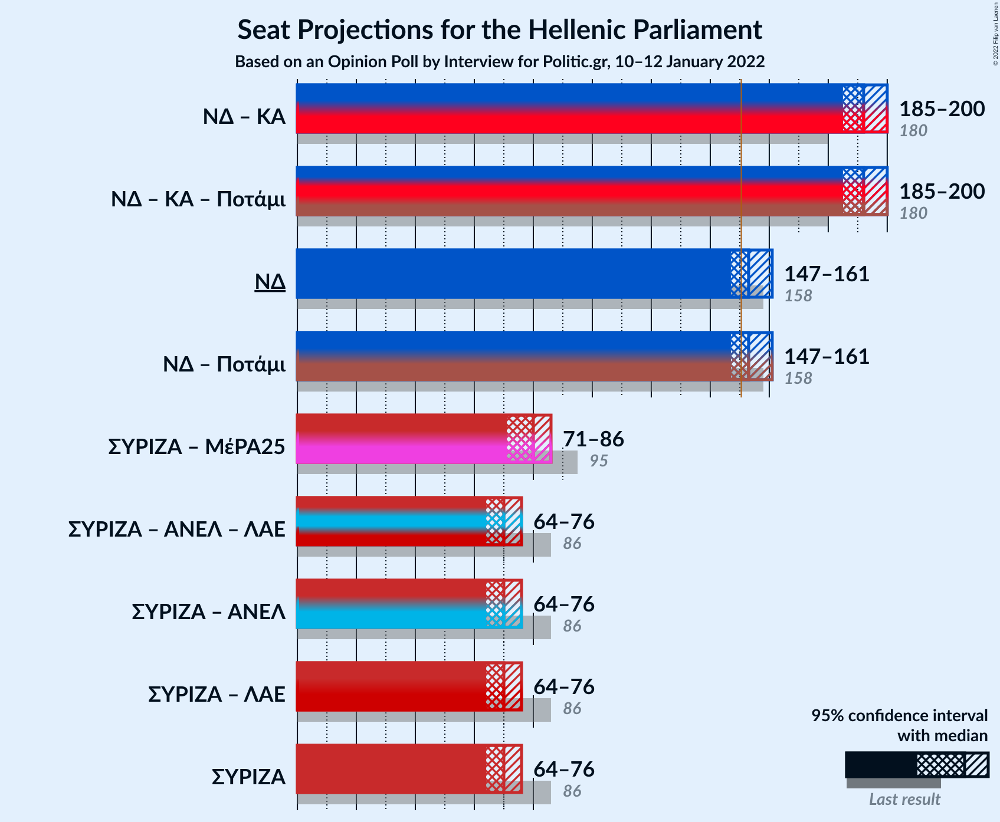

### Confidence Intervals

| Coalition | Last Result | Median | Majority? | 80% Confidence Interval | 90% Confidence Interval | 95% Confidence Interval | 99% Confidence Interval |
|:---------:|:-----------:|:------:|:---------:|:-----------------------:|:-----------------------:|:-----------------------:|:-----------------------:|
| Νέα Δημοκρατία – Κίνημα Αλλαγής | 180 | 192 | 100% | 187–197 | 186–198 | 185–200 | 183–203 |
| Νέα Δημοκρατία | 158 | 153 | 80% | 149–158 | 148–160 | 147–161 | 145–163 |
| Συνασπισμός Ριζοσπαστικής Αριστεράς – Μέτωπο Ευρωπαϊκής Ρεαλιστικής Ανυπακοής | 95 | 80 | 0% | 75–84 | 73–85 | 71–86 | 68–88 |
| Συνασπισμός Ριζοσπαστικής Αριστεράς | 86 | 70 | 0% | 66–74 | 65–75 | 64–76 | 62–78 |

### Νέα Δημοκρατία – Κίνημα Αλλαγής

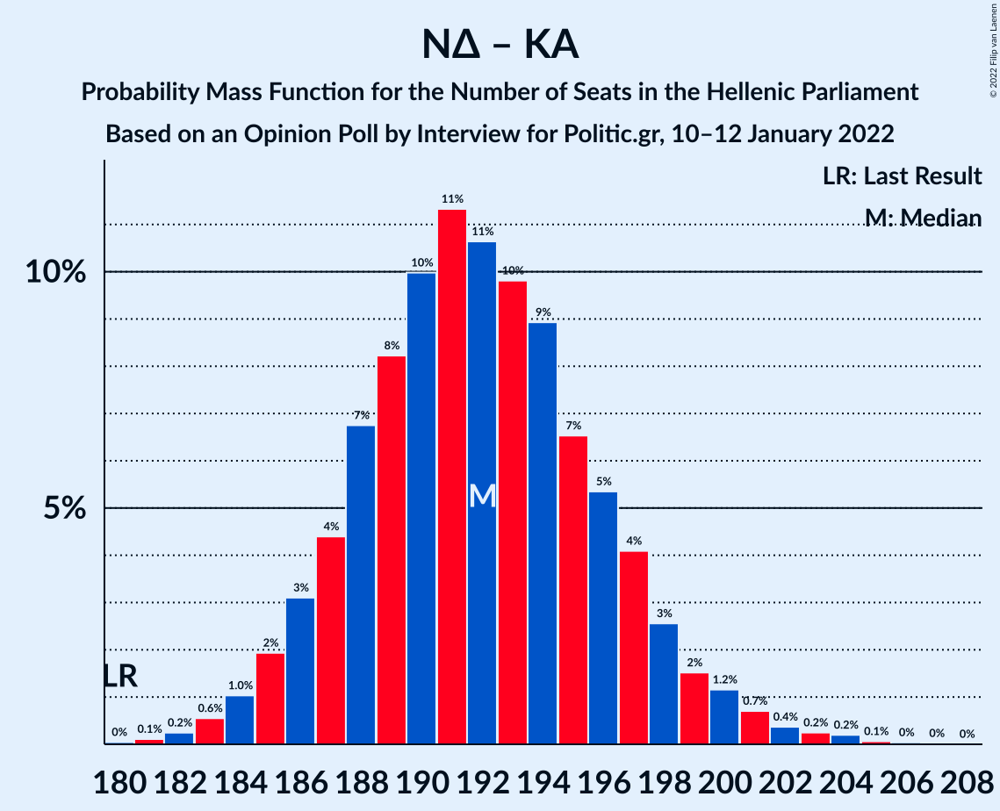

| Number of Seats | Probability | Accumulated | Special Marks |
|:---------------:|:-----------:|:-----------:|:-------------:|
| 180 | 0% | 100% | Last Result |
| 181 | 0.1% | 99.9% |  |
| 182 | 0.2% | 99.8% |  |
| 183 | 0.6% | 99.6% |  |
| 184 | 1.0% | 99.0% |  |
| 185 | 2% | 98% |  |
| 186 | 3% | 96% |  |
| 187 | 4% | 93% |  |
| 188 | 7% | 89% |  |
| 189 | 8% | 82% |  |
| 190 | 10% | 74% |  |
| 191 | 11% | 64% | Median |
| 192 | 11% | 52% |  |
| 193 | 10% | 42% |  |
| 194 | 9% | 32% |  |
| 195 | 7% | 23% |  |
| 196 | 5% | 16% |  |
| 197 | 4% | 11% |  |
| 198 | 3% | 7% |  |
| 199 | 2% | 4% |  |
| 200 | 1.2% | 3% |  |
| 201 | 0.7% | 2% |  |
| 202 | 0.4% | 1.0% |  |
| 203 | 0.2% | 0.6% |  |
| 204 | 0.2% | 0.3% |  |
| 205 | 0.1% | 0.1% |  |
| 206 | 0% | 0.1% |  |
| 207 | 0% | 0% |  |

### Νέα Δημοκρατία

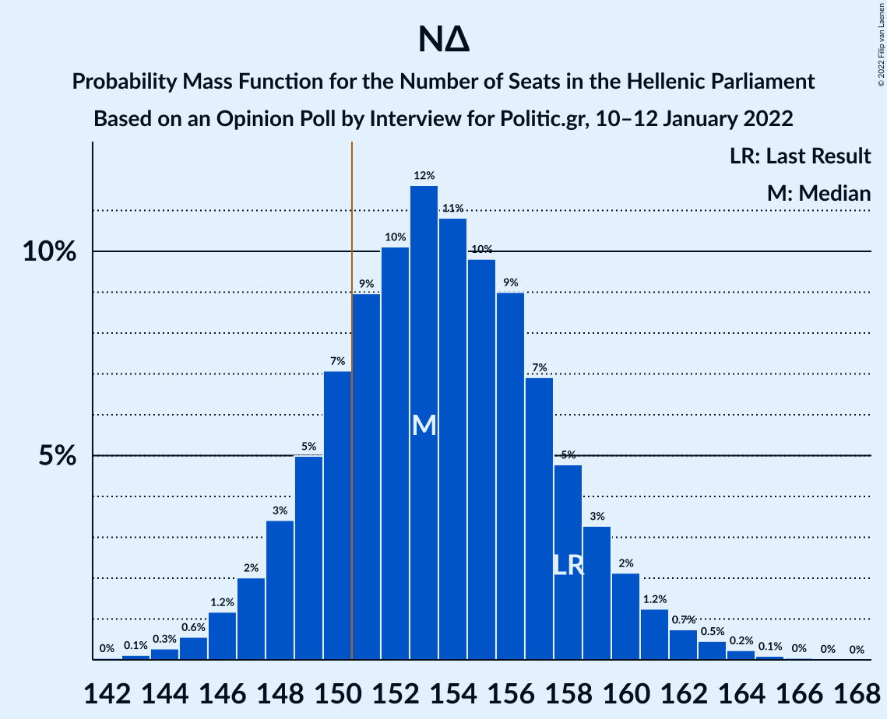

| Number of Seats | Probability | Accumulated | Special Marks |
|:---------------:|:-----------:|:-----------:|:-------------:|
| 142 | 0% | 100% |  |
| 143 | 0.1% | 99.9% |  |
| 144 | 0.3% | 99.8% |  |
| 145 | 0.6% | 99.5% |  |
| 146 | 1.2% | 99.0% |  |
| 147 | 2% | 98% |  |
| 148 | 3% | 96% |  |
| 149 | 5% | 92% |  |
| 150 | 7% | 87% |  |
| 151 | 9% | 80% | Majority |
| 152 | 10% | 71% |  |
| 153 | 12% | 61% | Median |
| 154 | 11% | 50% |  |
| 155 | 10% | 39% |  |
| 156 | 9% | 29% |  |
| 157 | 7% | 20% |  |
| 158 | 5% | 13% | Last Result |
| 159 | 3% | 8% |  |
| 160 | 2% | 5% |  |
| 161 | 1.2% | 3% |  |
| 162 | 0.7% | 2% |  |
| 163 | 0.5% | 0.9% |  |
| 164 | 0.2% | 0.4% |  |
| 165 | 0.1% | 0.2% |  |
| 166 | 0% | 0.1% |  |
| 167 | 0% | 0% |  |

### Συνασπισμός Ριζοσπαστικής Αριστεράς – Μέτωπο Ευρωπαϊκής Ρεαλιστικής Ανυπακοής

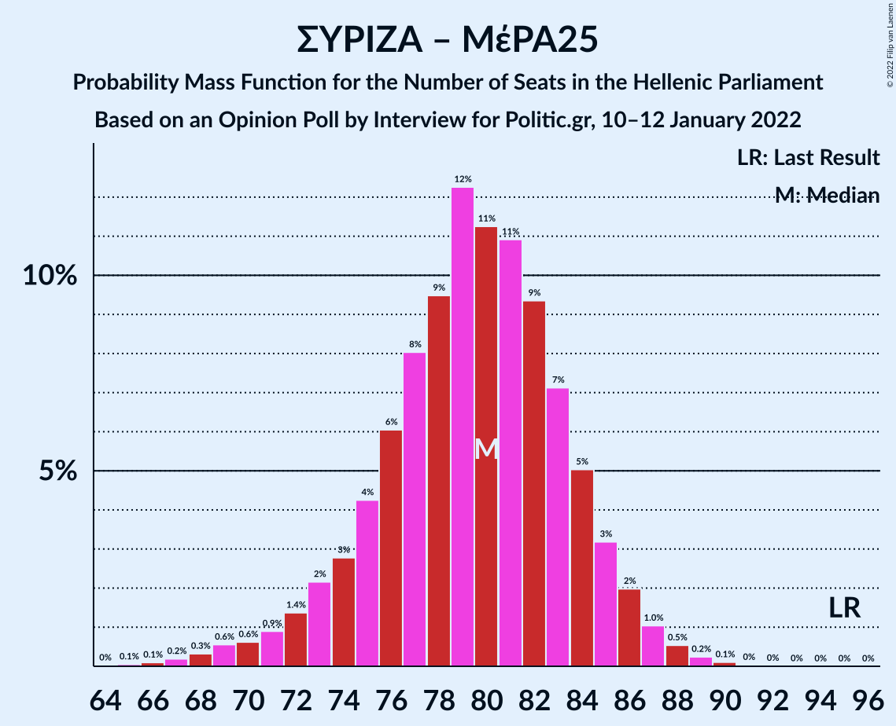

| Number of Seats | Probability | Accumulated | Special Marks |
|:---------------:|:-----------:|:-----------:|:-------------:|
| 65 | 0.1% | 100% |  |
| 66 | 0.1% | 99.9% |  |
| 67 | 0.2% | 99.8% |  |
| 68 | 0.3% | 99.6% |  |
| 69 | 0.6% | 99.3% |  |
| 70 | 0.6% | 98.7% |  |
| 71 | 0.9% | 98% |  |
| 72 | 1.4% | 97% |  |
| 73 | 2% | 96% |  |
| 74 | 3% | 94% |  |
| 75 | 4% | 91% |  |
| 76 | 6% | 87% |  |
| 77 | 8% | 81% |  |
| 78 | 9% | 73% |  |
| 79 | 12% | 63% |  |
| 80 | 11% | 51% | Median |
| 81 | 11% | 40% |  |
| 82 | 9% | 29% |  |
| 83 | 7% | 19% |  |
| 84 | 5% | 12% |  |
| 85 | 3% | 7% |  |
| 86 | 2% | 4% |  |
| 87 | 1.0% | 2% |  |
| 88 | 0.5% | 0.9% |  |
| 89 | 0.2% | 0.4% |  |
| 90 | 0.1% | 0.2% |  |
| 91 | 0% | 0.1% |  |
| 92 | 0% | 0% |  |
| 93 | 0% | 0% |  |
| 94 | 0% | 0% |  |
| 95 | 0% | 0% | Last Result |

### Συνασπισμός Ριζοσπαστικής Αριστεράς

| Number of Seats | Probability | Accumulated | Special Marks |
|:---------------:|:-----------:|:-----------:|:-------------:|
| 60 | 0.1% | 100% |  |
| 61 | 0.2% | 99.9% |  |
| 62 | 0.6% | 99.7% |  |
| 63 | 1.3% | 99.1% |  |
| 64 | 2% | 98% |  |
| 65 | 5% | 95% |  |
| 66 | 6% | 91% |  |
| 67 | 10% | 85% |  |
| 68 | 10% | 76% |  |
| 69 | 13% | 66% |  |
| 70 | 12% | 52% | Median |
| 71 | 11% | 40% |  |
| 72 | 10% | 29% |  |
| 73 | 7% | 19% |  |
| 74 | 5% | 12% |  |
| 75 | 3% | 7% |  |
| 76 | 2% | 4% |  |
| 77 | 1.1% | 2% |  |
| 78 | 0.5% | 0.9% |  |
| 79 | 0.2% | 0.4% |  |
| 80 | 0.1% | 0.2% |  |
| 81 | 0.1% | 0.1% |  |
| 82 | 0% | 0% |  |
| 83 | 0% | 0% |  |
| 84 | 0% | 0% |  |
| 85 | 0% | 0% |  |
| 86 | 0% | 0% | Last Result |

## Technical Information

### Opinion Poll

+ **Polling firm:** Interview
+ **Commissioner(s):** Politic.gr
+ **Fieldwork period:** 10–12 January 2022

### Calculations

+ **Sample size:** 1414
+ **Simulations done:** 1,048,576
+ **Error estimate:** 0.43%

