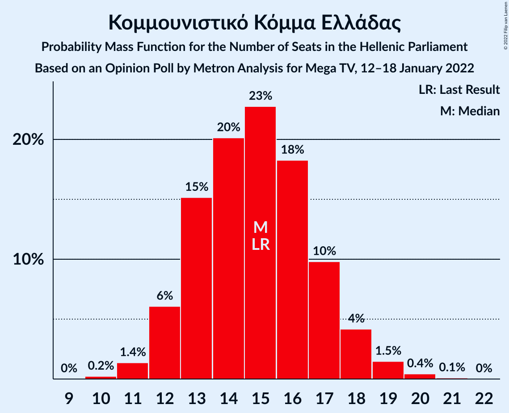
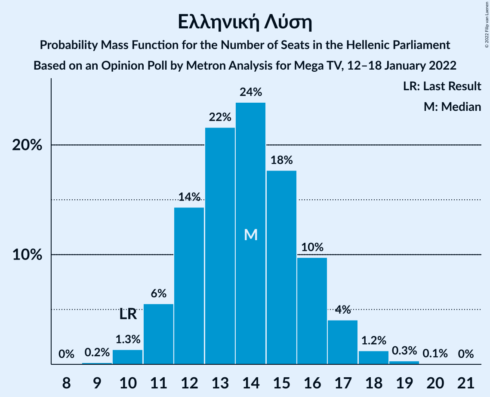

# Opinion Poll by Metron Analysis for Mega TV, 12–18 January 2022

<a href="#voting-intentions">Voting Intentions</a> | <a href="#seats">Seats</a> | <a href="#coalitions">Coalitions</a> | <a href="#technical-information">Technical Information</a>

## Voting Intentions

### Confidence Intervals

| Party | Last Result | Poll Result | 80% Confidence Interval | 90% Confidence Interval | 95% Confidence Interval | 99% Confidence Interval |
|:-----:|:-----------:|:-----------:|:-----------------------:|:-----------------------:|:-----------------------:|:-----------------------:|
| Νέα Δημοκρατία | 39.8% | 36.1% | 34.4–37.8% |33.9–38.3% |33.5–38.7% |32.7–39.6% |
| Συνασπισμός Ριζοσπαστικής Αριστεράς | 31.5% | 24.3% | 22.8–25.8% |22.4–26.3% |22.0–26.7% |21.3–27.5% |
| Κίνημα Αλλαγής | 8.1% | 18.6% | 17.3–20.1% |16.9–20.5% |16.6–20.8% |16.0–21.5% |
| Κομμουνιστικό Κόμμα Ελλάδας | 5.3% | 5.5% | 4.8–6.4% |4.6–6.7% |4.4–6.9% |4.1–7.3% |
| Ελληνική Λύση | 3.7% | 5.1% | 4.4–6.0% |4.2–6.2% |4.1–6.5% |3.7–6.9% |
| Μέτωπο Ευρωπαϊκής Ρεαλιστικής Ανυπακοής | 3.4% | 4.1% | 3.5–4.9% |3.3–5.2% |3.2–5.4% |2.9–5.8% |

*Note:* The poll result column reflects the actual value used in the calculations. Published results may vary slightly, and in addition be rounded to fewer digits.

## Seats

### Confidence Intervals

| Party | Last Result | Median | 80% Confidence Interval | 90% Confidence Interval | 95% Confidence Interval | 99% Confidence Interval |
|:-----:|:-----------:|:------:|:-----------------------:|:-----------------------:|:-----------------------:|:-----------------------:|
| <a href="#νέα-δημοκρατία">Νέα Δημοκρατία</a> | 158 | 146 | 142–151 |140–152 |139–153 |137–155 |
| <a href="#συνασπισμός-ριζοσπαστικής-αριστεράς">Συνασπισμός Ριζοσπαστικής Αριστεράς</a> | 86 | 65 | 61–69 |60–70 |59–71 |57–73 |
| <a href="#κίνημα-αλλαγής">Κίνημα Αλλαγής</a> | 22 | 50 | 46–53 |45–54 |44–55 |43–57 |
| <a href="#κομμουνιστικό-κόμμα-ελλάδας">Κομμουνιστικό Κόμμα Ελλάδας</a> | 15 | 15 | 13–17 |12–18 |12–18 |11–20 |
| <a href="#ελληνική-λύση">Ελληνική Λύση</a> | 10 | 14 | 12–16 |11–17 |11–17 |10–18 |
| <a href="#μέτωπο-ευρωπαϊκής-ρεαλιστικής-ανυπακοής">Μέτωπο Ευρωπαϊκής Ρεαλιστικής Ανυπακοής</a> | 9 | 11 | 9–13 |9–14 |8–14 |0–15 |

### Νέα Δημοκρατία

*For a full overview of the results for this party, see the [Νέα Δημοκρατία](party-νέαδημοκρατία.html) page.*

| Number of Seats | Probability | Accumulated | Special Marks |
|:---------------:|:-----------:|:-----------:|:-------------:|
| 135 | 0.1% | 100% |  |
| 136 | 0.2% | 99.9% |  |
| 137 | 0.4% | 99.7% |  |
| 138 | 0.8% | 99.3% |  |
| 139 | 2% | 98.5% |  |
| 140 | 3% | 97% |  |
| 141 | 4% | 94% |  |
| 142 | 6% | 90% |  |
| 143 | 8% | 84% |  |
| 144 | 9% | 76% |  |
| 145 | 11% | 66% |  |
| 146 | 11% | 55% | Median |
| 147 | 11% | 44% |  |
| 148 | 10% | 33% |  |
| 149 | 8% | 24% |  |
| 150 | 6% | 16% |  |
| 151 | 4% | 10% | Majority |
| 152 | 3% | 6% |  |
| 153 | 2% | 3% |  |
| 154 | 0.9% | 2% |  |
| 155 | 0.4% | 0.8% |  |
| 156 | 0.2% | 0.4% |  |
| 157 | 0.1% | 0.2% |  |
| 158 | 0% | 0.1% | Last Result |
| 159 | 0% | 0% |  |

### Συνασπισμός Ριζοσπαστικής Αριστεράς

*For a full overview of the results for this party, see the [Συνασπισμός Ριζοσπαστικής Αριστεράς](party-συνασπισμόςριζοσπαστικήςαριστεράς.html) page.*

| Number of Seats | Probability | Accumulated | Special Marks |
|:---------------:|:-----------:|:-----------:|:-------------:|
| 55 | 0.1% | 100% |  |
| 56 | 0.2% | 99.9% |  |
| 57 | 0.6% | 99.6% |  |
| 58 | 1.3% | 99.1% |  |
| 59 | 3% | 98% |  |
| 60 | 5% | 95% |  |
| 61 | 6% | 91% |  |
| 62 | 9% | 84% |  |
| 63 | 12% | 75% |  |
| 64 | 12% | 63% |  |
| 65 | 12% | 51% | Median |
| 66 | 12% | 39% |  |
| 67 | 10% | 27% |  |
| 68 | 6% | 17% |  |
| 69 | 5% | 11% |  |
| 70 | 3% | 7% |  |
| 71 | 2% | 3% |  |
| 72 | 0.8% | 2% |  |
| 73 | 0.4% | 0.8% |  |
| 74 | 0.2% | 0.3% |  |
| 75 | 0.1% | 0.1% |  |
| 76 | 0% | 0% |  |
| 77 | 0% | 0% |  |
| 78 | 0% | 0% |  |
| 79 | 0% | 0% |  |
| 80 | 0% | 0% |  |
| 81 | 0% | 0% |  |
| 82 | 0% | 0% |  |
| 83 | 0% | 0% |  |
| 84 | 0% | 0% |  |
| 85 | 0% | 0% |  |
| 86 | 0% | 0% | Last Result |

### Κίνημα Αλλαγής

*For a full overview of the results for this party, see the [Κίνημα Αλλαγής](party-κίνημααλλαγής.html) page.*

| Number of Seats | Probability | Accumulated | Special Marks |
|:---------------:|:-----------:|:-----------:|:-------------:|
| 22 | 0% | 100% | Last Result |
| 23 | 0% | 100% |  |
| 24 | 0% | 100% |  |
| 25 | 0% | 100% |  |
| 26 | 0% | 100% |  |
| 27 | 0% | 100% |  |
| 28 | 0% | 100% |  |
| 29 | 0% | 100% |  |
| 30 | 0% | 100% |  |
| 31 | 0% | 100% |  |
| 32 | 0% | 100% |  |
| 33 | 0% | 100% |  |
| 34 | 0% | 100% |  |
| 35 | 0% | 100% |  |
| 36 | 0% | 100% |  |
| 37 | 0% | 100% |  |
| 38 | 0% | 100% |  |
| 39 | 0% | 100% |  |
| 40 | 0% | 100% |  |
| 41 | 0.1% | 100% |  |
| 42 | 0.3% | 99.8% |  |
| 43 | 0.8% | 99.5% |  |
| 44 | 2% | 98.7% |  |
| 45 | 4% | 96% |  |
| 46 | 6% | 92% |  |
| 47 | 9% | 87% |  |
| 48 | 13% | 78% |  |
| 49 | 14% | 64% |  |
| 50 | 12% | 50% | Median |
| 51 | 12% | 38% |  |
| 52 | 11% | 26% |  |
| 53 | 7% | 15% |  |
| 54 | 4% | 9% |  |
| 55 | 2% | 5% |  |
| 56 | 1.4% | 2% |  |
| 57 | 0.6% | 0.9% |  |
| 58 | 0.2% | 0.4% |  |
| 59 | 0.1% | 0.2% |  |
| 60 | 0% | 0.1% |  |
| 61 | 0% | 0% |  |

### Κομμουνιστικό Κόμμα Ελλάδας

*For a full overview of the results for this party, see the [Κομμουνιστικό Κόμμα Ελλάδας](party-κομμουνιστικόκόμμαελλάδας.html) page.*

| Number of Seats | Probability | Accumulated | Special Marks |
|:---------------:|:-----------:|:-----------:|:-------------:|
| 10 | 0.2% | 100% |  |
| 11 | 1.4% | 99.8% |  |
| 12 | 6% | 98% |  |
| 13 | 15% | 92% |  |
| 14 | 20% | 77% |  |
| 15 | 23% | 57% | Last Result, Median |
| 16 | 18% | 34% |  |
| 17 | 10% | 16% |  |
| 18 | 4% | 6% |  |
| 19 | 1.5% | 2% |  |
| 20 | 0.4% | 0.5% |  |
| 21 | 0.1% | 0.1% |  |
| 22 | 0% | 0% |  |

### Ελληνική Λύση

*For a full overview of the results for this party, see the [Ελληνική Λύση](party-ελληνικήλύση.html) page.*

| Number of Seats | Probability | Accumulated | Special Marks |
|:---------------:|:-----------:|:-----------:|:-------------:|
| 9 | 0.2% | 100% |  |
| 10 | 1.3% | 99.8% | Last Result |
| 11 | 6% | 98% |  |
| 12 | 14% | 93% |  |
| 13 | 22% | 79% |  |
| 14 | 24% | 57% | Median |
| 15 | 18% | 33% |  |
| 16 | 10% | 15% |  |
| 17 | 4% | 6% |  |
| 18 | 1.2% | 2% |  |
| 19 | 0.3% | 0.4% |  |
| 20 | 0.1% | 0.1% |  |
| 21 | 0% | 0% |  |

### Μέτωπο Ευρωπαϊκής Ρεαλιστικής Ανυπακοής

*For a full overview of the results for this party, see the [Μέτωπο Ευρωπαϊκής Ρεαλιστικής Ανυπακοής](party-μέτωποευρωπαϊκήςρεαλιστικήςανυπακοής.html) page.*

| Number of Seats | Probability | Accumulated | Special Marks |
|:---------------:|:-----------:|:-----------:|:-------------:|
| 0 | 1.3% | 100% |  |
| 1 | 0% | 98.7% |  |
| 2 | 0% | 98.7% |  |
| 3 | 0% | 98.7% |  |
| 4 | 0% | 98.7% |  |
| 5 | 0% | 98.7% |  |
| 6 | 0% | 98.7% |  |
| 7 | 0% | 98.7% |  |
| 8 | 1.3% | 98.7% |  |
| 9 | 11% | 97% | Last Result |
| 10 | 18% | 86% |  |
| 11 | 30% | 68% | Median |
| 12 | 19% | 38% |  |
| 13 | 13% | 19% |  |
| 14 | 5% | 7% |  |
| 15 | 1.1% | 2% |  |
| 16 | 0.4% | 0.4% |  |
| 17 | 0.1% | 0.1% |  |
| 18 | 0% | 0% |  |

## Coalitions

### Confidence Intervals

| Coalition | Last Result | Median | Majority? | 80% Confidence Interval | 90% Confidence Interval | 95% Confidence Interval | 99% Confidence Interval |
|:---------:|:-----------:|:------:|:---------:|:-----------------------:|:-----------------------:|:-----------------------:|:-----------------------:|
| Νέα Δημοκρατία – Κίνημα Αλλαγής | 180 | 196 | 100% | 191–200 | 190–201 | 188–203 | 186–205 |
| Νέα Δημοκρατία | 158 | 146 | 10% | 142–151 | 140–152 | 139–153 | 137–155 |
| Συνασπισμός Ριζοσπαστικής Αριστεράς – Μέτωπο Ευρωπαϊκής Ρεαλιστικής Ανυπακοής | 95 | 76 | 0% | 71–80 | 70–81 | 69–82 | 66–84 |
| Συνασπισμός Ριζοσπαστικής Αριστεράς | 86 | 65 | 0% | 61–69 | 60–70 | 59–71 | 57–73 |

### Νέα Δημοκρατία – Κίνημα Αλλαγής

| Number of Seats | Probability | Accumulated | Special Marks |
|:---------------:|:-----------:|:-----------:|:-------------:|
| 180 | 0% | 100% | Last Result |
| 181 | 0% | 100% |  |
| 182 | 0% | 100% |  |
| 183 | 0% | 100% |  |
| 184 | 0% | 100% |  |
| 185 | 0.2% | 99.9% |  |
| 186 | 0.3% | 99.7% |  |
| 187 | 0.4% | 99.5% |  |
| 188 | 2% | 99.1% |  |
| 189 | 2% | 97% |  |
| 190 | 2% | 95% |  |
| 191 | 5% | 93% |  |
| 192 | 8% | 88% |  |
| 193 | 7% | 80% |  |
| 194 | 12% | 73% |  |
| 195 | 11% | 61% |  |
| 196 | 8% | 50% | Median |
| 197 | 12% | 42% |  |
| 198 | 10% | 30% |  |
| 199 | 5% | 20% |  |
| 200 | 6% | 15% |  |
| 201 | 4% | 9% |  |
| 202 | 2% | 5% |  |
| 203 | 1.4% | 3% |  |
| 204 | 0.9% | 2% |  |
| 205 | 0.3% | 0.8% |  |
| 206 | 0.2% | 0.5% |  |
| 207 | 0.1% | 0.2% |  |
| 208 | 0.1% | 0.1% |  |
| 209 | 0% | 0.1% |  |
| 210 | 0% | 0% |  |

### Νέα Δημοκρατία

| Number of Seats | Probability | Accumulated | Special Marks |
|:---------------:|:-----------:|:-----------:|:-------------:|
| 135 | 0.1% | 100% |  |
| 136 | 0.2% | 99.9% |  |
| 137 | 0.4% | 99.7% |  |
| 138 | 0.8% | 99.3% |  |
| 139 | 2% | 98.5% |  |
| 140 | 3% | 97% |  |
| 141 | 4% | 94% |  |
| 142 | 6% | 90% |  |
| 143 | 8% | 84% |  |
| 144 | 9% | 76% |  |
| 145 | 11% | 66% |  |
| 146 | 11% | 55% | Median |
| 147 | 11% | 44% |  |
| 148 | 10% | 33% |  |
| 149 | 8% | 24% |  |
| 150 | 6% | 16% |  |
| 151 | 4% | 10% | Majority |
| 152 | 3% | 6% |  |
| 153 | 2% | 3% |  |
| 154 | 0.9% | 2% |  |
| 155 | 0.4% | 0.8% |  |
| 156 | 0.2% | 0.4% |  |
| 157 | 0.1% | 0.2% |  |
| 158 | 0% | 0.1% | Last Result |
| 159 | 0% | 0% |  |

### Συνασπισμός Ριζοσπαστικής Αριστεράς – Μέτωπο Ευρωπαϊκής Ρεαλιστικής Ανυπακοής

| Number of Seats | Probability | Accumulated | Special Marks |
|:---------------:|:-----------:|:-----------:|:-------------:|
| 62 | 0% | 100% |  |
| 63 | 0% | 99.9% |  |
| 64 | 0.1% | 99.9% |  |
| 65 | 0.2% | 99.8% |  |
| 66 | 0.3% | 99.6% |  |
| 67 | 0.5% | 99.3% |  |
| 68 | 0.8% | 98.9% |  |
| 69 | 1.4% | 98% |  |
| 70 | 3% | 97% |  |
| 71 | 4% | 94% |  |
| 72 | 6% | 90% |  |
| 73 | 9% | 83% |  |
| 74 | 11% | 75% |  |
| 75 | 12% | 64% |  |
| 76 | 11% | 52% | Median |
| 77 | 11% | 41% |  |
| 78 | 10% | 30% |  |
| 79 | 7% | 20% |  |
| 80 | 5% | 13% |  |
| 81 | 3% | 8% |  |
| 82 | 2% | 5% |  |
| 83 | 1.2% | 2% |  |
| 84 | 0.5% | 1.0% |  |
| 85 | 0.3% | 0.5% |  |
| 86 | 0.1% | 0.2% |  |
| 87 | 0.1% | 0.1% |  |
| 88 | 0% | 0% |  |
| 89 | 0% | 0% |  |
| 90 | 0% | 0% |  |
| 91 | 0% | 0% |  |
| 92 | 0% | 0% |  |
| 93 | 0% | 0% |  |
| 94 | 0% | 0% |  |
| 95 | 0% | 0% | Last Result |

### Συνασπισμός Ριζοσπαστικής Αριστεράς

| Number of Seats | Probability | Accumulated | Special Marks |
|:---------------:|:-----------:|:-----------:|:-------------:|
| 55 | 0.1% | 100% |  |
| 56 | 0.2% | 99.9% |  |
| 57 | 0.6% | 99.6% |  |
| 58 | 1.3% | 99.1% |  |
| 59 | 3% | 98% |  |
| 60 | 5% | 95% |  |
| 61 | 6% | 91% |  |
| 62 | 9% | 84% |  |
| 63 | 12% | 75% |  |
| 64 | 12% | 63% |  |
| 65 | 12% | 51% | Median |
| 66 | 12% | 39% |  |
| 67 | 10% | 27% |  |
| 68 | 6% | 17% |  |
| 69 | 5% | 11% |  |
| 70 | 3% | 7% |  |
| 71 | 2% | 3% |  |
| 72 | 0.8% | 2% |  |
| 73 | 0.4% | 0.8% |  |
| 74 | 0.2% | 0.3% |  |
| 75 | 0.1% | 0.1% |  |
| 76 | 0% | 0% |  |
| 77 | 0% | 0% |  |
| 78 | 0% | 0% |  |
| 79 | 0% | 0% |  |
| 80 | 0% | 0% |  |
| 81 | 0% | 0% |  |
| 82 | 0% | 0% |  |
| 83 | 0% | 0% |  |
| 84 | 0% | 0% |  |
| 85 | 0% | 0% |  |
| 86 | 0% | 0% | Last Result |

## Technical Information

### Opinion Poll

+ **Polling firm:** Metron Analysis
+ **Commissioner(s):** Mega TV
+ **Fieldwork period:** 12–18 January 2022

### Calculations

+ **Sample size:** 1306
+ **Simulations done:** 1,048,576
+ **Error estimate:** 1.11%

