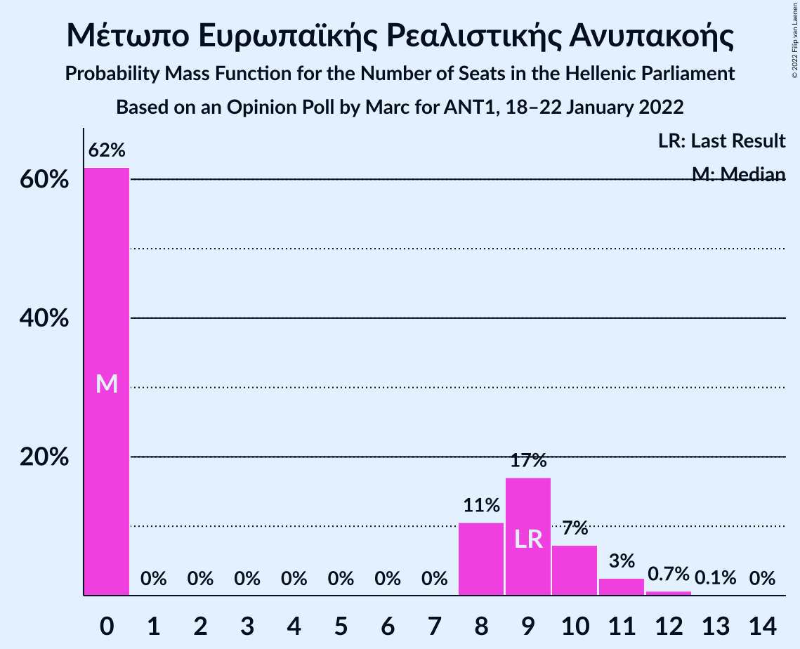
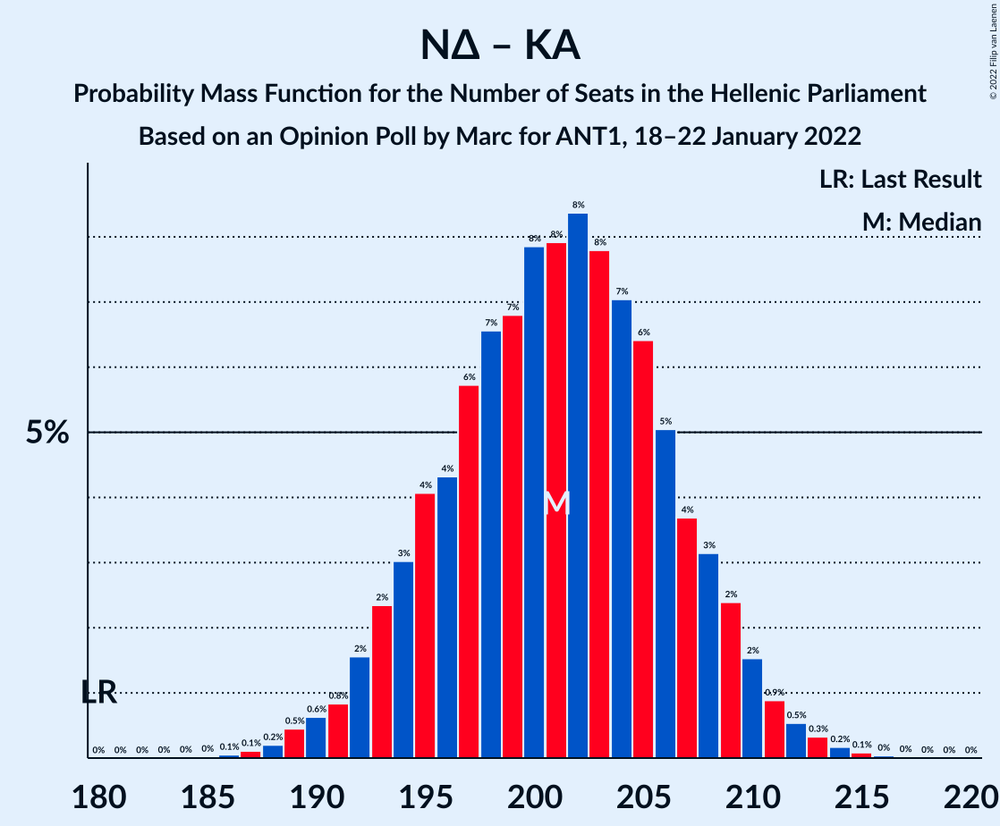

# Opinion Poll by Marc for ANT1, 18–22 January 2022

<a href="#voting-intentions">Voting Intentions</a> | <a href="#seats">Seats</a> | <a href="#coalitions">Coalitions</a> | <a href="#technical-information">Technical Information</a>

## Voting Intentions

### Confidence Intervals

| Party | Last Result | Poll Result | 80% Confidence Interval | 90% Confidence Interval | 95% Confidence Interval | 99% Confidence Interval |
|:-----:|:-----------:|:-----------:|:-----------------------:|:-----------------------:|:-----------------------:|:-----------------------:|
| Νέα Δημοκρατία | 39.8% | 38.2% | 36.3–40.2% |35.7–40.8% |35.3–41.3% |34.3–42.2% |
| Συνασπισμός Ριζοσπαστικής Αριστεράς | 31.5% | 23.7% | 22.0–25.4% |21.5–25.9% |21.1–26.4% |20.3–27.3% |
| Κίνημα Αλλαγής | 8.1% | 17.4% | 15.9–19.0% |15.5–19.4% |15.1–19.8% |14.5–20.6% |
| Κομμουνιστικό Κόμμα Ελλάδας | 5.3% | 5.9% | 5.0–7.0% |4.8–7.3% |4.6–7.5% |4.2–8.1% |
| Ελληνική Λύση | 3.7% | 5.4% | 4.6–6.4% |4.3–6.7% |4.1–7.0% |3.8–7.5% |
| Μέτωπο Ευρωπαϊκής Ρεαλιστικής Ανυπακοής | 3.4% | 2.8% | 2.2–3.6% |2.1–3.8% |1.9–4.0% |1.7–4.4% |

*Note:* The poll result column reflects the actual value used in the calculations. Published results may vary slightly, and in addition be rounded to fewer digits.

## Seats

### Confidence Intervals

| Party | Last Result | Median | 80% Confidence Interval | 90% Confidence Interval | 95% Confidence Interval | 99% Confidence Interval |
|:-----:|:-----------:|:------:|:-----------------------:|:-----------------------:|:-----------------------:|:-----------------------:|
| <a href="#νέα-δημοκρατία">Νέα Δημοκρατία</a> | 158 | 154 | 148–160 |146–161 |145–162 |142–165 |
| <a href="#συνασπισμός-ριζοσπαστικής-αριστεράς">Συνασπισμός Ριζοσπαστικής Αριστεράς</a> | 86 | 64 | 59–69 |58–71 |57–72 |55–74 |
| <a href="#κίνημα-αλλαγής">Κίνημα Αλλαγής</a> | 22 | 47 | 43–52 |42–53 |41–54 |39–56 |
| <a href="#κομμουνιστικό-κόμμα-ελλάδας">Κομμουνιστικό Κόμμα Ελλάδας</a> | 15 | 16 | 14–19 |13–20 |12–20 |11–22 |
| <a href="#ελληνική-λύση">Ελληνική Λύση</a> | 10 | 15 | 12–17 |12–18 |11–19 |10–20 |
| <a href="#μέτωπο-ευρωπαϊκής-ρεαλιστικής-ανυπακοής">Μέτωπο Ευρωπαϊκής Ρεαλιστικής Ανυπακοής</a> | 9 | 0 | 0–10 |0–10 |0–11 |0–12 |

### Νέα Δημοκρατία

*For a full overview of the results for this party, see the [Νέα Δημοκρατία](party-νέαδημοκρατία.html) page.*

| Number of Seats | Probability | Accumulated | Special Marks |
|:---------------:|:-----------:|:-----------:|:-------------:|
| 140 | 0.1% | 100% |  |
| 141 | 0.1% | 99.9% |  |
| 142 | 0.3% | 99.8% |  |
| 143 | 0.4% | 99.5% |  |
| 144 | 0.8% | 99.0% |  |
| 145 | 1.2% | 98% |  |
| 146 | 2% | 97% |  |
| 147 | 3% | 95% |  |
| 148 | 4% | 92% |  |
| 149 | 5% | 88% |  |
| 150 | 6% | 83% |  |
| 151 | 7% | 77% | Majority |
| 152 | 8% | 70% |  |
| 153 | 9% | 61% |  |
| 154 | 9% | 53% | Median |
| 155 | 8% | 43% |  |
| 156 | 8% | 35% |  |
| 157 | 7% | 27% |  |
| 158 | 6% | 20% | Last Result |
| 159 | 4% | 14% |  |
| 160 | 4% | 10% |  |
| 161 | 2% | 6% |  |
| 162 | 2% | 4% |  |
| 163 | 1.0% | 2% |  |
| 164 | 0.7% | 1.4% |  |
| 165 | 0.4% | 0.8% |  |
| 166 | 0.2% | 0.4% |  |
| 167 | 0.1% | 0.2% |  |
| 168 | 0% | 0.1% |  |
| 169 | 0% | 0% |  |

### Συνασπισμός Ριζοσπαστικής Αριστεράς

*For a full overview of the results for this party, see the [Συνασπισμός Ριζοσπαστικής Αριστεράς](party-συνασπισμόςριζοσπαστικήςαριστεράς.html) page.*

| Number of Seats | Probability | Accumulated | Special Marks |
|:---------------:|:-----------:|:-----------:|:-------------:|
| 53 | 0.1% | 100% |  |
| 54 | 0.2% | 99.9% |  |
| 55 | 0.5% | 99.6% |  |
| 56 | 0.8% | 99.2% |  |
| 57 | 2% | 98% |  |
| 58 | 3% | 97% |  |
| 59 | 4% | 94% |  |
| 60 | 5% | 90% |  |
| 61 | 7% | 85% |  |
| 62 | 9% | 78% |  |
| 63 | 10% | 68% |  |
| 64 | 10% | 59% | Median |
| 65 | 9% | 49% |  |
| 66 | 11% | 39% |  |
| 67 | 9% | 29% |  |
| 68 | 6% | 20% |  |
| 69 | 4% | 13% |  |
| 70 | 4% | 9% |  |
| 71 | 2% | 5% |  |
| 72 | 1.3% | 3% |  |
| 73 | 0.7% | 2% |  |
| 74 | 0.4% | 0.9% |  |
| 75 | 0.2% | 0.4% |  |
| 76 | 0.1% | 0.2% |  |
| 77 | 0% | 0.1% |  |
| 78 | 0% | 0% |  |
| 79 | 0% | 0% |  |
| 80 | 0% | 0% |  |
| 81 | 0% | 0% |  |
| 82 | 0% | 0% |  |
| 83 | 0% | 0% |  |
| 84 | 0% | 0% |  |
| 85 | 0% | 0% |  |
| 86 | 0% | 0% | Last Result |

### Κίνημα Αλλαγής

*For a full overview of the results for this party, see the [Κίνημα Αλλαγής](party-κίνημααλλαγής.html) page.*

| Number of Seats | Probability | Accumulated | Special Marks |
|:---------------:|:-----------:|:-----------:|:-------------:|
| 22 | 0% | 100% | Last Result |
| 23 | 0% | 100% |  |
| 24 | 0% | 100% |  |
| 25 | 0% | 100% |  |
| 26 | 0% | 100% |  |
| 27 | 0% | 100% |  |
| 28 | 0% | 100% |  |
| 29 | 0% | 100% |  |
| 30 | 0% | 100% |  |
| 31 | 0% | 100% |  |
| 32 | 0% | 100% |  |
| 33 | 0% | 100% |  |
| 34 | 0% | 100% |  |
| 35 | 0% | 100% |  |
| 36 | 0% | 100% |  |
| 37 | 0.1% | 100% |  |
| 38 | 0.2% | 99.9% |  |
| 39 | 0.5% | 99.7% |  |
| 40 | 0.8% | 99.2% |  |
| 41 | 2% | 98% |  |
| 42 | 3% | 96% |  |
| 43 | 5% | 93% |  |
| 44 | 9% | 88% |  |
| 45 | 10% | 79% |  |
| 46 | 10% | 69% |  |
| 47 | 13% | 59% | Median |
| 48 | 10% | 46% |  |
| 49 | 10% | 36% |  |
| 50 | 10% | 26% |  |
| 51 | 5% | 16% |  |
| 52 | 4% | 10% |  |
| 53 | 3% | 6% |  |
| 54 | 1.4% | 3% |  |
| 55 | 1.0% | 2% |  |
| 56 | 0.5% | 0.9% |  |
| 57 | 0.2% | 0.3% |  |
| 58 | 0.1% | 0.2% |  |
| 59 | 0% | 0.1% |  |
| 60 | 0% | 0% |  |

### Κομμουνιστικό Κόμμα Ελλάδας

*For a full overview of the results for this party, see the [Κομμουνιστικό Κόμμα Ελλάδας](party-κομμουνιστικόκόμμαελλάδας.html) page.*

| Number of Seats | Probability | Accumulated | Special Marks |
|:---------------:|:-----------:|:-----------:|:-------------:|
| 10 | 0.1% | 100% |  |
| 11 | 0.5% | 99.9% |  |
| 12 | 2% | 99.4% |  |
| 13 | 6% | 97% |  |
| 14 | 12% | 92% |  |
| 15 | 17% | 80% | Last Result |
| 16 | 18% | 62% | Median |
| 17 | 17% | 44% |  |
| 18 | 14% | 27% |  |
| 19 | 8% | 13% |  |
| 20 | 4% | 6% |  |
| 21 | 2% | 2% |  |
| 22 | 0.6% | 0.9% |  |
| 23 | 0.2% | 0.3% |  |
| 24 | 0% | 0.1% |  |
| 25 | 0% | 0% |  |

### Ελληνική Λύση

*For a full overview of the results for this party, see the [Ελληνική Λύση](party-ελληνικήλύση.html) page.*

| Number of Seats | Probability | Accumulated | Special Marks |
|:---------------:|:-----------:|:-----------:|:-------------:|
| 9 | 0.1% | 100% |  |
| 10 | 0.6% | 99.9% | Last Result |
| 11 | 3% | 99.3% |  |
| 12 | 7% | 96% |  |
| 13 | 14% | 89% |  |
| 14 | 19% | 75% |  |
| 15 | 20% | 56% | Median |
| 16 | 16% | 35% |  |
| 17 | 10% | 19% |  |
| 18 | 5% | 9% |  |
| 19 | 3% | 4% |  |
| 20 | 0.9% | 1.3% |  |
| 21 | 0.3% | 0.4% |  |
| 22 | 0.1% | 0.1% |  |
| 23 | 0% | 0% |  |

### Μέτωπο Ευρωπαϊκής Ρεαλιστικής Ανυπακοής

*For a full overview of the results for this party, see the [Μέτωπο Ευρωπαϊκής Ρεαλιστικής Ανυπακοής](party-μέτωποευρωπαϊκήςρεαλιστικήςανυπακοής.html) page.*

| Number of Seats | Probability | Accumulated | Special Marks |
|:---------------:|:-----------:|:-----------:|:-------------:|
| 0 | 62% | 100% | Median |
| 1 | 0% | 38% |  |
| 2 | 0% | 38% |  |
| 3 | 0% | 38% |  |
| 4 | 0% | 38% |  |
| 5 | 0% | 38% |  |
| 6 | 0% | 38% |  |
| 7 | 0% | 38% |  |
| 8 | 11% | 38% |  |
| 9 | 17% | 28% | Last Result |
| 10 | 7% | 11% |  |
| 11 | 3% | 3% |  |
| 12 | 0.7% | 0.8% |  |
| 13 | 0.1% | 0.2% |  |
| 14 | 0% | 0% |  |

## Coalitions

### Confidence Intervals

| Coalition | Last Result | Median | Majority? | 80% Confidence Interval | 90% Confidence Interval | 95% Confidence Interval | 99% Confidence Interval |
|:---------:|:-----------:|:------:|:---------:|:-----------------------:|:-----------------------:|:-----------------------:|:-----------------------:|
| Νέα Δημοκρατία – Κίνημα Αλλαγής | 180 | 201 | 100% | 195–207 | 193–209 | 192–210 | 189–213 |
| Νέα Δημοκρατία | 158 | 154 | 77% | 148–160 | 146–161 | 145–162 | 142–165 |
| Συνασπισμός Ριζοσπαστικής Αριστεράς – Μέτωπο Ευρωπαϊκής Ρεαλιστικής Ανυπακοής | 95 | 67 | 0% | 62–74 | 60–76 | 59–77 | 57–80 |
| Συνασπισμός Ριζοσπαστικής Αριστεράς | 86 | 64 | 0% | 59–69 | 58–71 | 57–72 | 55–74 |

### Νέα Δημοκρατία – Κίνημα Αλλαγής

| Number of Seats | Probability | Accumulated | Special Marks |
|:---------------:|:-----------:|:-----------:|:-------------:|
| 180 | 0% | 100% | Last Result |
| 181 | 0% | 100% |  |
| 182 | 0% | 100% |  |
| 183 | 0% | 100% |  |
| 184 | 0% | 100% |  |
| 185 | 0% | 100% |  |
| 186 | 0.1% | 100% |  |
| 187 | 0.1% | 99.9% |  |
| 188 | 0.2% | 99.8% |  |
| 189 | 0.5% | 99.6% |  |
| 190 | 0.6% | 99.1% |  |
| 191 | 0.8% | 98.5% |  |
| 192 | 2% | 98% |  |
| 193 | 2% | 96% |  |
| 194 | 3% | 94% |  |
| 195 | 4% | 91% |  |
| 196 | 4% | 87% |  |
| 197 | 6% | 82% |  |
| 198 | 7% | 77% |  |
| 199 | 7% | 70% |  |
| 200 | 8% | 63% |  |
| 201 | 8% | 55% | Median |
| 202 | 8% | 47% |  |
| 203 | 8% | 39% |  |
| 204 | 7% | 31% |  |
| 205 | 6% | 24% |  |
| 206 | 5% | 18% |  |
| 207 | 4% | 13% |  |
| 208 | 3% | 9% |  |
| 209 | 2% | 6% |  |
| 210 | 2% | 4% |  |
| 211 | 0.9% | 2% |  |
| 212 | 0.5% | 1.2% |  |
| 213 | 0.3% | 0.6% |  |
| 214 | 0.2% | 0.3% |  |
| 215 | 0.1% | 0.1% |  |
| 216 | 0% | 0.1% |  |
| 217 | 0% | 0% |  |

### Νέα Δημοκρατία

| Number of Seats | Probability | Accumulated | Special Marks |
|:---------------:|:-----------:|:-----------:|:-------------:|
| 140 | 0.1% | 100% |  |
| 141 | 0.1% | 99.9% |  |
| 142 | 0.3% | 99.8% |  |
| 143 | 0.4% | 99.5% |  |
| 144 | 0.8% | 99.0% |  |
| 145 | 1.2% | 98% |  |
| 146 | 2% | 97% |  |
| 147 | 3% | 95% |  |
| 148 | 4% | 92% |  |
| 149 | 5% | 88% |  |
| 150 | 6% | 83% |  |
| 151 | 7% | 77% | Majority |
| 152 | 8% | 70% |  |
| 153 | 9% | 61% |  |
| 154 | 9% | 53% | Median |
| 155 | 8% | 43% |  |
| 156 | 8% | 35% |  |
| 157 | 7% | 27% |  |
| 158 | 6% | 20% | Last Result |
| 159 | 4% | 14% |  |
| 160 | 4% | 10% |  |
| 161 | 2% | 6% |  |
| 162 | 2% | 4% |  |
| 163 | 1.0% | 2% |  |
| 164 | 0.7% | 1.4% |  |
| 165 | 0.4% | 0.8% |  |
| 166 | 0.2% | 0.4% |  |
| 167 | 0.1% | 0.2% |  |
| 168 | 0% | 0.1% |  |
| 169 | 0% | 0% |  |

### Συνασπισμός Ριζοσπαστικής Αριστεράς – Μέτωπο Ευρωπαϊκής Ρεαλιστικής Ανυπακοής

| Number of Seats | Probability | Accumulated | Special Marks |
|:---------------:|:-----------:|:-----------:|:-------------:|
| 54 | 0.1% | 100% |  |
| 55 | 0.1% | 99.9% |  |
| 56 | 0.2% | 99.8% |  |
| 57 | 0.5% | 99.6% |  |
| 58 | 0.9% | 99.1% |  |
| 59 | 2% | 98% |  |
| 60 | 2% | 97% |  |
| 61 | 3% | 95% |  |
| 62 | 5% | 91% |  |
| 63 | 6% | 87% |  |
| 64 | 7% | 81% | Median |
| 65 | 7% | 74% |  |
| 66 | 9% | 67% |  |
| 67 | 8% | 58% |  |
| 68 | 7% | 50% |  |
| 69 | 7% | 43% |  |
| 70 | 8% | 37% |  |
| 71 | 5% | 29% |  |
| 72 | 5% | 24% |  |
| 73 | 5% | 19% |  |
| 74 | 5% | 14% |  |
| 75 | 3% | 9% |  |
| 76 | 2% | 7% |  |
| 77 | 2% | 4% |  |
| 78 | 1.2% | 2% |  |
| 79 | 0.5% | 1.3% |  |
| 80 | 0.3% | 0.7% |  |
| 81 | 0.2% | 0.4% |  |
| 82 | 0.1% | 0.2% |  |
| 83 | 0% | 0.1% |  |
| 84 | 0% | 0% |  |
| 85 | 0% | 0% |  |
| 86 | 0% | 0% |  |
| 87 | 0% | 0% |  |
| 88 | 0% | 0% |  |
| 89 | 0% | 0% |  |
| 90 | 0% | 0% |  |
| 91 | 0% | 0% |  |
| 92 | 0% | 0% |  |
| 93 | 0% | 0% |  |
| 94 | 0% | 0% |  |
| 95 | 0% | 0% | Last Result |

### Συνασπισμός Ριζοσπαστικής Αριστεράς

| Number of Seats | Probability | Accumulated | Special Marks |
|:---------------:|:-----------:|:-----------:|:-------------:|
| 53 | 0.1% | 100% |  |
| 54 | 0.2% | 99.9% |  |
| 55 | 0.5% | 99.6% |  |
| 56 | 0.8% | 99.2% |  |
| 57 | 2% | 98% |  |
| 58 | 3% | 97% |  |
| 59 | 4% | 94% |  |
| 60 | 5% | 90% |  |
| 61 | 7% | 85% |  |
| 62 | 9% | 78% |  |
| 63 | 10% | 68% |  |
| 64 | 10% | 59% | Median |
| 65 | 9% | 49% |  |
| 66 | 11% | 39% |  |
| 67 | 9% | 29% |  |
| 68 | 6% | 20% |  |
| 69 | 4% | 13% |  |
| 70 | 4% | 9% |  |
| 71 | 2% | 5% |  |
| 72 | 1.3% | 3% |  |
| 73 | 0.7% | 2% |  |
| 74 | 0.4% | 0.9% |  |
| 75 | 0.2% | 0.4% |  |
| 76 | 0.1% | 0.2% |  |
| 77 | 0% | 0.1% |  |
| 78 | 0% | 0% |  |
| 79 | 0% | 0% |  |
| 80 | 0% | 0% |  |
| 81 | 0% | 0% |  |
| 82 | 0% | 0% |  |
| 83 | 0% | 0% |  |
| 84 | 0% | 0% |  |
| 85 | 0% | 0% |  |
| 86 | 0% | 0% | Last Result |

## Technical Information

### Opinion Poll

+ **Polling firm:** Marc
+ **Commissioner(s):** ANT1
+ **Fieldwork period:** 18–22 January 2022

### Calculations

+ **Sample size:** 1002
+ **Simulations done:** 1,048,576
+ **Error estimate:** 0.82%

