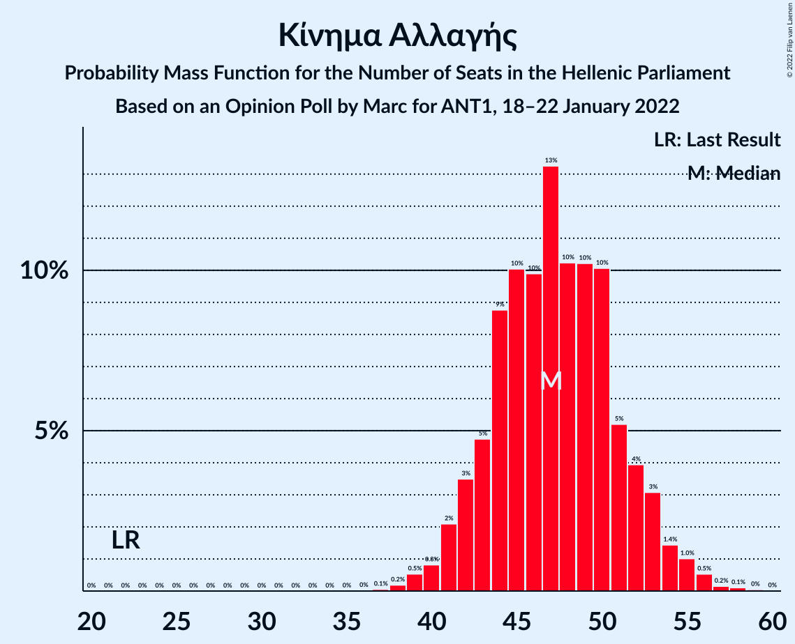
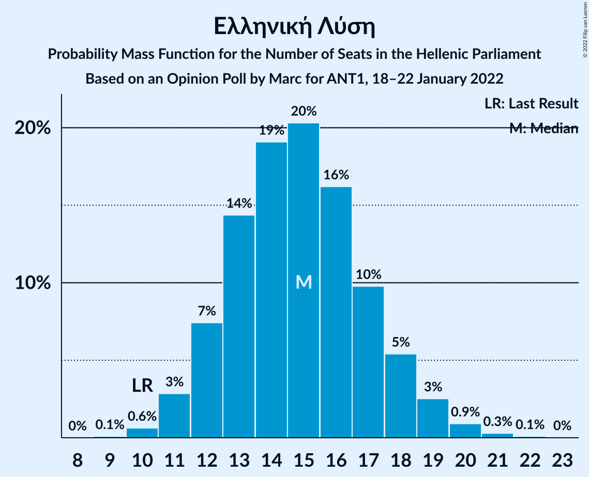
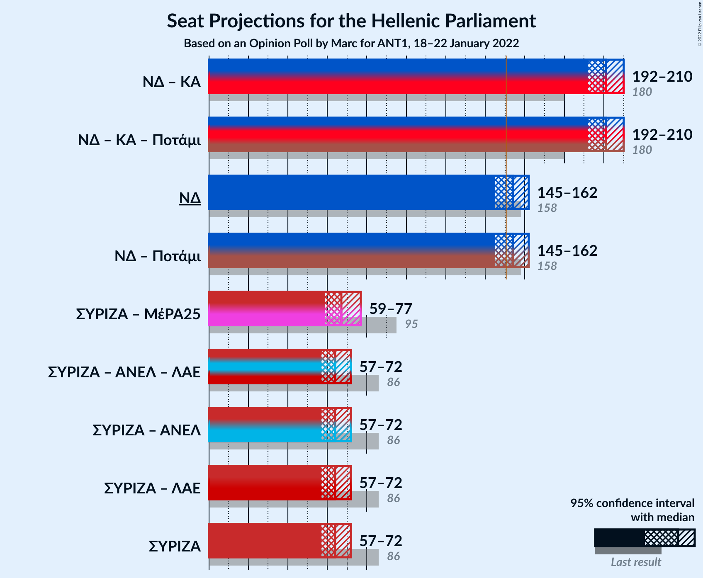
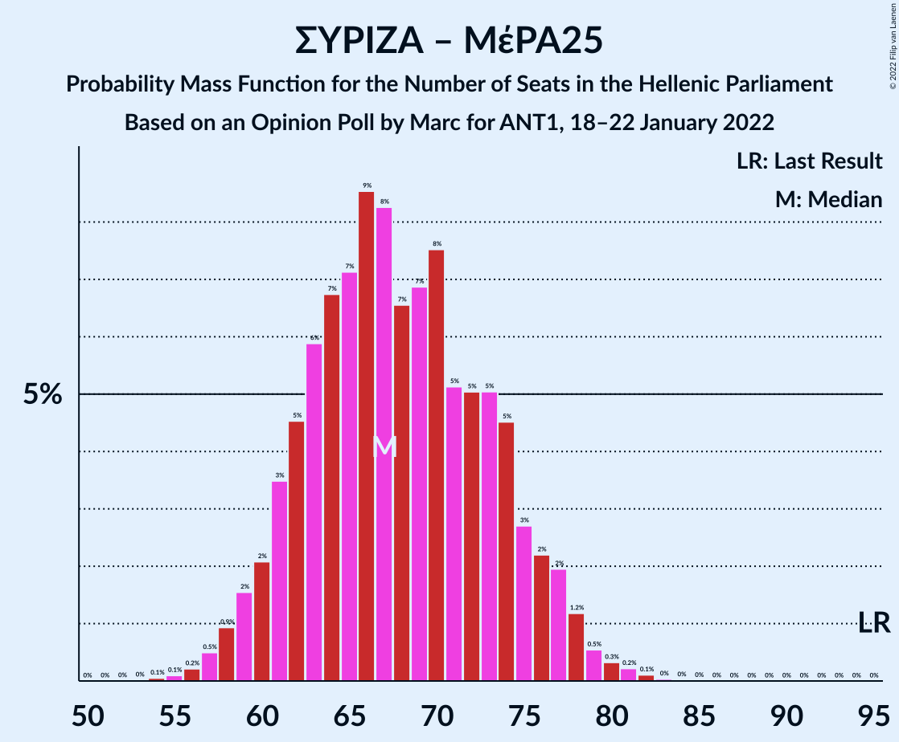

# Opinion Poll by Marc for ANT1, 18–22 January 2022

<a href="#voting-intentions">Voting Intentions</a> | <a href="#seats">Seats</a> | <a href="#coalitions">Coalitions</a> | <a href="#technical-information">Technical Information</a>

## Voting Intentions

### Confidence Intervals

| Party | Last Result | Poll Result | 80% Confidence Interval | 90% Confidence Interval | 95% Confidence Interval | 99% Confidence Interval |
|:-----:|:-----------:|:-----------:|:-----------------------:|:-----------------------:|:-----------------------:|:-----------------------:|
| Νέα Δημοκρατία | 39.8% | 32.6% | 30.8–34.6% |30.3–35.1% |29.8–35.6% |28.9–36.5% |
| Συνασπισμός Ριζοσπαστικής Αριστεράς | 31.5% | 20.2% | 18.6–21.9% |18.2–22.3% |17.8–22.8% |17.1–23.6% |
| Κίνημα Αλλαγής | 8.1% | 14.8% | 13.4–16.3% |13.0–16.7% |12.7–17.1% |12.1–17.9% |
| Κομμουνιστικό Κόμμα Ελλάδας | 5.3% | 5.0% | 4.2–6.0% |4.0–6.3% |3.8–6.5% |3.5–7.0% |
| Ελληνική Λύση | 3.7% | 4.6% | 3.8–5.6% |3.6–5.8% |3.5–6.1% |3.1–6.6% |
| Μέτωπο Ευρωπαϊκής Ρεαλιστικής Ανυπακοής | 3.4% | 2.4% | 1.9–3.1% |1.7–3.4% |1.6–3.6% |1.4–3.9% |

*Note:* The poll result column reflects the actual value used in the calculations. Published results may vary slightly, and in addition be rounded to fewer digits.

## Seats

### Confidence Intervals

| Party | Last Result | Median | 80% Confidence Interval | 90% Confidence Interval | 95% Confidence Interval | 99% Confidence Interval |
|:-----:|:-----------:|:------:|:-----------------------:|:-----------------------:|:-----------------------:|:-----------------------:|
| <a href="#νέα-δημοκρατία">Νέα Δημοκρατία</a> | 158 | 155 | 149–161 |147–162 |146–164 |143–167 |
| <a href="#συνασπισμός-ριζοσπαστικής-αριστεράς">Συνασπισμός Ριζοσπαστικής Αριστεράς</a> | 86 | 65 | 60–70 |58–72 |57–73 |55–75 |
| <a href="#κίνημα-αλλαγής">Κίνημα Αλλαγής</a> | 22 | 48 | 43–52 |42–54 |41–55 |39–57 |
| <a href="#κομμουνιστικό-κόμμα-ελλάδας">Κομμουνιστικό Κόμμα Ελλάδας</a> | 15 | 16 | 13–19 |13–20 |12–21 |11–22 |
| <a href="#ελληνική-λύση">Ελληνική Λύση</a> | 10 | 15 | 12–18 |12–19 |11–19 |10–21 |
| <a href="#μέτωπο-ευρωπαϊκής-ρεαλιστικής-ανυπακοής">Μέτωπο Ευρωπαϊκής Ρεαλιστικής Ανυπακοής</a> | 9 | 0 | 0–10 |0–10 |0–11 |0–12 |

### Νέα Δημοκρατία

*For a full overview of the results for this party, see the [Νέα Δημοκρατία](party-νέαδημοκρατία.html) page.*

| Number of Seats | Probability | Accumulated | Special Marks |
|:---------------:|:-----------:|:-----------:|:-------------:|
| 139 | 0% | 100% |  |
| 140 | 0.1% | 99.9% |  |
| 141 | 0.1% | 99.9% |  |
| 142 | 0.2% | 99.8% |  |
| 143 | 0.4% | 99.5% |  |
| 144 | 0.6% | 99.2% |  |
| 145 | 1.0% | 98.6% |  |
| 146 | 1.4% | 98% |  |
| 147 | 2% | 96% |  |
| 148 | 3% | 94% |  |
| 149 | 4% | 91% |  |
| 150 | 5% | 87% |  |
| 151 | 6% | 82% | Majority |
| 152 | 7% | 76% |  |
| 153 | 9% | 69% |  |
| 154 | 9% | 60% |  |
| 155 | 8% | 51% | Median |
| 156 | 8% | 43% |  |
| 157 | 7% | 35% |  |
| 158 | 6% | 28% | Last Result |
| 159 | 5% | 21% |  |
| 160 | 5% | 16% |  |
| 161 | 3% | 11% |  |
| 162 | 3% | 8% |  |
| 163 | 2% | 5% |  |
| 164 | 1.2% | 3% |  |
| 165 | 0.7% | 2% |  |
| 166 | 0.5% | 1.0% |  |
| 167 | 0.3% | 0.6% |  |
| 168 | 0.2% | 0.3% |  |
| 169 | 0.1% | 0.2% |  |
| 170 | 0% | 0.1% |  |
| 171 | 0% | 0% |  |

### Συνασπισμός Ριζοσπαστικής Αριστεράς

*For a full overview of the results for this party, see the [Συνασπισμός Ριζοσπαστικής Αριστεράς](party-συνασπισμόςριζοσπαστικήςαριστεράς.html) page.*

| Number of Seats | Probability | Accumulated | Special Marks |
|:---------------:|:-----------:|:-----------:|:-------------:|
| 52 | 0% | 100% |  |
| 53 | 0.1% | 99.9% |  |
| 54 | 0.2% | 99.8% |  |
| 55 | 0.6% | 99.6% |  |
| 56 | 0.9% | 99.0% |  |
| 57 | 1.3% | 98% |  |
| 58 | 3% | 97% |  |
| 59 | 2% | 94% |  |
| 60 | 7% | 92% |  |
| 61 | 5% | 85% |  |
| 62 | 8% | 80% |  |
| 63 | 10% | 72% |  |
| 64 | 8% | 62% |  |
| 65 | 13% | 54% | Median |
| 66 | 5% | 41% |  |
| 67 | 11% | 36% |  |
| 68 | 7% | 24% |  |
| 69 | 5% | 18% |  |
| 70 | 5% | 13% |  |
| 71 | 2% | 8% |  |
| 72 | 3% | 6% |  |
| 73 | 0.9% | 3% |  |
| 74 | 0.9% | 2% |  |
| 75 | 0.4% | 0.9% |  |
| 76 | 0.2% | 0.4% |  |
| 77 | 0.2% | 0.3% |  |
| 78 | 0% | 0.1% |  |
| 79 | 0% | 0.1% |  |
| 80 | 0% | 0% |  |
| 81 | 0% | 0% |  |
| 82 | 0% | 0% |  |
| 83 | 0% | 0% |  |
| 84 | 0% | 0% |  |
| 85 | 0% | 0% |  |
| 86 | 0% | 0% | Last Result |

### Κίνημα Αλλαγής

*For a full overview of the results for this party, see the [Κίνημα Αλλαγής](party-κίνημααλλαγής.html) page.*

| Number of Seats | Probability | Accumulated | Special Marks |
|:---------------:|:-----------:|:-----------:|:-------------:|
| 22 | 0% | 100% | Last Result |
| 23 | 0% | 100% |  |
| 24 | 0% | 100% |  |
| 25 | 0% | 100% |  |
| 26 | 0% | 100% |  |
| 27 | 0% | 100% |  |
| 28 | 0% | 100% |  |
| 29 | 0% | 100% |  |
| 30 | 0% | 100% |  |
| 31 | 0% | 100% |  |
| 32 | 0% | 100% |  |
| 33 | 0% | 100% |  |
| 34 | 0% | 100% |  |
| 35 | 0% | 100% |  |
| 36 | 0% | 100% |  |
| 37 | 0.1% | 100% |  |
| 38 | 0.2% | 99.8% |  |
| 39 | 0.6% | 99.6% |  |
| 40 | 1.1% | 99.0% |  |
| 41 | 2% | 98% |  |
| 42 | 4% | 96% |  |
| 43 | 5% | 92% |  |
| 44 | 7% | 87% |  |
| 45 | 10% | 81% |  |
| 46 | 10% | 71% |  |
| 47 | 11% | 61% |  |
| 48 | 11% | 50% | Median |
| 49 | 9% | 39% |  |
| 50 | 9% | 30% |  |
| 51 | 8% | 22% |  |
| 52 | 5% | 14% |  |
| 53 | 4% | 9% |  |
| 54 | 2% | 5% |  |
| 55 | 1.2% | 3% |  |
| 56 | 1.1% | 2% |  |
| 57 | 0.4% | 0.7% |  |
| 58 | 0.2% | 0.4% |  |
| 59 | 0.1% | 0.2% |  |
| 60 | 0% | 0.1% |  |
| 61 | 0% | 0% |  |

### Κομμουνιστικό Κόμμα Ελλάδας

*For a full overview of the results for this party, see the [Κομμουνιστικό Κόμμα Ελλάδας](party-κομμουνιστικόκόμμαελλάδας.html) page.*

| Number of Seats | Probability | Accumulated | Special Marks |
|:---------------:|:-----------:|:-----------:|:-------------:|
| 10 | 0.1% | 100% |  |
| 11 | 0.7% | 99.8% |  |
| 12 | 3% | 99.1% |  |
| 13 | 7% | 96% |  |
| 14 | 11% | 90% |  |
| 15 | 17% | 79% | Last Result |
| 16 | 18% | 62% | Median |
| 17 | 15% | 44% |  |
| 18 | 13% | 29% |  |
| 19 | 8% | 17% |  |
| 20 | 4% | 8% |  |
| 21 | 2% | 4% |  |
| 22 | 0.9% | 1.4% |  |
| 23 | 0.3% | 0.5% |  |
| 24 | 0.1% | 0.2% |  |
| 25 | 0% | 0% |  |

### Ελληνική Λύση

*For a full overview of the results for this party, see the [Ελληνική Λύση](party-ελληνικήλύση.html) page.*

| Number of Seats | Probability | Accumulated | Special Marks |
|:---------------:|:-----------:|:-----------:|:-------------:|
| 0 | 0.2% | 100% |  |
| 1 | 0% | 99.8% |  |
| 2 | 0% | 99.8% |  |
| 3 | 0% | 99.8% |  |
| 4 | 0% | 99.8% |  |
| 5 | 0% | 99.8% |  |
| 6 | 0% | 99.8% |  |
| 7 | 0% | 99.8% |  |
| 8 | 0% | 99.8% |  |
| 9 | 0% | 99.8% |  |
| 10 | 0.8% | 99.7% | Last Result |
| 11 | 3% | 98.9% |  |
| 12 | 7% | 96% |  |
| 13 | 14% | 89% |  |
| 14 | 17% | 75% |  |
| 15 | 18% | 58% | Median |
| 16 | 16% | 40% |  |
| 17 | 11% | 24% |  |
| 18 | 7% | 13% |  |
| 19 | 3% | 6% |  |
| 20 | 2% | 2% |  |
| 21 | 0.6% | 0.9% |  |
| 22 | 0.2% | 0.3% |  |
| 23 | 0.1% | 0.1% |  |
| 24 | 0% | 0% |  |

### Μέτωπο Ευρωπαϊκής Ρεαλιστικής Ανυπακοής

*For a full overview of the results for this party, see the [Μέτωπο Ευρωπαϊκής Ρεαλιστικής Ανυπακοής](party-μέτωποευρωπαϊκήςρεαλιστικήςανυπακοής.html) page.*

| Number of Seats | Probability | Accumulated | Special Marks |
|:---------------:|:-----------:|:-----------:|:-------------:|
| 0 | 85% | 100% | Median |
| 1 | 0% | 15% |  |
| 2 | 0% | 15% |  |
| 3 | 0% | 15% |  |
| 4 | 0% | 15% |  |
| 5 | 0% | 15% |  |
| 6 | 0% | 15% |  |
| 7 | 0% | 15% |  |
| 8 | 0% | 15% |  |
| 9 | 1.4% | 15% | Last Result |
| 10 | 9% | 13% |  |
| 11 | 3% | 5% |  |
| 12 | 1.1% | 1.4% |  |
| 13 | 0.3% | 0.4% |  |
| 14 | 0.1% | 0.1% |  |
| 15 | 0% | 0% |  |

## Coalitions

### Confidence Intervals

| Coalition | Last Result | Median | Majority? | 80% Confidence Interval | 90% Confidence Interval | 95% Confidence Interval | 99% Confidence Interval |
|:---------:|:-----------:|:------:|:---------:|:-----------------------:|:-----------------------:|:-----------------------:|:-----------------------:|
| Νέα Δημοκρατία – Κίνημα Αλλαγής | 180 | 202 | 100% | 196–209 | 194–210 | 192–212 | 189–214 |
| Νέα Δημοκρατία | 158 | 155 | 82% | 149–161 | 147–162 | 146–164 | 143–167 |
| Συνασπισμός Ριζοσπαστικής Αριστεράς – Μέτωπο Ευρωπαϊκής Ρεαλιστικής Ανυπακοής | 95 | 66 | 0% | 60–73 | 59–75 | 58–77 | 56–80 |
| Συνασπισμός Ριζοσπαστικής Αριστεράς | 86 | 65 | 0% | 60–70 | 58–72 | 57–73 | 55–75 |

### Νέα Δημοκρατία – Κίνημα Αλλαγής

| Number of Seats | Probability | Accumulated | Special Marks |
|:---------------:|:-----------:|:-----------:|:-------------:|
| 180 | 0% | 100% | Last Result |
| 181 | 0% | 100% |  |
| 182 | 0% | 100% |  |
| 183 | 0% | 100% |  |
| 184 | 0% | 100% |  |
| 185 | 0% | 100% |  |
| 186 | 0.1% | 99.9% |  |
| 187 | 0.1% | 99.9% |  |
| 188 | 0.2% | 99.8% |  |
| 189 | 0.2% | 99.6% |  |
| 190 | 0.4% | 99.4% |  |
| 191 | 0.6% | 99.0% |  |
| 192 | 1.1% | 98% |  |
| 193 | 2% | 97% |  |
| 194 | 2% | 96% |  |
| 195 | 3% | 94% |  |
| 196 | 3% | 92% |  |
| 197 | 4% | 88% |  |
| 198 | 5% | 84% |  |
| 199 | 6% | 79% |  |
| 200 | 7% | 73% |  |
| 201 | 8% | 66% |  |
| 202 | 9% | 58% |  |
| 203 | 8% | 50% | Median |
| 204 | 8% | 42% |  |
| 205 | 8% | 34% |  |
| 206 | 7% | 26% |  |
| 207 | 5% | 20% |  |
| 208 | 4% | 14% |  |
| 209 | 3% | 10% |  |
| 210 | 2% | 7% |  |
| 211 | 2% | 4% |  |
| 212 | 1.1% | 3% |  |
| 213 | 0.7% | 2% |  |
| 214 | 0.4% | 0.9% |  |
| 215 | 0.2% | 0.5% |  |
| 216 | 0.1% | 0.3% |  |
| 217 | 0.1% | 0.1% |  |
| 218 | 0% | 0.1% |  |
| 219 | 0% | 0% |  |

### Νέα Δημοκρατία

| Number of Seats | Probability | Accumulated | Special Marks |
|:---------------:|:-----------:|:-----------:|:-------------:|
| 139 | 0% | 100% |  |
| 140 | 0.1% | 99.9% |  |
| 141 | 0.1% | 99.9% |  |
| 142 | 0.2% | 99.8% |  |
| 143 | 0.4% | 99.5% |  |
| 144 | 0.6% | 99.2% |  |
| 145 | 1.0% | 98.6% |  |
| 146 | 1.4% | 98% |  |
| 147 | 2% | 96% |  |
| 148 | 3% | 94% |  |
| 149 | 4% | 91% |  |
| 150 | 5% | 87% |  |
| 151 | 6% | 82% | Majority |
| 152 | 7% | 76% |  |
| 153 | 9% | 69% |  |
| 154 | 9% | 60% |  |
| 155 | 8% | 51% | Median |
| 156 | 8% | 43% |  |
| 157 | 7% | 35% |  |
| 158 | 6% | 28% | Last Result |
| 159 | 5% | 21% |  |
| 160 | 5% | 16% |  |
| 161 | 3% | 11% |  |
| 162 | 3% | 8% |  |
| 163 | 2% | 5% |  |
| 164 | 1.2% | 3% |  |
| 165 | 0.7% | 2% |  |
| 166 | 0.5% | 1.0% |  |
| 167 | 0.3% | 0.6% |  |
| 168 | 0.2% | 0.3% |  |
| 169 | 0.1% | 0.2% |  |
| 170 | 0% | 0.1% |  |
| 171 | 0% | 0% |  |

### Συνασπισμός Ριζοσπαστικής Αριστεράς – Μέτωπο Ευρωπαϊκής Ρεαλιστικής Ανυπακοής

| Number of Seats | Probability | Accumulated | Special Marks |
|:---------------:|:-----------:|:-----------:|:-------------:|
| 53 | 0.1% | 100% |  |
| 54 | 0.1% | 99.9% |  |
| 55 | 0.3% | 99.8% |  |
| 56 | 0.5% | 99.5% |  |
| 57 | 0.7% | 99.0% |  |
| 58 | 2% | 98% |  |
| 59 | 2% | 96% |  |
| 60 | 5% | 95% |  |
| 61 | 4% | 90% |  |
| 62 | 6% | 86% |  |
| 63 | 9% | 79% |  |
| 64 | 6% | 71% |  |
| 65 | 12% | 64% | Median |
| 66 | 5% | 53% |  |
| 67 | 11% | 48% |  |
| 68 | 7% | 37% |  |
| 69 | 5% | 30% |  |
| 70 | 7% | 24% |  |
| 71 | 3% | 18% |  |
| 72 | 5% | 15% |  |
| 73 | 2% | 10% |  |
| 74 | 2% | 8% |  |
| 75 | 2% | 6% |  |
| 76 | 1.0% | 4% |  |
| 77 | 1.2% | 3% |  |
| 78 | 0.5% | 2% |  |
| 79 | 0.5% | 1.2% |  |
| 80 | 0.3% | 0.7% |  |
| 81 | 0.2% | 0.4% |  |
| 82 | 0.1% | 0.2% |  |
| 83 | 0.1% | 0.1% |  |
| 84 | 0% | 0.1% |  |
| 85 | 0% | 0% |  |
| 86 | 0% | 0% |  |
| 87 | 0% | 0% |  |
| 88 | 0% | 0% |  |
| 89 | 0% | 0% |  |
| 90 | 0% | 0% |  |
| 91 | 0% | 0% |  |
| 92 | 0% | 0% |  |
| 93 | 0% | 0% |  |
| 94 | 0% | 0% |  |
| 95 | 0% | 0% | Last Result |

### Συνασπισμός Ριζοσπαστικής Αριστεράς

| Number of Seats | Probability | Accumulated | Special Marks |
|:---------------:|:-----------:|:-----------:|:-------------:|
| 52 | 0% | 100% |  |
| 53 | 0.1% | 99.9% |  |
| 54 | 0.2% | 99.8% |  |
| 55 | 0.6% | 99.6% |  |
| 56 | 0.9% | 99.0% |  |
| 57 | 1.3% | 98% |  |
| 58 | 3% | 97% |  |
| 59 | 2% | 94% |  |
| 60 | 7% | 92% |  |
| 61 | 5% | 85% |  |
| 62 | 8% | 80% |  |
| 63 | 10% | 72% |  |
| 64 | 8% | 62% |  |
| 65 | 13% | 54% | Median |
| 66 | 5% | 41% |  |
| 67 | 11% | 36% |  |
| 68 | 7% | 24% |  |
| 69 | 5% | 18% |  |
| 70 | 5% | 13% |  |
| 71 | 2% | 8% |  |
| 72 | 3% | 6% |  |
| 73 | 0.9% | 3% |  |
| 74 | 0.9% | 2% |  |
| 75 | 0.4% | 0.9% |  |
| 76 | 0.2% | 0.4% |  |
| 77 | 0.2% | 0.3% |  |
| 78 | 0% | 0.1% |  |
| 79 | 0% | 0.1% |  |
| 80 | 0% | 0% |  |
| 81 | 0% | 0% |  |
| 82 | 0% | 0% |  |
| 83 | 0% | 0% |  |
| 84 | 0% | 0% |  |
| 85 | 0% | 0% |  |
| 86 | 0% | 0% | Last Result |

## Technical Information

### Opinion Poll

+ **Polling firm:** Marc
+ **Commissioner(s):** ANT1
+ **Fieldwork period:** 18–22 January 2022

### Calculations

+ **Sample size:** 1002
+ **Simulations done:** 1,048,576
+ **Error estimate:** 0.70%

