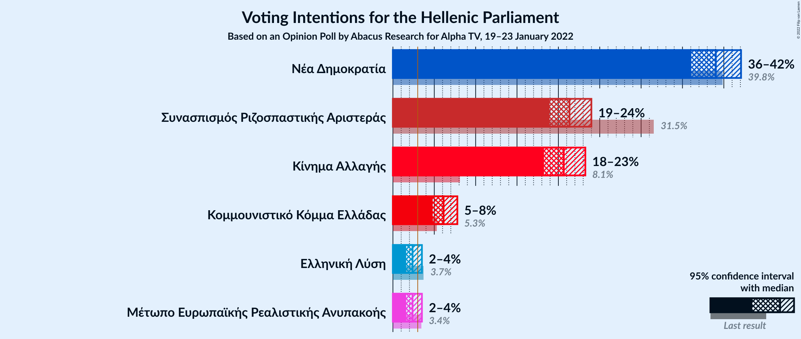
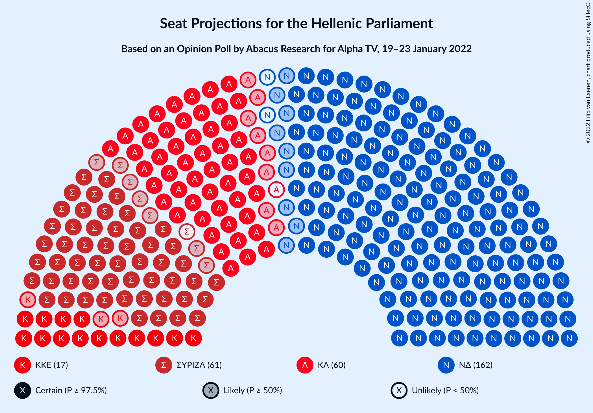
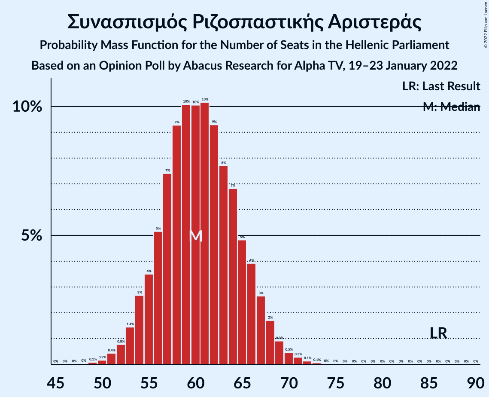
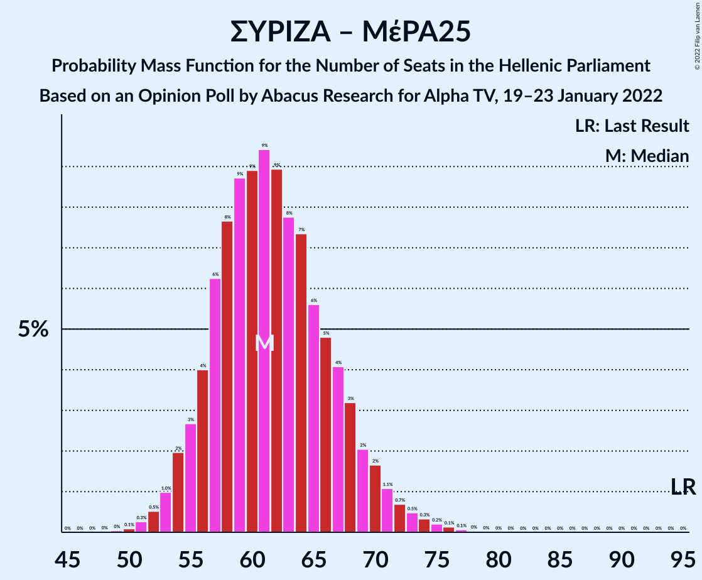

# Opinion Poll by Abacus Research for Alpha TV, 19–23 January 2022

<a href="#voting-intentions">Voting Intentions</a> | <a href="#seats">Seats</a> | <a href="#coalitions">Coalitions</a> | <a href="#technical-information">Technical Information</a>

## Voting Intentions

### Confidence Intervals

| Party | Last Result | Poll Result | 80% Confidence Interval | 90% Confidence Interval | 95% Confidence Interval | 99% Confidence Interval |
|:-----:|:-----------:|:-----------:|:-----------------------:|:-----------------------:|:-----------------------:|:-----------------------:|
| Νέα Δημοκρατία | 39.8% | 39.0% | 37.1–41.0% |36.5–41.6% |36.1–42.1% |35.1–43.0% |
| Συνασπισμός Ριζοσπαστικής Αριστεράς | 31.5% | 21.3% | 19.8–23.1% |19.3–23.6% |18.9–24.0% |18.2–24.8% |
| Κίνημα Αλλαγής | 8.1% | 20.7% | 19.1–22.4% |18.6–22.8% |18.3–23.3% |17.5–24.1% |
| Κομμουνιστικό Κόμμα Ελλάδας | 5.3% | 6.1% | 5.3–7.2% |5.0–7.5% |4.8–7.8% |4.4–8.3% |
| Ελληνική Λύση | 3.7% | 2.4% | 1.9–3.1% |1.7–3.3% |1.6–3.5% |1.4–3.9% |
| Μέτωπο Ευρωπαϊκής Ρεαλιστικής Ανυπακοής | 3.4% | 2.4% | 1.9–3.1% |1.7–3.3% |1.6–3.5% |1.4–3.9% |

*Note:* The poll result column reflects the actual value used in the calculations. Published results may vary slightly, and in addition be rounded to fewer digits.

## Seats

### Confidence Intervals

| Party | Last Result | Median | 80% Confidence Interval | 90% Confidence Interval | 95% Confidence Interval | 99% Confidence Interval |
|:-----:|:-----------:|:------:|:-----------------------:|:-----------------------:|:-----------------------:|:-----------------------:|
| <a href="#νέα-δημοκρατία">Νέα Δημοκρατία</a> | 158 | 160 | 154–166 |153–168 |151–169 |148–172 |
| <a href="#συνασπισμός-ριζοσπαστικής-αριστεράς">Συνασπισμός Ριζοσπαστικής Αριστεράς</a> | 86 | 60 | 56–66 |54–67 |53–68 |51–70 |
| <a href="#κίνημα-αλλαγής">Κίνημα Αλλαγής</a> | 22 | 59 | 54–63 |52–65 |51–66 |49–68 |
| <a href="#κομμουνιστικό-κόμμα-ελλάδας">Κομμουνιστικό Κόμμα Ελλάδας</a> | 15 | 17 | 15–20 |14–21 |14–22 |12–24 |
| <a href="#ελληνική-λύση">Ελληνική Λύση</a> | 10 | 0 | 0–9 |0–9 |0–9 |0–11 |
| <a href="#μέτωπο-ευρωπαϊκής-ρεαλιστικής-ανυπακοής">Μέτωπο Ευρωπαϊκής Ρεαλιστικής Ανυπακοής</a> | 9 | 0 | 0–9 |0–9 |0–10 |0–11 |

### Νέα Δημοκρατία

*For a full overview of the results for this party, see the [Νέα Δημοκρατία](party-νέαδημοκρατία.html) page.*

| Number of Seats | Probability | Accumulated | Special Marks |
|:---------------:|:-----------:|:-----------:|:-------------:|
| 145 | 0% | 100% |  |
| 146 | 0.1% | 99.9% |  |
| 147 | 0.2% | 99.8% |  |
| 148 | 0.2% | 99.7% |  |
| 149 | 0.5% | 99.4% |  |
| 150 | 0.7% | 98.9% |  |
| 151 | 1.2% | 98% | Majority |
| 152 | 2% | 97% |  |
| 153 | 2% | 95% |  |
| 154 | 3% | 93% |  |
| 155 | 4% | 90% |  |
| 156 | 5% | 85% |  |
| 157 | 7% | 81% |  |
| 158 | 7% | 74% | Last Result |
| 159 | 8% | 67% |  |
| 160 | 9% | 59% | Median |
| 161 | 8% | 50% |  |
| 162 | 9% | 42% |  |
| 163 | 7% | 33% |  |
| 164 | 7% | 26% |  |
| 165 | 5% | 19% |  |
| 166 | 4% | 14% |  |
| 167 | 4% | 10% |  |
| 168 | 2% | 6% |  |
| 169 | 1.4% | 4% |  |
| 170 | 1.1% | 2% |  |
| 171 | 0.6% | 1.3% |  |
| 172 | 0.4% | 0.7% |  |
| 173 | 0.2% | 0.4% |  |
| 174 | 0.1% | 0.2% |  |
| 175 | 0.1% | 0.1% |  |
| 176 | 0% | 0% |  |

### Συνασπισμός Ριζοσπαστικής Αριστεράς

*For a full overview of the results for this party, see the [Συνασπισμός Ριζοσπαστικής Αριστεράς](party-συνασπισμόςριζοσπαστικήςαριστεράς.html) page.*

| Number of Seats | Probability | Accumulated | Special Marks |
|:---------------:|:-----------:|:-----------:|:-------------:|
| 49 | 0.1% | 100% |  |
| 50 | 0.2% | 99.9% |  |
| 51 | 0.4% | 99.7% |  |
| 52 | 0.8% | 99.3% |  |
| 53 | 1.4% | 98.5% |  |
| 54 | 3% | 97% |  |
| 55 | 4% | 94% |  |
| 56 | 5% | 91% |  |
| 57 | 7% | 86% |  |
| 58 | 9% | 78% |  |
| 59 | 10% | 69% |  |
| 60 | 10% | 59% | Median |
| 61 | 10% | 49% |  |
| 62 | 9% | 39% |  |
| 63 | 8% | 29% |  |
| 64 | 7% | 22% |  |
| 65 | 5% | 15% |  |
| 66 | 4% | 10% |  |
| 67 | 3% | 6% |  |
| 68 | 2% | 4% |  |
| 69 | 0.9% | 2% |  |
| 70 | 0.5% | 1.0% |  |
| 71 | 0.3% | 0.5% |  |
| 72 | 0.1% | 0.2% |  |
| 73 | 0.1% | 0.1% |  |
| 74 | 0% | 0% |  |
| 75 | 0% | 0% |  |
| 76 | 0% | 0% |  |
| 77 | 0% | 0% |  |
| 78 | 0% | 0% |  |
| 79 | 0% | 0% |  |
| 80 | 0% | 0% |  |
| 81 | 0% | 0% |  |
| 82 | 0% | 0% |  |
| 83 | 0% | 0% |  |
| 84 | 0% | 0% |  |
| 85 | 0% | 0% |  |
| 86 | 0% | 0% | Last Result |

### Κίνημα Αλλαγής

*For a full overview of the results for this party, see the [Κίνημα Αλλαγής](party-κίνημααλλαγής.html) page.*

| Number of Seats | Probability | Accumulated | Special Marks |
|:---------------:|:-----------:|:-----------:|:-------------:|
| 22 | 0% | 100% | Last Result |
| 23 | 0% | 100% |  |
| 24 | 0% | 100% |  |
| 25 | 0% | 100% |  |
| 26 | 0% | 100% |  |
| 27 | 0% | 100% |  |
| 28 | 0% | 100% |  |
| 29 | 0% | 100% |  |
| 30 | 0% | 100% |  |
| 31 | 0% | 100% |  |
| 32 | 0% | 100% |  |
| 33 | 0% | 100% |  |
| 34 | 0% | 100% |  |
| 35 | 0% | 100% |  |
| 36 | 0% | 100% |  |
| 37 | 0% | 100% |  |
| 38 | 0% | 100% |  |
| 39 | 0% | 100% |  |
| 40 | 0% | 100% |  |
| 41 | 0% | 100% |  |
| 42 | 0% | 100% |  |
| 43 | 0% | 100% |  |
| 44 | 0% | 100% |  |
| 45 | 0% | 100% |  |
| 46 | 0% | 100% |  |
| 47 | 0.1% | 100% |  |
| 48 | 0.2% | 99.9% |  |
| 49 | 0.4% | 99.7% |  |
| 50 | 0.6% | 99.4% |  |
| 51 | 1.4% | 98.7% |  |
| 52 | 3% | 97% |  |
| 53 | 3% | 95% |  |
| 54 | 4% | 91% |  |
| 55 | 7% | 87% |  |
| 56 | 9% | 79% |  |
| 57 | 9% | 70% |  |
| 58 | 9% | 61% |  |
| 59 | 11% | 52% | Median |
| 60 | 12% | 41% |  |
| 61 | 7% | 30% |  |
| 62 | 7% | 23% |  |
| 63 | 6% | 16% |  |
| 64 | 4% | 10% |  |
| 65 | 2% | 6% |  |
| 66 | 2% | 4% |  |
| 67 | 1.0% | 2% |  |
| 68 | 0.4% | 0.8% |  |
| 69 | 0.2% | 0.4% |  |
| 70 | 0.1% | 0.2% |  |
| 71 | 0.1% | 0.1% |  |
| 72 | 0% | 0% |  |

### Κομμουνιστικό Κόμμα Ελλάδας

*For a full overview of the results for this party, see the [Κομμουνιστικό Κόμμα Ελλάδας](party-κομμουνιστικόκόμμαελλάδας.html) page.*

| Number of Seats | Probability | Accumulated | Special Marks |
|:---------------:|:-----------:|:-----------:|:-------------:|
| 11 | 0.1% | 100% |  |
| 12 | 0.4% | 99.9% |  |
| 13 | 2% | 99.5% |  |
| 14 | 5% | 98% |  |
| 15 | 10% | 93% | Last Result |
| 16 | 15% | 83% |  |
| 17 | 19% | 68% | Median |
| 18 | 16% | 50% |  |
| 19 | 16% | 34% |  |
| 20 | 9% | 18% |  |
| 21 | 6% | 10% |  |
| 22 | 2% | 4% |  |
| 23 | 1.1% | 2% |  |
| 24 | 0.4% | 0.5% |  |
| 25 | 0.1% | 0.2% |  |
| 26 | 0% | 0% |  |

### Ελληνική Λύση

*For a full overview of the results for this party, see the [Ελληνική Λύση](party-ελληνικήλύση.html) page.*

| Number of Seats | Probability | Accumulated | Special Marks |
|:---------------:|:-----------:|:-----------:|:-------------:|
| 0 | 81% | 100% | Median |
| 1 | 0% | 19% |  |
| 2 | 0% | 19% |  |
| 3 | 0% | 19% |  |
| 4 | 0% | 19% |  |
| 5 | 0% | 19% |  |
| 6 | 0% | 19% |  |
| 7 | 0% | 19% |  |
| 8 | 6% | 19% |  |
| 9 | 12% | 13% |  |
| 10 | 0.1% | 1.4% | Last Result |
| 11 | 1.2% | 1.3% |  |
| 12 | 0.1% | 0.1% |  |
| 13 | 0% | 0% |  |

### Μέτωπο Ευρωπαϊκής Ρεαλιστικής Ανυπακοής

*For a full overview of the results for this party, see the [Μέτωπο Ευρωπαϊκής Ρεαλιστικής Ανυπακοής](party-μέτωποευρωπαϊκήςρεαλιστικήςανυπακοής.html) page.*

| Number of Seats | Probability | Accumulated | Special Marks |
|:---------------:|:-----------:|:-----------:|:-------------:|
| 0 | 87% | 100% | Median |
| 1 | 0% | 13% |  |
| 2 | 0% | 13% |  |
| 3 | 0% | 13% |  |
| 4 | 0% | 13% |  |
| 5 | 0% | 13% |  |
| 6 | 0% | 13% |  |
| 7 | 0% | 13% |  |
| 8 | 2% | 13% |  |
| 9 | 8% | 11% | Last Result |
| 10 | 2% | 3% |  |
| 11 | 0.6% | 0.8% |  |
| 12 | 0.1% | 0.2% |  |
| 13 | 0% | 0% |  |

## Coalitions

### Confidence Intervals

| Coalition | Last Result | Median | Majority? | 80% Confidence Interval | 90% Confidence Interval | 95% Confidence Interval | 99% Confidence Interval |
|:---------:|:-----------:|:------:|:---------:|:-----------------------:|:-----------------------:|:-----------------------:|:-----------------------:|
| Νέα Δημοκρατία – Κίνημα Αλλαγής | 180 | 219 | 100% | 212–225 | 210–227 | 208–228 | 205–230 |
| Νέα Δημοκρατία | 158 | 160 | 98% | 154–166 | 153–168 | 151–169 | 148–172 |
| Συνασπισμός Ριζοσπαστικής Αριστεράς – Μέτωπο Ευρωπαϊκής Ρεαλιστικής Ανυπακοής | 95 | 61 | 0% | 56–67 | 55–69 | 54–71 | 52–74 |
| Συνασπισμός Ριζοσπαστικής Αριστεράς | 86 | 60 | 0% | 56–66 | 54–67 | 53–68 | 51–70 |

### Νέα Δημοκρατία – Κίνημα Αλλαγής

| Number of Seats | Probability | Accumulated | Special Marks |
|:---------------:|:-----------:|:-----------:|:-------------:|
| 180 | 0% | 100% | Last Result |
| 181 | 0% | 100% |  |
| 182 | 0% | 100% |  |
| 183 | 0% | 100% |  |
| 184 | 0% | 100% |  |
| 185 | 0% | 100% |  |
| 186 | 0% | 100% |  |
| 187 | 0% | 100% |  |
| 188 | 0% | 100% |  |
| 189 | 0% | 100% |  |
| 190 | 0% | 100% |  |
| 191 | 0% | 100% |  |
| 192 | 0% | 100% |  |
| 193 | 0% | 100% |  |
| 194 | 0% | 100% |  |
| 195 | 0% | 100% |  |
| 196 | 0% | 100% |  |
| 197 | 0% | 100% |  |
| 198 | 0% | 100% |  |
| 199 | 0% | 100% |  |
| 200 | 0% | 100% |  |
| 201 | 0% | 100% |  |
| 202 | 0% | 99.9% |  |
| 203 | 0.2% | 99.9% |  |
| 204 | 0.1% | 99.7% |  |
| 205 | 0.3% | 99.6% |  |
| 206 | 0.4% | 99.2% |  |
| 207 | 0.7% | 98.8% |  |
| 208 | 0.8% | 98% |  |
| 209 | 1.1% | 97% |  |
| 210 | 2% | 96% |  |
| 211 | 2% | 94% |  |
| 212 | 3% | 93% |  |
| 213 | 3% | 90% |  |
| 214 | 5% | 87% |  |
| 215 | 5% | 82% |  |
| 216 | 6% | 77% |  |
| 217 | 7% | 71% |  |
| 218 | 7% | 64% |  |
| 219 | 8% | 56% | Median |
| 220 | 7% | 48% |  |
| 221 | 9% | 41% |  |
| 222 | 6% | 32% |  |
| 223 | 6% | 26% |  |
| 224 | 6% | 20% |  |
| 225 | 5% | 14% |  |
| 226 | 3% | 9% |  |
| 227 | 3% | 6% |  |
| 228 | 2% | 4% |  |
| 229 | 0.8% | 2% |  |
| 230 | 0.5% | 1.0% |  |
| 231 | 0.2% | 0.5% |  |
| 232 | 0.1% | 0.2% |  |
| 233 | 0% | 0.1% |  |
| 234 | 0% | 0% |  |

### Νέα Δημοκρατία

| Number of Seats | Probability | Accumulated | Special Marks |
|:---------------:|:-----------:|:-----------:|:-------------:|
| 145 | 0% | 100% |  |
| 146 | 0.1% | 99.9% |  |
| 147 | 0.2% | 99.8% |  |
| 148 | 0.2% | 99.7% |  |
| 149 | 0.5% | 99.4% |  |
| 150 | 0.7% | 98.9% |  |
| 151 | 1.2% | 98% | Majority |
| 152 | 2% | 97% |  |
| 153 | 2% | 95% |  |
| 154 | 3% | 93% |  |
| 155 | 4% | 90% |  |
| 156 | 5% | 85% |  |
| 157 | 7% | 81% |  |
| 158 | 7% | 74% | Last Result |
| 159 | 8% | 67% |  |
| 160 | 9% | 59% | Median |
| 161 | 8% | 50% |  |
| 162 | 9% | 42% |  |
| 163 | 7% | 33% |  |
| 164 | 7% | 26% |  |
| 165 | 5% | 19% |  |
| 166 | 4% | 14% |  |
| 167 | 4% | 10% |  |
| 168 | 2% | 6% |  |
| 169 | 1.4% | 4% |  |
| 170 | 1.1% | 2% |  |
| 171 | 0.6% | 1.3% |  |
| 172 | 0.4% | 0.7% |  |
| 173 | 0.2% | 0.4% |  |
| 174 | 0.1% | 0.2% |  |
| 175 | 0.1% | 0.1% |  |
| 176 | 0% | 0% |  |

### Συνασπισμός Ριζοσπαστικής Αριστεράς – Μέτωπο Ευρωπαϊκής Ρεαλιστικής Ανυπακοής

| Number of Seats | Probability | Accumulated | Special Marks |
|:---------------:|:-----------:|:-----------:|:-------------:|
| 49 | 0% | 100% |  |
| 50 | 0.1% | 99.9% |  |
| 51 | 0.3% | 99.8% |  |
| 52 | 0.5% | 99.6% |  |
| 53 | 1.0% | 99.1% |  |
| 54 | 2% | 98% |  |
| 55 | 3% | 96% |  |
| 56 | 4% | 93% |  |
| 57 | 6% | 89% |  |
| 58 | 8% | 83% |  |
| 59 | 9% | 76% |  |
| 60 | 9% | 67% | Median |
| 61 | 9% | 58% |  |
| 62 | 9% | 48% |  |
| 63 | 8% | 40% |  |
| 64 | 7% | 32% |  |
| 65 | 6% | 24% |  |
| 66 | 5% | 19% |  |
| 67 | 4% | 14% |  |
| 68 | 3% | 10% |  |
| 69 | 2% | 7% |  |
| 70 | 2% | 5% |  |
| 71 | 1.1% | 3% |  |
| 72 | 0.7% | 2% |  |
| 73 | 0.5% | 1.3% |  |
| 74 | 0.3% | 0.8% |  |
| 75 | 0.2% | 0.5% |  |
| 76 | 0.1% | 0.3% |  |
| 77 | 0.1% | 0.1% |  |
| 78 | 0% | 0.1% |  |
| 79 | 0% | 0% |  |
| 80 | 0% | 0% |  |
| 81 | 0% | 0% |  |
| 82 | 0% | 0% |  |
| 83 | 0% | 0% |  |
| 84 | 0% | 0% |  |
| 85 | 0% | 0% |  |
| 86 | 0% | 0% |  |
| 87 | 0% | 0% |  |
| 88 | 0% | 0% |  |
| 89 | 0% | 0% |  |
| 90 | 0% | 0% |  |
| 91 | 0% | 0% |  |
| 92 | 0% | 0% |  |
| 93 | 0% | 0% |  |
| 94 | 0% | 0% |  |
| 95 | 0% | 0% | Last Result |

### Συνασπισμός Ριζοσπαστικής Αριστεράς

| Number of Seats | Probability | Accumulated | Special Marks |
|:---------------:|:-----------:|:-----------:|:-------------:|
| 49 | 0.1% | 100% |  |
| 50 | 0.2% | 99.9% |  |
| 51 | 0.4% | 99.7% |  |
| 52 | 0.8% | 99.3% |  |
| 53 | 1.4% | 98.5% |  |
| 54 | 3% | 97% |  |
| 55 | 4% | 94% |  |
| 56 | 5% | 91% |  |
| 57 | 7% | 86% |  |
| 58 | 9% | 78% |  |
| 59 | 10% | 69% |  |
| 60 | 10% | 59% | Median |
| 61 | 10% | 49% |  |
| 62 | 9% | 39% |  |
| 63 | 8% | 29% |  |
| 64 | 7% | 22% |  |
| 65 | 5% | 15% |  |
| 66 | 4% | 10% |  |
| 67 | 3% | 6% |  |
| 68 | 2% | 4% |  |
| 69 | 0.9% | 2% |  |
| 70 | 0.5% | 1.0% |  |
| 71 | 0.3% | 0.5% |  |
| 72 | 0.1% | 0.2% |  |
| 73 | 0.1% | 0.1% |  |
| 74 | 0% | 0% |  |
| 75 | 0% | 0% |  |
| 76 | 0% | 0% |  |
| 77 | 0% | 0% |  |
| 78 | 0% | 0% |  |
| 79 | 0% | 0% |  |
| 80 | 0% | 0% |  |
| 81 | 0% | 0% |  |
| 82 | 0% | 0% |  |
| 83 | 0% | 0% |  |
| 84 | 0% | 0% |  |
| 85 | 0% | 0% |  |
| 86 | 0% | 0% | Last Result |

## Technical Information

### Opinion Poll

+ **Polling firm:** Abacus Research
+ **Commissioner(s):** Alpha TV
+ **Fieldwork period:** 19–23 January 2022

### Calculations

+ **Sample size:** 1012
+ **Simulations done:** 1,048,576
+ **Error estimate:** 0.87%

