# Opinion Poll by Pulse RC for ΣΚΑΪ, 26–29 January 2022

<a href="#voting-intentions">Voting Intentions</a> | <a href="#seats">Seats</a> | <a href="#coalitions">Coalitions</a> | <a href="#technical-information">Technical Information</a>

## Voting Intentions

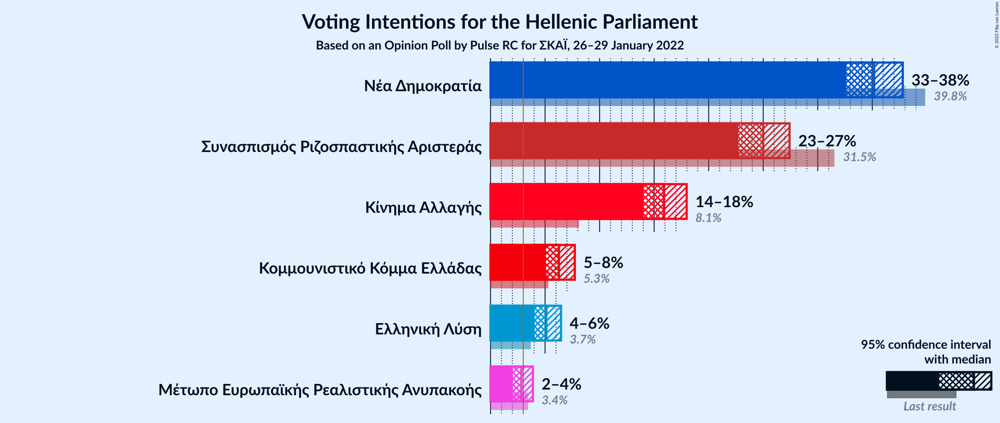

### Confidence Intervals

| Party | Last Result | Poll Result | 80% Confidence Interval | 90% Confidence Interval | 95% Confidence Interval | 99% Confidence Interval |
|:-----:|:-----------:|:-----------:|:-----------------------:|:-----------------------:|:-----------------------:|:-----------------------:|
| Νέα Δημοκρατία | 39.8% | 35.2% | 33.5–36.9% |33.0–37.4% |32.6–37.8% |31.8–38.6% |
| Συνασπισμός Ριζοσπαστικής Αριστεράς | 31.5% | 25.0% | 23.5–26.6% |23.1–27.0% |22.7–27.4% |22.0–28.2% |
| Κίνημα Αλλαγής | 8.1% | 15.9% | 14.7–17.3% |14.3–17.6% |14.0–18.0% |13.4–18.7% |
| Κομμουνιστικό Κόμμα Ελλάδας | 5.3% | 6.3% | 5.5–7.2% |5.3–7.5% |5.1–7.7% |4.7–8.2% |
| Ελληνική Λύση | 3.7% | 5.1% | 4.4–6.0% |4.2–6.2% |4.1–6.5% |3.7–6.9% |
| Μέτωπο Ευρωπαϊκής Ρεαλιστικής Ανυπακοής | 3.4% | 2.8% | 2.3–3.5% |2.2–3.7% |2.1–3.9% |1.8–4.2% |

*Note:* The poll result column reflects the actual value used in the calculations. Published results may vary slightly, and in addition be rounded to fewer digits.

## Seats

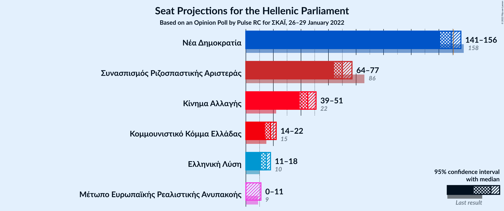

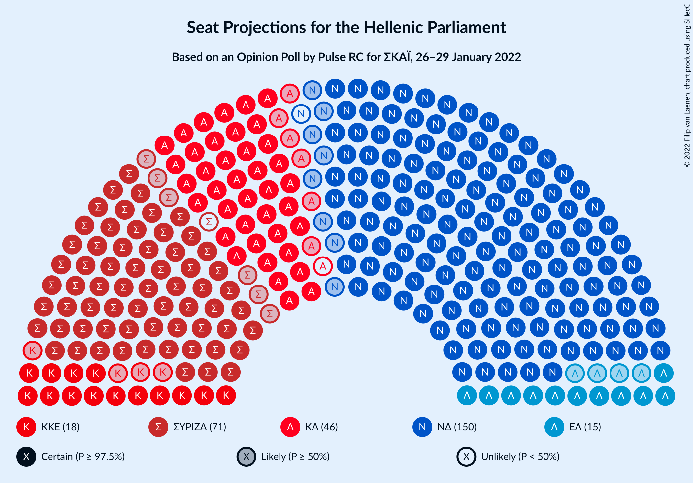

### Confidence Intervals

| Party | Last Result | Median | 80% Confidence Interval | 90% Confidence Interval | 95% Confidence Interval | 99% Confidence Interval |
|:-----:|:-----------:|:------:|:-----------------------:|:-----------------------:|:-----------------------:|:-----------------------:|
| <a href="#νέα-δημοκρατία">Νέα Δημοκρατία</a> | 158 | 149 | 144–154 |142–155 |141–156 |139–159 |
| <a href="#συνασπισμός-ριζοσπαστικής-αριστεράς">Συνασπισμός Ριζοσπαστικής Αριστεράς</a> | 86 | 70 | 66–75 |65–76 |64–77 |62–80 |
| <a href="#κίνημα-αλλαγής">Κίνημα Αλλαγής</a> | 22 | 45 | 41–49 |40–50 |39–51 |38–53 |
| <a href="#κομμουνιστικό-κόμμα-ελλάδας">Κομμουνιστικό Κόμμα Ελλάδας</a> | 15 | 18 | 15–20 |15–21 |14–22 |13–23 |
| <a href="#ελληνική-λύση">Ελληνική Λύση</a> | 10 | 15 | 12–17 |12–18 |11–18 |10–19 |
| <a href="#μέτωπο-ευρωπαϊκής-ρεαλιστικής-ανυπακοής">Μέτωπο Ευρωπαϊκής Ρεαλιστικής Ανυπακοής</a> | 9 | 0 | 0–10 |0–10 |0–11 |0–12 |

### Νέα Δημοκρατία

*For a full overview of the results for this party, see the [Νέα Δημοκρατία](party-νέαδημοκρατία.html) page.*

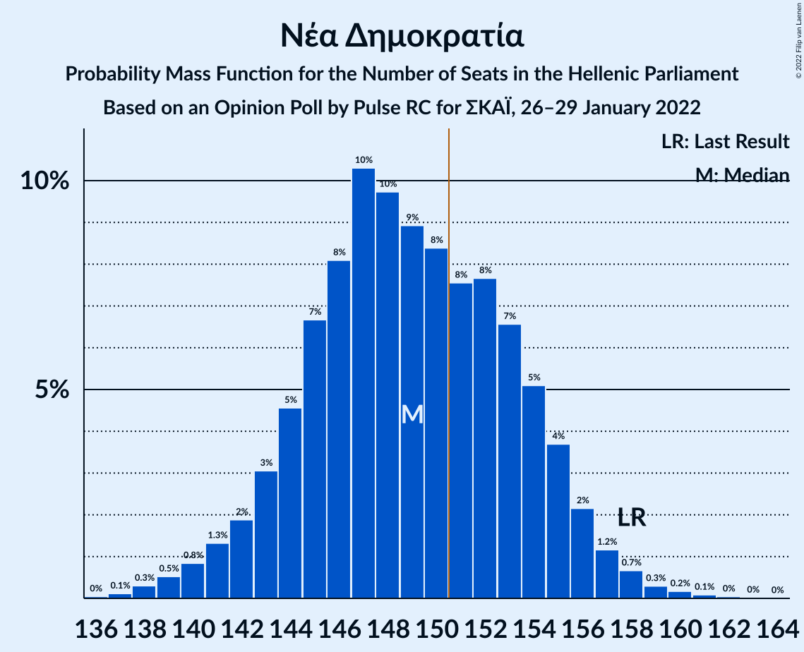

| Number of Seats | Probability | Accumulated | Special Marks |
|:---------------:|:-----------:|:-----------:|:-------------:|
| 136 | 0% | 100% |  |
| 137 | 0.1% | 99.9% |  |
| 138 | 0.3% | 99.8% |  |
| 139 | 0.5% | 99.5% |  |
| 140 | 0.8% | 99.0% |  |
| 141 | 1.3% | 98% |  |
| 142 | 2% | 97% |  |
| 143 | 3% | 95% |  |
| 144 | 5% | 92% |  |
| 145 | 7% | 87% |  |
| 146 | 8% | 81% |  |
| 147 | 10% | 73% |  |
| 148 | 10% | 62% |  |
| 149 | 9% | 53% | Median |
| 150 | 8% | 44% |  |
| 151 | 8% | 35% | Majority |
| 152 | 8% | 28% |  |
| 153 | 7% | 20% |  |
| 154 | 5% | 13% |  |
| 155 | 4% | 8% |  |
| 156 | 2% | 5% |  |
| 157 | 1.2% | 2% |  |
| 158 | 0.7% | 1.3% | Last Result |
| 159 | 0.3% | 0.6% |  |
| 160 | 0.2% | 0.3% |  |
| 161 | 0.1% | 0.2% |  |
| 162 | 0% | 0.1% |  |
| 163 | 0% | 0% |  |

### Συνασπισμός Ριζοσπαστικής Αριστεράς

*For a full overview of the results for this party, see the [Συνασπισμός Ριζοσπαστικής Αριστεράς](party-συνασπισμόςριζοσπαστικήςαριστεράς.html) page.*

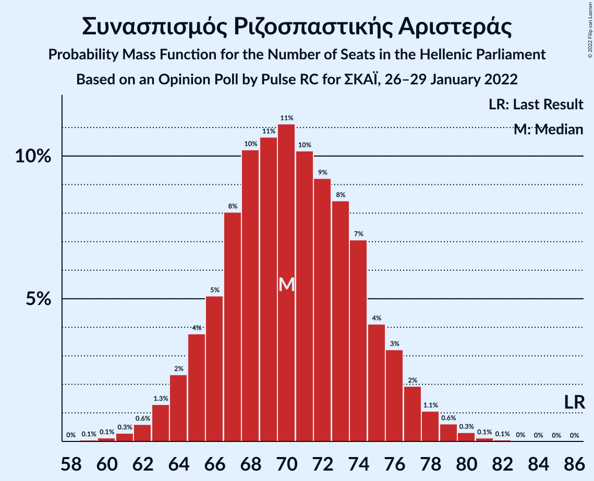

| Number of Seats | Probability | Accumulated | Special Marks |
|:---------------:|:-----------:|:-----------:|:-------------:|
| 59 | 0.1% | 100% |  |
| 60 | 0.1% | 99.9% |  |
| 61 | 0.3% | 99.8% |  |
| 62 | 0.6% | 99.5% |  |
| 63 | 1.3% | 98.9% |  |
| 64 | 2% | 98% |  |
| 65 | 4% | 95% |  |
| 66 | 5% | 92% |  |
| 67 | 8% | 86% |  |
| 68 | 10% | 78% |  |
| 69 | 11% | 68% |  |
| 70 | 11% | 57% | Median |
| 71 | 10% | 46% |  |
| 72 | 9% | 36% |  |
| 73 | 8% | 27% |  |
| 74 | 7% | 19% |  |
| 75 | 4% | 11% |  |
| 76 | 3% | 7% |  |
| 77 | 2% | 4% |  |
| 78 | 1.1% | 2% |  |
| 79 | 0.6% | 1.1% |  |
| 80 | 0.3% | 0.5% |  |
| 81 | 0.1% | 0.2% |  |
| 82 | 0.1% | 0.1% |  |
| 83 | 0% | 0% |  |
| 84 | 0% | 0% |  |
| 85 | 0% | 0% |  |
| 86 | 0% | 0% | Last Result |

### Κίνημα Αλλαγής

*For a full overview of the results for this party, see the [Κίνημα Αλλαγής](party-κίνημααλλαγής.html) page.*

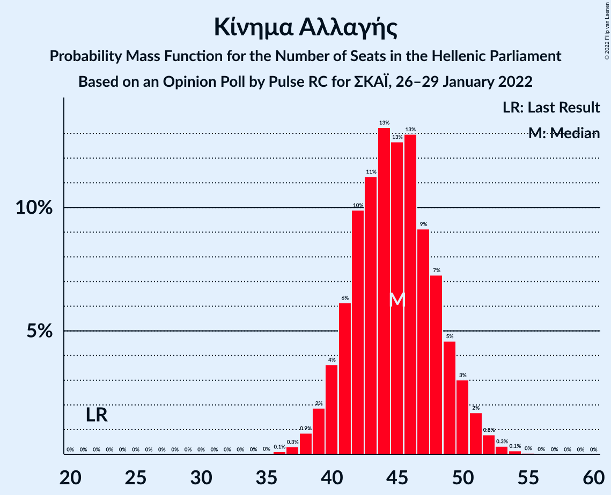

| Number of Seats | Probability | Accumulated | Special Marks |
|:---------------:|:-----------:|:-----------:|:-------------:|
| 22 | 0% | 100% | Last Result |
| 23 | 0% | 100% |  |
| 24 | 0% | 100% |  |
| 25 | 0% | 100% |  |
| 26 | 0% | 100% |  |
| 27 | 0% | 100% |  |
| 28 | 0% | 100% |  |
| 29 | 0% | 100% |  |
| 30 | 0% | 100% |  |
| 31 | 0% | 100% |  |
| 32 | 0% | 100% |  |
| 33 | 0% | 100% |  |
| 34 | 0% | 100% |  |
| 35 | 0% | 100% |  |
| 36 | 0.1% | 100% |  |
| 37 | 0.3% | 99.9% |  |
| 38 | 0.9% | 99.6% |  |
| 39 | 2% | 98.7% |  |
| 40 | 4% | 97% |  |
| 41 | 6% | 93% |  |
| 42 | 10% | 87% |  |
| 43 | 11% | 77% |  |
| 44 | 13% | 66% |  |
| 45 | 13% | 53% | Median |
| 46 | 13% | 40% |  |
| 47 | 9% | 27% |  |
| 48 | 7% | 18% |  |
| 49 | 5% | 11% |  |
| 50 | 3% | 6% |  |
| 51 | 2% | 3% |  |
| 52 | 0.8% | 1.3% |  |
| 53 | 0.3% | 0.5% |  |
| 54 | 0.1% | 0.2% |  |
| 55 | 0% | 0.1% |  |
| 56 | 0% | 0% |  |

### Κομμουνιστικό Κόμμα Ελλάδας

*For a full overview of the results for this party, see the [Κομμουνιστικό Κόμμα Ελλάδας](party-κομμουνιστικόκόμμαελλάδας.html) page.*

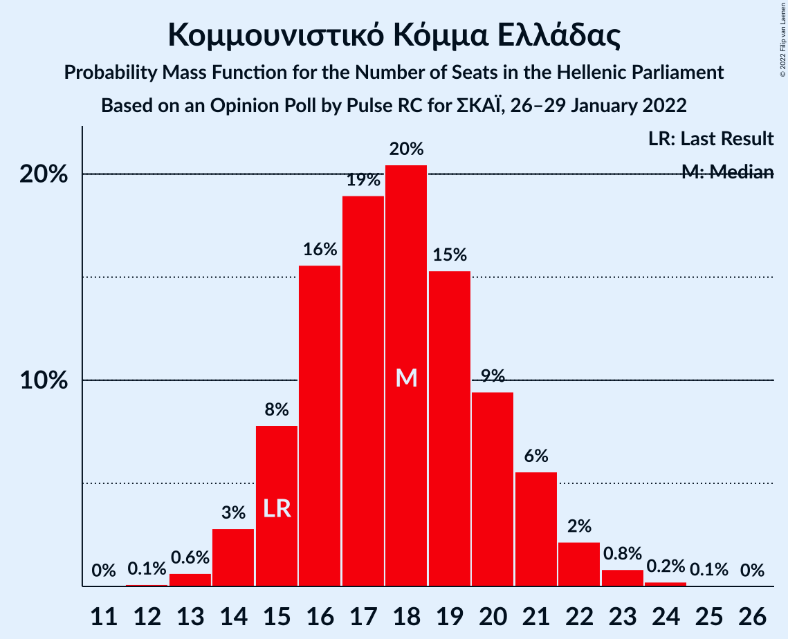

| Number of Seats | Probability | Accumulated | Special Marks |
|:---------------:|:-----------:|:-----------:|:-------------:|
| 12 | 0.1% | 100% |  |
| 13 | 0.6% | 99.9% |  |
| 14 | 3% | 99.2% |  |
| 15 | 8% | 96% | Last Result |
| 16 | 16% | 89% |  |
| 17 | 19% | 73% |  |
| 18 | 20% | 54% | Median |
| 19 | 15% | 34% |  |
| 20 | 9% | 18% |  |
| 21 | 6% | 9% |  |
| 22 | 2% | 3% |  |
| 23 | 0.8% | 1.1% |  |
| 24 | 0.2% | 0.3% |  |
| 25 | 0.1% | 0.1% |  |
| 26 | 0% | 0% |  |

### Ελληνική Λύση

*For a full overview of the results for this party, see the [Ελληνική Λύση](party-ελληνικήλύση.html) page.*

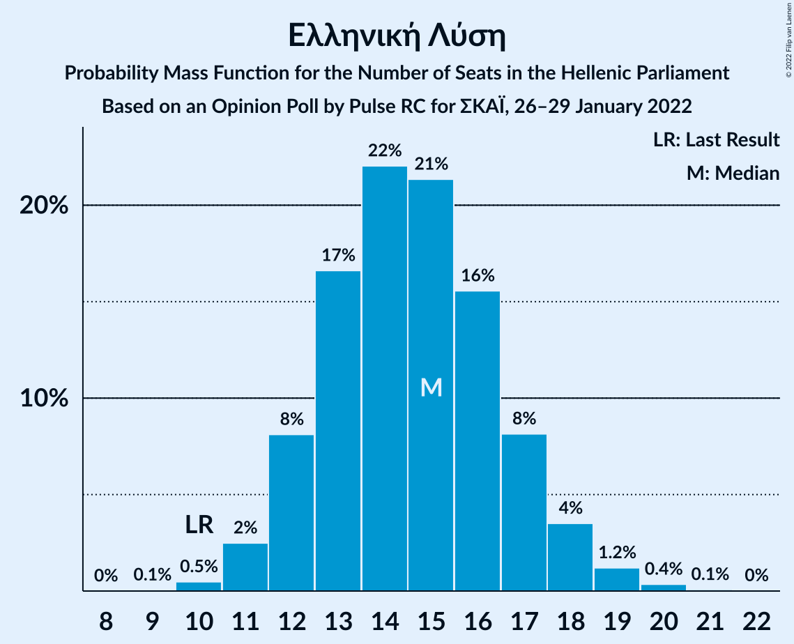

| Number of Seats | Probability | Accumulated | Special Marks |
|:---------------:|:-----------:|:-----------:|:-------------:|
| 9 | 0.1% | 100% |  |
| 10 | 0.5% | 99.9% | Last Result |
| 11 | 2% | 99.5% |  |
| 12 | 8% | 97% |  |
| 13 | 17% | 89% |  |
| 14 | 22% | 72% |  |
| 15 | 21% | 50% | Median |
| 16 | 16% | 29% |  |
| 17 | 8% | 13% |  |
| 18 | 4% | 5% |  |
| 19 | 1.2% | 2% |  |
| 20 | 0.4% | 0.4% |  |
| 21 | 0.1% | 0.1% |  |
| 22 | 0% | 0% |  |

### Μέτωπο Ευρωπαϊκής Ρεαλιστικής Ανυπακοής

*For a full overview of the results for this party, see the [Μέτωπο Ευρωπαϊκής Ρεαλιστικής Ανυπακοής](party-μέτωποευρωπαϊκήςρεαλιστικήςανυπακοής.html) page.*

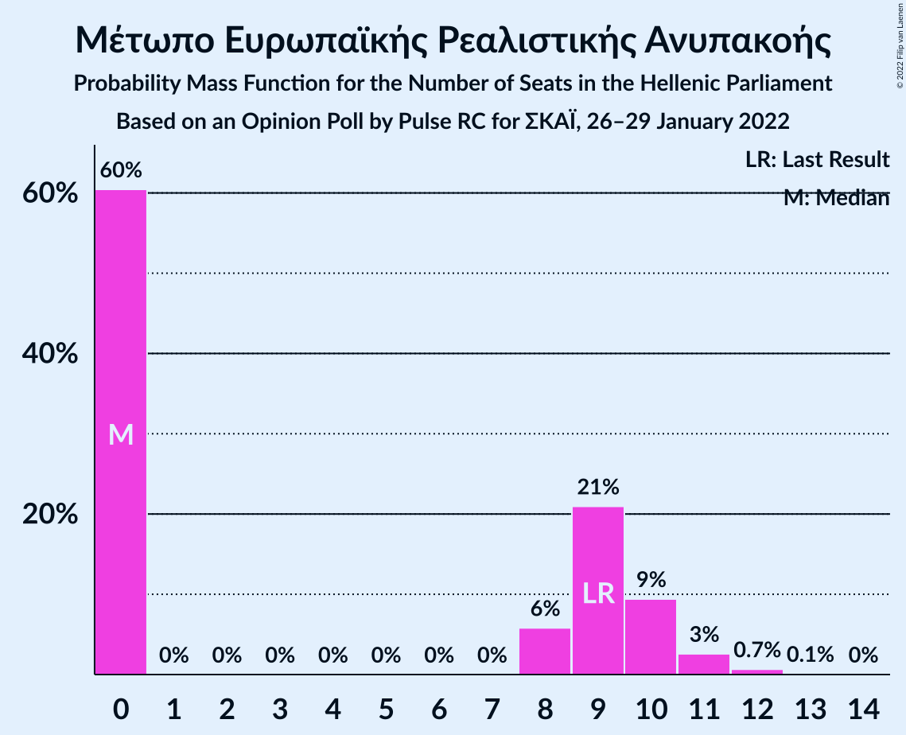

| Number of Seats | Probability | Accumulated | Special Marks |
|:---------------:|:-----------:|:-----------:|:-------------:|
| 0 | 60% | 100% | Median |
| 1 | 0% | 40% |  |
| 2 | 0% | 40% |  |
| 3 | 0% | 40% |  |
| 4 | 0% | 40% |  |
| 5 | 0% | 40% |  |
| 6 | 0% | 40% |  |
| 7 | 0% | 40% |  |
| 8 | 6% | 40% |  |
| 9 | 21% | 34% | Last Result |
| 10 | 9% | 13% |  |
| 11 | 3% | 3% |  |
| 12 | 0.7% | 0.8% |  |
| 13 | 0.1% | 0.1% |  |
| 14 | 0% | 0% |  |

## Coalitions

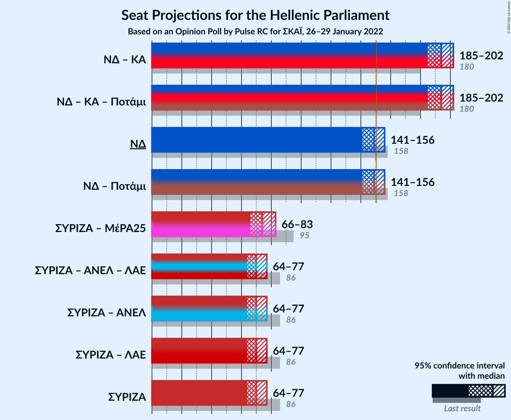

### Confidence Intervals

| Coalition | Last Result | Median | Majority? | 80% Confidence Interval | 90% Confidence Interval | 95% Confidence Interval | 99% Confidence Interval |
|:---------:|:-----------:|:------:|:---------:|:-----------------------:|:-----------------------:|:-----------------------:|:-----------------------:|
| Νέα Δημοκρατία – Κίνημα Αλλαγής | 180 | 194 | 100% | 188–200 | 186–201 | 185–202 | 182–204 |
| Νέα Δημοκρατία | 158 | 149 | 35% | 144–154 | 142–155 | 141–156 | 139–159 |
| Συνασπισμός Ριζοσπαστικής Αριστεράς – Μέτωπο Ευρωπαϊκής Ρεαλιστικής Ανυπακοής | 95 | 74 | 0% | 68–80 | 67–82 | 66–83 | 63–85 |
| Συνασπισμός Ριζοσπαστικής Αριστεράς | 86 | 70 | 0% | 66–75 | 65–76 | 64–77 | 62–80 |

### Νέα Δημοκρατία – Κίνημα Αλλαγής

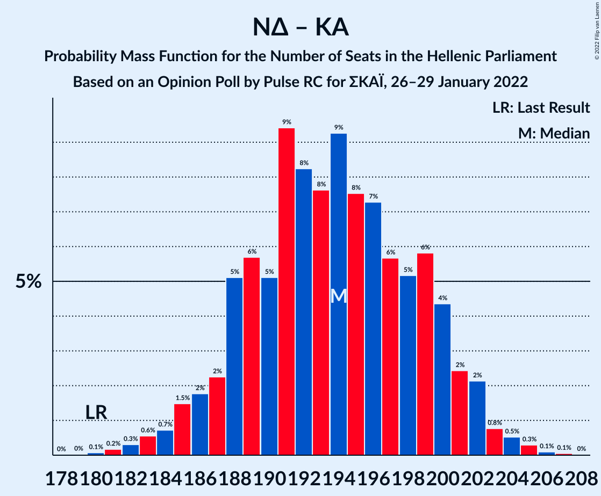

| Number of Seats | Probability | Accumulated | Special Marks |
|:---------------:|:-----------:|:-----------:|:-------------:|
| 180 | 0.1% | 100% | Last Result |
| 181 | 0.2% | 99.9% |  |
| 182 | 0.3% | 99.7% |  |
| 183 | 0.6% | 99.4% |  |
| 184 | 0.7% | 98.8% |  |
| 185 | 1.5% | 98% |  |
| 186 | 2% | 97% |  |
| 187 | 2% | 95% |  |
| 188 | 5% | 93% |  |
| 189 | 6% | 88% |  |
| 190 | 5% | 82% |  |
| 191 | 9% | 77% |  |
| 192 | 8% | 67% |  |
| 193 | 8% | 59% |  |
| 194 | 9% | 51% | Median |
| 195 | 8% | 42% |  |
| 196 | 7% | 35% |  |
| 197 | 6% | 27% |  |
| 198 | 5% | 22% |  |
| 199 | 6% | 17% |  |
| 200 | 4% | 11% |  |
| 201 | 2% | 6% |  |
| 202 | 2% | 4% |  |
| 203 | 0.8% | 2% |  |
| 204 | 0.5% | 1.0% |  |
| 205 | 0.3% | 0.5% |  |
| 206 | 0.1% | 0.2% |  |
| 207 | 0.1% | 0.1% |  |
| 208 | 0% | 0% |  |

### Νέα Δημοκρατία

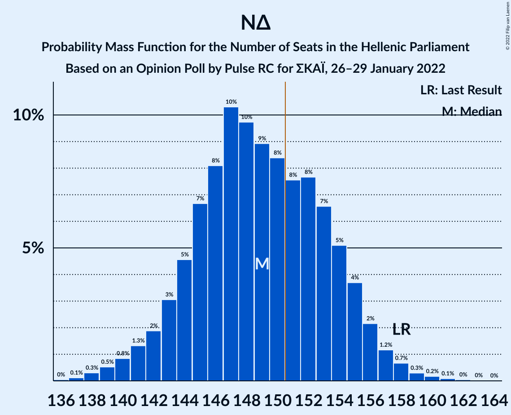

| Number of Seats | Probability | Accumulated | Special Marks |
|:---------------:|:-----------:|:-----------:|:-------------:|
| 136 | 0% | 100% |  |
| 137 | 0.1% | 99.9% |  |
| 138 | 0.3% | 99.8% |  |
| 139 | 0.5% | 99.5% |  |
| 140 | 0.8% | 99.0% |  |
| 141 | 1.3% | 98% |  |
| 142 | 2% | 97% |  |
| 143 | 3% | 95% |  |
| 144 | 5% | 92% |  |
| 145 | 7% | 87% |  |
| 146 | 8% | 81% |  |
| 147 | 10% | 73% |  |
| 148 | 10% | 62% |  |
| 149 | 9% | 53% | Median |
| 150 | 8% | 44% |  |
| 151 | 8% | 35% | Majority |
| 152 | 8% | 28% |  |
| 153 | 7% | 20% |  |
| 154 | 5% | 13% |  |
| 155 | 4% | 8% |  |
| 156 | 2% | 5% |  |
| 157 | 1.2% | 2% |  |
| 158 | 0.7% | 1.3% | Last Result |
| 159 | 0.3% | 0.6% |  |
| 160 | 0.2% | 0.3% |  |
| 161 | 0.1% | 0.2% |  |
| 162 | 0% | 0.1% |  |
| 163 | 0% | 0% |  |

### Συνασπισμός Ριζοσπαστικής Αριστεράς – Μέτωπο Ευρωπαϊκής Ρεαλιστικής Ανυπακοής

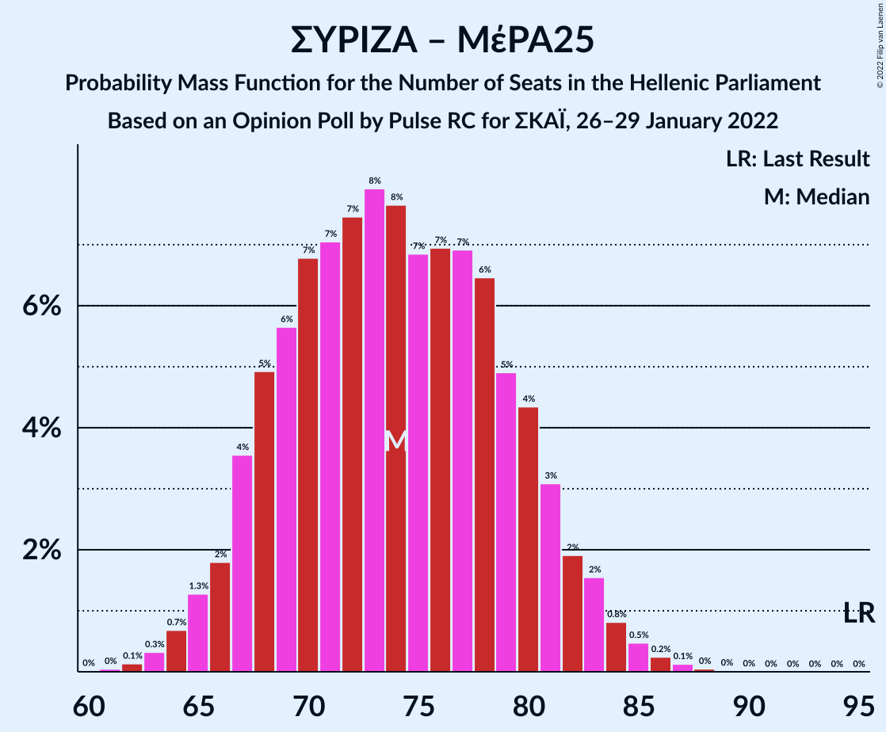

| Number of Seats | Probability | Accumulated | Special Marks |
|:---------------:|:-----------:|:-----------:|:-------------:|
| 61 | 0% | 100% |  |
| 62 | 0.1% | 99.9% |  |
| 63 | 0.3% | 99.8% |  |
| 64 | 0.7% | 99.5% |  |
| 65 | 1.3% | 98.8% |  |
| 66 | 2% | 98% |  |
| 67 | 4% | 96% |  |
| 68 | 5% | 92% |  |
| 69 | 6% | 87% |  |
| 70 | 7% | 82% | Median |
| 71 | 7% | 75% |  |
| 72 | 7% | 68% |  |
| 73 | 8% | 60% |  |
| 74 | 8% | 52% |  |
| 75 | 7% | 45% |  |
| 76 | 7% | 38% |  |
| 77 | 7% | 31% |  |
| 78 | 6% | 24% |  |
| 79 | 5% | 18% |  |
| 80 | 4% | 13% |  |
| 81 | 3% | 8% |  |
| 82 | 2% | 5% |  |
| 83 | 2% | 3% |  |
| 84 | 0.8% | 2% |  |
| 85 | 0.5% | 0.9% |  |
| 86 | 0.2% | 0.5% |  |
| 87 | 0.1% | 0.2% |  |
| 88 | 0% | 0.1% |  |
| 89 | 0% | 0% |  |
| 90 | 0% | 0% |  |
| 91 | 0% | 0% |  |
| 92 | 0% | 0% |  |
| 93 | 0% | 0% |  |
| 94 | 0% | 0% |  |
| 95 | 0% | 0% | Last Result |

### Συνασπισμός Ριζοσπαστικής Αριστεράς

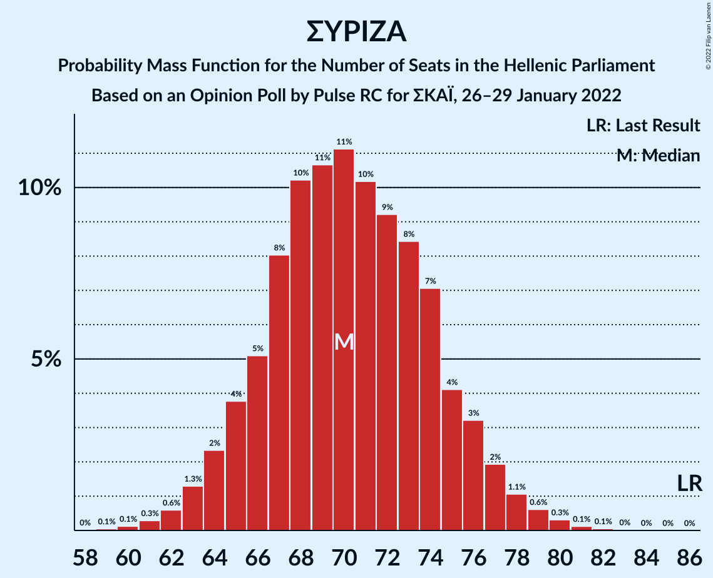

| Number of Seats | Probability | Accumulated | Special Marks |
|:---------------:|:-----------:|:-----------:|:-------------:|
| 59 | 0.1% | 100% |  |
| 60 | 0.1% | 99.9% |  |
| 61 | 0.3% | 99.8% |  |
| 62 | 0.6% | 99.5% |  |
| 63 | 1.3% | 98.9% |  |
| 64 | 2% | 98% |  |
| 65 | 4% | 95% |  |
| 66 | 5% | 92% |  |
| 67 | 8% | 86% |  |
| 68 | 10% | 78% |  |
| 69 | 11% | 68% |  |
| 70 | 11% | 57% | Median |
| 71 | 10% | 46% |  |
| 72 | 9% | 36% |  |
| 73 | 8% | 27% |  |
| 74 | 7% | 19% |  |
| 75 | 4% | 11% |  |
| 76 | 3% | 7% |  |
| 77 | 2% | 4% |  |
| 78 | 1.1% | 2% |  |
| 79 | 0.6% | 1.1% |  |
| 80 | 0.3% | 0.5% |  |
| 81 | 0.1% | 0.2% |  |
| 82 | 0.1% | 0.1% |  |
| 83 | 0% | 0% |  |
| 84 | 0% | 0% |  |
| 85 | 0% | 0% |  |
| 86 | 0% | 0% | Last Result |

## Technical Information

### Opinion Poll

+ **Polling firm:** Pulse RC
+ **Commissioner(s):** ΣΚΑΪ
+ **Fieldwork period:** 26–29 January 2022

### Calculations

+ **Sample size:** 1308
+ **Simulations done:** 1,048,576
+ **Error estimate:** 0.93%

