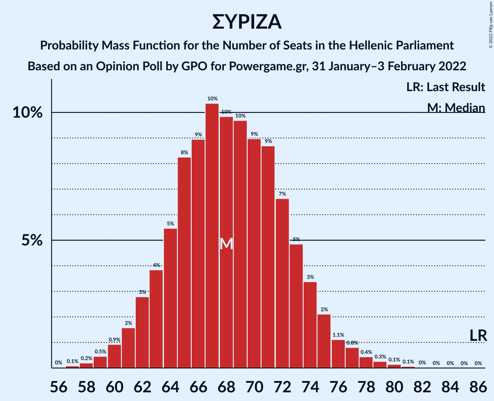

# Opinion Poll by GPO for Powergame.gr, 31 January–3 February 2022

<a href="#voting-intentions">Voting Intentions</a> | <a href="#seats">Seats</a> | <a href="#coalitions">Coalitions</a> | <a href="#technical-information">Technical Information</a>

## Voting Intentions

### Confidence Intervals

| Party | Last Result | Poll Result | 80% Confidence Interval | 90% Confidence Interval | 95% Confidence Interval | 99% Confidence Interval |
|:-----:|:-----------:|:-----------:|:-----------------------:|:-----------------------:|:-----------------------:|:-----------------------:|
| Νέα Δημοκρατία | 39.8% | 36.2% | 34.3–38.2% |33.7–38.7% |33.3–39.2% |32.4–40.2% |
| Συνασπισμός Ριζοσπαστικής Αριστεράς | 31.5% | 25.5% | 23.8–27.3% |23.3–27.8% |22.9–28.3% |22.1–29.2% |
| Κίνημα Αλλαγής | 8.1% | 16.7% | 15.3–18.3% |14.9–18.7% |14.5–19.1% |13.9–19.9% |
| Κομμουνιστικό Κόμμα Ελλάδας | 5.3% | 7.2% | 6.2–8.4% |6.0–8.7% |5.7–9.0% |5.3–9.6% |
| Ελληνική Λύση | 3.7% | 4.5% | 3.8–5.5% |3.6–5.7% |3.4–6.0% |3.0–6.5% |
| Μέτωπο Ευρωπαϊκής Ρεαλιστικής Ανυπακοής | 3.4% | 3.5% | 2.9–4.4% |2.7–4.6% |2.5–4.8% |2.2–5.3% |

*Note:* The poll result column reflects the actual value used in the calculations. Published results may vary slightly, and in addition be rounded to fewer digits.

## Seats

### Confidence Intervals

| Party | Last Result | Median | 80% Confidence Interval | 90% Confidence Interval | 95% Confidence Interval | 99% Confidence Interval |
|:-----:|:-----------:|:------:|:-----------------------:|:-----------------------:|:-----------------------:|:-----------------------:|
| <a href="#νέα-δημοκρατία">Νέα Δημοκρατία</a> | 158 | 147 | 141–152 |140–154 |139–156 |136–158 |
| <a href="#συνασπισμός-ριζοσπαστικής-αριστεράς">Συνασπισμός Ριζοσπαστικής Αριστεράς</a> | 86 | 68 | 64–73 |62–74 |61–76 |59–79 |
| <a href="#κίνημα-αλλαγής">Κίνημα Αλλαγής</a> | 22 | 45 | 41–49 |40–50 |39–51 |37–53 |
| <a href="#κομμουνιστικό-κόμμα-ελλάδας">Κομμουνιστικό Κόμμα Ελλάδας</a> | 15 | 20 | 17–22 |16–23 |16–24 |14–25 |
| <a href="#ελληνική-λύση">Ελληνική Λύση</a> | 10 | 12 | 10–15 |10–15 |9–16 |8–17 |
| <a href="#μέτωπο-ευρωπαϊκής-ρεαλιστικής-ανυπακοής">Μέτωπο Ευρωπαϊκής Ρεαλιστικής Ανυπακοής</a> | 9 | 9 | 0–12 |0–12 |0–13 |0–14 |

### Νέα Δημοκρατία

*For a full overview of the results for this party, see the [Νέα Δημοκρατία](party-νέαδημοκρατία.html) page.*

| Number of Seats | Probability | Accumulated | Special Marks |
|:---------------:|:-----------:|:-----------:|:-------------:|
| 134 | 0.1% | 100% |  |
| 135 | 0.1% | 99.9% |  |
| 136 | 0.3% | 99.7% |  |
| 137 | 0.6% | 99.4% |  |
| 138 | 0.9% | 98.9% |  |
| 139 | 2% | 98% |  |
| 140 | 3% | 96% |  |
| 141 | 4% | 94% |  |
| 142 | 5% | 90% |  |
| 143 | 6% | 84% |  |
| 144 | 7% | 78% |  |
| 145 | 10% | 71% |  |
| 146 | 9% | 61% |  |
| 147 | 9% | 52% | Median |
| 148 | 9% | 43% |  |
| 149 | 9% | 34% |  |
| 150 | 7% | 26% |  |
| 151 | 6% | 19% | Majority |
| 152 | 4% | 13% |  |
| 153 | 3% | 9% |  |
| 154 | 2% | 6% |  |
| 155 | 2% | 4% |  |
| 156 | 1.0% | 3% |  |
| 157 | 0.7% | 2% |  |
| 158 | 0.4% | 0.8% | Last Result |
| 159 | 0.2% | 0.4% |  |
| 160 | 0.1% | 0.2% |  |
| 161 | 0.1% | 0.1% |  |
| 162 | 0% | 0.1% |  |
| 163 | 0% | 0% |  |

### Συνασπισμός Ριζοσπαστικής Αριστεράς

*For a full overview of the results for this party, see the [Συνασπισμός Ριζοσπαστικής Αριστεράς](party-συνασπισμόςριζοσπαστικήςαριστεράς.html) page.*

| Number of Seats | Probability | Accumulated | Special Marks |
|:---------------:|:-----------:|:-----------:|:-------------:|
| 57 | 0.1% | 100% |  |
| 58 | 0.2% | 99.9% |  |
| 59 | 0.5% | 99.7% |  |
| 60 | 0.9% | 99.2% |  |
| 61 | 2% | 98% |  |
| 62 | 3% | 97% |  |
| 63 | 4% | 94% |  |
| 64 | 5% | 90% |  |
| 65 | 8% | 85% |  |
| 66 | 9% | 76% |  |
| 67 | 10% | 67% |  |
| 68 | 10% | 57% | Median |
| 69 | 10% | 47% |  |
| 70 | 9% | 38% |  |
| 71 | 9% | 29% |  |
| 72 | 7% | 20% |  |
| 73 | 5% | 13% |  |
| 74 | 3% | 8% |  |
| 75 | 2% | 5% |  |
| 76 | 1.1% | 3% |  |
| 77 | 0.8% | 2% |  |
| 78 | 0.4% | 1.0% |  |
| 79 | 0.3% | 0.5% |  |
| 80 | 0.1% | 0.3% |  |
| 81 | 0.1% | 0.1% |  |
| 82 | 0% | 0.1% |  |
| 83 | 0% | 0% |  |
| 84 | 0% | 0% |  |
| 85 | 0% | 0% |  |
| 86 | 0% | 0% | Last Result |

### Κίνημα Αλλαγής

*For a full overview of the results for this party, see the [Κίνημα Αλλαγής](party-κίνημααλλαγής.html) page.*

| Number of Seats | Probability | Accumulated | Special Marks |
|:---------------:|:-----------:|:-----------:|:-------------:|
| 22 | 0% | 100% | Last Result |
| 23 | 0% | 100% |  |
| 24 | 0% | 100% |  |
| 25 | 0% | 100% |  |
| 26 | 0% | 100% |  |
| 27 | 0% | 100% |  |
| 28 | 0% | 100% |  |
| 29 | 0% | 100% |  |
| 30 | 0% | 100% |  |
| 31 | 0% | 100% |  |
| 32 | 0% | 100% |  |
| 33 | 0% | 100% |  |
| 34 | 0% | 100% |  |
| 35 | 0.1% | 100% |  |
| 36 | 0.2% | 99.9% |  |
| 37 | 0.5% | 99.7% |  |
| 38 | 1.1% | 99.2% |  |
| 39 | 2% | 98% |  |
| 40 | 4% | 96% |  |
| 41 | 6% | 91% |  |
| 42 | 9% | 85% |  |
| 43 | 11% | 77% |  |
| 44 | 13% | 66% |  |
| 45 | 13% | 53% | Median |
| 46 | 11% | 41% |  |
| 47 | 9% | 30% |  |
| 48 | 8% | 21% |  |
| 49 | 5% | 12% |  |
| 50 | 3% | 8% |  |
| 51 | 2% | 4% |  |
| 52 | 1.0% | 2% |  |
| 53 | 0.5% | 1.0% |  |
| 54 | 0.3% | 0.5% |  |
| 55 | 0.1% | 0.2% |  |
| 56 | 0% | 0.1% |  |
| 57 | 0% | 0% |  |

### Κομμουνιστικό Κόμμα Ελλάδας

*For a full overview of the results for this party, see the [Κομμουνιστικό Κόμμα Ελλάδας](party-κομμουνιστικόκόμμαελλάδας.html) page.*

| Number of Seats | Probability | Accumulated | Special Marks |
|:---------------:|:-----------:|:-----------:|:-------------:|
| 13 | 0.2% | 100% |  |
| 14 | 0.6% | 99.8% |  |
| 15 | 1.2% | 99.2% | Last Result |
| 16 | 7% | 98% |  |
| 17 | 15% | 91% |  |
| 18 | 11% | 77% |  |
| 19 | 12% | 66% |  |
| 20 | 22% | 54% | Median |
| 21 | 17% | 32% |  |
| 22 | 6% | 15% |  |
| 23 | 4% | 9% |  |
| 24 | 3% | 5% |  |
| 25 | 1.1% | 2% |  |
| 26 | 0.3% | 0.4% |  |
| 27 | 0.1% | 0.2% |  |
| 28 | 0% | 0.1% |  |
| 29 | 0% | 0% |  |

### Ελληνική Λύση

*For a full overview of the results for this party, see the [Ελληνική Λύση](party-ελληνικήλύση.html) page.*

| Number of Seats | Probability | Accumulated | Special Marks |
|:---------------:|:-----------:|:-----------:|:-------------:|
| 0 | 0.4% | 100% |  |
| 1 | 0% | 99.6% |  |
| 2 | 0% | 99.6% |  |
| 3 | 0% | 99.6% |  |
| 4 | 0% | 99.6% |  |
| 5 | 0% | 99.6% |  |
| 6 | 0% | 99.6% |  |
| 7 | 0% | 99.6% |  |
| 8 | 0.6% | 99.6% |  |
| 9 | 4% | 99.0% |  |
| 10 | 11% | 95% | Last Result |
| 11 | 18% | 84% |  |
| 12 | 23% | 66% | Median |
| 13 | 18% | 43% |  |
| 14 | 14% | 25% |  |
| 15 | 7% | 11% |  |
| 16 | 3% | 4% |  |
| 17 | 1.0% | 1.4% |  |
| 18 | 0.3% | 0.4% |  |
| 19 | 0.1% | 0.1% |  |
| 20 | 0% | 0% |  |

### Μέτωπο Ευρωπαϊκής Ρεαλιστικής Ανυπακοής

*For a full overview of the results for this party, see the [Μέτωπο Ευρωπαϊκής Ρεαλιστικής Ανυπακοής](party-μέτωποευρωπαϊκήςρεαλιστικήςανυπακοής.html) page.*

| Number of Seats | Probability | Accumulated | Special Marks |
|:---------------:|:-----------:|:-----------:|:-------------:|
| 0 | 17% | 100% |  |
| 1 | 0% | 83% |  |
| 2 | 0% | 83% |  |
| 3 | 0% | 83% |  |
| 4 | 0% | 83% |  |
| 5 | 0% | 83% |  |
| 6 | 0% | 83% |  |
| 7 | 0% | 83% |  |
| 8 | 10% | 83% |  |
| 9 | 24% | 73% | Last Result, Median |
| 10 | 22% | 49% |  |
| 11 | 16% | 26% |  |
| 12 | 7% | 11% |  |
| 13 | 2% | 4% |  |
| 14 | 0.8% | 1.1% |  |
| 15 | 0.2% | 0.3% |  |
| 16 | 0% | 0.1% |  |
| 17 | 0% | 0% |  |

## Coalitions

### Confidence Intervals

| Coalition | Last Result | Median | Majority? | 80% Confidence Interval | 90% Confidence Interval | 95% Confidence Interval | 99% Confidence Interval |
|:---------:|:-----------:|:------:|:---------:|:-----------------------:|:-----------------------:|:-----------------------:|:-----------------------:|
| Νέα Δημοκρατία – Κίνημα Αλλαγής | 180 | 191 | 100% | 186–198 | 184–200 | 183–201 | 181–204 |
| Νέα Δημοκρατία | 158 | 147 | 19% | 141–152 | 140–154 | 139–156 | 136–158 |
| Συνασπισμός Ριζοσπαστικής Αριστεράς – Μέτωπο Ευρωπαϊκής Ρεαλιστικής Ανυπακοής | 95 | 77 | 0% | 71–82 | 68–84 | 67–85 | 64–87 |
| Συνασπισμός Ριζοσπαστικής Αριστεράς | 86 | 68 | 0% | 64–73 | 62–74 | 61–76 | 59–79 |

### Νέα Δημοκρατία – Κίνημα Αλλαγής

| Number of Seats | Probability | Accumulated | Special Marks |
|:---------------:|:-----------:|:-----------:|:-------------:|
| 178 | 0.1% | 100% |  |
| 179 | 0.1% | 99.9% |  |
| 180 | 0.2% | 99.8% | Last Result |
| 181 | 0.5% | 99.5% |  |
| 182 | 0.8% | 99.0% |  |
| 183 | 1.2% | 98% |  |
| 184 | 2% | 97% |  |
| 185 | 3% | 94% |  |
| 186 | 5% | 92% |  |
| 187 | 5% | 87% |  |
| 188 | 6% | 82% |  |
| 189 | 8% | 75% |  |
| 190 | 9% | 67% |  |
| 191 | 9% | 58% |  |
| 192 | 9% | 50% | Median |
| 193 | 7% | 41% |  |
| 194 | 7% | 33% |  |
| 195 | 6% | 26% |  |
| 196 | 5% | 20% |  |
| 197 | 4% | 15% |  |
| 198 | 3% | 11% |  |
| 199 | 2% | 8% |  |
| 200 | 2% | 5% |  |
| 201 | 1.1% | 4% |  |
| 202 | 0.8% | 2% |  |
| 203 | 0.7% | 2% |  |
| 204 | 0.4% | 0.9% |  |
| 205 | 0.2% | 0.5% |  |
| 206 | 0.1% | 0.3% |  |
| 207 | 0.1% | 0.1% |  |
| 208 | 0% | 0.1% |  |
| 209 | 0% | 0% |  |

### Νέα Δημοκρατία

| Number of Seats | Probability | Accumulated | Special Marks |
|:---------------:|:-----------:|:-----------:|:-------------:|
| 134 | 0.1% | 100% |  |
| 135 | 0.1% | 99.9% |  |
| 136 | 0.3% | 99.7% |  |
| 137 | 0.6% | 99.4% |  |
| 138 | 0.9% | 98.9% |  |
| 139 | 2% | 98% |  |
| 140 | 3% | 96% |  |
| 141 | 4% | 94% |  |
| 142 | 5% | 90% |  |
| 143 | 6% | 84% |  |
| 144 | 7% | 78% |  |
| 145 | 10% | 71% |  |
| 146 | 9% | 61% |  |
| 147 | 9% | 52% | Median |
| 148 | 9% | 43% |  |
| 149 | 9% | 34% |  |
| 150 | 7% | 26% |  |
| 151 | 6% | 19% | Majority |
| 152 | 4% | 13% |  |
| 153 | 3% | 9% |  |
| 154 | 2% | 6% |  |
| 155 | 2% | 4% |  |
| 156 | 1.0% | 3% |  |
| 157 | 0.7% | 2% |  |
| 158 | 0.4% | 0.8% | Last Result |
| 159 | 0.2% | 0.4% |  |
| 160 | 0.1% | 0.2% |  |
| 161 | 0.1% | 0.1% |  |
| 162 | 0% | 0.1% |  |
| 163 | 0% | 0% |  |

### Συνασπισμός Ριζοσπαστικής Αριστεράς – Μέτωπο Ευρωπαϊκής Ρεαλιστικής Ανυπακοής

| Number of Seats | Probability | Accumulated | Special Marks |
|:---------------:|:-----------:|:-----------:|:-------------:|
| 61 | 0% | 100% |  |
| 62 | 0.1% | 99.9% |  |
| 63 | 0.2% | 99.8% |  |
| 64 | 0.3% | 99.6% |  |
| 65 | 0.7% | 99.3% |  |
| 66 | 0.9% | 98.6% |  |
| 67 | 1.4% | 98% |  |
| 68 | 2% | 96% |  |
| 69 | 2% | 94% |  |
| 70 | 2% | 92% |  |
| 71 | 4% | 90% |  |
| 72 | 4% | 86% |  |
| 73 | 5% | 81% |  |
| 74 | 6% | 76% |  |
| 75 | 8% | 70% |  |
| 76 | 9% | 62% |  |
| 77 | 9% | 54% | Median |
| 78 | 9% | 45% |  |
| 79 | 8% | 36% |  |
| 80 | 8% | 27% |  |
| 81 | 5% | 19% |  |
| 82 | 5% | 14% |  |
| 83 | 3% | 9% |  |
| 84 | 3% | 6% |  |
| 85 | 1.3% | 3% |  |
| 86 | 0.9% | 2% |  |
| 87 | 0.4% | 0.9% |  |
| 88 | 0.2% | 0.5% |  |
| 89 | 0.1% | 0.2% |  |
| 90 | 0.1% | 0.1% |  |
| 91 | 0% | 0% |  |
| 92 | 0% | 0% |  |
| 93 | 0% | 0% |  |
| 94 | 0% | 0% |  |
| 95 | 0% | 0% | Last Result |

### Συνασπισμός Ριζοσπαστικής Αριστεράς

| Number of Seats | Probability | Accumulated | Special Marks |
|:---------------:|:-----------:|:-----------:|:-------------:|
| 57 | 0.1% | 100% |  |
| 58 | 0.2% | 99.9% |  |
| 59 | 0.5% | 99.7% |  |
| 60 | 0.9% | 99.2% |  |
| 61 | 2% | 98% |  |
| 62 | 3% | 97% |  |
| 63 | 4% | 94% |  |
| 64 | 5% | 90% |  |
| 65 | 8% | 85% |  |
| 66 | 9% | 76% |  |
| 67 | 10% | 67% |  |
| 68 | 10% | 57% | Median |
| 69 | 10% | 47% |  |
| 70 | 9% | 38% |  |
| 71 | 9% | 29% |  |
| 72 | 7% | 20% |  |
| 73 | 5% | 13% |  |
| 74 | 3% | 8% |  |
| 75 | 2% | 5% |  |
| 76 | 1.1% | 3% |  |
| 77 | 0.8% | 2% |  |
| 78 | 0.4% | 1.0% |  |
| 79 | 0.3% | 0.5% |  |
| 80 | 0.1% | 0.3% |  |
| 81 | 0.1% | 0.1% |  |
| 82 | 0% | 0.1% |  |
| 83 | 0% | 0% |  |
| 84 | 0% | 0% |  |
| 85 | 0% | 0% |  |
| 86 | 0% | 0% | Last Result |

## Technical Information

### Opinion Poll

+ **Polling firm:** GPO
+ **Commissioner(s):** Powergame.gr
+ **Fieldwork period:** 31 January–3 February 2022

### Calculations

+ **Sample size:** 1000
+ **Simulations done:** 1,048,576
+ **Error estimate:** 0.78%

