# Opinion Poll by Marc for ANT1, 8–12 February 2022

<a href="#voting-intentions">Voting Intentions</a> | <a href="#seats">Seats</a> | <a href="#coalitions">Coalitions</a> | <a href="#technical-information">Technical Information</a>

## Voting Intentions

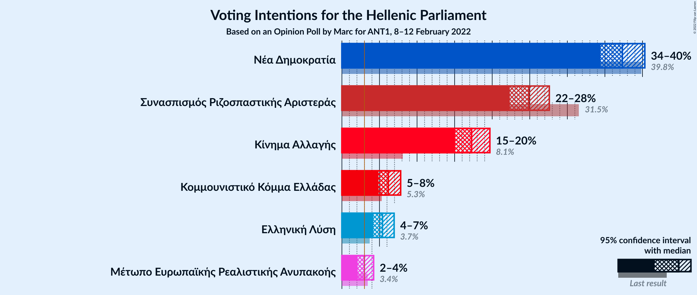

### Confidence Intervals

| Party | Last Result | Poll Result | 80% Confidence Interval | 90% Confidence Interval | 95% Confidence Interval | 99% Confidence Interval |
|:-----:|:-----------:|:-----------:|:-----------------------:|:-----------------------:|:-----------------------:|:-----------------------:|
| Νέα Δημοκρατία | 39.8% | 37.3% | 35.4–39.3% |34.9–39.8% |34.4–40.3% |33.5–41.3% |
| Συνασπισμός Ριζοσπαστικής Αριστεράς | 31.5% | 24.9% | 23.2–26.7% |22.7–27.2% |22.3–27.6% |21.6–28.5% |
| Κίνημα Αλλαγής | 8.1% | 17.3% | 15.8–18.9% |15.4–19.3% |15.1–19.7% |14.4–20.5% |
| Κομμουνιστικό Κόμμα Ελλάδας | 5.3% | 6.2% | 5.3–7.2% |5.1–7.5% |4.9–7.8% |4.5–8.4% |
| Ελληνική Λύση | 3.7% | 5.4% | 4.6–6.4% |4.4–6.7% |4.2–7.0% |3.8–7.5% |
| Μέτωπο Ευρωπαϊκής Ρεαλιστικής Ανυπακοής | 3.4% | 3.0% | 2.4–3.8% |2.2–4.0% |2.1–4.2% |1.9–4.6% |

*Note:* The poll result column reflects the actual value used in the calculations. Published results may vary slightly, and in addition be rounded to fewer digits.

## Seats

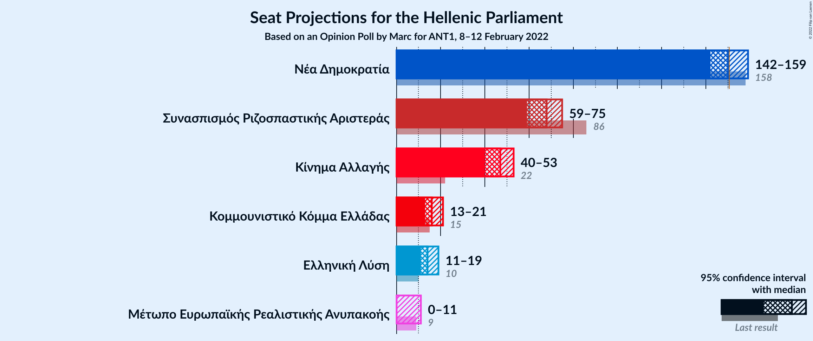

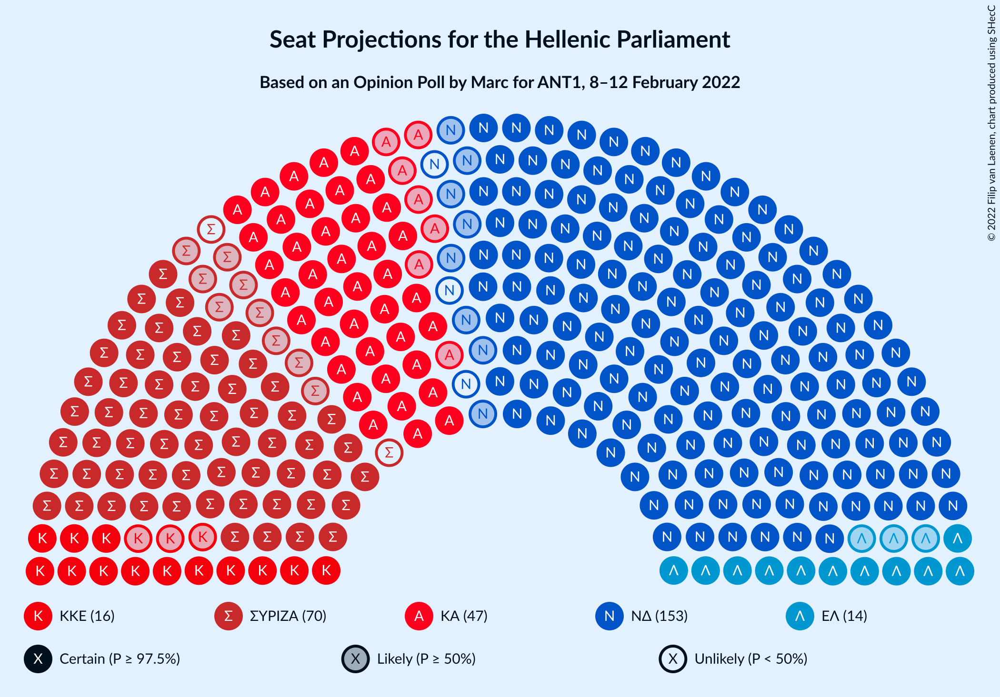

### Confidence Intervals

| Party | Last Result | Median | 80% Confidence Interval | 90% Confidence Interval | 95% Confidence Interval | 99% Confidence Interval |
|:-----:|:-----------:|:------:|:-----------------------:|:-----------------------:|:-----------------------:|:-----------------------:|
| <a href="#νέα-δημοκρατία">Νέα Δημοκρατία</a> | 158 | 150 | 145–156 |143–157 |142–159 |139–161 |
| <a href="#συνασπισμός-ριζοσπαστικής-αριστεράς">Συνασπισμός Ριζοσπαστικής Αριστεράς</a> | 86 | 68 | 62–72 |60–74 |59–75 |57–76 |
| <a href="#κίνημα-αλλαγής">Κίνημα Αλλαγής</a> | 22 | 47 | 43–51 |41–52 |40–53 |39–55 |
| <a href="#κομμουνιστικό-κόμμα-ελλάδας">Κομμουνιστικό Κόμμα Ελλάδας</a> | 15 | 16 | 14–19 |13–20 |13–21 |12–23 |
| <a href="#ελληνική-λύση">Ελληνική Λύση</a> | 10 | 14 | 12–17 |12–18 |11–19 |10–20 |
| <a href="#μέτωπο-ευρωπαϊκής-ρεαλιστικής-ανυπακοής">Μέτωπο Ευρωπαϊκής Ρεαλιστικής Ανυπακοής</a> | 9 | 0 | 0–10 |0–11 |0–11 |0–12 |

### Νέα Δημοκρατία

*For a full overview of the results for this party, see the [Νέα Δημοκρατία](party-νέαδημοκρατία.html) page.*

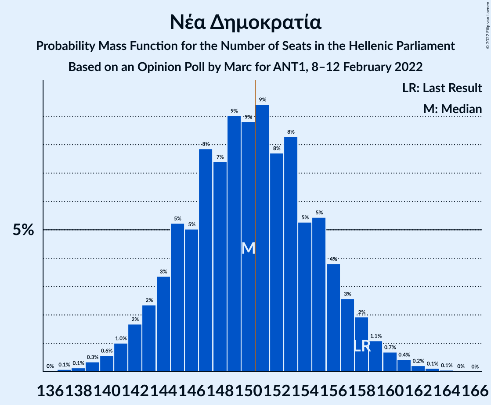

| Number of Seats | Probability | Accumulated | Special Marks |
|:---------------:|:-----------:|:-----------:|:-------------:|
| 137 | 0.1% | 100% |  |
| 138 | 0.1% | 99.9% |  |
| 139 | 0.3% | 99.7% |  |
| 140 | 0.6% | 99.4% |  |
| 141 | 1.0% | 98.8% |  |
| 142 | 2% | 98% |  |
| 143 | 2% | 96% |  |
| 144 | 3% | 94% |  |
| 145 | 5% | 90% |  |
| 146 | 5% | 85% |  |
| 147 | 8% | 80% |  |
| 148 | 7% | 72% |  |
| 149 | 9% | 65% |  |
| 150 | 9% | 56% | Median |
| 151 | 9% | 47% | Majority |
| 152 | 8% | 38% |  |
| 153 | 8% | 30% |  |
| 154 | 5% | 22% |  |
| 155 | 5% | 16% |  |
| 156 | 4% | 11% |  |
| 157 | 3% | 7% |  |
| 158 | 2% | 5% | Last Result |
| 159 | 1.1% | 3% |  |
| 160 | 0.7% | 2% |  |
| 161 | 0.4% | 0.9% |  |
| 162 | 0.2% | 0.4% |  |
| 163 | 0.1% | 0.2% |  |
| 164 | 0.1% | 0.1% |  |
| 165 | 0% | 0% |  |

### Συνασπισμός Ριζοσπαστικής Αριστεράς

*For a full overview of the results for this party, see the [Συνασπισμός Ριζοσπαστικής Αριστεράς](party-συνασπισμόςριζοσπαστικήςαριστεράς.html) page.*

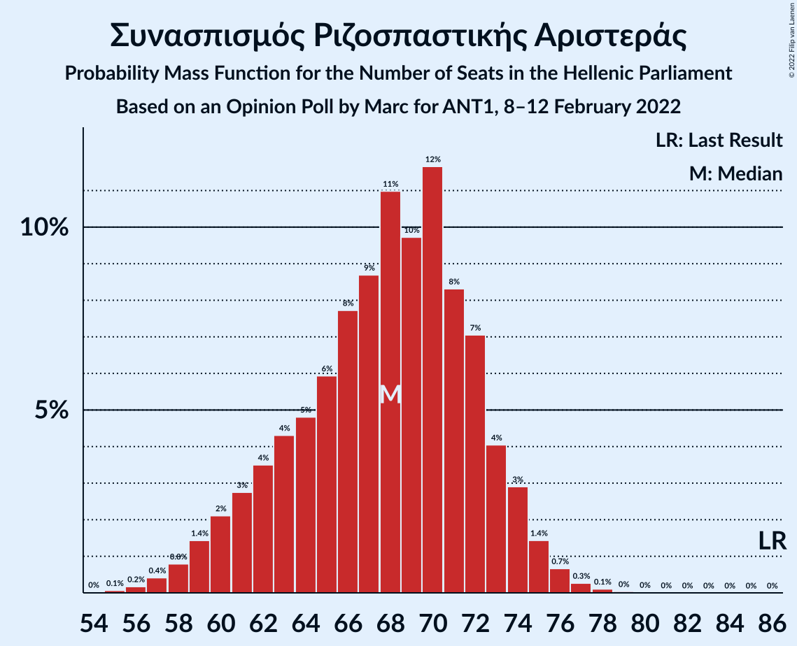

| Number of Seats | Probability | Accumulated | Special Marks |
|:---------------:|:-----------:|:-----------:|:-------------:|
| 55 | 0.1% | 100% |  |
| 56 | 0.2% | 99.9% |  |
| 57 | 0.4% | 99.7% |  |
| 58 | 0.8% | 99.3% |  |
| 59 | 1.4% | 98.5% |  |
| 60 | 2% | 97% |  |
| 61 | 3% | 95% |  |
| 62 | 4% | 92% |  |
| 63 | 4% | 89% |  |
| 64 | 5% | 84% |  |
| 65 | 6% | 80% |  |
| 66 | 8% | 74% |  |
| 67 | 9% | 66% |  |
| 68 | 11% | 57% | Median |
| 69 | 10% | 46% |  |
| 70 | 12% | 37% |  |
| 71 | 8% | 25% |  |
| 72 | 7% | 17% |  |
| 73 | 4% | 10% |  |
| 74 | 3% | 5% |  |
| 75 | 1.4% | 3% |  |
| 76 | 0.7% | 1.1% |  |
| 77 | 0.3% | 0.4% |  |
| 78 | 0.1% | 0.2% |  |
| 79 | 0% | 0.1% |  |
| 80 | 0% | 0% |  |
| 81 | 0% | 0% |  |
| 82 | 0% | 0% |  |
| 83 | 0% | 0% |  |
| 84 | 0% | 0% |  |
| 85 | 0% | 0% |  |
| 86 | 0% | 0% | Last Result |

### Κίνημα Αλλαγής

*For a full overview of the results for this party, see the [Κίνημα Αλλαγής](party-κίνημααλλαγής.html) page.*

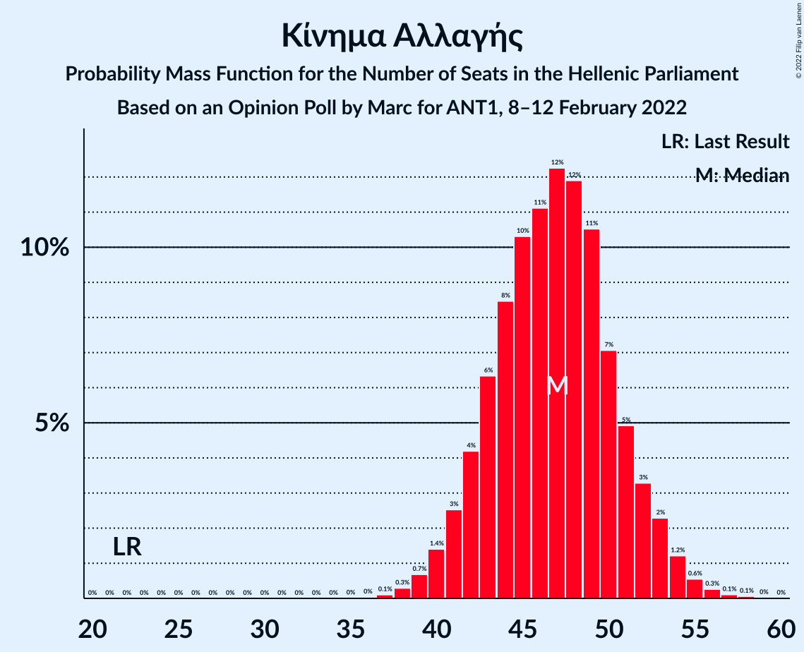

| Number of Seats | Probability | Accumulated | Special Marks |
|:---------------:|:-----------:|:-----------:|:-------------:|
| 22 | 0% | 100% | Last Result |
| 23 | 0% | 100% |  |
| 24 | 0% | 100% |  |
| 25 | 0% | 100% |  |
| 26 | 0% | 100% |  |
| 27 | 0% | 100% |  |
| 28 | 0% | 100% |  |
| 29 | 0% | 100% |  |
| 30 | 0% | 100% |  |
| 31 | 0% | 100% |  |
| 32 | 0% | 100% |  |
| 33 | 0% | 100% |  |
| 34 | 0% | 100% |  |
| 35 | 0% | 100% |  |
| 36 | 0% | 100% |  |
| 37 | 0.1% | 99.9% |  |
| 38 | 0.3% | 99.8% |  |
| 39 | 0.7% | 99.5% |  |
| 40 | 1.4% | 98.9% |  |
| 41 | 3% | 97% |  |
| 42 | 4% | 95% |  |
| 43 | 6% | 91% |  |
| 44 | 8% | 84% |  |
| 45 | 10% | 76% |  |
| 46 | 11% | 66% |  |
| 47 | 12% | 54% | Median |
| 48 | 12% | 42% |  |
| 49 | 11% | 30% |  |
| 50 | 7% | 20% |  |
| 51 | 5% | 13% |  |
| 52 | 3% | 8% |  |
| 53 | 2% | 5% |  |
| 54 | 1.2% | 2% |  |
| 55 | 0.6% | 1.0% |  |
| 56 | 0.3% | 0.5% |  |
| 57 | 0.1% | 0.2% |  |
| 58 | 0.1% | 0.1% |  |
| 59 | 0% | 0% |  |

### Κομμουνιστικό Κόμμα Ελλάδας

*For a full overview of the results for this party, see the [Κομμουνιστικό Κόμμα Ελλάδας](party-κομμουνιστικόκόμμαελλάδας.html) page.*

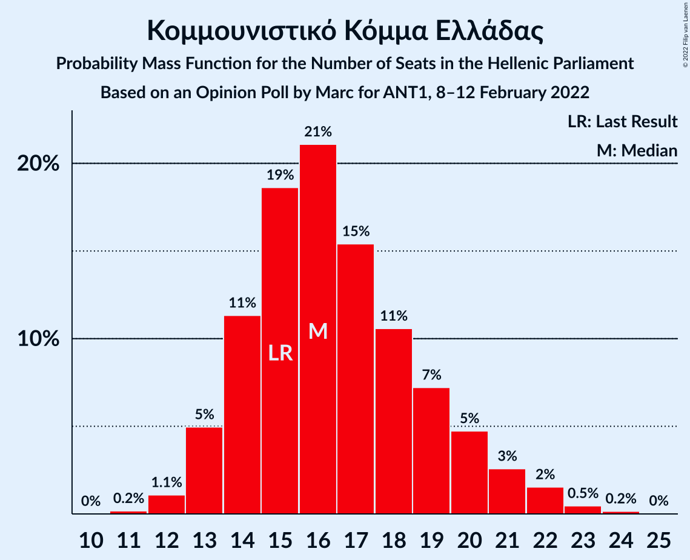

| Number of Seats | Probability | Accumulated | Special Marks |
|:---------------:|:-----------:|:-----------:|:-------------:|
| 11 | 0.2% | 100% |  |
| 12 | 1.1% | 99.8% |  |
| 13 | 5% | 98.7% |  |
| 14 | 11% | 94% |  |
| 15 | 19% | 82% | Last Result |
| 16 | 21% | 64% | Median |
| 17 | 15% | 43% |  |
| 18 | 11% | 27% |  |
| 19 | 7% | 17% |  |
| 20 | 5% | 10% |  |
| 21 | 3% | 5% |  |
| 22 | 2% | 2% |  |
| 23 | 0.5% | 0.7% |  |
| 24 | 0.2% | 0.2% |  |
| 25 | 0% | 0% |  |

### Ελληνική Λύση

*For a full overview of the results for this party, see the [Ελληνική Λύση](party-ελληνικήλύση.html) page.*

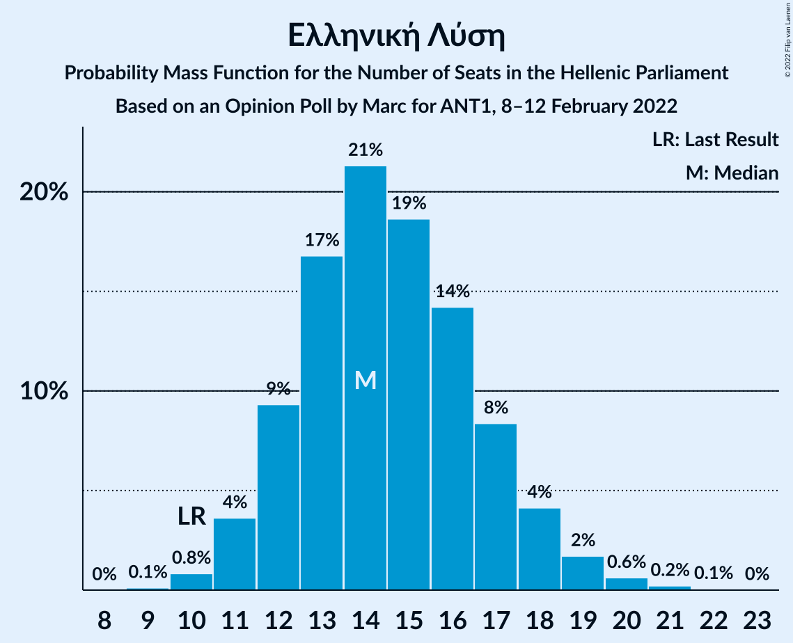

| Number of Seats | Probability | Accumulated | Special Marks |
|:---------------:|:-----------:|:-----------:|:-------------:|
| 9 | 0.1% | 100% |  |
| 10 | 0.8% | 99.9% | Last Result |
| 11 | 4% | 99.0% |  |
| 12 | 9% | 95% |  |
| 13 | 17% | 86% |  |
| 14 | 21% | 69% | Median |
| 15 | 19% | 48% |  |
| 16 | 14% | 29% |  |
| 17 | 8% | 15% |  |
| 18 | 4% | 7% |  |
| 19 | 2% | 3% |  |
| 20 | 0.6% | 0.9% |  |
| 21 | 0.2% | 0.3% |  |
| 22 | 0.1% | 0.1% |  |
| 23 | 0% | 0% |  |

### Μέτωπο Ευρωπαϊκής Ρεαλιστικής Ανυπακοής

*For a full overview of the results for this party, see the [Μέτωπο Ευρωπαϊκής Ρεαλιστικής Ανυπακοής](party-μέτωποευρωπαϊκήςρεαλιστικήςανυπακοής.html) page.*

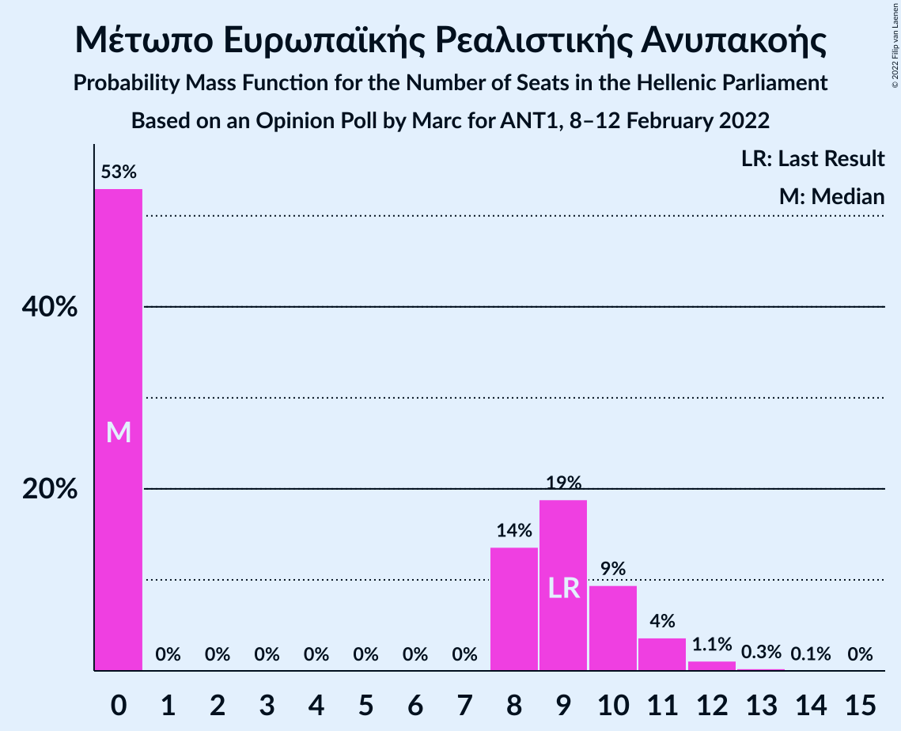

| Number of Seats | Probability | Accumulated | Special Marks |
|:---------------:|:-----------:|:-----------:|:-------------:|
| 0 | 53% | 100% | Median |
| 1 | 0% | 47% |  |
| 2 | 0% | 47% |  |
| 3 | 0% | 47% |  |
| 4 | 0% | 47% |  |
| 5 | 0% | 47% |  |
| 6 | 0% | 47% |  |
| 7 | 0% | 47% |  |
| 8 | 14% | 47% |  |
| 9 | 19% | 33% | Last Result |
| 10 | 9% | 15% |  |
| 11 | 4% | 5% |  |
| 12 | 1.1% | 1.4% |  |
| 13 | 0.3% | 0.3% |  |
| 14 | 0.1% | 0.1% |  |
| 15 | 0% | 0% |  |

## Coalitions

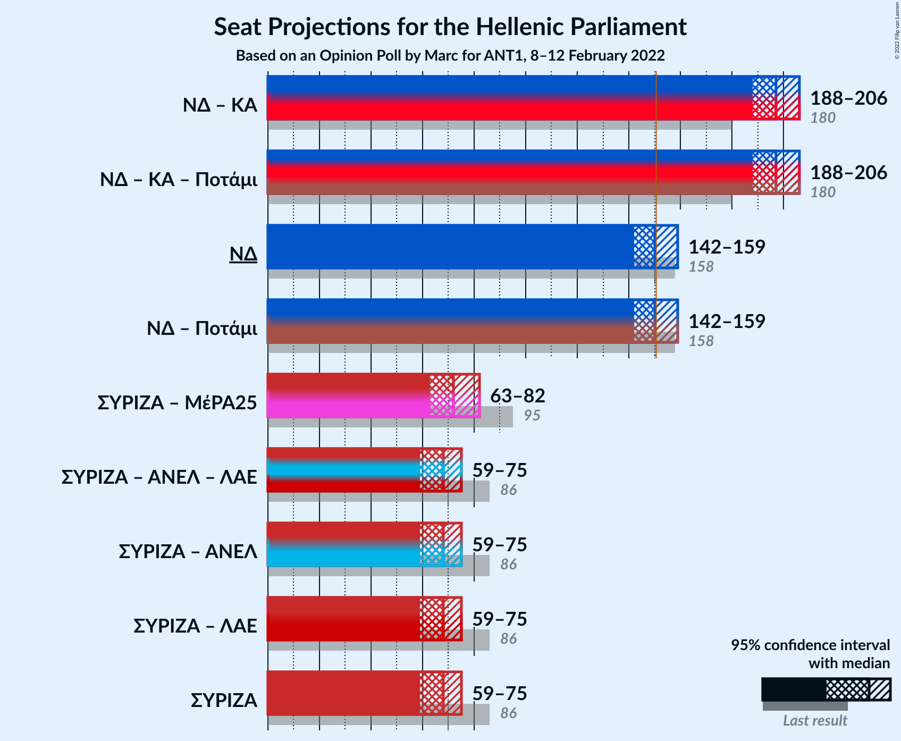

### Confidence Intervals

| Coalition | Last Result | Median | Majority? | 80% Confidence Interval | 90% Confidence Interval | 95% Confidence Interval | 99% Confidence Interval |
|:---------:|:-----------:|:------:|:---------:|:-----------------------:|:-----------------------:|:-----------------------:|:-----------------------:|
| Νέα Δημοκρατία – Κίνημα Αλλαγής | 180 | 197 | 100% | 191–203 | 189–205 | 188–206 | 185–209 |
| Νέα Δημοκρατία | 158 | 150 | 47% | 145–156 | 143–157 | 142–159 | 139–161 |
| Συνασπισμός Ριζοσπαστικής Αριστεράς – Μέτωπο Ευρωπαϊκής Ρεαλιστικής Ανυπακοής | 95 | 72 | 0% | 66–79 | 64–80 | 63–82 | 60–84 |
| Συνασπισμός Ριζοσπαστικής Αριστεράς | 86 | 68 | 0% | 62–72 | 60–74 | 59–75 | 57–76 |

### Νέα Δημοκρατία – Κίνημα Αλλαγής

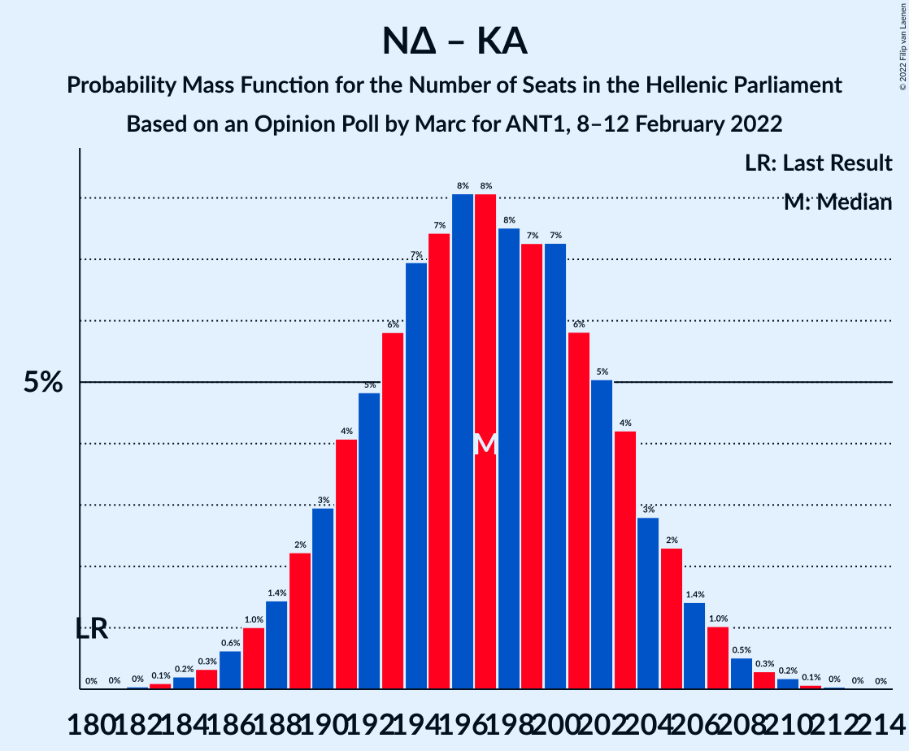

| Number of Seats | Probability | Accumulated | Special Marks |
|:---------------:|:-----------:|:-----------:|:-------------:|
| 180 | 0% | 100% | Last Result |
| 181 | 0% | 100% |  |
| 182 | 0% | 100% |  |
| 183 | 0.1% | 99.9% |  |
| 184 | 0.2% | 99.8% |  |
| 185 | 0.3% | 99.6% |  |
| 186 | 0.6% | 99.3% |  |
| 187 | 1.0% | 98.7% |  |
| 188 | 1.4% | 98% |  |
| 189 | 2% | 96% |  |
| 190 | 3% | 94% |  |
| 191 | 4% | 91% |  |
| 192 | 5% | 87% |  |
| 193 | 6% | 82% |  |
| 194 | 7% | 76% |  |
| 195 | 7% | 69% |  |
| 196 | 8% | 62% |  |
| 197 | 8% | 54% | Median |
| 198 | 8% | 46% |  |
| 199 | 7% | 38% |  |
| 200 | 7% | 31% |  |
| 201 | 6% | 24% |  |
| 202 | 5% | 18% |  |
| 203 | 4% | 13% |  |
| 204 | 3% | 9% |  |
| 205 | 2% | 6% |  |
| 206 | 1.4% | 4% |  |
| 207 | 1.0% | 2% |  |
| 208 | 0.5% | 1.1% |  |
| 209 | 0.3% | 0.6% |  |
| 210 | 0.2% | 0.3% |  |
| 211 | 0.1% | 0.1% |  |
| 212 | 0% | 0.1% |  |
| 213 | 0% | 0% |  |

### Νέα Δημοκρατία

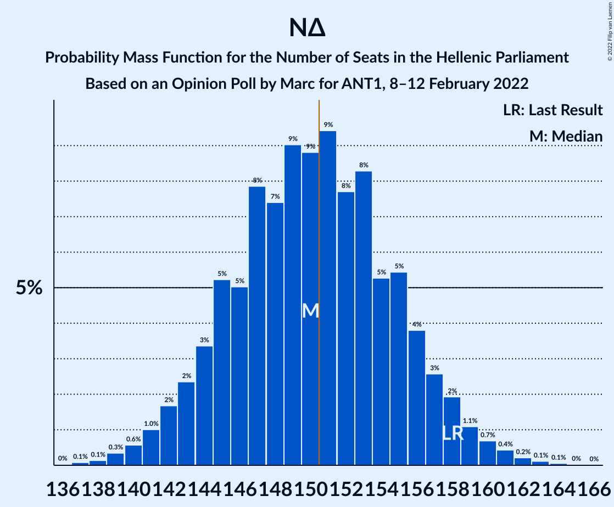

| Number of Seats | Probability | Accumulated | Special Marks |
|:---------------:|:-----------:|:-----------:|:-------------:|
| 137 | 0.1% | 100% |  |
| 138 | 0.1% | 99.9% |  |
| 139 | 0.3% | 99.7% |  |
| 140 | 0.6% | 99.4% |  |
| 141 | 1.0% | 98.8% |  |
| 142 | 2% | 98% |  |
| 143 | 2% | 96% |  |
| 144 | 3% | 94% |  |
| 145 | 5% | 90% |  |
| 146 | 5% | 85% |  |
| 147 | 8% | 80% |  |
| 148 | 7% | 72% |  |
| 149 | 9% | 65% |  |
| 150 | 9% | 56% | Median |
| 151 | 9% | 47% | Majority |
| 152 | 8% | 38% |  |
| 153 | 8% | 30% |  |
| 154 | 5% | 22% |  |
| 155 | 5% | 16% |  |
| 156 | 4% | 11% |  |
| 157 | 3% | 7% |  |
| 158 | 2% | 5% | Last Result |
| 159 | 1.1% | 3% |  |
| 160 | 0.7% | 2% |  |
| 161 | 0.4% | 0.9% |  |
| 162 | 0.2% | 0.4% |  |
| 163 | 0.1% | 0.2% |  |
| 164 | 0.1% | 0.1% |  |
| 165 | 0% | 0% |  |

### Συνασπισμός Ριζοσπαστικής Αριστεράς – Μέτωπο Ευρωπαϊκής Ρεαλιστικής Ανυπακοής

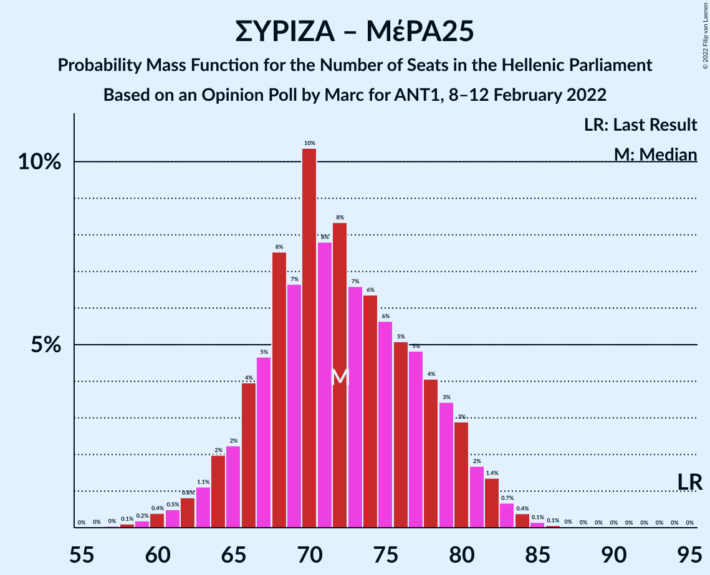

| Number of Seats | Probability | Accumulated | Special Marks |
|:---------------:|:-----------:|:-----------:|:-------------:|
| 57 | 0% | 100% |  |
| 58 | 0.1% | 99.9% |  |
| 59 | 0.2% | 99.8% |  |
| 60 | 0.4% | 99.6% |  |
| 61 | 0.5% | 99.2% |  |
| 62 | 0.8% | 98.7% |  |
| 63 | 1.1% | 98% |  |
| 64 | 2% | 97% |  |
| 65 | 2% | 95% |  |
| 66 | 4% | 93% |  |
| 67 | 5% | 89% |  |
| 68 | 8% | 84% | Median |
| 69 | 7% | 76% |  |
| 70 | 10% | 70% |  |
| 71 | 8% | 59% |  |
| 72 | 8% | 52% |  |
| 73 | 7% | 43% |  |
| 74 | 6% | 37% |  |
| 75 | 6% | 30% |  |
| 76 | 5% | 25% |  |
| 77 | 5% | 20% |  |
| 78 | 4% | 15% |  |
| 79 | 3% | 11% |  |
| 80 | 3% | 7% |  |
| 81 | 2% | 4% |  |
| 82 | 1.4% | 3% |  |
| 83 | 0.7% | 1.3% |  |
| 84 | 0.4% | 0.6% |  |
| 85 | 0.1% | 0.3% |  |
| 86 | 0.1% | 0.1% |  |
| 87 | 0% | 0% |  |
| 88 | 0% | 0% |  |
| 89 | 0% | 0% |  |
| 90 | 0% | 0% |  |
| 91 | 0% | 0% |  |
| 92 | 0% | 0% |  |
| 93 | 0% | 0% |  |
| 94 | 0% | 0% |  |
| 95 | 0% | 0% | Last Result |

### Συνασπισμός Ριζοσπαστικής Αριστεράς

| Number of Seats | Probability | Accumulated | Special Marks |
|:---------------:|:-----------:|:-----------:|:-------------:|
| 55 | 0.1% | 100% |  |
| 56 | 0.2% | 99.9% |  |
| 57 | 0.4% | 99.7% |  |
| 58 | 0.8% | 99.3% |  |
| 59 | 1.4% | 98.5% |  |
| 60 | 2% | 97% |  |
| 61 | 3% | 95% |  |
| 62 | 4% | 92% |  |
| 63 | 4% | 89% |  |
| 64 | 5% | 84% |  |
| 65 | 6% | 80% |  |
| 66 | 8% | 74% |  |
| 67 | 9% | 66% |  |
| 68 | 11% | 57% | Median |
| 69 | 10% | 46% |  |
| 70 | 12% | 37% |  |
| 71 | 8% | 25% |  |
| 72 | 7% | 17% |  |
| 73 | 4% | 10% |  |
| 74 | 3% | 5% |  |
| 75 | 1.4% | 3% |  |
| 76 | 0.7% | 1.1% |  |
| 77 | 0.3% | 0.4% |  |
| 78 | 0.1% | 0.2% |  |
| 79 | 0% | 0.1% |  |
| 80 | 0% | 0% |  |
| 81 | 0% | 0% |  |
| 82 | 0% | 0% |  |
| 83 | 0% | 0% |  |
| 84 | 0% | 0% |  |
| 85 | 0% | 0% |  |
| 86 | 0% | 0% | Last Result |

## Technical Information

### Opinion Poll

+ **Polling firm:** Marc
+ **Commissioner(s):** ANT1
+ **Fieldwork period:** 8–12 February 2022

### Calculations

+ **Sample size:** 1037
+ **Simulations done:** 1,048,576
+ **Error estimate:** 0.93%

