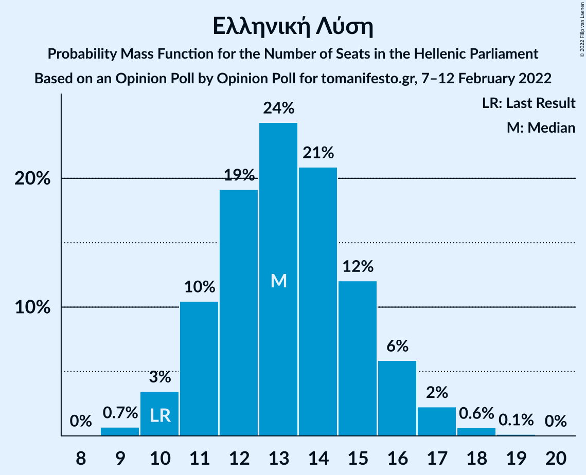
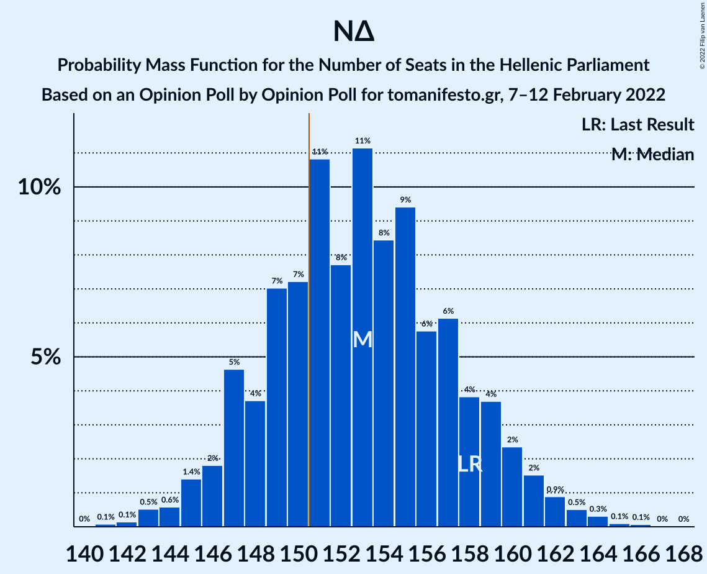

# Opinion Poll by Opinion Poll for tomanifesto.gr, 7–12 February 2022

<a href="#voting-intentions">Voting Intentions</a> | <a href="#seats">Seats</a> | <a href="#coalitions">Coalitions</a> | <a href="#technical-information">Technical Information</a>

## Voting Intentions

### Confidence Intervals

| Party | Last Result | Poll Result | 80% Confidence Interval | 90% Confidence Interval | 95% Confidence Interval | 99% Confidence Interval |
|:-----:|:-----------:|:-----------:|:-----------------------:|:-----------------------:|:-----------------------:|:-----------------------:|
| Νέα Δημοκρατία | 39.8% | 38.5% | 36.8–40.3% |36.3–40.8% |35.9–41.3% |35.0–42.1% |
| Συνασπισμός Ριζοσπαστικής Αριστεράς | 31.5% | 24.2% | 22.7–25.8% |22.3–26.3% |21.9–26.7% |21.2–27.5% |
| Κίνημα Αλλαγής | 8.1% | 17.5% | 16.2–19.0% |15.8–19.4% |15.5–19.7% |14.9–20.4% |
| Κομμουνιστικό Κόμμα Ελλάδας | 5.3% | 5.8% | 5.1–6.8% |4.8–7.0% |4.7–7.3% |4.3–7.8% |
| Ελληνική Λύση | 3.7% | 4.9% | 4.2–5.8% |4.0–6.0% |3.8–6.2% |3.5–6.7% |
| Μέτωπο Ευρωπαϊκής Ρεαλιστικής Ανυπακοής | 3.4% | 3.2% | 2.6–3.9% |2.5–4.1% |2.3–4.3% |2.1–4.7% |

*Note:* The poll result column reflects the actual value used in the calculations. Published results may vary slightly, and in addition be rounded to fewer digits.

## Seats

### Confidence Intervals

| Party | Last Result | Median | 80% Confidence Interval | 90% Confidence Interval | 95% Confidence Interval | 99% Confidence Interval |
|:-----:|:-----------:|:------:|:-----------------------:|:-----------------------:|:-----------------------:|:-----------------------:|
| <a href="#νέα-δημοκρατία">Νέα Δημοκρατία</a> | 158 | 153 | 148–158 |147–160 |145–161 |143–164 |
| <a href="#συνασπισμός-ριζοσπαστικής-αριστεράς">Συνασπισμός Ριζοσπαστικής Αριστεράς</a> | 86 | 65 | 61–69 |59–71 |58–72 |56–74 |
| <a href="#κίνημα-αλλαγής">Κίνημα Αλλαγής</a> | 22 | 47 | 43–51 |42–52 |41–53 |40–55 |
| <a href="#κομμουνιστικό-κόμμα-ελλάδας">Κομμουνιστικό Κόμμα Ελλάδας</a> | 15 | 16 | 14–18 |13–19 |12–19 |12–21 |
| <a href="#ελληνική-λύση">Ελληνική Λύση</a> | 10 | 13 | 11–15 |11–16 |10–17 |9–18 |
| <a href="#μέτωπο-ευρωπαϊκής-ρεαλιστικής-ανυπακοής">Μέτωπο Ευρωπαϊκής Ρεαλιστικής Ανυπακοής</a> | 9 | 9 | 0–10 |0–11 |0–11 |0–12 |

### Νέα Δημοκρατία

*For a full overview of the results for this party, see the [Νέα Δημοκρατία](party-νέαδημοκρατία.html) page.*

| Number of Seats | Probability | Accumulated | Special Marks |
|:---------------:|:-----------:|:-----------:|:-------------:|
| 141 | 0.1% | 100% |  |
| 142 | 0.1% | 99.9% |  |
| 143 | 0.5% | 99.7% |  |
| 144 | 0.6% | 99.2% |  |
| 145 | 1.4% | 98.6% |  |
| 146 | 2% | 97% |  |
| 147 | 5% | 95% |  |
| 148 | 4% | 91% |  |
| 149 | 7% | 87% |  |
| 150 | 7% | 80% |  |
| 151 | 11% | 73% | Majority |
| 152 | 8% | 62% |  |
| 153 | 11% | 54% | Median |
| 154 | 8% | 43% |  |
| 155 | 9% | 35% |  |
| 156 | 6% | 25% |  |
| 157 | 6% | 19% |  |
| 158 | 4% | 13% | Last Result |
| 159 | 4% | 10% |  |
| 160 | 2% | 6% |  |
| 161 | 2% | 3% |  |
| 162 | 0.9% | 2% |  |
| 163 | 0.5% | 1.0% |  |
| 164 | 0.3% | 0.5% |  |
| 165 | 0.1% | 0.2% |  |
| 166 | 0.1% | 0.1% |  |
| 167 | 0% | 0% |  |

### Συνασπισμός Ριζοσπαστικής Αριστεράς

*For a full overview of the results for this party, see the [Συνασπισμός Ριζοσπαστικής Αριστεράς](party-συνασπισμόςριζοσπαστικήςαριστεράς.html) page.*

| Number of Seats | Probability | Accumulated | Special Marks |
|:---------------:|:-----------:|:-----------:|:-------------:|
| 54 | 0% | 100% |  |
| 55 | 0.1% | 99.9% |  |
| 56 | 0.3% | 99.8% |  |
| 57 | 0.7% | 99.5% |  |
| 58 | 1.5% | 98.8% |  |
| 59 | 3% | 97% |  |
| 60 | 4% | 94% |  |
| 61 | 6% | 90% |  |
| 62 | 8% | 84% |  |
| 63 | 11% | 75% |  |
| 64 | 12% | 64% |  |
| 65 | 11% | 52% | Median |
| 66 | 11% | 41% |  |
| 67 | 9% | 31% |  |
| 68 | 8% | 22% |  |
| 69 | 5% | 14% |  |
| 70 | 4% | 9% |  |
| 71 | 2% | 5% |  |
| 72 | 1.4% | 3% |  |
| 73 | 0.7% | 1.4% |  |
| 74 | 0.4% | 0.7% |  |
| 75 | 0.2% | 0.3% |  |
| 76 | 0.1% | 0.1% |  |
| 77 | 0% | 0.1% |  |
| 78 | 0% | 0% |  |
| 79 | 0% | 0% |  |
| 80 | 0% | 0% |  |
| 81 | 0% | 0% |  |
| 82 | 0% | 0% |  |
| 83 | 0% | 0% |  |
| 84 | 0% | 0% |  |
| 85 | 0% | 0% |  |
| 86 | 0% | 0% | Last Result |

### Κίνημα Αλλαγής

*For a full overview of the results for this party, see the [Κίνημα Αλλαγής](party-κίνημααλλαγής.html) page.*

| Number of Seats | Probability | Accumulated | Special Marks |
|:---------------:|:-----------:|:-----------:|:-------------:|
| 22 | 0% | 100% | Last Result |
| 23 | 0% | 100% |  |
| 24 | 0% | 100% |  |
| 25 | 0% | 100% |  |
| 26 | 0% | 100% |  |
| 27 | 0% | 100% |  |
| 28 | 0% | 100% |  |
| 29 | 0% | 100% |  |
| 30 | 0% | 100% |  |
| 31 | 0% | 100% |  |
| 32 | 0% | 100% |  |
| 33 | 0% | 100% |  |
| 34 | 0% | 100% |  |
| 35 | 0% | 100% |  |
| 36 | 0% | 100% |  |
| 37 | 0% | 100% |  |
| 38 | 0.1% | 100% |  |
| 39 | 0.3% | 99.9% |  |
| 40 | 0.8% | 99.6% |  |
| 41 | 2% | 98.8% |  |
| 42 | 4% | 97% |  |
| 43 | 6% | 94% |  |
| 44 | 9% | 88% |  |
| 45 | 11% | 79% |  |
| 46 | 14% | 67% |  |
| 47 | 13% | 54% | Median |
| 48 | 13% | 41% |  |
| 49 | 9% | 28% |  |
| 50 | 7% | 18% |  |
| 51 | 5% | 11% |  |
| 52 | 3% | 6% |  |
| 53 | 2% | 3% |  |
| 54 | 0.8% | 1.5% |  |
| 55 | 0.4% | 0.7% |  |
| 56 | 0.2% | 0.3% |  |
| 57 | 0.1% | 0.1% |  |
| 58 | 0% | 0% |  |

### Κομμουνιστικό Κόμμα Ελλάδας

*For a full overview of the results for this party, see the [Κομμουνιστικό Κόμμα Ελλάδας](party-κομμουνιστικόκόμμαελλάδας.html) page.*

| Number of Seats | Probability | Accumulated | Special Marks |
|:---------------:|:-----------:|:-----------:|:-------------:|
| 10 | 0% | 100% |  |
| 11 | 0.4% | 99.9% |  |
| 12 | 2% | 99.5% |  |
| 13 | 6% | 97% |  |
| 14 | 14% | 91% |  |
| 15 | 21% | 77% | Last Result |
| 16 | 23% | 56% | Median |
| 17 | 18% | 33% |  |
| 18 | 9% | 16% |  |
| 19 | 4% | 7% |  |
| 20 | 2% | 2% |  |
| 21 | 0.6% | 0.8% |  |
| 22 | 0.2% | 0.2% |  |
| 23 | 0% | 0% |  |

### Ελληνική Λύση

*For a full overview of the results for this party, see the [Ελληνική Λύση](party-ελληνικήλύση.html) page.*

| Number of Seats | Probability | Accumulated | Special Marks |
|:---------------:|:-----------:|:-----------:|:-------------:|
| 8 | 0% | 100% |  |
| 9 | 0.7% | 99.9% |  |
| 10 | 3% | 99.3% | Last Result |
| 11 | 10% | 96% |  |
| 12 | 19% | 85% |  |
| 13 | 24% | 66% | Median |
| 14 | 21% | 42% |  |
| 15 | 12% | 21% |  |
| 16 | 6% | 9% |  |
| 17 | 2% | 3% |  |
| 18 | 0.6% | 0.8% |  |
| 19 | 0.1% | 0.2% |  |
| 20 | 0% | 0% |  |

### Μέτωπο Ευρωπαϊκής Ρεαλιστικής Ανυπακοής

*For a full overview of the results for this party, see the [Μέτωπο Ευρωπαϊκής Ρεαλιστικής Ανυπακοής](party-μέτωποευρωπαϊκήςρεαλιστικήςανυπακοής.html) page.*

| Number of Seats | Probability | Accumulated | Special Marks |
|:---------------:|:-----------:|:-----------:|:-------------:|
| 0 | 32% | 100% |  |
| 1 | 0% | 68% |  |
| 2 | 0% | 68% |  |
| 3 | 0% | 68% |  |
| 4 | 0% | 68% |  |
| 5 | 0% | 68% |  |
| 6 | 0% | 68% |  |
| 7 | 0% | 68% |  |
| 8 | 15% | 68% |  |
| 9 | 28% | 54% | Last Result, Median |
| 10 | 17% | 26% |  |
| 11 | 7% | 9% |  |
| 12 | 2% | 2% |  |
| 13 | 0.4% | 0.4% |  |
| 14 | 0.1% | 0.1% |  |
| 15 | 0% | 0% |  |

## Coalitions

### Confidence Intervals

| Coalition | Last Result | Median | Majority? | 80% Confidence Interval | 90% Confidence Interval | 95% Confidence Interval | 99% Confidence Interval |
|:---------:|:-----------:|:------:|:---------:|:-----------------------:|:-----------------------:|:-----------------------:|:-----------------------:|
| Νέα Δημοκρατία – Κίνημα Αλλαγής | 180 | 199 | 100% | 194–206 | 193–208 | 192–209 | 189–211 |
| Νέα Δημοκρατία | 158 | 153 | 73% | 148–158 | 147–160 | 145–161 | 143–164 |
| Συνασπισμός Ριζοσπαστικής Αριστεράς – Μέτωπο Ευρωπαϊκής Ρεαλιστικής Ανυπακοής | 95 | 72 | 0% | 65–77 | 63–78 | 62–79 | 60–81 |
| Συνασπισμός Ριζοσπαστικής Αριστεράς | 86 | 65 | 0% | 61–69 | 59–71 | 58–72 | 56–74 |

### Νέα Δημοκρατία – Κίνημα Αλλαγής

| Number of Seats | Probability | Accumulated | Special Marks |
|:---------------:|:-----------:|:-----------:|:-------------:|
| 180 | 0% | 100% | Last Result |
| 181 | 0% | 100% |  |
| 182 | 0% | 100% |  |
| 183 | 0% | 100% |  |
| 184 | 0% | 100% |  |
| 185 | 0% | 100% |  |
| 186 | 0% | 100% |  |
| 187 | 0.1% | 100% |  |
| 188 | 0.1% | 99.9% |  |
| 189 | 0.3% | 99.7% |  |
| 190 | 0.6% | 99.4% |  |
| 191 | 1.1% | 98.9% |  |
| 192 | 2% | 98% |  |
| 193 | 3% | 96% |  |
| 194 | 4% | 93% |  |
| 195 | 6% | 89% |  |
| 196 | 7% | 83% |  |
| 197 | 9% | 76% |  |
| 198 | 8% | 68% |  |
| 199 | 11% | 60% |  |
| 200 | 8% | 50% | Median |
| 201 | 8% | 42% |  |
| 202 | 7% | 34% |  |
| 203 | 6% | 27% |  |
| 204 | 6% | 21% |  |
| 205 | 4% | 15% |  |
| 206 | 4% | 11% |  |
| 207 | 2% | 8% |  |
| 208 | 2% | 5% |  |
| 209 | 1.4% | 3% |  |
| 210 | 0.8% | 2% |  |
| 211 | 0.5% | 1.0% |  |
| 212 | 0.3% | 0.5% |  |
| 213 | 0.1% | 0.2% |  |
| 214 | 0.1% | 0.1% |  |
| 215 | 0% | 0% |  |

### Νέα Δημοκρατία

| Number of Seats | Probability | Accumulated | Special Marks |
|:---------------:|:-----------:|:-----------:|:-------------:|
| 141 | 0.1% | 100% |  |
| 142 | 0.1% | 99.9% |  |
| 143 | 0.5% | 99.7% |  |
| 144 | 0.6% | 99.2% |  |
| 145 | 1.4% | 98.6% |  |
| 146 | 2% | 97% |  |
| 147 | 5% | 95% |  |
| 148 | 4% | 91% |  |
| 149 | 7% | 87% |  |
| 150 | 7% | 80% |  |
| 151 | 11% | 73% | Majority |
| 152 | 8% | 62% |  |
| 153 | 11% | 54% | Median |
| 154 | 8% | 43% |  |
| 155 | 9% | 35% |  |
| 156 | 6% | 25% |  |
| 157 | 6% | 19% |  |
| 158 | 4% | 13% | Last Result |
| 159 | 4% | 10% |  |
| 160 | 2% | 6% |  |
| 161 | 2% | 3% |  |
| 162 | 0.9% | 2% |  |
| 163 | 0.5% | 1.0% |  |
| 164 | 0.3% | 0.5% |  |
| 165 | 0.1% | 0.2% |  |
| 166 | 0.1% | 0.1% |  |
| 167 | 0% | 0% |  |

### Συνασπισμός Ριζοσπαστικής Αριστεράς – Μέτωπο Ευρωπαϊκής Ρεαλιστικής Ανυπακοής

| Number of Seats | Probability | Accumulated | Special Marks |
|:---------------:|:-----------:|:-----------:|:-------------:|
| 57 | 0.1% | 100% |  |
| 58 | 0.1% | 99.9% |  |
| 59 | 0.3% | 99.8% |  |
| 60 | 0.5% | 99.5% |  |
| 61 | 1.0% | 99.1% |  |
| 62 | 2% | 98% |  |
| 63 | 2% | 96% |  |
| 64 | 3% | 94% |  |
| 65 | 4% | 91% |  |
| 66 | 5% | 87% |  |
| 67 | 5% | 83% |  |
| 68 | 6% | 78% |  |
| 69 | 6% | 72% |  |
| 70 | 7% | 66% |  |
| 71 | 8% | 59% |  |
| 72 | 9% | 51% |  |
| 73 | 9% | 42% |  |
| 74 | 8% | 33% | Median |
| 75 | 7% | 24% |  |
| 76 | 5% | 17% |  |
| 77 | 5% | 12% |  |
| 78 | 3% | 7% |  |
| 79 | 2% | 4% |  |
| 80 | 1.0% | 2% |  |
| 81 | 0.5% | 1.0% |  |
| 82 | 0.3% | 0.5% |  |
| 83 | 0.1% | 0.2% |  |
| 84 | 0.1% | 0.1% |  |
| 85 | 0% | 0% |  |
| 86 | 0% | 0% |  |
| 87 | 0% | 0% |  |
| 88 | 0% | 0% |  |
| 89 | 0% | 0% |  |
| 90 | 0% | 0% |  |
| 91 | 0% | 0% |  |
| 92 | 0% | 0% |  |
| 93 | 0% | 0% |  |
| 94 | 0% | 0% |  |
| 95 | 0% | 0% | Last Result |

### Συνασπισμός Ριζοσπαστικής Αριστεράς

| Number of Seats | Probability | Accumulated | Special Marks |
|:---------------:|:-----------:|:-----------:|:-------------:|
| 54 | 0% | 100% |  |
| 55 | 0.1% | 99.9% |  |
| 56 | 0.3% | 99.8% |  |
| 57 | 0.7% | 99.5% |  |
| 58 | 1.5% | 98.8% |  |
| 59 | 3% | 97% |  |
| 60 | 4% | 94% |  |
| 61 | 6% | 90% |  |
| 62 | 8% | 84% |  |
| 63 | 11% | 75% |  |
| 64 | 12% | 64% |  |
| 65 | 11% | 52% | Median |
| 66 | 11% | 41% |  |
| 67 | 9% | 31% |  |
| 68 | 8% | 22% |  |
| 69 | 5% | 14% |  |
| 70 | 4% | 9% |  |
| 71 | 2% | 5% |  |
| 72 | 1.4% | 3% |  |
| 73 | 0.7% | 1.4% |  |
| 74 | 0.4% | 0.7% |  |
| 75 | 0.2% | 0.3% |  |
| 76 | 0.1% | 0.1% |  |
| 77 | 0% | 0.1% |  |
| 78 | 0% | 0% |  |
| 79 | 0% | 0% |  |
| 80 | 0% | 0% |  |
| 81 | 0% | 0% |  |
| 82 | 0% | 0% |  |
| 83 | 0% | 0% |  |
| 84 | 0% | 0% |  |
| 85 | 0% | 0% |  |
| 86 | 0% | 0% | Last Result |

## Technical Information

### Opinion Poll

+ **Polling firm:** Opinion Poll
+ **Commissioner(s):** tomanifesto.gr
+ **Fieldwork period:** 7–12 February 2022

### Calculations

+ **Sample size:** 1251
+ **Simulations done:** 1,048,576
+ **Error estimate:** 0.78%

