# Opinion Poll by Alco for Open TV, 14–18 February 2022

<a href="#voting-intentions">Voting Intentions</a> | <a href="#seats">Seats</a> | <a href="#coalitions">Coalitions</a> | <a href="#technical-information">Technical Information</a>

## Voting Intentions

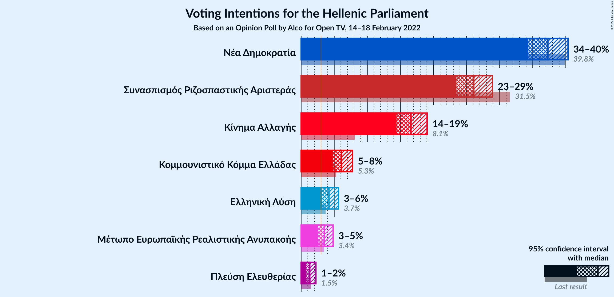

### Confidence Intervals

| Party | Last Result | Poll Result | 80% Confidence Interval | 90% Confidence Interval | 95% Confidence Interval | 99% Confidence Interval |
|:-----:|:-----------:|:-----------:|:-----------------------:|:-----------------------:|:-----------------------:|:-----------------------:|
| Νέα Δημοκρατία | 39.8% | 37.3% | 35.4–39.3% |34.8–39.9% |34.4–40.3% |33.4–41.3% |
| Συνασπισμός Ριζοσπαστικής Αριστεράς | 31.5% | 26.1% | 24.4–27.9% |23.9–28.5% |23.5–28.9% |22.7–29.8% |
| Κίνημα Αλλαγής | 8.1% | 16.6% | 15.2–18.2% |14.8–18.6% |14.4–19.0% |13.8–19.8% |
| Κομμουνιστικό Κόμμα Ελλάδας | 5.3% | 6.1% | 5.2–7.2% |5.0–7.5% |4.8–7.8% |4.4–8.3% |
| Ελληνική Λύση | 3.7% | 4.2% | 3.5–5.1% |3.3–5.4% |3.1–5.6% |2.8–6.1% |
| Μέτωπο Ευρωπαϊκής Ρεαλιστικής Ανυπακοής | 3.4% | 3.5% | 2.9–4.4% |2.7–4.6% |2.5–4.8% |2.2–5.3% |
| Πλεύση Ελευθερίας | 1.5% | 1.3% | 0.9–1.9% |0.8–2.1% |0.8–2.2% |0.6–2.5% |

*Note:* The poll result column reflects the actual value used in the calculations. Published results may vary slightly, and in addition be rounded to fewer digits.

## Seats

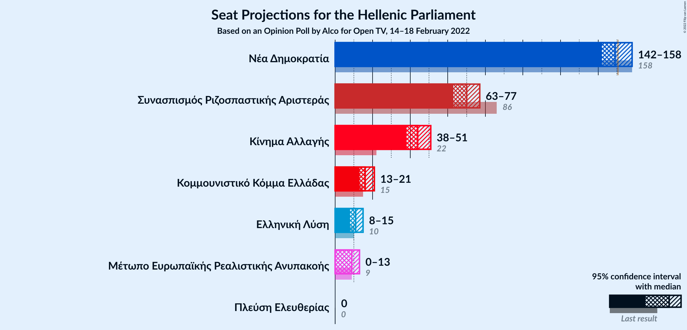

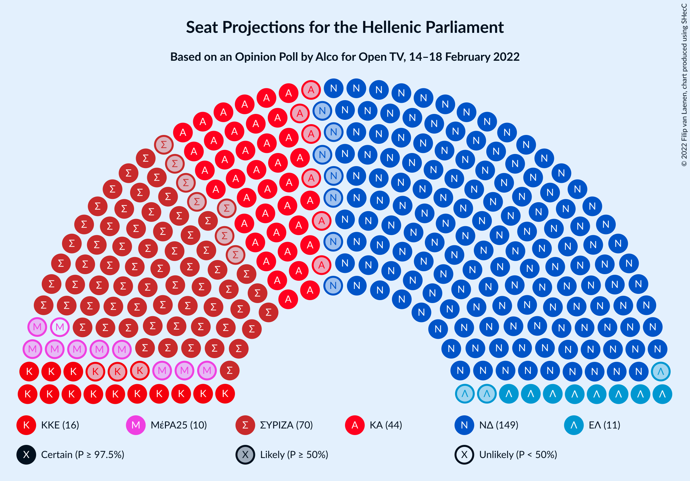

### Confidence Intervals

| Party | Last Result | Median | 80% Confidence Interval | 90% Confidence Interval | 95% Confidence Interval | 99% Confidence Interval |
|:-----:|:-----------:|:------:|:-----------------------:|:-----------------------:|:-----------------------:|:-----------------------:|
| <a href="#νέα-δημοκρατία">Νέα Δημοκρατία</a> | 158 | 149 | 144–155 |143–157 |142–158 |139–161 |
| <a href="#συνασπισμός-ριζοσπαστικής-αριστεράς">Συνασπισμός Ριζοσπαστικής Αριστεράς</a> | 86 | 70 | 65–75 |64–76 |63–77 |60–80 |
| <a href="#κίνημα-αλλαγής">Κίνημα Αλλαγής</a> | 22 | 44 | 40–49 |39–50 |38–51 |37–53 |
| <a href="#κομμουνιστικό-κόμμα-ελλάδας">Κομμουνιστικό Κόμμα Ελλάδας</a> | 15 | 16 | 14–19 |13–20 |13–21 |12–22 |
| <a href="#ελληνική-λύση">Ελληνική Λύση</a> | 10 | 11 | 9–14 |9–14 |8–15 |0–16 |
| <a href="#μέτωπο-ευρωπαϊκής-ρεαλιστικής-ανυπακοής">Μέτωπο Ευρωπαϊκής Ρεαλιστικής Ανυπακοής</a> | 9 | 9 | 0–12 |0–12 |0–13 |0–14 |
| <a href="#πλεύση-ελευθερίας">Πλεύση Ελευθερίας</a> | 0 | 0 | 0 |0 |0 |0 |

### Νέα Δημοκρατία

*For a full overview of the results for this party, see the [Νέα Δημοκρατία](party-νέαδημοκρατία.html) page.*

| Number of Seats | Probability | Accumulated | Special Marks |
|:---------------:|:-----------:|:-----------:|:-------------:|
| 136 | 0% | 100% |  |
| 137 | 0.1% | 99.9% |  |
| 138 | 0.2% | 99.9% |  |
| 139 | 0.4% | 99.7% |  |
| 140 | 0.7% | 99.3% |  |
| 141 | 1.0% | 98.6% |  |
| 142 | 2% | 98% |  |
| 143 | 3% | 95% |  |
| 144 | 4% | 93% |  |
| 145 | 5% | 89% |  |
| 146 | 7% | 84% |  |
| 147 | 9% | 77% |  |
| 148 | 6% | 68% |  |
| 149 | 12% | 62% | Median |
| 150 | 9% | 50% |  |
| 151 | 9% | 41% | Majority |
| 152 | 6% | 31% |  |
| 153 | 6% | 25% |  |
| 154 | 6% | 19% |  |
| 155 | 4% | 13% |  |
| 156 | 3% | 8% |  |
| 157 | 2% | 5% |  |
| 158 | 1.2% | 3% | Last Result |
| 159 | 0.6% | 2% |  |
| 160 | 0.7% | 1.4% |  |
| 161 | 0.3% | 0.7% |  |
| 162 | 0.2% | 0.4% |  |
| 163 | 0.1% | 0.2% |  |
| 164 | 0% | 0.1% |  |
| 165 | 0% | 0.1% |  |
| 166 | 0% | 0% |  |

### Συνασπισμός Ριζοσπαστικής Αριστεράς

*For a full overview of the results for this party, see the [Συνασπισμός Ριζοσπαστικής Αριστεράς](party-συνασπισμόςριζοσπαστικήςαριστεράς.html) page.*

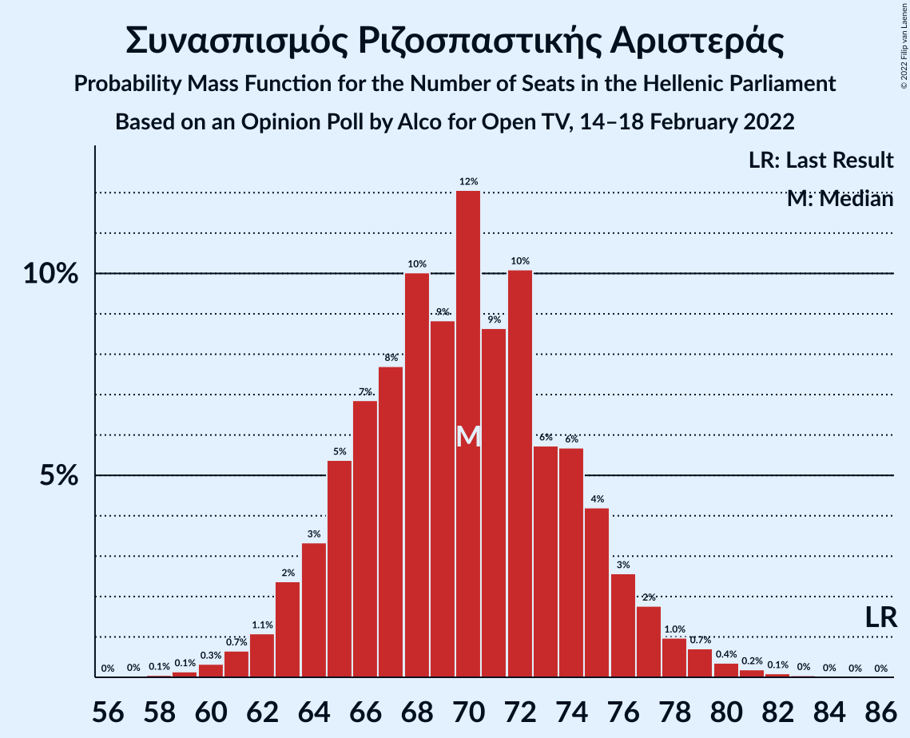

| Number of Seats | Probability | Accumulated | Special Marks |
|:---------------:|:-----------:|:-----------:|:-------------:|
| 58 | 0.1% | 100% |  |
| 59 | 0.1% | 99.9% |  |
| 60 | 0.3% | 99.8% |  |
| 61 | 0.7% | 99.4% |  |
| 62 | 1.1% | 98.8% |  |
| 63 | 2% | 98% |  |
| 64 | 3% | 95% |  |
| 65 | 5% | 92% |  |
| 66 | 7% | 87% |  |
| 67 | 8% | 80% |  |
| 68 | 10% | 72% |  |
| 69 | 9% | 62% |  |
| 70 | 12% | 53% | Median |
| 71 | 9% | 41% |  |
| 72 | 10% | 32% |  |
| 73 | 6% | 22% |  |
| 74 | 6% | 17% |  |
| 75 | 4% | 11% |  |
| 76 | 3% | 7% |  |
| 77 | 2% | 4% |  |
| 78 | 1.0% | 2% |  |
| 79 | 0.7% | 1.4% |  |
| 80 | 0.4% | 0.7% |  |
| 81 | 0.2% | 0.4% |  |
| 82 | 0.1% | 0.2% |  |
| 83 | 0% | 0.1% |  |
| 84 | 0% | 0% |  |
| 85 | 0% | 0% |  |
| 86 | 0% | 0% | Last Result |

### Κίνημα Αλλαγής

*For a full overview of the results for this party, see the [Κίνημα Αλλαγής](party-κίνημααλλαγής.html) page.*

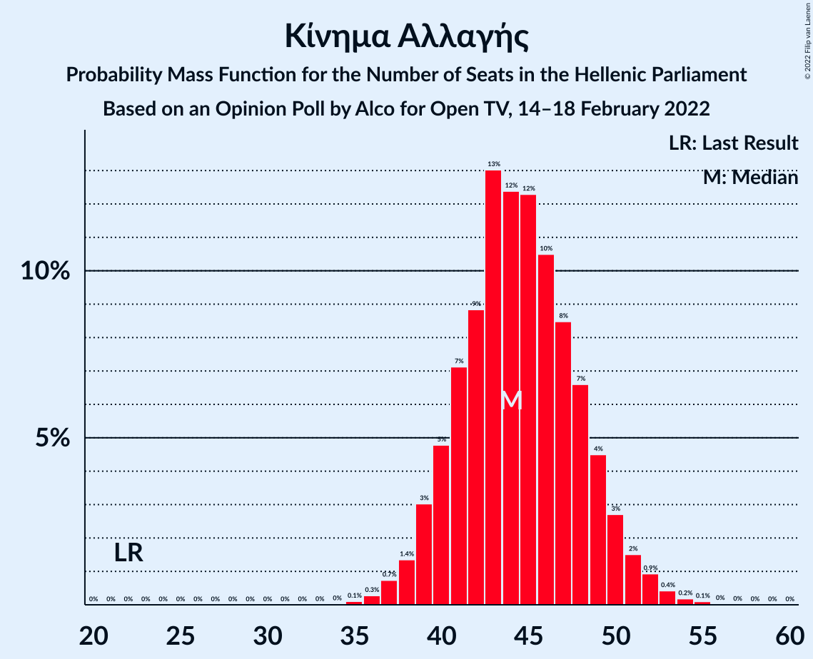

| Number of Seats | Probability | Accumulated | Special Marks |
|:---------------:|:-----------:|:-----------:|:-------------:|
| 22 | 0% | 100% | Last Result |
| 23 | 0% | 100% |  |
| 24 | 0% | 100% |  |
| 25 | 0% | 100% |  |
| 26 | 0% | 100% |  |
| 27 | 0% | 100% |  |
| 28 | 0% | 100% |  |
| 29 | 0% | 100% |  |
| 30 | 0% | 100% |  |
| 31 | 0% | 100% |  |
| 32 | 0% | 100% |  |
| 33 | 0% | 100% |  |
| 34 | 0% | 100% |  |
| 35 | 0.1% | 100% |  |
| 36 | 0.3% | 99.9% |  |
| 37 | 0.7% | 99.6% |  |
| 38 | 1.4% | 98.8% |  |
| 39 | 3% | 97% |  |
| 40 | 5% | 94% |  |
| 41 | 7% | 90% |  |
| 42 | 9% | 83% |  |
| 43 | 13% | 74% |  |
| 44 | 12% | 61% | Median |
| 45 | 12% | 48% |  |
| 46 | 10% | 36% |  |
| 47 | 8% | 26% |  |
| 48 | 7% | 17% |  |
| 49 | 4% | 10% |  |
| 50 | 3% | 6% |  |
| 51 | 2% | 3% |  |
| 52 | 0.9% | 2% |  |
| 53 | 0.4% | 0.8% |  |
| 54 | 0.2% | 0.3% |  |
| 55 | 0.1% | 0.2% |  |
| 56 | 0% | 0.1% |  |
| 57 | 0% | 0% |  |

### Κομμουνιστικό Κόμμα Ελλάδας

*For a full overview of the results for this party, see the [Κομμουνιστικό Κόμμα Ελλάδας](party-κομμουνιστικόκόμμαελλάδας.html) page.*

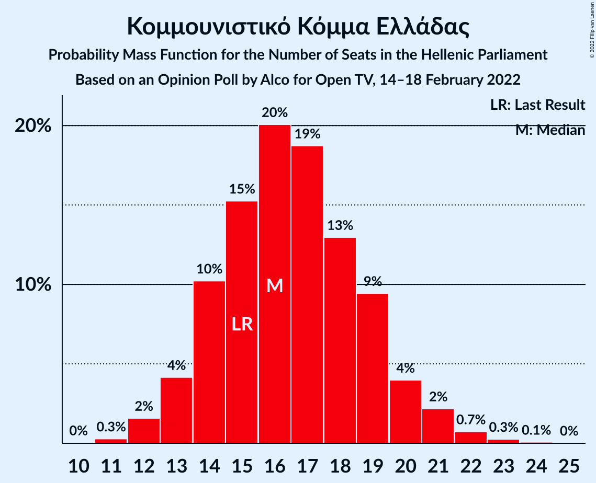

| Number of Seats | Probability | Accumulated | Special Marks |
|:---------------:|:-----------:|:-----------:|:-------------:|
| 11 | 0.3% | 100% |  |
| 12 | 2% | 99.7% |  |
| 13 | 4% | 98% |  |
| 14 | 10% | 94% |  |
| 15 | 15% | 84% | Last Result |
| 16 | 20% | 68% | Median |
| 17 | 19% | 48% |  |
| 18 | 13% | 30% |  |
| 19 | 9% | 17% |  |
| 20 | 4% | 7% |  |
| 21 | 2% | 3% |  |
| 22 | 0.7% | 1.1% |  |
| 23 | 0.3% | 0.4% |  |
| 24 | 0.1% | 0.1% |  |
| 25 | 0% | 0% |  |

### Ελληνική Λύση

*For a full overview of the results for this party, see the [Ελληνική Λύση](party-ελληνικήλύση.html) page.*

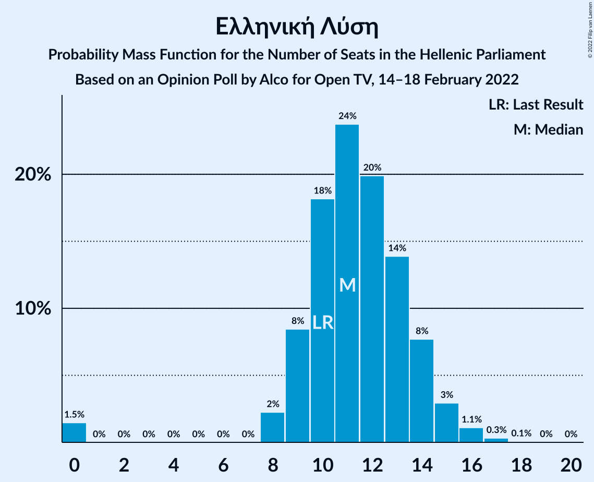

| Number of Seats | Probability | Accumulated | Special Marks |
|:---------------:|:-----------:|:-----------:|:-------------:|
| 0 | 1.5% | 100% |  |
| 1 | 0% | 98.5% |  |
| 2 | 0% | 98.5% |  |
| 3 | 0% | 98.5% |  |
| 4 | 0% | 98.5% |  |
| 5 | 0% | 98.5% |  |
| 6 | 0% | 98.5% |  |
| 7 | 0% | 98.5% |  |
| 8 | 2% | 98.5% |  |
| 9 | 8% | 96% |  |
| 10 | 18% | 88% | Last Result |
| 11 | 24% | 70% | Median |
| 12 | 20% | 46% |  |
| 13 | 14% | 26% |  |
| 14 | 8% | 12% |  |
| 15 | 3% | 4% |  |
| 16 | 1.1% | 2% |  |
| 17 | 0.3% | 0.4% |  |
| 18 | 0.1% | 0.1% |  |
| 19 | 0% | 0% |  |

### Μέτωπο Ευρωπαϊκής Ρεαλιστικής Ανυπακοής

*For a full overview of the results for this party, see the [Μέτωπο Ευρωπαϊκής Ρεαλιστικής Ανυπακοής](party-μέτωποευρωπαϊκήςρεαλιστικήςανυπακοής.html) page.*

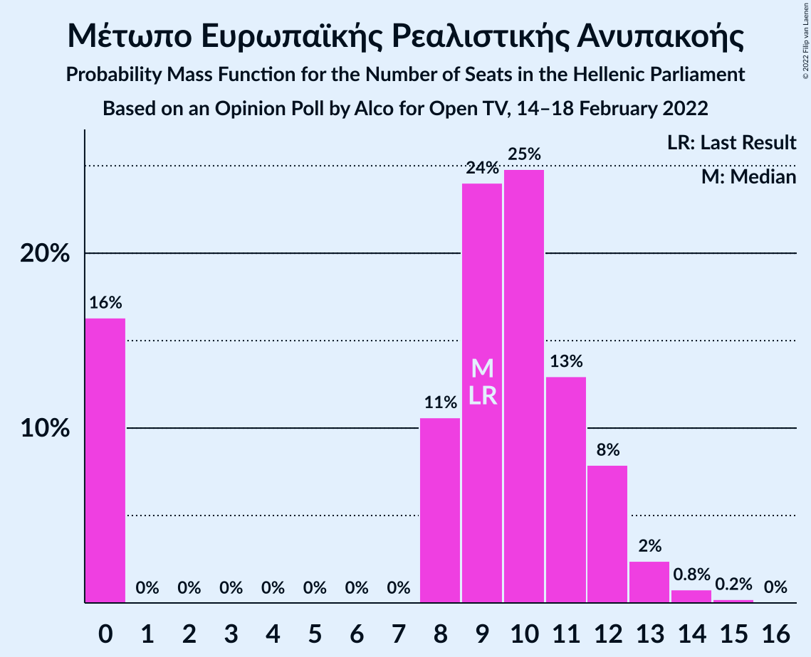

| Number of Seats | Probability | Accumulated | Special Marks |
|:---------------:|:-----------:|:-----------:|:-------------:|
| 0 | 16% | 100% |  |
| 1 | 0% | 84% |  |
| 2 | 0% | 84% |  |
| 3 | 0% | 84% |  |
| 4 | 0% | 84% |  |
| 5 | 0% | 84% |  |
| 6 | 0% | 84% |  |
| 7 | 0% | 84% |  |
| 8 | 11% | 84% |  |
| 9 | 24% | 73% | Last Result, Median |
| 10 | 25% | 49% |  |
| 11 | 13% | 24% |  |
| 12 | 8% | 11% |  |
| 13 | 2% | 3% |  |
| 14 | 0.8% | 1.0% |  |
| 15 | 0.2% | 0.3% |  |
| 16 | 0% | 0% |  |

### Πλεύση Ελευθερίας

*For a full overview of the results for this party, see the [Πλεύση Ελευθερίας](party-πλεύσηελευθερίας.html) page.*

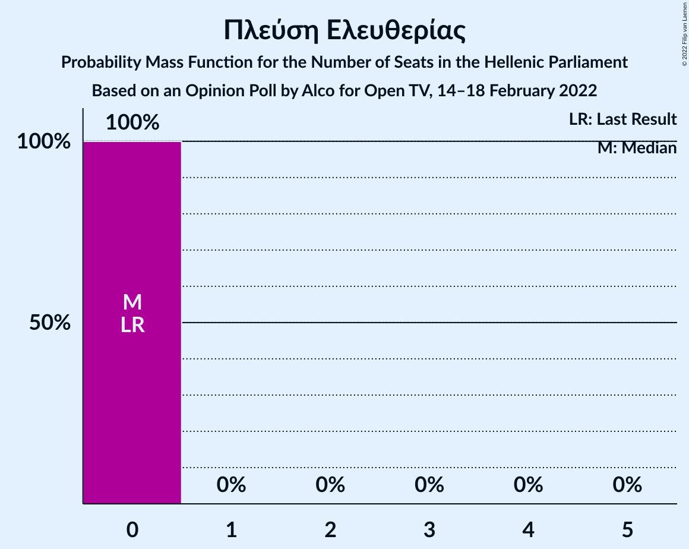

| Number of Seats | Probability | Accumulated | Special Marks |
|:---------------:|:-----------:|:-----------:|:-------------:|
| 0 | 100% | 100% | Last Result, Median |

## Coalitions

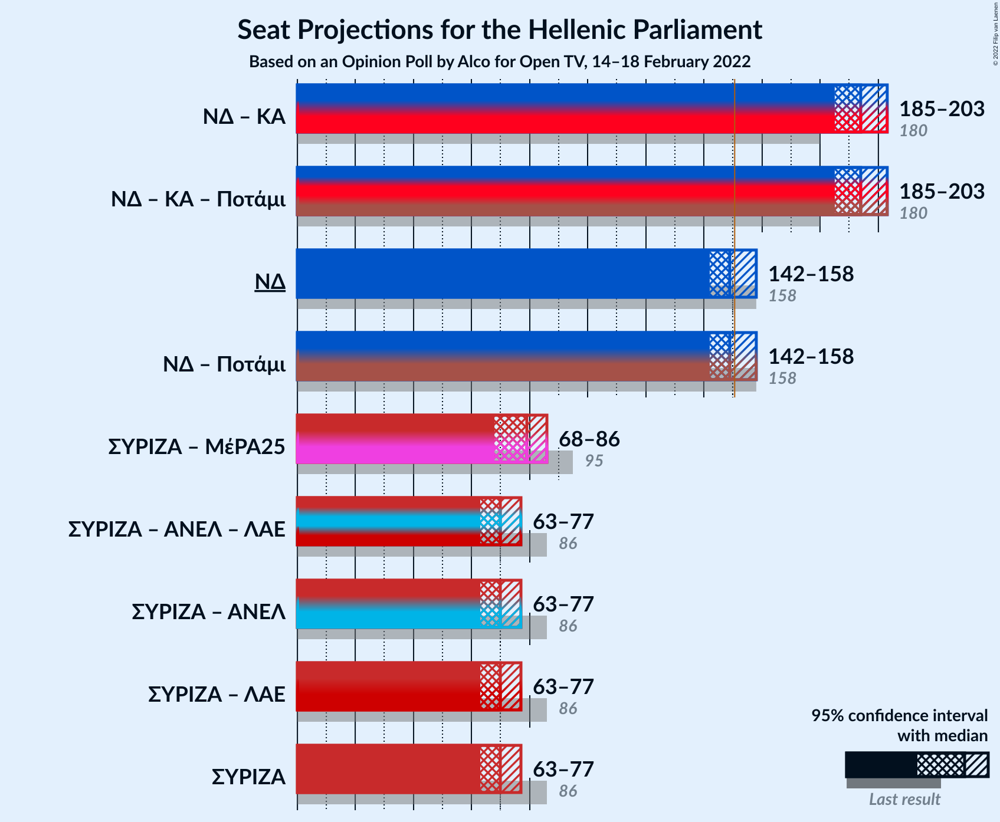

### Confidence Intervals

| Coalition | Last Result | Median | Majority? | 80% Confidence Interval | 90% Confidence Interval | 95% Confidence Interval | 99% Confidence Interval |
|:---------:|:-----------:|:------:|:---------:|:-----------------------:|:-----------------------:|:-----------------------:|:-----------------------:|
| Νέα Δημοκρατία – Κίνημα Αλλαγής | 180 | 194 | 100% | 188–200 | 187–202 | 185–203 | 183–207 |
| Νέα Δημοκρατία | 158 | 149 | 41% | 144–155 | 143–157 | 142–158 | 139–161 |
| Συνασπισμός Ριζοσπαστικής Αριστεράς – Μέτωπο Ευρωπαϊκής Ρεαλιστικής Ανυπακοής | 95 | 79 | 0% | 72–84 | 70–85 | 68–86 | 65–89 |
| Συνασπισμός Ριζοσπαστικής Αριστεράς | 86 | 70 | 0% | 65–75 | 64–76 | 63–77 | 60–80 |

### Νέα Δημοκρατία – Κίνημα Αλλαγής

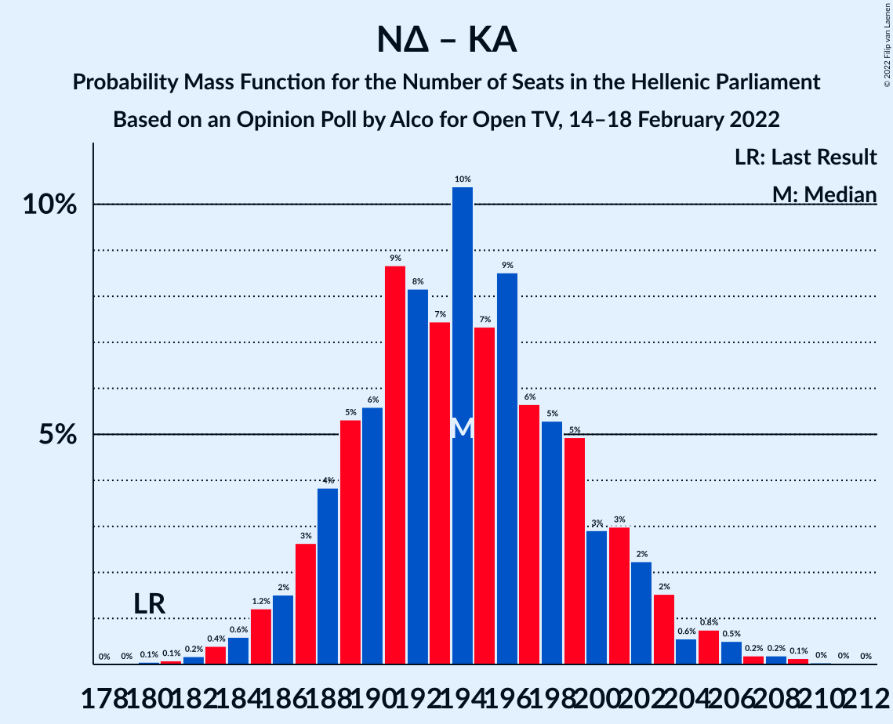

| Number of Seats | Probability | Accumulated | Special Marks |
|:---------------:|:-----------:|:-----------:|:-------------:|
| 180 | 0.1% | 100% | Last Result |
| 181 | 0.1% | 99.9% |  |
| 182 | 0.2% | 99.8% |  |
| 183 | 0.4% | 99.7% |  |
| 184 | 0.6% | 99.3% |  |
| 185 | 1.2% | 98.7% |  |
| 186 | 2% | 97% |  |
| 187 | 3% | 96% |  |
| 188 | 4% | 93% |  |
| 189 | 5% | 89% |  |
| 190 | 6% | 84% |  |
| 191 | 9% | 79% |  |
| 192 | 8% | 70% |  |
| 193 | 7% | 62% | Median |
| 194 | 10% | 54% |  |
| 195 | 7% | 44% |  |
| 196 | 9% | 37% |  |
| 197 | 6% | 28% |  |
| 198 | 5% | 22% |  |
| 199 | 5% | 17% |  |
| 200 | 3% | 12% |  |
| 201 | 3% | 9% |  |
| 202 | 2% | 6% |  |
| 203 | 2% | 4% |  |
| 204 | 0.6% | 2% |  |
| 205 | 0.8% | 2% |  |
| 206 | 0.5% | 1.1% |  |
| 207 | 0.2% | 0.6% |  |
| 208 | 0.2% | 0.4% |  |
| 209 | 0.1% | 0.2% |  |
| 210 | 0% | 0.1% |  |
| 211 | 0% | 0.1% |  |
| 212 | 0% | 0% |  |

### Νέα Δημοκρατία

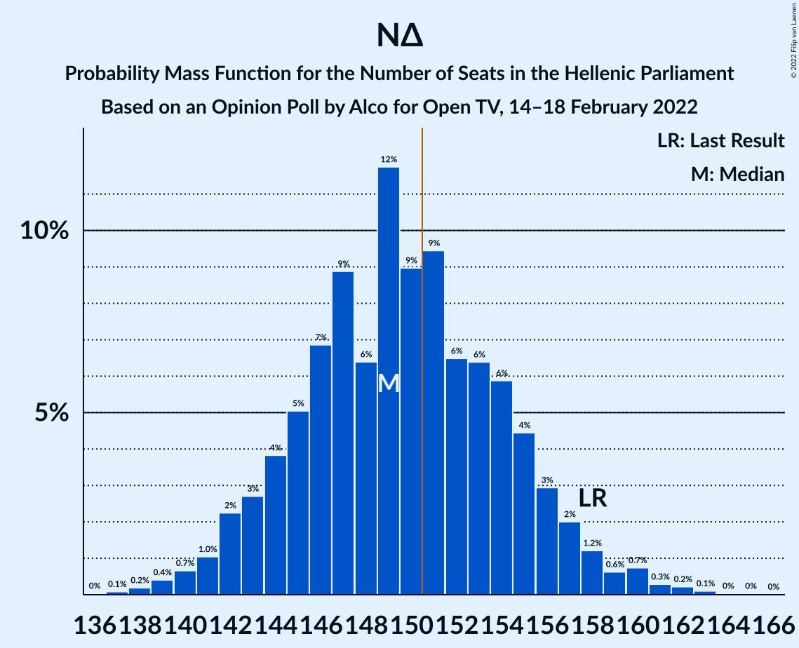

| Number of Seats | Probability | Accumulated | Special Marks |
|:---------------:|:-----------:|:-----------:|:-------------:|
| 136 | 0% | 100% |  |
| 137 | 0.1% | 99.9% |  |
| 138 | 0.2% | 99.9% |  |
| 139 | 0.4% | 99.7% |  |
| 140 | 0.7% | 99.3% |  |
| 141 | 1.0% | 98.6% |  |
| 142 | 2% | 98% |  |
| 143 | 3% | 95% |  |
| 144 | 4% | 93% |  |
| 145 | 5% | 89% |  |
| 146 | 7% | 84% |  |
| 147 | 9% | 77% |  |
| 148 | 6% | 68% |  |
| 149 | 12% | 62% | Median |
| 150 | 9% | 50% |  |
| 151 | 9% | 41% | Majority |
| 152 | 6% | 31% |  |
| 153 | 6% | 25% |  |
| 154 | 6% | 19% |  |
| 155 | 4% | 13% |  |
| 156 | 3% | 8% |  |
| 157 | 2% | 5% |  |
| 158 | 1.2% | 3% | Last Result |
| 159 | 0.6% | 2% |  |
| 160 | 0.7% | 1.4% |  |
| 161 | 0.3% | 0.7% |  |
| 162 | 0.2% | 0.4% |  |
| 163 | 0.1% | 0.2% |  |
| 164 | 0% | 0.1% |  |
| 165 | 0% | 0.1% |  |
| 166 | 0% | 0% |  |

### Συνασπισμός Ριζοσπαστικής Αριστεράς – Μέτωπο Ευρωπαϊκής Ρεαλιστικής Ανυπακοής

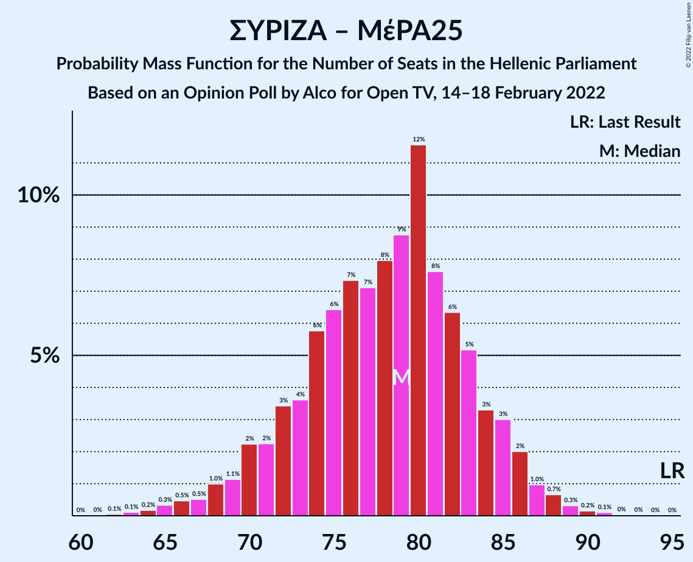

| Number of Seats | Probability | Accumulated | Special Marks |
|:---------------:|:-----------:|:-----------:|:-------------:|
| 62 | 0.1% | 100% |  |
| 63 | 0.1% | 99.9% |  |
| 64 | 0.2% | 99.8% |  |
| 65 | 0.3% | 99.6% |  |
| 66 | 0.5% | 99.3% |  |
| 67 | 0.5% | 98.8% |  |
| 68 | 1.0% | 98% |  |
| 69 | 1.1% | 97% |  |
| 70 | 2% | 96% |  |
| 71 | 2% | 94% |  |
| 72 | 3% | 92% |  |
| 73 | 4% | 88% |  |
| 74 | 6% | 85% |  |
| 75 | 6% | 79% |  |
| 76 | 7% | 72% |  |
| 77 | 7% | 65% |  |
| 78 | 8% | 58% |  |
| 79 | 9% | 50% | Median |
| 80 | 12% | 41% |  |
| 81 | 8% | 30% |  |
| 82 | 6% | 22% |  |
| 83 | 5% | 16% |  |
| 84 | 3% | 11% |  |
| 85 | 3% | 7% |  |
| 86 | 2% | 4% |  |
| 87 | 1.0% | 2% |  |
| 88 | 0.7% | 1.3% |  |
| 89 | 0.3% | 0.6% |  |
| 90 | 0.2% | 0.3% |  |
| 91 | 0.1% | 0.2% |  |
| 92 | 0% | 0.1% |  |
| 93 | 0% | 0% |  |
| 94 | 0% | 0% |  |
| 95 | 0% | 0% | Last Result |

### Συνασπισμός Ριζοσπαστικής Αριστεράς

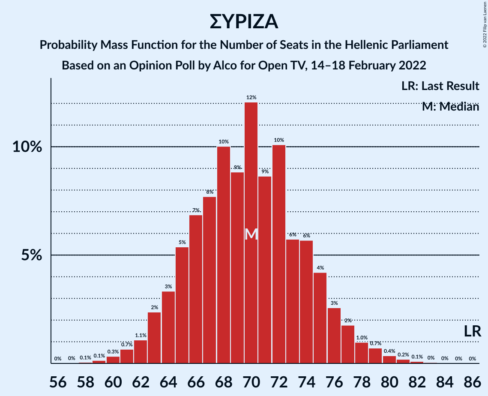

| Number of Seats | Probability | Accumulated | Special Marks |
|:---------------:|:-----------:|:-----------:|:-------------:|
| 58 | 0.1% | 100% |  |
| 59 | 0.1% | 99.9% |  |
| 60 | 0.3% | 99.8% |  |
| 61 | 0.7% | 99.4% |  |
| 62 | 1.1% | 98.8% |  |
| 63 | 2% | 98% |  |
| 64 | 3% | 95% |  |
| 65 | 5% | 92% |  |
| 66 | 7% | 87% |  |
| 67 | 8% | 80% |  |
| 68 | 10% | 72% |  |
| 69 | 9% | 62% |  |
| 70 | 12% | 53% | Median |
| 71 | 9% | 41% |  |
| 72 | 10% | 32% |  |
| 73 | 6% | 22% |  |
| 74 | 6% | 17% |  |
| 75 | 4% | 11% |  |
| 76 | 3% | 7% |  |
| 77 | 2% | 4% |  |
| 78 | 1.0% | 2% |  |
| 79 | 0.7% | 1.4% |  |
| 80 | 0.4% | 0.7% |  |
| 81 | 0.2% | 0.4% |  |
| 82 | 0.1% | 0.2% |  |
| 83 | 0% | 0.1% |  |
| 84 | 0% | 0% |  |
| 85 | 0% | 0% |  |
| 86 | 0% | 0% | Last Result |

## Technical Information

### Opinion Poll

+ **Polling firm:** Alco
+ **Commissioner(s):** Open TV
+ **Fieldwork period:** 14–18 February 2022

### Calculations

+ **Sample size:** 1000
+ **Simulations done:** 1,048,576
+ **Error estimate:** 1.13%

