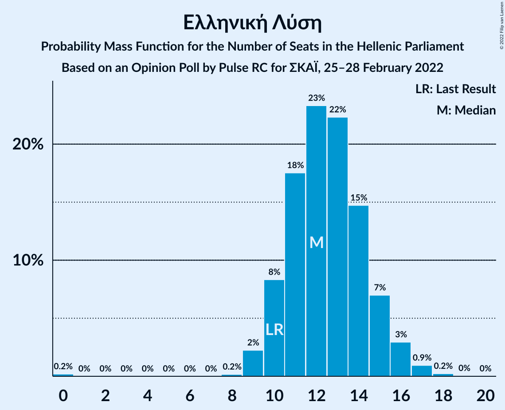

# Opinion Poll by Pulse RC for ΣΚΑΪ, 25–28 February 2022

<a href="#voting-intentions">Voting Intentions</a> | <a href="#seats">Seats</a> | <a href="#coalitions">Coalitions</a> | <a href="#technical-information">Technical Information</a>

## Voting Intentions

### Confidence Intervals

| Party | Last Result | Poll Result | 80% Confidence Interval | 90% Confidence Interval | 95% Confidence Interval | 99% Confidence Interval |
|:-----:|:-----------:|:-----------:|:-----------------------:|:-----------------------:|:-----------------------:|:-----------------------:|
| Νέα Δημοκρατία | 39.8% | 36.2% | 34.4–38.0% |33.9–38.5% |33.5–38.9% |32.7–39.8% |
| Συνασπισμός Ριζοσπαστικής Αριστεράς | 31.5% | 26.0% | 24.4–27.6% |24.0–28.1% |23.6–28.5% |22.8–29.3% |
| Κίνημα Αλλαγής | 8.1% | 15.8% | 14.5–17.2% |14.1–17.6% |13.8–17.9% |13.2–18.6% |
| Κομμουνιστικό Κόμμα Ελλάδας | 5.3% | 5.6% | 4.8–6.5% |4.6–6.8% |4.4–7.0% |4.1–7.5% |
| Ελληνική Λύση | 3.7% | 4.5% | 3.8–5.3% |3.6–5.6% |3.4–5.8% |3.1–6.2% |
| Μέτωπο Ευρωπαϊκής Ρεαλιστικής Ανυπακοής | 3.4% | 3.4% | 2.8–4.2% |2.7–4.4% |2.5–4.6% |2.3–5.0% |

*Note:* The poll result column reflects the actual value used in the calculations. Published results may vary slightly, and in addition be rounded to fewer digits.

## Seats

### Confidence Intervals

| Party | Last Result | Median | 80% Confidence Interval | 90% Confidence Interval | 95% Confidence Interval | 99% Confidence Interval |
|:-----:|:-----------:|:------:|:-----------------------:|:-----------------------:|:-----------------------:|:-----------------------:|
| <a href="#νέα-δημοκρατία">Νέα Δημοκρατία</a> | 158 | 149 | 144–155 |143–156 |142–157 |139–160 |
| <a href="#συνασπισμός-ριζοσπαστικής-αριστεράς">Συνασπισμός Ριζοσπαστικής Αριστεράς</a> | 86 | 71 | 67–76 |66–77 |65–79 |63–81 |
| <a href="#κίνημα-αλλαγής">Κίνημα Αλλαγής</a> | 22 | 43 | 40–47 |39–48 |38–49 |36–51 |
| <a href="#κομμουνιστικό-κόμμα-ελλάδας">Κομμουνιστικό Κόμμα Ελλάδας</a> | 15 | 15 | 13–18 |13–19 |12–19 |11–21 |
| <a href="#ελληνική-λύση">Ελληνική Λύση</a> | 10 | 12 | 10–15 |10–15 |9–16 |9–17 |
| <a href="#μέτωπο-ευρωπαϊκής-ρεαλιστικής-ανυπακοής">Μέτωπο Ευρωπαϊκής Ρεαλιστικής Ανυπακοής</a> | 9 | 9 | 0–11 |0–12 |0–12 |0–14 |

### Νέα Δημοκρατία

*For a full overview of the results for this party, see the [Νέα Δημοκρατία](party-νέαδημοκρατία.html) page.*

| Number of Seats | Probability | Accumulated | Special Marks |
|:---------------:|:-----------:|:-----------:|:-------------:|
| 137 | 0.1% | 100% |  |
| 138 | 0.1% | 99.9% |  |
| 139 | 0.3% | 99.8% |  |
| 140 | 0.6% | 99.5% |  |
| 141 | 1.0% | 98.9% |  |
| 142 | 2% | 98% |  |
| 143 | 3% | 96% |  |
| 144 | 5% | 93% |  |
| 145 | 6% | 88% |  |
| 146 | 7% | 82% |  |
| 147 | 9% | 75% |  |
| 148 | 10% | 66% |  |
| 149 | 10% | 56% | Median |
| 150 | 9% | 46% |  |
| 151 | 9% | 38% | Majority |
| 152 | 8% | 29% |  |
| 153 | 6% | 20% |  |
| 154 | 5% | 15% |  |
| 155 | 4% | 10% |  |
| 156 | 2% | 7% |  |
| 157 | 2% | 4% |  |
| 158 | 1.0% | 2% | Last Result |
| 159 | 0.7% | 1.4% |  |
| 160 | 0.4% | 0.8% |  |
| 161 | 0.2% | 0.4% |  |
| 162 | 0.1% | 0.2% |  |
| 163 | 0.1% | 0.1% |  |
| 164 | 0% | 0% |  |

### Συνασπισμός Ριζοσπαστικής Αριστεράς

*For a full overview of the results for this party, see the [Συνασπισμός Ριζοσπαστικής Αριστεράς](party-συνασπισμόςριζοσπαστικήςαριστεράς.html) page.*

| Number of Seats | Probability | Accumulated | Special Marks |
|:---------------:|:-----------:|:-----------:|:-------------:|
| 60 | 0% | 100% |  |
| 61 | 0.1% | 99.9% |  |
| 62 | 0.3% | 99.8% |  |
| 63 | 0.6% | 99.5% |  |
| 64 | 1.4% | 98.9% |  |
| 65 | 2% | 98% |  |
| 66 | 4% | 95% |  |
| 67 | 6% | 91% |  |
| 68 | 8% | 86% |  |
| 69 | 9% | 78% |  |
| 70 | 11% | 69% |  |
| 71 | 11% | 58% | Median |
| 72 | 10% | 47% |  |
| 73 | 9% | 36% |  |
| 74 | 8% | 27% |  |
| 75 | 6% | 19% |  |
| 76 | 5% | 13% |  |
| 77 | 3% | 8% |  |
| 78 | 2% | 5% |  |
| 79 | 1.2% | 3% |  |
| 80 | 0.8% | 2% |  |
| 81 | 0.4% | 0.7% |  |
| 82 | 0.2% | 0.4% |  |
| 83 | 0.1% | 0.2% |  |
| 84 | 0% | 0.1% |  |
| 85 | 0% | 0% |  |
| 86 | 0% | 0% | Last Result |

### Κίνημα Αλλαγής

*For a full overview of the results for this party, see the [Κίνημα Αλλαγής](party-κίνημααλλαγής.html) page.*

| Number of Seats | Probability | Accumulated | Special Marks |
|:---------------:|:-----------:|:-----------:|:-------------:|
| 22 | 0% | 100% | Last Result |
| 23 | 0% | 100% |  |
| 24 | 0% | 100% |  |
| 25 | 0% | 100% |  |
| 26 | 0% | 100% |  |
| 27 | 0% | 100% |  |
| 28 | 0% | 100% |  |
| 29 | 0% | 100% |  |
| 30 | 0% | 100% |  |
| 31 | 0% | 100% |  |
| 32 | 0% | 100% |  |
| 33 | 0% | 100% |  |
| 34 | 0% | 100% |  |
| 35 | 0.2% | 99.9% |  |
| 36 | 0.5% | 99.8% |  |
| 37 | 1.2% | 99.3% |  |
| 38 | 2% | 98% |  |
| 39 | 5% | 96% |  |
| 40 | 8% | 91% |  |
| 41 | 10% | 83% |  |
| 42 | 11% | 74% |  |
| 43 | 14% | 62% | Median |
| 44 | 15% | 49% |  |
| 45 | 11% | 34% |  |
| 46 | 9% | 23% |  |
| 47 | 6% | 14% |  |
| 48 | 4% | 8% |  |
| 49 | 2% | 4% |  |
| 50 | 1.2% | 2% |  |
| 51 | 0.5% | 1.0% |  |
| 52 | 0.3% | 0.4% |  |
| 53 | 0.1% | 0.2% |  |
| 54 | 0% | 0.1% |  |
| 55 | 0% | 0% |  |

### Κομμουνιστικό Κόμμα Ελλάδας

*For a full overview of the results for this party, see the [Κομμουνιστικό Κόμμα Ελλάδας](party-κομμουνιστικόκόμμαελλάδας.html) page.*

| Number of Seats | Probability | Accumulated | Special Marks |
|:---------------:|:-----------:|:-----------:|:-------------:|
| 10 | 0.1% | 100% |  |
| 11 | 0.9% | 99.9% |  |
| 12 | 4% | 99.0% |  |
| 13 | 9% | 95% |  |
| 14 | 16% | 86% |  |
| 15 | 22% | 70% | Last Result, Median |
| 16 | 20% | 47% |  |
| 17 | 14% | 27% |  |
| 18 | 8% | 14% |  |
| 19 | 3% | 5% |  |
| 20 | 1.4% | 2% |  |
| 21 | 0.4% | 0.5% |  |
| 22 | 0.1% | 0.1% |  |
| 23 | 0% | 0% |  |

### Ελληνική Λύση

*For a full overview of the results for this party, see the [Ελληνική Λύση](party-ελληνικήλύση.html) page.*

| Number of Seats | Probability | Accumulated | Special Marks |
|:---------------:|:-----------:|:-----------:|:-------------:|
| 0 | 0.2% | 100% |  |
| 1 | 0% | 99.8% |  |
| 2 | 0% | 99.8% |  |
| 3 | 0% | 99.8% |  |
| 4 | 0% | 99.8% |  |
| 5 | 0% | 99.8% |  |
| 6 | 0% | 99.8% |  |
| 7 | 0% | 99.8% |  |
| 8 | 0.2% | 99.8% |  |
| 9 | 2% | 99.6% |  |
| 10 | 8% | 97% | Last Result |
| 11 | 18% | 89% |  |
| 12 | 23% | 72% | Median |
| 13 | 22% | 48% |  |
| 14 | 15% | 26% |  |
| 15 | 7% | 11% |  |
| 16 | 3% | 4% |  |
| 17 | 0.9% | 1.2% |  |
| 18 | 0.2% | 0.3% |  |
| 19 | 0% | 0.1% |  |
| 20 | 0% | 0% |  |

### Μέτωπο Ευρωπαϊκής Ρεαλιστικής Ανυπακοής

*For a full overview of the results for this party, see the [Μέτωπο Ευρωπαϊκής Ρεαλιστικής Ανυπακοής](party-μέτωποευρωπαϊκήςρεαλιστικήςανυπακοής.html) page.*

| Number of Seats | Probability | Accumulated | Special Marks |
|:---------------:|:-----------:|:-----------:|:-------------:|
| 0 | 19% | 100% |  |
| 1 | 0% | 81% |  |
| 2 | 0% | 81% |  |
| 3 | 0% | 81% |  |
| 4 | 0% | 81% |  |
| 5 | 0% | 81% |  |
| 6 | 0% | 81% |  |
| 7 | 0% | 81% |  |
| 8 | 6% | 81% |  |
| 9 | 27% | 75% | Last Result, Median |
| 10 | 25% | 48% |  |
| 11 | 15% | 23% |  |
| 12 | 6% | 8% |  |
| 13 | 2% | 2% |  |
| 14 | 0.4% | 0.6% |  |
| 15 | 0.1% | 0.1% |  |
| 16 | 0% | 0% |  |

## Coalitions

### Confidence Intervals

| Coalition | Last Result | Median | Majority? | 80% Confidence Interval | 90% Confidence Interval | 95% Confidence Interval | 99% Confidence Interval |
|:---------:|:-----------:|:------:|:---------:|:-----------------------:|:-----------------------:|:-----------------------:|:-----------------------:|
| Νέα Δημοκρατία – Κίνημα Αλλαγής | 180 | 192 | 100% | 187–199 | 186–200 | 185–202 | 182–205 |
| Νέα Δημοκρατία | 158 | 149 | 38% | 144–155 | 143–156 | 142–157 | 139–160 |
| Συνασπισμός Ριζοσπαστικής Αριστεράς – Μέτωπο Ευρωπαϊκής Ρεαλιστικής Ανυπακοής | 95 | 80 | 0% | 73–85 | 71–86 | 70–87 | 67–90 |
| Συνασπισμός Ριζοσπαστικής Αριστεράς | 86 | 71 | 0% | 67–76 | 66–77 | 65–79 | 63–81 |

### Νέα Δημοκρατία – Κίνημα Αλλαγής

| Number of Seats | Probability | Accumulated | Special Marks |
|:---------------:|:-----------:|:-----------:|:-------------:|
| 179 | 0% | 100% |  |
| 180 | 0.1% | 99.9% | Last Result |
| 181 | 0.1% | 99.9% |  |
| 182 | 0.3% | 99.7% |  |
| 183 | 0.6% | 99.4% |  |
| 184 | 1.0% | 98.8% |  |
| 185 | 2% | 98% |  |
| 186 | 3% | 96% |  |
| 187 | 4% | 93% |  |
| 188 | 5% | 89% |  |
| 189 | 8% | 84% |  |
| 190 | 8% | 76% |  |
| 191 | 9% | 68% |  |
| 192 | 10% | 59% | Median |
| 193 | 10% | 49% |  |
| 194 | 8% | 40% |  |
| 195 | 7% | 32% |  |
| 196 | 6% | 24% |  |
| 197 | 5% | 18% |  |
| 198 | 4% | 14% |  |
| 199 | 3% | 10% |  |
| 200 | 2% | 7% |  |
| 201 | 2% | 5% |  |
| 202 | 1.2% | 3% |  |
| 203 | 0.7% | 2% |  |
| 204 | 0.5% | 1.1% |  |
| 205 | 0.3% | 0.6% |  |
| 206 | 0.2% | 0.3% |  |
| 207 | 0.1% | 0.2% |  |
| 208 | 0% | 0.1% |  |
| 209 | 0% | 0% |  |

### Νέα Δημοκρατία

| Number of Seats | Probability | Accumulated | Special Marks |
|:---------------:|:-----------:|:-----------:|:-------------:|
| 137 | 0.1% | 100% |  |
| 138 | 0.1% | 99.9% |  |
| 139 | 0.3% | 99.8% |  |
| 140 | 0.6% | 99.5% |  |
| 141 | 1.0% | 98.9% |  |
| 142 | 2% | 98% |  |
| 143 | 3% | 96% |  |
| 144 | 5% | 93% |  |
| 145 | 6% | 88% |  |
| 146 | 7% | 82% |  |
| 147 | 9% | 75% |  |
| 148 | 10% | 66% |  |
| 149 | 10% | 56% | Median |
| 150 | 9% | 46% |  |
| 151 | 9% | 38% | Majority |
| 152 | 8% | 29% |  |
| 153 | 6% | 20% |  |
| 154 | 5% | 15% |  |
| 155 | 4% | 10% |  |
| 156 | 2% | 7% |  |
| 157 | 2% | 4% |  |
| 158 | 1.0% | 2% | Last Result |
| 159 | 0.7% | 1.4% |  |
| 160 | 0.4% | 0.8% |  |
| 161 | 0.2% | 0.4% |  |
| 162 | 0.1% | 0.2% |  |
| 163 | 0.1% | 0.1% |  |
| 164 | 0% | 0% |  |

### Συνασπισμός Ριζοσπαστικής Αριστεράς – Μέτωπο Ευρωπαϊκής Ρεαλιστικής Ανυπακοής

| Number of Seats | Probability | Accumulated | Special Marks |
|:---------------:|:-----------:|:-----------:|:-------------:|
| 64 | 0% | 100% |  |
| 65 | 0.1% | 99.9% |  |
| 66 | 0.2% | 99.8% |  |
| 67 | 0.4% | 99.6% |  |
| 68 | 0.6% | 99.3% |  |
| 69 | 0.8% | 98.7% |  |
| 70 | 1.5% | 98% |  |
| 71 | 2% | 96% |  |
| 72 | 2% | 95% |  |
| 73 | 3% | 93% |  |
| 74 | 4% | 90% |  |
| 75 | 4% | 86% |  |
| 76 | 6% | 82% |  |
| 77 | 7% | 76% |  |
| 78 | 8% | 69% |  |
| 79 | 9% | 61% |  |
| 80 | 10% | 52% | Median |
| 81 | 9% | 42% |  |
| 82 | 9% | 33% |  |
| 83 | 7% | 24% |  |
| 84 | 6% | 17% |  |
| 85 | 4% | 11% |  |
| 86 | 3% | 7% |  |
| 87 | 2% | 4% |  |
| 88 | 1.1% | 2% |  |
| 89 | 0.6% | 1.1% |  |
| 90 | 0.3% | 0.5% |  |
| 91 | 0.1% | 0.2% |  |
| 92 | 0.1% | 0.1% |  |
| 93 | 0% | 0% |  |
| 94 | 0% | 0% |  |
| 95 | 0% | 0% | Last Result |

### Συνασπισμός Ριζοσπαστικής Αριστεράς

| Number of Seats | Probability | Accumulated | Special Marks |
|:---------------:|:-----------:|:-----------:|:-------------:|
| 60 | 0% | 100% |  |
| 61 | 0.1% | 99.9% |  |
| 62 | 0.3% | 99.8% |  |
| 63 | 0.6% | 99.5% |  |
| 64 | 1.4% | 98.9% |  |
| 65 | 2% | 98% |  |
| 66 | 4% | 95% |  |
| 67 | 6% | 91% |  |
| 68 | 8% | 86% |  |
| 69 | 9% | 78% |  |
| 70 | 11% | 69% |  |
| 71 | 11% | 58% | Median |
| 72 | 10% | 47% |  |
| 73 | 9% | 36% |  |
| 74 | 8% | 27% |  |
| 75 | 6% | 19% |  |
| 76 | 5% | 13% |  |
| 77 | 3% | 8% |  |
| 78 | 2% | 5% |  |
| 79 | 1.2% | 3% |  |
| 80 | 0.8% | 2% |  |
| 81 | 0.4% | 0.7% |  |
| 82 | 0.2% | 0.4% |  |
| 83 | 0.1% | 0.2% |  |
| 84 | 0% | 0.1% |  |
| 85 | 0% | 0% |  |
| 86 | 0% | 0% | Last Result |

## Technical Information

### Opinion Poll

+ **Polling firm:** Pulse RC
+ **Commissioner(s):** ΣΚΑΪ
+ **Fieldwork period:** 25–28 February 2022

### Calculations

+ **Sample size:** 1205
+ **Simulations done:** 1,048,576
+ **Error estimate:** 0.62%

