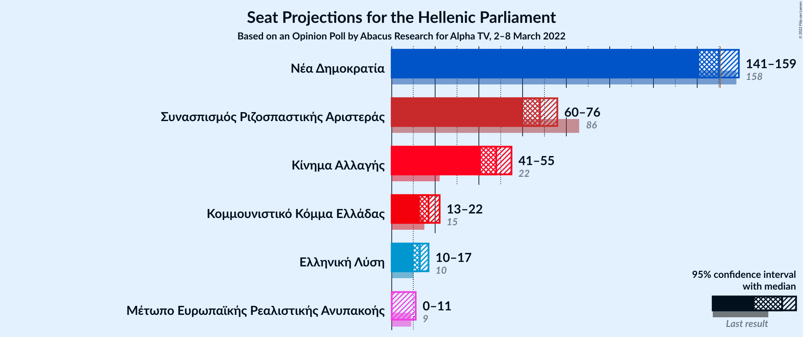

# Opinion Poll by Abacus Research for Alpha TV, 2–8 March 2022

<a href="#voting-intentions">Voting Intentions</a> | <a href="#seats">Seats</a> | <a href="#coalitions">Coalitions</a> | <a href="#technical-information">Technical Information</a>

## Voting Intentions

### Confidence Intervals

| Party | Last Result | Poll Result | 80% Confidence Interval | 90% Confidence Interval | 95% Confidence Interval | 99% Confidence Interval |
|:-----:|:-----------:|:-----------:|:-----------------------:|:-----------------------:|:-----------------------:|:-----------------------:|
| Νέα Δημοκρατία | 39.8% | 34.5% | 32.6–36.4% |32.1–37.0% |31.7–37.5% |30.8–38.4% |
| Συνασπισμός Ριζοσπαστικής Αριστεράς | 31.5% | 23.5% | 21.9–25.3% |21.4–25.8% |21.0–26.2% |20.2–27.1% |
| Κίνημα Αλλαγής | 8.1% | 16.5% | 15.1–18.0% |14.7–18.5% |14.3–18.9% |13.7–19.6% |
| Κομμουνιστικό Κόμμα Ελλάδας | 5.3% | 5.8% | 5.0–6.9% |4.8–7.2% |4.6–7.5% |4.2–8.0% |
| Ελληνική Λύση | 3.7% | 4.5% | 3.7–5.4% |3.6–5.7% |3.4–5.9% |3.0–6.4% |
| Μέτωπο Ευρωπαϊκής Ρεαλιστικής Ανυπακοής | 3.4% | 2.8% | 2.3–3.6% |2.1–3.8% |2.0–4.0% |1.7–4.5% |

*Note:* The poll result column reflects the actual value used in the calculations. Published results may vary slightly, and in addition be rounded to fewer digits.

## Seats

### Confidence Intervals

| Party | Last Result | Median | 80% Confidence Interval | 90% Confidence Interval | 95% Confidence Interval | 99% Confidence Interval |
|:-----:|:-----------:|:------:|:-----------------------:|:-----------------------:|:-----------------------:|:-----------------------:|
| <a href="#νέα-δημοκρατία">Νέα Δημοκρατία</a> | 158 | 150 | 144–156 |142–157 |141–159 |138–162 |
| <a href="#συνασπισμός-ριζοσπαστικής-αριστεράς">Συνασπισμός Ριζοσπαστικής Αριστεράς</a> | 86 | 68 | 63–73 |62–75 |60–76 |58–78 |
| <a href="#κίνημα-αλλαγής">Κίνημα Αλλαγής</a> | 22 | 48 | 43–52 |42–54 |41–55 |39–57 |
| <a href="#κομμουνιστικό-κόμμα-ελλάδας">Κομμουνιστικό Κόμμα Ελλάδας</a> | 15 | 17 | 14–20 |14–21 |13–22 |12–23 |
| <a href="#ελληνική-λύση">Ελληνική Λύση</a> | 10 | 13 | 11–16 |10–16 |10–17 |9–19 |
| <a href="#μέτωπο-ευρωπαϊκής-ρεαλιστικής-ανυπακοής">Μέτωπο Ευρωπαϊκής Ρεαλιστικής Ανυπακοής</a> | 9 | 0 | 0–10 |0–11 |0–11 |0–13 |

### Νέα Δημοκρατία

*For a full overview of the results for this party, see the [Νέα Δημοκρατία](party-νέαδημοκρατία.html) page.*

| Number of Seats | Probability | Accumulated | Special Marks |
|:---------------:|:-----------:|:-----------:|:-------------:|
| 135 | 0% | 100% |  |
| 136 | 0.1% | 99.9% |  |
| 137 | 0.1% | 99.9% |  |
| 138 | 0.3% | 99.7% |  |
| 139 | 0.4% | 99.5% |  |
| 140 | 0.8% | 99.0% |  |
| 141 | 1.4% | 98% |  |
| 142 | 2% | 97% |  |
| 143 | 3% | 95% |  |
| 144 | 4% | 92% |  |
| 145 | 5% | 88% |  |
| 146 | 6% | 83% |  |
| 147 | 8% | 77% |  |
| 148 | 8% | 69% |  |
| 149 | 9% | 61% |  |
| 150 | 8% | 52% | Median |
| 151 | 9% | 44% | Majority |
| 152 | 7% | 35% |  |
| 153 | 7% | 28% |  |
| 154 | 6% | 21% |  |
| 155 | 4% | 15% |  |
| 156 | 3% | 11% |  |
| 157 | 3% | 7% |  |
| 158 | 2% | 5% | Last Result |
| 159 | 1.2% | 3% |  |
| 160 | 0.8% | 2% |  |
| 161 | 0.3% | 0.9% |  |
| 162 | 0.3% | 0.5% |  |
| 163 | 0.1% | 0.3% |  |
| 164 | 0.1% | 0.1% |  |
| 165 | 0% | 0.1% |  |
| 166 | 0% | 0% |  |

### Συνασπισμός Ριζοσπαστικής Αριστεράς

*For a full overview of the results for this party, see the [Συνασπισμός Ριζοσπαστικής Αριστεράς](party-συνασπισμόςριζοσπαστικήςαριστεράς.html) page.*

| Number of Seats | Probability | Accumulated | Special Marks |
|:---------------:|:-----------:|:-----------:|:-------------:|
| 56 | 0.1% | 100% |  |
| 57 | 0.2% | 99.9% |  |
| 58 | 0.4% | 99.7% |  |
| 59 | 0.7% | 99.3% |  |
| 60 | 1.2% | 98.7% |  |
| 61 | 2% | 97% |  |
| 62 | 3% | 95% |  |
| 63 | 5% | 92% |  |
| 64 | 6% | 87% |  |
| 65 | 7% | 81% |  |
| 66 | 9% | 74% |  |
| 67 | 11% | 65% |  |
| 68 | 10% | 55% | Median |
| 69 | 10% | 45% |  |
| 70 | 8% | 35% |  |
| 71 | 7% | 27% |  |
| 72 | 7% | 20% |  |
| 73 | 4% | 13% |  |
| 74 | 3% | 8% |  |
| 75 | 2% | 6% |  |
| 76 | 1.5% | 3% |  |
| 77 | 0.9% | 2% |  |
| 78 | 0.5% | 0.9% |  |
| 79 | 0.2% | 0.5% |  |
| 80 | 0.1% | 0.3% |  |
| 81 | 0.1% | 0.1% |  |
| 82 | 0% | 0.1% |  |
| 83 | 0% | 0% |  |
| 84 | 0% | 0% |  |
| 85 | 0% | 0% |  |
| 86 | 0% | 0% | Last Result |

### Κίνημα Αλλαγής

*For a full overview of the results for this party, see the [Κίνημα Αλλαγής](party-κίνημααλλαγής.html) page.*

| Number of Seats | Probability | Accumulated | Special Marks |
|:---------------:|:-----------:|:-----------:|:-------------:|
| 22 | 0% | 100% | Last Result |
| 23 | 0% | 100% |  |
| 24 | 0% | 100% |  |
| 25 | 0% | 100% |  |
| 26 | 0% | 100% |  |
| 27 | 0% | 100% |  |
| 28 | 0% | 100% |  |
| 29 | 0% | 100% |  |
| 30 | 0% | 100% |  |
| 31 | 0% | 100% |  |
| 32 | 0% | 100% |  |
| 33 | 0% | 100% |  |
| 34 | 0% | 100% |  |
| 35 | 0% | 100% |  |
| 36 | 0% | 100% |  |
| 37 | 0% | 100% |  |
| 38 | 0.1% | 99.9% |  |
| 39 | 0.3% | 99.8% |  |
| 40 | 0.8% | 99.4% |  |
| 41 | 2% | 98.7% |  |
| 42 | 3% | 97% |  |
| 43 | 5% | 94% |  |
| 44 | 7% | 89% |  |
| 45 | 9% | 83% |  |
| 46 | 10% | 74% |  |
| 47 | 11% | 64% |  |
| 48 | 11% | 53% | Median |
| 49 | 11% | 41% |  |
| 50 | 9% | 31% |  |
| 51 | 7% | 22% |  |
| 52 | 5% | 14% |  |
| 53 | 4% | 9% |  |
| 54 | 2% | 5% |  |
| 55 | 1.4% | 3% |  |
| 56 | 0.8% | 1.5% |  |
| 57 | 0.4% | 0.7% |  |
| 58 | 0.2% | 0.3% |  |
| 59 | 0.1% | 0.1% |  |
| 60 | 0% | 0.1% |  |
| 61 | 0% | 0% |  |

### Κομμουνιστικό Κόμμα Ελλάδας

*For a full overview of the results for this party, see the [Κομμουνιστικό Κόμμα Ελλάδας](party-κομμουνιστικόκόμμαελλάδας.html) page.*

| Number of Seats | Probability | Accumulated | Special Marks |
|:---------------:|:-----------:|:-----------:|:-------------:|
| 11 | 0.1% | 100% |  |
| 12 | 0.8% | 99.8% |  |
| 13 | 3% | 99.0% |  |
| 14 | 7% | 96% |  |
| 15 | 13% | 90% | Last Result |
| 16 | 16% | 77% |  |
| 17 | 19% | 61% | Median |
| 18 | 16% | 42% |  |
| 19 | 11% | 26% |  |
| 20 | 8% | 14% |  |
| 21 | 4% | 6% |  |
| 22 | 2% | 3% |  |
| 23 | 0.7% | 1.0% |  |
| 24 | 0.2% | 0.3% |  |
| 25 | 0.1% | 0.1% |  |
| 26 | 0% | 0% |  |

### Ελληνική Λύση

*For a full overview of the results for this party, see the [Ελληνική Λύση](party-ελληνικήλύση.html) page.*

| Number of Seats | Probability | Accumulated | Special Marks |
|:---------------:|:-----------:|:-----------:|:-------------:|
| 0 | 0.4% | 100% |  |
| 1 | 0% | 99.6% |  |
| 2 | 0% | 99.6% |  |
| 3 | 0% | 99.6% |  |
| 4 | 0% | 99.6% |  |
| 5 | 0% | 99.6% |  |
| 6 | 0% | 99.6% |  |
| 7 | 0% | 99.6% |  |
| 8 | 0% | 99.6% |  |
| 9 | 1.2% | 99.6% |  |
| 10 | 5% | 98% | Last Result |
| 11 | 12% | 94% |  |
| 12 | 19% | 82% |  |
| 13 | 21% | 63% | Median |
| 14 | 18% | 42% |  |
| 15 | 13% | 24% |  |
| 16 | 7% | 12% |  |
| 17 | 3% | 5% |  |
| 18 | 1.2% | 2% |  |
| 19 | 0.4% | 0.6% |  |
| 20 | 0.1% | 0.2% |  |
| 21 | 0% | 0% |  |

### Μέτωπο Ευρωπαϊκής Ρεαλιστικής Ανυπακοής

*For a full overview of the results for this party, see the [Μέτωπο Ευρωπαϊκής Ρεαλιστικής Ανυπακοής](party-μέτωποευρωπαϊκήςρεαλιστικήςανυπακοής.html) page.*

| Number of Seats | Probability | Accumulated | Special Marks |
|:---------------:|:-----------:|:-----------:|:-------------:|
| 0 | 59% | 100% | Median |
| 1 | 0% | 41% |  |
| 2 | 0% | 41% |  |
| 3 | 0% | 41% |  |
| 4 | 0% | 41% |  |
| 5 | 0% | 41% |  |
| 6 | 0% | 41% |  |
| 7 | 0% | 41% |  |
| 8 | 0.5% | 41% |  |
| 9 | 20% | 41% | Last Result |
| 10 | 13% | 21% |  |
| 11 | 5% | 7% |  |
| 12 | 2% | 2% |  |
| 13 | 0.5% | 0.6% |  |
| 14 | 0.1% | 0.1% |  |
| 15 | 0% | 0% |  |

## Coalitions

### Confidence Intervals

| Coalition | Last Result | Median | Majority? | 80% Confidence Interval | 90% Confidence Interval | 95% Confidence Interval | 99% Confidence Interval |
|:---------:|:-----------:|:------:|:---------:|:-----------------------:|:-----------------------:|:-----------------------:|:-----------------------:|
| Νέα Δημοκρατία – Κίνημα Αλλαγής | 180 | 198 | 100% | 191–204 | 189–206 | 188–207 | 185–210 |
| Νέα Δημοκρατία | 158 | 150 | 44% | 144–156 | 142–157 | 141–159 | 138–162 |
| Συνασπισμός Ριζοσπαστικής Αριστεράς – Μέτωπο Ευρωπαϊκής Ρεαλιστικής Ανυπακοής | 95 | 72 | 0% | 66–79 | 64–81 | 63–82 | 60–85 |
| Συνασπισμός Ριζοσπαστικής Αριστεράς | 86 | 68 | 0% | 63–73 | 62–75 | 60–76 | 58–78 |

### Νέα Δημοκρατία – Κίνημα Αλλαγής

| Number of Seats | Probability | Accumulated | Special Marks |
|:---------------:|:-----------:|:-----------:|:-------------:|
| 180 | 0% | 100% | Last Result |
| 181 | 0% | 100% |  |
| 182 | 0.1% | 100% |  |
| 183 | 0.1% | 99.9% |  |
| 184 | 0.1% | 99.8% |  |
| 185 | 0.3% | 99.7% |  |
| 186 | 0.6% | 99.4% |  |
| 187 | 1.0% | 98.7% |  |
| 188 | 1.0% | 98% |  |
| 189 | 2% | 97% |  |
| 190 | 3% | 95% |  |
| 191 | 3% | 91% |  |
| 192 | 4% | 88% |  |
| 193 | 6% | 84% |  |
| 194 | 7% | 79% |  |
| 195 | 6% | 72% |  |
| 196 | 7% | 66% |  |
| 197 | 8% | 59% |  |
| 198 | 9% | 51% | Median |
| 199 | 7% | 42% |  |
| 200 | 6% | 36% |  |
| 201 | 7% | 30% |  |
| 202 | 5% | 22% |  |
| 203 | 5% | 17% |  |
| 204 | 4% | 12% |  |
| 205 | 3% | 9% |  |
| 206 | 2% | 6% |  |
| 207 | 1.1% | 3% |  |
| 208 | 1.0% | 2% |  |
| 209 | 0.5% | 1.2% |  |
| 210 | 0.3% | 0.7% |  |
| 211 | 0.2% | 0.4% |  |
| 212 | 0.1% | 0.2% |  |
| 213 | 0.1% | 0.1% |  |
| 214 | 0% | 0% |  |

### Νέα Δημοκρατία

| Number of Seats | Probability | Accumulated | Special Marks |
|:---------------:|:-----------:|:-----------:|:-------------:|
| 135 | 0% | 100% |  |
| 136 | 0.1% | 99.9% |  |
| 137 | 0.1% | 99.9% |  |
| 138 | 0.3% | 99.7% |  |
| 139 | 0.4% | 99.5% |  |
| 140 | 0.8% | 99.0% |  |
| 141 | 1.4% | 98% |  |
| 142 | 2% | 97% |  |
| 143 | 3% | 95% |  |
| 144 | 4% | 92% |  |
| 145 | 5% | 88% |  |
| 146 | 6% | 83% |  |
| 147 | 8% | 77% |  |
| 148 | 8% | 69% |  |
| 149 | 9% | 61% |  |
| 150 | 8% | 52% | Median |
| 151 | 9% | 44% | Majority |
| 152 | 7% | 35% |  |
| 153 | 7% | 28% |  |
| 154 | 6% | 21% |  |
| 155 | 4% | 15% |  |
| 156 | 3% | 11% |  |
| 157 | 3% | 7% |  |
| 158 | 2% | 5% | Last Result |
| 159 | 1.2% | 3% |  |
| 160 | 0.8% | 2% |  |
| 161 | 0.3% | 0.9% |  |
| 162 | 0.3% | 0.5% |  |
| 163 | 0.1% | 0.3% |  |
| 164 | 0.1% | 0.1% |  |
| 165 | 0% | 0.1% |  |
| 166 | 0% | 0% |  |

### Συνασπισμός Ριζοσπαστικής Αριστεράς – Μέτωπο Ευρωπαϊκής Ρεαλιστικής Ανυπακοής

| Number of Seats | Probability | Accumulated | Special Marks |
|:---------------:|:-----------:|:-----------:|:-------------:|
| 58 | 0.1% | 100% |  |
| 59 | 0.2% | 99.9% |  |
| 60 | 0.3% | 99.7% |  |
| 61 | 0.6% | 99.4% |  |
| 62 | 1.1% | 98.9% |  |
| 63 | 2% | 98% |  |
| 64 | 3% | 96% |  |
| 65 | 3% | 93% |  |
| 66 | 4% | 90% |  |
| 67 | 6% | 86% |  |
| 68 | 6% | 80% | Median |
| 69 | 7% | 74% |  |
| 70 | 7% | 67% |  |
| 71 | 7% | 60% |  |
| 72 | 8% | 53% |  |
| 73 | 6% | 45% |  |
| 74 | 6% | 39% |  |
| 75 | 6% | 33% |  |
| 76 | 6% | 26% |  |
| 77 | 5% | 21% |  |
| 78 | 5% | 16% |  |
| 79 | 3% | 11% |  |
| 80 | 3% | 8% |  |
| 81 | 2% | 5% |  |
| 82 | 1.2% | 3% |  |
| 83 | 0.8% | 2% |  |
| 84 | 0.5% | 1.1% |  |
| 85 | 0.3% | 0.6% |  |
| 86 | 0.1% | 0.3% |  |
| 87 | 0.1% | 0.1% |  |
| 88 | 0% | 0.1% |  |
| 89 | 0% | 0% |  |
| 90 | 0% | 0% |  |
| 91 | 0% | 0% |  |
| 92 | 0% | 0% |  |
| 93 | 0% | 0% |  |
| 94 | 0% | 0% |  |
| 95 | 0% | 0% | Last Result |

### Συνασπισμός Ριζοσπαστικής Αριστεράς

| Number of Seats | Probability | Accumulated | Special Marks |
|:---------------:|:-----------:|:-----------:|:-------------:|
| 56 | 0.1% | 100% |  |
| 57 | 0.2% | 99.9% |  |
| 58 | 0.4% | 99.7% |  |
| 59 | 0.7% | 99.3% |  |
| 60 | 1.2% | 98.7% |  |
| 61 | 2% | 97% |  |
| 62 | 3% | 95% |  |
| 63 | 5% | 92% |  |
| 64 | 6% | 87% |  |
| 65 | 7% | 81% |  |
| 66 | 9% | 74% |  |
| 67 | 11% | 65% |  |
| 68 | 10% | 55% | Median |
| 69 | 10% | 45% |  |
| 70 | 8% | 35% |  |
| 71 | 7% | 27% |  |
| 72 | 7% | 20% |  |
| 73 | 4% | 13% |  |
| 74 | 3% | 8% |  |
| 75 | 2% | 6% |  |
| 76 | 1.5% | 3% |  |
| 77 | 0.9% | 2% |  |
| 78 | 0.5% | 0.9% |  |
| 79 | 0.2% | 0.5% |  |
| 80 | 0.1% | 0.3% |  |
| 81 | 0.1% | 0.1% |  |
| 82 | 0% | 0.1% |  |
| 83 | 0% | 0% |  |
| 84 | 0% | 0% |  |
| 85 | 0% | 0% |  |
| 86 | 0% | 0% | Last Result |

## Technical Information

### Opinion Poll

+ **Polling firm:** Abacus Research
+ **Commissioner(s):** Alpha TV
+ **Fieldwork period:** 2–8 March 2022

### Calculations

+ **Sample size:** 1026
+ **Simulations done:** 1,048,576
+ **Error estimate:** 0.67%

