# Opinion Poll by GPO for Powergame.gr, 9–11 March 2022

<a href="#voting-intentions">Voting Intentions</a> | <a href="#seats">Seats</a> | <a href="#coalitions">Coalitions</a> | <a href="#technical-information">Technical Information</a>

## Voting Intentions

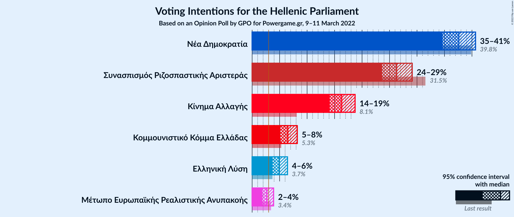

### Confidence Intervals

| Party | Last Result | Poll Result | 80% Confidence Interval | 90% Confidence Interval | 95% Confidence Interval | 99% Confidence Interval |
|:-----:|:-----------:|:-----------:|:-----------------------:|:-----------------------:|:-----------------------:|:-----------------------:|
| Νέα Δημοκρατία | 39.8% | 37.6% | 35.7–39.6% |35.1–40.2% |34.6–40.6% |33.7–41.6% |
| Συνασπισμός Ριζοσπαστικής Αριστεράς | 31.5% | 26.3% | 24.6–28.2% |24.1–28.7% |23.7–29.1% |22.8–30.0% |
| Κίνημα Αλλαγής | 8.1% | 16.3% | 14.9–17.9% |14.5–18.3% |14.1–18.7% |13.5–19.5% |
| Κομμουνιστικό Κόμμα Ελλάδας | 5.3% | 6.5% | 5.6–7.6% |5.3–7.9% |5.1–8.2% |4.7–8.8% |
| Ελληνική Λύση | 3.7% | 4.9% | 4.1–5.9% |3.9–6.2% |3.7–6.4% |3.4–6.9% |
| Μέτωπο Ευρωπαϊκής Ρεαλιστικής Ανυπακοής | 3.4% | 2.7% | 2.1–3.5% |2.0–3.7% |1.9–3.9% |1.6–4.3% |

*Note:* The poll result column reflects the actual value used in the calculations. Published results may vary slightly, and in addition be rounded to fewer digits.

## Seats

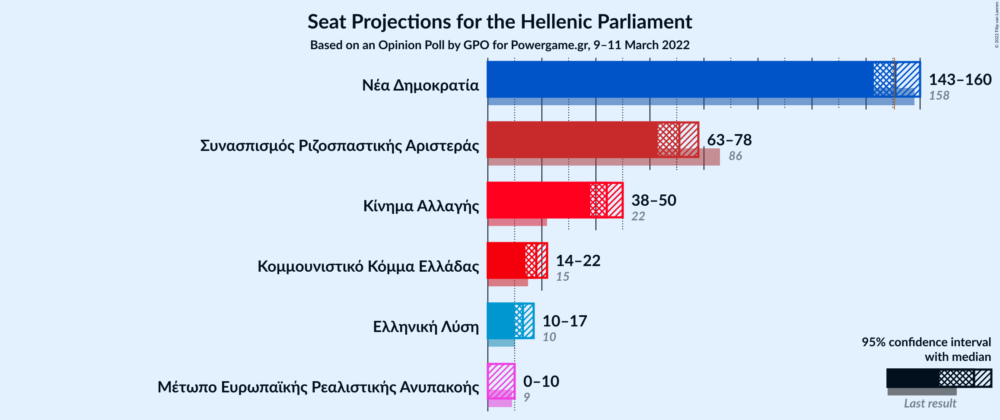

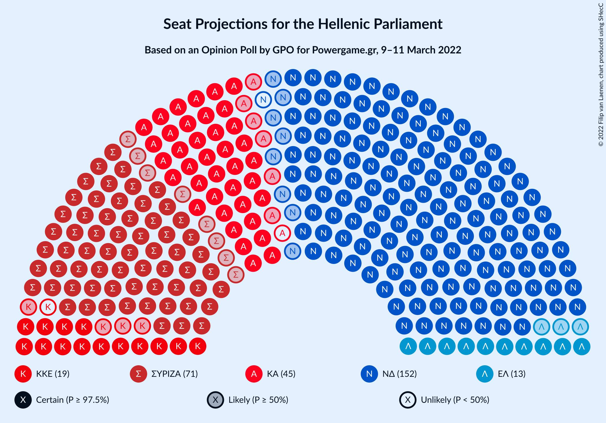

### Confidence Intervals

| Party | Last Result | Median | 80% Confidence Interval | 90% Confidence Interval | 95% Confidence Interval | 99% Confidence Interval |
|:-----:|:-----------:|:------:|:-----------------------:|:-----------------------:|:-----------------------:|:-----------------------:|
| <a href="#νέα-δημοκρατία">Νέα Δημοκρατία</a> | 158 | 151 | 146–157 |144–158 |143–160 |140–162 |
| <a href="#συνασπισμός-ριζοσπαστικής-αριστεράς">Συνασπισμός Ριζοσπαστικής Αριστεράς</a> | 86 | 71 | 66–76 |65–77 |63–78 |61–81 |
| <a href="#κίνημα-αλλαγής">Κίνημα Αλλαγής</a> | 22 | 44 | 40–48 |39–49 |38–50 |36–53 |
| <a href="#κομμουνιστικό-κόμμα-ελλάδας">Κομμουνιστικό Κόμμα Ελλάδας</a> | 15 | 18 | 15–20 |14–21 |14–22 |13–24 |
| <a href="#ελληνική-λύση">Ελληνική Λύση</a> | 10 | 13 | 11–16 |11–17 |10–17 |9–19 |
| <a href="#μέτωπο-ευρωπαϊκής-ρεαλιστικής-ανυπακοής">Μέτωπο Ευρωπαϊκής Ρεαλιστικής Ανυπακοής</a> | 9 | 0 | 0–9 |0–10 |0–10 |0–11 |

### Νέα Δημοκρατία

*For a full overview of the results for this party, see the [Νέα Δημοκρατία](party-νέαδημοκρατία.html) page.*

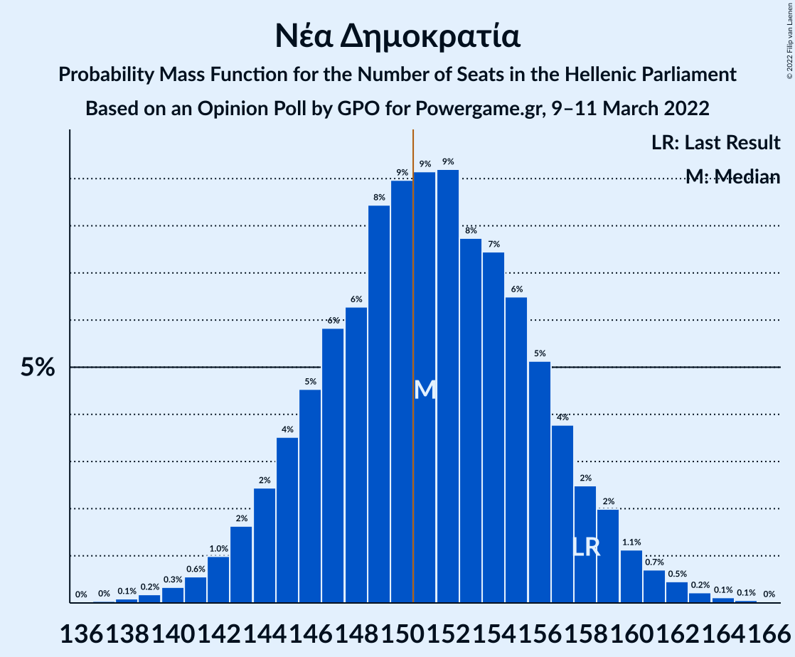

| Number of Seats | Probability | Accumulated | Special Marks |
|:---------------:|:-----------:|:-----------:|:-------------:|
| 137 | 0% | 100% |  |
| 138 | 0.1% | 99.9% |  |
| 139 | 0.2% | 99.8% |  |
| 140 | 0.3% | 99.7% |  |
| 141 | 0.6% | 99.3% |  |
| 142 | 1.0% | 98.8% |  |
| 143 | 2% | 98% |  |
| 144 | 2% | 96% |  |
| 145 | 4% | 94% |  |
| 146 | 5% | 90% |  |
| 147 | 6% | 86% |  |
| 148 | 6% | 80% |  |
| 149 | 8% | 74% |  |
| 150 | 9% | 65% |  |
| 151 | 9% | 56% | Median, Majority |
| 152 | 9% | 47% |  |
| 153 | 8% | 38% |  |
| 154 | 7% | 30% |  |
| 155 | 6% | 23% |  |
| 156 | 5% | 16% |  |
| 157 | 4% | 11% |  |
| 158 | 2% | 7% | Last Result |
| 159 | 2% | 5% |  |
| 160 | 1.1% | 3% |  |
| 161 | 0.7% | 2% |  |
| 162 | 0.5% | 0.9% |  |
| 163 | 0.2% | 0.4% |  |
| 164 | 0.1% | 0.2% |  |
| 165 | 0.1% | 0.1% |  |
| 166 | 0% | 0% |  |

### Συνασπισμός Ριζοσπαστικής Αριστεράς

*For a full overview of the results for this party, see the [Συνασπισμός Ριζοσπαστικής Αριστεράς](party-συνασπισμόςριζοσπαστικήςαριστεράς.html) page.*

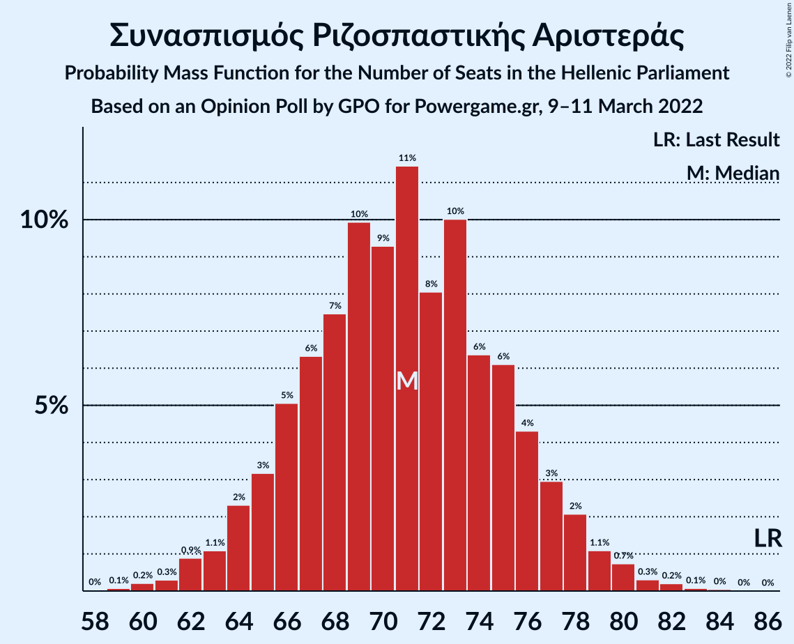

| Number of Seats | Probability | Accumulated | Special Marks |
|:---------------:|:-----------:|:-----------:|:-------------:|
| 59 | 0.1% | 100% |  |
| 60 | 0.2% | 99.9% |  |
| 61 | 0.3% | 99.7% |  |
| 62 | 0.9% | 99.4% |  |
| 63 | 1.1% | 98% |  |
| 64 | 2% | 97% |  |
| 65 | 3% | 95% |  |
| 66 | 5% | 92% |  |
| 67 | 6% | 87% |  |
| 68 | 7% | 81% |  |
| 69 | 10% | 73% |  |
| 70 | 9% | 63% |  |
| 71 | 11% | 54% | Median |
| 72 | 8% | 42% |  |
| 73 | 10% | 34% |  |
| 74 | 6% | 24% |  |
| 75 | 6% | 18% |  |
| 76 | 4% | 12% |  |
| 77 | 3% | 8% |  |
| 78 | 2% | 5% |  |
| 79 | 1.1% | 2% |  |
| 80 | 0.7% | 1.4% |  |
| 81 | 0.3% | 0.7% |  |
| 82 | 0.2% | 0.4% |  |
| 83 | 0.1% | 0.2% |  |
| 84 | 0% | 0.1% |  |
| 85 | 0% | 0% |  |
| 86 | 0% | 0% | Last Result |

### Κίνημα Αλλαγής

*For a full overview of the results for this party, see the [Κίνημα Αλλαγής](party-κίνημααλλαγής.html) page.*

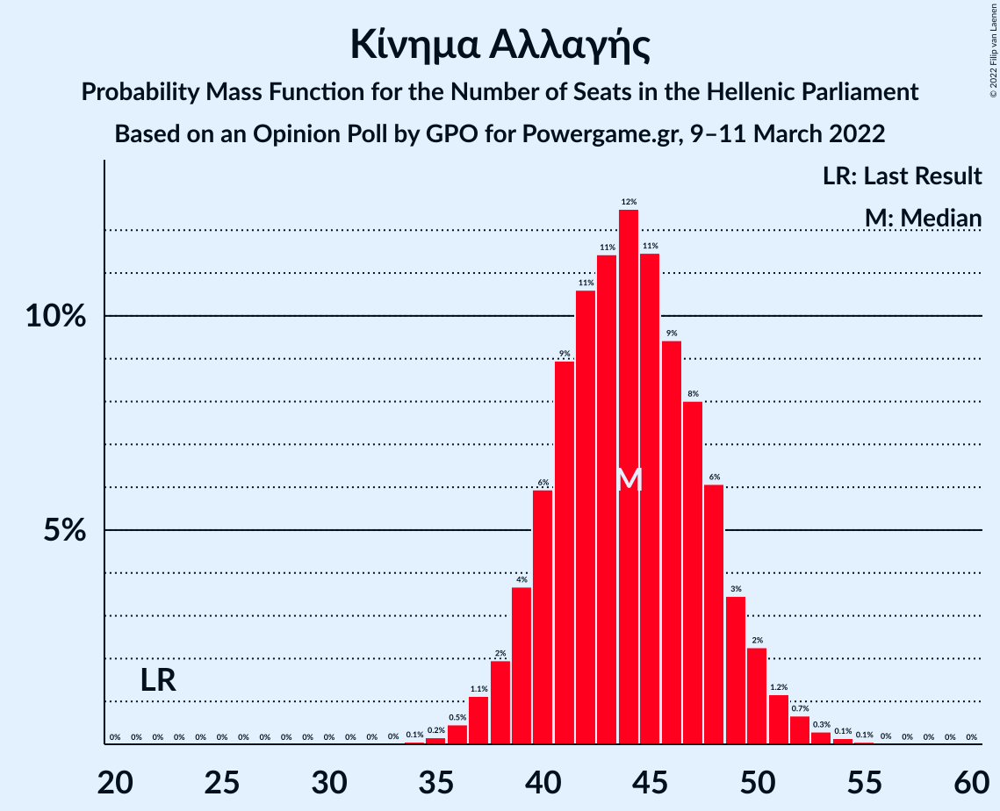

| Number of Seats | Probability | Accumulated | Special Marks |
|:---------------:|:-----------:|:-----------:|:-------------:|
| 22 | 0% | 100% | Last Result |
| 23 | 0% | 100% |  |
| 24 | 0% | 100% |  |
| 25 | 0% | 100% |  |
| 26 | 0% | 100% |  |
| 27 | 0% | 100% |  |
| 28 | 0% | 100% |  |
| 29 | 0% | 100% |  |
| 30 | 0% | 100% |  |
| 31 | 0% | 100% |  |
| 32 | 0% | 100% |  |
| 33 | 0% | 100% |  |
| 34 | 0.1% | 100% |  |
| 35 | 0.2% | 99.9% |  |
| 36 | 0.5% | 99.8% |  |
| 37 | 1.1% | 99.3% |  |
| 38 | 2% | 98% |  |
| 39 | 4% | 96% |  |
| 40 | 6% | 93% |  |
| 41 | 9% | 87% |  |
| 42 | 11% | 78% |  |
| 43 | 11% | 67% |  |
| 44 | 12% | 56% | Median |
| 45 | 11% | 43% |  |
| 46 | 9% | 32% |  |
| 47 | 8% | 22% |  |
| 48 | 6% | 14% |  |
| 49 | 3% | 8% |  |
| 50 | 2% | 5% |  |
| 51 | 1.2% | 2% |  |
| 52 | 0.7% | 1.2% |  |
| 53 | 0.3% | 0.5% |  |
| 54 | 0.1% | 0.2% |  |
| 55 | 0.1% | 0.1% |  |
| 56 | 0% | 0% |  |

### Κομμουνιστικό Κόμμα Ελλάδας

*For a full overview of the results for this party, see the [Κομμουνιστικό Κόμμα Ελλάδας](party-κομμουνιστικόκόμμαελλάδας.html) page.*

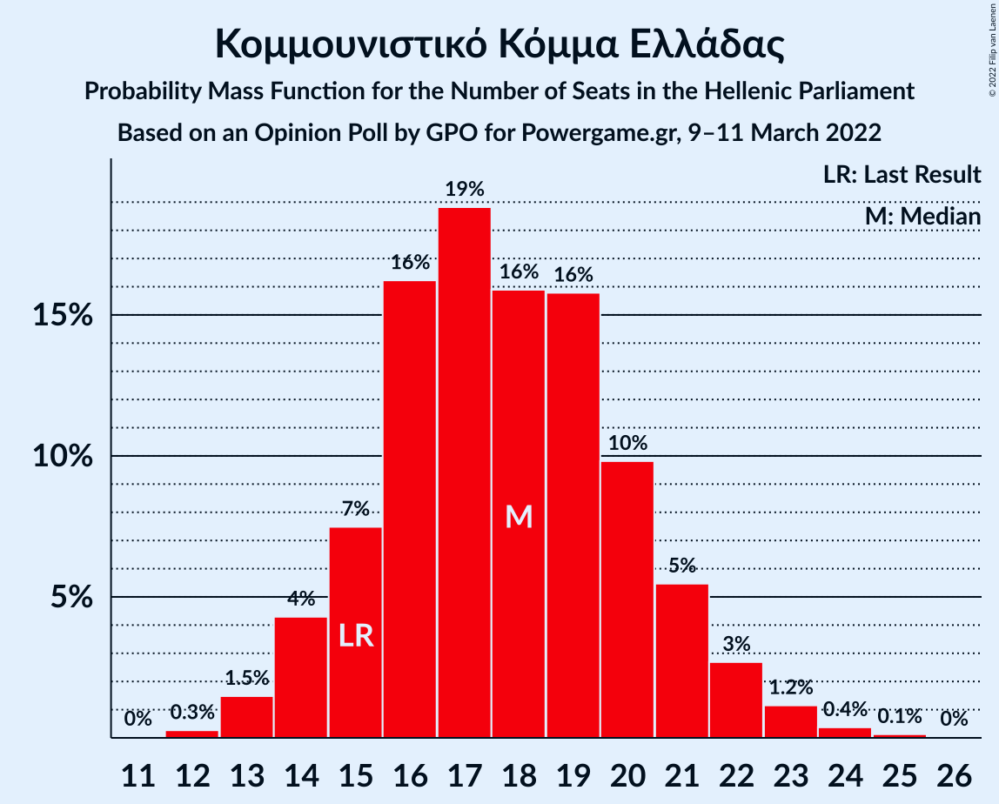

| Number of Seats | Probability | Accumulated | Special Marks |
|:---------------:|:-----------:|:-----------:|:-------------:|
| 12 | 0.3% | 100% |  |
| 13 | 1.5% | 99.7% |  |
| 14 | 4% | 98% |  |
| 15 | 7% | 94% | Last Result |
| 16 | 16% | 86% |  |
| 17 | 19% | 70% |  |
| 18 | 16% | 51% | Median |
| 19 | 16% | 35% |  |
| 20 | 10% | 20% |  |
| 21 | 5% | 10% |  |
| 22 | 3% | 4% |  |
| 23 | 1.2% | 2% |  |
| 24 | 0.4% | 0.6% |  |
| 25 | 0.1% | 0.2% |  |
| 26 | 0% | 0% |  |

### Ελληνική Λύση

*For a full overview of the results for this party, see the [Ελληνική Λύση](party-ελληνικήλύση.html) page.*

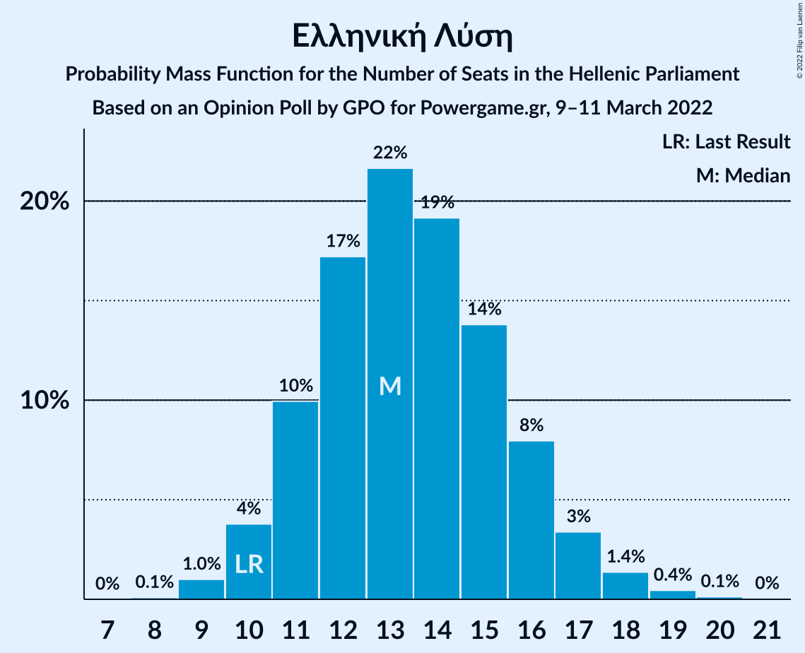

| Number of Seats | Probability | Accumulated | Special Marks |
|:---------------:|:-----------:|:-----------:|:-------------:|
| 8 | 0.1% | 100% |  |
| 9 | 1.0% | 99.9% |  |
| 10 | 4% | 98.9% | Last Result |
| 11 | 10% | 95% |  |
| 12 | 17% | 85% |  |
| 13 | 22% | 68% | Median |
| 14 | 19% | 46% |  |
| 15 | 14% | 27% |  |
| 16 | 8% | 13% |  |
| 17 | 3% | 5% |  |
| 18 | 1.4% | 2% |  |
| 19 | 0.4% | 0.6% |  |
| 20 | 0.1% | 0.2% |  |
| 21 | 0% | 0% |  |

### Μέτωπο Ευρωπαϊκής Ρεαλιστικής Ανυπακοής

*For a full overview of the results for this party, see the [Μέτωπο Ευρωπαϊκής Ρεαλιστικής Ανυπακοής](party-μέτωποευρωπαϊκήςρεαλιστικήςανυπακοής.html) page.*

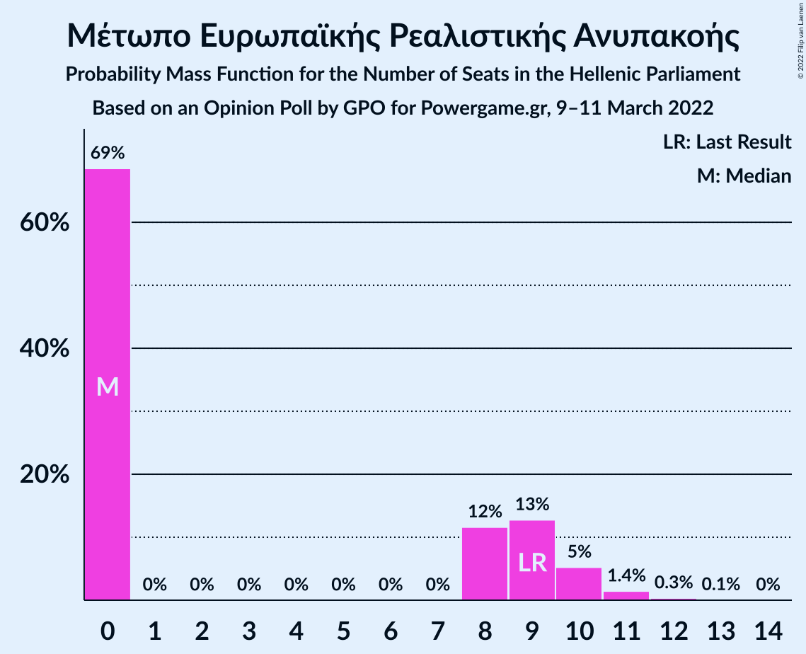

| Number of Seats | Probability | Accumulated | Special Marks |
|:---------------:|:-----------:|:-----------:|:-------------:|
| 0 | 69% | 100% | Median |
| 1 | 0% | 31% |  |
| 2 | 0% | 31% |  |
| 3 | 0% | 31% |  |
| 4 | 0% | 31% |  |
| 5 | 0% | 31% |  |
| 6 | 0% | 31% |  |
| 7 | 0% | 31% |  |
| 8 | 12% | 31% |  |
| 9 | 13% | 20% | Last Result |
| 10 | 5% | 7% |  |
| 11 | 1.4% | 2% |  |
| 12 | 0.3% | 0.4% |  |
| 13 | 0.1% | 0.1% |  |
| 14 | 0% | 0% |  |

## Coalitions

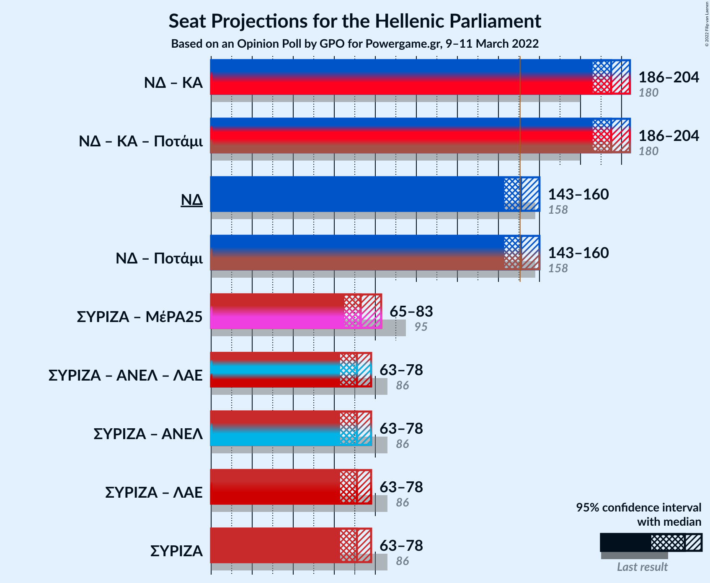

### Confidence Intervals

| Coalition | Last Result | Median | Majority? | 80% Confidence Interval | 90% Confidence Interval | 95% Confidence Interval | 99% Confidence Interval |
|:---------:|:-----------:|:------:|:---------:|:-----------------------:|:-----------------------:|:-----------------------:|:-----------------------:|
| Νέα Δημοκρατία – Κίνημα Αλλαγής | 180 | 195 | 100% | 189–201 | 187–203 | 186–204 | 183–207 |
| Νέα Δημοκρατία | 158 | 151 | 56% | 146–157 | 144–158 | 143–160 | 140–162 |
| Συνασπισμός Ριζοσπαστικής Αριστεράς – Μέτωπο Ευρωπαϊκής Ρεαλιστικής Ανυπακοής | 95 | 73 | 0% | 68–80 | 66–82 | 65–83 | 63–86 |
| Συνασπισμός Ριζοσπαστικής Αριστεράς | 86 | 71 | 0% | 66–76 | 65–77 | 63–78 | 61–81 |

### Νέα Δημοκρατία – Κίνημα Αλλαγής

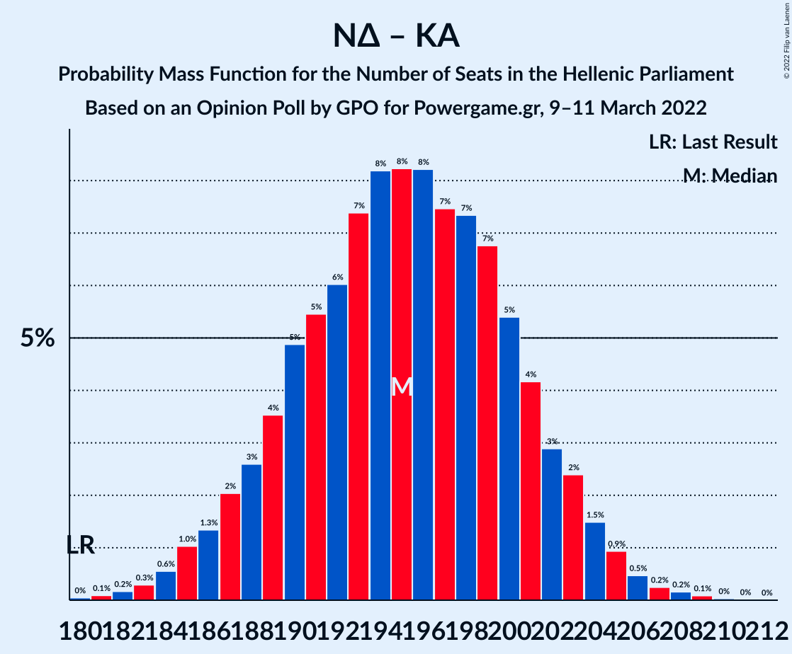

| Number of Seats | Probability | Accumulated | Special Marks |
|:---------------:|:-----------:|:-----------:|:-------------:|
| 180 | 0% | 100% | Last Result |
| 181 | 0.1% | 99.9% |  |
| 182 | 0.2% | 99.8% |  |
| 183 | 0.3% | 99.7% |  |
| 184 | 0.6% | 99.4% |  |
| 185 | 1.0% | 98.8% |  |
| 186 | 1.3% | 98% |  |
| 187 | 2% | 96% |  |
| 188 | 3% | 94% |  |
| 189 | 4% | 92% |  |
| 190 | 5% | 88% |  |
| 191 | 5% | 83% |  |
| 192 | 6% | 78% |  |
| 193 | 7% | 72% |  |
| 194 | 8% | 65% |  |
| 195 | 8% | 56% | Median |
| 196 | 8% | 48% |  |
| 197 | 7% | 40% |  |
| 198 | 7% | 32% |  |
| 199 | 7% | 25% |  |
| 200 | 5% | 18% |  |
| 201 | 4% | 13% |  |
| 202 | 3% | 9% |  |
| 203 | 2% | 6% |  |
| 204 | 1.5% | 3% |  |
| 205 | 0.9% | 2% |  |
| 206 | 0.5% | 1.0% |  |
| 207 | 0.2% | 0.6% |  |
| 208 | 0.2% | 0.3% |  |
| 209 | 0.1% | 0.1% |  |
| 210 | 0% | 0.1% |  |
| 211 | 0% | 0% |  |

### Νέα Δημοκρατία

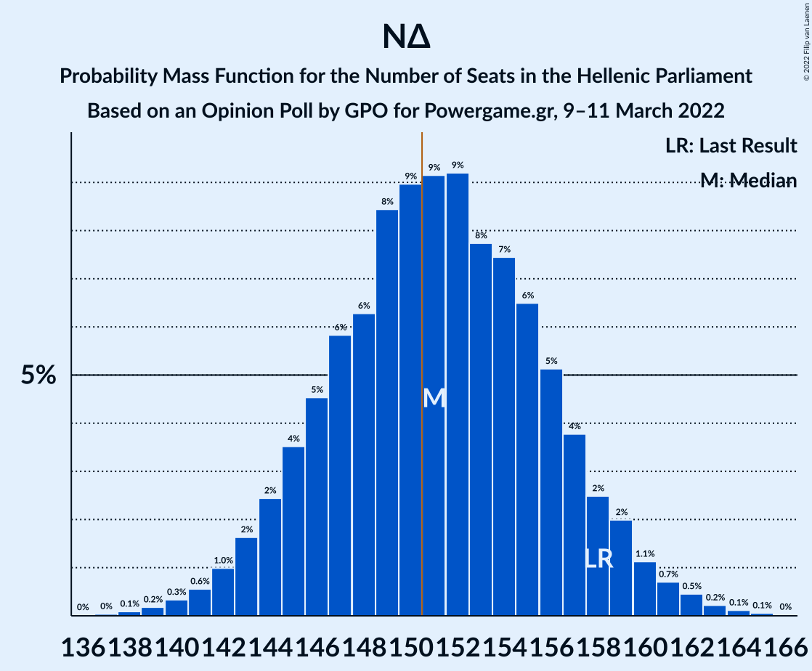

| Number of Seats | Probability | Accumulated | Special Marks |
|:---------------:|:-----------:|:-----------:|:-------------:|
| 137 | 0% | 100% |  |
| 138 | 0.1% | 99.9% |  |
| 139 | 0.2% | 99.8% |  |
| 140 | 0.3% | 99.7% |  |
| 141 | 0.6% | 99.3% |  |
| 142 | 1.0% | 98.8% |  |
| 143 | 2% | 98% |  |
| 144 | 2% | 96% |  |
| 145 | 4% | 94% |  |
| 146 | 5% | 90% |  |
| 147 | 6% | 86% |  |
| 148 | 6% | 80% |  |
| 149 | 8% | 74% |  |
| 150 | 9% | 65% |  |
| 151 | 9% | 56% | Median, Majority |
| 152 | 9% | 47% |  |
| 153 | 8% | 38% |  |
| 154 | 7% | 30% |  |
| 155 | 6% | 23% |  |
| 156 | 5% | 16% |  |
| 157 | 4% | 11% |  |
| 158 | 2% | 7% | Last Result |
| 159 | 2% | 5% |  |
| 160 | 1.1% | 3% |  |
| 161 | 0.7% | 2% |  |
| 162 | 0.5% | 0.9% |  |
| 163 | 0.2% | 0.4% |  |
| 164 | 0.1% | 0.2% |  |
| 165 | 0.1% | 0.1% |  |
| 166 | 0% | 0% |  |

### Συνασπισμός Ριζοσπαστικής Αριστεράς – Μέτωπο Ευρωπαϊκής Ρεαλιστικής Ανυπακοής

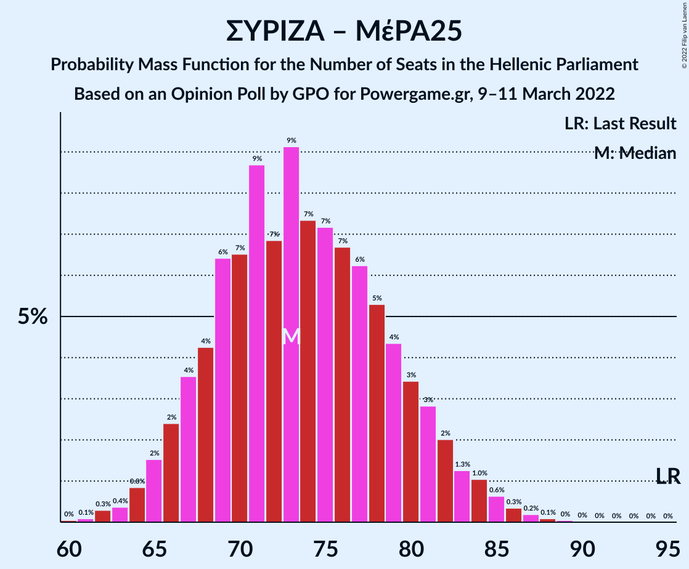

| Number of Seats | Probability | Accumulated | Special Marks |
|:---------------:|:-----------:|:-----------:|:-------------:|
| 60 | 0% | 100% |  |
| 61 | 0.1% | 99.9% |  |
| 62 | 0.3% | 99.8% |  |
| 63 | 0.4% | 99.5% |  |
| 64 | 0.8% | 99.2% |  |
| 65 | 2% | 98% |  |
| 66 | 2% | 97% |  |
| 67 | 4% | 94% |  |
| 68 | 4% | 91% |  |
| 69 | 6% | 87% |  |
| 70 | 7% | 80% |  |
| 71 | 9% | 74% | Median |
| 72 | 7% | 65% |  |
| 73 | 9% | 58% |  |
| 74 | 7% | 49% |  |
| 75 | 7% | 42% |  |
| 76 | 7% | 34% |  |
| 77 | 6% | 28% |  |
| 78 | 5% | 22% |  |
| 79 | 4% | 16% |  |
| 80 | 3% | 12% |  |
| 81 | 3% | 8% |  |
| 82 | 2% | 6% |  |
| 83 | 1.3% | 4% |  |
| 84 | 1.0% | 2% |  |
| 85 | 0.6% | 1.3% |  |
| 86 | 0.3% | 0.7% |  |
| 87 | 0.2% | 0.4% |  |
| 88 | 0.1% | 0.2% |  |
| 89 | 0% | 0.1% |  |
| 90 | 0% | 0% |  |
| 91 | 0% | 0% |  |
| 92 | 0% | 0% |  |
| 93 | 0% | 0% |  |
| 94 | 0% | 0% |  |
| 95 | 0% | 0% | Last Result |

### Συνασπισμός Ριζοσπαστικής Αριστεράς

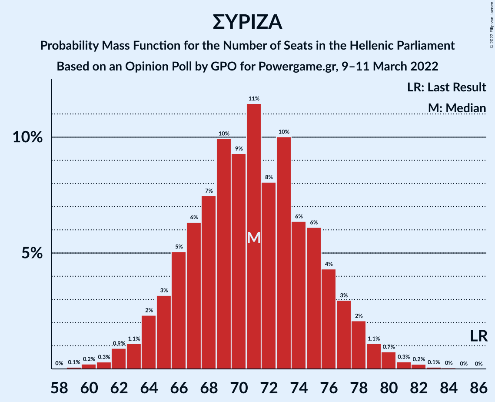

| Number of Seats | Probability | Accumulated | Special Marks |
|:---------------:|:-----------:|:-----------:|:-------------:|
| 59 | 0.1% | 100% |  |
| 60 | 0.2% | 99.9% |  |
| 61 | 0.3% | 99.7% |  |
| 62 | 0.9% | 99.4% |  |
| 63 | 1.1% | 98% |  |
| 64 | 2% | 97% |  |
| 65 | 3% | 95% |  |
| 66 | 5% | 92% |  |
| 67 | 6% | 87% |  |
| 68 | 7% | 81% |  |
| 69 | 10% | 73% |  |
| 70 | 9% | 63% |  |
| 71 | 11% | 54% | Median |
| 72 | 8% | 42% |  |
| 73 | 10% | 34% |  |
| 74 | 6% | 24% |  |
| 75 | 6% | 18% |  |
| 76 | 4% | 12% |  |
| 77 | 3% | 8% |  |
| 78 | 2% | 5% |  |
| 79 | 1.1% | 2% |  |
| 80 | 0.7% | 1.4% |  |
| 81 | 0.3% | 0.7% |  |
| 82 | 0.2% | 0.4% |  |
| 83 | 0.1% | 0.2% |  |
| 84 | 0% | 0.1% |  |
| 85 | 0% | 0% |  |
| 86 | 0% | 0% | Last Result |

## Technical Information

### Opinion Poll

+ **Polling firm:** GPO
+ **Commissioner(s):** Powergame.gr
+ **Fieldwork period:** 9–11 March 2022

### Calculations

+ **Sample size:** 1000
+ **Simulations done:** 1,048,576
+ **Error estimate:** 0.35%

