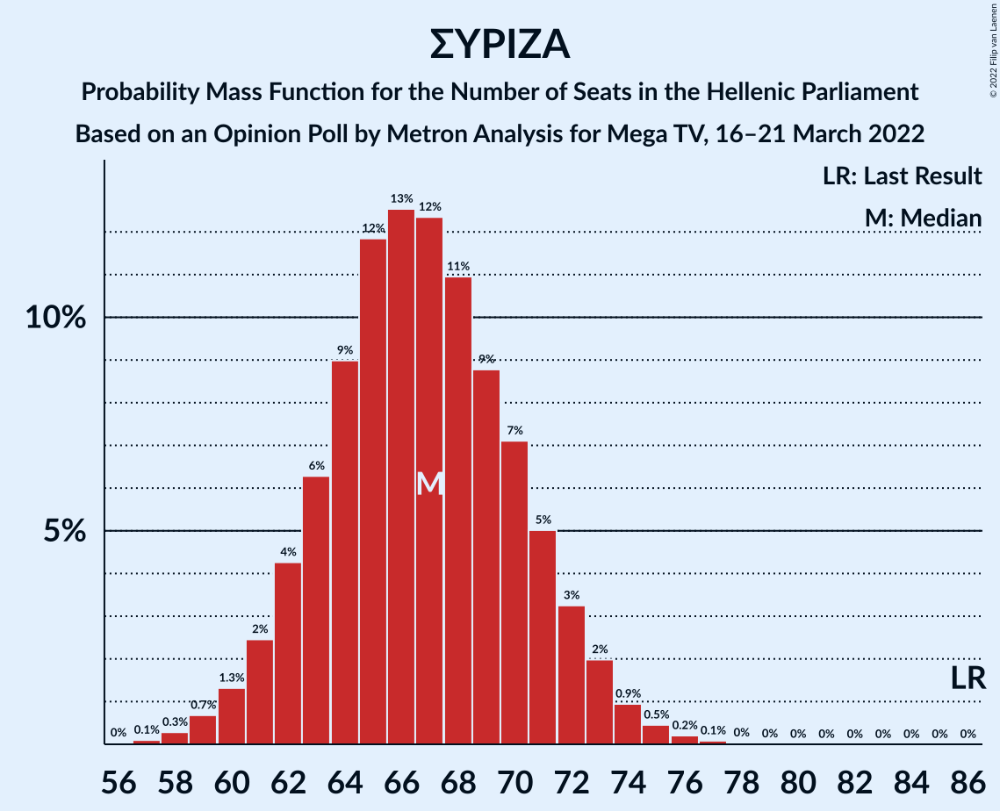

# Opinion Poll by Metron Analysis for Mega TV, 16–21 March 2022

<a href="#voting-intentions">Voting Intentions</a> | <a href="#seats">Seats</a> | <a href="#coalitions">Coalitions</a> | <a href="#technical-information">Technical Information</a>

## Voting Intentions

### Confidence Intervals

| Party | Last Result | Poll Result | 80% Confidence Interval | 90% Confidence Interval | 95% Confidence Interval | 99% Confidence Interval |
|:-----:|:-----------:|:-----------:|:-----------------------:|:-----------------------:|:-----------------------:|:-----------------------:|
| Νέα Δημοκρατία | 39.8% | 34.2% | 32.5–35.9% |32.1–36.4% |31.7–36.8% |30.9–37.7% |
| Συνασπισμός Ριζοσπαστικής Αριστεράς | 31.5% | 24.6% | 23.1–26.2% |22.7–26.6% |22.3–27.0% |21.7–27.8% |
| Κίνημα Αλλαγής | 8.1% | 16.7% | 15.5–18.1% |15.1–18.5% |14.8–18.9% |14.2–19.5% |
| Κομμουνιστικό Κόμμα Ελλάδας | 5.3% | 6.3% | 5.5–7.2% |5.3–7.5% |5.1–7.7% |4.7–8.2% |
| Ελληνική Λύση | 3.7% | 5.9% | 5.1–6.8% |4.9–7.1% |4.7–7.3% |4.4–7.8% |
| Μέτωπο Ευρωπαϊκής Ρεαλιστικής Ανυπακοής | 3.4% | 4.4% | 3.7–5.2% |3.5–5.4% |3.4–5.6% |3.1–6.1% |

*Note:* The poll result column reflects the actual value used in the calculations. Published results may vary slightly, and in addition be rounded to fewer digits.

## Seats

### Confidence Intervals

| Party | Last Result | Median | 80% Confidence Interval | 90% Confidence Interval | 95% Confidence Interval | 99% Confidence Interval |
|:-----:|:-----------:|:------:|:-----------------------:|:-----------------------:|:-----------------------:|:-----------------------:|
| <a href="#νέα-δημοκρατία">Νέα Δημοκρατία</a> | 158 | 143 | 138–147 |137–148 |136–149 |134–152 |
| <a href="#συνασπισμός-ριζοσπαστικής-αριστεράς">Συνασπισμός Ριζοσπαστικής Αριστεράς</a> | 86 | 67 | 63–71 |62–72 |61–73 |59–75 |
| <a href="#κίνημα-αλλαγής">Κίνημα Αλλαγής</a> | 22 | 45 | 42–49 |41–50 |40–51 |38–53 |
| <a href="#κομμουνιστικό-κόμμα-ελλάδας">Κομμουνιστικό Κόμμα Ελλάδας</a> | 15 | 17 | 15–20 |14–20 |14–21 |13–22 |
| <a href="#ελληνική-λύση">Ελληνική Λύση</a> | 10 | 16 | 14–19 |13–19 |13–20 |12–21 |
| <a href="#μέτωπο-ευρωπαϊκής-ρεαλιστικής-ανυπακοής">Μέτωπο Ευρωπαϊκής Ρεαλιστικής Ανυπακοής</a> | 9 | 12 | 10–14 |10–15 |9–15 |8–16 |

### Νέα Δημοκρατία

*For a full overview of the results for this party, see the [Νέα Δημοκρατία](party-νέαδημοκρατία.html) page.*

| Number of Seats | Probability | Accumulated | Special Marks |
|:---------------:|:-----------:|:-----------:|:-------------:|
| 131 | 0% | 100% |  |
| 132 | 0.1% | 99.9% |  |
| 133 | 0.2% | 99.8% |  |
| 134 | 0.6% | 99.6% |  |
| 135 | 1.0% | 99.0% |  |
| 136 | 2% | 98% |  |
| 137 | 3% | 96% |  |
| 138 | 6% | 93% |  |
| 139 | 6% | 87% |  |
| 140 | 8% | 81% |  |
| 141 | 12% | 74% |  |
| 142 | 12% | 62% |  |
| 143 | 10% | 50% | Median |
| 144 | 11% | 40% |  |
| 145 | 10% | 29% |  |
| 146 | 6% | 19% |  |
| 147 | 5% | 13% |  |
| 148 | 4% | 9% |  |
| 149 | 2% | 5% |  |
| 150 | 1.1% | 2% |  |
| 151 | 0.7% | 1.3% | Majority |
| 152 | 0.4% | 0.6% |  |
| 153 | 0.1% | 0.2% |  |
| 154 | 0.1% | 0.1% |  |
| 155 | 0% | 0% |  |
| 156 | 0% | 0% |  |
| 157 | 0% | 0% |  |
| 158 | 0% | 0% | Last Result |

### Συνασπισμός Ριζοσπαστικής Αριστεράς

*For a full overview of the results for this party, see the [Συνασπισμός Ριζοσπαστικής Αριστεράς](party-συνασπισμόςριζοσπαστικήςαριστεράς.html) page.*

| Number of Seats | Probability | Accumulated | Special Marks |
|:---------------:|:-----------:|:-----------:|:-------------:|
| 57 | 0.1% | 100% |  |
| 58 | 0.3% | 99.9% |  |
| 59 | 0.7% | 99.6% |  |
| 60 | 1.3% | 98.9% |  |
| 61 | 2% | 98% |  |
| 62 | 4% | 95% |  |
| 63 | 6% | 91% |  |
| 64 | 9% | 85% |  |
| 65 | 12% | 76% |  |
| 66 | 13% | 64% |  |
| 67 | 12% | 51% | Median |
| 68 | 11% | 39% |  |
| 69 | 9% | 28% |  |
| 70 | 7% | 19% |  |
| 71 | 5% | 12% |  |
| 72 | 3% | 7% |  |
| 73 | 2% | 4% |  |
| 74 | 0.9% | 2% |  |
| 75 | 0.5% | 0.8% |  |
| 76 | 0.2% | 0.3% |  |
| 77 | 0.1% | 0.1% |  |
| 78 | 0% | 0.1% |  |
| 79 | 0% | 0% |  |
| 80 | 0% | 0% |  |
| 81 | 0% | 0% |  |
| 82 | 0% | 0% |  |
| 83 | 0% | 0% |  |
| 84 | 0% | 0% |  |
| 85 | 0% | 0% |  |
| 86 | 0% | 0% | Last Result |

### Κίνημα Αλλαγής

*For a full overview of the results for this party, see the [Κίνημα Αλλαγής](party-κίνημααλλαγής.html) page.*

| Number of Seats | Probability | Accumulated | Special Marks |
|:---------------:|:-----------:|:-----------:|:-------------:|
| 22 | 0% | 100% | Last Result |
| 23 | 0% | 100% |  |
| 24 | 0% | 100% |  |
| 25 | 0% | 100% |  |
| 26 | 0% | 100% |  |
| 27 | 0% | 100% |  |
| 28 | 0% | 100% |  |
| 29 | 0% | 100% |  |
| 30 | 0% | 100% |  |
| 31 | 0% | 100% |  |
| 32 | 0% | 100% |  |
| 33 | 0% | 100% |  |
| 34 | 0% | 100% |  |
| 35 | 0% | 100% |  |
| 36 | 0% | 100% |  |
| 37 | 0.1% | 100% |  |
| 38 | 0.4% | 99.8% |  |
| 39 | 1.0% | 99.5% |  |
| 40 | 2% | 98% |  |
| 41 | 4% | 96% |  |
| 42 | 7% | 92% |  |
| 43 | 10% | 85% |  |
| 44 | 13% | 75% |  |
| 45 | 14% | 61% | Median |
| 46 | 14% | 47% |  |
| 47 | 12% | 33% |  |
| 48 | 8% | 22% |  |
| 49 | 6% | 13% |  |
| 50 | 4% | 7% |  |
| 51 | 2% | 3% |  |
| 52 | 0.9% | 2% |  |
| 53 | 0.4% | 0.6% |  |
| 54 | 0.2% | 0.2% |  |
| 55 | 0.1% | 0.1% |  |
| 56 | 0% | 0% |  |

### Κομμουνιστικό Κόμμα Ελλάδας

*For a full overview of the results for this party, see the [Κομμουνιστικό Κόμμα Ελλάδας](party-κομμουνιστικόκόμμαελλάδας.html) page.*

| Number of Seats | Probability | Accumulated | Special Marks |
|:---------------:|:-----------:|:-----------:|:-------------:|
| 12 | 0.2% | 100% |  |
| 13 | 1.3% | 99.7% |  |
| 14 | 5% | 98% |  |
| 15 | 11% | 94% | Last Result |
| 16 | 17% | 82% |  |
| 17 | 22% | 65% | Median |
| 18 | 19% | 42% |  |
| 19 | 12% | 23% |  |
| 20 | 7% | 11% |  |
| 21 | 3% | 4% |  |
| 22 | 0.9% | 1.3% |  |
| 23 | 0.3% | 0.3% |  |
| 24 | 0.1% | 0.1% |  |
| 25 | 0% | 0% |  |

### Ελληνική Λύση

*For a full overview of the results for this party, see the [Ελληνική Λύση](party-ελληνικήλύση.html) page.*

| Number of Seats | Probability | Accumulated | Special Marks |
|:---------------:|:-----------:|:-----------:|:-------------:|
| 10 | 0% | 100% | Last Result |
| 11 | 0.2% | 100% |  |
| 12 | 1.2% | 99.8% |  |
| 13 | 5% | 98.6% |  |
| 14 | 11% | 94% |  |
| 15 | 19% | 83% |  |
| 16 | 23% | 64% | Median |
| 17 | 19% | 41% |  |
| 18 | 12% | 22% |  |
| 19 | 7% | 10% |  |
| 20 | 3% | 4% |  |
| 21 | 0.7% | 1.0% |  |
| 22 | 0.2% | 0.3% |  |
| 23 | 0% | 0.1% |  |
| 24 | 0% | 0% |  |

### Μέτωπο Ευρωπαϊκής Ρεαλιστικής Ανυπακοής

*For a full overview of the results for this party, see the [Μέτωπο Ευρωπαϊκής Ρεαλιστικής Ανυπακοής](party-μέτωποευρωπαϊκήςρεαλιστικήςανυπακοής.html) page.*

| Number of Seats | Probability | Accumulated | Special Marks |
|:---------------:|:-----------:|:-----------:|:-------------:|
| 0 | 0.3% | 100% |  |
| 1 | 0% | 99.7% |  |
| 2 | 0% | 99.7% |  |
| 3 | 0% | 99.7% |  |
| 4 | 0% | 99.7% |  |
| 5 | 0% | 99.7% |  |
| 6 | 0% | 99.7% |  |
| 7 | 0% | 99.7% |  |
| 8 | 0.4% | 99.7% |  |
| 9 | 4% | 99.3% | Last Result |
| 10 | 12% | 96% |  |
| 11 | 22% | 84% |  |
| 12 | 25% | 61% | Median |
| 13 | 20% | 36% |  |
| 14 | 11% | 17% |  |
| 15 | 4% | 6% |  |
| 16 | 1.3% | 2% |  |
| 17 | 0.3% | 0.4% |  |
| 18 | 0.1% | 0.1% |  |
| 19 | 0% | 0% |  |

## Coalitions

### Confidence Intervals

| Coalition | Last Result | Median | Majority? | 80% Confidence Interval | 90% Confidence Interval | 95% Confidence Interval | 99% Confidence Interval |
|:---------:|:-----------:|:------:|:---------:|:-----------------------:|:-----------------------:|:-----------------------:|:-----------------------:|
| Νέα Δημοκρατία – Κίνημα Αλλαγής | 180 | 188 | 100% | 183–193 | 182–194 | 181–195 | 179–197 |
| Νέα Δημοκρατία | 158 | 143 | 1.3% | 138–147 | 137–148 | 136–149 | 134–152 |
| Συνασπισμός Ριζοσπαστικής Αριστεράς – Μέτωπο Ευρωπαϊκής Ρεαλιστικής Ανυπακοής | 95 | 79 | 0% | 74–83 | 73–84 | 72–85 | 70–87 |
| Συνασπισμός Ριζοσπαστικής Αριστεράς | 86 | 67 | 0% | 63–71 | 62–72 | 61–73 | 59–75 |

### Νέα Δημοκρατία – Κίνημα Αλλαγής

| Number of Seats | Probability | Accumulated | Special Marks |
|:---------------:|:-----------:|:-----------:|:-------------:|
| 176 | 0% | 100% |  |
| 177 | 0.1% | 99.9% |  |
| 178 | 0.2% | 99.8% |  |
| 179 | 0.6% | 99.6% |  |
| 180 | 0.9% | 99.0% | Last Result |
| 181 | 2% | 98% |  |
| 182 | 3% | 96% |  |
| 183 | 4% | 93% |  |
| 184 | 6% | 89% |  |
| 185 | 7% | 83% |  |
| 186 | 9% | 75% |  |
| 187 | 11% | 66% |  |
| 188 | 11% | 55% | Median |
| 189 | 10% | 44% |  |
| 190 | 10% | 33% |  |
| 191 | 7% | 23% |  |
| 192 | 6% | 16% |  |
| 193 | 5% | 10% |  |
| 194 | 2% | 6% |  |
| 195 | 2% | 4% |  |
| 196 | 1.0% | 2% |  |
| 197 | 0.4% | 0.9% |  |
| 198 | 0.2% | 0.4% |  |
| 199 | 0.1% | 0.2% |  |
| 200 | 0% | 0.1% |  |
| 201 | 0% | 0% |  |

### Νέα Δημοκρατία

| Number of Seats | Probability | Accumulated | Special Marks |
|:---------------:|:-----------:|:-----------:|:-------------:|
| 131 | 0% | 100% |  |
| 132 | 0.1% | 99.9% |  |
| 133 | 0.2% | 99.8% |  |
| 134 | 0.6% | 99.6% |  |
| 135 | 1.0% | 99.0% |  |
| 136 | 2% | 98% |  |
| 137 | 3% | 96% |  |
| 138 | 6% | 93% |  |
| 139 | 6% | 87% |  |
| 140 | 8% | 81% |  |
| 141 | 12% | 74% |  |
| 142 | 12% | 62% |  |
| 143 | 10% | 50% | Median |
| 144 | 11% | 40% |  |
| 145 | 10% | 29% |  |
| 146 | 6% | 19% |  |
| 147 | 5% | 13% |  |
| 148 | 4% | 9% |  |
| 149 | 2% | 5% |  |
| 150 | 1.1% | 2% |  |
| 151 | 0.7% | 1.3% | Majority |
| 152 | 0.4% | 0.6% |  |
| 153 | 0.1% | 0.2% |  |
| 154 | 0.1% | 0.1% |  |
| 155 | 0% | 0% |  |
| 156 | 0% | 0% |  |
| 157 | 0% | 0% |  |
| 158 | 0% | 0% | Last Result |

### Συνασπισμός Ριζοσπαστικής Αριστεράς – Μέτωπο Ευρωπαϊκής Ρεαλιστικής Ανυπακοής

| Number of Seats | Probability | Accumulated | Special Marks |
|:---------------:|:-----------:|:-----------:|:-------------:|
| 67 | 0% | 100% |  |
| 68 | 0.1% | 99.9% |  |
| 69 | 0.2% | 99.8% |  |
| 70 | 0.4% | 99.6% |  |
| 71 | 0.9% | 99.2% |  |
| 72 | 2% | 98% |  |
| 73 | 3% | 97% |  |
| 74 | 4% | 94% |  |
| 75 | 6% | 90% |  |
| 76 | 9% | 83% |  |
| 77 | 11% | 74% |  |
| 78 | 11% | 63% |  |
| 79 | 13% | 53% | Median |
| 80 | 11% | 40% |  |
| 81 | 9% | 28% |  |
| 82 | 7% | 20% |  |
| 83 | 5% | 13% |  |
| 84 | 4% | 8% |  |
| 85 | 2% | 4% |  |
| 86 | 1.1% | 2% |  |
| 87 | 0.6% | 1.1% |  |
| 88 | 0.3% | 0.5% |  |
| 89 | 0.1% | 0.2% |  |
| 90 | 0% | 0.1% |  |
| 91 | 0% | 0% |  |
| 92 | 0% | 0% |  |
| 93 | 0% | 0% |  |
| 94 | 0% | 0% |  |
| 95 | 0% | 0% | Last Result |

### Συνασπισμός Ριζοσπαστικής Αριστεράς

| Number of Seats | Probability | Accumulated | Special Marks |
|:---------------:|:-----------:|:-----------:|:-------------:|
| 57 | 0.1% | 100% |  |
| 58 | 0.3% | 99.9% |  |
| 59 | 0.7% | 99.6% |  |
| 60 | 1.3% | 98.9% |  |
| 61 | 2% | 98% |  |
| 62 | 4% | 95% |  |
| 63 | 6% | 91% |  |
| 64 | 9% | 85% |  |
| 65 | 12% | 76% |  |
| 66 | 13% | 64% |  |
| 67 | 12% | 51% | Median |
| 68 | 11% | 39% |  |
| 69 | 9% | 28% |  |
| 70 | 7% | 19% |  |
| 71 | 5% | 12% |  |
| 72 | 3% | 7% |  |
| 73 | 2% | 4% |  |
| 74 | 0.9% | 2% |  |
| 75 | 0.5% | 0.8% |  |
| 76 | 0.2% | 0.3% |  |
| 77 | 0.1% | 0.1% |  |
| 78 | 0% | 0.1% |  |
| 79 | 0% | 0% |  |
| 80 | 0% | 0% |  |
| 81 | 0% | 0% |  |
| 82 | 0% | 0% |  |
| 83 | 0% | 0% |  |
| 84 | 0% | 0% |  |
| 85 | 0% | 0% |  |
| 86 | 0% | 0% | Last Result |

## Technical Information

### Opinion Poll

+ **Polling firm:** Metron Analysis
+ **Commissioner(s):** Mega TV
+ **Fieldwork period:** 16–21 March 2022

### Calculations

+ **Sample size:** 1304
+ **Simulations done:** 1,048,576
+ **Error estimate:** 1.31%

