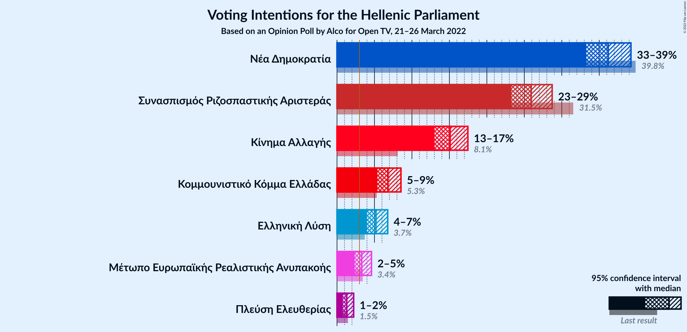

# Opinion Poll by Alco for Open TV, 21–26 March 2022

<a href="#voting-intentions">Voting Intentions</a> | <a href="#seats">Seats</a> | <a href="#coalitions">Coalitions</a> | <a href="#technical-information">Technical Information</a>

## Voting Intentions

### Confidence Intervals

| Party | Last Result | Poll Result | 80% Confidence Interval | 90% Confidence Interval | 95% Confidence Interval | 99% Confidence Interval |
|:-----:|:-----------:|:-----------:|:-----------------------:|:-----------------------:|:-----------------------:|:-----------------------:|
| Νέα Δημοκρατία | 39.8% | 36.2% | 34.3–38.2% |33.7–38.7% |33.3–39.2% |32.4–40.2% |
| Συνασπισμός Ριζοσπαστικής Αριστεράς | 31.5% | 25.9% | 24.2–27.7% |23.7–28.3% |23.3–28.7% |22.5–29.6% |
| Κίνημα Αλλαγής | 8.1% | 15.1% | 13.7–16.6% |13.3–17.1% |13.0–17.5% |12.4–18.2% |
| Κομμουνιστικό Κόμμα Ελλάδας | 5.3% | 6.8% | 5.9–7.9% |5.6–8.3% |5.4–8.5% |5.0–9.1% |
| Ελληνική Λύση | 3.7% | 5.2% | 4.4–6.2% |4.2–6.5% |4.0–6.8% |3.6–7.3% |
| Μέτωπο Ευρωπαϊκής Ρεαλιστικής Ανυπακοής | 3.4% | 3.3% | 2.7–4.1% |2.5–4.4% |2.4–4.6% |2.1–5.0% |
| Πλεύση Ελευθερίας | 1.5% | 1.3% | 0.9–1.9% |0.8–2.1% |0.8–2.2% |0.6–2.5% |

*Note:* The poll result column reflects the actual value used in the calculations. Published results may vary slightly, and in addition be rounded to fewer digits.

## Seats

### Confidence Intervals

| Party | Last Result | Median | 80% Confidence Interval | 90% Confidence Interval | 95% Confidence Interval | 99% Confidence Interval |
|:-----:|:-----------:|:------:|:-----------------------:|:-----------------------:|:-----------------------:|:-----------------------:|
| <a href="#νέα-δημοκρατία">Νέα Δημοκρατία</a> | 158 | 148 | 143–154 |141–156 |140–157 |138–160 |
| <a href="#συνασπισμός-ριζοσπαστικής-αριστεράς">Συνασπισμός Ριζοσπαστικής Αριστεράς</a> | 86 | 71 | 65–75 |64–77 |63–78 |61–82 |
| <a href="#κίνημα-αλλαγής">Κίνημα Αλλαγής</a> | 22 | 41 | 37–45 |36–46 |35–47 |34–50 |
| <a href="#κομμουνιστικό-κόμμα-ελλάδας">Κομμουνιστικό Κόμμα Ελλάδας</a> | 15 | 19 | 16–22 |15–22 |15–23 |13–25 |
| <a href="#ελληνική-λύση">Ελληνική Λύση</a> | 10 | 14 | 12–17 |11–18 |11–18 |10–20 |
| <a href="#μέτωπο-ευρωπαϊκής-ρεαλιστικής-ανυπακοής">Μέτωπο Ευρωπαϊκής Ρεαλιστικής Ανυπακοής</a> | 9 | 9 | 0–11 |0–12 |0–12 |0–14 |
| <a href="#πλεύση-ελευθερίας">Πλεύση Ελευθερίας</a> | 0 | 0 | 0 |0 |0 |0 |

### Νέα Δημοκρατία

*For a full overview of the results for this party, see the [Νέα Δημοκρατία](party-νέαδημοκρατία.html) page.*

| Number of Seats | Probability | Accumulated | Special Marks |
|:---------------:|:-----------:|:-----------:|:-------------:|
| 135 | 0.1% | 100% |  |
| 136 | 0.1% | 99.9% |  |
| 137 | 0.3% | 99.8% |  |
| 138 | 0.5% | 99.5% |  |
| 139 | 0.9% | 99.0% |  |
| 140 | 2% | 98% |  |
| 141 | 3% | 96% |  |
| 142 | 3% | 94% |  |
| 143 | 4% | 91% |  |
| 144 | 6% | 86% |  |
| 145 | 8% | 80% |  |
| 146 | 7% | 72% |  |
| 147 | 8% | 65% |  |
| 148 | 9% | 56% | Median |
| 149 | 8% | 48% |  |
| 150 | 7% | 39% |  |
| 151 | 8% | 32% | Majority |
| 152 | 7% | 24% |  |
| 153 | 6% | 17% |  |
| 154 | 3% | 12% |  |
| 155 | 3% | 8% |  |
| 156 | 2% | 5% |  |
| 157 | 1.4% | 4% |  |
| 158 | 1.0% | 2% | Last Result |
| 159 | 0.6% | 1.2% |  |
| 160 | 0.3% | 0.6% |  |
| 161 | 0.2% | 0.4% |  |
| 162 | 0.1% | 0.2% |  |
| 163 | 0% | 0.1% |  |
| 164 | 0% | 0.1% |  |
| 165 | 0% | 0% |  |

### Συνασπισμός Ριζοσπαστικής Αριστεράς

*For a full overview of the results for this party, see the [Συνασπισμός Ριζοσπαστικής Αριστεράς](party-συνασπισμόςριζοσπαστικήςαριστεράς.html) page.*

| Number of Seats | Probability | Accumulated | Special Marks |
|:---------------:|:-----------:|:-----------:|:-------------:|
| 58 | 0% | 100% |  |
| 59 | 0.1% | 99.9% |  |
| 60 | 0.3% | 99.9% |  |
| 61 | 0.6% | 99.5% |  |
| 62 | 0.5% | 98.9% |  |
| 63 | 2% | 98% |  |
| 64 | 4% | 96% |  |
| 65 | 3% | 92% |  |
| 66 | 3% | 89% |  |
| 67 | 11% | 86% |  |
| 68 | 11% | 75% |  |
| 69 | 5% | 64% |  |
| 70 | 9% | 59% |  |
| 71 | 15% | 51% | Median |
| 72 | 7% | 36% |  |
| 73 | 3% | 28% |  |
| 74 | 10% | 25% |  |
| 75 | 7% | 15% |  |
| 76 | 2% | 8% |  |
| 77 | 2% | 6% |  |
| 78 | 2% | 5% |  |
| 79 | 0.9% | 2% |  |
| 80 | 0.1% | 1.3% |  |
| 81 | 0.5% | 1.1% |  |
| 82 | 0.5% | 0.6% |  |
| 83 | 0% | 0.1% |  |
| 84 | 0% | 0.1% |  |
| 85 | 0% | 0% |  |
| 86 | 0% | 0% | Last Result |

### Κίνημα Αλλαγής

*For a full overview of the results for this party, see the [Κίνημα Αλλαγής](party-κίνημααλλαγής.html) page.*

| Number of Seats | Probability | Accumulated | Special Marks |
|:---------------:|:-----------:|:-----------:|:-------------:|
| 22 | 0% | 100% | Last Result |
| 23 | 0% | 100% |  |
| 24 | 0% | 100% |  |
| 25 | 0% | 100% |  |
| 26 | 0% | 100% |  |
| 27 | 0% | 100% |  |
| 28 | 0% | 100% |  |
| 29 | 0% | 100% |  |
| 30 | 0% | 100% |  |
| 31 | 0% | 100% |  |
| 32 | 0.1% | 100% |  |
| 33 | 0.3% | 99.8% |  |
| 34 | 0.8% | 99.5% |  |
| 35 | 2% | 98.7% |  |
| 36 | 3% | 97% |  |
| 37 | 5% | 94% |  |
| 38 | 9% | 88% |  |
| 39 | 10% | 80% |  |
| 40 | 12% | 70% |  |
| 41 | 12% | 57% | Median |
| 42 | 13% | 45% |  |
| 43 | 10% | 33% |  |
| 44 | 8% | 22% |  |
| 45 | 6% | 15% |  |
| 46 | 4% | 8% |  |
| 47 | 2% | 5% |  |
| 48 | 1.4% | 2% |  |
| 49 | 0.6% | 1.1% |  |
| 50 | 0.3% | 0.5% |  |
| 51 | 0.1% | 0.2% |  |
| 52 | 0% | 0.1% |  |
| 53 | 0% | 0% |  |

### Κομμουνιστικό Κόμμα Ελλάδας

*For a full overview of the results for this party, see the [Κομμουνιστικό Κόμμα Ελλάδας](party-κομμουνιστικόκόμμαελλάδας.html) page.*

| Number of Seats | Probability | Accumulated | Special Marks |
|:---------------:|:-----------:|:-----------:|:-------------:|
| 12 | 0.1% | 100% |  |
| 13 | 0.4% | 99.9% |  |
| 14 | 2% | 99.5% |  |
| 15 | 5% | 98% | Last Result |
| 16 | 9% | 93% |  |
| 17 | 14% | 83% |  |
| 18 | 17% | 69% |  |
| 19 | 18% | 52% | Median |
| 20 | 14% | 34% |  |
| 21 | 10% | 20% |  |
| 22 | 5% | 10% |  |
| 23 | 3% | 5% |  |
| 24 | 1.2% | 2% |  |
| 25 | 0.4% | 0.6% |  |
| 26 | 0.1% | 0.2% |  |
| 27 | 0% | 0.1% |  |
| 28 | 0% | 0% |  |

### Ελληνική Λύση

*For a full overview of the results for this party, see the [Ελληνική Λύση](party-ελληνικήλύση.html) page.*

| Number of Seats | Probability | Accumulated | Special Marks |
|:---------------:|:-----------:|:-----------:|:-------------:|
| 9 | 0.2% | 100% |  |
| 10 | 1.3% | 99.8% | Last Result |
| 11 | 5% | 98% |  |
| 12 | 11% | 94% |  |
| 13 | 18% | 83% |  |
| 14 | 19% | 64% | Median |
| 15 | 18% | 46% |  |
| 16 | 14% | 28% |  |
| 17 | 8% | 14% |  |
| 18 | 4% | 6% |  |
| 19 | 2% | 2% |  |
| 20 | 0.4% | 0.6% |  |
| 21 | 0.1% | 0.2% |  |
| 22 | 0% | 0.1% |  |
| 23 | 0% | 0% |  |

### Μέτωπο Ευρωπαϊκής Ρεαλιστικής Ανυπακοής

*For a full overview of the results for this party, see the [Μέτωπο Ευρωπαϊκής Ρεαλιστικής Ανυπακοής](party-μέτωποευρωπαϊκήςρεαλιστικήςανυπακοής.html) page.*

| Number of Seats | Probability | Accumulated | Special Marks |
|:---------------:|:-----------:|:-----------:|:-------------:|
| 0 | 27% | 100% |  |
| 1 | 0% | 73% |  |
| 2 | 0% | 73% |  |
| 3 | 0% | 73% |  |
| 4 | 0% | 73% |  |
| 5 | 0% | 73% |  |
| 6 | 0% | 73% |  |
| 7 | 0% | 73% |  |
| 8 | 7% | 73% |  |
| 9 | 27% | 65% | Last Result, Median |
| 10 | 20% | 38% |  |
| 11 | 12% | 18% |  |
| 12 | 4% | 7% |  |
| 13 | 2% | 2% |  |
| 14 | 0.5% | 0.6% |  |
| 15 | 0.1% | 0.1% |  |
| 16 | 0% | 0% |  |

### Πλεύση Ελευθερίας

*For a full overview of the results for this party, see the [Πλεύση Ελευθερίας](party-πλεύσηελευθερίας.html) page.*

| Number of Seats | Probability | Accumulated | Special Marks |
|:---------------:|:-----------:|:-----------:|:-------------:|
| 0 | 100% | 100% | Last Result, Median |

## Coalitions

### Confidence Intervals

| Coalition | Last Result | Median | Majority? | 80% Confidence Interval | 90% Confidence Interval | 95% Confidence Interval | 99% Confidence Interval |
|:---------:|:-----------:|:------:|:---------:|:-----------------------:|:-----------------------:|:-----------------------:|:-----------------------:|
| Νέα Δημοκρατία – Κίνημα Αλλαγής | 180 | 190 | 100% | 183–196 | 182–197 | 181–199 | 178–202 |
| Νέα Δημοκρατία | 158 | 148 | 32% | 143–154 | 141–156 | 140–157 | 138–160 |
| Συνασπισμός Ριζοσπαστικής Αριστεράς – Μέτωπο Ευρωπαϊκής Ρεαλιστικής Ανυπακοής | 95 | 77 | 0% | 71–84 | 70–85 | 67–86 | 64–89 |
| Συνασπισμός Ριζοσπαστικής Αριστεράς | 86 | 71 | 0% | 65–75 | 64–77 | 63–78 | 61–82 |

### Νέα Δημοκρατία – Κίνημα Αλλαγής

| Number of Seats | Probability | Accumulated | Special Marks |
|:---------------:|:-----------:|:-----------:|:-------------:|
| 175 | 0.1% | 100% |  |
| 176 | 0.1% | 99.9% |  |
| 177 | 0.1% | 99.8% |  |
| 178 | 0.3% | 99.7% |  |
| 179 | 0.7% | 99.4% |  |
| 180 | 0.9% | 98.6% | Last Result |
| 181 | 2% | 98% |  |
| 182 | 3% | 96% |  |
| 183 | 3% | 93% |  |
| 184 | 5% | 90% |  |
| 185 | 5% | 85% |  |
| 186 | 8% | 80% |  |
| 187 | 7% | 72% |  |
| 188 | 7% | 65% |  |
| 189 | 8% | 58% | Median |
| 190 | 10% | 50% |  |
| 191 | 7% | 40% |  |
| 192 | 6% | 33% |  |
| 193 | 6% | 26% |  |
| 194 | 6% | 20% |  |
| 195 | 4% | 14% |  |
| 196 | 3% | 10% |  |
| 197 | 3% | 8% |  |
| 198 | 2% | 5% |  |
| 199 | 1.0% | 3% |  |
| 200 | 1.0% | 2% |  |
| 201 | 0.4% | 1.0% |  |
| 202 | 0.3% | 0.6% |  |
| 203 | 0.2% | 0.4% |  |
| 204 | 0.1% | 0.2% |  |
| 205 | 0.1% | 0.1% |  |
| 206 | 0% | 0.1% |  |
| 207 | 0% | 0% |  |

### Νέα Δημοκρατία

| Number of Seats | Probability | Accumulated | Special Marks |
|:---------------:|:-----------:|:-----------:|:-------------:|
| 135 | 0.1% | 100% |  |
| 136 | 0.1% | 99.9% |  |
| 137 | 0.3% | 99.8% |  |
| 138 | 0.5% | 99.5% |  |
| 139 | 0.9% | 99.0% |  |
| 140 | 2% | 98% |  |
| 141 | 3% | 96% |  |
| 142 | 3% | 94% |  |
| 143 | 4% | 91% |  |
| 144 | 6% | 86% |  |
| 145 | 8% | 80% |  |
| 146 | 7% | 72% |  |
| 147 | 8% | 65% |  |
| 148 | 9% | 56% | Median |
| 149 | 8% | 48% |  |
| 150 | 7% | 39% |  |
| 151 | 8% | 32% | Majority |
| 152 | 7% | 24% |  |
| 153 | 6% | 17% |  |
| 154 | 3% | 12% |  |
| 155 | 3% | 8% |  |
| 156 | 2% | 5% |  |
| 157 | 1.4% | 4% |  |
| 158 | 1.0% | 2% | Last Result |
| 159 | 0.6% | 1.2% |  |
| 160 | 0.3% | 0.6% |  |
| 161 | 0.2% | 0.4% |  |
| 162 | 0.1% | 0.2% |  |
| 163 | 0% | 0.1% |  |
| 164 | 0% | 0.1% |  |
| 165 | 0% | 0% |  |

### Συνασπισμός Ριζοσπαστικής Αριστεράς – Μέτωπο Ευρωπαϊκής Ρεαλιστικής Ανυπακοής

| Number of Seats | Probability | Accumulated | Special Marks |
|:---------------:|:-----------:|:-----------:|:-------------:|
| 63 | 0.2% | 100% |  |
| 64 | 0.4% | 99.8% |  |
| 65 | 0.1% | 99.4% |  |
| 66 | 0.5% | 99.3% |  |
| 67 | 2% | 98.8% |  |
| 68 | 1.3% | 97% |  |
| 69 | 0.5% | 96% |  |
| 70 | 3% | 95% |  |
| 71 | 5% | 92% |  |
| 72 | 2% | 87% |  |
| 73 | 3% | 85% |  |
| 74 | 10% | 82% |  |
| 75 | 5% | 72% |  |
| 76 | 5% | 67% |  |
| 77 | 12% | 61% |  |
| 78 | 8% | 50% |  |
| 79 | 5% | 41% |  |
| 80 | 6% | 37% | Median |
| 81 | 10% | 31% |  |
| 82 | 6% | 21% |  |
| 83 | 3% | 15% |  |
| 84 | 6% | 12% |  |
| 85 | 3% | 6% |  |
| 86 | 1.2% | 3% |  |
| 87 | 0.7% | 2% |  |
| 88 | 0.6% | 1.3% |  |
| 89 | 0.5% | 0.7% |  |
| 90 | 0.1% | 0.3% |  |
| 91 | 0.1% | 0.2% |  |
| 92 | 0.1% | 0.1% |  |
| 93 | 0% | 0% |  |
| 94 | 0% | 0% |  |
| 95 | 0% | 0% | Last Result |

### Συνασπισμός Ριζοσπαστικής Αριστεράς

| Number of Seats | Probability | Accumulated | Special Marks |
|:---------------:|:-----------:|:-----------:|:-------------:|
| 58 | 0% | 100% |  |
| 59 | 0.1% | 99.9% |  |
| 60 | 0.3% | 99.9% |  |
| 61 | 0.6% | 99.5% |  |
| 62 | 0.5% | 98.9% |  |
| 63 | 2% | 98% |  |
| 64 | 4% | 96% |  |
| 65 | 3% | 92% |  |
| 66 | 3% | 89% |  |
| 67 | 11% | 86% |  |
| 68 | 11% | 75% |  |
| 69 | 5% | 64% |  |
| 70 | 9% | 59% |  |
| 71 | 15% | 51% | Median |
| 72 | 7% | 36% |  |
| 73 | 3% | 28% |  |
| 74 | 10% | 25% |  |
| 75 | 7% | 15% |  |
| 76 | 2% | 8% |  |
| 77 | 2% | 6% |  |
| 78 | 2% | 5% |  |
| 79 | 0.9% | 2% |  |
| 80 | 0.1% | 1.3% |  |
| 81 | 0.5% | 1.1% |  |
| 82 | 0.5% | 0.6% |  |
| 83 | 0% | 0.1% |  |
| 84 | 0% | 0.1% |  |
| 85 | 0% | 0% |  |
| 86 | 0% | 0% | Last Result |

## Technical Information

### Opinion Poll

+ **Polling firm:** Alco
+ **Commissioner(s):** Open TV
+ **Fieldwork period:** 21–26 March 2022

### Calculations

+ **Sample size:** 1000
+ **Simulations done:** 1,048,576
+ **Error estimate:** 0.94%

