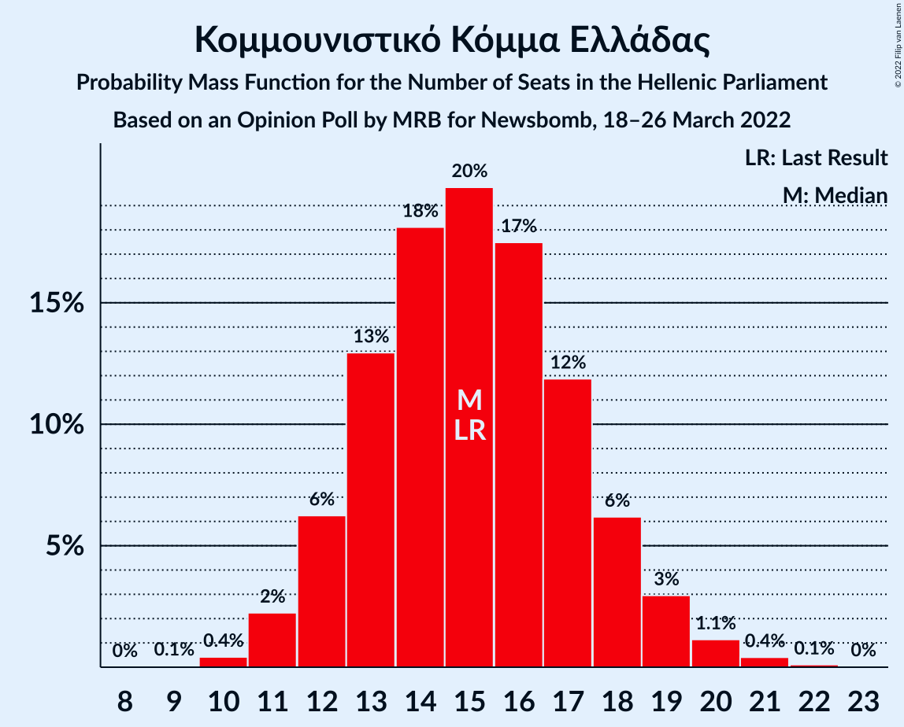

# Opinion Poll by MRB for Newsbomb, 18–26 March 2022

<a href="#voting-intentions">Voting Intentions</a> | <a href="#seats">Seats</a> | <a href="#coalitions">Coalitions</a> | <a href="#technical-information">Technical Information</a>

## Voting Intentions

### Confidence Intervals

| Party | Last Result | Poll Result | 80% Confidence Interval | 90% Confidence Interval | 95% Confidence Interval | 99% Confidence Interval |
|:-----:|:-----------:|:-----------:|:-----------------------:|:-----------------------:|:-----------------------:|:-----------------------:|
| Νέα Δημοκρατία | 39.8% | 34.9% | 33.0–36.9% |32.5–37.4% |32.0–37.9% |31.1–38.9% |
| Συνασπισμός Ριζοσπαστικής Αριστεράς | 31.5% | 25.9% | 24.2–27.7% |23.7–28.3% |23.3–28.7% |22.5–29.6% |
| Κίνημα Αλλαγής | 8.1% | 16.4% | 15.0–18.0% |14.6–18.4% |14.2–18.8% |13.6–19.6% |
| Ελληνική Λύση | 3.7% | 6.0% | 5.1–7.1% |4.9–7.4% |4.7–7.7% |4.3–8.2% |
| Κομμουνιστικό Κόμμα Ελλάδας | 5.3% | 5.5% | 4.7–6.5% |4.4–6.8% |4.3–7.1% |3.9–7.6% |
| Μέτωπο Ευρωπαϊκής Ρεαλιστικής Ανυπακοής | 3.4% | 3.8% | 3.1–4.7% |2.9–5.0% |2.8–5.2% |2.5–5.6% |

*Note:* The poll result column reflects the actual value used in the calculations. Published results may vary slightly, and in addition be rounded to fewer digits.

## Seats

### Confidence Intervals

| Party | Last Result | Median | 80% Confidence Interval | 90% Confidence Interval | 95% Confidence Interval | 99% Confidence Interval |
|:-----:|:-----------:|:------:|:-----------------------:|:-----------------------:|:-----------------------:|:-----------------------:|
| <a href="#νέα-δημοκρατία">Νέα Δημοκρατία</a> | 158 | 144 | 139–149 |138–151 |136–152 |134–155 |
| <a href="#συνασπισμός-ριζοσπαστικής-αριστεράς">Συνασπισμός Ριζοσπαστικής Αριστεράς</a> | 86 | 70 | 65–75 |64–76 |63–77 |61–80 |
| <a href="#κίνημα-αλλαγής">Κίνημα Αλλαγής</a> | 22 | 44 | 40–49 |39–50 |38–51 |37–53 |
| <a href="#ελληνική-λύση">Ελληνική Λύση</a> | 10 | 16 | 14–19 |13–20 |13–21 |12–22 |
| <a href="#κομμουνιστικό-κόμμα-ελλάδας">Κομμουνιστικό Κόμμα Ελλάδας</a> | 15 | 15 | 13–18 |12–18 |11–19 |11–21 |
| <a href="#μέτωπο-ευρωπαϊκής-ρεαλιστικής-ανυπακοής">Μέτωπο Ευρωπαϊκής Ρεαλιστικής Ανυπακοής</a> | 9 | 10 | 8–13 |0–13 |0–14 |0–15 |

### Νέα Δημοκρατία

*For a full overview of the results for this party, see the [Νέα Δημοκρατία](party-νέαδημοκρατία.html) page.*

| Number of Seats | Probability | Accumulated | Special Marks |
|:---------------:|:-----------:|:-----------:|:-------------:|
| 131 | 0% | 100% |  |
| 132 | 0.1% | 99.9% |  |
| 133 | 0.2% | 99.8% |  |
| 134 | 0.4% | 99.7% |  |
| 135 | 0.7% | 99.2% |  |
| 136 | 1.3% | 98% |  |
| 137 | 2% | 97% |  |
| 138 | 3% | 95% |  |
| 139 | 4% | 92% |  |
| 140 | 6% | 88% |  |
| 141 | 8% | 82% |  |
| 142 | 8% | 74% |  |
| 143 | 9% | 66% |  |
| 144 | 10% | 57% | Median |
| 145 | 9% | 47% |  |
| 146 | 9% | 38% |  |
| 147 | 9% | 29% |  |
| 148 | 6% | 21% |  |
| 149 | 5% | 14% |  |
| 150 | 3% | 9% |  |
| 151 | 2% | 6% | Majority |
| 152 | 1.4% | 4% |  |
| 153 | 0.9% | 2% |  |
| 154 | 0.5% | 1.3% |  |
| 155 | 0.3% | 0.8% |  |
| 156 | 0.2% | 0.4% |  |
| 157 | 0.1% | 0.2% |  |
| 158 | 0.1% | 0.1% | Last Result |
| 159 | 0% | 0.1% |  |
| 160 | 0% | 0% |  |

### Συνασπισμός Ριζοσπαστικής Αριστεράς

*For a full overview of the results for this party, see the [Συνασπισμός Ριζοσπαστικής Αριστεράς](party-συνασπισμόςριζοσπαστικήςαριστεράς.html) page.*

| Number of Seats | Probability | Accumulated | Special Marks |
|:---------------:|:-----------:|:-----------:|:-------------:|
| 58 | 0% | 100% |  |
| 59 | 0.1% | 99.9% |  |
| 60 | 0.3% | 99.8% |  |
| 61 | 0.5% | 99.6% |  |
| 62 | 1.1% | 99.0% |  |
| 63 | 2% | 98% |  |
| 64 | 3% | 96% |  |
| 65 | 4% | 93% |  |
| 66 | 7% | 89% |  |
| 67 | 8% | 82% |  |
| 68 | 11% | 74% |  |
| 69 | 10% | 64% |  |
| 70 | 10% | 53% | Median |
| 71 | 10% | 44% |  |
| 72 | 9% | 33% |  |
| 73 | 7% | 25% |  |
| 74 | 5% | 17% |  |
| 75 | 5% | 12% |  |
| 76 | 3% | 7% |  |
| 77 | 2% | 4% |  |
| 78 | 1.1% | 2% |  |
| 79 | 0.6% | 1.3% |  |
| 80 | 0.4% | 0.7% |  |
| 81 | 0.2% | 0.4% |  |
| 82 | 0.1% | 0.2% |  |
| 83 | 0% | 0.1% |  |
| 84 | 0% | 0% |  |
| 85 | 0% | 0% |  |
| 86 | 0% | 0% | Last Result |

### Κίνημα Αλλαγής

*For a full overview of the results for this party, see the [Κίνημα Αλλαγής](party-κίνημααλλαγής.html) page.*

| Number of Seats | Probability | Accumulated | Special Marks |
|:---------------:|:-----------:|:-----------:|:-------------:|
| 22 | 0% | 100% | Last Result |
| 23 | 0% | 100% |  |
| 24 | 0% | 100% |  |
| 25 | 0% | 100% |  |
| 26 | 0% | 100% |  |
| 27 | 0% | 100% |  |
| 28 | 0% | 100% |  |
| 29 | 0% | 100% |  |
| 30 | 0% | 100% |  |
| 31 | 0% | 100% |  |
| 32 | 0% | 100% |  |
| 33 | 0% | 100% |  |
| 34 | 0% | 100% |  |
| 35 | 0.1% | 100% |  |
| 36 | 0.3% | 99.9% |  |
| 37 | 0.7% | 99.6% |  |
| 38 | 1.5% | 98.9% |  |
| 39 | 3% | 97% |  |
| 40 | 5% | 94% |  |
| 41 | 7% | 89% |  |
| 42 | 9% | 82% |  |
| 43 | 13% | 73% |  |
| 44 | 13% | 60% | Median |
| 45 | 11% | 47% |  |
| 46 | 11% | 36% |  |
| 47 | 9% | 25% |  |
| 48 | 6% | 16% |  |
| 49 | 4% | 10% |  |
| 50 | 3% | 6% |  |
| 51 | 1.5% | 3% |  |
| 52 | 0.8% | 2% |  |
| 53 | 0.4% | 0.7% |  |
| 54 | 0.2% | 0.3% |  |
| 55 | 0.1% | 0.1% |  |
| 56 | 0% | 0.1% |  |
| 57 | 0% | 0% |  |

### Ελληνική Λύση

*For a full overview of the results for this party, see the [Ελληνική Λύση](party-ελληνικήλύση.html) page.*

| Number of Seats | Probability | Accumulated | Special Marks |
|:---------------:|:-----------:|:-----------:|:-------------:|
| 10 | 0% | 100% | Last Result |
| 11 | 0.3% | 99.9% |  |
| 12 | 2% | 99.6% |  |
| 13 | 5% | 98% |  |
| 14 | 11% | 93% |  |
| 15 | 16% | 82% |  |
| 16 | 20% | 67% | Median |
| 17 | 18% | 47% |  |
| 18 | 13% | 29% |  |
| 19 | 9% | 15% |  |
| 20 | 4% | 7% |  |
| 21 | 2% | 3% |  |
| 22 | 0.7% | 1.0% |  |
| 23 | 0.2% | 0.3% |  |
| 24 | 0.1% | 0.1% |  |
| 25 | 0% | 0% |  |

### Κομμουνιστικό Κόμμα Ελλάδας

*For a full overview of the results for this party, see the [Κομμουνιστικό Κόμμα Ελλάδας](party-κομμουνιστικόκόμμαελλάδας.html) page.*

| Number of Seats | Probability | Accumulated | Special Marks |
|:---------------:|:-----------:|:-----------:|:-------------:|
| 9 | 0.1% | 100% |  |
| 10 | 0.4% | 99.9% |  |
| 11 | 2% | 99.5% |  |
| 12 | 6% | 97% |  |
| 13 | 13% | 91% |  |
| 14 | 18% | 78% |  |
| 15 | 20% | 60% | Last Result, Median |
| 16 | 17% | 40% |  |
| 17 | 12% | 23% |  |
| 18 | 6% | 11% |  |
| 19 | 3% | 5% |  |
| 20 | 1.1% | 2% |  |
| 21 | 0.4% | 0.6% |  |
| 22 | 0.1% | 0.1% |  |
| 23 | 0% | 0% |  |

### Μέτωπο Ευρωπαϊκής Ρεαλιστικής Ανυπακοής

*For a full overview of the results for this party, see the [Μέτωπο Ευρωπαϊκής Ρεαλιστικής Ανυπακοής](party-μέτωποευρωπαϊκήςρεαλιστικήςανυπακοής.html) page.*

| Number of Seats | Probability | Accumulated | Special Marks |
|:---------------:|:-----------:|:-----------:|:-------------:|
| 0 | 7% | 100% |  |
| 1 | 0% | 93% |  |
| 2 | 0% | 93% |  |
| 3 | 0% | 93% |  |
| 4 | 0% | 93% |  |
| 5 | 0% | 93% |  |
| 6 | 0% | 93% |  |
| 7 | 0% | 93% |  |
| 8 | 4% | 93% |  |
| 9 | 19% | 89% | Last Result |
| 10 | 23% | 70% | Median |
| 11 | 20% | 47% |  |
| 12 | 15% | 26% |  |
| 13 | 7% | 11% |  |
| 14 | 3% | 4% |  |
| 15 | 0.8% | 1.2% |  |
| 16 | 0.2% | 0.3% |  |
| 17 | 0.1% | 0.1% |  |
| 18 | 0% | 0% |  |

## Coalitions

### Confidence Intervals

| Coalition | Last Result | Median | Majority? | 80% Confidence Interval | 90% Confidence Interval | 95% Confidence Interval | 99% Confidence Interval |
|:---------:|:-----------:|:------:|:---------:|:-----------------------:|:-----------------------:|:-----------------------:|:-----------------------:|
| Νέα Δημοκρατία – Κίνημα Αλλαγής | 180 | 189 | 100% | 183–194 | 182–195 | 180–197 | 178–201 |
| Νέα Δημοκρατία | 158 | 144 | 6% | 139–149 | 138–151 | 136–152 | 134–155 |
| Συνασπισμός Ριζοσπαστικής Αριστεράς – Μέτωπο Ευρωπαϊκής Ρεαλιστικής Ανυπακοής | 95 | 80 | 0% | 75–85 | 73–87 | 71–88 | 67–90 |
| Συνασπισμός Ριζοσπαστικής Αριστεράς | 86 | 70 | 0% | 65–75 | 64–76 | 63–77 | 61–80 |

### Νέα Δημοκρατία – Κίνημα Αλλαγής

| Number of Seats | Probability | Accumulated | Special Marks |
|:---------------:|:-----------:|:-----------:|:-------------:|
| 175 | 0% | 100% |  |
| 176 | 0.1% | 99.9% |  |
| 177 | 0.2% | 99.8% |  |
| 178 | 0.4% | 99.6% |  |
| 179 | 0.7% | 99.2% |  |
| 180 | 1.2% | 98% | Last Result |
| 181 | 2% | 97% |  |
| 182 | 3% | 95% |  |
| 183 | 4% | 93% |  |
| 184 | 6% | 88% |  |
| 185 | 6% | 83% |  |
| 186 | 8% | 77% |  |
| 187 | 9% | 69% |  |
| 188 | 9% | 60% | Median |
| 189 | 9% | 51% |  |
| 190 | 8% | 42% |  |
| 191 | 9% | 34% |  |
| 192 | 7% | 25% |  |
| 193 | 6% | 17% |  |
| 194 | 4% | 12% |  |
| 195 | 3% | 8% |  |
| 196 | 2% | 5% |  |
| 197 | 1.1% | 3% |  |
| 198 | 0.6% | 2% |  |
| 199 | 0.4% | 1.5% |  |
| 200 | 0.3% | 1.1% |  |
| 201 | 0.4% | 0.8% |  |
| 202 | 0.2% | 0.4% |  |
| 203 | 0.1% | 0.2% |  |
| 204 | 0.1% | 0.1% |  |
| 205 | 0% | 0% |  |

### Νέα Δημοκρατία

| Number of Seats | Probability | Accumulated | Special Marks |
|:---------------:|:-----------:|:-----------:|:-------------:|
| 131 | 0% | 100% |  |
| 132 | 0.1% | 99.9% |  |
| 133 | 0.2% | 99.8% |  |
| 134 | 0.4% | 99.7% |  |
| 135 | 0.7% | 99.2% |  |
| 136 | 1.3% | 98% |  |
| 137 | 2% | 97% |  |
| 138 | 3% | 95% |  |
| 139 | 4% | 92% |  |
| 140 | 6% | 88% |  |
| 141 | 8% | 82% |  |
| 142 | 8% | 74% |  |
| 143 | 9% | 66% |  |
| 144 | 10% | 57% | Median |
| 145 | 9% | 47% |  |
| 146 | 9% | 38% |  |
| 147 | 9% | 29% |  |
| 148 | 6% | 21% |  |
| 149 | 5% | 14% |  |
| 150 | 3% | 9% |  |
| 151 | 2% | 6% | Majority |
| 152 | 1.4% | 4% |  |
| 153 | 0.9% | 2% |  |
| 154 | 0.5% | 1.3% |  |
| 155 | 0.3% | 0.8% |  |
| 156 | 0.2% | 0.4% |  |
| 157 | 0.1% | 0.2% |  |
| 158 | 0.1% | 0.1% | Last Result |
| 159 | 0% | 0.1% |  |
| 160 | 0% | 0% |  |

### Συνασπισμός Ριζοσπαστικής Αριστεράς – Μέτωπο Ευρωπαϊκής Ρεαλιστικής Ανυπακοής

| Number of Seats | Probability | Accumulated | Special Marks |
|:---------------:|:-----------:|:-----------:|:-------------:|
| 64 | 0.1% | 100% |  |
| 65 | 0.1% | 99.9% |  |
| 66 | 0.2% | 99.8% |  |
| 67 | 0.3% | 99.6% |  |
| 68 | 0.3% | 99.3% |  |
| 69 | 0.4% | 99.1% |  |
| 70 | 0.5% | 98.7% |  |
| 71 | 0.9% | 98% |  |
| 72 | 1.4% | 97% |  |
| 73 | 2% | 96% |  |
| 74 | 3% | 94% |  |
| 75 | 5% | 90% |  |
| 76 | 6% | 86% |  |
| 77 | 7% | 80% |  |
| 78 | 9% | 73% |  |
| 79 | 10% | 64% |  |
| 80 | 9% | 55% | Median |
| 81 | 9% | 45% |  |
| 82 | 9% | 36% |  |
| 83 | 7% | 27% |  |
| 84 | 6% | 19% |  |
| 85 | 5% | 13% |  |
| 86 | 3% | 8% |  |
| 87 | 2% | 5% |  |
| 88 | 1.3% | 3% |  |
| 89 | 0.8% | 2% |  |
| 90 | 0.4% | 0.9% |  |
| 91 | 0.2% | 0.4% |  |
| 92 | 0.1% | 0.2% |  |
| 93 | 0% | 0.1% |  |
| 94 | 0% | 0% |  |
| 95 | 0% | 0% | Last Result |

### Συνασπισμός Ριζοσπαστικής Αριστεράς

| Number of Seats | Probability | Accumulated | Special Marks |
|:---------------:|:-----------:|:-----------:|:-------------:|
| 58 | 0% | 100% |  |
| 59 | 0.1% | 99.9% |  |
| 60 | 0.3% | 99.8% |  |
| 61 | 0.5% | 99.6% |  |
| 62 | 1.1% | 99.0% |  |
| 63 | 2% | 98% |  |
| 64 | 3% | 96% |  |
| 65 | 4% | 93% |  |
| 66 | 7% | 89% |  |
| 67 | 8% | 82% |  |
| 68 | 11% | 74% |  |
| 69 | 10% | 64% |  |
| 70 | 10% | 53% | Median |
| 71 | 10% | 44% |  |
| 72 | 9% | 33% |  |
| 73 | 7% | 25% |  |
| 74 | 5% | 17% |  |
| 75 | 5% | 12% |  |
| 76 | 3% | 7% |  |
| 77 | 2% | 4% |  |
| 78 | 1.1% | 2% |  |
| 79 | 0.6% | 1.3% |  |
| 80 | 0.4% | 0.7% |  |
| 81 | 0.2% | 0.4% |  |
| 82 | 0.1% | 0.2% |  |
| 83 | 0% | 0.1% |  |
| 84 | 0% | 0% |  |
| 85 | 0% | 0% |  |
| 86 | 0% | 0% | Last Result |

## Technical Information

### Opinion Poll

+ **Polling firm:** MRB
+ **Commissioner(s):** Newsbomb
+ **Fieldwork period:** 18–26 March 2022

### Calculations

+ **Sample size:** 1000
+ **Simulations done:** 1,048,576
+ **Error estimate:** 0.15%

