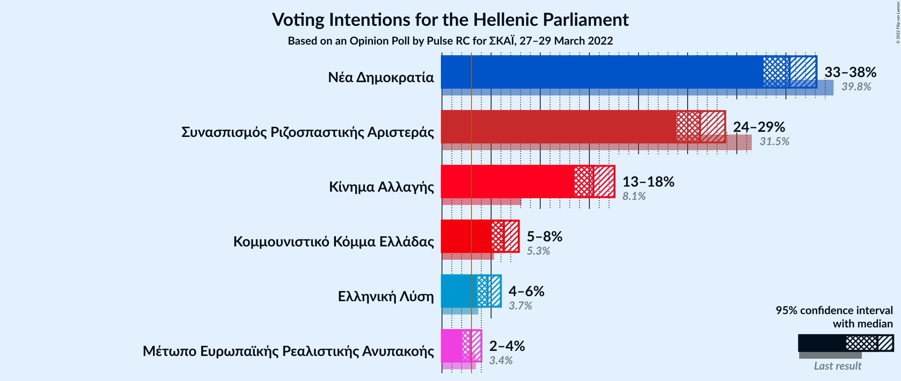
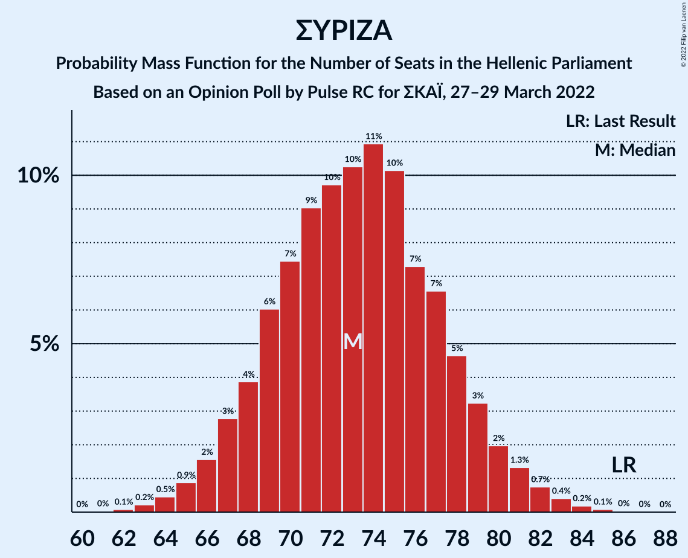

# Opinion Poll by Pulse RC for ΣΚΑΪ, 27–29 March 2022

<a href="#voting-intentions">Voting Intentions</a> | <a href="#seats">Seats</a> | <a href="#coalitions">Coalitions</a> | <a href="#technical-information">Technical Information</a>

## Voting Intentions

### Confidence Intervals

| Party | Last Result | Poll Result | 80% Confidence Interval | 90% Confidence Interval | 95% Confidence Interval | 99% Confidence Interval |
|:-----:|:-----------:|:-----------:|:-----------------------:|:-----------------------:|:-----------------------:|:-----------------------:|
| Νέα Δημοκρατία | 39.8% | 35.4% | 33.6–37.2% |33.2–37.7% |32.7–38.1% |31.9–39.0% |
| Συνασπισμός Ριζοσπαστικής Αριστεράς | 31.5% | 26.3% | 24.7–27.9% |24.2–28.4% |23.9–28.8% |23.1–29.6% |
| Κίνημα Αλλαγής | 8.1% | 15.4% | 14.1–16.8% |13.8–17.2% |13.5–17.6% |12.9–18.3% |
| Κομμουνιστικό Κόμμα Ελλάδας | 5.3% | 6.3% | 5.5–7.3% |5.2–7.6% |5.1–7.8% |4.7–8.3% |
| Ελληνική Λύση | 3.7% | 4.6% | 3.9–5.5% |3.7–5.8% |3.6–6.0% |3.3–6.4% |
| Μέτωπο Ευρωπαϊκής Ρεαλιστικής Ανυπακοής | 3.4% | 2.9% | 2.4–3.6% |2.2–3.8% |2.1–4.0% |1.9–4.4% |

*Note:* The poll result column reflects the actual value used in the calculations. Published results may vary slightly, and in addition be rounded to fewer digits.

## Seats

### Confidence Intervals

| Party | Last Result | Median | 80% Confidence Interval | 90% Confidence Interval | 95% Confidence Interval | 99% Confidence Interval |
|:-----:|:-----------:|:------:|:-----------------------:|:-----------------------:|:-----------------------:|:-----------------------:|
| <a href="#νέα-δημοκρατία">Νέα Δημοκρατία</a> | 158 | 149 | 143–154 |142–155 |141–157 |138–159 |
| <a href="#συνασπισμός-ριζοσπαστικής-αριστεράς">Συνασπισμός Ριζοσπαστικής Αριστεράς</a> | 86 | 73 | 69–78 |67–79 |66–81 |64–83 |
| <a href="#κίνημα-αλλαγής">Κίνημα Αλλαγής</a> | 22 | 43 | 39–47 |38–48 |37–49 |36–51 |
| <a href="#κομμουνιστικό-κόμμα-ελλάδας">Κομμουνιστικό Κόμμα Ελλάδας</a> | 15 | 18 | 15–20 |15–21 |14–22 |13–23 |
| <a href="#ελληνική-λύση">Ελληνική Λύση</a> | 10 | 13 | 11–15 |10–16 |10–17 |9–18 |
| <a href="#μέτωπο-ευρωπαϊκής-ρεαλιστικής-ανυπακοής">Μέτωπο Ευρωπαϊκής Ρεαλιστικής Ανυπακοής</a> | 9 | 0 | 0–10 |0–10 |0–11 |0–12 |

### Νέα Δημοκρατία

*For a full overview of the results for this party, see the [Νέα Δημοκρατία](party-νέαδημοκρατία.html) page.*

| Number of Seats | Probability | Accumulated | Special Marks |
|:---------------:|:-----------:|:-----------:|:-------------:|
| 135 | 0% | 100% |  |
| 136 | 0.1% | 99.9% |  |
| 137 | 0.2% | 99.9% |  |
| 138 | 0.3% | 99.7% |  |
| 139 | 0.7% | 99.4% |  |
| 140 | 1.0% | 98.7% |  |
| 141 | 2% | 98% |  |
| 142 | 3% | 96% |  |
| 143 | 4% | 93% |  |
| 144 | 5% | 89% |  |
| 145 | 7% | 84% |  |
| 146 | 9% | 77% |  |
| 147 | 9% | 68% |  |
| 148 | 9% | 59% |  |
| 149 | 9% | 50% | Median |
| 150 | 9% | 41% |  |
| 151 | 8% | 33% | Majority |
| 152 | 6% | 25% |  |
| 153 | 6% | 19% |  |
| 154 | 5% | 13% |  |
| 155 | 4% | 8% |  |
| 156 | 2% | 5% |  |
| 157 | 1.4% | 3% |  |
| 158 | 0.8% | 2% | Last Result |
| 159 | 0.4% | 0.8% |  |
| 160 | 0.2% | 0.4% |  |
| 161 | 0.1% | 0.2% |  |
| 162 | 0.1% | 0.1% |  |
| 163 | 0% | 0% |  |

### Συνασπισμός Ριζοσπαστικής Αριστεράς

*For a full overview of the results for this party, see the [Συνασπισμός Ριζοσπαστικής Αριστεράς](party-συνασπισμόςριζοσπαστικήςαριστεράς.html) page.*

| Number of Seats | Probability | Accumulated | Special Marks |
|:---------------:|:-----------:|:-----------:|:-------------:|
| 62 | 0.1% | 100% |  |
| 63 | 0.2% | 99.9% |  |
| 64 | 0.5% | 99.7% |  |
| 65 | 0.9% | 99.2% |  |
| 66 | 2% | 98% |  |
| 67 | 3% | 97% |  |
| 68 | 4% | 94% |  |
| 69 | 6% | 90% |  |
| 70 | 7% | 84% |  |
| 71 | 9% | 77% |  |
| 72 | 10% | 68% |  |
| 73 | 10% | 58% | Median |
| 74 | 11% | 48% |  |
| 75 | 10% | 37% |  |
| 76 | 7% | 27% |  |
| 77 | 7% | 19% |  |
| 78 | 5% | 13% |  |
| 79 | 3% | 8% |  |
| 80 | 2% | 5% |  |
| 81 | 1.3% | 3% |  |
| 82 | 0.7% | 1.5% |  |
| 83 | 0.4% | 0.7% |  |
| 84 | 0.2% | 0.3% |  |
| 85 | 0.1% | 0.1% |  |
| 86 | 0% | 0.1% | Last Result |
| 87 | 0% | 0% |  |

### Κίνημα Αλλαγής

*For a full overview of the results for this party, see the [Κίνημα Αλλαγής](party-κίνημααλλαγής.html) page.*

| Number of Seats | Probability | Accumulated | Special Marks |
|:---------------:|:-----------:|:-----------:|:-------------:|
| 22 | 0% | 100% | Last Result |
| 23 | 0% | 100% |  |
| 24 | 0% | 100% |  |
| 25 | 0% | 100% |  |
| 26 | 0% | 100% |  |
| 27 | 0% | 100% |  |
| 28 | 0% | 100% |  |
| 29 | 0% | 100% |  |
| 30 | 0% | 100% |  |
| 31 | 0% | 100% |  |
| 32 | 0% | 100% |  |
| 33 | 0% | 100% |  |
| 34 | 0.1% | 100% |  |
| 35 | 0.2% | 99.9% |  |
| 36 | 0.7% | 99.6% |  |
| 37 | 2% | 99.0% |  |
| 38 | 3% | 97% |  |
| 39 | 5% | 94% |  |
| 40 | 10% | 89% |  |
| 41 | 10% | 80% |  |
| 42 | 12% | 70% |  |
| 43 | 15% | 58% | Median |
| 44 | 12% | 43% |  |
| 45 | 10% | 31% |  |
| 46 | 9% | 21% |  |
| 47 | 6% | 13% |  |
| 48 | 3% | 7% |  |
| 49 | 2% | 4% |  |
| 50 | 1.1% | 2% |  |
| 51 | 0.5% | 0.8% |  |
| 52 | 0.2% | 0.4% |  |
| 53 | 0.1% | 0.1% |  |
| 54 | 0% | 0% |  |

### Κομμουνιστικό Κόμμα Ελλάδας

*For a full overview of the results for this party, see the [Κομμουνιστικό Κόμμα Ελλάδας](party-κομμουνιστικόκόμμαελλάδας.html) page.*

| Number of Seats | Probability | Accumulated | Special Marks |
|:---------------:|:-----------:|:-----------:|:-------------:|
| 12 | 0.2% | 100% |  |
| 13 | 0.9% | 99.8% |  |
| 14 | 3% | 98.9% |  |
| 15 | 8% | 96% | Last Result |
| 16 | 15% | 88% |  |
| 17 | 19% | 72% |  |
| 18 | 20% | 54% | Median |
| 19 | 15% | 33% |  |
| 20 | 10% | 19% |  |
| 21 | 5% | 8% |  |
| 22 | 2% | 3% |  |
| 23 | 0.8% | 1.2% |  |
| 24 | 0.2% | 0.3% |  |
| 25 | 0.1% | 0.1% |  |
| 26 | 0% | 0% |  |

### Ελληνική Λύση

*For a full overview of the results for this party, see the [Ελληνική Λύση](party-ελληνικήλύση.html) page.*

| Number of Seats | Probability | Accumulated | Special Marks |
|:---------------:|:-----------:|:-----------:|:-------------:|
| 0 | 0.1% | 100% |  |
| 1 | 0% | 99.9% |  |
| 2 | 0% | 99.9% |  |
| 3 | 0% | 99.9% |  |
| 4 | 0% | 99.9% |  |
| 5 | 0% | 99.9% |  |
| 6 | 0% | 99.9% |  |
| 7 | 0% | 99.9% |  |
| 8 | 0% | 99.9% |  |
| 9 | 1.0% | 99.9% |  |
| 10 | 5% | 98.9% | Last Result |
| 11 | 11% | 94% |  |
| 12 | 21% | 83% |  |
| 13 | 22% | 63% | Median |
| 14 | 20% | 41% |  |
| 15 | 12% | 21% |  |
| 16 | 5% | 9% |  |
| 17 | 2% | 3% |  |
| 18 | 0.6% | 0.9% |  |
| 19 | 0.2% | 0.2% |  |
| 20 | 0% | 0% |  |

### Μέτωπο Ευρωπαϊκής Ρεαλιστικής Ανυπακοής

*For a full overview of the results for this party, see the [Μέτωπο Ευρωπαϊκής Ρεαλιστικής Ανυπακοής](party-μέτωποευρωπαϊκήςρεαλιστικήςανυπακοής.html) page.*

| Number of Seats | Probability | Accumulated | Special Marks |
|:---------------:|:-----------:|:-----------:|:-------------:|
| 0 | 56% | 100% | Median |
| 1 | 0% | 44% |  |
| 2 | 0% | 44% |  |
| 3 | 0% | 44% |  |
| 4 | 0% | 44% |  |
| 5 | 0% | 44% |  |
| 6 | 0% | 44% |  |
| 7 | 0% | 44% |  |
| 8 | 6% | 44% |  |
| 9 | 23% | 39% | Last Result |
| 10 | 11% | 16% |  |
| 11 | 4% | 5% |  |
| 12 | 0.9% | 1.1% |  |
| 13 | 0.2% | 0.2% |  |
| 14 | 0% | 0% |  |

## Coalitions

### Confidence Intervals

| Coalition | Last Result | Median | Majority? | 80% Confidence Interval | 90% Confidence Interval | 95% Confidence Interval | 99% Confidence Interval |
|:---------:|:-----------:|:------:|:---------:|:-----------------------:|:-----------------------:|:-----------------------:|:-----------------------:|
| Νέα Δημοκρατία – Κίνημα Αλλαγής | 180 | 192 | 100% | 186–198 | 184–199 | 183–201 | 180–203 |
| Νέα Δημοκρατία | 158 | 149 | 33% | 143–154 | 142–155 | 141–157 | 138–159 |
| Συνασπισμός Ριζοσπαστικής Αριστεράς – Μέτωπο Ευρωπαϊκής Ρεαλιστικής Ανυπακοής | 95 | 77 | 0% | 71–84 | 70–85 | 69–87 | 66–89 |
| Συνασπισμός Ριζοσπαστικής Αριστεράς | 86 | 73 | 0% | 69–78 | 67–79 | 66–81 | 64–83 |

### Νέα Δημοκρατία – Κίνημα Αλλαγής

| Number of Seats | Probability | Accumulated | Special Marks |
|:---------------:|:-----------:|:-----------:|:-------------:|
| 177 | 0% | 100% |  |
| 178 | 0.1% | 99.9% |  |
| 179 | 0.1% | 99.9% |  |
| 180 | 0.3% | 99.7% | Last Result |
| 181 | 0.6% | 99.4% |  |
| 182 | 1.0% | 98.8% |  |
| 183 | 1.4% | 98% |  |
| 184 | 2% | 96% |  |
| 185 | 4% | 94% |  |
| 186 | 4% | 91% |  |
| 187 | 5% | 87% |  |
| 188 | 6% | 81% |  |
| 189 | 7% | 75% |  |
| 190 | 7% | 68% |  |
| 191 | 8% | 61% |  |
| 192 | 9% | 53% | Median |
| 193 | 8% | 44% |  |
| 194 | 7% | 36% |  |
| 195 | 7% | 28% |  |
| 196 | 5% | 21% |  |
| 197 | 5% | 16% |  |
| 198 | 4% | 11% |  |
| 199 | 3% | 7% |  |
| 200 | 2% | 4% |  |
| 201 | 1.2% | 3% |  |
| 202 | 0.7% | 1.4% |  |
| 203 | 0.4% | 0.7% |  |
| 204 | 0.2% | 0.3% |  |
| 205 | 0.1% | 0.2% |  |
| 206 | 0% | 0.1% |  |
| 207 | 0% | 0% |  |

### Νέα Δημοκρατία

| Number of Seats | Probability | Accumulated | Special Marks |
|:---------------:|:-----------:|:-----------:|:-------------:|
| 135 | 0% | 100% |  |
| 136 | 0.1% | 99.9% |  |
| 137 | 0.2% | 99.9% |  |
| 138 | 0.3% | 99.7% |  |
| 139 | 0.7% | 99.4% |  |
| 140 | 1.0% | 98.7% |  |
| 141 | 2% | 98% |  |
| 142 | 3% | 96% |  |
| 143 | 4% | 93% |  |
| 144 | 5% | 89% |  |
| 145 | 7% | 84% |  |
| 146 | 9% | 77% |  |
| 147 | 9% | 68% |  |
| 148 | 9% | 59% |  |
| 149 | 9% | 50% | Median |
| 150 | 9% | 41% |  |
| 151 | 8% | 33% | Majority |
| 152 | 6% | 25% |  |
| 153 | 6% | 19% |  |
| 154 | 5% | 13% |  |
| 155 | 4% | 8% |  |
| 156 | 2% | 5% |  |
| 157 | 1.4% | 3% |  |
| 158 | 0.8% | 2% | Last Result |
| 159 | 0.4% | 0.8% |  |
| 160 | 0.2% | 0.4% |  |
| 161 | 0.1% | 0.2% |  |
| 162 | 0.1% | 0.1% |  |
| 163 | 0% | 0% |  |

### Συνασπισμός Ριζοσπαστικής Αριστεράς – Μέτωπο Ευρωπαϊκής Ρεαλιστικής Ανυπακοής

| Number of Seats | Probability | Accumulated | Special Marks |
|:---------------:|:-----------:|:-----------:|:-------------:|
| 64 | 0.1% | 100% |  |
| 65 | 0.1% | 99.9% |  |
| 66 | 0.3% | 99.8% |  |
| 67 | 0.6% | 99.4% |  |
| 68 | 1.1% | 98.9% |  |
| 69 | 2% | 98% |  |
| 70 | 3% | 96% |  |
| 71 | 4% | 93% |  |
| 72 | 5% | 89% |  |
| 73 | 6% | 84% | Median |
| 74 | 7% | 78% |  |
| 75 | 8% | 71% |  |
| 76 | 7% | 63% |  |
| 77 | 8% | 56% |  |
| 78 | 8% | 48% |  |
| 79 | 7% | 41% |  |
| 80 | 7% | 34% |  |
| 81 | 6% | 27% |  |
| 82 | 5% | 21% |  |
| 83 | 5% | 16% |  |
| 84 | 4% | 11% |  |
| 85 | 2% | 7% |  |
| 86 | 2% | 5% |  |
| 87 | 1.1% | 3% |  |
| 88 | 0.7% | 1.5% |  |
| 89 | 0.4% | 0.7% |  |
| 90 | 0.2% | 0.4% |  |
| 91 | 0.1% | 0.2% |  |
| 92 | 0% | 0.1% |  |
| 93 | 0% | 0% |  |
| 94 | 0% | 0% |  |
| 95 | 0% | 0% | Last Result |

### Συνασπισμός Ριζοσπαστικής Αριστεράς

| Number of Seats | Probability | Accumulated | Special Marks |
|:---------------:|:-----------:|:-----------:|:-------------:|
| 62 | 0.1% | 100% |  |
| 63 | 0.2% | 99.9% |  |
| 64 | 0.5% | 99.7% |  |
| 65 | 0.9% | 99.2% |  |
| 66 | 2% | 98% |  |
| 67 | 3% | 97% |  |
| 68 | 4% | 94% |  |
| 69 | 6% | 90% |  |
| 70 | 7% | 84% |  |
| 71 | 9% | 77% |  |
| 72 | 10% | 68% |  |
| 73 | 10% | 58% | Median |
| 74 | 11% | 48% |  |
| 75 | 10% | 37% |  |
| 76 | 7% | 27% |  |
| 77 | 7% | 19% |  |
| 78 | 5% | 13% |  |
| 79 | 3% | 8% |  |
| 80 | 2% | 5% |  |
| 81 | 1.3% | 3% |  |
| 82 | 0.7% | 1.5% |  |
| 83 | 0.4% | 0.7% |  |
| 84 | 0.2% | 0.3% |  |
| 85 | 0.1% | 0.1% |  |
| 86 | 0% | 0.1% | Last Result |
| 87 | 0% | 0% |  |

## Technical Information

### Opinion Poll

+ **Polling firm:** Pulse RC
+ **Commissioner(s):** ΣΚΑΪ
+ **Fieldwork period:** 27–29 March 2022

### Calculations

+ **Sample size:** 1207
+ **Simulations done:** 1,048,576
+ **Error estimate:** 0.76%

