# Opinion Poll by Interview for Politic.gr, 30 March–5 April 2022

<a href="#voting-intentions">Voting Intentions</a> | <a href="#seats">Seats</a> | <a href="#coalitions">Coalitions</a> | <a href="#technical-information">Technical Information</a>

## Voting Intentions

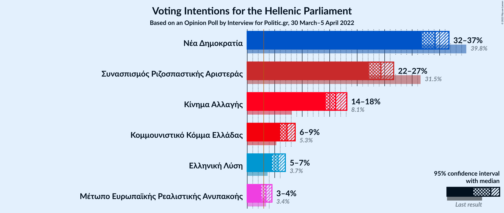

### Confidence Intervals

| Party | Last Result | Poll Result | 80% Confidence Interval | 90% Confidence Interval | 95% Confidence Interval | 99% Confidence Interval |
|:-----:|:-----------:|:-----------:|:-----------------------:|:-----------------------:|:-----------------------:|:-----------------------:|
| Νέα Δημοκρατία | 39.8% | 34.2% | 32.6–35.8% |32.1–36.3% |31.7–36.7% |31.0–37.5% |
| Συνασπισμός Ριζοσπαστικής Αριστεράς | 31.5% | 24.3% | 22.9–25.8% |22.5–26.3% |22.1–26.6% |21.5–27.4% |
| Κίνημα Αλλαγής | 8.1% | 16.1% | 14.9–17.4% |14.6–17.8% |14.3–18.1% |13.7–18.8% |
| Κομμουνιστικό Κόμμα Ελλάδας | 5.3% | 7.2% | 6.4–8.2% |6.2–8.5% |6.0–8.7% |5.6–9.2% |
| Ελληνική Λύση | 3.7% | 5.6% | 4.9–6.5% |4.7–6.7% |4.5–6.9% |4.2–7.4% |
| Μέτωπο Ευρωπαϊκής Ρεαλιστικής Ανυπακοής | 3.4% | 3.4% | 2.9–4.1% |2.7–4.3% |2.6–4.5% |2.3–4.8% |

*Note:* The poll result column reflects the actual value used in the calculations. Published results may vary slightly, and in addition be rounded to fewer digits.

## Seats

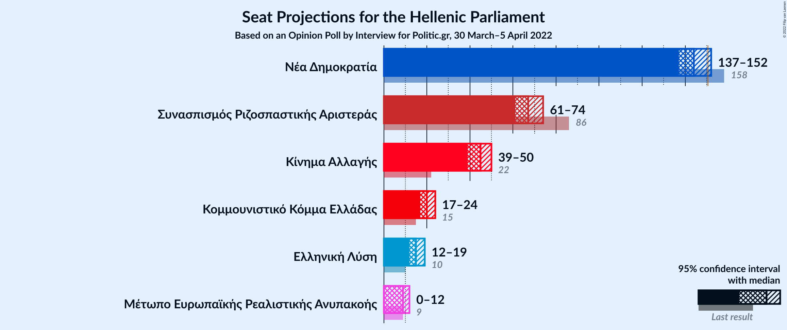

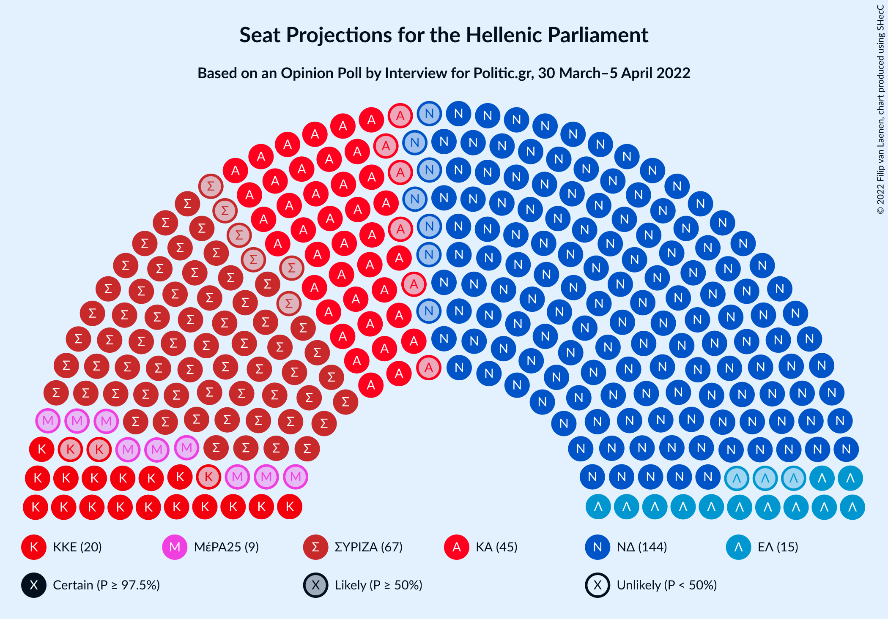

### Confidence Intervals

| Party | Last Result | Median | 80% Confidence Interval | 90% Confidence Interval | 95% Confidence Interval | 99% Confidence Interval |
|:-----:|:-----------:|:------:|:-----------------------:|:-----------------------:|:-----------------------:|:-----------------------:|
| <a href="#νέα-δημοκρατία">Νέα Δημοκρατία</a> | 158 | 144 | 140–149 |138–150 |137–152 |135–154 |
| <a href="#συνασπισμός-ριζοσπαστικής-αριστεράς">Συνασπισμός Ριζοσπαστικής Αριστεράς</a> | 86 | 67 | 63–71 |62–73 |61–74 |59–76 |
| <a href="#κίνημα-αλλαγής">Κίνημα Αλλαγής</a> | 22 | 45 | 41–48 |40–49 |39–50 |38–52 |
| <a href="#κομμουνιστικό-κόμμα-ελλάδας">Κομμουνιστικό Κόμμα Ελλάδας</a> | 15 | 20 | 18–23 |17–23 |17–24 |16–25 |
| <a href="#ελληνική-λύση">Ελληνική Λύση</a> | 10 | 15 | 14–18 |13–19 |12–19 |12–20 |
| <a href="#μέτωπο-ευρωπαϊκής-ρεαλιστικής-ανυπακοής">Μέτωπο Ευρωπαϊκής Ρεαλιστικής Ανυπακοής</a> | 9 | 9 | 0–11 |0–12 |0–12 |0–13 |

### Νέα Δημοκρατία

*For a full overview of the results for this party, see the [Νέα Δημοκρατία](party-νέαδημοκρατία.html) page.*

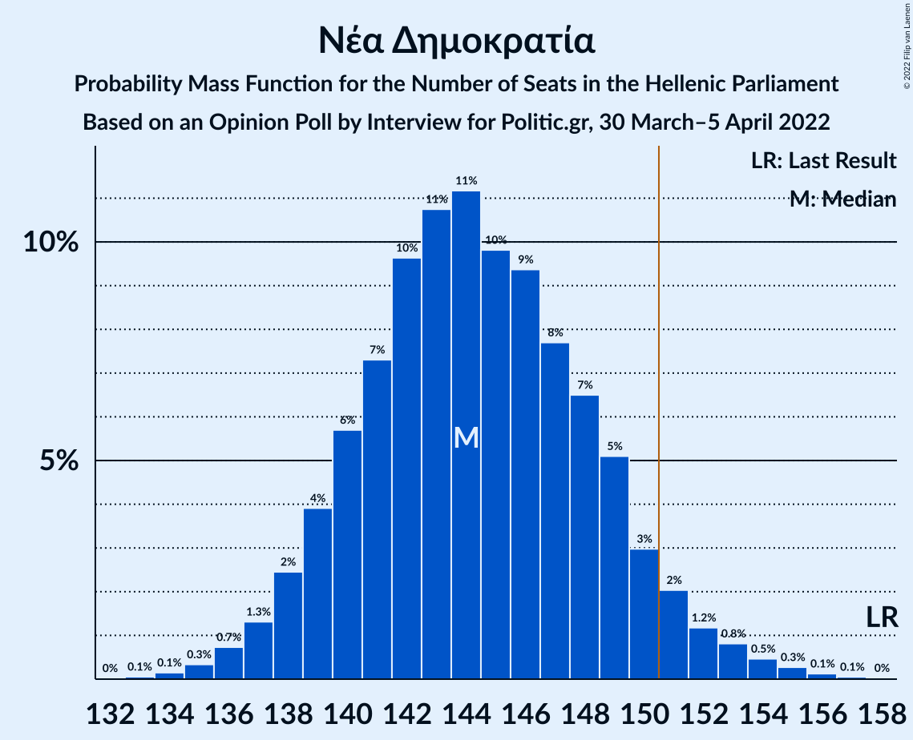

| Number of Seats | Probability | Accumulated | Special Marks |
|:---------------:|:-----------:|:-----------:|:-------------:|
| 133 | 0.1% | 100% |  |
| 134 | 0.1% | 99.9% |  |
| 135 | 0.3% | 99.8% |  |
| 136 | 0.7% | 99.4% |  |
| 137 | 1.3% | 98.7% |  |
| 138 | 2% | 97% |  |
| 139 | 4% | 95% |  |
| 140 | 6% | 91% |  |
| 141 | 7% | 85% |  |
| 142 | 10% | 78% |  |
| 143 | 11% | 68% |  |
| 144 | 11% | 58% | Median |
| 145 | 10% | 46% |  |
| 146 | 9% | 37% |  |
| 147 | 8% | 27% |  |
| 148 | 7% | 20% |  |
| 149 | 5% | 13% |  |
| 150 | 3% | 8% |  |
| 151 | 2% | 5% | Majority |
| 152 | 1.2% | 3% |  |
| 153 | 0.8% | 2% |  |
| 154 | 0.5% | 1.0% |  |
| 155 | 0.3% | 0.5% |  |
| 156 | 0.1% | 0.2% |  |
| 157 | 0.1% | 0.1% |  |
| 158 | 0% | 0% | Last Result |

### Συνασπισμός Ριζοσπαστικής Αριστεράς

*For a full overview of the results for this party, see the [Συνασπισμός Ριζοσπαστικής Αριστεράς](party-συνασπισμόςριζοσπαστικήςαριστεράς.html) page.*

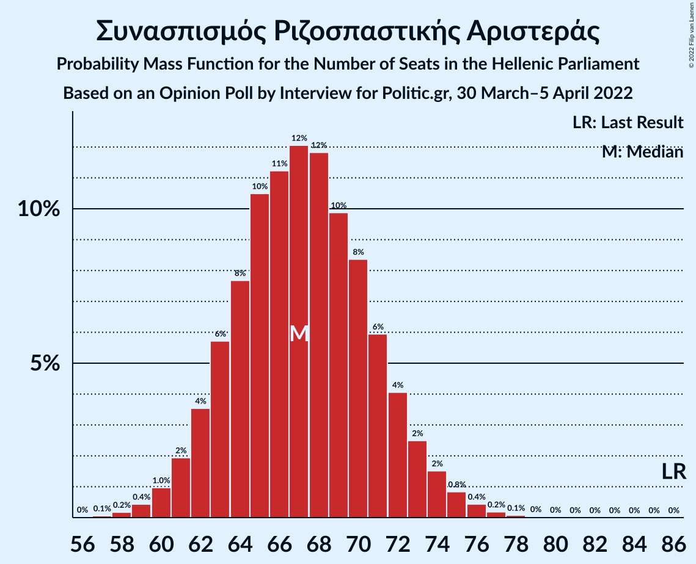

| Number of Seats | Probability | Accumulated | Special Marks |
|:---------------:|:-----------:|:-----------:|:-------------:|
| 57 | 0.1% | 100% |  |
| 58 | 0.2% | 99.9% |  |
| 59 | 0.4% | 99.7% |  |
| 60 | 1.0% | 99.3% |  |
| 61 | 2% | 98% |  |
| 62 | 4% | 96% |  |
| 63 | 6% | 93% |  |
| 64 | 8% | 87% |  |
| 65 | 10% | 79% |  |
| 66 | 11% | 69% |  |
| 67 | 12% | 58% | Median |
| 68 | 12% | 46% |  |
| 69 | 10% | 34% |  |
| 70 | 8% | 24% |  |
| 71 | 6% | 16% |  |
| 72 | 4% | 10% |  |
| 73 | 2% | 6% |  |
| 74 | 2% | 3% |  |
| 75 | 0.8% | 2% |  |
| 76 | 0.4% | 0.8% |  |
| 77 | 0.2% | 0.3% |  |
| 78 | 0.1% | 0.1% |  |
| 79 | 0% | 0.1% |  |
| 80 | 0% | 0% |  |
| 81 | 0% | 0% |  |
| 82 | 0% | 0% |  |
| 83 | 0% | 0% |  |
| 84 | 0% | 0% |  |
| 85 | 0% | 0% |  |
| 86 | 0% | 0% | Last Result |

### Κίνημα Αλλαγής

*For a full overview of the results for this party, see the [Κίνημα Αλλαγής](party-κίνημααλλαγής.html) page.*

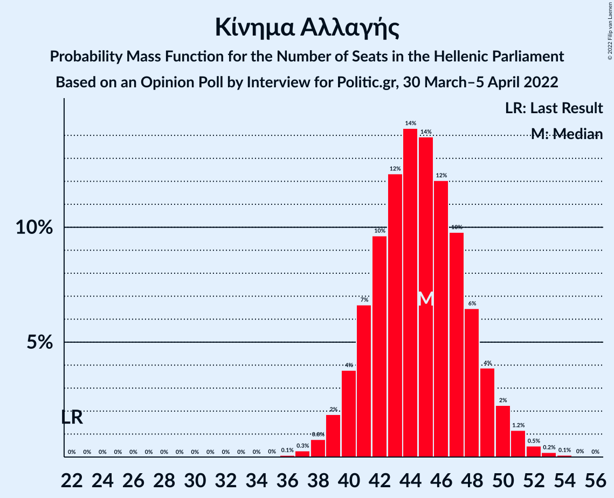

| Number of Seats | Probability | Accumulated | Special Marks |
|:---------------:|:-----------:|:-----------:|:-------------:|
| 22 | 0% | 100% | Last Result |
| 23 | 0% | 100% |  |
| 24 | 0% | 100% |  |
| 25 | 0% | 100% |  |
| 26 | 0% | 100% |  |
| 27 | 0% | 100% |  |
| 28 | 0% | 100% |  |
| 29 | 0% | 100% |  |
| 30 | 0% | 100% |  |
| 31 | 0% | 100% |  |
| 32 | 0% | 100% |  |
| 33 | 0% | 100% |  |
| 34 | 0% | 100% |  |
| 35 | 0% | 100% |  |
| 36 | 0.1% | 100% |  |
| 37 | 0.3% | 99.9% |  |
| 38 | 0.8% | 99.6% |  |
| 39 | 2% | 98.9% |  |
| 40 | 4% | 97% |  |
| 41 | 7% | 93% |  |
| 42 | 10% | 87% |  |
| 43 | 12% | 77% |  |
| 44 | 14% | 65% |  |
| 45 | 14% | 50% | Median |
| 46 | 12% | 36% |  |
| 47 | 10% | 24% |  |
| 48 | 6% | 15% |  |
| 49 | 4% | 8% |  |
| 50 | 2% | 4% |  |
| 51 | 1.2% | 2% |  |
| 52 | 0.5% | 0.8% |  |
| 53 | 0.2% | 0.3% |  |
| 54 | 0.1% | 0.1% |  |
| 55 | 0% | 0% |  |

### Κομμουνιστικό Κόμμα Ελλάδας

*For a full overview of the results for this party, see the [Κομμουνιστικό Κόμμα Ελλάδας](party-κομμουνιστικόκόμμαελλάδας.html) page.*

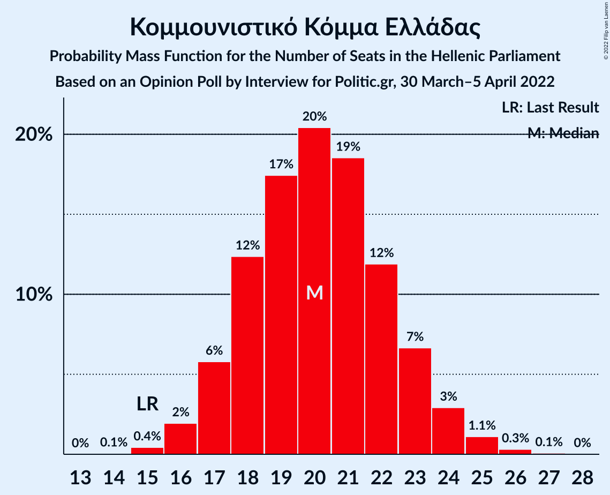

| Number of Seats | Probability | Accumulated | Special Marks |
|:---------------:|:-----------:|:-----------:|:-------------:|
| 14 | 0.1% | 100% |  |
| 15 | 0.4% | 99.9% | Last Result |
| 16 | 2% | 99.5% |  |
| 17 | 6% | 98% |  |
| 18 | 12% | 92% |  |
| 19 | 17% | 79% |  |
| 20 | 20% | 62% | Median |
| 21 | 19% | 42% |  |
| 22 | 12% | 23% |  |
| 23 | 7% | 11% |  |
| 24 | 3% | 4% |  |
| 25 | 1.1% | 2% |  |
| 26 | 0.3% | 0.4% |  |
| 27 | 0.1% | 0.1% |  |
| 28 | 0% | 0% |  |

### Ελληνική Λύση

*For a full overview of the results for this party, see the [Ελληνική Λύση](party-ελληνικήλύση.html) page.*

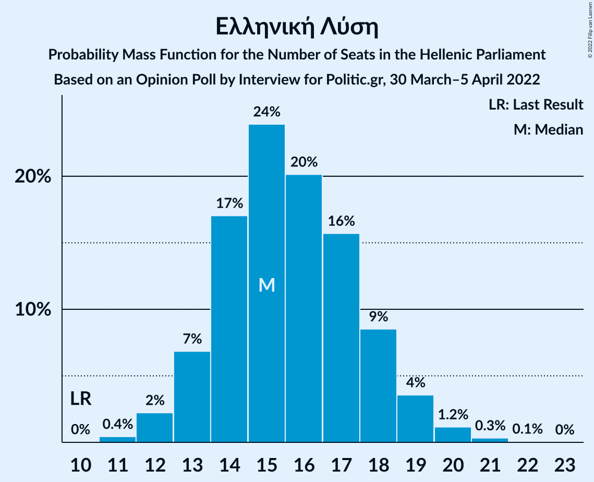

| Number of Seats | Probability | Accumulated | Special Marks |
|:---------------:|:-----------:|:-----------:|:-------------:|
| 10 | 0% | 100% | Last Result |
| 11 | 0.4% | 100% |  |
| 12 | 2% | 99.5% |  |
| 13 | 7% | 97% |  |
| 14 | 17% | 90% |  |
| 15 | 24% | 73% | Median |
| 16 | 20% | 50% |  |
| 17 | 16% | 29% |  |
| 18 | 9% | 14% |  |
| 19 | 4% | 5% |  |
| 20 | 1.2% | 2% |  |
| 21 | 0.3% | 0.4% |  |
| 22 | 0.1% | 0.1% |  |
| 23 | 0% | 0% |  |

### Μέτωπο Ευρωπαϊκής Ρεαλιστικής Ανυπακοής

*For a full overview of the results for this party, see the [Μέτωπο Ευρωπαϊκής Ρεαλιστικής Ανυπακοής](party-μέτωποευρωπαϊκήςρεαλιστικήςανυπακοής.html) page.*

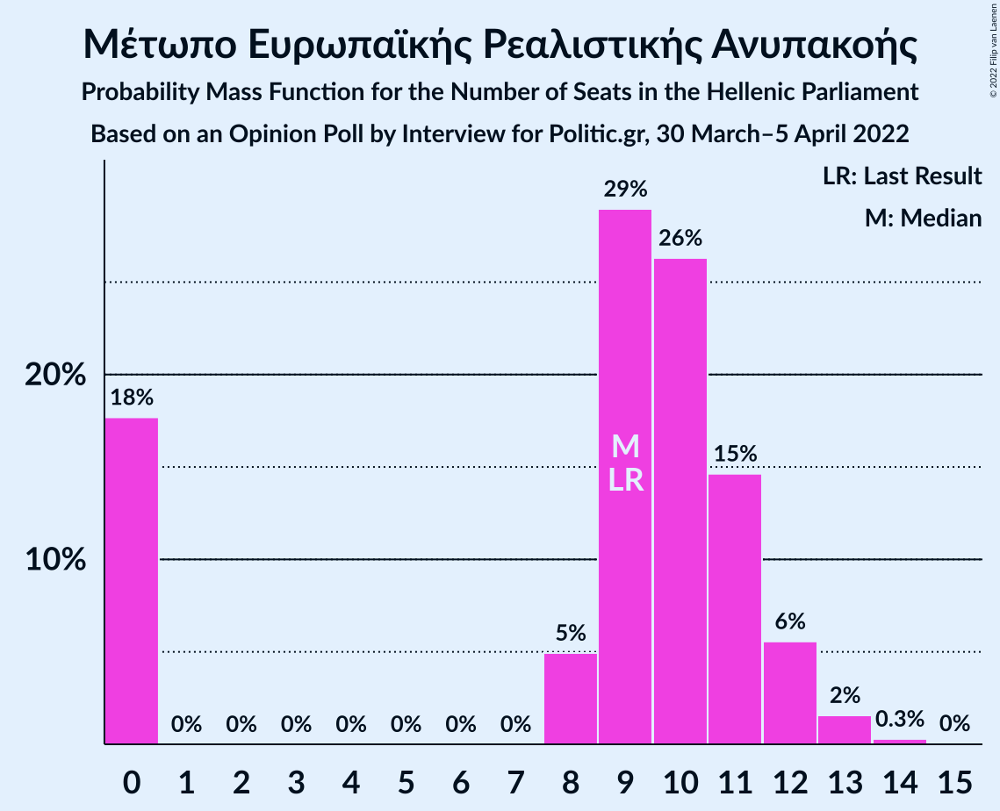

| Number of Seats | Probability | Accumulated | Special Marks |
|:---------------:|:-----------:|:-----------:|:-------------:|
| 0 | 18% | 100% |  |
| 1 | 0% | 82% |  |
| 2 | 0% | 82% |  |
| 3 | 0% | 82% |  |
| 4 | 0% | 82% |  |
| 5 | 0% | 82% |  |
| 6 | 0% | 82% |  |
| 7 | 0% | 82% |  |
| 8 | 5% | 82% |  |
| 9 | 29% | 77% | Last Result, Median |
| 10 | 26% | 48% |  |
| 11 | 15% | 22% |  |
| 12 | 6% | 7% |  |
| 13 | 2% | 2% |  |
| 14 | 0.3% | 0.3% |  |
| 15 | 0% | 0% |  |

## Coalitions

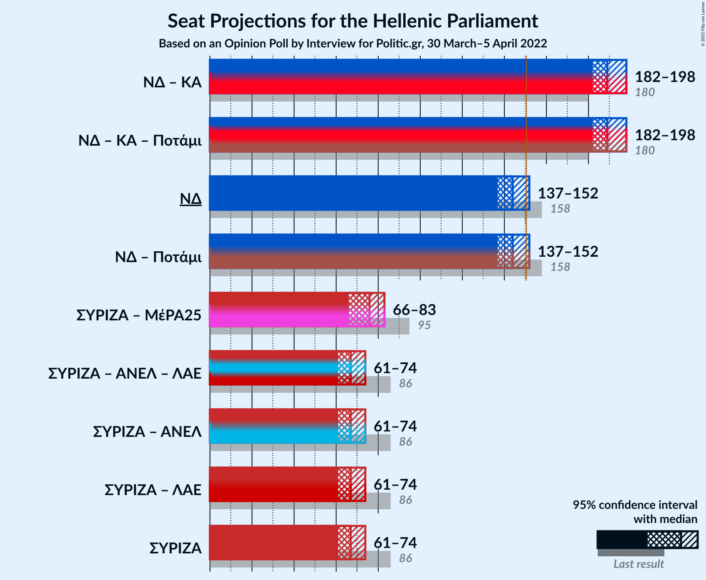

### Confidence Intervals

| Coalition | Last Result | Median | Majority? | 80% Confidence Interval | 90% Confidence Interval | 95% Confidence Interval | 99% Confidence Interval |
|:---------:|:-----------:|:------:|:---------:|:-----------------------:|:-----------------------:|:-----------------------:|:-----------------------:|
| Νέα Δημοκρατία – Κίνημα Αλλαγής | 180 | 189 | 100% | 184–194 | 182–196 | 182–198 | 179–200 |
| Νέα Δημοκρατία | 158 | 144 | 5% | 140–149 | 138–150 | 137–152 | 135–154 |
| Συνασπισμός Ριζοσπαστικής Αριστεράς – Μέτωπο Ευρωπαϊκής Ρεαλιστικής Ανυπακοής | 95 | 76 | 0% | 70–80 | 68–82 | 66–83 | 63–85 |
| Συνασπισμός Ριζοσπαστικής Αριστεράς | 86 | 67 | 0% | 63–71 | 62–73 | 61–74 | 59–76 |

### Νέα Δημοκρατία – Κίνημα Αλλαγής

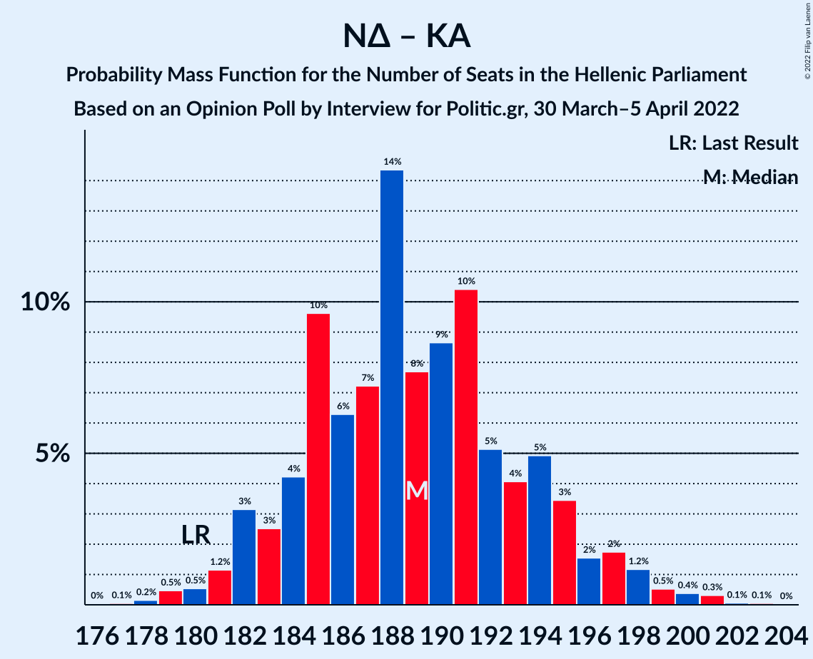

| Number of Seats | Probability | Accumulated | Special Marks |
|:---------------:|:-----------:|:-----------:|:-------------:|
| 176 | 0% | 100% |  |
| 177 | 0.1% | 99.9% |  |
| 178 | 0.2% | 99.9% |  |
| 179 | 0.5% | 99.7% |  |
| 180 | 0.5% | 99.3% | Last Result |
| 181 | 1.2% | 98.7% |  |
| 182 | 3% | 98% |  |
| 183 | 3% | 94% |  |
| 184 | 4% | 92% |  |
| 185 | 10% | 88% |  |
| 186 | 6% | 78% |  |
| 187 | 7% | 72% |  |
| 188 | 14% | 65% |  |
| 189 | 8% | 50% | Median |
| 190 | 9% | 42% |  |
| 191 | 10% | 34% |  |
| 192 | 5% | 23% |  |
| 193 | 4% | 18% |  |
| 194 | 5% | 14% |  |
| 195 | 3% | 9% |  |
| 196 | 2% | 6% |  |
| 197 | 2% | 4% |  |
| 198 | 1.2% | 3% |  |
| 199 | 0.5% | 1.4% |  |
| 200 | 0.4% | 0.8% |  |
| 201 | 0.3% | 0.5% |  |
| 202 | 0.1% | 0.1% |  |
| 203 | 0.1% | 0.1% |  |
| 204 | 0% | 0% |  |

### Νέα Δημοκρατία

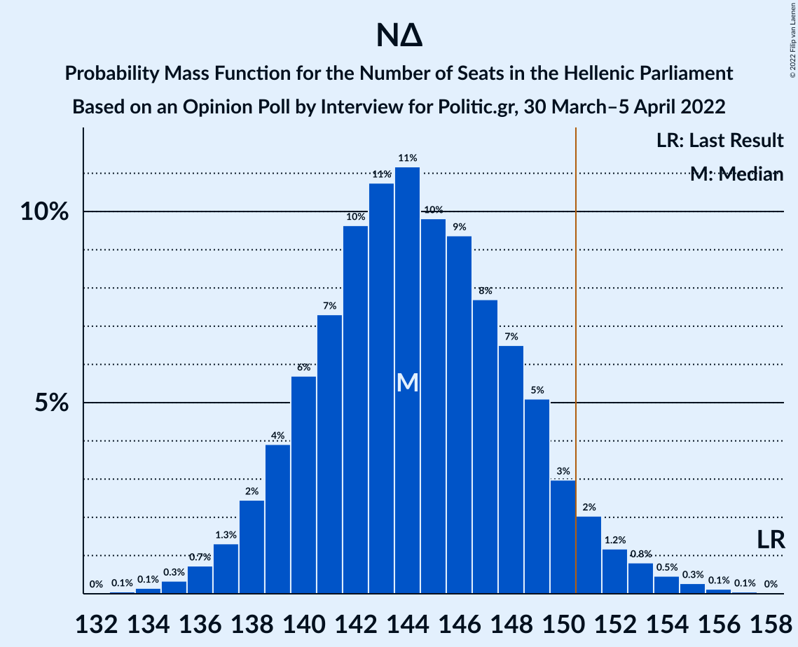

| Number of Seats | Probability | Accumulated | Special Marks |
|:---------------:|:-----------:|:-----------:|:-------------:|
| 133 | 0.1% | 100% |  |
| 134 | 0.1% | 99.9% |  |
| 135 | 0.3% | 99.8% |  |
| 136 | 0.7% | 99.4% |  |
| 137 | 1.3% | 98.7% |  |
| 138 | 2% | 97% |  |
| 139 | 4% | 95% |  |
| 140 | 6% | 91% |  |
| 141 | 7% | 85% |  |
| 142 | 10% | 78% |  |
| 143 | 11% | 68% |  |
| 144 | 11% | 58% | Median |
| 145 | 10% | 46% |  |
| 146 | 9% | 37% |  |
| 147 | 8% | 27% |  |
| 148 | 7% | 20% |  |
| 149 | 5% | 13% |  |
| 150 | 3% | 8% |  |
| 151 | 2% | 5% | Majority |
| 152 | 1.2% | 3% |  |
| 153 | 0.8% | 2% |  |
| 154 | 0.5% | 1.0% |  |
| 155 | 0.3% | 0.5% |  |
| 156 | 0.1% | 0.2% |  |
| 157 | 0.1% | 0.1% |  |
| 158 | 0% | 0% | Last Result |

### Συνασπισμός Ριζοσπαστικής Αριστεράς – Μέτωπο Ευρωπαϊκής Ρεαλιστικής Ανυπακοής

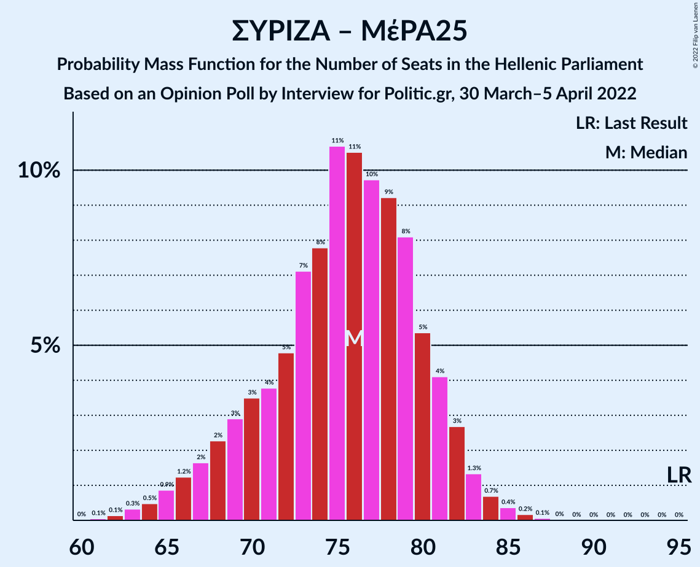

| Number of Seats | Probability | Accumulated | Special Marks |
|:---------------:|:-----------:|:-----------:|:-------------:|
| 61 | 0.1% | 100% |  |
| 62 | 0.1% | 99.9% |  |
| 63 | 0.3% | 99.8% |  |
| 64 | 0.5% | 99.5% |  |
| 65 | 0.9% | 99.0% |  |
| 66 | 1.2% | 98% |  |
| 67 | 2% | 97% |  |
| 68 | 2% | 95% |  |
| 69 | 3% | 93% |  |
| 70 | 3% | 90% |  |
| 71 | 4% | 87% |  |
| 72 | 5% | 83% |  |
| 73 | 7% | 78% |  |
| 74 | 8% | 71% |  |
| 75 | 11% | 63% |  |
| 76 | 11% | 52% | Median |
| 77 | 10% | 42% |  |
| 78 | 9% | 32% |  |
| 79 | 8% | 23% |  |
| 80 | 5% | 15% |  |
| 81 | 4% | 9% |  |
| 82 | 3% | 5% |  |
| 83 | 1.3% | 3% |  |
| 84 | 0.7% | 1.3% |  |
| 85 | 0.4% | 0.6% |  |
| 86 | 0.2% | 0.3% |  |
| 87 | 0.1% | 0.1% |  |
| 88 | 0% | 0% |  |
| 89 | 0% | 0% |  |
| 90 | 0% | 0% |  |
| 91 | 0% | 0% |  |
| 92 | 0% | 0% |  |
| 93 | 0% | 0% |  |
| 94 | 0% | 0% |  |
| 95 | 0% | 0% | Last Result |

### Συνασπισμός Ριζοσπαστικής Αριστεράς

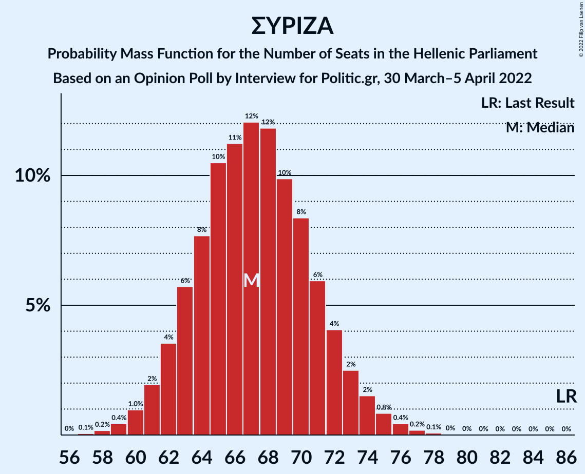

| Number of Seats | Probability | Accumulated | Special Marks |
|:---------------:|:-----------:|:-----------:|:-------------:|
| 57 | 0.1% | 100% |  |
| 58 | 0.2% | 99.9% |  |
| 59 | 0.4% | 99.7% |  |
| 60 | 1.0% | 99.3% |  |
| 61 | 2% | 98% |  |
| 62 | 4% | 96% |  |
| 63 | 6% | 93% |  |
| 64 | 8% | 87% |  |
| 65 | 10% | 79% |  |
| 66 | 11% | 69% |  |
| 67 | 12% | 58% | Median |
| 68 | 12% | 46% |  |
| 69 | 10% | 34% |  |
| 70 | 8% | 24% |  |
| 71 | 6% | 16% |  |
| 72 | 4% | 10% |  |
| 73 | 2% | 6% |  |
| 74 | 2% | 3% |  |
| 75 | 0.8% | 2% |  |
| 76 | 0.4% | 0.8% |  |
| 77 | 0.2% | 0.3% |  |
| 78 | 0.1% | 0.1% |  |
| 79 | 0% | 0.1% |  |
| 80 | 0% | 0% |  |
| 81 | 0% | 0% |  |
| 82 | 0% | 0% |  |
| 83 | 0% | 0% |  |
| 84 | 0% | 0% |  |
| 85 | 0% | 0% |  |
| 86 | 0% | 0% | Last Result |

## Technical Information

### Opinion Poll

+ **Polling firm:** Interview
+ **Commissioner(s):** Politic.gr
+ **Fieldwork period:** 30 March–5 April 2022

### Calculations

+ **Sample size:** 1410
+ **Simulations done:** 1,048,576
+ **Error estimate:** 0.24%

