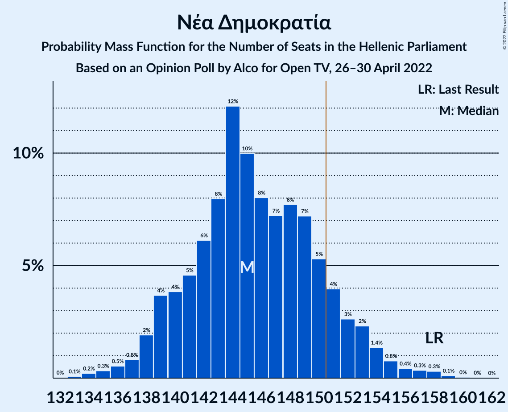

# Opinion Poll by Alco for Open TV, 26–30 April 2022

<a href="#voting-intentions">Voting Intentions</a> | <a href="#seats">Seats</a> | <a href="#coalitions">Coalitions</a> | <a href="#technical-information">Technical Information</a>

## Voting Intentions

### Confidence Intervals

| Party | Last Result | Poll Result | 80% Confidence Interval | 90% Confidence Interval | 95% Confidence Interval | 99% Confidence Interval |
|:-----:|:-----------:|:-----------:|:-----------------------:|:-----------------------:|:-----------------------:|:-----------------------:|
| Νέα Δημοκρατία | 39.8% | 35.5% | 33.6–37.5% |33.1–38.0% |32.6–38.5% |31.7–39.5% |
| Συνασπισμός Ριζοσπαστικής Αριστεράς | 31.5% | 26.1% | 24.4–27.9% |23.9–28.5% |23.5–28.9% |22.7–29.8% |
| Κίνημα Αλλαγής | 8.1% | 15.1% | 13.7–16.6% |13.3–17.1% |13.0–17.5% |12.4–18.2% |
| Κομμουνιστικό Κόμμα Ελλάδας | 5.3% | 7.0% | 6.1–8.2% |5.8–8.5% |5.6–8.8% |5.2–9.3% |
| Ελληνική Λύση | 3.7% | 5.7% | 4.9–6.8% |4.6–7.1% |4.4–7.3% |4.1–7.9% |
| Μέτωπο Ευρωπαϊκής Ρεαλιστικής Ανυπακοής | 3.4% | 3.5% | 2.9–4.4% |2.7–4.6% |2.5–4.8% |2.2–5.3% |
| Πλεύση Ελευθερίας | 1.5% | 1.2% | 0.9–1.8% |0.8–1.9% |0.7–2.1% |0.5–2.4% |

*Note:* The poll result column reflects the actual value used in the calculations. Published results may vary slightly, and in addition be rounded to fewer digits.

## Seats

### Confidence Intervals

| Party | Last Result | Median | 80% Confidence Interval | 90% Confidence Interval | 95% Confidence Interval | 99% Confidence Interval |
|:-----:|:-----------:|:------:|:-----------------------:|:-----------------------:|:-----------------------:|:-----------------------:|
| <a href="#νέα-δημοκρατία">Νέα Δημοκρατία</a> | 158 | 145 | 140–151 |139–153 |138–154 |135–158 |
| <a href="#συνασπισμός-ριζοσπαστικής-αριστεράς">Συνασπισμός Ριζοσπαστικής Αριστεράς</a> | 86 | 70 | 66–75 |64–77 |63–78 |61–81 |
| <a href="#κίνημα-αλλαγής">Κίνημα Αλλαγής</a> | 22 | 41 | 37–45 |36–46 |35–47 |33–49 |
| <a href="#κομμουνιστικό-κόμμα-ελλάδας">Κομμουνιστικό Κόμμα Ελλάδας</a> | 15 | 19 | 16–22 |16–23 |15–24 |14–25 |
| <a href="#ελληνική-λύση">Ελληνική Λύση</a> | 10 | 15 | 13–18 |13–19 |12–20 |11–21 |
| <a href="#μέτωπο-ευρωπαϊκής-ρεαλιστικής-ανυπακοής">Μέτωπο Ευρωπαϊκής Ρεαλιστικής Ανυπακοής</a> | 9 | 10 | 0–12 |0–12 |0–13 |0–14 |
| <a href="#πλεύση-ελευθερίας">Πλεύση Ελευθερίας</a> | 0 | 0 | 0 |0 |0 |0 |

### Νέα Δημοκρατία

*For a full overview of the results for this party, see the [Νέα Δημοκρατία](party-νέαδημοκρατία.html) page.*

| Number of Seats | Probability | Accumulated | Special Marks |
|:---------------:|:-----------:|:-----------:|:-------------:|
| 133 | 0.1% | 100% |  |
| 134 | 0.2% | 99.9% |  |
| 135 | 0.3% | 99.7% |  |
| 136 | 0.5% | 99.3% |  |
| 137 | 0.8% | 98.8% |  |
| 138 | 2% | 98% |  |
| 139 | 4% | 96% |  |
| 140 | 4% | 92% |  |
| 141 | 5% | 89% |  |
| 142 | 6% | 84% |  |
| 143 | 8% | 78% |  |
| 144 | 12% | 70% |  |
| 145 | 10% | 58% | Median |
| 146 | 8% | 48% |  |
| 147 | 7% | 40% |  |
| 148 | 8% | 33% |  |
| 149 | 7% | 25% |  |
| 150 | 5% | 18% |  |
| 151 | 4% | 12% | Majority |
| 152 | 3% | 8% |  |
| 153 | 2% | 6% |  |
| 154 | 1.4% | 3% |  |
| 155 | 0.8% | 2% |  |
| 156 | 0.4% | 1.3% |  |
| 157 | 0.3% | 0.8% |  |
| 158 | 0.3% | 0.5% | Last Result |
| 159 | 0.1% | 0.2% |  |
| 160 | 0% | 0.1% |  |
| 161 | 0% | 0% |  |

### Συνασπισμός Ριζοσπαστικής Αριστεράς

*For a full overview of the results for this party, see the [Συνασπισμός Ριζοσπαστικής Αριστεράς](party-συνασπισμόςριζοσπαστικήςαριστεράς.html) page.*

| Number of Seats | Probability | Accumulated | Special Marks |
|:---------------:|:-----------:|:-----------:|:-------------:|
| 58 | 0% | 100% |  |
| 59 | 0.1% | 99.9% |  |
| 60 | 0.2% | 99.9% |  |
| 61 | 0.4% | 99.6% |  |
| 62 | 0.9% | 99.2% |  |
| 63 | 2% | 98% |  |
| 64 | 2% | 97% |  |
| 65 | 4% | 94% |  |
| 66 | 6% | 90% |  |
| 67 | 7% | 84% |  |
| 68 | 9% | 78% |  |
| 69 | 10% | 68% |  |
| 70 | 11% | 59% | Median |
| 71 | 11% | 48% |  |
| 72 | 8% | 36% |  |
| 73 | 8% | 28% |  |
| 74 | 6% | 20% |  |
| 75 | 5% | 14% |  |
| 76 | 3% | 9% |  |
| 77 | 3% | 6% |  |
| 78 | 1.5% | 4% |  |
| 79 | 0.9% | 2% |  |
| 80 | 0.5% | 1.1% |  |
| 81 | 0.3% | 0.6% |  |
| 82 | 0.2% | 0.3% |  |
| 83 | 0.1% | 0.1% |  |
| 84 | 0% | 0.1% |  |
| 85 | 0% | 0% |  |
| 86 | 0% | 0% | Last Result |

### Κίνημα Αλλαγής

*For a full overview of the results for this party, see the [Κίνημα Αλλαγής](party-κίνημααλλαγής.html) page.*

| Number of Seats | Probability | Accumulated | Special Marks |
|:---------------:|:-----------:|:-----------:|:-------------:|
| 22 | 0% | 100% | Last Result |
| 23 | 0% | 100% |  |
| 24 | 0% | 100% |  |
| 25 | 0% | 100% |  |
| 26 | 0% | 100% |  |
| 27 | 0% | 100% |  |
| 28 | 0% | 100% |  |
| 29 | 0% | 100% |  |
| 30 | 0% | 100% |  |
| 31 | 0% | 100% |  |
| 32 | 0.1% | 99.9% |  |
| 33 | 0.4% | 99.8% |  |
| 34 | 1.0% | 99.4% |  |
| 35 | 2% | 98% |  |
| 36 | 3% | 96% |  |
| 37 | 7% | 93% |  |
| 38 | 8% | 86% |  |
| 39 | 10% | 78% |  |
| 40 | 13% | 67% |  |
| 41 | 14% | 55% | Median |
| 42 | 12% | 41% |  |
| 43 | 10% | 29% |  |
| 44 | 7% | 19% |  |
| 45 | 5% | 12% |  |
| 46 | 3% | 7% |  |
| 47 | 2% | 4% |  |
| 48 | 1.1% | 2% |  |
| 49 | 0.5% | 0.9% |  |
| 50 | 0.3% | 0.4% |  |
| 51 | 0.1% | 0.2% |  |
| 52 | 0% | 0.1% |  |
| 53 | 0% | 0% |  |

### Κομμουνιστικό Κόμμα Ελλάδας

*For a full overview of the results for this party, see the [Κομμουνιστικό Κόμμα Ελλάδας](party-κομμουνιστικόκόμμαελλάδας.html) page.*

| Number of Seats | Probability | Accumulated | Special Marks |
|:---------------:|:-----------:|:-----------:|:-------------:|
| 13 | 0.2% | 100% |  |
| 14 | 1.1% | 99.7% |  |
| 15 | 3% | 98.6% | Last Result |
| 16 | 8% | 96% |  |
| 17 | 13% | 88% |  |
| 18 | 17% | 75% |  |
| 19 | 18% | 59% | Median |
| 20 | 15% | 40% |  |
| 21 | 11% | 25% |  |
| 22 | 8% | 14% |  |
| 23 | 4% | 6% |  |
| 24 | 2% | 3% |  |
| 25 | 0.6% | 1.0% |  |
| 26 | 0.2% | 0.3% |  |
| 27 | 0.1% | 0.1% |  |
| 28 | 0% | 0% |  |

### Ελληνική Λύση

*For a full overview of the results for this party, see the [Ελληνική Λύση](party-ελληνικήλύση.html) page.*

| Number of Seats | Probability | Accumulated | Special Marks |
|:---------------:|:-----------:|:-----------:|:-------------:|
| 10 | 0.2% | 100% | Last Result |
| 11 | 1.4% | 99.8% |  |
| 12 | 3% | 98% |  |
| 13 | 9% | 95% |  |
| 14 | 18% | 87% |  |
| 15 | 20% | 69% | Median |
| 16 | 16% | 49% |  |
| 17 | 16% | 33% |  |
| 18 | 10% | 17% |  |
| 19 | 4% | 7% |  |
| 20 | 2% | 3% |  |
| 21 | 0.9% | 1.2% |  |
| 22 | 0.2% | 0.3% |  |
| 23 | 0.1% | 0.1% |  |
| 24 | 0% | 0% |  |

### Μέτωπο Ευρωπαϊκής Ρεαλιστικής Ανυπακοής

*For a full overview of the results for this party, see the [Μέτωπο Ευρωπαϊκής Ρεαλιστικής Ανυπακοής](party-μέτωποευρωπαϊκήςρεαλιστικήςανυπακοής.html) page.*

| Number of Seats | Probability | Accumulated | Special Marks |
|:---------------:|:-----------:|:-----------:|:-------------:|
| 0 | 16% | 100% |  |
| 1 | 0% | 84% |  |
| 2 | 0% | 84% |  |
| 3 | 0% | 84% |  |
| 4 | 0% | 84% |  |
| 5 | 0% | 84% |  |
| 6 | 0% | 84% |  |
| 7 | 0% | 84% |  |
| 8 | 6% | 84% |  |
| 9 | 24% | 79% | Last Result |
| 10 | 26% | 54% | Median |
| 11 | 17% | 28% |  |
| 12 | 7% | 11% |  |
| 13 | 2% | 4% |  |
| 14 | 1.0% | 1.3% |  |
| 15 | 0.3% | 0.3% |  |
| 16 | 0.1% | 0.1% |  |
| 17 | 0% | 0% |  |

### Πλεύση Ελευθερίας

*For a full overview of the results for this party, see the [Πλεύση Ελευθερίας](party-πλεύσηελευθερίας.html) page.*

| Number of Seats | Probability | Accumulated | Special Marks |
|:---------------:|:-----------:|:-----------:|:-------------:|
| 0 | 100% | 100% | Last Result, Median |

## Coalitions

### Confidence Intervals

| Coalition | Last Result | Median | Majority? | 80% Confidence Interval | 90% Confidence Interval | 95% Confidence Interval | 99% Confidence Interval |
|:---------:|:-----------:|:------:|:---------:|:-----------------------:|:-----------------------:|:-----------------------:|:-----------------------:|
| Νέα Δημοκρατία – Κίνημα Αλλαγής | 180 | 186 | 100% | 181–192 | 179–194 | 178–196 | 175–199 |
| Νέα Δημοκρατία | 158 | 145 | 12% | 140–151 | 139–153 | 138–154 | 135–158 |
| Συνασπισμός Ριζοσπαστικής Αριστεράς – Μέτωπο Ευρωπαϊκής Ρεαλιστικής Ανυπακοής | 95 | 79 | 0% | 73–84 | 71–86 | 69–87 | 66–90 |
| Συνασπισμός Ριζοσπαστικής Αριστεράς | 86 | 70 | 0% | 66–75 | 64–77 | 63–78 | 61–81 |

### Νέα Δημοκρατία – Κίνημα Αλλαγής

| Number of Seats | Probability | Accumulated | Special Marks |
|:---------------:|:-----------:|:-----------:|:-------------:|
| 172 | 0% | 100% |  |
| 173 | 0.1% | 99.9% |  |
| 174 | 0.1% | 99.9% |  |
| 175 | 0.3% | 99.7% |  |
| 176 | 0.6% | 99.5% |  |
| 177 | 0.9% | 98.9% |  |
| 178 | 1.3% | 98% |  |
| 179 | 3% | 97% |  |
| 180 | 3% | 94% | Last Result |
| 181 | 4% | 91% |  |
| 182 | 5% | 87% |  |
| 183 | 7% | 82% |  |
| 184 | 8% | 74% |  |
| 185 | 8% | 66% |  |
| 186 | 10% | 58% | Median |
| 187 | 9% | 48% |  |
| 188 | 8% | 39% |  |
| 189 | 6% | 31% |  |
| 190 | 6% | 25% |  |
| 191 | 5% | 18% |  |
| 192 | 4% | 13% |  |
| 193 | 3% | 9% |  |
| 194 | 2% | 7% |  |
| 195 | 1.5% | 4% |  |
| 196 | 1.0% | 3% |  |
| 197 | 0.7% | 2% |  |
| 198 | 0.5% | 1.3% |  |
| 199 | 0.4% | 0.7% |  |
| 200 | 0.1% | 0.3% |  |
| 201 | 0.1% | 0.2% |  |
| 202 | 0.1% | 0.1% |  |
| 203 | 0% | 0% |  |

### Νέα Δημοκρατία

| Number of Seats | Probability | Accumulated | Special Marks |
|:---------------:|:-----------:|:-----------:|:-------------:|
| 133 | 0.1% | 100% |  |
| 134 | 0.2% | 99.9% |  |
| 135 | 0.3% | 99.7% |  |
| 136 | 0.5% | 99.3% |  |
| 137 | 0.8% | 98.8% |  |
| 138 | 2% | 98% |  |
| 139 | 4% | 96% |  |
| 140 | 4% | 92% |  |
| 141 | 5% | 89% |  |
| 142 | 6% | 84% |  |
| 143 | 8% | 78% |  |
| 144 | 12% | 70% |  |
| 145 | 10% | 58% | Median |
| 146 | 8% | 48% |  |
| 147 | 7% | 40% |  |
| 148 | 8% | 33% |  |
| 149 | 7% | 25% |  |
| 150 | 5% | 18% |  |
| 151 | 4% | 12% | Majority |
| 152 | 3% | 8% |  |
| 153 | 2% | 6% |  |
| 154 | 1.4% | 3% |  |
| 155 | 0.8% | 2% |  |
| 156 | 0.4% | 1.3% |  |
| 157 | 0.3% | 0.8% |  |
| 158 | 0.3% | 0.5% | Last Result |
| 159 | 0.1% | 0.2% |  |
| 160 | 0% | 0.1% |  |
| 161 | 0% | 0% |  |

### Συνασπισμός Ριζοσπαστικής Αριστεράς – Μέτωπο Ευρωπαϊκής Ρεαλιστικής Ανυπακοής

| Number of Seats | Probability | Accumulated | Special Marks |
|:---------------:|:-----------:|:-----------:|:-------------:|
| 63 | 0% | 100% |  |
| 64 | 0.1% | 99.9% |  |
| 65 | 0.2% | 99.8% |  |
| 66 | 0.4% | 99.7% |  |
| 67 | 0.5% | 99.3% |  |
| 68 | 0.7% | 98.8% |  |
| 69 | 1.3% | 98% |  |
| 70 | 1.4% | 97% |  |
| 71 | 2% | 95% |  |
| 72 | 2% | 93% |  |
| 73 | 3% | 91% |  |
| 74 | 4% | 88% |  |
| 75 | 5% | 84% |  |
| 76 | 6% | 79% |  |
| 77 | 7% | 73% |  |
| 78 | 9% | 65% |  |
| 79 | 10% | 57% |  |
| 80 | 10% | 47% | Median |
| 81 | 8% | 36% |  |
| 82 | 7% | 28% |  |
| 83 | 7% | 21% |  |
| 84 | 5% | 14% |  |
| 85 | 4% | 10% |  |
| 86 | 3% | 6% |  |
| 87 | 1.5% | 3% |  |
| 88 | 0.8% | 2% |  |
| 89 | 0.7% | 1.2% |  |
| 90 | 0.3% | 0.5% |  |
| 91 | 0.1% | 0.2% |  |
| 92 | 0.1% | 0.1% |  |
| 93 | 0% | 0.1% |  |
| 94 | 0% | 0% |  |
| 95 | 0% | 0% | Last Result |

### Συνασπισμός Ριζοσπαστικής Αριστεράς

| Number of Seats | Probability | Accumulated | Special Marks |
|:---------------:|:-----------:|:-----------:|:-------------:|
| 58 | 0% | 100% |  |
| 59 | 0.1% | 99.9% |  |
| 60 | 0.2% | 99.9% |  |
| 61 | 0.4% | 99.6% |  |
| 62 | 0.9% | 99.2% |  |
| 63 | 2% | 98% |  |
| 64 | 2% | 97% |  |
| 65 | 4% | 94% |  |
| 66 | 6% | 90% |  |
| 67 | 7% | 84% |  |
| 68 | 9% | 78% |  |
| 69 | 10% | 68% |  |
| 70 | 11% | 59% | Median |
| 71 | 11% | 48% |  |
| 72 | 8% | 36% |  |
| 73 | 8% | 28% |  |
| 74 | 6% | 20% |  |
| 75 | 5% | 14% |  |
| 76 | 3% | 9% |  |
| 77 | 3% | 6% |  |
| 78 | 1.5% | 4% |  |
| 79 | 0.9% | 2% |  |
| 80 | 0.5% | 1.1% |  |
| 81 | 0.3% | 0.6% |  |
| 82 | 0.2% | 0.3% |  |
| 83 | 0.1% | 0.1% |  |
| 84 | 0% | 0.1% |  |
| 85 | 0% | 0% |  |
| 86 | 0% | 0% | Last Result |

## Technical Information

### Opinion Poll

+ **Polling firm:** Alco
+ **Commissioner(s):** Open TV
+ **Fieldwork period:** 26–30 April 2022

### Calculations

+ **Sample size:** 1000
+ **Simulations done:** 1,048,576
+ **Error estimate:** 0.49%

