# Opinion Poll by Interview for Politic.gr, 4–9 May 2022

<a href="#voting-intentions">Voting Intentions</a> | <a href="#seats">Seats</a> | <a href="#coalitions">Coalitions</a> | <a href="#technical-information">Technical Information</a>

## Voting Intentions

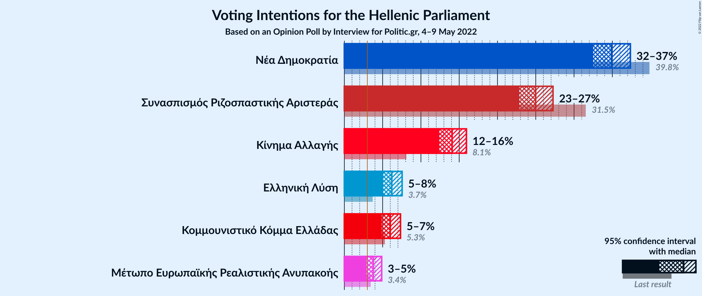

### Confidence Intervals

| Party | Last Result | Poll Result | 80% Confidence Interval | 90% Confidence Interval | 95% Confidence Interval | 99% Confidence Interval |
|:-----:|:-----------:|:-----------:|:-----------------------:|:-----------------------:|:-----------------------:|:-----------------------:|
| Νέα Δημοκρατία | 39.8% | 34.9% | 33.3–36.5% |32.9–37.0% |32.5–37.4% |31.7–38.1% |
| Συνασπισμός Ριζοσπαστικής Αριστεράς | 31.5% | 25.0% | 23.6–26.5% |23.2–26.9% |22.8–27.3% |22.2–28.0% |
| Κίνημα Αλλαγής | 8.1% | 14.1% | 13.0–15.3% |12.7–15.6% |12.4–15.9% |11.9–16.5% |
| Ελληνική Λύση | 3.7% | 6.2% | 5.5–7.1% |5.2–7.3% |5.1–7.5% |4.7–8.0% |
| Κομμουνιστικό Κόμμα Ελλάδας | 5.3% | 6.0% | 5.3–6.9% |5.1–7.1% |4.9–7.3% |4.6–7.8% |
| Μέτωπο Ευρωπαϊκής Ρεαλιστικής Ανυπακοής | 3.4% | 3.8% | 3.2–4.5% |3.0–4.7% |2.9–4.9% |2.7–5.2% |

*Note:* The poll result column reflects the actual value used in the calculations. Published results may vary slightly, and in addition be rounded to fewer digits.

## Seats

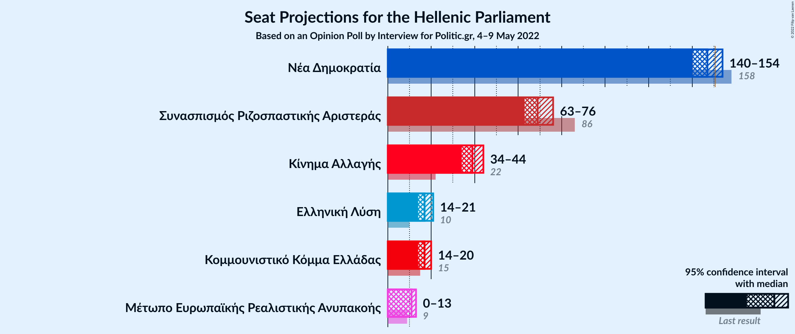

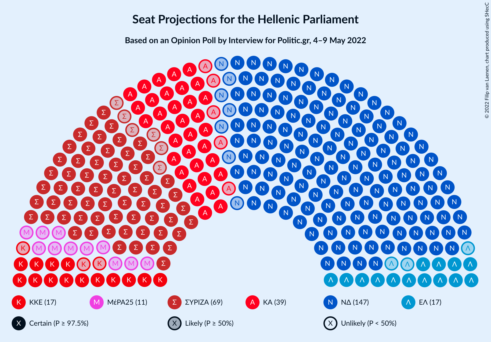

### Confidence Intervals

| Party | Last Result | Median | 80% Confidence Interval | 90% Confidence Interval | 95% Confidence Interval | 99% Confidence Interval |
|:-----:|:-----------:|:------:|:-----------------------:|:-----------------------:|:-----------------------:|:-----------------------:|
| <a href="#νέα-δημοκρατία">Νέα Δημοκρατία</a> | 158 | 147 | 143–151 |141–153 |140–154 |138–156 |
| <a href="#συνασπισμός-ριζοσπαστικής-αριστεράς">Συνασπισμός Ριζοσπαστικής Αριστεράς</a> | 86 | 69 | 65–73 |64–75 |63–76 |62–78 |
| <a href="#κίνημα-αλλαγής">Κίνημα Αλλαγής</a> | 22 | 39 | 36–42 |35–43 |34–44 |33–46 |
| <a href="#ελληνική-λύση">Ελληνική Λύση</a> | 10 | 17 | 15–20 |15–20 |14–21 |13–22 |
| <a href="#κομμουνιστικό-κόμμα-ελλάδας">Κομμουνιστικό Κόμμα Ελλάδας</a> | 15 | 17 | 15–19 |14–20 |14–20 |13–22 |
| <a href="#μέτωπο-ευρωπαϊκής-ρεαλιστικής-ανυπακοής">Μέτωπο Ευρωπαϊκής Ρεαλιστικής Ανυπακοής</a> | 9 | 11 | 9–12 |8–13 |0–13 |0–15 |

### Νέα Δημοκρατία

*For a full overview of the results for this party, see the [Νέα Δημοκρατία](party-νέαδημοκρατία.html) page.*

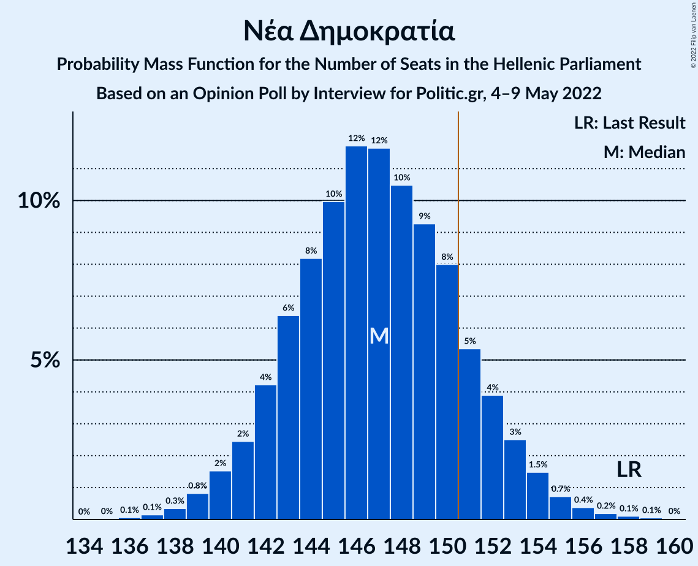

| Number of Seats | Probability | Accumulated | Special Marks |
|:---------------:|:-----------:|:-----------:|:-------------:|
| 136 | 0.1% | 100% |  |
| 137 | 0.1% | 99.9% |  |
| 138 | 0.3% | 99.8% |  |
| 139 | 0.8% | 99.4% |  |
| 140 | 2% | 98.6% |  |
| 141 | 2% | 97% |  |
| 142 | 4% | 95% |  |
| 143 | 6% | 90% |  |
| 144 | 8% | 84% |  |
| 145 | 10% | 76% |  |
| 146 | 12% | 66% |  |
| 147 | 12% | 54% | Median |
| 148 | 10% | 42% |  |
| 149 | 9% | 32% |  |
| 150 | 8% | 23% |  |
| 151 | 5% | 15% | Majority |
| 152 | 4% | 9% |  |
| 153 | 3% | 5% |  |
| 154 | 1.5% | 3% |  |
| 155 | 0.7% | 1.5% |  |
| 156 | 0.4% | 0.8% |  |
| 157 | 0.2% | 0.4% |  |
| 158 | 0.1% | 0.2% | Last Result |
| 159 | 0.1% | 0.1% |  |
| 160 | 0% | 0% |  |

### Συνασπισμός Ριζοσπαστικής Αριστεράς

*For a full overview of the results for this party, see the [Συνασπισμός Ριζοσπαστικής Αριστεράς](party-συνασπισμόςριζοσπαστικήςαριστεράς.html) page.*

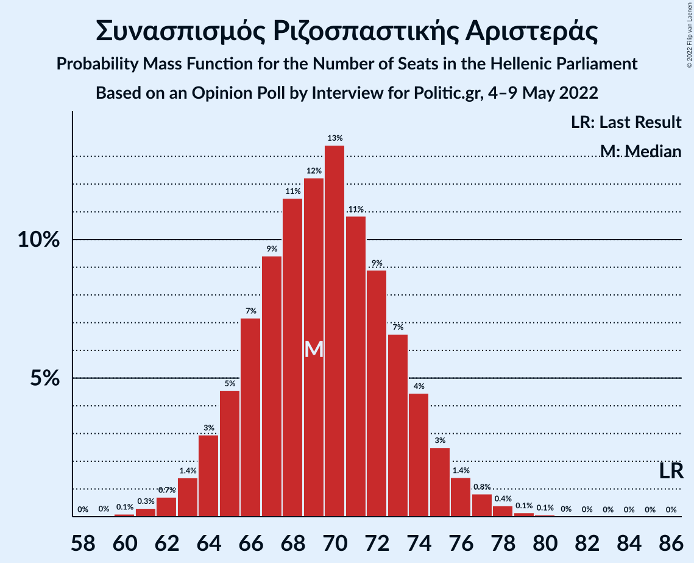

| Number of Seats | Probability | Accumulated | Special Marks |
|:---------------:|:-----------:|:-----------:|:-------------:|
| 60 | 0.1% | 100% |  |
| 61 | 0.3% | 99.9% |  |
| 62 | 0.7% | 99.5% |  |
| 63 | 1.4% | 98.8% |  |
| 64 | 3% | 97% |  |
| 65 | 5% | 94% |  |
| 66 | 7% | 90% |  |
| 67 | 9% | 83% |  |
| 68 | 11% | 73% |  |
| 69 | 12% | 62% | Median |
| 70 | 13% | 50% |  |
| 71 | 11% | 36% |  |
| 72 | 9% | 25% |  |
| 73 | 7% | 16% |  |
| 74 | 4% | 10% |  |
| 75 | 3% | 5% |  |
| 76 | 1.4% | 3% |  |
| 77 | 0.8% | 1.5% |  |
| 78 | 0.4% | 0.7% |  |
| 79 | 0.1% | 0.3% |  |
| 80 | 0.1% | 0.1% |  |
| 81 | 0% | 0% |  |
| 82 | 0% | 0% |  |
| 83 | 0% | 0% |  |
| 84 | 0% | 0% |  |
| 85 | 0% | 0% |  |
| 86 | 0% | 0% | Last Result |

### Κίνημα Αλλαγής

*For a full overview of the results for this party, see the [Κίνημα Αλλαγής](party-κίνημααλλαγής.html) page.*

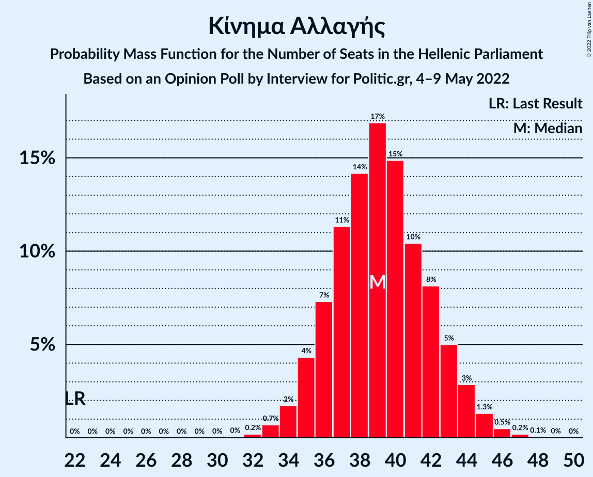

| Number of Seats | Probability | Accumulated | Special Marks |
|:---------------:|:-----------:|:-----------:|:-------------:|
| 22 | 0% | 100% | Last Result |
| 23 | 0% | 100% |  |
| 24 | 0% | 100% |  |
| 25 | 0% | 100% |  |
| 26 | 0% | 100% |  |
| 27 | 0% | 100% |  |
| 28 | 0% | 100% |  |
| 29 | 0% | 100% |  |
| 30 | 0% | 100% |  |
| 31 | 0% | 100% |  |
| 32 | 0.2% | 99.9% |  |
| 33 | 0.7% | 99.7% |  |
| 34 | 2% | 99.1% |  |
| 35 | 4% | 97% |  |
| 36 | 7% | 93% |  |
| 37 | 11% | 86% |  |
| 38 | 14% | 74% |  |
| 39 | 17% | 60% | Median |
| 40 | 15% | 43% |  |
| 41 | 10% | 28% |  |
| 42 | 8% | 18% |  |
| 43 | 5% | 10% |  |
| 44 | 3% | 5% |  |
| 45 | 1.3% | 2% |  |
| 46 | 0.5% | 0.8% |  |
| 47 | 0.2% | 0.3% |  |
| 48 | 0.1% | 0.1% |  |
| 49 | 0% | 0% |  |

### Ελληνική Λύση

*For a full overview of the results for this party, see the [Ελληνική Λύση](party-ελληνικήλύση.html) page.*

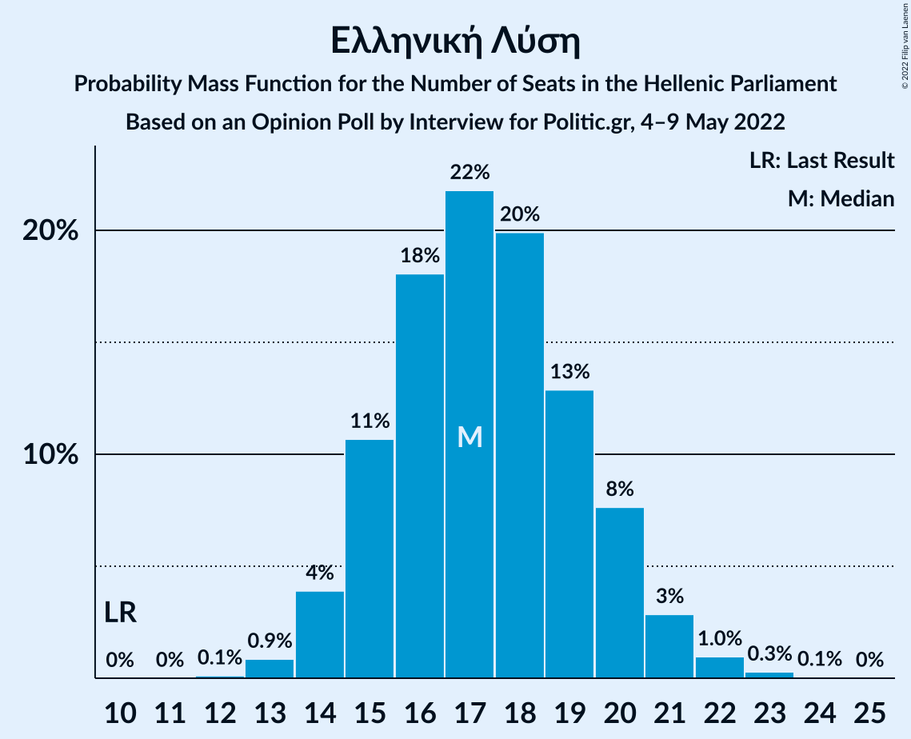

| Number of Seats | Probability | Accumulated | Special Marks |
|:---------------:|:-----------:|:-----------:|:-------------:|
| 10 | 0% | 100% | Last Result |
| 11 | 0% | 100% |  |
| 12 | 0.1% | 100% |  |
| 13 | 0.9% | 99.9% |  |
| 14 | 4% | 99.0% |  |
| 15 | 11% | 95% |  |
| 16 | 18% | 84% |  |
| 17 | 22% | 66% | Median |
| 18 | 20% | 45% |  |
| 19 | 13% | 25% |  |
| 20 | 8% | 12% |  |
| 21 | 3% | 4% |  |
| 22 | 1.0% | 1.3% |  |
| 23 | 0.3% | 0.3% |  |
| 24 | 0.1% | 0.1% |  |
| 25 | 0% | 0% |  |

### Κομμουνιστικό Κόμμα Ελλάδας

*For a full overview of the results for this party, see the [Κομμουνιστικό Κόμμα Ελλάδας](party-κομμουνιστικόκόμμαελλάδας.html) page.*

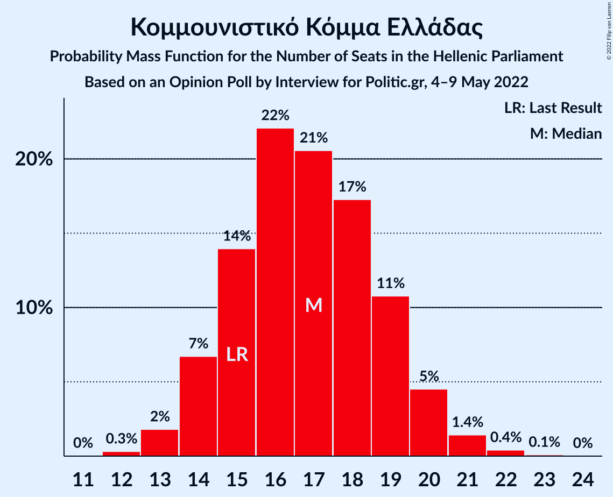

| Number of Seats | Probability | Accumulated | Special Marks |
|:---------------:|:-----------:|:-----------:|:-------------:|
| 12 | 0.3% | 100% |  |
| 13 | 2% | 99.7% |  |
| 14 | 7% | 98% |  |
| 15 | 14% | 91% | Last Result |
| 16 | 22% | 77% |  |
| 17 | 21% | 55% | Median |
| 18 | 17% | 35% |  |
| 19 | 11% | 17% |  |
| 20 | 5% | 6% |  |
| 21 | 1.4% | 2% |  |
| 22 | 0.4% | 0.5% |  |
| 23 | 0.1% | 0.1% |  |
| 24 | 0% | 0% |  |

### Μέτωπο Ευρωπαϊκής Ρεαλιστικής Ανυπακοής

*For a full overview of the results for this party, see the [Μέτωπο Ευρωπαϊκής Ρεαλιστικής Ανυπακοής](party-μέτωποευρωπαϊκήςρεαλιστικήςανυπακοής.html) page.*

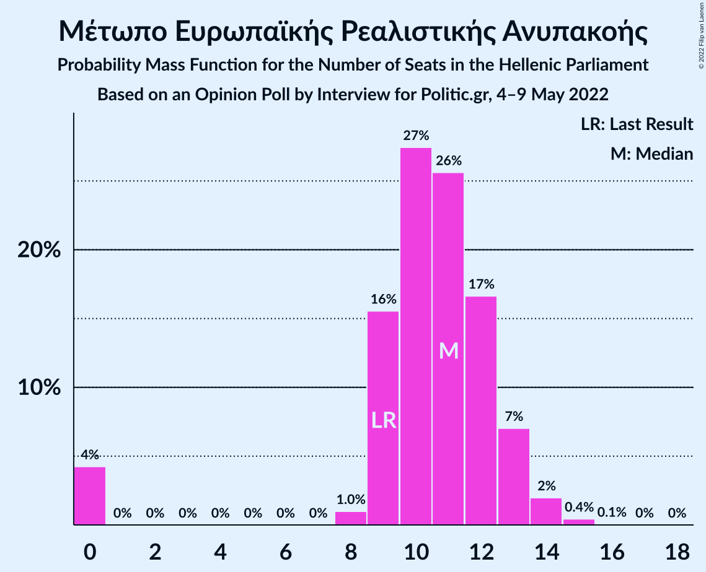

| Number of Seats | Probability | Accumulated | Special Marks |
|:---------------:|:-----------:|:-----------:|:-------------:|
| 0 | 4% | 100% |  |
| 1 | 0% | 96% |  |
| 2 | 0% | 96% |  |
| 3 | 0% | 96% |  |
| 4 | 0% | 96% |  |
| 5 | 0% | 96% |  |
| 6 | 0% | 96% |  |
| 7 | 0% | 96% |  |
| 8 | 1.0% | 96% |  |
| 9 | 16% | 95% | Last Result |
| 10 | 27% | 79% |  |
| 11 | 26% | 52% | Median |
| 12 | 17% | 26% |  |
| 13 | 7% | 10% |  |
| 14 | 2% | 2% |  |
| 15 | 0.4% | 0.5% |  |
| 16 | 0.1% | 0.1% |  |
| 17 | 0% | 0% |  |

## Coalitions

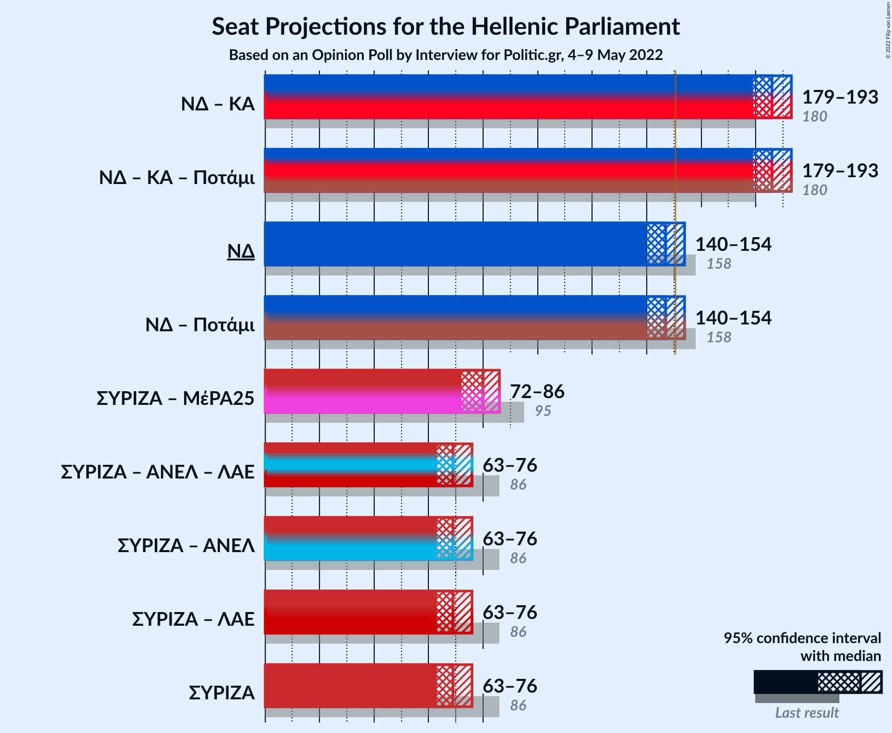

### Confidence Intervals

| Coalition | Last Result | Median | Majority? | 80% Confidence Interval | 90% Confidence Interval | 95% Confidence Interval | 99% Confidence Interval |
|:---------:|:-----------:|:------:|:---------:|:-----------------------:|:-----------------------:|:-----------------------:|:-----------------------:|
| Νέα Δημοκρατία – Κίνημα Αλλαγής | 180 | 186 | 100% | 182–191 | 180–192 | 179–193 | 177–196 |
| Νέα Δημοκρατία | 158 | 147 | 15% | 143–151 | 141–153 | 140–154 | 138–156 |
| Συνασπισμός Ριζοσπαστικής Αριστεράς – Μέτωπο Ευρωπαϊκής Ρεαλιστικής Ανυπακοής | 95 | 80 | 0% | 75–84 | 74–85 | 72–86 | 69–88 |
| Συνασπισμός Ριζοσπαστικής Αριστεράς | 86 | 69 | 0% | 65–73 | 64–75 | 63–76 | 62–78 |

### Νέα Δημοκρατία – Κίνημα Αλλαγής

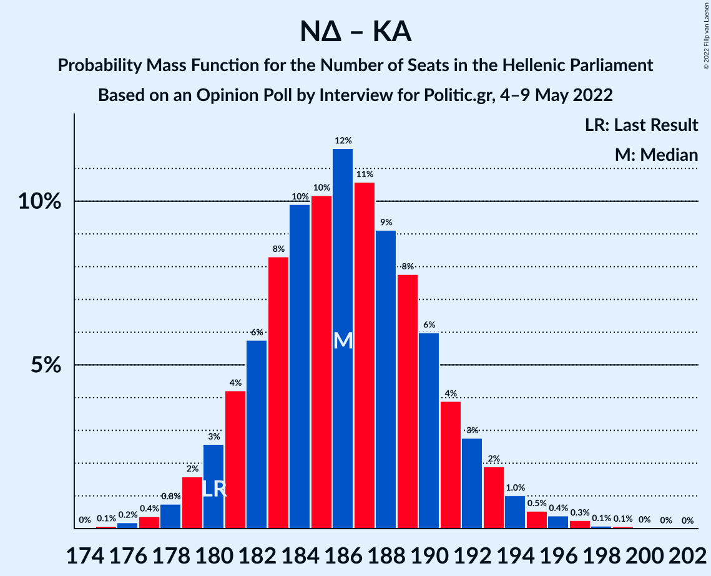

| Number of Seats | Probability | Accumulated | Special Marks |
|:---------------:|:-----------:|:-----------:|:-------------:|
| 175 | 0.1% | 100% |  |
| 176 | 0.2% | 99.9% |  |
| 177 | 0.4% | 99.7% |  |
| 178 | 0.8% | 99.3% |  |
| 179 | 2% | 98.6% |  |
| 180 | 3% | 97% | Last Result |
| 181 | 4% | 94% |  |
| 182 | 6% | 90% |  |
| 183 | 8% | 84% |  |
| 184 | 10% | 76% |  |
| 185 | 10% | 66% |  |
| 186 | 12% | 56% | Median |
| 187 | 11% | 44% |  |
| 188 | 9% | 34% |  |
| 189 | 8% | 25% |  |
| 190 | 6% | 17% |  |
| 191 | 4% | 11% |  |
| 192 | 3% | 7% |  |
| 193 | 2% | 4% |  |
| 194 | 1.0% | 2% |  |
| 195 | 0.5% | 1.4% |  |
| 196 | 0.4% | 0.9% |  |
| 197 | 0.3% | 0.5% |  |
| 198 | 0.1% | 0.2% |  |
| 199 | 0.1% | 0.1% |  |
| 200 | 0% | 0.1% |  |
| 201 | 0% | 0% |  |

### Νέα Δημοκρατία

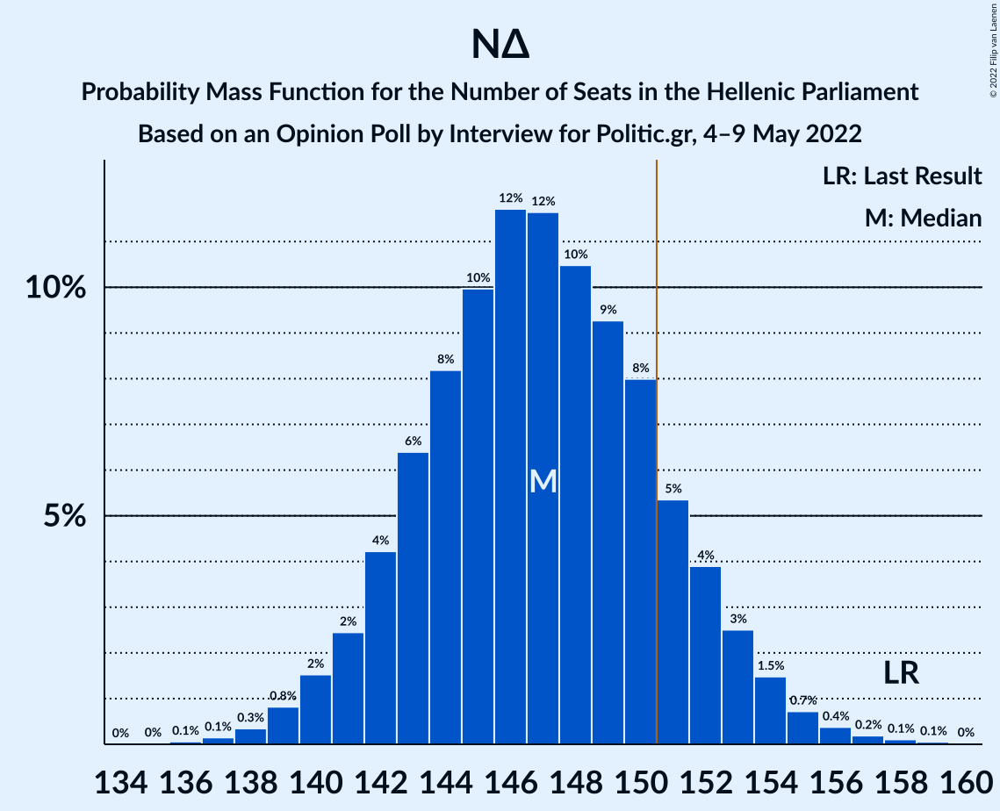

| Number of Seats | Probability | Accumulated | Special Marks |
|:---------------:|:-----------:|:-----------:|:-------------:|
| 136 | 0.1% | 100% |  |
| 137 | 0.1% | 99.9% |  |
| 138 | 0.3% | 99.8% |  |
| 139 | 0.8% | 99.4% |  |
| 140 | 2% | 98.6% |  |
| 141 | 2% | 97% |  |
| 142 | 4% | 95% |  |
| 143 | 6% | 90% |  |
| 144 | 8% | 84% |  |
| 145 | 10% | 76% |  |
| 146 | 12% | 66% |  |
| 147 | 12% | 54% | Median |
| 148 | 10% | 42% |  |
| 149 | 9% | 32% |  |
| 150 | 8% | 23% |  |
| 151 | 5% | 15% | Majority |
| 152 | 4% | 9% |  |
| 153 | 3% | 5% |  |
| 154 | 1.5% | 3% |  |
| 155 | 0.7% | 1.5% |  |
| 156 | 0.4% | 0.8% |  |
| 157 | 0.2% | 0.4% |  |
| 158 | 0.1% | 0.2% | Last Result |
| 159 | 0.1% | 0.1% |  |
| 160 | 0% | 0% |  |

### Συνασπισμός Ριζοσπαστικής Αριστεράς – Μέτωπο Ευρωπαϊκής Ρεαλιστικής Ανυπακοής

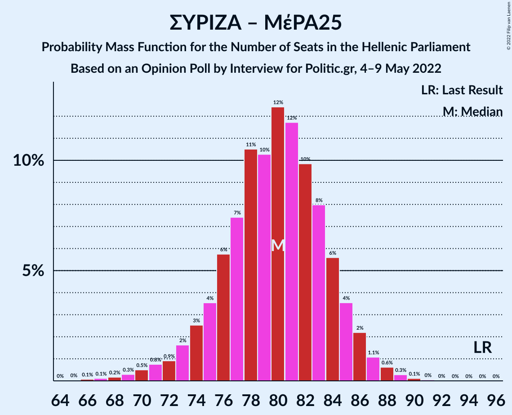

| Number of Seats | Probability | Accumulated | Special Marks |
|:---------------:|:-----------:|:-----------:|:-------------:|
| 65 | 0% | 100% |  |
| 66 | 0.1% | 99.9% |  |
| 67 | 0.1% | 99.9% |  |
| 68 | 0.2% | 99.8% |  |
| 69 | 0.3% | 99.6% |  |
| 70 | 0.5% | 99.3% |  |
| 71 | 0.8% | 98.8% |  |
| 72 | 0.9% | 98% |  |
| 73 | 2% | 97% |  |
| 74 | 3% | 95% |  |
| 75 | 4% | 93% |  |
| 76 | 6% | 89% |  |
| 77 | 7% | 84% |  |
| 78 | 11% | 76% |  |
| 79 | 10% | 66% |  |
| 80 | 12% | 55% | Median |
| 81 | 12% | 43% |  |
| 82 | 10% | 31% |  |
| 83 | 8% | 21% |  |
| 84 | 6% | 13% |  |
| 85 | 4% | 8% |  |
| 86 | 2% | 4% |  |
| 87 | 1.1% | 2% |  |
| 88 | 0.6% | 1.1% |  |
| 89 | 0.3% | 0.5% |  |
| 90 | 0.1% | 0.2% |  |
| 91 | 0% | 0.1% |  |
| 92 | 0% | 0% |  |
| 93 | 0% | 0% |  |
| 94 | 0% | 0% |  |
| 95 | 0% | 0% | Last Result |

### Συνασπισμός Ριζοσπαστικής Αριστεράς

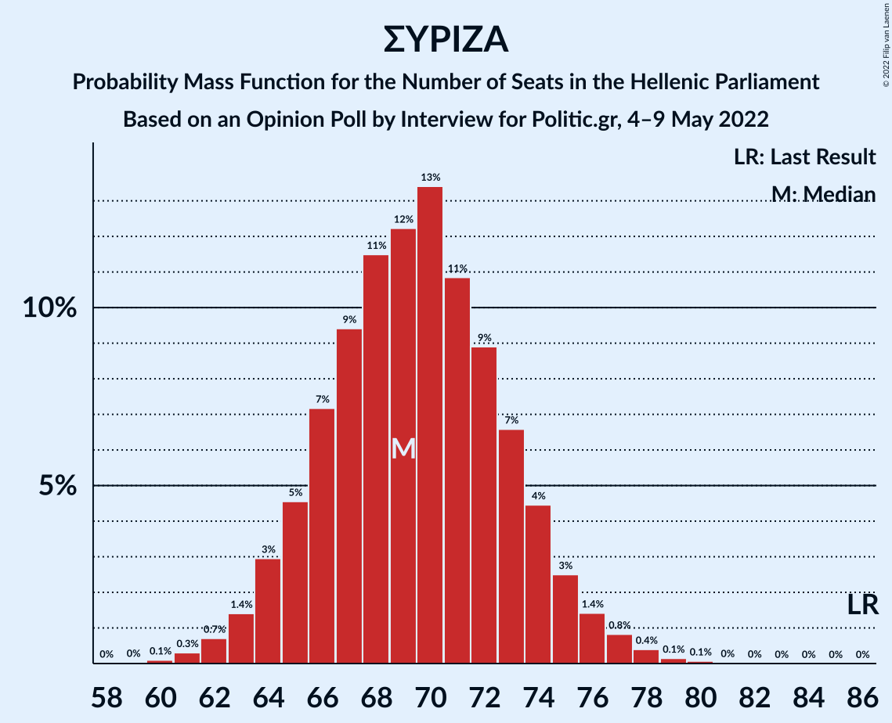

| Number of Seats | Probability | Accumulated | Special Marks |
|:---------------:|:-----------:|:-----------:|:-------------:|
| 60 | 0.1% | 100% |  |
| 61 | 0.3% | 99.9% |  |
| 62 | 0.7% | 99.5% |  |
| 63 | 1.4% | 98.8% |  |
| 64 | 3% | 97% |  |
| 65 | 5% | 94% |  |
| 66 | 7% | 90% |  |
| 67 | 9% | 83% |  |
| 68 | 11% | 73% |  |
| 69 | 12% | 62% | Median |
| 70 | 13% | 50% |  |
| 71 | 11% | 36% |  |
| 72 | 9% | 25% |  |
| 73 | 7% | 16% |  |
| 74 | 4% | 10% |  |
| 75 | 3% | 5% |  |
| 76 | 1.4% | 3% |  |
| 77 | 0.8% | 1.5% |  |
| 78 | 0.4% | 0.7% |  |
| 79 | 0.1% | 0.3% |  |
| 80 | 0.1% | 0.1% |  |
| 81 | 0% | 0% |  |
| 82 | 0% | 0% |  |
| 83 | 0% | 0% |  |
| 84 | 0% | 0% |  |
| 85 | 0% | 0% |  |
| 86 | 0% | 0% | Last Result |

## Technical Information

### Opinion Poll

+ **Polling firm:** Interview
+ **Commissioner(s):** Politic.gr
+ **Fieldwork period:** 4–9 May 2022

### Calculations

+ **Sample size:** 1485
+ **Simulations done:** 1,048,576
+ **Error estimate:** 0.79%

