# Opinion Poll by Opinion Poll for tomanifesto.gr, 11–13 May 2022

<a href="#voting-intentions">Voting Intentions</a> | <a href="#seats">Seats</a> | <a href="#coalitions">Coalitions</a> | <a href="#technical-information">Technical Information</a>

## Voting Intentions

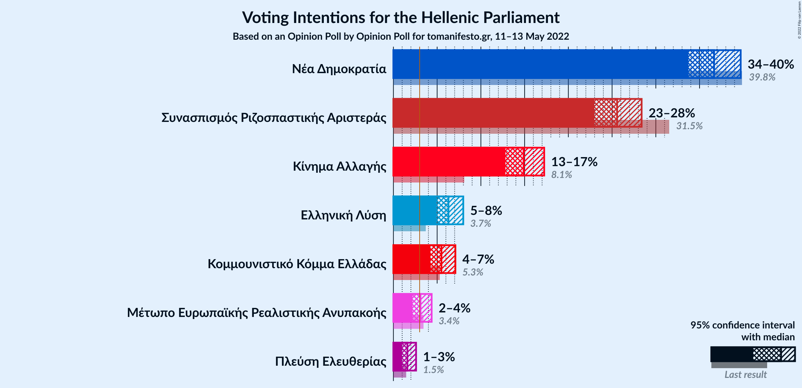

### Confidence Intervals

| Party | Last Result | Poll Result | 80% Confidence Interval | 90% Confidence Interval | 95% Confidence Interval | 99% Confidence Interval |
|:-----:|:-----------:|:-----------:|:-----------------------:|:-----------------------:|:-----------------------:|:-----------------------:|
| Νέα Δημοκρατία | 39.8% | 36.7% | 34.7–38.7% |34.2–39.2% |33.7–39.7% |32.8–40.7% |
| Συνασπισμός Ριζοσπαστικής Αριστεράς | 31.5% | 25.6% | 23.9–27.4% |23.4–27.9% |23.0–28.4% |22.2–29.3% |
| Κίνημα Αλλαγής | 8.1% | 14.9% | 13.5–16.4% |13.1–16.9% |12.8–17.2% |12.2–18.0% |
| Ελληνική Λύση | 3.7% | 6.3% | 5.4–7.4% |5.2–7.7% |4.9–8.0% |4.6–8.5% |
| Κομμουνιστικό Κόμμα Ελλάδας | 5.3% | 5.5% | 4.7–6.5% |4.4–6.8% |4.2–7.1% |3.9–7.6% |
| Μέτωπο Ευρωπαϊκής Ρεαλιστικής Ανυπακοής | 3.4% | 3.1% | 2.5–3.9% |2.3–4.2% |2.2–4.4% |1.9–4.8% |
| Πλεύση Ελευθερίας | 1.5% | 1.6% | 1.2–2.2% |1.1–2.4% |1.0–2.6% |0.8–2.9% |

*Note:* The poll result column reflects the actual value used in the calculations. Published results may vary slightly, and in addition be rounded to fewer digits.

## Seats

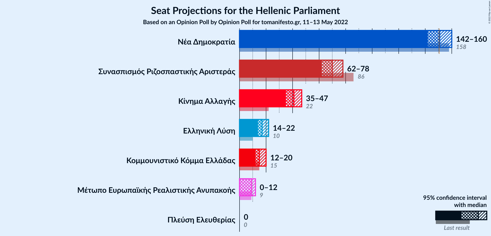

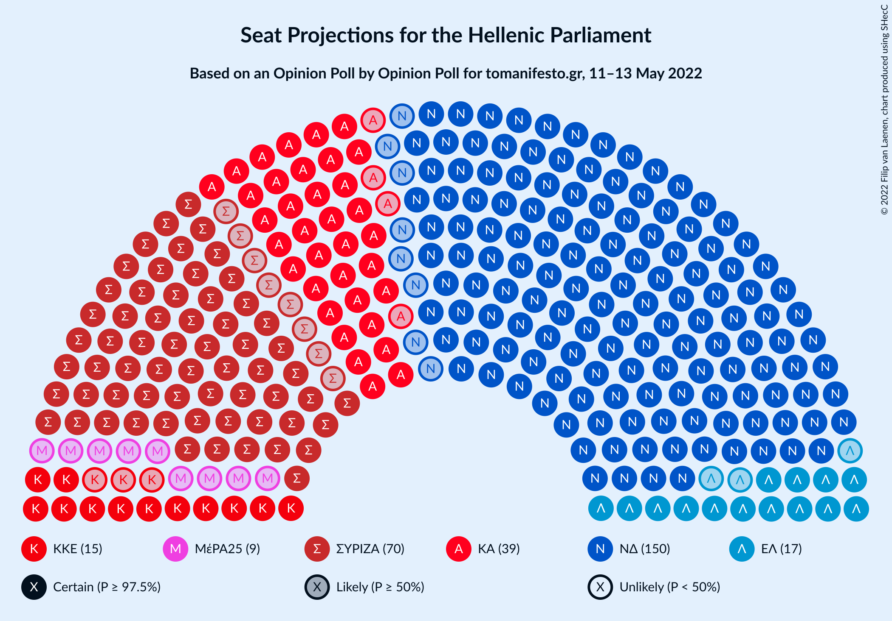

### Confidence Intervals

| Party | Last Result | Median | 80% Confidence Interval | 90% Confidence Interval | 95% Confidence Interval | 99% Confidence Interval |
|:-----:|:-----------:|:------:|:-----------------------:|:-----------------------:|:-----------------------:|:-----------------------:|
| <a href="#νέα-δημοκρατία">Νέα Δημοκρατία</a> | 158 | 151 | 145–156 |143–158 |142–160 |139–162 |
| <a href="#συνασπισμός-ριζοσπαστικής-αριστεράς">Συνασπισμός Ριζοσπαστικής Αριστεράς</a> | 86 | 70 | 65–75 |64–77 |62–78 |60–81 |
| <a href="#κίνημα-αλλαγής">Κίνημα Αλλαγής</a> | 22 | 41 | 37–45 |36–46 |35–47 |33–49 |
| <a href="#ελληνική-λύση">Ελληνική Λύση</a> | 10 | 17 | 15–20 |14–21 |14–22 |12–23 |
| <a href="#κομμουνιστικό-κόμμα-ελλάδας">Κομμουνιστικό Κόμμα Ελλάδας</a> | 15 | 15 | 13–18 |12–19 |12–20 |11–21 |
| <a href="#μέτωπο-ευρωπαϊκής-ρεαλιστικής-ανυπακοής">Μέτωπο Ευρωπαϊκής Ρεαλιστικής Ανυπακοής</a> | 9 | 9 | 0–11 |0–11 |0–12 |0–13 |
| <a href="#πλεύση-ελευθερίας">Πλεύση Ελευθερίας</a> | 0 | 0 | 0 |0 |0 |0 |

### Νέα Δημοκρατία

*For a full overview of the results for this party, see the [Νέα Δημοκρατία](party-νέαδημοκρατία.html) page.*

| Number of Seats | Probability | Accumulated | Special Marks |
|:---------------:|:-----------:|:-----------:|:-------------:|
| 136 | 0% | 100% |  |
| 137 | 0.1% | 99.9% |  |
| 138 | 0.1% | 99.9% |  |
| 139 | 0.3% | 99.7% |  |
| 140 | 0.6% | 99.5% |  |
| 141 | 1.0% | 98.9% |  |
| 142 | 2% | 98% |  |
| 143 | 2% | 96% |  |
| 144 | 3% | 94% |  |
| 145 | 4% | 91% |  |
| 146 | 6% | 87% |  |
| 147 | 8% | 81% |  |
| 148 | 6% | 73% |  |
| 149 | 8% | 67% |  |
| 150 | 9% | 59% |  |
| 151 | 9% | 50% | Median, Majority |
| 152 | 10% | 42% |  |
| 153 | 5% | 32% |  |
| 154 | 7% | 27% |  |
| 155 | 5% | 19% |  |
| 156 | 5% | 14% |  |
| 157 | 4% | 10% |  |
| 158 | 2% | 6% | Last Result |
| 159 | 1.3% | 4% |  |
| 160 | 1.2% | 3% |  |
| 161 | 0.6% | 1.5% |  |
| 162 | 0.5% | 0.9% |  |
| 163 | 0.2% | 0.4% |  |
| 164 | 0.1% | 0.2% |  |
| 165 | 0% | 0.1% |  |
| 166 | 0% | 0.1% |  |
| 167 | 0% | 0% |  |

### Συνασπισμός Ριζοσπαστικής Αριστεράς

*For a full overview of the results for this party, see the [Συνασπισμός Ριζοσπαστικής Αριστεράς](party-συνασπισμόςριζοσπαστικήςαριστεράς.html) page.*

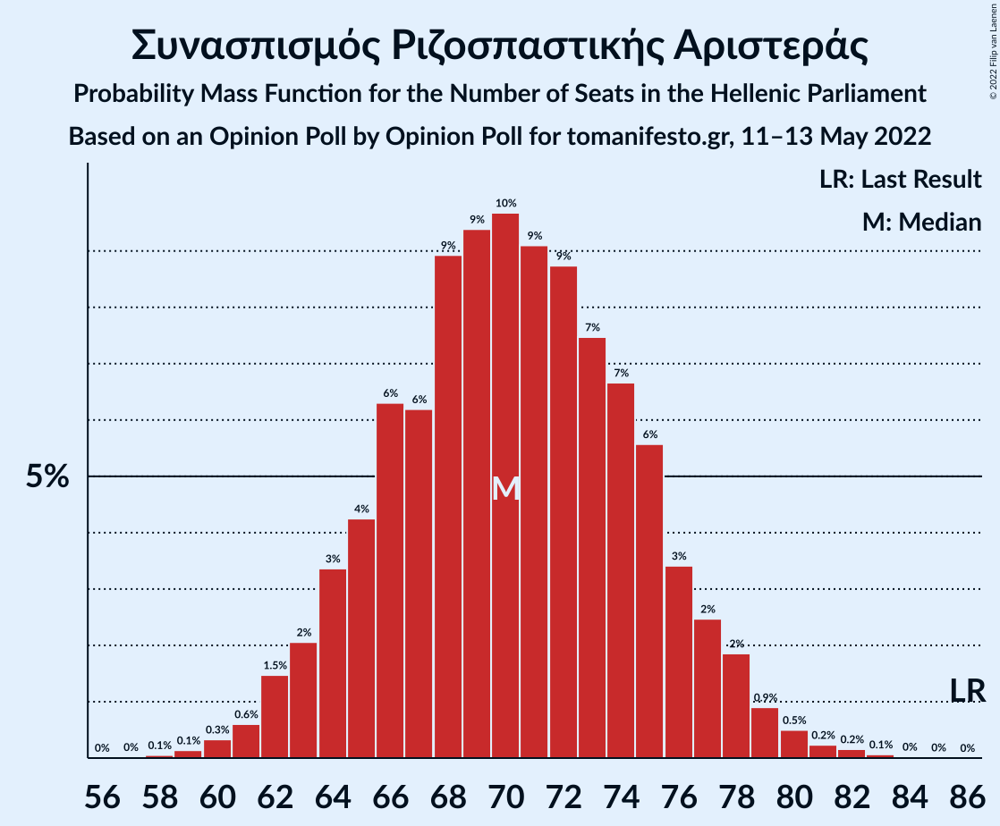

| Number of Seats | Probability | Accumulated | Special Marks |
|:---------------:|:-----------:|:-----------:|:-------------:|
| 58 | 0.1% | 100% |  |
| 59 | 0.1% | 99.9% |  |
| 60 | 0.3% | 99.8% |  |
| 61 | 0.6% | 99.4% |  |
| 62 | 1.5% | 98.8% |  |
| 63 | 2% | 97% |  |
| 64 | 3% | 95% |  |
| 65 | 4% | 92% |  |
| 66 | 6% | 88% |  |
| 67 | 6% | 81% |  |
| 68 | 9% | 75% |  |
| 69 | 9% | 66% |  |
| 70 | 10% | 57% | Median |
| 71 | 9% | 47% |  |
| 72 | 9% | 38% |  |
| 73 | 7% | 29% |  |
| 74 | 7% | 22% |  |
| 75 | 6% | 15% |  |
| 76 | 3% | 10% |  |
| 77 | 2% | 6% |  |
| 78 | 2% | 4% |  |
| 79 | 0.9% | 2% |  |
| 80 | 0.5% | 1.0% |  |
| 81 | 0.2% | 0.5% |  |
| 82 | 0.2% | 0.3% |  |
| 83 | 0.1% | 0.1% |  |
| 84 | 0% | 0% |  |
| 85 | 0% | 0% |  |
| 86 | 0% | 0% | Last Result |

### Κίνημα Αλλαγής

*For a full overview of the results for this party, see the [Κίνημα Αλλαγής](party-κίνημααλλαγής.html) page.*

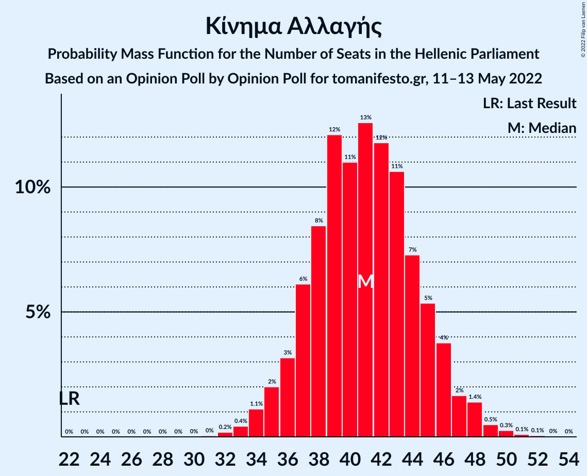

| Number of Seats | Probability | Accumulated | Special Marks |
|:---------------:|:-----------:|:-----------:|:-------------:|
| 22 | 0% | 100% | Last Result |
| 23 | 0% | 100% |  |
| 24 | 0% | 100% |  |
| 25 | 0% | 100% |  |
| 26 | 0% | 100% |  |
| 27 | 0% | 100% |  |
| 28 | 0% | 100% |  |
| 29 | 0% | 100% |  |
| 30 | 0% | 100% |  |
| 31 | 0% | 100% |  |
| 32 | 0.2% | 99.9% |  |
| 33 | 0.4% | 99.7% |  |
| 34 | 1.1% | 99.3% |  |
| 35 | 2% | 98% |  |
| 36 | 3% | 96% |  |
| 37 | 6% | 93% |  |
| 38 | 8% | 87% |  |
| 39 | 12% | 78% |  |
| 40 | 11% | 66% |  |
| 41 | 13% | 55% | Median |
| 42 | 12% | 43% |  |
| 43 | 11% | 31% |  |
| 44 | 7% | 20% |  |
| 45 | 5% | 13% |  |
| 46 | 4% | 8% |  |
| 47 | 2% | 4% |  |
| 48 | 1.4% | 2% |  |
| 49 | 0.5% | 0.9% |  |
| 50 | 0.3% | 0.4% |  |
| 51 | 0.1% | 0.2% |  |
| 52 | 0.1% | 0.1% |  |
| 53 | 0% | 0% |  |

### Ελληνική Λύση

*For a full overview of the results for this party, see the [Ελληνική Λύση](party-ελληνικήλύση.html) page.*

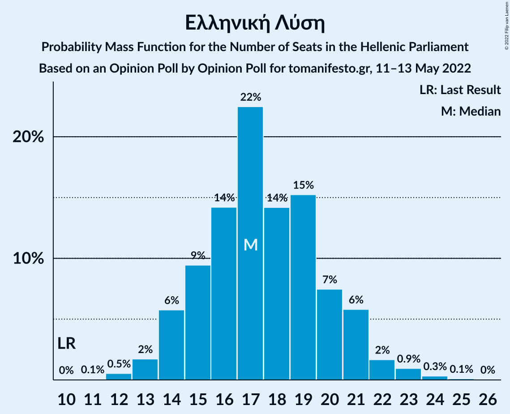

| Number of Seats | Probability | Accumulated | Special Marks |
|:---------------:|:-----------:|:-----------:|:-------------:|
| 10 | 0% | 100% | Last Result |
| 11 | 0.1% | 100% |  |
| 12 | 0.5% | 99.9% |  |
| 13 | 2% | 99.4% |  |
| 14 | 6% | 98% |  |
| 15 | 9% | 92% |  |
| 16 | 14% | 82% |  |
| 17 | 22% | 68% | Median |
| 18 | 14% | 46% |  |
| 19 | 15% | 32% |  |
| 20 | 7% | 16% |  |
| 21 | 6% | 9% |  |
| 22 | 2% | 3% |  |
| 23 | 0.9% | 1.4% |  |
| 24 | 0.3% | 0.5% |  |
| 25 | 0.1% | 0.1% |  |
| 26 | 0% | 0% |  |

### Κομμουνιστικό Κόμμα Ελλάδας

*For a full overview of the results for this party, see the [Κομμουνιστικό Κόμμα Ελλάδας](party-κομμουνιστικόκόμμαελλάδας.html) page.*

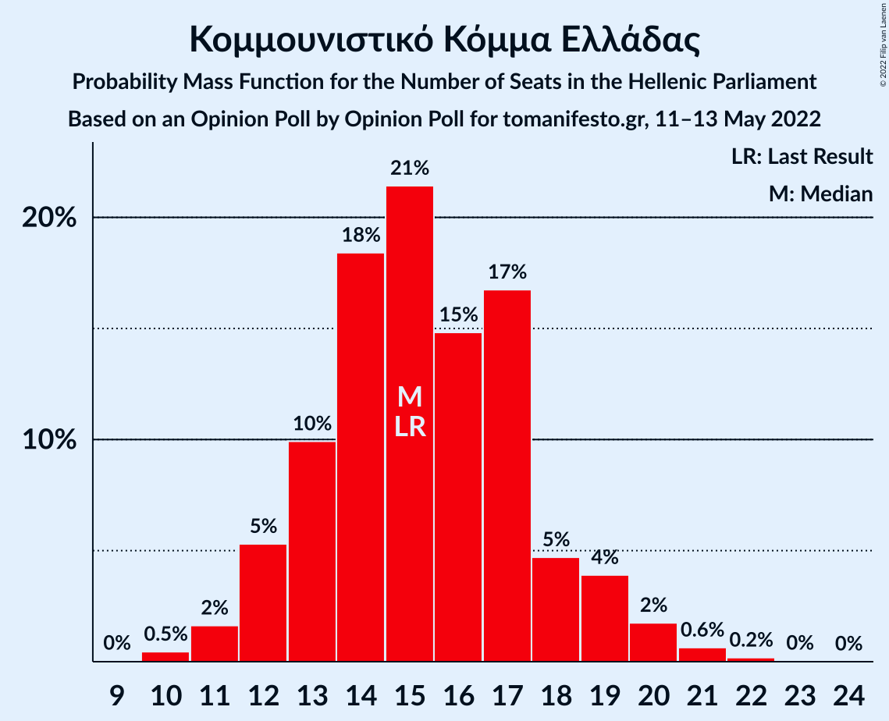

| Number of Seats | Probability | Accumulated | Special Marks |
|:---------------:|:-----------:|:-----------:|:-------------:|
| 10 | 0.5% | 100% |  |
| 11 | 2% | 99.5% |  |
| 12 | 5% | 98% |  |
| 13 | 10% | 93% |  |
| 14 | 18% | 83% |  |
| 15 | 21% | 64% | Last Result, Median |
| 16 | 15% | 43% |  |
| 17 | 17% | 28% |  |
| 18 | 5% | 11% |  |
| 19 | 4% | 7% |  |
| 20 | 2% | 3% |  |
| 21 | 0.6% | 0.9% |  |
| 22 | 0.2% | 0.2% |  |
| 23 | 0% | 0.1% |  |
| 24 | 0% | 0% |  |

### Μέτωπο Ευρωπαϊκής Ρεαλιστικής Ανυπακοής

*For a full overview of the results for this party, see the [Μέτωπο Ευρωπαϊκής Ρεαλιστικής Ανυπακοής](party-μέτωποευρωπαϊκήςρεαλιστικήςανυπακοής.html) page.*

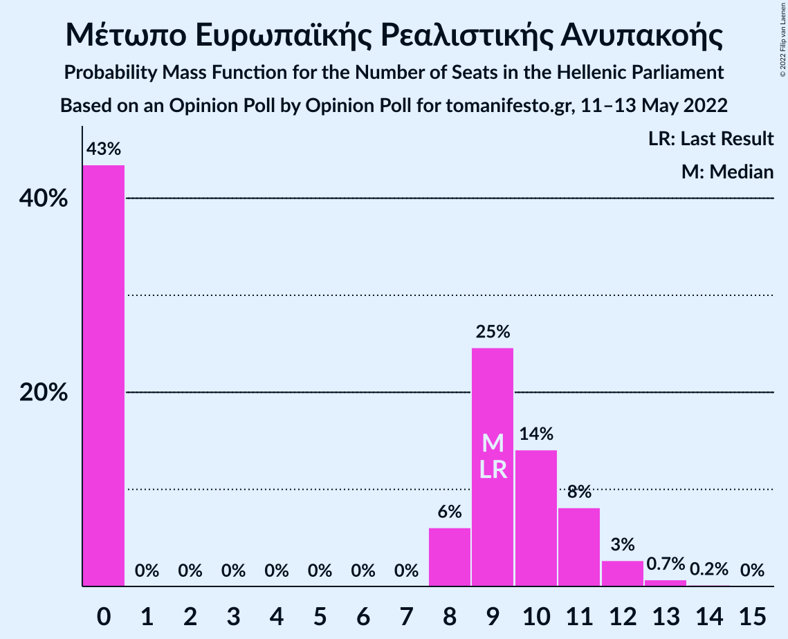

| Number of Seats | Probability | Accumulated | Special Marks |
|:---------------:|:-----------:|:-----------:|:-------------:|
| 0 | 43% | 100% |  |
| 1 | 0% | 57% |  |
| 2 | 0% | 57% |  |
| 3 | 0% | 57% |  |
| 4 | 0% | 57% |  |
| 5 | 0% | 57% |  |
| 6 | 0% | 57% |  |
| 7 | 0% | 57% |  |
| 8 | 6% | 57% |  |
| 9 | 25% | 50% | Last Result, Median |
| 10 | 14% | 26% |  |
| 11 | 8% | 12% |  |
| 12 | 3% | 4% |  |
| 13 | 0.7% | 0.9% |  |
| 14 | 0.2% | 0.2% |  |
| 15 | 0% | 0% |  |

### Πλεύση Ελευθερίας

*For a full overview of the results for this party, see the [Πλεύση Ελευθερίας](party-πλεύσηελευθερίας.html) page.*

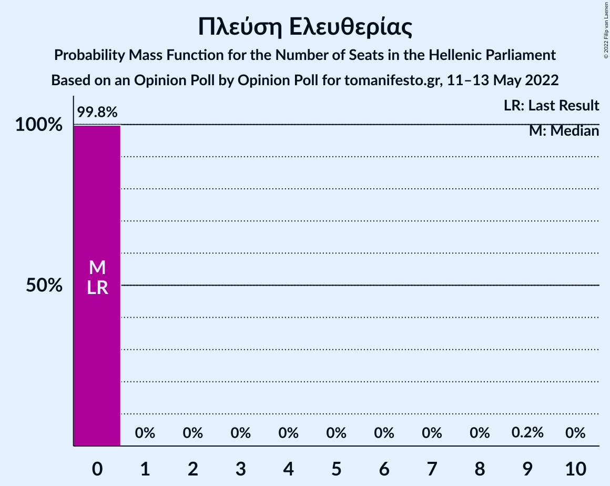

| Number of Seats | Probability | Accumulated | Special Marks |
|:---------------:|:-----------:|:-----------:|:-------------:|
| 0 | 99.8% | 100% | Last Result, Median |
| 1 | 0% | 0.2% |  |
| 2 | 0% | 0.2% |  |
| 3 | 0% | 0.2% |  |
| 4 | 0% | 0.2% |  |
| 5 | 0% | 0.2% |  |
| 6 | 0% | 0.2% |  |
| 7 | 0% | 0.2% |  |
| 8 | 0% | 0.2% |  |
| 9 | 0.2% | 0.2% |  |
| 10 | 0% | 0% |  |

## Coalitions

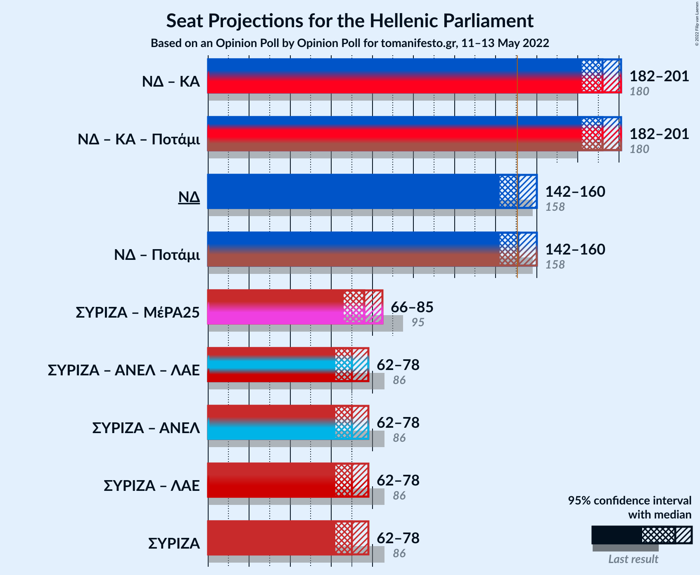

### Confidence Intervals

| Coalition | Last Result | Median | Majority? | 80% Confidence Interval | 90% Confidence Interval | 95% Confidence Interval | 99% Confidence Interval |
|:---------:|:-----------:|:------:|:---------:|:-----------------------:|:-----------------------:|:-----------------------:|:-----------------------:|
| Νέα Δημοκρατία – Κίνημα Αλλαγής | 180 | 192 | 100% | 185–198 | 184–200 | 182–201 | 179–204 |
| Νέα Δημοκρατία | 158 | 151 | 50% | 145–156 | 143–158 | 142–160 | 139–162 |
| Συνασπισμός Ριζοσπαστικής Αριστεράς – Μέτωπο Ευρωπαϊκής Ρεαλιστικής Ανυπακοής | 95 | 76 | 0% | 69–82 | 68–84 | 66–85 | 64–88 |
| Συνασπισμός Ριζοσπαστικής Αριστεράς | 86 | 70 | 0% | 65–75 | 64–77 | 62–78 | 60–81 |

### Νέα Δημοκρατία – Κίνημα Αλλαγής

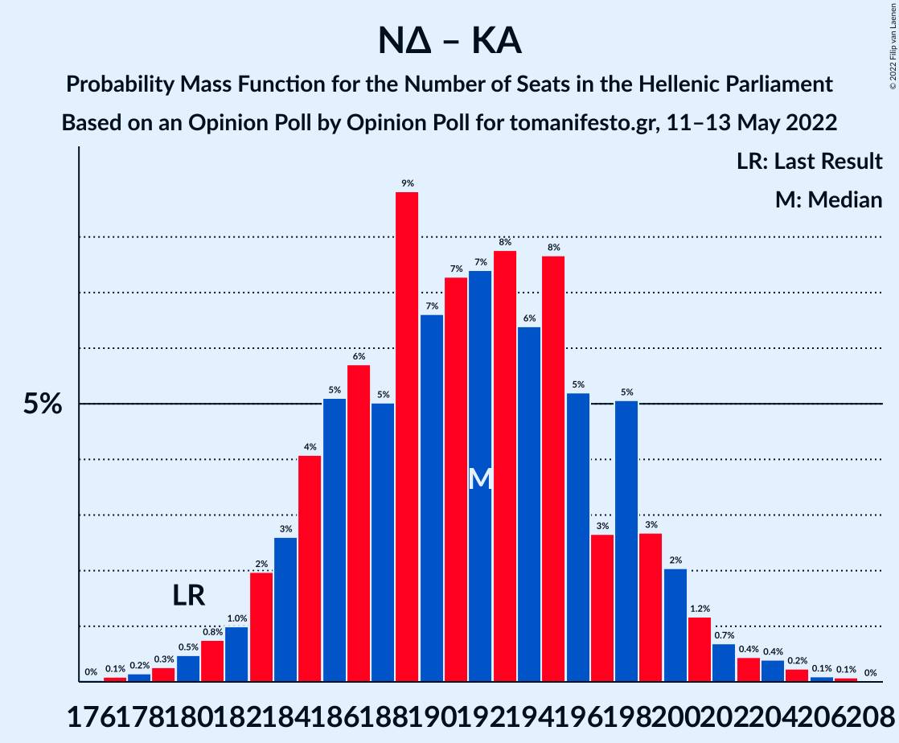

| Number of Seats | Probability | Accumulated | Special Marks |
|:---------------:|:-----------:|:-----------:|:-------------:|
| 176 | 0% | 100% |  |
| 177 | 0.1% | 99.9% |  |
| 178 | 0.2% | 99.9% |  |
| 179 | 0.3% | 99.7% |  |
| 180 | 0.5% | 99.4% | Last Result |
| 181 | 0.8% | 99.0% |  |
| 182 | 1.0% | 98% |  |
| 183 | 2% | 97% |  |
| 184 | 3% | 95% |  |
| 185 | 4% | 93% |  |
| 186 | 5% | 89% |  |
| 187 | 6% | 83% |  |
| 188 | 5% | 78% |  |
| 189 | 9% | 73% |  |
| 190 | 7% | 64% |  |
| 191 | 7% | 57% |  |
| 192 | 7% | 50% | Median |
| 193 | 8% | 43% |  |
| 194 | 6% | 35% |  |
| 195 | 8% | 28% |  |
| 196 | 5% | 21% |  |
| 197 | 3% | 16% |  |
| 198 | 5% | 13% |  |
| 199 | 3% | 8% |  |
| 200 | 2% | 5% |  |
| 201 | 1.2% | 3% |  |
| 202 | 0.7% | 2% |  |
| 203 | 0.4% | 1.3% |  |
| 204 | 0.4% | 0.8% |  |
| 205 | 0.2% | 0.4% |  |
| 206 | 0.1% | 0.2% |  |
| 207 | 0.1% | 0.1% |  |
| 208 | 0% | 0% |  |

### Νέα Δημοκρατία

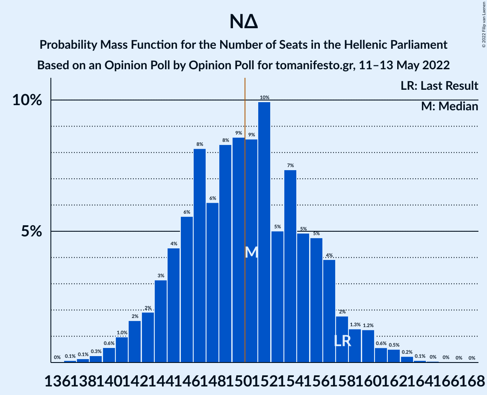

| Number of Seats | Probability | Accumulated | Special Marks |
|:---------------:|:-----------:|:-----------:|:-------------:|
| 136 | 0% | 100% |  |
| 137 | 0.1% | 99.9% |  |
| 138 | 0.1% | 99.9% |  |
| 139 | 0.3% | 99.7% |  |
| 140 | 0.6% | 99.5% |  |
| 141 | 1.0% | 98.9% |  |
| 142 | 2% | 98% |  |
| 143 | 2% | 96% |  |
| 144 | 3% | 94% |  |
| 145 | 4% | 91% |  |
| 146 | 6% | 87% |  |
| 147 | 8% | 81% |  |
| 148 | 6% | 73% |  |
| 149 | 8% | 67% |  |
| 150 | 9% | 59% |  |
| 151 | 9% | 50% | Median, Majority |
| 152 | 10% | 42% |  |
| 153 | 5% | 32% |  |
| 154 | 7% | 27% |  |
| 155 | 5% | 19% |  |
| 156 | 5% | 14% |  |
| 157 | 4% | 10% |  |
| 158 | 2% | 6% | Last Result |
| 159 | 1.3% | 4% |  |
| 160 | 1.2% | 3% |  |
| 161 | 0.6% | 1.5% |  |
| 162 | 0.5% | 0.9% |  |
| 163 | 0.2% | 0.4% |  |
| 164 | 0.1% | 0.2% |  |
| 165 | 0% | 0.1% |  |
| 166 | 0% | 0.1% |  |
| 167 | 0% | 0% |  |

### Συνασπισμός Ριζοσπαστικής Αριστεράς – Μέτωπο Ευρωπαϊκής Ρεαλιστικής Ανυπακοής

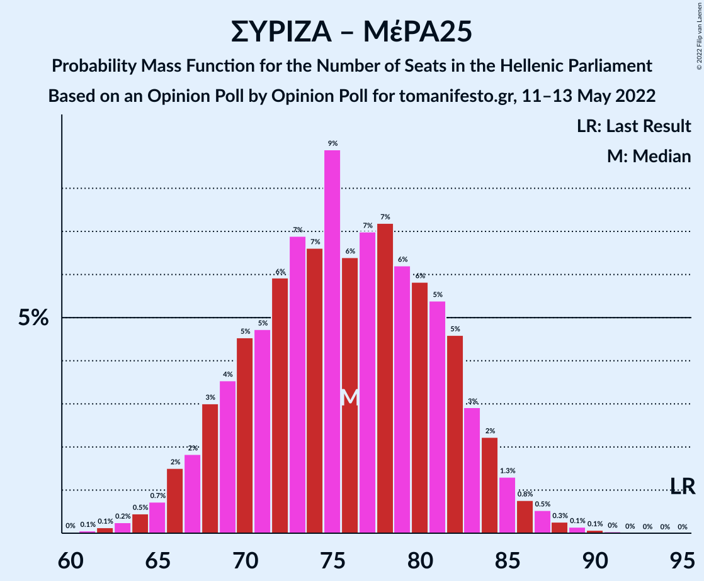

| Number of Seats | Probability | Accumulated | Special Marks |
|:---------------:|:-----------:|:-----------:|:-------------:|
| 61 | 0.1% | 100% |  |
| 62 | 0.1% | 99.9% |  |
| 63 | 0.2% | 99.8% |  |
| 64 | 0.5% | 99.5% |  |
| 65 | 0.7% | 99.1% |  |
| 66 | 2% | 98% |  |
| 67 | 2% | 97% |  |
| 68 | 3% | 95% |  |
| 69 | 4% | 92% |  |
| 70 | 5% | 88% |  |
| 71 | 5% | 84% |  |
| 72 | 6% | 79% |  |
| 73 | 7% | 73% |  |
| 74 | 7% | 66% |  |
| 75 | 9% | 60% |  |
| 76 | 6% | 51% |  |
| 77 | 7% | 44% |  |
| 78 | 7% | 37% |  |
| 79 | 6% | 30% | Median |
| 80 | 6% | 24% |  |
| 81 | 5% | 18% |  |
| 82 | 5% | 13% |  |
| 83 | 3% | 8% |  |
| 84 | 2% | 5% |  |
| 85 | 1.3% | 3% |  |
| 86 | 0.8% | 2% |  |
| 87 | 0.5% | 1.1% |  |
| 88 | 0.3% | 0.5% |  |
| 89 | 0.1% | 0.3% |  |
| 90 | 0.1% | 0.1% |  |
| 91 | 0% | 0.1% |  |
| 92 | 0% | 0% |  |
| 93 | 0% | 0% |  |
| 94 | 0% | 0% |  |
| 95 | 0% | 0% | Last Result |

### Συνασπισμός Ριζοσπαστικής Αριστεράς

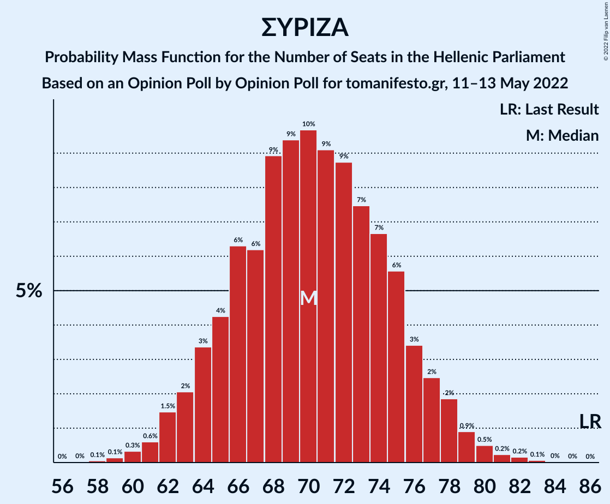

| Number of Seats | Probability | Accumulated | Special Marks |
|:---------------:|:-----------:|:-----------:|:-------------:|
| 58 | 0.1% | 100% |  |
| 59 | 0.1% | 99.9% |  |
| 60 | 0.3% | 99.8% |  |
| 61 | 0.6% | 99.4% |  |
| 62 | 1.5% | 98.8% |  |
| 63 | 2% | 97% |  |
| 64 | 3% | 95% |  |
| 65 | 4% | 92% |  |
| 66 | 6% | 88% |  |
| 67 | 6% | 81% |  |
| 68 | 9% | 75% |  |
| 69 | 9% | 66% |  |
| 70 | 10% | 57% | Median |
| 71 | 9% | 47% |  |
| 72 | 9% | 38% |  |
| 73 | 7% | 29% |  |
| 74 | 7% | 22% |  |
| 75 | 6% | 15% |  |
| 76 | 3% | 10% |  |
| 77 | 2% | 6% |  |
| 78 | 2% | 4% |  |
| 79 | 0.9% | 2% |  |
| 80 | 0.5% | 1.0% |  |
| 81 | 0.2% | 0.5% |  |
| 82 | 0.2% | 0.3% |  |
| 83 | 0.1% | 0.1% |  |
| 84 | 0% | 0% |  |
| 85 | 0% | 0% |  |
| 86 | 0% | 0% | Last Result |

## Technical Information

### Opinion Poll

+ **Polling firm:** Opinion Poll
+ **Commissioner(s):** tomanifesto.gr
+ **Fieldwork period:** 11–13 May 2022

### Calculations

+ **Sample size:** 1001
+ **Simulations done:** 1,048,576
+ **Error estimate:** 1.75%

