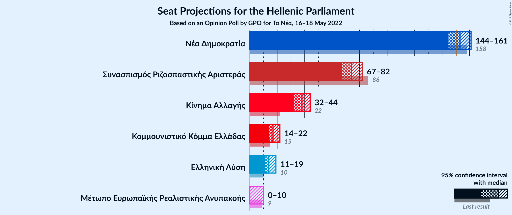

# Opinion Poll by GPO for Τα Νέα, 16–18 May 2022

<a href="#voting-intentions">Voting Intentions</a> | <a href="#seats">Seats</a> | <a href="#coalitions">Coalitions</a> | <a href="#technical-information">Technical Information</a>

## Voting Intentions

### Confidence Intervals

| Party | Last Result | Poll Result | 80% Confidence Interval | 90% Confidence Interval | 95% Confidence Interval | 99% Confidence Interval |
|:-----:|:-----------:|:-----------:|:-----------------------:|:-----------------------:|:-----------------------:|:-----------------------:|
| Νέα Δημοκρατία | 39.8% | 37.6% | 35.7–39.6% |35.1–40.2% |34.6–40.6% |33.7–41.6% |
| Συνασπισμός Ριζοσπαστικής Αριστεράς | 31.5% | 27.2% | 25.5–29.1% |25.0–29.6% |24.5–30.1% |23.7–31.0% |
| Κίνημα Αλλαγής | 8.1% | 13.8% | 12.5–15.3% |12.1–15.7% |11.8–16.1% |11.2–16.8% |
| Κομμουνιστικό Κόμμα Ελλάδας | 5.3% | 6.3% | 5.4–7.4% |5.2–7.7% |5.0–8.0% |4.6–8.6% |
| Ελληνική Λύση | 3.7% | 5.2% | 4.4–6.2% |4.2–6.5% |4.0–6.8% |3.6–7.3% |
| Μέτωπο Ευρωπαϊκής Ρεαλιστικής Ανυπακοής | 3.4% | 2.7% | 2.1–3.5% |2.0–3.7% |1.9–3.9% |1.6–4.3% |

*Note:* The poll result column reflects the actual value used in the calculations. Published results may vary slightly, and in addition be rounded to fewer digits.

## Seats

### Confidence Intervals

| Party | Last Result | Median | 80% Confidence Interval | 90% Confidence Interval | 95% Confidence Interval | 99% Confidence Interval |
|:-----:|:-----------:|:------:|:-----------------------:|:-----------------------:|:-----------------------:|:-----------------------:|
| <a href="#νέα-δημοκρατία">Νέα Δημοκρατία</a> | 158 | 153 | 147–159 |146–160 |144–161 |142–164 |
| <a href="#συνασπισμός-ριζοσπαστικής-αριστεράς">Συνασπισμός Ριζοσπαστικής Αριστεράς</a> | 86 | 74 | 69–80 |68–81 |67–82 |64–85 |
| <a href="#κίνημα-αλλαγής">Κίνημα Αλλαγής</a> | 22 | 38 | 34–42 |33–43 |32–44 |30–46 |
| <a href="#κομμουνιστικό-κόμμα-ελλάδας">Κομμουνιστικό Κόμμα Ελλάδας</a> | 15 | 17 | 15–20 |14–21 |14–22 |12–23 |
| <a href="#ελληνική-λύση">Ελληνική Λύση</a> | 10 | 14 | 12–17 |11–18 |11–19 |10–20 |
| <a href="#μέτωπο-ευρωπαϊκής-ρεαλιστικής-ανυπακοής">Μέτωπο Ευρωπαϊκής Ρεαλιστικής Ανυπακοής</a> | 9 | 0 | 0–9 |0–10 |0–10 |0–12 |

### Νέα Δημοκρατία

*For a full overview of the results for this party, see the [Νέα Δημοκρατία](party-νέαδημοκρατία.html) page.*

| Number of Seats | Probability | Accumulated | Special Marks |
|:---------------:|:-----------:|:-----------:|:-------------:|
| 139 | 0.1% | 100% |  |
| 140 | 0.1% | 99.9% |  |
| 141 | 0.2% | 99.8% |  |
| 142 | 0.5% | 99.5% |  |
| 143 | 0.8% | 99.1% |  |
| 144 | 1.2% | 98% |  |
| 145 | 2% | 97% |  |
| 146 | 3% | 95% |  |
| 147 | 4% | 92% |  |
| 148 | 5% | 88% |  |
| 149 | 6% | 84% |  |
| 150 | 7% | 77% |  |
| 151 | 8% | 70% | Majority |
| 152 | 9% | 62% |  |
| 153 | 9% | 53% | Median |
| 154 | 9% | 44% |  |
| 155 | 8% | 35% |  |
| 156 | 7% | 27% |  |
| 157 | 6% | 20% |  |
| 158 | 4% | 15% | Last Result |
| 159 | 3% | 10% |  |
| 160 | 3% | 7% |  |
| 161 | 2% | 4% |  |
| 162 | 0.9% | 2% |  |
| 163 | 0.6% | 1.4% |  |
| 164 | 0.4% | 0.8% |  |
| 165 | 0.2% | 0.4% |  |
| 166 | 0.1% | 0.2% |  |
| 167 | 0% | 0.1% |  |
| 168 | 0% | 0% |  |

### Συνασπισμός Ριζοσπαστικής Αριστεράς

*For a full overview of the results for this party, see the [Συνασπισμός Ριζοσπαστικής Αριστεράς](party-συνασπισμόςριζοσπαστικήςαριστεράς.html) page.*

| Number of Seats | Probability | Accumulated | Special Marks |
|:---------------:|:-----------:|:-----------:|:-------------:|
| 62 | 0.1% | 100% |  |
| 63 | 0.1% | 99.9% |  |
| 64 | 0.3% | 99.8% |  |
| 65 | 0.5% | 99.5% |  |
| 66 | 1.1% | 98.9% |  |
| 67 | 2% | 98% |  |
| 68 | 2% | 96% |  |
| 69 | 4% | 94% |  |
| 70 | 5% | 89% |  |
| 71 | 7% | 84% |  |
| 72 | 9% | 77% |  |
| 73 | 9% | 68% |  |
| 74 | 11% | 59% | Median |
| 75 | 9% | 48% |  |
| 76 | 9% | 39% |  |
| 77 | 8% | 30% |  |
| 78 | 6% | 22% |  |
| 79 | 6% | 16% |  |
| 80 | 3% | 10% |  |
| 81 | 3% | 7% |  |
| 82 | 2% | 4% |  |
| 83 | 1.1% | 2% |  |
| 84 | 0.6% | 1.3% |  |
| 85 | 0.3% | 0.6% |  |
| 86 | 0.2% | 0.3% | Last Result |
| 87 | 0.1% | 0.2% |  |
| 88 | 0% | 0.1% |  |
| 89 | 0% | 0% |  |

### Κίνημα Αλλαγής

*For a full overview of the results for this party, see the [Κίνημα Αλλαγής](party-κίνημααλλαγής.html) page.*

| Number of Seats | Probability | Accumulated | Special Marks |
|:---------------:|:-----------:|:-----------:|:-------------:|
| 22 | 0% | 100% | Last Result |
| 23 | 0% | 100% |  |
| 24 | 0% | 100% |  |
| 25 | 0% | 100% |  |
| 26 | 0% | 100% |  |
| 27 | 0% | 100% |  |
| 28 | 0% | 100% |  |
| 29 | 0.1% | 100% |  |
| 30 | 0.4% | 99.9% |  |
| 31 | 0.9% | 99.5% |  |
| 32 | 2% | 98.6% |  |
| 33 | 4% | 97% |  |
| 34 | 6% | 93% |  |
| 35 | 8% | 87% |  |
| 36 | 13% | 79% |  |
| 37 | 12% | 67% |  |
| 38 | 11% | 54% | Median |
| 39 | 14% | 43% |  |
| 40 | 9% | 29% |  |
| 41 | 7% | 19% |  |
| 42 | 6% | 13% |  |
| 43 | 3% | 7% |  |
| 44 | 1.4% | 3% |  |
| 45 | 1.2% | 2% |  |
| 46 | 0.5% | 0.8% |  |
| 47 | 0.2% | 0.3% |  |
| 48 | 0.1% | 0.2% |  |
| 49 | 0% | 0% |  |

### Κομμουνιστικό Κόμμα Ελλάδας

*For a full overview of the results for this party, see the [Κομμουνιστικό Κόμμα Ελλάδας](party-κομμουνιστικόκόμμαελλάδας.html) page.*

| Number of Seats | Probability | Accumulated | Special Marks |
|:---------------:|:-----------:|:-----------:|:-------------:|
| 11 | 0.1% | 100% |  |
| 12 | 0.5% | 99.9% |  |
| 13 | 2% | 99.5% |  |
| 14 | 5% | 98% |  |
| 15 | 11% | 92% | Last Result |
| 16 | 15% | 82% |  |
| 17 | 18% | 66% | Median |
| 18 | 17% | 48% |  |
| 19 | 15% | 31% |  |
| 20 | 9% | 17% |  |
| 21 | 5% | 8% |  |
| 22 | 2% | 3% |  |
| 23 | 0.9% | 1.3% |  |
| 24 | 0.3% | 0.5% |  |
| 25 | 0.1% | 0.1% |  |
| 26 | 0% | 0% |  |

### Ελληνική Λύση

*For a full overview of the results for this party, see the [Ελληνική Λύση](party-ελληνικήλύση.html) page.*

| Number of Seats | Probability | Accumulated | Special Marks |
|:---------------:|:-----------:|:-----------:|:-------------:|
| 9 | 0.2% | 100% |  |
| 10 | 1.1% | 99.8% | Last Result |
| 11 | 4% | 98.7% |  |
| 12 | 10% | 94% |  |
| 13 | 17% | 84% |  |
| 14 | 21% | 67% | Median |
| 15 | 18% | 47% |  |
| 16 | 14% | 29% |  |
| 17 | 8% | 15% |  |
| 18 | 4% | 7% |  |
| 19 | 2% | 3% |  |
| 20 | 0.6% | 0.9% |  |
| 21 | 0.2% | 0.3% |  |
| 22 | 0% | 0.1% |  |
| 23 | 0% | 0% |  |

### Μέτωπο Ευρωπαϊκής Ρεαλιστικής Ανυπακοής

*For a full overview of the results for this party, see the [Μέτωπο Ευρωπαϊκής Ρεαλιστικής Ανυπακοής](party-μέτωποευρωπαϊκήςρεαλιστικήςανυπακοής.html) page.*

| Number of Seats | Probability | Accumulated | Special Marks |
|:---------------:|:-----------:|:-----------:|:-------------:|
| 0 | 68% | 100% | Median |
| 1 | 0% | 32% |  |
| 2 | 0% | 32% |  |
| 3 | 0% | 32% |  |
| 4 | 0% | 32% |  |
| 5 | 0% | 32% |  |
| 6 | 0% | 32% |  |
| 7 | 0% | 32% |  |
| 8 | 9% | 32% |  |
| 9 | 15% | 23% | Last Result |
| 10 | 6% | 8% |  |
| 11 | 2% | 2% |  |
| 12 | 0.5% | 0.6% |  |
| 13 | 0.1% | 0.1% |  |
| 14 | 0% | 0% |  |

## Coalitions

### Confidence Intervals

| Coalition | Last Result | Median | Majority? | 80% Confidence Interval | 90% Confidence Interval | 95% Confidence Interval | 99% Confidence Interval |
|:---------:|:-----------:|:------:|:---------:|:-----------------------:|:-----------------------:|:-----------------------:|:-----------------------:|
| Νέα Δημοκρατία – Κίνημα Αλλαγής | 180 | 191 | 100% | 184–197 | 183–198 | 181–200 | 178–202 |
| Νέα Δημοκρατία | 158 | 153 | 70% | 147–159 | 146–160 | 144–161 | 142–164 |
| Συνασπισμός Ριζοσπαστικής Αριστεράς – Μέτωπο Ευρωπαϊκής Ρεαλιστικής Ανυπακοής | 95 | 77 | 0% | 71–84 | 70–85 | 69–87 | 66–90 |
| Συνασπισμός Ριζοσπαστικής Αριστεράς | 86 | 74 | 0% | 69–80 | 68–81 | 67–82 | 64–85 |

### Νέα Δημοκρατία – Κίνημα Αλλαγής

| Number of Seats | Probability | Accumulated | Special Marks |
|:---------------:|:-----------:|:-----------:|:-------------:|
| 175 | 0% | 100% |  |
| 176 | 0.1% | 99.9% |  |
| 177 | 0.2% | 99.9% |  |
| 178 | 0.3% | 99.7% |  |
| 179 | 0.4% | 99.5% |  |
| 180 | 0.9% | 99.1% | Last Result |
| 181 | 1.1% | 98% |  |
| 182 | 1.3% | 97% |  |
| 183 | 3% | 96% |  |
| 184 | 3% | 93% |  |
| 185 | 3% | 90% |  |
| 186 | 5% | 86% |  |
| 187 | 6% | 81% |  |
| 188 | 7% | 75% |  |
| 189 | 7% | 68% |  |
| 190 | 8% | 61% |  |
| 191 | 9% | 53% | Median |
| 192 | 8% | 44% |  |
| 193 | 7% | 36% |  |
| 194 | 8% | 30% |  |
| 195 | 6% | 21% |  |
| 196 | 4% | 16% |  |
| 197 | 4% | 12% |  |
| 198 | 3% | 8% |  |
| 199 | 2% | 5% |  |
| 200 | 1.2% | 3% |  |
| 201 | 0.8% | 2% |  |
| 202 | 0.4% | 0.9% |  |
| 203 | 0.2% | 0.5% |  |
| 204 | 0.1% | 0.2% |  |
| 205 | 0.1% | 0.1% |  |
| 206 | 0% | 0% |  |

### Νέα Δημοκρατία

| Number of Seats | Probability | Accumulated | Special Marks |
|:---------------:|:-----------:|:-----------:|:-------------:|
| 139 | 0.1% | 100% |  |
| 140 | 0.1% | 99.9% |  |
| 141 | 0.2% | 99.8% |  |
| 142 | 0.5% | 99.5% |  |
| 143 | 0.8% | 99.1% |  |
| 144 | 1.2% | 98% |  |
| 145 | 2% | 97% |  |
| 146 | 3% | 95% |  |
| 147 | 4% | 92% |  |
| 148 | 5% | 88% |  |
| 149 | 6% | 84% |  |
| 150 | 7% | 77% |  |
| 151 | 8% | 70% | Majority |
| 152 | 9% | 62% |  |
| 153 | 9% | 53% | Median |
| 154 | 9% | 44% |  |
| 155 | 8% | 35% |  |
| 156 | 7% | 27% |  |
| 157 | 6% | 20% |  |
| 158 | 4% | 15% | Last Result |
| 159 | 3% | 10% |  |
| 160 | 3% | 7% |  |
| 161 | 2% | 4% |  |
| 162 | 0.9% | 2% |  |
| 163 | 0.6% | 1.4% |  |
| 164 | 0.4% | 0.8% |  |
| 165 | 0.2% | 0.4% |  |
| 166 | 0.1% | 0.2% |  |
| 167 | 0% | 0.1% |  |
| 168 | 0% | 0% |  |

### Συνασπισμός Ριζοσπαστικής Αριστεράς – Μέτωπο Ευρωπαϊκής Ρεαλιστικής Ανυπακοής

| Number of Seats | Probability | Accumulated | Special Marks |
|:---------------:|:-----------:|:-----------:|:-------------:|
| 64 | 0.1% | 100% |  |
| 65 | 0.2% | 99.9% |  |
| 66 | 0.3% | 99.7% |  |
| 67 | 0.7% | 99.4% |  |
| 68 | 1.0% | 98.7% |  |
| 69 | 2% | 98% |  |
| 70 | 3% | 96% |  |
| 71 | 4% | 93% |  |
| 72 | 5% | 89% |  |
| 73 | 6% | 84% |  |
| 74 | 8% | 78% | Median |
| 75 | 7% | 69% |  |
| 76 | 7% | 62% |  |
| 77 | 8% | 55% |  |
| 78 | 7% | 47% |  |
| 79 | 8% | 40% |  |
| 80 | 6% | 32% |  |
| 81 | 5% | 26% |  |
| 82 | 6% | 21% |  |
| 83 | 4% | 15% |  |
| 84 | 4% | 12% |  |
| 85 | 3% | 8% |  |
| 86 | 2% | 5% |  |
| 87 | 1.4% | 3% |  |
| 88 | 0.7% | 2% |  |
| 89 | 0.6% | 1.2% |  |
| 90 | 0.3% | 0.6% |  |
| 91 | 0.1% | 0.3% |  |
| 92 | 0.1% | 0.2% |  |
| 93 | 0% | 0.1% |  |
| 94 | 0% | 0% |  |
| 95 | 0% | 0% | Last Result |

### Συνασπισμός Ριζοσπαστικής Αριστεράς

| Number of Seats | Probability | Accumulated | Special Marks |
|:---------------:|:-----------:|:-----------:|:-------------:|
| 62 | 0.1% | 100% |  |
| 63 | 0.1% | 99.9% |  |
| 64 | 0.3% | 99.8% |  |
| 65 | 0.5% | 99.5% |  |
| 66 | 1.1% | 98.9% |  |
| 67 | 2% | 98% |  |
| 68 | 2% | 96% |  |
| 69 | 4% | 94% |  |
| 70 | 5% | 89% |  |
| 71 | 7% | 84% |  |
| 72 | 9% | 77% |  |
| 73 | 9% | 68% |  |
| 74 | 11% | 59% | Median |
| 75 | 9% | 48% |  |
| 76 | 9% | 39% |  |
| 77 | 8% | 30% |  |
| 78 | 6% | 22% |  |
| 79 | 6% | 16% |  |
| 80 | 3% | 10% |  |
| 81 | 3% | 7% |  |
| 82 | 2% | 4% |  |
| 83 | 1.1% | 2% |  |
| 84 | 0.6% | 1.3% |  |
| 85 | 0.3% | 0.6% |  |
| 86 | 0.2% | 0.3% | Last Result |
| 87 | 0.1% | 0.2% |  |
| 88 | 0% | 0.1% |  |
| 89 | 0% | 0% |  |

## Technical Information

### Opinion Poll

+ **Polling firm:** GPO
+ **Commissioner(s):** Τα Νέα
+ **Fieldwork period:** 16–18 May 2022

### Calculations

+ **Sample size:** 1000
+ **Simulations done:** 1,048,576
+ **Error estimate:** 0.62%

