# Opinion Poll by MRB for Newsbomb, 16–18 May 2022

<a href="#voting-intentions">Voting Intentions</a> | <a href="#seats">Seats</a> | <a href="#coalitions">Coalitions</a> | <a href="#technical-information">Technical Information</a>

## Voting Intentions

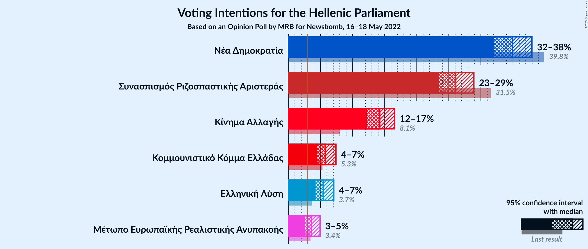

### Confidence Intervals

| Party | Last Result | Poll Result | 80% Confidence Interval | 90% Confidence Interval | 95% Confidence Interval | 99% Confidence Interval |
|:-----:|:-----------:|:-----------:|:-----------------------:|:-----------------------:|:-----------------------:|:-----------------------:|
| Νέα Δημοκρατία | 39.8% | 35.0% | 33.1–36.9% |32.5–37.5% |32.1–38.0% |31.2–38.9% |
| Συνασπισμός Ριζοσπαστικής Αριστεράς | 31.5% | 26.1% | 24.4–27.9% |23.9–28.5% |23.5–28.9% |22.7–29.8% |
| Κίνημα Αλλαγής | 8.1% | 14.2% | 12.9–15.7% |12.5–16.2% |12.2–16.6% |11.6–17.3% |
| Κομμουνιστικό Κόμμα Ελλάδας | 5.3% | 5.8% | 4.9–6.8% |4.7–7.1% |4.5–7.4% |4.1–7.9% |
| Ελληνική Λύση | 3.7% | 5.5% | 4.6–6.5% |4.4–6.8% |4.2–7.1% |3.9–7.6% |
| Μέτωπο Ευρωπαϊκής Ρεαλιστικής Ανυπακοής | 3.4% | 3.6% | 2.9–4.5% |2.7–4.7% |2.6–4.9% |2.3–5.4% |

*Note:* The poll result column reflects the actual value used in the calculations. Published results may vary slightly, and in addition be rounded to fewer digits.

## Seats

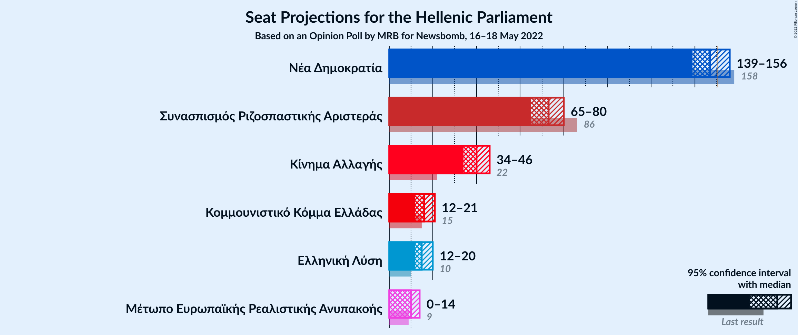

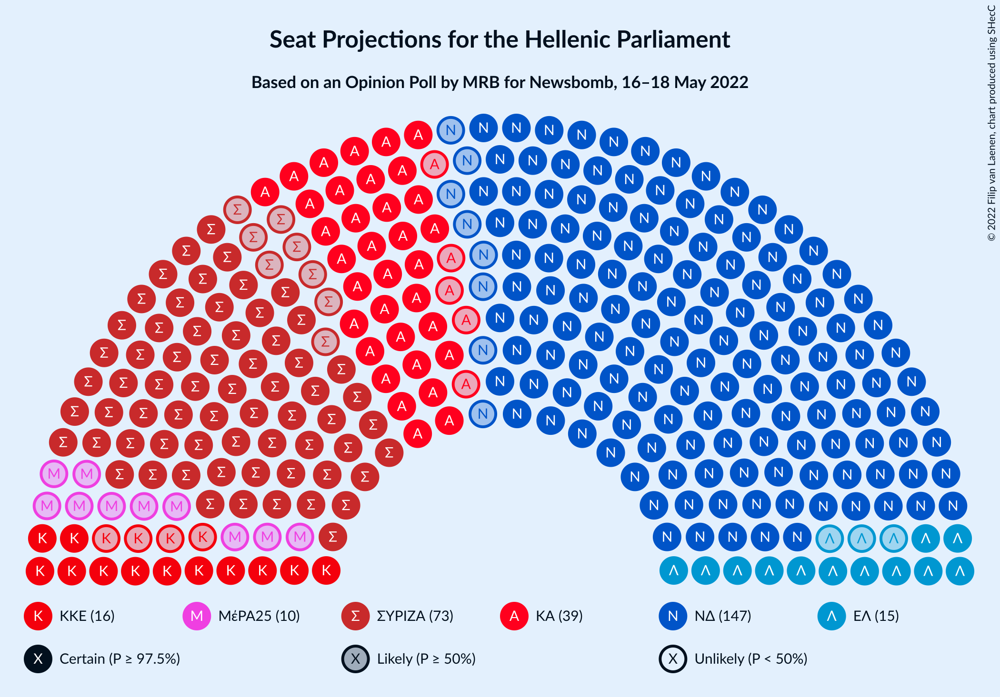

### Confidence Intervals

| Party | Last Result | Median | 80% Confidence Interval | 90% Confidence Interval | 95% Confidence Interval | 99% Confidence Interval |
|:-----:|:-----------:|:------:|:-----------------------:|:-----------------------:|:-----------------------:|:-----------------------:|
| <a href="#νέα-δημοκρατία">Νέα Δημοκρατία</a> | 158 | 147 | 141–152 |140–154 |139–156 |136–158 |
| <a href="#συνασπισμός-ριζοσπαστικής-αριστεράς">Συνασπισμός Ριζοσπαστικής Αριστεράς</a> | 86 | 73 | 68–78 |66–79 |65–80 |63–83 |
| <a href="#κίνημα-αλλαγής">Κίνημα Αλλαγής</a> | 22 | 40 | 35–44 |34–45 |34–46 |32–48 |
| <a href="#κομμουνιστικό-κόμμα-ελλάδας">Κομμουνιστικό Κόμμα Ελλάδας</a> | 15 | 16 | 14–19 |13–20 |12–21 |11–22 |
| <a href="#ελληνική-λύση">Ελληνική Λύση</a> | 10 | 15 | 13–18 |12–19 |12–20 |11–21 |
| <a href="#μέτωπο-ευρωπαϊκής-ρεαλιστικής-ανυπακοής">Μέτωπο Ευρωπαϊκής Ρεαλιστικής Ανυπακοής</a> | 9 | 10 | 0–12 |0–13 |0–14 |0–15 |

### Νέα Δημοκρατία

*For a full overview of the results for this party, see the [Νέα Δημοκρατία](party-νέαδημοκρατία.html) page.*

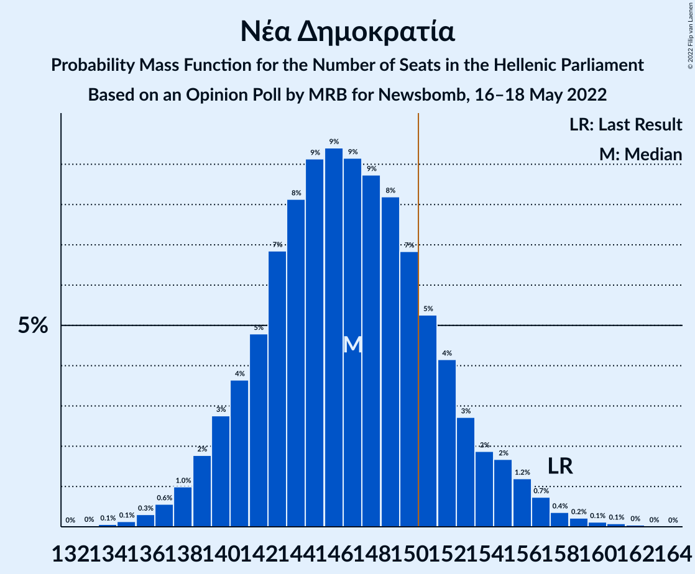

| Number of Seats | Probability | Accumulated | Special Marks |
|:---------------:|:-----------:|:-----------:|:-------------:|
| 133 | 0% | 100% |  |
| 134 | 0.1% | 99.9% |  |
| 135 | 0.1% | 99.9% |  |
| 136 | 0.3% | 99.8% |  |
| 137 | 0.6% | 99.4% |  |
| 138 | 1.0% | 98.9% |  |
| 139 | 2% | 98% |  |
| 140 | 3% | 96% |  |
| 141 | 4% | 93% |  |
| 142 | 5% | 90% |  |
| 143 | 7% | 85% |  |
| 144 | 8% | 78% |  |
| 145 | 9% | 70% |  |
| 146 | 9% | 61% |  |
| 147 | 9% | 51% | Median |
| 148 | 9% | 42% |  |
| 149 | 8% | 34% |  |
| 150 | 7% | 25% |  |
| 151 | 5% | 18% | Majority |
| 152 | 4% | 13% |  |
| 153 | 3% | 9% |  |
| 154 | 2% | 6% |  |
| 155 | 2% | 4% |  |
| 156 | 1.2% | 3% |  |
| 157 | 0.7% | 2% |  |
| 158 | 0.4% | 0.9% | Last Result |
| 159 | 0.2% | 0.5% |  |
| 160 | 0.1% | 0.3% |  |
| 161 | 0.1% | 0.2% |  |
| 162 | 0% | 0.1% |  |
| 163 | 0% | 0% |  |

### Συνασπισμός Ριζοσπαστικής Αριστεράς

*For a full overview of the results for this party, see the [Συνασπισμός Ριζοσπαστικής Αριστεράς](party-συνασπισμόςριζοσπαστικήςαριστεράς.html) page.*

| Number of Seats | Probability | Accumulated | Special Marks |
|:---------------:|:-----------:|:-----------:|:-------------:|
| 60 | 0% | 100% |  |
| 61 | 0.1% | 99.9% |  |
| 62 | 0.1% | 99.8% |  |
| 63 | 0.7% | 99.7% |  |
| 64 | 0.8% | 99.0% |  |
| 65 | 1.4% | 98% |  |
| 66 | 4% | 97% |  |
| 67 | 2% | 93% |  |
| 68 | 7% | 91% |  |
| 69 | 7% | 84% |  |
| 70 | 6% | 77% |  |
| 71 | 14% | 71% |  |
| 72 | 6% | 58% |  |
| 73 | 13% | 52% | Median |
| 74 | 10% | 39% |  |
| 75 | 6% | 29% |  |
| 76 | 8% | 23% |  |
| 77 | 4% | 14% |  |
| 78 | 4% | 10% |  |
| 79 | 3% | 7% |  |
| 80 | 1.3% | 4% |  |
| 81 | 1.1% | 2% |  |
| 82 | 0.6% | 1.2% |  |
| 83 | 0.2% | 0.6% |  |
| 84 | 0.2% | 0.4% |  |
| 85 | 0.1% | 0.2% |  |
| 86 | 0% | 0.1% | Last Result |
| 87 | 0% | 0% |  |

### Κίνημα Αλλαγής

*For a full overview of the results for this party, see the [Κίνημα Αλλαγής](party-κίνημααλλαγής.html) page.*

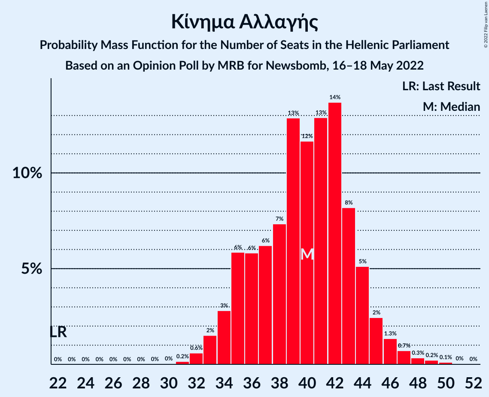

| Number of Seats | Probability | Accumulated | Special Marks |
|:---------------:|:-----------:|:-----------:|:-------------:|
| 22 | 0% | 100% | Last Result |
| 23 | 0% | 100% |  |
| 24 | 0% | 100% |  |
| 25 | 0% | 100% |  |
| 26 | 0% | 100% |  |
| 27 | 0% | 100% |  |
| 28 | 0% | 100% |  |
| 29 | 0% | 100% |  |
| 30 | 0% | 100% |  |
| 31 | 0.2% | 99.9% |  |
| 32 | 0.6% | 99.8% |  |
| 33 | 2% | 99.2% |  |
| 34 | 3% | 98% |  |
| 35 | 6% | 95% |  |
| 36 | 6% | 89% |  |
| 37 | 6% | 83% |  |
| 38 | 7% | 77% |  |
| 39 | 13% | 70% |  |
| 40 | 12% | 57% | Median |
| 41 | 13% | 45% |  |
| 42 | 14% | 32% |  |
| 43 | 8% | 19% |  |
| 44 | 5% | 10% |  |
| 45 | 2% | 5% |  |
| 46 | 1.3% | 3% |  |
| 47 | 0.7% | 1.4% |  |
| 48 | 0.3% | 0.7% |  |
| 49 | 0.2% | 0.4% |  |
| 50 | 0.1% | 0.2% |  |
| 51 | 0% | 0.1% |  |
| 52 | 0% | 0% |  |

### Κομμουνιστικό Κόμμα Ελλάδας

*For a full overview of the results for this party, see the [Κομμουνιστικό Κόμμα Ελλάδας](party-κομμουνιστικόκόμμαελλάδας.html) page.*

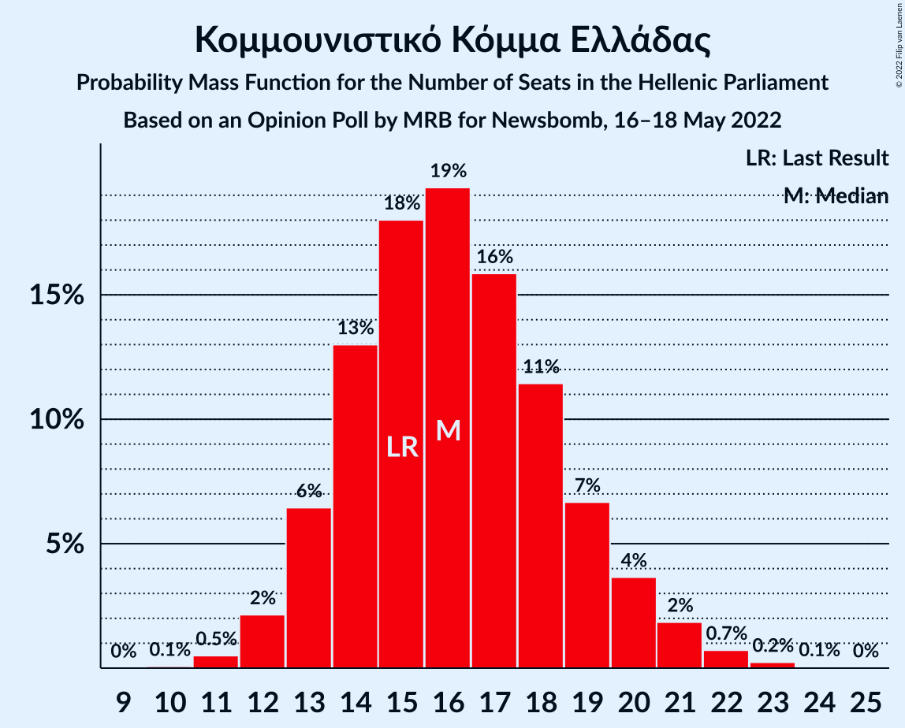

| Number of Seats | Probability | Accumulated | Special Marks |
|:---------------:|:-----------:|:-----------:|:-------------:|
| 10 | 0.1% | 100% |  |
| 11 | 0.5% | 99.9% |  |
| 12 | 2% | 99.4% |  |
| 13 | 6% | 97% |  |
| 14 | 13% | 91% |  |
| 15 | 18% | 78% | Last Result |
| 16 | 19% | 60% | Median |
| 17 | 16% | 41% |  |
| 18 | 11% | 25% |  |
| 19 | 7% | 13% |  |
| 20 | 4% | 7% |  |
| 21 | 2% | 3% |  |
| 22 | 0.7% | 1.0% |  |
| 23 | 0.2% | 0.3% |  |
| 24 | 0.1% | 0.1% |  |
| 25 | 0% | 0% |  |

### Ελληνική Λύση

*For a full overview of the results for this party, see the [Ελληνική Λύση](party-ελληνικήλύση.html) page.*

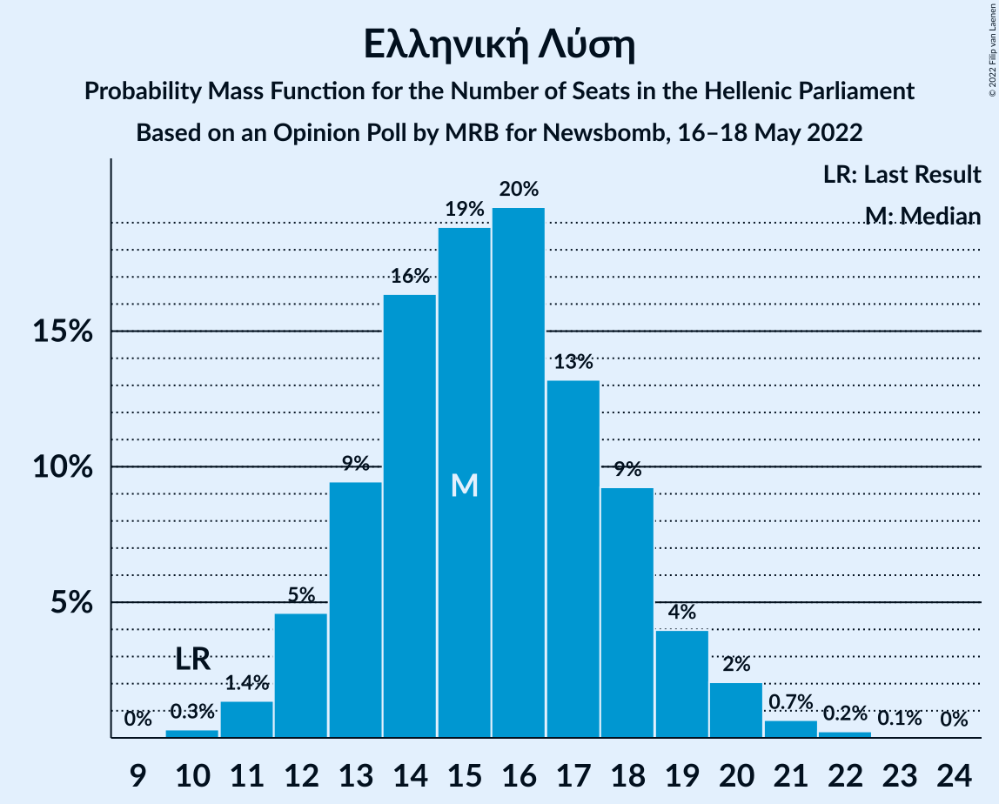

| Number of Seats | Probability | Accumulated | Special Marks |
|:---------------:|:-----------:|:-----------:|:-------------:|
| 10 | 0.3% | 100% | Last Result |
| 11 | 1.4% | 99.7% |  |
| 12 | 5% | 98% |  |
| 13 | 9% | 94% |  |
| 14 | 16% | 84% |  |
| 15 | 19% | 68% | Median |
| 16 | 20% | 49% |  |
| 17 | 13% | 29% |  |
| 18 | 9% | 16% |  |
| 19 | 4% | 7% |  |
| 20 | 2% | 3% |  |
| 21 | 0.7% | 1.0% |  |
| 22 | 0.2% | 0.3% |  |
| 23 | 0.1% | 0.1% |  |
| 24 | 0% | 0% |  |

### Μέτωπο Ευρωπαϊκής Ρεαλιστικής Ανυπακοής

*For a full overview of the results for this party, see the [Μέτωπο Ευρωπαϊκής Ρεαλιστικής Ανυπακοής](party-μέτωποευρωπαϊκήςρεαλιστικήςανυπακοής.html) page.*

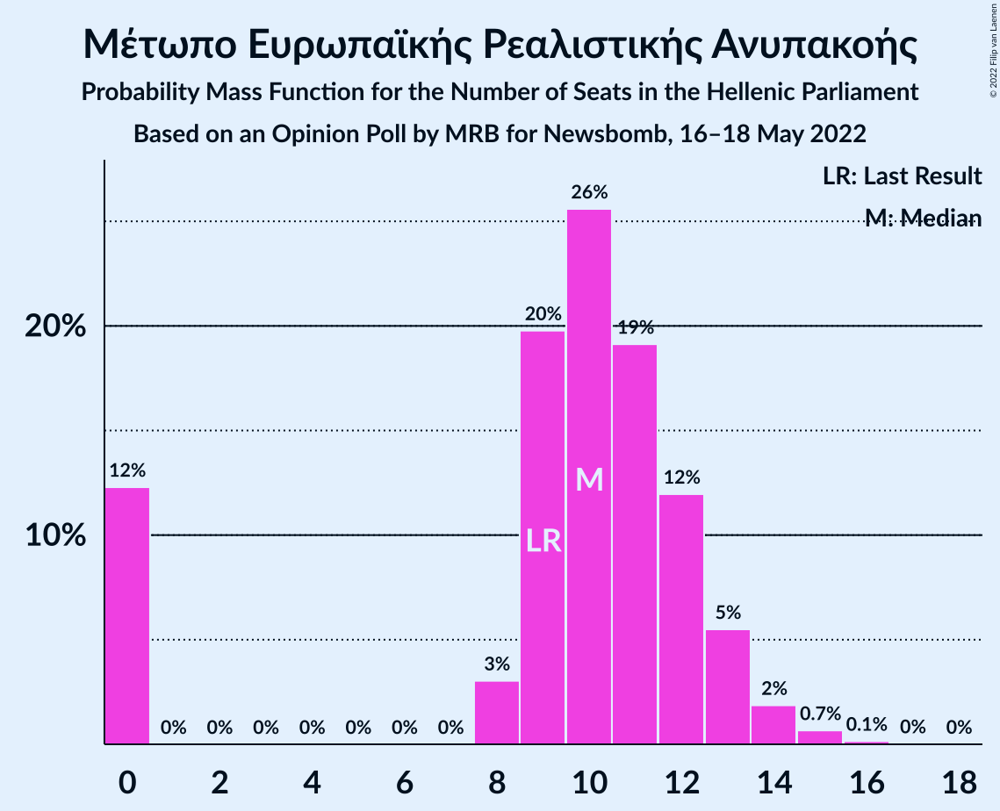

| Number of Seats | Probability | Accumulated | Special Marks |
|:---------------:|:-----------:|:-----------:|:-------------:|
| 0 | 12% | 100% |  |
| 1 | 0% | 88% |  |
| 2 | 0% | 88% |  |
| 3 | 0% | 88% |  |
| 4 | 0% | 88% |  |
| 5 | 0% | 88% |  |
| 6 | 0% | 88% |  |
| 7 | 0% | 88% |  |
| 8 | 3% | 88% |  |
| 9 | 20% | 85% | Last Result |
| 10 | 26% | 65% | Median |
| 11 | 19% | 39% |  |
| 12 | 12% | 20% |  |
| 13 | 5% | 8% |  |
| 14 | 2% | 3% |  |
| 15 | 0.7% | 0.9% |  |
| 16 | 0.1% | 0.2% |  |
| 17 | 0% | 0% |  |

## Coalitions

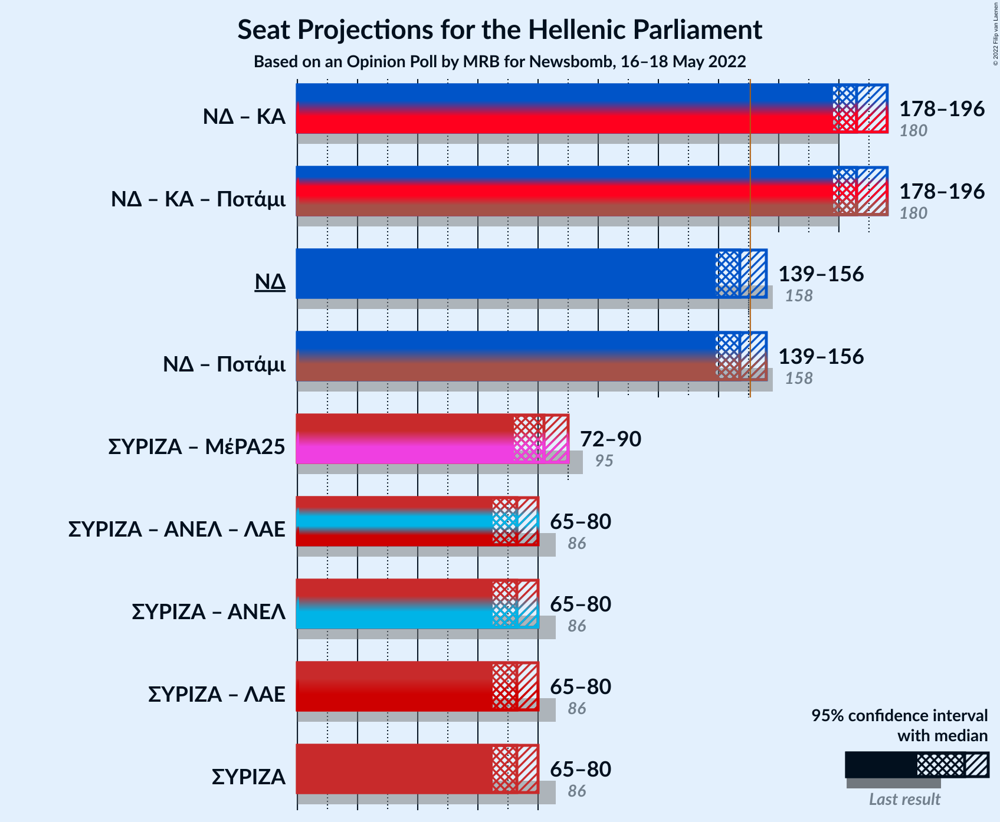

### Confidence Intervals

| Coalition | Last Result | Median | Majority? | 80% Confidence Interval | 90% Confidence Interval | 95% Confidence Interval | 99% Confidence Interval |
|:---------:|:-----------:|:------:|:---------:|:-----------------------:|:-----------------------:|:-----------------------:|:-----------------------:|
| Νέα Δημοκρατία – Κίνημα Αλλαγής | 180 | 186 | 100% | 181–193 | 179–195 | 178–196 | 176–199 |
| Νέα Δημοκρατία | 158 | 147 | 18% | 141–152 | 140–154 | 139–156 | 136–158 |
| Συνασπισμός Ριζοσπαστικής Αριστεράς – Μέτωπο Ευρωπαϊκής Ρεαλιστικής Ανυπακοής | 95 | 82 | 0% | 76–87 | 73–89 | 72–90 | 68–92 |
| Συνασπισμός Ριζοσπαστικής Αριστεράς | 86 | 73 | 0% | 68–78 | 66–79 | 65–80 | 63–83 |

### Νέα Δημοκρατία – Κίνημα Αλλαγής

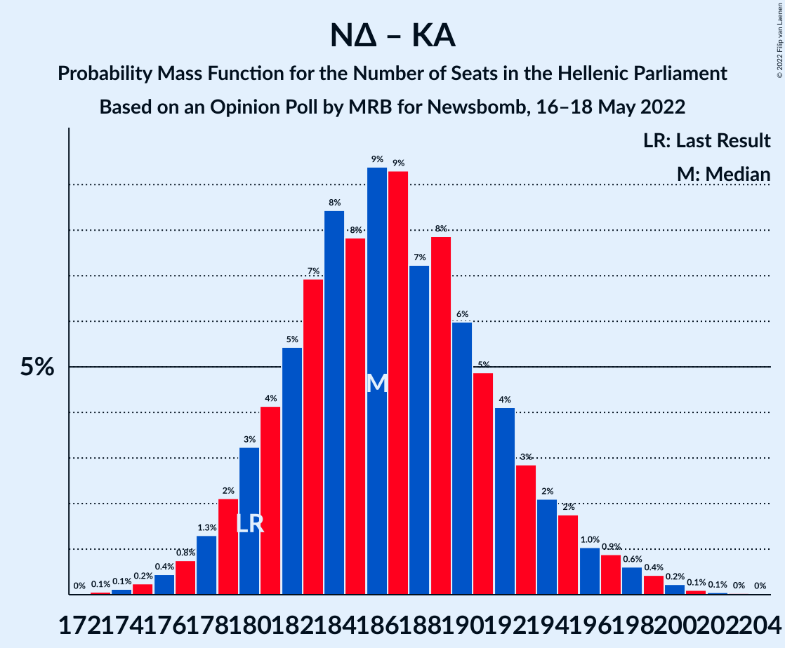

| Number of Seats | Probability | Accumulated | Special Marks |
|:---------------:|:-----------:|:-----------:|:-------------:|
| 172 | 0% | 100% |  |
| 173 | 0.1% | 99.9% |  |
| 174 | 0.1% | 99.9% |  |
| 175 | 0.2% | 99.8% |  |
| 176 | 0.4% | 99.5% |  |
| 177 | 0.8% | 99.1% |  |
| 178 | 1.3% | 98% |  |
| 179 | 2% | 97% |  |
| 180 | 3% | 95% | Last Result |
| 181 | 4% | 92% |  |
| 182 | 5% | 88% |  |
| 183 | 7% | 82% |  |
| 184 | 8% | 75% |  |
| 185 | 8% | 67% |  |
| 186 | 9% | 59% |  |
| 187 | 9% | 50% | Median |
| 188 | 7% | 40% |  |
| 189 | 8% | 33% |  |
| 190 | 6% | 25% |  |
| 191 | 5% | 19% |  |
| 192 | 4% | 14% |  |
| 193 | 3% | 10% |  |
| 194 | 2% | 7% |  |
| 195 | 2% | 5% |  |
| 196 | 1.0% | 3% |  |
| 197 | 0.9% | 2% |  |
| 198 | 0.6% | 1.5% |  |
| 199 | 0.4% | 0.9% |  |
| 200 | 0.2% | 0.5% |  |
| 201 | 0.1% | 0.2% |  |
| 202 | 0.1% | 0.1% |  |
| 203 | 0% | 0.1% |  |
| 204 | 0% | 0% |  |

### Νέα Δημοκρατία

| Number of Seats | Probability | Accumulated | Special Marks |
|:---------------:|:-----------:|:-----------:|:-------------:|
| 133 | 0% | 100% |  |
| 134 | 0.1% | 99.9% |  |
| 135 | 0.1% | 99.9% |  |
| 136 | 0.3% | 99.8% |  |
| 137 | 0.6% | 99.4% |  |
| 138 | 1.0% | 98.9% |  |
| 139 | 2% | 98% |  |
| 140 | 3% | 96% |  |
| 141 | 4% | 93% |  |
| 142 | 5% | 90% |  |
| 143 | 7% | 85% |  |
| 144 | 8% | 78% |  |
| 145 | 9% | 70% |  |
| 146 | 9% | 61% |  |
| 147 | 9% | 51% | Median |
| 148 | 9% | 42% |  |
| 149 | 8% | 34% |  |
| 150 | 7% | 25% |  |
| 151 | 5% | 18% | Majority |
| 152 | 4% | 13% |  |
| 153 | 3% | 9% |  |
| 154 | 2% | 6% |  |
| 155 | 2% | 4% |  |
| 156 | 1.2% | 3% |  |
| 157 | 0.7% | 2% |  |
| 158 | 0.4% | 0.9% | Last Result |
| 159 | 0.2% | 0.5% |  |
| 160 | 0.1% | 0.3% |  |
| 161 | 0.1% | 0.2% |  |
| 162 | 0% | 0.1% |  |
| 163 | 0% | 0% |  |

### Συνασπισμός Ριζοσπαστικής Αριστεράς – Μέτωπο Ευρωπαϊκής Ρεαλιστικής Ανυπακοής

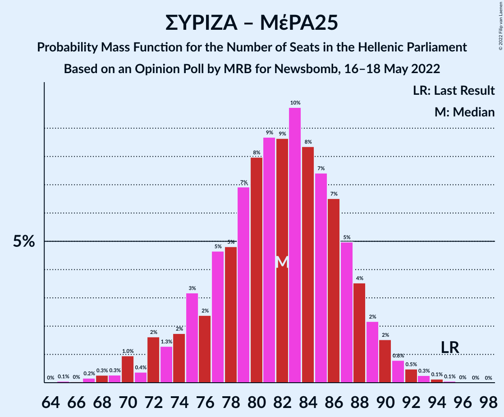

| Number of Seats | Probability | Accumulated | Special Marks |
|:---------------:|:-----------:|:-----------:|:-------------:|
| 65 | 0.1% | 100% |  |
| 66 | 0% | 99.9% |  |
| 67 | 0.2% | 99.9% |  |
| 68 | 0.3% | 99.7% |  |
| 69 | 0.3% | 99.5% |  |
| 70 | 1.0% | 99.2% |  |
| 71 | 0.4% | 98% |  |
| 72 | 2% | 98% |  |
| 73 | 1.3% | 96% |  |
| 74 | 2% | 95% |  |
| 75 | 3% | 93% |  |
| 76 | 2% | 90% |  |
| 77 | 5% | 88% |  |
| 78 | 5% | 83% |  |
| 79 | 7% | 78% |  |
| 80 | 8% | 71% |  |
| 81 | 9% | 63% |  |
| 82 | 9% | 55% |  |
| 83 | 10% | 46% | Median |
| 84 | 8% | 36% |  |
| 85 | 7% | 28% |  |
| 86 | 7% | 20% |  |
| 87 | 5% | 14% |  |
| 88 | 4% | 9% |  |
| 89 | 2% | 5% |  |
| 90 | 2% | 3% |  |
| 91 | 0.8% | 2% |  |
| 92 | 0.5% | 1.0% |  |
| 93 | 0.3% | 0.5% |  |
| 94 | 0.1% | 0.2% |  |
| 95 | 0.1% | 0.1% | Last Result |
| 96 | 0% | 0.1% |  |
| 97 | 0% | 0% |  |

### Συνασπισμός Ριζοσπαστικής Αριστεράς

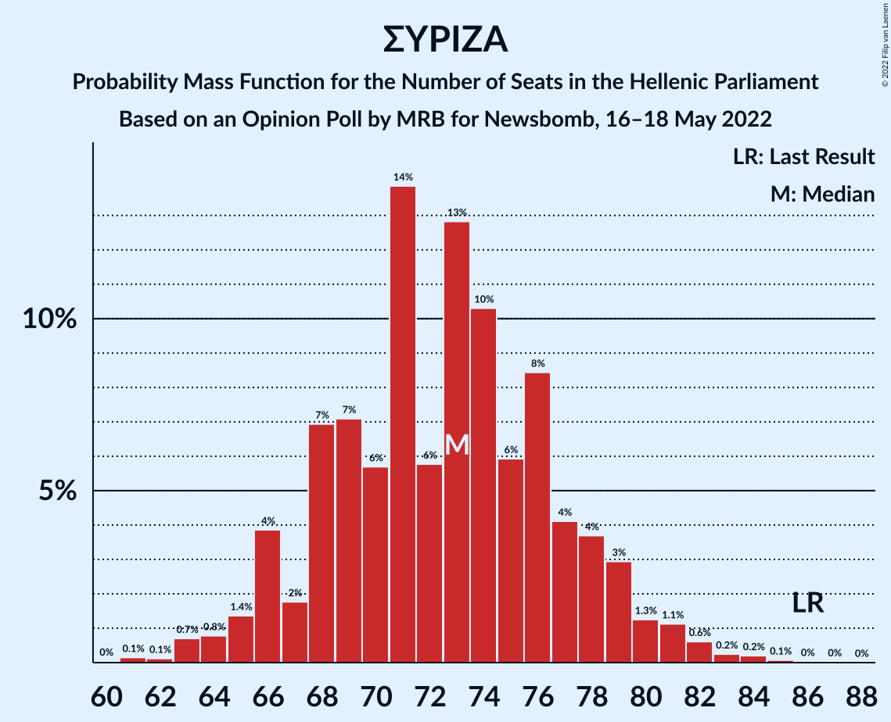

| Number of Seats | Probability | Accumulated | Special Marks |
|:---------------:|:-----------:|:-----------:|:-------------:|
| 60 | 0% | 100% |  |
| 61 | 0.1% | 99.9% |  |
| 62 | 0.1% | 99.8% |  |
| 63 | 0.7% | 99.7% |  |
| 64 | 0.8% | 99.0% |  |
| 65 | 1.4% | 98% |  |
| 66 | 4% | 97% |  |
| 67 | 2% | 93% |  |
| 68 | 7% | 91% |  |
| 69 | 7% | 84% |  |
| 70 | 6% | 77% |  |
| 71 | 14% | 71% |  |
| 72 | 6% | 58% |  |
| 73 | 13% | 52% | Median |
| 74 | 10% | 39% |  |
| 75 | 6% | 29% |  |
| 76 | 8% | 23% |  |
| 77 | 4% | 14% |  |
| 78 | 4% | 10% |  |
| 79 | 3% | 7% |  |
| 80 | 1.3% | 4% |  |
| 81 | 1.1% | 2% |  |
| 82 | 0.6% | 1.2% |  |
| 83 | 0.2% | 0.6% |  |
| 84 | 0.2% | 0.4% |  |
| 85 | 0.1% | 0.2% |  |
| 86 | 0% | 0.1% | Last Result |
| 87 | 0% | 0% |  |

## Technical Information

### Opinion Poll

+ **Polling firm:** MRB
+ **Commissioner(s):** Newsbomb
+ **Fieldwork period:** 16–18 May 2022

### Calculations

+ **Sample size:** 1004
+ **Simulations done:** 1,048,576
+ **Error estimate:** 0.96%

