# Opinion Poll by Alco for Open TV, 23–28 May 2022

<a href="#voting-intentions">Voting Intentions</a> | <a href="#seats">Seats</a> | <a href="#coalitions">Coalitions</a> | <a href="#technical-information">Technical Information</a>

## Voting Intentions

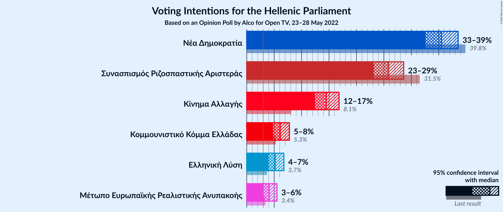

### Confidence Intervals

| Party | Last Result | Poll Result | 80% Confidence Interval | 90% Confidence Interval | 95% Confidence Interval | 99% Confidence Interval |
|:-----:|:-----------:|:-----------:|:-----------------------:|:-----------------------:|:-----------------------:|:-----------------------:|
| Νέα Δημοκρατία | 39.8% | 35.5% | 33.6–37.5% |33.1–38.0% |32.6–38.5% |31.7–39.5% |
| Συνασπισμός Ριζοσπαστικής Αριστεράς | 31.5% | 25.8% | 24.1–27.6% |23.6–28.2% |23.2–28.6% |22.4–29.5% |
| Κίνημα Αλλαγής | 8.1% | 14.5% | 13.2–16.0% |12.8–16.4% |12.5–16.8% |11.8–17.6% |
| Κομμουνιστικό Κόμμα Ελλάδας | 5.3% | 6.1% | 5.2–7.2% |5.0–7.5% |4.8–7.8% |4.4–8.3% |
| Ελληνική Λύση | 3.7% | 5.2% | 4.4–6.2% |4.2–6.5% |4.0–6.8% |3.6–7.3% |
| Μέτωπο Ευρωπαϊκής Ρεαλιστικής Ανυπακοής | 3.4% | 4.1% | 3.4–5.0% |3.2–5.3% |3.0–5.5% |2.7–6.0% |

*Note:* The poll result column reflects the actual value used in the calculations. Published results may vary slightly, and in addition be rounded to fewer digits.

## Seats

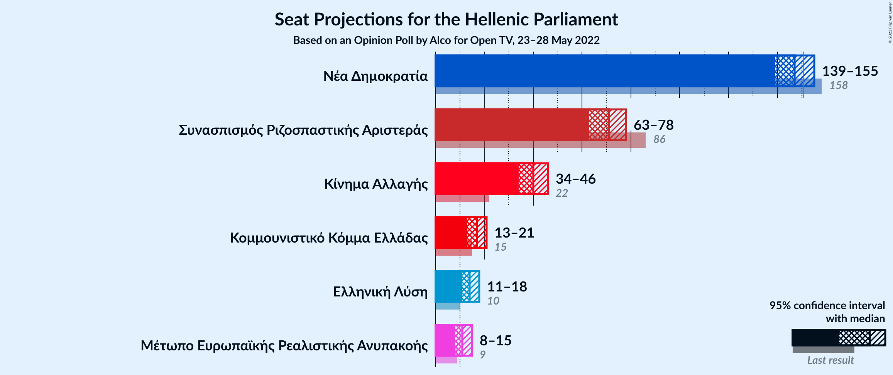

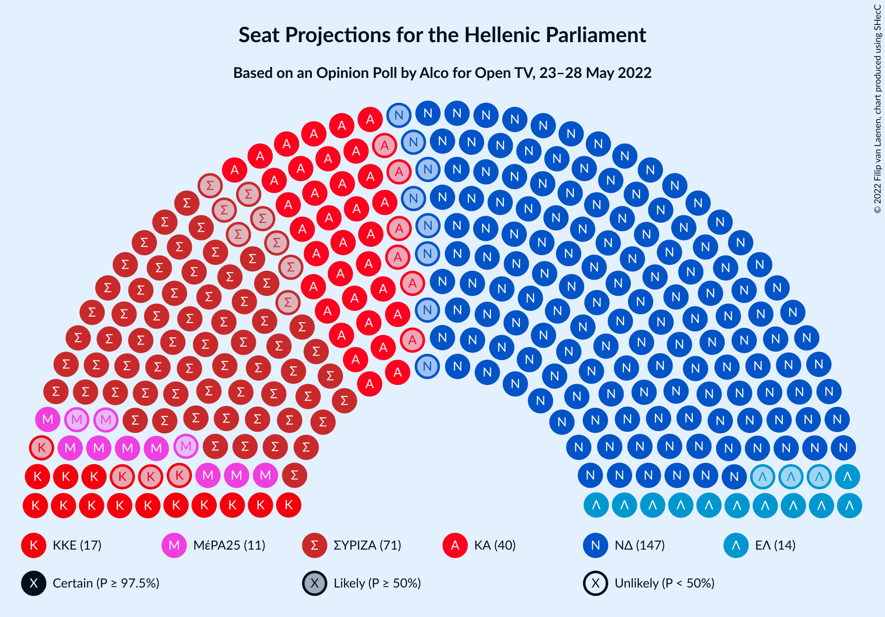

### Confidence Intervals

| Party | Last Result | Median | 80% Confidence Interval | 90% Confidence Interval | 95% Confidence Interval | 99% Confidence Interval |
|:-----:|:-----------:|:------:|:-----------------------:|:-----------------------:|:-----------------------:|:-----------------------:|
| <a href="#νέα-δημοκρατία">Νέα Δημοκρατία</a> | 158 | 147 | 142–152 |140–154 |139–155 |137–158 |
| <a href="#συνασπισμός-ριζοσπαστικής-αριστεράς">Συνασπισμός Ριζοσπαστικής Αριστεράς</a> | 86 | 71 | 66–75 |65–77 |63–78 |61–81 |
| <a href="#κίνημα-αλλαγής">Κίνημα Αλλαγής</a> | 22 | 40 | 36–44 |35–45 |34–46 |32–48 |
| <a href="#κομμουνιστικό-κόμμα-ελλάδας">Κομμουνιστικό Κόμμα Ελλάδας</a> | 15 | 17 | 14–20 |14–20 |13–21 |12–23 |
| <a href="#ελληνική-λύση">Ελληνική Λύση</a> | 10 | 14 | 12–17 |11–18 |11–18 |10–20 |
| <a href="#μέτωπο-ευρωπαϊκής-ρεαλιστικής-ανυπακοής">Μέτωπο Ευρωπαϊκής Ρεαλιστικής Ανυπακοής</a> | 9 | 11 | 9–14 |9–14 |8–15 |0–16 |

### Νέα Δημοκρατία

*For a full overview of the results for this party, see the [Νέα Δημοκρατία](party-νέαδημοκρατία.html) page.*

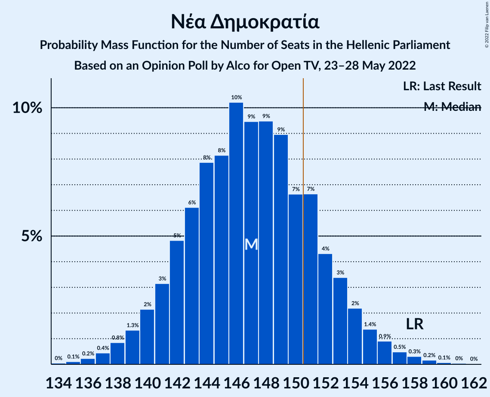

| Number of Seats | Probability | Accumulated | Special Marks |
|:---------------:|:-----------:|:-----------:|:-------------:|
| 134 | 0% | 100% |  |
| 135 | 0.1% | 99.9% |  |
| 136 | 0.2% | 99.8% |  |
| 137 | 0.4% | 99.6% |  |
| 138 | 0.8% | 99.1% |  |
| 139 | 1.3% | 98% |  |
| 140 | 2% | 97% |  |
| 141 | 3% | 95% |  |
| 142 | 5% | 92% |  |
| 143 | 6% | 87% |  |
| 144 | 8% | 81% |  |
| 145 | 8% | 73% |  |
| 146 | 10% | 65% |  |
| 147 | 9% | 54% | Median |
| 148 | 9% | 45% |  |
| 149 | 9% | 36% |  |
| 150 | 7% | 27% |  |
| 151 | 7% | 20% | Majority |
| 152 | 4% | 13% |  |
| 153 | 3% | 9% |  |
| 154 | 2% | 6% |  |
| 155 | 1.4% | 3% |  |
| 156 | 0.9% | 2% |  |
| 157 | 0.5% | 1.1% |  |
| 158 | 0.3% | 0.6% | Last Result |
| 159 | 0.2% | 0.3% |  |
| 160 | 0.1% | 0.2% |  |
| 161 | 0% | 0.1% |  |
| 162 | 0% | 0% |  |

### Συνασπισμός Ριζοσπαστικής Αριστεράς

*For a full overview of the results for this party, see the [Συνασπισμός Ριζοσπαστικής Αριστεράς](party-συνασπισμόςριζοσπαστικήςαριστεράς.html) page.*

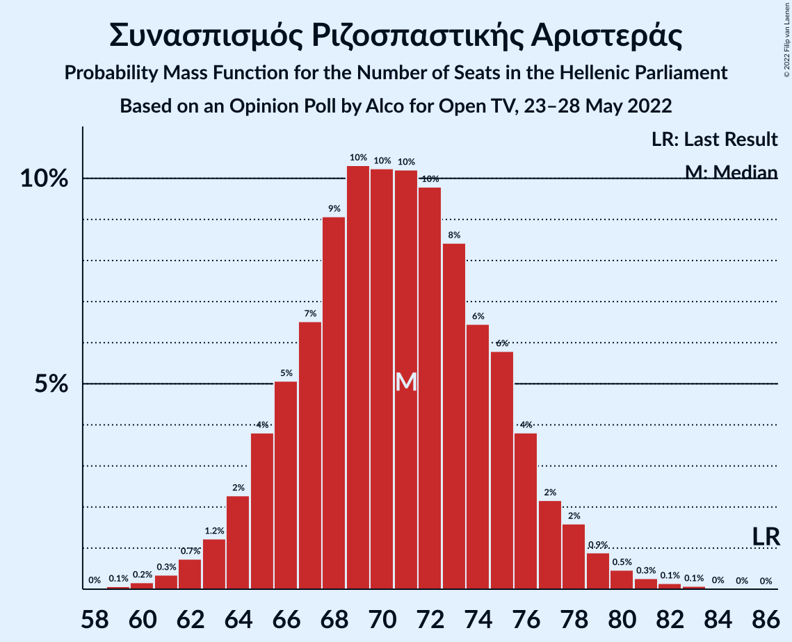

| Number of Seats | Probability | Accumulated | Special Marks |
|:---------------:|:-----------:|:-----------:|:-------------:|
| 59 | 0.1% | 100% |  |
| 60 | 0.2% | 99.9% |  |
| 61 | 0.3% | 99.7% |  |
| 62 | 0.7% | 99.4% |  |
| 63 | 1.2% | 98.6% |  |
| 64 | 2% | 97% |  |
| 65 | 4% | 95% |  |
| 66 | 5% | 91% |  |
| 67 | 7% | 86% |  |
| 68 | 9% | 80% |  |
| 69 | 10% | 71% |  |
| 70 | 10% | 60% |  |
| 71 | 10% | 50% | Median |
| 72 | 10% | 40% |  |
| 73 | 8% | 30% |  |
| 74 | 6% | 22% |  |
| 75 | 6% | 15% |  |
| 76 | 4% | 9% |  |
| 77 | 2% | 6% |  |
| 78 | 2% | 3% |  |
| 79 | 0.9% | 2% |  |
| 80 | 0.5% | 1.0% |  |
| 81 | 0.3% | 0.5% |  |
| 82 | 0.1% | 0.3% |  |
| 83 | 0.1% | 0.1% |  |
| 84 | 0% | 0% |  |
| 85 | 0% | 0% |  |
| 86 | 0% | 0% | Last Result |

### Κίνημα Αλλαγής

*For a full overview of the results for this party, see the [Κίνημα Αλλαγής](party-κίνημααλλαγής.html) page.*

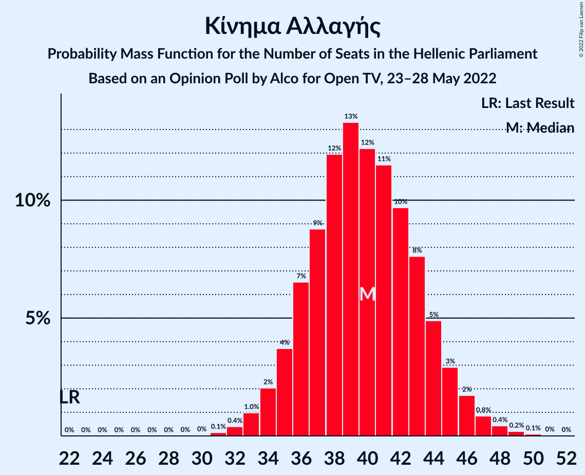

| Number of Seats | Probability | Accumulated | Special Marks |
|:---------------:|:-----------:|:-----------:|:-------------:|
| 22 | 0% | 100% | Last Result |
| 23 | 0% | 100% |  |
| 24 | 0% | 100% |  |
| 25 | 0% | 100% |  |
| 26 | 0% | 100% |  |
| 27 | 0% | 100% |  |
| 28 | 0% | 100% |  |
| 29 | 0% | 100% |  |
| 30 | 0% | 100% |  |
| 31 | 0.1% | 100% |  |
| 32 | 0.4% | 99.8% |  |
| 33 | 1.0% | 99.4% |  |
| 34 | 2% | 98% |  |
| 35 | 4% | 96% |  |
| 36 | 7% | 93% |  |
| 37 | 9% | 86% |  |
| 38 | 12% | 77% |  |
| 39 | 13% | 65% |  |
| 40 | 12% | 52% | Median |
| 41 | 11% | 40% |  |
| 42 | 10% | 28% |  |
| 43 | 8% | 19% |  |
| 44 | 5% | 11% |  |
| 45 | 3% | 6% |  |
| 46 | 2% | 3% |  |
| 47 | 0.8% | 2% |  |
| 48 | 0.4% | 0.8% |  |
| 49 | 0.2% | 0.3% |  |
| 50 | 0.1% | 0.1% |  |
| 51 | 0% | 0% |  |

### Κομμουνιστικό Κόμμα Ελλάδας

*For a full overview of the results for this party, see the [Κομμουνιστικό Κόμμα Ελλάδας](party-κομμουνιστικόκόμμαελλάδας.html) page.*

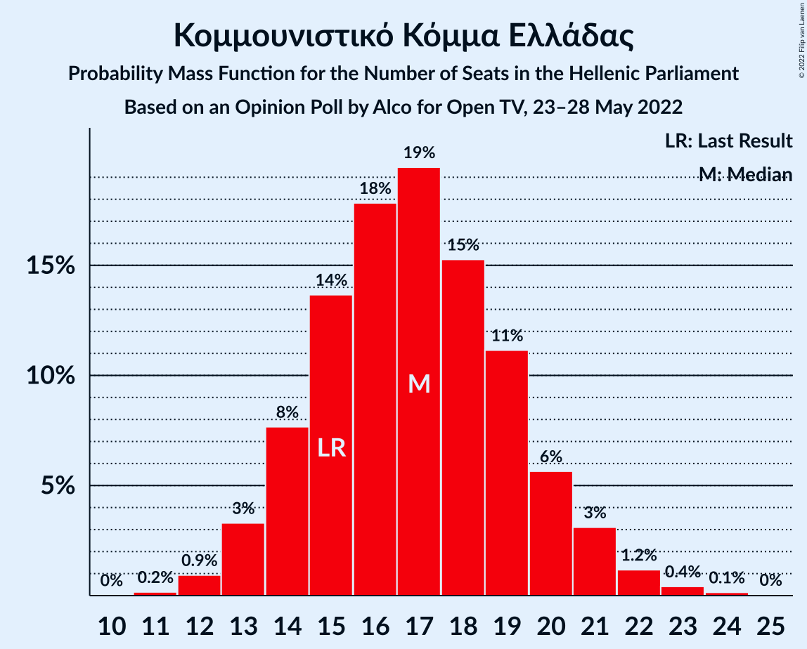

| Number of Seats | Probability | Accumulated | Special Marks |
|:---------------:|:-----------:|:-----------:|:-------------:|
| 11 | 0.2% | 100% |  |
| 12 | 0.9% | 99.8% |  |
| 13 | 3% | 98.9% |  |
| 14 | 8% | 96% |  |
| 15 | 14% | 88% | Last Result |
| 16 | 18% | 74% |  |
| 17 | 19% | 56% | Median |
| 18 | 15% | 37% |  |
| 19 | 11% | 22% |  |
| 20 | 6% | 11% |  |
| 21 | 3% | 5% |  |
| 22 | 1.2% | 2% |  |
| 23 | 0.4% | 0.6% |  |
| 24 | 0.1% | 0.2% |  |
| 25 | 0% | 0% |  |

### Ελληνική Λύση

*For a full overview of the results for this party, see the [Ελληνική Λύση](party-ελληνικήλύση.html) page.*

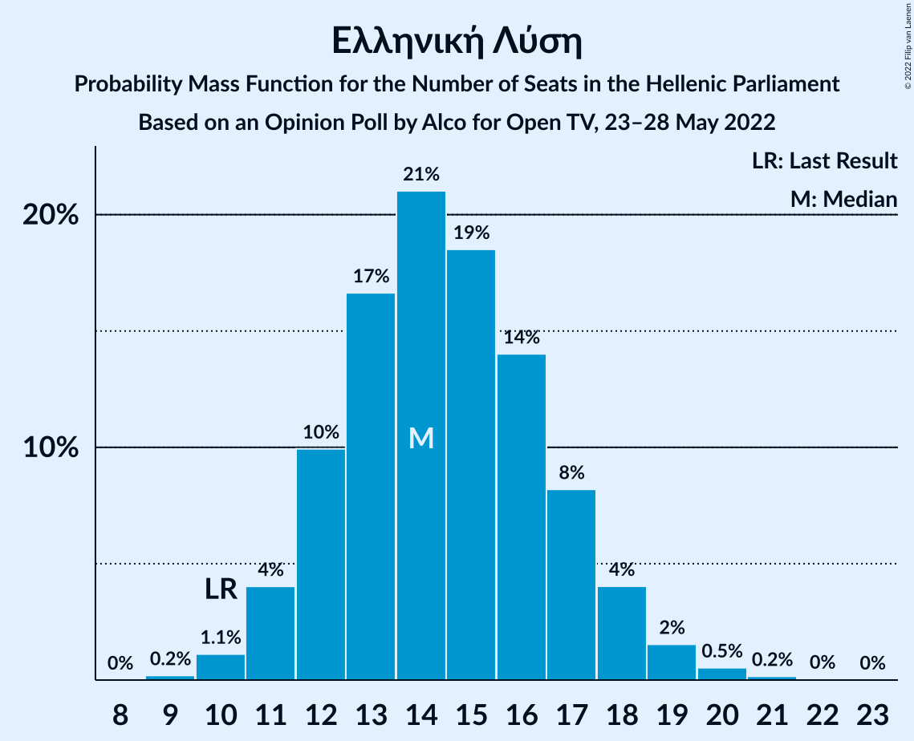

| Number of Seats | Probability | Accumulated | Special Marks |
|:---------------:|:-----------:|:-----------:|:-------------:|
| 9 | 0.2% | 100% |  |
| 10 | 1.1% | 99.8% | Last Result |
| 11 | 4% | 98.7% |  |
| 12 | 10% | 95% |  |
| 13 | 17% | 85% |  |
| 14 | 21% | 68% | Median |
| 15 | 19% | 47% |  |
| 16 | 14% | 29% |  |
| 17 | 8% | 15% |  |
| 18 | 4% | 6% |  |
| 19 | 2% | 2% |  |
| 20 | 0.5% | 0.7% |  |
| 21 | 0.2% | 0.2% |  |
| 22 | 0% | 0.1% |  |
| 23 | 0% | 0% |  |

### Μέτωπο Ευρωπαϊκής Ρεαλιστικής Ανυπακοής

*For a full overview of the results for this party, see the [Μέτωπο Ευρωπαϊκής Ρεαλιστικής Ανυπακοής](party-μέτωποευρωπαϊκήςρεαλιστικήςανυπακοής.html) page.*

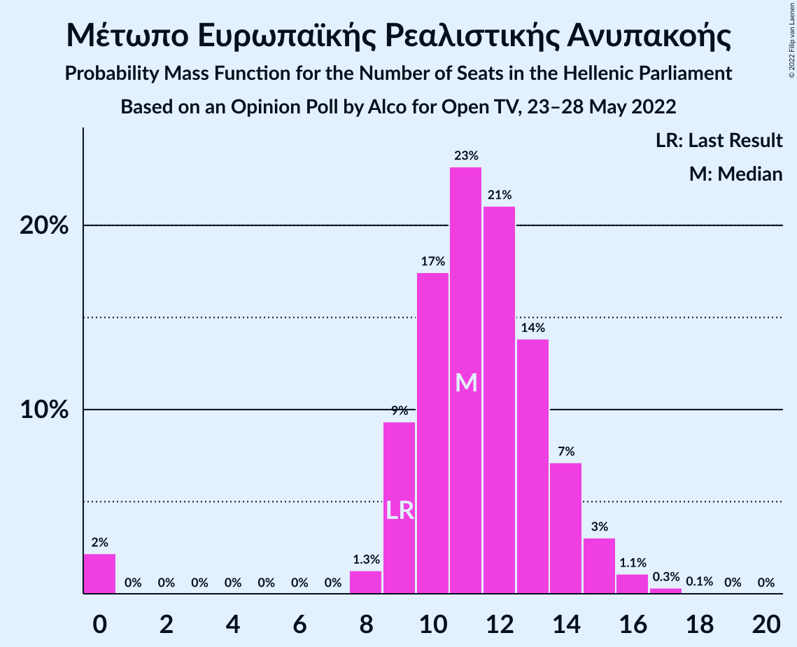

| Number of Seats | Probability | Accumulated | Special Marks |
|:---------------:|:-----------:|:-----------:|:-------------:|
| 0 | 2% | 100% |  |
| 1 | 0% | 98% |  |
| 2 | 0% | 98% |  |
| 3 | 0% | 98% |  |
| 4 | 0% | 98% |  |
| 5 | 0% | 98% |  |
| 6 | 0% | 98% |  |
| 7 | 0% | 98% |  |
| 8 | 1.3% | 98% |  |
| 9 | 9% | 97% | Last Result |
| 10 | 17% | 87% |  |
| 11 | 23% | 70% | Median |
| 12 | 21% | 47% |  |
| 13 | 14% | 26% |  |
| 14 | 7% | 12% |  |
| 15 | 3% | 5% |  |
| 16 | 1.1% | 2% |  |
| 17 | 0.3% | 0.4% |  |
| 18 | 0.1% | 0.1% |  |
| 19 | 0% | 0% |  |

## Coalitions

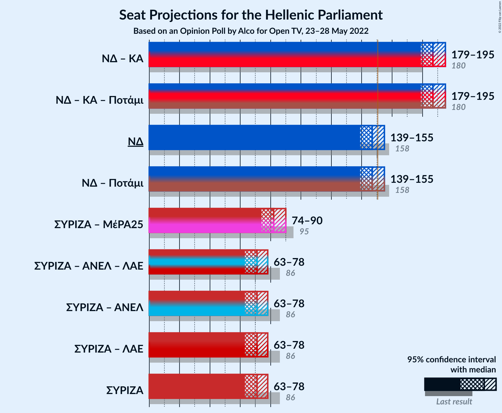

### Confidence Intervals

| Coalition | Last Result | Median | Majority? | 80% Confidence Interval | 90% Confidence Interval | 95% Confidence Interval | 99% Confidence Interval |
|:---------:|:-----------:|:------:|:---------:|:-----------------------:|:-----------------------:|:-----------------------:|:-----------------------:|
| Νέα Δημοκρατία – Κίνημα Αλλαγής | 180 | 187 | 100% | 182–192 | 180–194 | 179–195 | 176–198 |
| Νέα Δημοκρατία | 158 | 147 | 20% | 142–152 | 140–154 | 139–155 | 137–158 |
| Συνασπισμός Ριζοσπαστικής Αριστεράς – Μέτωπο Ευρωπαϊκής Ρεαλιστικής Ανυπακοής | 95 | 82 | 0% | 77–87 | 75–88 | 74–90 | 70–92 |
| Συνασπισμός Ριζοσπαστικής Αριστεράς | 86 | 71 | 0% | 66–75 | 65–77 | 63–78 | 61–81 |

### Νέα Δημοκρατία – Κίνημα Αλλαγής

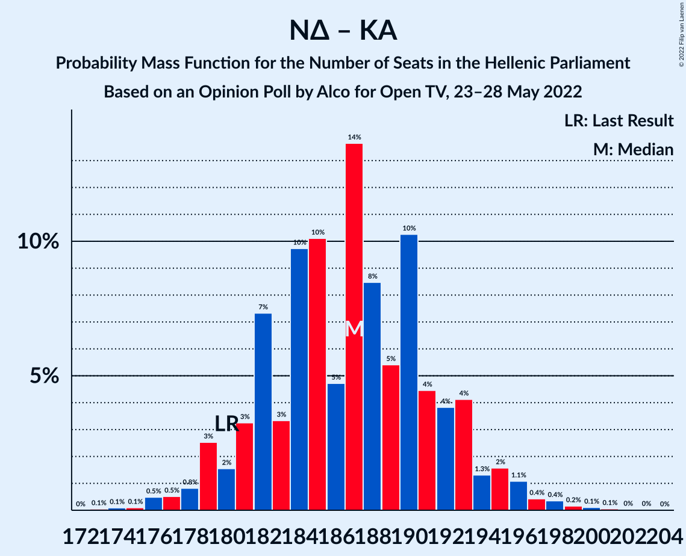

| Number of Seats | Probability | Accumulated | Special Marks |
|:---------------:|:-----------:|:-----------:|:-------------:|
| 173 | 0.1% | 100% |  |
| 174 | 0.1% | 99.9% |  |
| 175 | 0.1% | 99.8% |  |
| 176 | 0.5% | 99.7% |  |
| 177 | 0.5% | 99.2% |  |
| 178 | 0.8% | 98.7% |  |
| 179 | 3% | 98% |  |
| 180 | 2% | 95% | Last Result |
| 181 | 3% | 94% |  |
| 182 | 7% | 91% |  |
| 183 | 3% | 83% |  |
| 184 | 10% | 80% |  |
| 185 | 10% | 70% |  |
| 186 | 5% | 60% |  |
| 187 | 14% | 55% | Median |
| 188 | 8% | 42% |  |
| 189 | 5% | 33% |  |
| 190 | 10% | 28% |  |
| 191 | 4% | 18% |  |
| 192 | 4% | 13% |  |
| 193 | 4% | 9% |  |
| 194 | 1.3% | 5% |  |
| 195 | 2% | 4% |  |
| 196 | 1.1% | 2% |  |
| 197 | 0.4% | 1.2% |  |
| 198 | 0.4% | 0.7% |  |
| 199 | 0.2% | 0.4% |  |
| 200 | 0.1% | 0.2% |  |
| 201 | 0.1% | 0.1% |  |
| 202 | 0% | 0.1% |  |
| 203 | 0% | 0% |  |

### Νέα Δημοκρατία

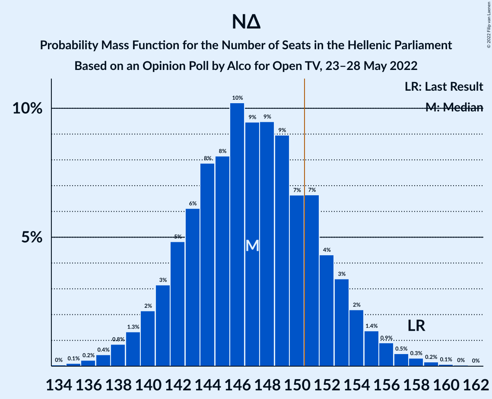

| Number of Seats | Probability | Accumulated | Special Marks |
|:---------------:|:-----------:|:-----------:|:-------------:|
| 134 | 0% | 100% |  |
| 135 | 0.1% | 99.9% |  |
| 136 | 0.2% | 99.8% |  |
| 137 | 0.4% | 99.6% |  |
| 138 | 0.8% | 99.1% |  |
| 139 | 1.3% | 98% |  |
| 140 | 2% | 97% |  |
| 141 | 3% | 95% |  |
| 142 | 5% | 92% |  |
| 143 | 6% | 87% |  |
| 144 | 8% | 81% |  |
| 145 | 8% | 73% |  |
| 146 | 10% | 65% |  |
| 147 | 9% | 54% | Median |
| 148 | 9% | 45% |  |
| 149 | 9% | 36% |  |
| 150 | 7% | 27% |  |
| 151 | 7% | 20% | Majority |
| 152 | 4% | 13% |  |
| 153 | 3% | 9% |  |
| 154 | 2% | 6% |  |
| 155 | 1.4% | 3% |  |
| 156 | 0.9% | 2% |  |
| 157 | 0.5% | 1.1% |  |
| 158 | 0.3% | 0.6% | Last Result |
| 159 | 0.2% | 0.3% |  |
| 160 | 0.1% | 0.2% |  |
| 161 | 0% | 0.1% |  |
| 162 | 0% | 0% |  |

### Συνασπισμός Ριζοσπαστικής Αριστεράς – Μέτωπο Ευρωπαϊκής Ρεαλιστικής Ανυπακοής

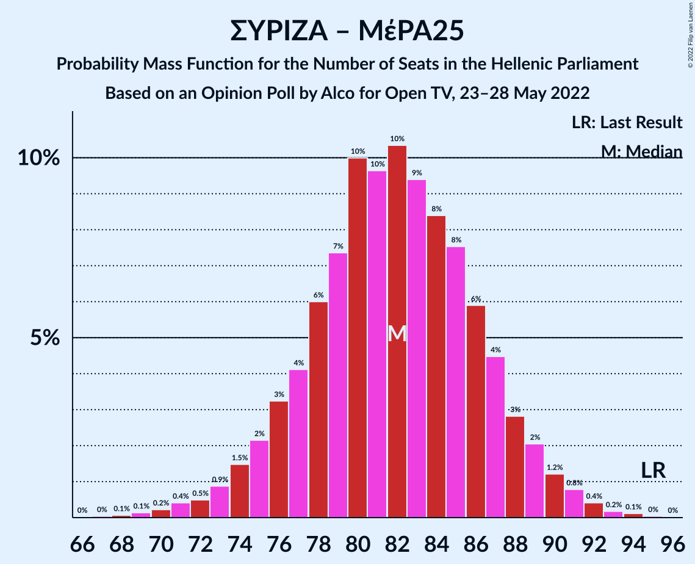

| Number of Seats | Probability | Accumulated | Special Marks |
|:---------------:|:-----------:|:-----------:|:-------------:|
| 67 | 0% | 100% |  |
| 68 | 0.1% | 99.9% |  |
| 69 | 0.1% | 99.8% |  |
| 70 | 0.2% | 99.7% |  |
| 71 | 0.4% | 99.5% |  |
| 72 | 0.5% | 99.1% |  |
| 73 | 0.9% | 98.6% |  |
| 74 | 1.5% | 98% |  |
| 75 | 2% | 96% |  |
| 76 | 3% | 94% |  |
| 77 | 4% | 91% |  |
| 78 | 6% | 87% |  |
| 79 | 7% | 81% |  |
| 80 | 10% | 73% |  |
| 81 | 10% | 63% |  |
| 82 | 10% | 54% | Median |
| 83 | 9% | 43% |  |
| 84 | 8% | 34% |  |
| 85 | 8% | 26% |  |
| 86 | 6% | 18% |  |
| 87 | 4% | 12% |  |
| 88 | 3% | 8% |  |
| 89 | 2% | 5% |  |
| 90 | 1.2% | 3% |  |
| 91 | 0.8% | 2% |  |
| 92 | 0.4% | 0.8% |  |
| 93 | 0.2% | 0.4% |  |
| 94 | 0.1% | 0.2% |  |
| 95 | 0% | 0.1% | Last Result |
| 96 | 0% | 0% |  |

### Συνασπισμός Ριζοσπαστικής Αριστεράς

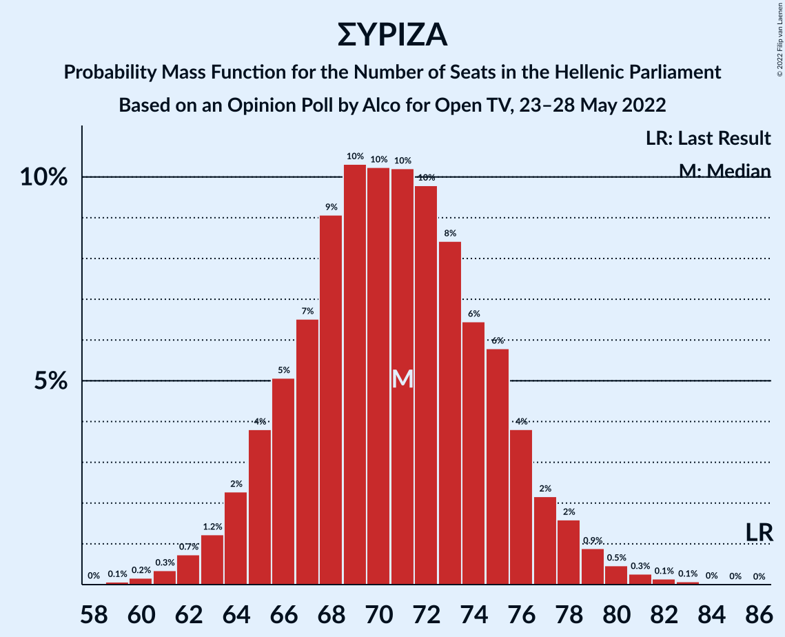

| Number of Seats | Probability | Accumulated | Special Marks |
|:---------------:|:-----------:|:-----------:|:-------------:|
| 59 | 0.1% | 100% |  |
| 60 | 0.2% | 99.9% |  |
| 61 | 0.3% | 99.7% |  |
| 62 | 0.7% | 99.4% |  |
| 63 | 1.2% | 98.6% |  |
| 64 | 2% | 97% |  |
| 65 | 4% | 95% |  |
| 66 | 5% | 91% |  |
| 67 | 7% | 86% |  |
| 68 | 9% | 80% |  |
| 69 | 10% | 71% |  |
| 70 | 10% | 60% |  |
| 71 | 10% | 50% | Median |
| 72 | 10% | 40% |  |
| 73 | 8% | 30% |  |
| 74 | 6% | 22% |  |
| 75 | 6% | 15% |  |
| 76 | 4% | 9% |  |
| 77 | 2% | 6% |  |
| 78 | 2% | 3% |  |
| 79 | 0.9% | 2% |  |
| 80 | 0.5% | 1.0% |  |
| 81 | 0.3% | 0.5% |  |
| 82 | 0.1% | 0.3% |  |
| 83 | 0.1% | 0.1% |  |
| 84 | 0% | 0% |  |
| 85 | 0% | 0% |  |
| 86 | 0% | 0% | Last Result |

## Technical Information

### Opinion Poll

+ **Polling firm:** Alco
+ **Commissioner(s):** Open TV
+ **Fieldwork period:** 23–28 May 2022

### Calculations

+ **Sample size:** 1000
+ **Simulations done:** 1,048,576
+ **Error estimate:** 0.58%

