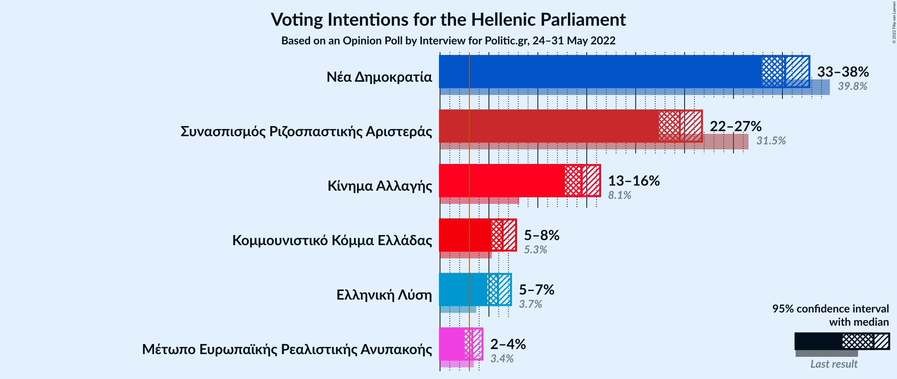

# Opinion Poll by Interview for Politic.gr, 24–31 May 2022

<a href="#voting-intentions">Voting Intentions</a> | <a href="#seats">Seats</a> | <a href="#coalitions">Coalitions</a> | <a href="#technical-information">Technical Information</a>

## Voting Intentions

### Confidence Intervals

| Party | Last Result | Poll Result | 80% Confidence Interval | 90% Confidence Interval | 95% Confidence Interval | 99% Confidence Interval |
|:-----:|:-----------:|:-----------:|:-----------------------:|:-----------------------:|:-----------------------:|:-----------------------:|
| Νέα Δημοκρατία | 39.8% | 35.3% | 33.7–36.9% |33.3–37.4% |32.9–37.8% |32.1–38.5% |
| Συνασπισμός Ριζοσπαστικής Αριστεράς | 31.5% | 24.5% | 23.1–26.0% |22.7–26.4% |22.4–26.8% |21.7–27.5% |
| Κίνημα Αλλαγής | 8.1% | 14.5% | 13.4–15.7% |13.0–16.1% |12.8–16.4% |12.3–17.0% |
| Κομμουνιστικό Κόμμα Ελλάδας | 5.3% | 6.4% | 5.6–7.3% |5.4–7.5% |5.3–7.8% |4.9–8.2% |
| Ελληνική Λύση | 3.7% | 5.9% | 5.2–6.8% |5.0–7.0% |4.8–7.3% |4.5–7.7% |
| Μέτωπο Ευρωπαϊκής Ρεαλιστικής Ανυπακοής | 3.4% | 3.3% | 2.8–4.0% |2.6–4.2% |2.5–4.3% |2.3–4.7% |

*Note:* The poll result column reflects the actual value used in the calculations. Published results may vary slightly, and in addition be rounded to fewer digits.

## Seats

### Confidence Intervals

| Party | Last Result | Median | 80% Confidence Interval | 90% Confidence Interval | 95% Confidence Interval | 99% Confidence Interval |
|:-----:|:-----------:|:------:|:-----------------------:|:-----------------------:|:-----------------------:|:-----------------------:|
| <a href="#νέα-δημοκρατία">Νέα Δημοκρατία</a> | 158 | 148 | 144–153 |143–155 |142–156 |139–159 |
| <a href="#συνασπισμός-ριζοσπαστικής-αριστεράς">Συνασπισμός Ριζοσπαστικής Αριστεράς</a> | 86 | 69 | 64–73 |63–74 |62–75 |60–77 |
| <a href="#κίνημα-αλλαγής">Κίνημα Αλλαγής</a> | 22 | 41 | 37–44 |36–45 |36–46 |34–48 |
| <a href="#κομμουνιστικό-κόμμα-ελλάδας">Κομμουνιστικό Κόμμα Ελλάδας</a> | 15 | 18 | 16–20 |15–21 |15–22 |14–23 |
| <a href="#ελληνική-λύση">Ελληνική Λύση</a> | 10 | 17 | 14–19 |14–20 |13–20 |13–21 |
| <a href="#μέτωπο-ευρωπαϊκής-ρεαλιστικής-ανυπακοής">Μέτωπο Ευρωπαϊκής Ρεαλιστικής Ανυπακοής</a> | 9 | 9 | 0–11 |0–12 |0–12 |0–13 |

### Νέα Δημοκρατία

*For a full overview of the results for this party, see the [Νέα Δημοκρατία](party-νέαδημοκρατία.html) page.*

| Number of Seats | Probability | Accumulated | Special Marks |
|:---------------:|:-----------:|:-----------:|:-------------:|
| 137 | 0.1% | 100% |  |
| 138 | 0.1% | 99.9% |  |
| 139 | 0.4% | 99.8% |  |
| 140 | 0.4% | 99.4% |  |
| 141 | 1.2% | 99.0% |  |
| 142 | 2% | 98% |  |
| 143 | 4% | 95% |  |
| 144 | 4% | 91% |  |
| 145 | 7% | 87% |  |
| 146 | 9% | 80% |  |
| 147 | 11% | 71% |  |
| 148 | 10% | 60% | Median |
| 149 | 10% | 49% |  |
| 150 | 8% | 40% |  |
| 151 | 10% | 32% | Majority |
| 152 | 7% | 22% |  |
| 153 | 4% | 14% |  |
| 154 | 3% | 10% |  |
| 155 | 3% | 7% |  |
| 156 | 2% | 4% |  |
| 157 | 0.7% | 2% |  |
| 158 | 0.5% | 1.2% | Last Result |
| 159 | 0.4% | 0.6% |  |
| 160 | 0.2% | 0.3% |  |
| 161 | 0.1% | 0.1% |  |
| 162 | 0% | 0.1% |  |
| 163 | 0% | 0% |  |

### Συνασπισμός Ριζοσπαστικής Αριστεράς

*For a full overview of the results for this party, see the [Συνασπισμός Ριζοσπαστικής Αριστεράς](party-συνασπισμόςριζοσπαστικήςαριστεράς.html) page.*

| Number of Seats | Probability | Accumulated | Special Marks |
|:---------------:|:-----------:|:-----------:|:-------------:|
| 58 | 0% | 100% |  |
| 59 | 0.1% | 99.9% |  |
| 60 | 0.3% | 99.8% |  |
| 61 | 0.6% | 99.5% |  |
| 62 | 1.3% | 98.8% |  |
| 63 | 3% | 97% |  |
| 64 | 6% | 95% |  |
| 65 | 8% | 89% |  |
| 66 | 9% | 81% |  |
| 67 | 10% | 73% |  |
| 68 | 12% | 63% |  |
| 69 | 13% | 51% | Median |
| 70 | 12% | 38% |  |
| 71 | 8% | 26% |  |
| 72 | 6% | 18% |  |
| 73 | 4% | 12% |  |
| 74 | 4% | 8% |  |
| 75 | 2% | 4% |  |
| 76 | 0.9% | 2% |  |
| 77 | 0.5% | 0.9% |  |
| 78 | 0.2% | 0.4% |  |
| 79 | 0.1% | 0.2% |  |
| 80 | 0.1% | 0.1% |  |
| 81 | 0% | 0% |  |
| 82 | 0% | 0% |  |
| 83 | 0% | 0% |  |
| 84 | 0% | 0% |  |
| 85 | 0% | 0% |  |
| 86 | 0% | 0% | Last Result |

### Κίνημα Αλλαγής

*For a full overview of the results for this party, see the [Κίνημα Αλλαγής](party-κίνημααλλαγής.html) page.*

| Number of Seats | Probability | Accumulated | Special Marks |
|:---------------:|:-----------:|:-----------:|:-------------:|
| 22 | 0% | 100% | Last Result |
| 23 | 0% | 100% |  |
| 24 | 0% | 100% |  |
| 25 | 0% | 100% |  |
| 26 | 0% | 100% |  |
| 27 | 0% | 100% |  |
| 28 | 0% | 100% |  |
| 29 | 0% | 100% |  |
| 30 | 0% | 100% |  |
| 31 | 0% | 100% |  |
| 32 | 0% | 100% |  |
| 33 | 0.2% | 100% |  |
| 34 | 0.6% | 99.8% |  |
| 35 | 1.3% | 99.2% |  |
| 36 | 4% | 98% |  |
| 37 | 7% | 94% |  |
| 38 | 8% | 87% |  |
| 39 | 13% | 79% |  |
| 40 | 16% | 66% |  |
| 41 | 14% | 50% | Median |
| 42 | 13% | 36% |  |
| 43 | 10% | 23% |  |
| 44 | 6% | 13% |  |
| 45 | 4% | 7% |  |
| 46 | 2% | 3% |  |
| 47 | 0.8% | 1.3% |  |
| 48 | 0.3% | 0.6% |  |
| 49 | 0.2% | 0.2% |  |
| 50 | 0% | 0.1% |  |
| 51 | 0% | 0% |  |

### Κομμουνιστικό Κόμμα Ελλάδας

*For a full overview of the results for this party, see the [Κομμουνιστικό Κόμμα Ελλάδας](party-κομμουνιστικόκόμμαελλάδας.html) page.*

| Number of Seats | Probability | Accumulated | Special Marks |
|:---------------:|:-----------:|:-----------:|:-------------:|
| 13 | 0.3% | 100% |  |
| 14 | 2% | 99.7% |  |
| 15 | 5% | 98% | Last Result |
| 16 | 13% | 93% |  |
| 17 | 19% | 80% |  |
| 18 | 22% | 61% | Median |
| 19 | 19% | 39% |  |
| 20 | 12% | 20% |  |
| 21 | 5% | 8% |  |
| 22 | 2% | 3% |  |
| 23 | 0.8% | 1.0% |  |
| 24 | 0.2% | 0.2% |  |
| 25 | 0% | 0.1% |  |
| 26 | 0% | 0% |  |

### Ελληνική Λύση

*For a full overview of the results for this party, see the [Ελληνική Λύση](party-ελληνικήλύση.html) page.*

| Number of Seats | Probability | Accumulated | Special Marks |
|:---------------:|:-----------:|:-----------:|:-------------:|
| 10 | 0% | 100% | Last Result |
| 11 | 0% | 100% |  |
| 12 | 0.4% | 100% |  |
| 13 | 2% | 99.6% |  |
| 14 | 8% | 97% |  |
| 15 | 15% | 90% |  |
| 16 | 22% | 75% |  |
| 17 | 22% | 53% | Median |
| 18 | 16% | 31% |  |
| 19 | 9% | 15% |  |
| 20 | 4% | 6% |  |
| 21 | 1.3% | 2% |  |
| 22 | 0.4% | 0.5% |  |
| 23 | 0.1% | 0.1% |  |
| 24 | 0% | 0% |  |

### Μέτωπο Ευρωπαϊκής Ρεαλιστικής Ανυπακοής

*For a full overview of the results for this party, see the [Μέτωπο Ευρωπαϊκής Ρεαλιστικής Ανυπακοής](party-μέτωποευρωπαϊκήςρεαλιστικήςανυπακοής.html) page.*

| Number of Seats | Probability | Accumulated | Special Marks |
|:---------------:|:-----------:|:-----------:|:-------------:|
| 0 | 24% | 100% |  |
| 1 | 0% | 76% |  |
| 2 | 0% | 76% |  |
| 3 | 0% | 76% |  |
| 4 | 0% | 76% |  |
| 5 | 0% | 76% |  |
| 6 | 0% | 76% |  |
| 7 | 0% | 76% |  |
| 8 | 4% | 76% |  |
| 9 | 30% | 72% | Last Result, Median |
| 10 | 25% | 43% |  |
| 11 | 13% | 18% |  |
| 12 | 4% | 5% |  |
| 13 | 0.9% | 1.1% |  |
| 14 | 0.2% | 0.2% |  |
| 15 | 0% | 0% |  |

## Coalitions

### Confidence Intervals

| Coalition | Last Result | Median | Majority? | 80% Confidence Interval | 90% Confidence Interval | 95% Confidence Interval | 99% Confidence Interval |
|:---------:|:-----------:|:------:|:---------:|:-----------------------:|:-----------------------:|:-----------------------:|:-----------------------:|
| Νέα Δημοκρατία – Κίνημα Αλλαγής | 180 | 189 | 100% | 184–195 | 183–196 | 182–198 | 179–200 |
| Νέα Δημοκρατία | 158 | 148 | 32% | 144–153 | 143–155 | 142–156 | 139–159 |
| Συνασπισμός Ριζοσπαστικής Αριστεράς – Μέτωπο Ευρωπαϊκής Ρεαλιστικής Ανυπακοής | 95 | 77 | 0% | 70–81 | 68–82 | 67–84 | 65–86 |
| Συνασπισμός Ριζοσπαστικής Αριστεράς | 86 | 69 | 0% | 64–73 | 63–74 | 62–75 | 60–77 |

### Νέα Δημοκρατία – Κίνημα Αλλαγής

| Number of Seats | Probability | Accumulated | Special Marks |
|:---------------:|:-----------:|:-----------:|:-------------:|
| 177 | 0.1% | 100% |  |
| 178 | 0.1% | 99.9% |  |
| 179 | 0.3% | 99.8% |  |
| 180 | 0.6% | 99.5% | Last Result |
| 181 | 1.2% | 98.9% |  |
| 182 | 2% | 98% |  |
| 183 | 3% | 96% |  |
| 184 | 5% | 93% |  |
| 185 | 6% | 87% |  |
| 186 | 9% | 81% |  |
| 187 | 9% | 73% |  |
| 188 | 9% | 64% |  |
| 189 | 10% | 55% | Median |
| 190 | 9% | 45% |  |
| 191 | 7% | 36% |  |
| 192 | 7% | 29% |  |
| 193 | 6% | 21% |  |
| 194 | 5% | 16% |  |
| 195 | 3% | 10% |  |
| 196 | 3% | 7% |  |
| 197 | 2% | 4% |  |
| 198 | 1.2% | 3% |  |
| 199 | 0.7% | 2% |  |
| 200 | 0.5% | 1.0% |  |
| 201 | 0.2% | 0.5% |  |
| 202 | 0.2% | 0.2% |  |
| 203 | 0.1% | 0.1% |  |
| 204 | 0% | 0% |  |

### Νέα Δημοκρατία

| Number of Seats | Probability | Accumulated | Special Marks |
|:---------------:|:-----------:|:-----------:|:-------------:|
| 137 | 0.1% | 100% |  |
| 138 | 0.1% | 99.9% |  |
| 139 | 0.4% | 99.8% |  |
| 140 | 0.4% | 99.4% |  |
| 141 | 1.2% | 99.0% |  |
| 142 | 2% | 98% |  |
| 143 | 4% | 95% |  |
| 144 | 4% | 91% |  |
| 145 | 7% | 87% |  |
| 146 | 9% | 80% |  |
| 147 | 11% | 71% |  |
| 148 | 10% | 60% | Median |
| 149 | 10% | 49% |  |
| 150 | 8% | 40% |  |
| 151 | 10% | 32% | Majority |
| 152 | 7% | 22% |  |
| 153 | 4% | 14% |  |
| 154 | 3% | 10% |  |
| 155 | 3% | 7% |  |
| 156 | 2% | 4% |  |
| 157 | 0.7% | 2% |  |
| 158 | 0.5% | 1.2% | Last Result |
| 159 | 0.4% | 0.6% |  |
| 160 | 0.2% | 0.3% |  |
| 161 | 0.1% | 0.1% |  |
| 162 | 0% | 0.1% |  |
| 163 | 0% | 0% |  |

### Συνασπισμός Ριζοσπαστικής Αριστεράς – Μέτωπο Ευρωπαϊκής Ρεαλιστικής Ανυπακοής

| Number of Seats | Probability | Accumulated | Special Marks |
|:---------------:|:-----------:|:-----------:|:-------------:|
| 62 | 0.1% | 100% |  |
| 63 | 0.1% | 99.9% |  |
| 64 | 0.3% | 99.8% |  |
| 65 | 0.7% | 99.5% |  |
| 66 | 1.0% | 98.8% |  |
| 67 | 2% | 98% |  |
| 68 | 2% | 96% |  |
| 69 | 3% | 95% |  |
| 70 | 4% | 92% |  |
| 71 | 4% | 88% |  |
| 72 | 4% | 84% |  |
| 73 | 5% | 80% |  |
| 74 | 7% | 75% |  |
| 75 | 8% | 67% |  |
| 76 | 9% | 59% |  |
| 77 | 9% | 50% |  |
| 78 | 10% | 41% | Median |
| 79 | 10% | 31% |  |
| 80 | 7% | 21% |  |
| 81 | 5% | 14% |  |
| 82 | 3% | 8% |  |
| 83 | 2% | 5% |  |
| 84 | 1.4% | 3% |  |
| 85 | 0.7% | 1.2% |  |
| 86 | 0.3% | 0.5% |  |
| 87 | 0.1% | 0.2% |  |
| 88 | 0.1% | 0.1% |  |
| 89 | 0% | 0% |  |
| 90 | 0% | 0% |  |
| 91 | 0% | 0% |  |
| 92 | 0% | 0% |  |
| 93 | 0% | 0% |  |
| 94 | 0% | 0% |  |
| 95 | 0% | 0% | Last Result |

### Συνασπισμός Ριζοσπαστικής Αριστεράς

| Number of Seats | Probability | Accumulated | Special Marks |
|:---------------:|:-----------:|:-----------:|:-------------:|
| 58 | 0% | 100% |  |
| 59 | 0.1% | 99.9% |  |
| 60 | 0.3% | 99.8% |  |
| 61 | 0.6% | 99.5% |  |
| 62 | 1.3% | 98.8% |  |
| 63 | 3% | 97% |  |
| 64 | 6% | 95% |  |
| 65 | 8% | 89% |  |
| 66 | 9% | 81% |  |
| 67 | 10% | 73% |  |
| 68 | 12% | 63% |  |
| 69 | 13% | 51% | Median |
| 70 | 12% | 38% |  |
| 71 | 8% | 26% |  |
| 72 | 6% | 18% |  |
| 73 | 4% | 12% |  |
| 74 | 4% | 8% |  |
| 75 | 2% | 4% |  |
| 76 | 0.9% | 2% |  |
| 77 | 0.5% | 0.9% |  |
| 78 | 0.2% | 0.4% |  |
| 79 | 0.1% | 0.2% |  |
| 80 | 0.1% | 0.1% |  |
| 81 | 0% | 0% |  |
| 82 | 0% | 0% |  |
| 83 | 0% | 0% |  |
| 84 | 0% | 0% |  |
| 85 | 0% | 0% |  |
| 86 | 0% | 0% | Last Result |

## Technical Information

### Opinion Poll

+ **Polling firm:** Interview
+ **Commissioner(s):** Politic.gr
+ **Fieldwork period:** 24–31 May 2022

### Calculations

+ **Sample size:** 1485
+ **Simulations done:** 1,048,576
+ **Error estimate:** 0.23%

