# Opinion Poll by Κάπα Research, 27 May–1 June 2022

<a href="#voting-intentions">Voting Intentions</a> | <a href="#seats">Seats</a> | <a href="#coalitions">Coalitions</a> | <a href="#technical-information">Technical Information</a>

## Voting Intentions

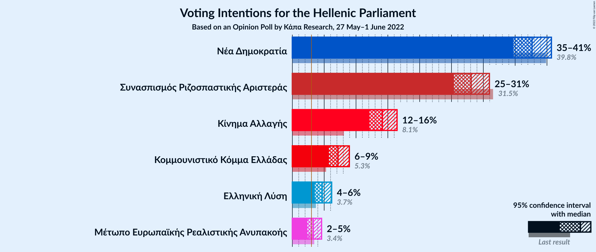

### Confidence Intervals

| Party | Last Result | Poll Result | 80% Confidence Interval | 90% Confidence Interval | 95% Confidence Interval | 99% Confidence Interval |
|:-----:|:-----------:|:-----------:|:-----------------------:|:-----------------------:|:-----------------------:|:-----------------------:|
| Νέα Δημοκρατία | 39.8% | 37.6% | 35.7–39.6% |35.2–40.2% |34.7–40.7% |33.8–41.7% |
| Συνασπισμός Ριζοσπαστικής Αριστεράς | 31.5% | 28.1% | 26.3–30.0% |25.8–30.5% |25.4–31.0% |24.6–31.9% |
| Κίνημα Αλλαγής | 8.1% | 14.1% | 12.8–15.7% |12.4–16.1% |12.1–16.4% |11.5–17.2% |
| Κομμουνιστικό Κόμμα Ελλάδας | 5.3% | 7.2% | 6.2–8.3% |6.0–8.7% |5.7–8.9% |5.3–9.5% |
| Ελληνική Λύση | 3.7% | 4.7% | 3.9–5.7% |3.7–5.9% |3.5–6.2% |3.2–6.7% |
| Μέτωπο Ευρωπαϊκής Ρεαλιστικής Ανυπακοής | 3.4% | 3.3% | 2.7–4.1% |2.5–4.4% |2.3–4.6% |2.1–5.0% |

*Note:* The poll result column reflects the actual value used in the calculations. Published results may vary slightly, and in addition be rounded to fewer digits.

## Seats

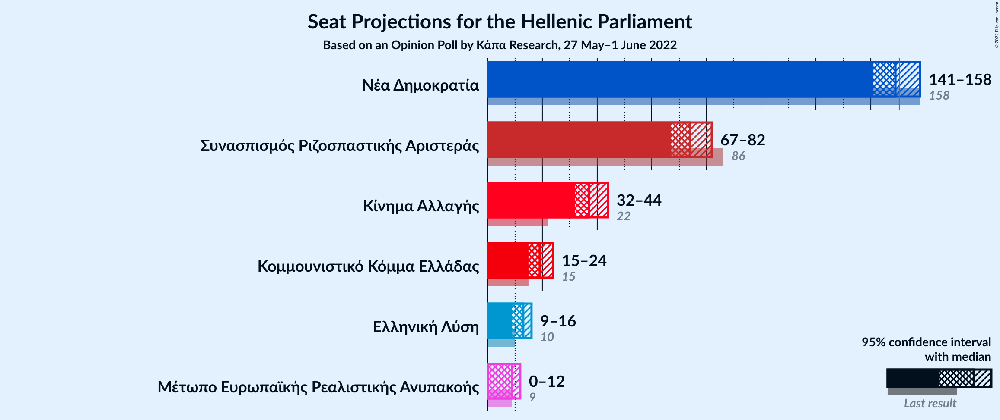

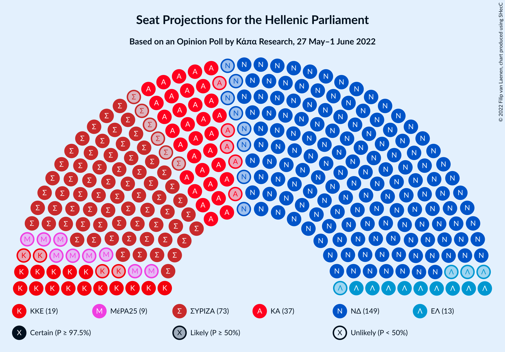

### Confidence Intervals

| Party | Last Result | Median | 80% Confidence Interval | 90% Confidence Interval | 95% Confidence Interval | 99% Confidence Interval |
|:-----:|:-----------:|:------:|:-----------------------:|:-----------------------:|:-----------------------:|:-----------------------:|
| <a href="#νέα-δημοκρατία">Νέα Δημοκρατία</a> | 158 | 149 | 144–155 |143–157 |141–158 |139–161 |
| <a href="#συνασπισμός-ριζοσπαστικής-αριστεράς">Συνασπισμός Ριζοσπαστικής Αριστεράς</a> | 86 | 74 | 69–79 |68–81 |67–82 |65–85 |
| <a href="#κίνημα-αλλαγής">Κίνημα Αλλαγής</a> | 22 | 37 | 34–41 |33–43 |32–44 |30–45 |
| <a href="#κομμουνιστικό-κόμμα-ελλάδας">Κομμουνιστικό Κόμμα Ελλάδας</a> | 15 | 19 | 16–22 |16–23 |15–24 |14–25 |
| <a href="#ελληνική-λύση">Ελληνική Λύση</a> | 10 | 13 | 10–15 |10–16 |9–16 |8–18 |
| <a href="#μέτωπο-ευρωπαϊκής-ρεαλιστικής-ανυπακοής">Μέτωπο Ευρωπαϊκής Ρεαλιστικής Ανυπακοής</a> | 9 | 9 | 0–11 |0–11 |0–12 |0–13 |

### Νέα Δημοκρατία

*For a full overview of the results for this party, see the [Νέα Δημοκρατία](party-νέαδημοκρατία.html) page.*

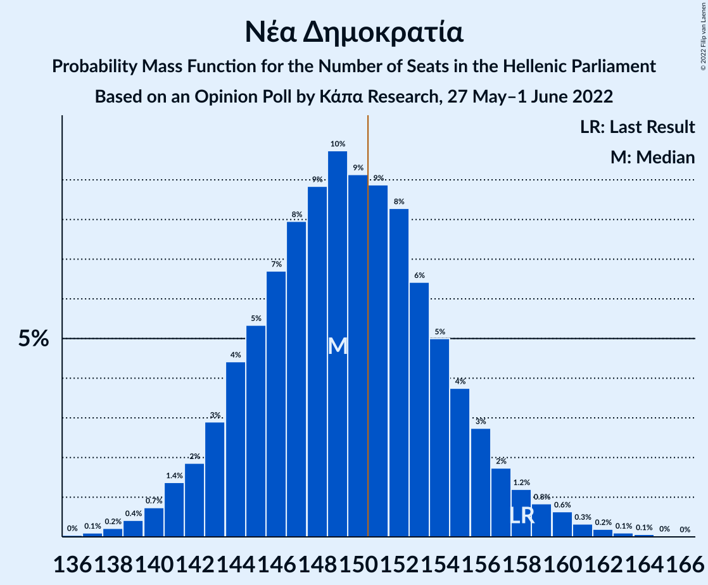

| Number of Seats | Probability | Accumulated | Special Marks |
|:---------------:|:-----------:|:-----------:|:-------------:|
| 136 | 0% | 100% |  |
| 137 | 0.1% | 99.9% |  |
| 138 | 0.2% | 99.8% |  |
| 139 | 0.4% | 99.6% |  |
| 140 | 0.7% | 99.2% |  |
| 141 | 1.4% | 98% |  |
| 142 | 2% | 97% |  |
| 143 | 3% | 95% |  |
| 144 | 4% | 92% |  |
| 145 | 5% | 88% |  |
| 146 | 7% | 83% |  |
| 147 | 8% | 76% |  |
| 148 | 9% | 68% |  |
| 149 | 10% | 59% | Median |
| 150 | 9% | 49% |  |
| 151 | 9% | 40% | Majority |
| 152 | 8% | 31% |  |
| 153 | 6% | 23% |  |
| 154 | 5% | 17% |  |
| 155 | 4% | 12% |  |
| 156 | 3% | 8% |  |
| 157 | 2% | 5% |  |
| 158 | 1.2% | 3% | Last Result |
| 159 | 0.8% | 2% |  |
| 160 | 0.6% | 1.4% |  |
| 161 | 0.3% | 0.7% |  |
| 162 | 0.2% | 0.4% |  |
| 163 | 0.1% | 0.2% |  |
| 164 | 0.1% | 0.1% |  |
| 165 | 0% | 0% |  |

### Συνασπισμός Ριζοσπαστικής Αριστεράς

*For a full overview of the results for this party, see the [Συνασπισμός Ριζοσπαστικής Αριστεράς](party-συνασπισμόςριζοσπαστικήςαριστεράς.html) page.*

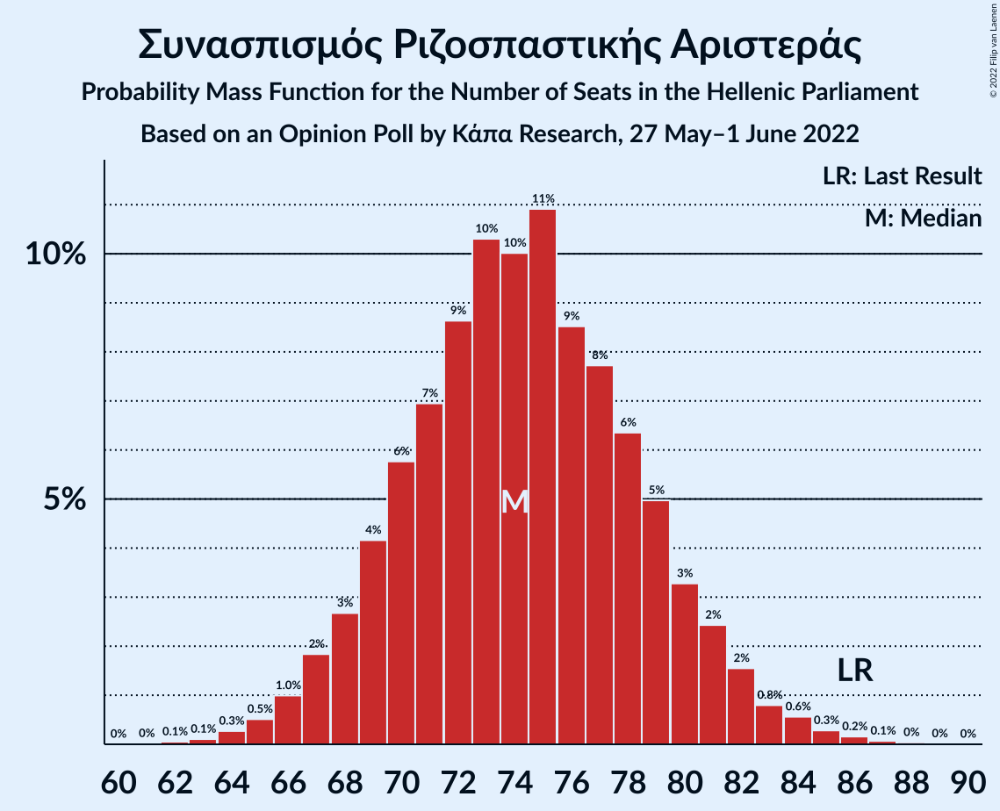

| Number of Seats | Probability | Accumulated | Special Marks |
|:---------------:|:-----------:|:-----------:|:-------------:|
| 62 | 0.1% | 100% |  |
| 63 | 0.1% | 99.9% |  |
| 64 | 0.3% | 99.8% |  |
| 65 | 0.5% | 99.5% |  |
| 66 | 1.0% | 99.0% |  |
| 67 | 2% | 98% |  |
| 68 | 3% | 96% |  |
| 69 | 4% | 94% |  |
| 70 | 6% | 89% |  |
| 71 | 7% | 84% |  |
| 72 | 9% | 77% |  |
| 73 | 10% | 68% |  |
| 74 | 10% | 58% | Median |
| 75 | 11% | 48% |  |
| 76 | 9% | 37% |  |
| 77 | 8% | 28% |  |
| 78 | 6% | 21% |  |
| 79 | 5% | 14% |  |
| 80 | 3% | 9% |  |
| 81 | 2% | 6% |  |
| 82 | 2% | 3% |  |
| 83 | 0.8% | 2% |  |
| 84 | 0.6% | 1.1% |  |
| 85 | 0.3% | 0.6% |  |
| 86 | 0.2% | 0.3% | Last Result |
| 87 | 0.1% | 0.1% |  |
| 88 | 0% | 0.1% |  |
| 89 | 0% | 0% |  |

### Κίνημα Αλλαγής

*For a full overview of the results for this party, see the [Κίνημα Αλλαγής](party-κίνημααλλαγής.html) page.*

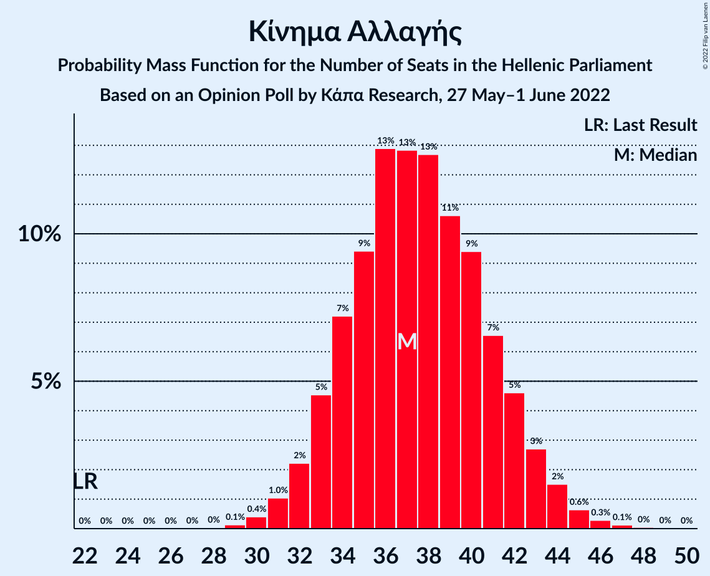

| Number of Seats | Probability | Accumulated | Special Marks |
|:---------------:|:-----------:|:-----------:|:-------------:|
| 22 | 0% | 100% | Last Result |
| 23 | 0% | 100% |  |
| 24 | 0% | 100% |  |
| 25 | 0% | 100% |  |
| 26 | 0% | 100% |  |
| 27 | 0% | 100% |  |
| 28 | 0% | 100% |  |
| 29 | 0.1% | 100% |  |
| 30 | 0.4% | 99.8% |  |
| 31 | 1.0% | 99.4% |  |
| 32 | 2% | 98% |  |
| 33 | 5% | 96% |  |
| 34 | 7% | 92% |  |
| 35 | 9% | 84% |  |
| 36 | 13% | 75% |  |
| 37 | 13% | 62% | Median |
| 38 | 13% | 49% |  |
| 39 | 11% | 37% |  |
| 40 | 9% | 26% |  |
| 41 | 7% | 17% |  |
| 42 | 5% | 10% |  |
| 43 | 3% | 5% |  |
| 44 | 2% | 3% |  |
| 45 | 0.6% | 1.1% |  |
| 46 | 0.3% | 0.5% |  |
| 47 | 0.1% | 0.2% |  |
| 48 | 0% | 0.1% |  |
| 49 | 0% | 0% |  |

### Κομμουνιστικό Κόμμα Ελλάδας

*For a full overview of the results for this party, see the [Κομμουνιστικό Κόμμα Ελλάδας](party-κομμουνιστικόκόμμαελλάδας.html) page.*

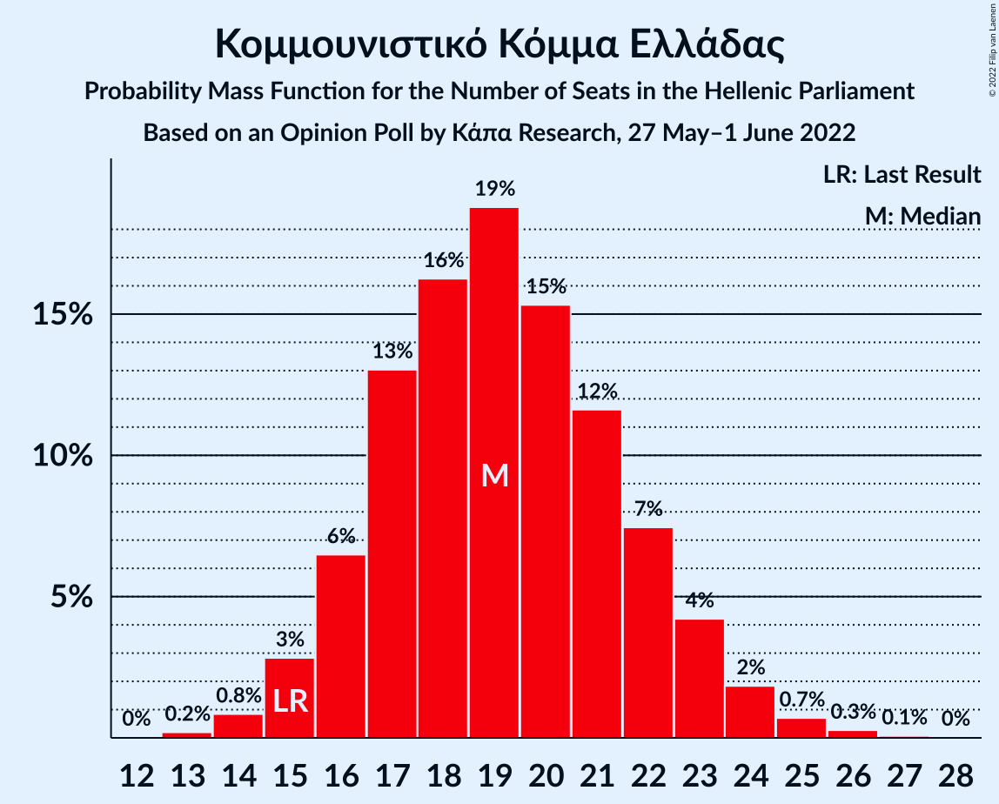

| Number of Seats | Probability | Accumulated | Special Marks |
|:---------------:|:-----------:|:-----------:|:-------------:|
| 13 | 0.2% | 100% |  |
| 14 | 0.8% | 99.8% |  |
| 15 | 3% | 98.9% | Last Result |
| 16 | 6% | 96% |  |
| 17 | 13% | 90% |  |
| 18 | 16% | 77% |  |
| 19 | 19% | 60% | Median |
| 20 | 15% | 42% |  |
| 21 | 12% | 26% |  |
| 22 | 7% | 15% |  |
| 23 | 4% | 7% |  |
| 24 | 2% | 3% |  |
| 25 | 0.7% | 1.1% |  |
| 26 | 0.3% | 0.4% |  |
| 27 | 0.1% | 0.1% |  |
| 28 | 0% | 0% |  |

### Ελληνική Λύση

*For a full overview of the results for this party, see the [Ελληνική Λύση](party-ελληνικήλύση.html) page.*

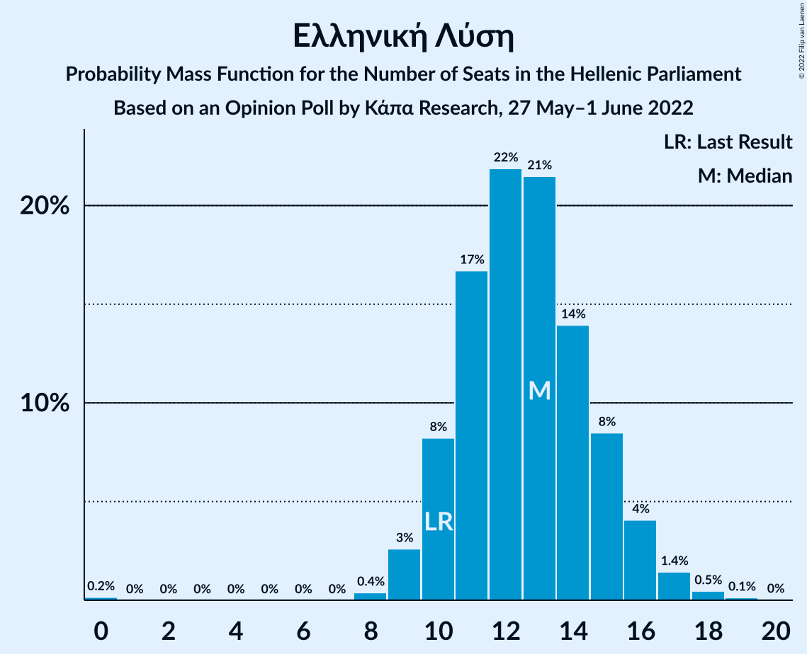

| Number of Seats | Probability | Accumulated | Special Marks |
|:---------------:|:-----------:|:-----------:|:-------------:|
| 0 | 0.2% | 100% |  |
| 1 | 0% | 99.8% |  |
| 2 | 0% | 99.8% |  |
| 3 | 0% | 99.8% |  |
| 4 | 0% | 99.8% |  |
| 5 | 0% | 99.8% |  |
| 6 | 0% | 99.8% |  |
| 7 | 0% | 99.8% |  |
| 8 | 0.4% | 99.8% |  |
| 9 | 3% | 99.5% |  |
| 10 | 8% | 97% | Last Result |
| 11 | 17% | 89% |  |
| 12 | 22% | 72% |  |
| 13 | 21% | 50% | Median |
| 14 | 14% | 29% |  |
| 15 | 8% | 15% |  |
| 16 | 4% | 6% |  |
| 17 | 1.4% | 2% |  |
| 18 | 0.5% | 0.6% |  |
| 19 | 0.1% | 0.2% |  |
| 20 | 0% | 0% |  |

### Μέτωπο Ευρωπαϊκής Ρεαλιστικής Ανυπακοής

*For a full overview of the results for this party, see the [Μέτωπο Ευρωπαϊκής Ρεαλιστικής Ανυπακοής](party-μέτωποευρωπαϊκήςρεαλιστικήςανυπακοής.html) page.*

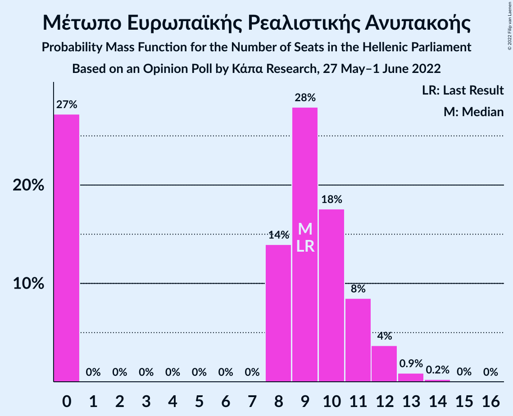

| Number of Seats | Probability | Accumulated | Special Marks |
|:---------------:|:-----------:|:-----------:|:-------------:|
| 0 | 27% | 100% |  |
| 1 | 0% | 73% |  |
| 2 | 0% | 73% |  |
| 3 | 0% | 73% |  |
| 4 | 0% | 73% |  |
| 5 | 0% | 73% |  |
| 6 | 0% | 73% |  |
| 7 | 0% | 73% |  |
| 8 | 14% | 73% |  |
| 9 | 28% | 59% | Last Result, Median |
| 10 | 18% | 31% |  |
| 11 | 8% | 13% |  |
| 12 | 4% | 5% |  |
| 13 | 0.9% | 1.2% |  |
| 14 | 0.2% | 0.3% |  |
| 15 | 0% | 0.1% |  |
| 16 | 0% | 0% |  |

## Coalitions

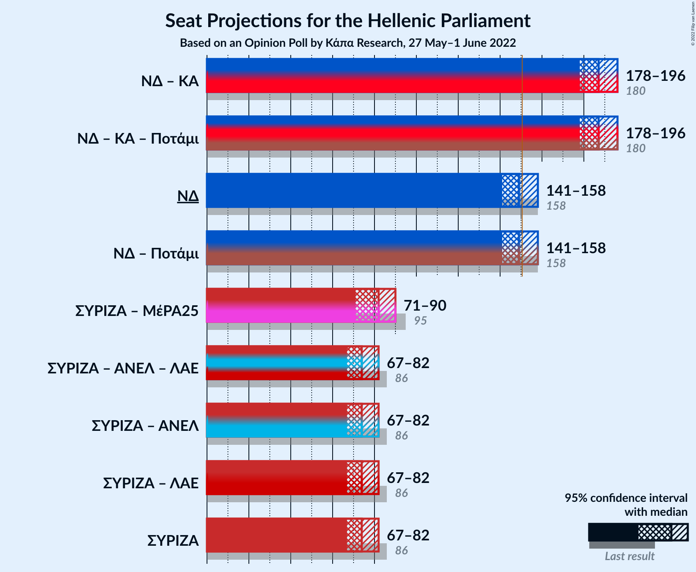

### Confidence Intervals

| Coalition | Last Result | Median | Majority? | 80% Confidence Interval | 90% Confidence Interval | 95% Confidence Interval | 99% Confidence Interval |
|:---------:|:-----------:|:------:|:---------:|:-----------------------:|:-----------------------:|:-----------------------:|:-----------------------:|
| Νέα Δημοκρατία – Κίνημα Αλλαγής | 180 | 187 | 100% | 181–193 | 180–195 | 178–196 | 176–200 |
| Νέα Δημοκρατία | 158 | 149 | 40% | 144–155 | 143–157 | 141–158 | 139–161 |
| Συνασπισμός Ριζοσπαστικής Αριστεράς – Μέτωπο Ευρωπαϊκής Ρεαλιστικής Ανυπακοής | 95 | 82 | 0% | 75–87 | 73–89 | 71–90 | 69–92 |
| Συνασπισμός Ριζοσπαστικής Αριστεράς | 86 | 74 | 0% | 69–79 | 68–81 | 67–82 | 65–85 |

### Νέα Δημοκρατία – Κίνημα Αλλαγής

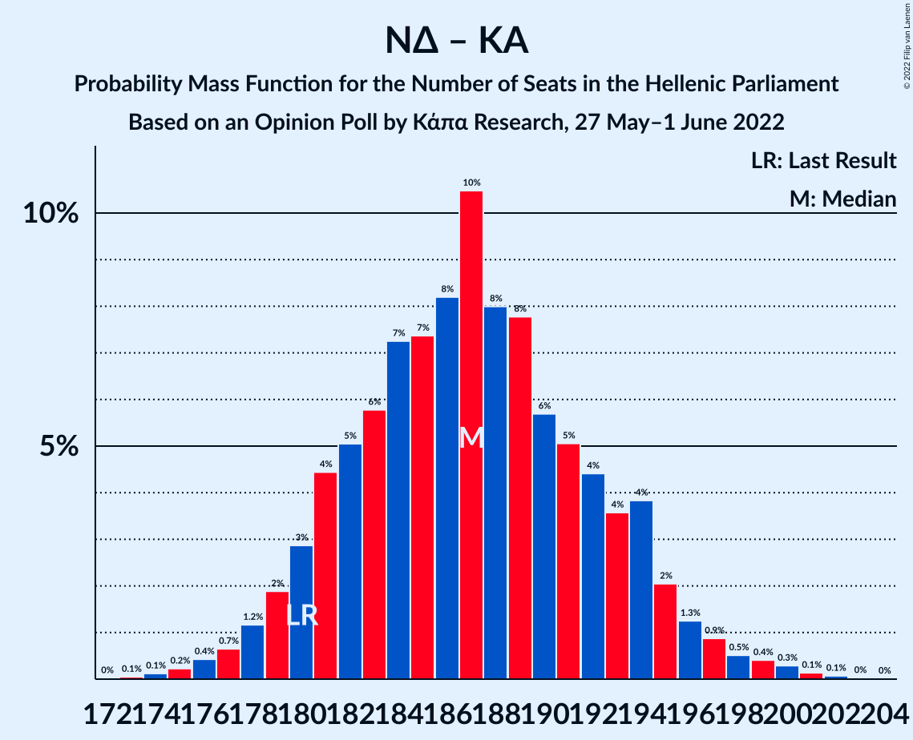

| Number of Seats | Probability | Accumulated | Special Marks |
|:---------------:|:-----------:|:-----------:|:-------------:|
| 173 | 0.1% | 100% |  |
| 174 | 0.1% | 99.9% |  |
| 175 | 0.2% | 99.8% |  |
| 176 | 0.4% | 99.6% |  |
| 177 | 0.7% | 99.1% |  |
| 178 | 1.2% | 98% |  |
| 179 | 2% | 97% |  |
| 180 | 3% | 95% | Last Result |
| 181 | 4% | 93% |  |
| 182 | 5% | 88% |  |
| 183 | 6% | 83% |  |
| 184 | 7% | 77% |  |
| 185 | 7% | 70% |  |
| 186 | 8% | 63% | Median |
| 187 | 10% | 54% |  |
| 188 | 8% | 44% |  |
| 189 | 8% | 36% |  |
| 190 | 6% | 28% |  |
| 191 | 5% | 23% |  |
| 192 | 4% | 17% |  |
| 193 | 4% | 13% |  |
| 194 | 4% | 9% |  |
| 195 | 2% | 6% |  |
| 196 | 1.3% | 4% |  |
| 197 | 0.9% | 2% |  |
| 198 | 0.5% | 1.5% |  |
| 199 | 0.4% | 1.0% |  |
| 200 | 0.3% | 0.5% |  |
| 201 | 0.1% | 0.3% |  |
| 202 | 0.1% | 0.1% |  |
| 203 | 0% | 0.1% |  |
| 204 | 0% | 0% |  |

### Νέα Δημοκρατία

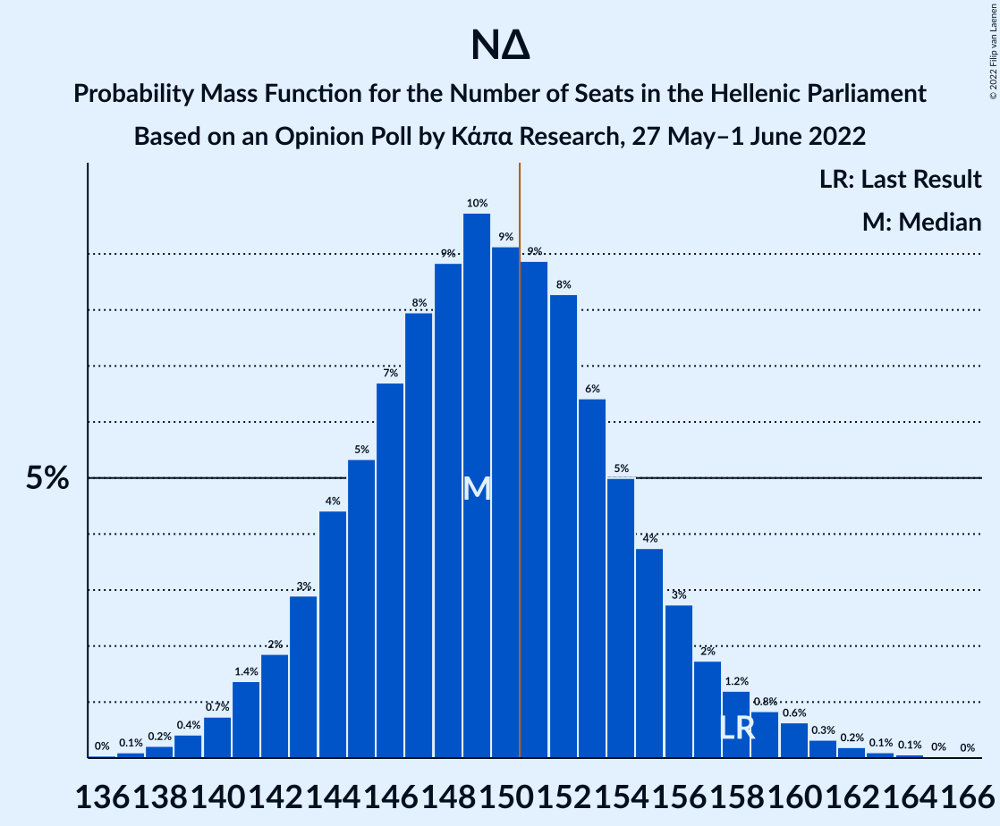

| Number of Seats | Probability | Accumulated | Special Marks |
|:---------------:|:-----------:|:-----------:|:-------------:|
| 136 | 0% | 100% |  |
| 137 | 0.1% | 99.9% |  |
| 138 | 0.2% | 99.8% |  |
| 139 | 0.4% | 99.6% |  |
| 140 | 0.7% | 99.2% |  |
| 141 | 1.4% | 98% |  |
| 142 | 2% | 97% |  |
| 143 | 3% | 95% |  |
| 144 | 4% | 92% |  |
| 145 | 5% | 88% |  |
| 146 | 7% | 83% |  |
| 147 | 8% | 76% |  |
| 148 | 9% | 68% |  |
| 149 | 10% | 59% | Median |
| 150 | 9% | 49% |  |
| 151 | 9% | 40% | Majority |
| 152 | 8% | 31% |  |
| 153 | 6% | 23% |  |
| 154 | 5% | 17% |  |
| 155 | 4% | 12% |  |
| 156 | 3% | 8% |  |
| 157 | 2% | 5% |  |
| 158 | 1.2% | 3% | Last Result |
| 159 | 0.8% | 2% |  |
| 160 | 0.6% | 1.4% |  |
| 161 | 0.3% | 0.7% |  |
| 162 | 0.2% | 0.4% |  |
| 163 | 0.1% | 0.2% |  |
| 164 | 0.1% | 0.1% |  |
| 165 | 0% | 0% |  |

### Συνασπισμός Ριζοσπαστικής Αριστεράς – Μέτωπο Ευρωπαϊκής Ρεαλιστικής Ανυπακοής

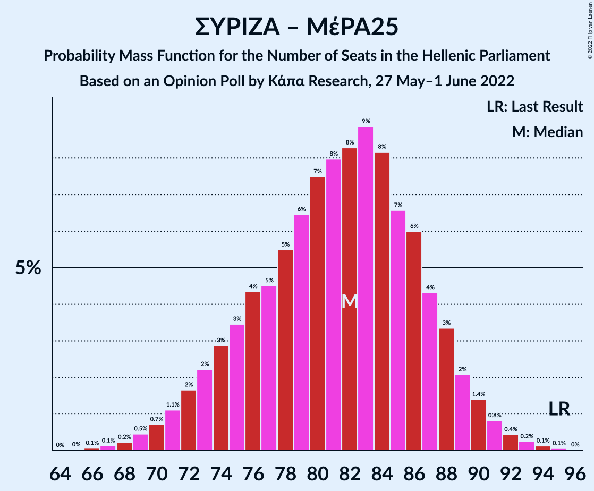

| Number of Seats | Probability | Accumulated | Special Marks |
|:---------------:|:-----------:|:-----------:|:-------------:|
| 66 | 0.1% | 100% |  |
| 67 | 0.1% | 99.9% |  |
| 68 | 0.2% | 99.8% |  |
| 69 | 0.5% | 99.5% |  |
| 70 | 0.7% | 99.1% |  |
| 71 | 1.1% | 98% |  |
| 72 | 2% | 97% |  |
| 73 | 2% | 96% |  |
| 74 | 3% | 93% |  |
| 75 | 3% | 90% |  |
| 76 | 4% | 87% |  |
| 77 | 5% | 83% |  |
| 78 | 5% | 78% |  |
| 79 | 6% | 73% |  |
| 80 | 7% | 66% |  |
| 81 | 8% | 59% |  |
| 82 | 8% | 51% |  |
| 83 | 9% | 42% | Median |
| 84 | 8% | 34% |  |
| 85 | 7% | 25% |  |
| 86 | 6% | 19% |  |
| 87 | 4% | 13% |  |
| 88 | 3% | 9% |  |
| 89 | 2% | 5% |  |
| 90 | 1.4% | 3% |  |
| 91 | 0.8% | 2% |  |
| 92 | 0.4% | 0.9% |  |
| 93 | 0.2% | 0.5% |  |
| 94 | 0.1% | 0.2% |  |
| 95 | 0.1% | 0.1% | Last Result |
| 96 | 0% | 0% |  |

### Συνασπισμός Ριζοσπαστικής Αριστεράς

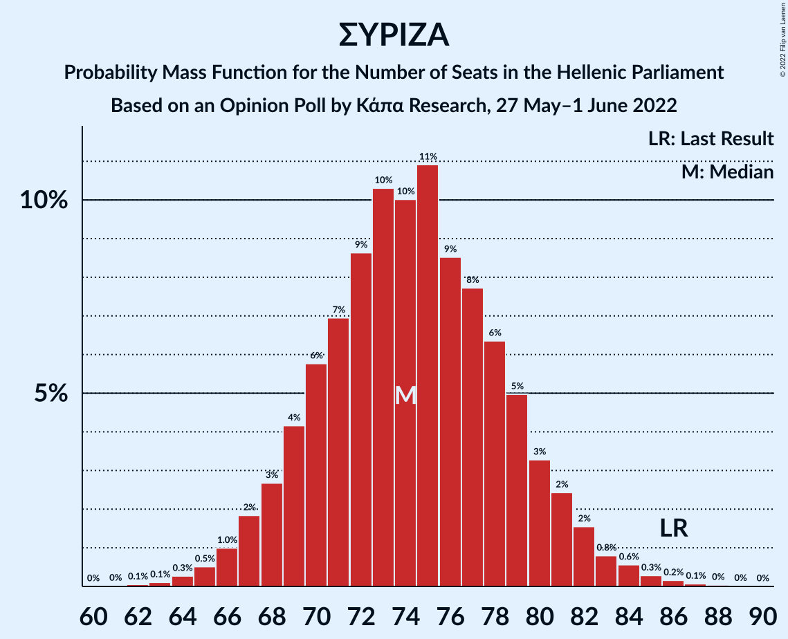

| Number of Seats | Probability | Accumulated | Special Marks |
|:---------------:|:-----------:|:-----------:|:-------------:|
| 62 | 0.1% | 100% |  |
| 63 | 0.1% | 99.9% |  |
| 64 | 0.3% | 99.8% |  |
| 65 | 0.5% | 99.5% |  |
| 66 | 1.0% | 99.0% |  |
| 67 | 2% | 98% |  |
| 68 | 3% | 96% |  |
| 69 | 4% | 94% |  |
| 70 | 6% | 89% |  |
| 71 | 7% | 84% |  |
| 72 | 9% | 77% |  |
| 73 | 10% | 68% |  |
| 74 | 10% | 58% | Median |
| 75 | 11% | 48% |  |
| 76 | 9% | 37% |  |
| 77 | 8% | 28% |  |
| 78 | 6% | 21% |  |
| 79 | 5% | 14% |  |
| 80 | 3% | 9% |  |
| 81 | 2% | 6% |  |
| 82 | 2% | 3% |  |
| 83 | 0.8% | 2% |  |
| 84 | 0.6% | 1.1% |  |
| 85 | 0.3% | 0.6% |  |
| 86 | 0.2% | 0.3% | Last Result |
| 87 | 0.1% | 0.1% |  |
| 88 | 0% | 0.1% |  |
| 89 | 0% | 0% |  |

## Technical Information

### Opinion Poll

+ **Polling firm:** Κάπα Research
+ **Commissioner(s):** —
+ **Fieldwork period:** 27 May–1 June 2022

### Calculations

+ **Sample size:** 1004
+ **Simulations done:** 1,048,576
+ **Error estimate:** 0.47%

