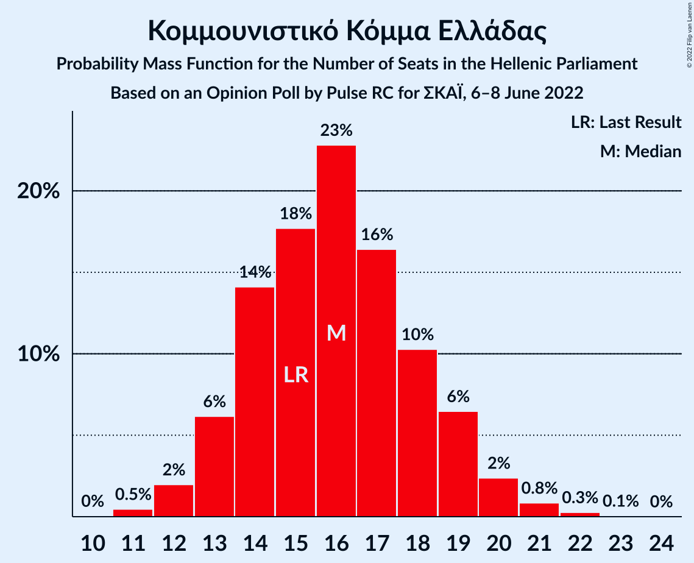

# Opinion Poll by Pulse RC for ΣΚΑΪ, 6–8 June 2022

<a href="#voting-intentions">Voting Intentions</a> | <a href="#seats">Seats</a> | <a href="#coalitions">Coalitions</a> | <a href="#technical-information">Technical Information</a>

## Voting Intentions

### Confidence Intervals

| Party | Last Result | Poll Result | 80% Confidence Interval | 90% Confidence Interval | 95% Confidence Interval | 99% Confidence Interval |
|:-----:|:-----------:|:-----------:|:-----------------------:|:-----------------------:|:-----------------------:|:-----------------------:|
| Νέα Δημοκρατία | 39.8% | 36.4% | 34.6–38.2% |34.2–38.7% |33.7–39.2% |32.9–40.0% |
| Συνασπισμός Ριζοσπαστικής Αριστεράς | 31.5% | 27.3% | 25.7–29.0% |25.2–29.5% |24.8–29.9% |24.1–30.7% |
| Κίνημα Αλλαγής | 8.1% | 15.3% | 14.1–16.8% |13.7–17.1% |13.4–17.5% |12.8–18.2% |
| Κομμουνιστικό Κόμμα Ελλάδας | 5.3% | 5.7% | 4.9–6.7% |4.7–7.0% |4.5–7.2% |4.2–7.7% |
| Ελληνική Λύση | 3.7% | 4.5% | 3.8–5.3% |3.6–5.6% |3.4–5.8% |3.1–6.2% |
| Μέτωπο Ευρωπαϊκής Ρεαλιστικής Ανυπακοής | 3.4% | 2.8% | 2.3–3.5% |2.1–3.7% |2.0–3.9% |1.8–4.3% |

*Note:* The poll result column reflects the actual value used in the calculations. Published results may vary slightly, and in addition be rounded to fewer digits.

## Seats

### Confidence Intervals

| Party | Last Result | Median | 80% Confidence Interval | 90% Confidence Interval | 95% Confidence Interval | 99% Confidence Interval |
|:-----:|:-----------:|:------:|:-----------------------:|:-----------------------:|:-----------------------:|:-----------------------:|
| <a href="#νέα-δημοκρατία">Νέα Δημοκρατία</a> | 158 | 150 | 145–156 |143–157 |142–158 |140–161 |
| <a href="#συνασπισμός-ριζοσπαστικής-αριστεράς">Συνασπισμός Ριζοσπαστικής Αριστεράς</a> | 86 | 75 | 71–80 |69–81 |68–83 |66–85 |
| <a href="#κίνημα-αλλαγής">Κίνημα Αλλαγής</a> | 22 | 42 | 39–46 |38–47 |37–48 |35–50 |
| <a href="#κομμουνιστικό-κόμμα-ελλάδας">Κομμουνιστικό Κόμμα Ελλάδας</a> | 15 | 16 | 14–19 |13–19 |13–20 |11–21 |
| <a href="#ελληνική-λύση">Ελληνική Λύση</a> | 10 | 12 | 10–15 |10–15 |9–16 |9–17 |
| <a href="#μέτωπο-ευρωπαϊκής-ρεαλιστικής-ανυπακοής">Μέτωπο Ευρωπαϊκής Ρεαλιστικής Ανυπακοής</a> | 9 | 0 | 0–10 |0–10 |0–11 |0–12 |

### Νέα Δημοκρατία

*For a full overview of the results for this party, see the [Νέα Δημοκρατία](party-νέαδημοκρατία.html) page.*

| Number of Seats | Probability | Accumulated | Special Marks |
|:---------------:|:-----------:|:-----------:|:-------------:|
| 137 | 0% | 100% |  |
| 138 | 0.1% | 99.9% |  |
| 139 | 0.2% | 99.8% |  |
| 140 | 0.4% | 99.6% |  |
| 141 | 0.8% | 99.3% |  |
| 142 | 1.4% | 98% |  |
| 143 | 2% | 97% |  |
| 144 | 3% | 95% |  |
| 145 | 4% | 92% |  |
| 146 | 5% | 88% |  |
| 147 | 7% | 82% |  |
| 148 | 8% | 75% |  |
| 149 | 9% | 68% |  |
| 150 | 10% | 59% | Median |
| 151 | 10% | 49% | Majority |
| 152 | 8% | 39% |  |
| 153 | 8% | 30% |  |
| 154 | 7% | 22% |  |
| 155 | 5% | 15% |  |
| 156 | 4% | 10% |  |
| 157 | 3% | 7% |  |
| 158 | 2% | 4% | Last Result |
| 159 | 1.0% | 2% |  |
| 160 | 0.6% | 1.2% |  |
| 161 | 0.3% | 0.6% |  |
| 162 | 0.2% | 0.3% |  |
| 163 | 0.1% | 0.2% |  |
| 164 | 0% | 0.1% |  |
| 165 | 0% | 0% |  |

### Συνασπισμός Ριζοσπαστικής Αριστεράς

*For a full overview of the results for this party, see the [Συνασπισμός Ριζοσπαστικής Αριστεράς](party-συνασπισμόςριζοσπαστικήςαριστεράς.html) page.*

| Number of Seats | Probability | Accumulated | Special Marks |
|:---------------:|:-----------:|:-----------:|:-------------:|
| 63 | 0% | 100% |  |
| 64 | 0.1% | 99.9% |  |
| 65 | 0.2% | 99.9% |  |
| 66 | 0.6% | 99.7% |  |
| 67 | 0.8% | 99.1% |  |
| 68 | 2% | 98% |  |
| 69 | 2% | 97% |  |
| 70 | 4% | 94% |  |
| 71 | 6% | 90% |  |
| 72 | 8% | 84% |  |
| 73 | 9% | 77% |  |
| 74 | 11% | 68% |  |
| 75 | 10% | 57% | Median |
| 76 | 10% | 47% |  |
| 77 | 10% | 37% |  |
| 78 | 6% | 27% |  |
| 79 | 8% | 21% |  |
| 80 | 4% | 12% |  |
| 81 | 4% | 8% |  |
| 82 | 2% | 5% |  |
| 83 | 1.0% | 3% |  |
| 84 | 0.9% | 1.5% |  |
| 85 | 0.2% | 0.6% |  |
| 86 | 0.2% | 0.4% | Last Result |
| 87 | 0.1% | 0.1% |  |
| 88 | 0% | 0.1% |  |
| 89 | 0% | 0% |  |

### Κίνημα Αλλαγής

*For a full overview of the results for this party, see the [Κίνημα Αλλαγής](party-κίνημααλλαγής.html) page.*

| Number of Seats | Probability | Accumulated | Special Marks |
|:---------------:|:-----------:|:-----------:|:-------------:|
| 22 | 0% | 100% | Last Result |
| 23 | 0% | 100% |  |
| 24 | 0% | 100% |  |
| 25 | 0% | 100% |  |
| 26 | 0% | 100% |  |
| 27 | 0% | 100% |  |
| 28 | 0% | 100% |  |
| 29 | 0% | 100% |  |
| 30 | 0% | 100% |  |
| 31 | 0% | 100% |  |
| 32 | 0% | 100% |  |
| 33 | 0% | 100% |  |
| 34 | 0.2% | 99.9% |  |
| 35 | 0.5% | 99.8% |  |
| 36 | 1.2% | 99.3% |  |
| 37 | 3% | 98% |  |
| 38 | 5% | 96% |  |
| 39 | 7% | 91% |  |
| 40 | 10% | 84% |  |
| 41 | 11% | 74% |  |
| 42 | 14% | 63% | Median |
| 43 | 13% | 49% |  |
| 44 | 12% | 36% |  |
| 45 | 10% | 23% |  |
| 46 | 6% | 14% |  |
| 47 | 3% | 8% |  |
| 48 | 2% | 5% |  |
| 49 | 1.1% | 2% |  |
| 50 | 0.6% | 1.0% |  |
| 51 | 0.3% | 0.4% |  |
| 52 | 0.1% | 0.2% |  |
| 53 | 0% | 0.1% |  |
| 54 | 0% | 0% |  |

### Κομμουνιστικό Κόμμα Ελλάδας

*For a full overview of the results for this party, see the [Κομμουνιστικό Κόμμα Ελλάδας](party-κομμουνιστικόκόμμαελλάδας.html) page.*

| Number of Seats | Probability | Accumulated | Special Marks |
|:---------------:|:-----------:|:-----------:|:-------------:|
| 10 | 0% | 100% |  |
| 11 | 0.5% | 99.9% |  |
| 12 | 2% | 99.5% |  |
| 13 | 6% | 98% |  |
| 14 | 14% | 91% |  |
| 15 | 18% | 77% | Last Result |
| 16 | 23% | 60% | Median |
| 17 | 16% | 37% |  |
| 18 | 10% | 20% |  |
| 19 | 6% | 10% |  |
| 20 | 2% | 4% |  |
| 21 | 0.8% | 1.2% |  |
| 22 | 0.3% | 0.3% |  |
| 23 | 0.1% | 0.1% |  |
| 24 | 0% | 0% |  |

### Ελληνική Λύση

*For a full overview of the results for this party, see the [Ελληνική Λύση](party-ελληνικήλύση.html) page.*

| Number of Seats | Probability | Accumulated | Special Marks |
|:---------------:|:-----------:|:-----------:|:-------------:|
| 0 | 0.2% | 100% |  |
| 1 | 0% | 99.8% |  |
| 2 | 0% | 99.8% |  |
| 3 | 0% | 99.8% |  |
| 4 | 0% | 99.8% |  |
| 5 | 0% | 99.8% |  |
| 6 | 0% | 99.8% |  |
| 7 | 0% | 99.8% |  |
| 8 | 0.2% | 99.8% |  |
| 9 | 2% | 99.6% |  |
| 10 | 8% | 97% | Last Result |
| 11 | 18% | 89% |  |
| 12 | 22% | 72% | Median |
| 13 | 22% | 49% |  |
| 14 | 15% | 27% |  |
| 15 | 8% | 12% |  |
| 16 | 3% | 5% |  |
| 17 | 1.1% | 1.4% |  |
| 18 | 0.3% | 0.3% |  |
| 19 | 0.1% | 0.1% |  |
| 20 | 0% | 0% |  |

### Μέτωπο Ευρωπαϊκής Ρεαλιστικής Ανυπακοής

*For a full overview of the results for this party, see the [Μέτωπο Ευρωπαϊκής Ρεαλιστικής Ανυπακοής](party-μέτωποευρωπαϊκήςρεαλιστικήςανυπακοής.html) page.*

| Number of Seats | Probability | Accumulated | Special Marks |
|:---------------:|:-----------:|:-----------:|:-------------:|
| 0 | 62% | 100% | Median |
| 1 | 0% | 38% |  |
| 2 | 0% | 38% |  |
| 3 | 0% | 38% |  |
| 4 | 0% | 38% |  |
| 5 | 0% | 38% |  |
| 6 | 0% | 38% |  |
| 7 | 0% | 38% |  |
| 8 | 9% | 38% |  |
| 9 | 19% | 29% | Last Result |
| 10 | 8% | 11% |  |
| 11 | 2% | 3% |  |
| 12 | 0.5% | 0.6% |  |
| 13 | 0.1% | 0.1% |  |
| 14 | 0% | 0% |  |

## Coalitions

### Confidence Intervals

| Coalition | Last Result | Median | Majority? | 80% Confidence Interval | 90% Confidence Interval | 95% Confidence Interval | 99% Confidence Interval |
|:---------:|:-----------:|:------:|:---------:|:-----------------------:|:-----------------------:|:-----------------------:|:-----------------------:|
| Νέα Δημοκρατία – Κίνημα Αλλαγής | 180 | 193 | 100% | 187–199 | 185–200 | 184–201 | 181–204 |
| Νέα Δημοκρατία | 158 | 150 | 49% | 145–156 | 143–157 | 142–158 | 140–161 |
| Συνασπισμός Ριζοσπαστικής Αριστεράς – Μέτωπο Ευρωπαϊκής Ρεαλιστικής Ανυπακοής | 95 | 79 | 0% | 73–85 | 71–86 | 70–88 | 68–91 |
| Συνασπισμός Ριζοσπαστικής Αριστεράς | 86 | 75 | 0% | 71–80 | 69–81 | 68–83 | 66–85 |

### Νέα Δημοκρατία – Κίνημα Αλλαγής

| Number of Seats | Probability | Accumulated | Special Marks |
|:---------------:|:-----------:|:-----------:|:-------------:|
| 178 | 0% | 100% |  |
| 179 | 0.1% | 99.9% |  |
| 180 | 0.2% | 99.9% | Last Result |
| 181 | 0.3% | 99.7% |  |
| 182 | 0.5% | 99.4% |  |
| 183 | 1.1% | 98.9% |  |
| 184 | 1.5% | 98% |  |
| 185 | 2% | 96% |  |
| 186 | 3% | 94% |  |
| 187 | 4% | 91% |  |
| 188 | 5% | 88% |  |
| 189 | 6% | 82% |  |
| 190 | 8% | 77% |  |
| 191 | 8% | 69% |  |
| 192 | 8% | 61% | Median |
| 193 | 9% | 53% |  |
| 194 | 9% | 44% |  |
| 195 | 8% | 36% |  |
| 196 | 6% | 28% |  |
| 197 | 6% | 21% |  |
| 198 | 5% | 15% |  |
| 199 | 4% | 11% |  |
| 200 | 3% | 7% |  |
| 201 | 2% | 4% |  |
| 202 | 1.2% | 2% |  |
| 203 | 0.5% | 1.1% |  |
| 204 | 0.3% | 0.6% |  |
| 205 | 0.2% | 0.3% |  |
| 206 | 0.1% | 0.1% |  |
| 207 | 0% | 0.1% |  |
| 208 | 0% | 0% |  |

### Νέα Δημοκρατία

| Number of Seats | Probability | Accumulated | Special Marks |
|:---------------:|:-----------:|:-----------:|:-------------:|
| 137 | 0% | 100% |  |
| 138 | 0.1% | 99.9% |  |
| 139 | 0.2% | 99.8% |  |
| 140 | 0.4% | 99.6% |  |
| 141 | 0.8% | 99.3% |  |
| 142 | 1.4% | 98% |  |
| 143 | 2% | 97% |  |
| 144 | 3% | 95% |  |
| 145 | 4% | 92% |  |
| 146 | 5% | 88% |  |
| 147 | 7% | 82% |  |
| 148 | 8% | 75% |  |
| 149 | 9% | 68% |  |
| 150 | 10% | 59% | Median |
| 151 | 10% | 49% | Majority |
| 152 | 8% | 39% |  |
| 153 | 8% | 30% |  |
| 154 | 7% | 22% |  |
| 155 | 5% | 15% |  |
| 156 | 4% | 10% |  |
| 157 | 3% | 7% |  |
| 158 | 2% | 4% | Last Result |
| 159 | 1.0% | 2% |  |
| 160 | 0.6% | 1.2% |  |
| 161 | 0.3% | 0.6% |  |
| 162 | 0.2% | 0.3% |  |
| 163 | 0.1% | 0.2% |  |
| 164 | 0% | 0.1% |  |
| 165 | 0% | 0% |  |

### Συνασπισμός Ριζοσπαστικής Αριστεράς – Μέτωπο Ευρωπαϊκής Ρεαλιστικής Ανυπακοής

| Number of Seats | Probability | Accumulated | Special Marks |
|:---------------:|:-----------:|:-----------:|:-------------:|
| 66 | 0.1% | 100% |  |
| 67 | 0.2% | 99.9% |  |
| 68 | 0.3% | 99.7% |  |
| 69 | 0.9% | 99.4% |  |
| 70 | 1.4% | 98% |  |
| 71 | 2% | 97% |  |
| 72 | 4% | 95% |  |
| 73 | 3% | 91% |  |
| 74 | 8% | 88% |  |
| 75 | 5% | 80% | Median |
| 76 | 8% | 74% |  |
| 77 | 9% | 66% |  |
| 78 | 5% | 57% |  |
| 79 | 12% | 53% |  |
| 80 | 3% | 40% |  |
| 81 | 10% | 37% |  |
| 82 | 5% | 27% |  |
| 83 | 4% | 22% |  |
| 84 | 7% | 18% |  |
| 85 | 0.9% | 11% |  |
| 86 | 5% | 10% |  |
| 87 | 0.4% | 4% |  |
| 88 | 2% | 4% |  |
| 89 | 0.6% | 2% |  |
| 90 | 0.4% | 1.0% |  |
| 91 | 0.4% | 0.6% |  |
| 92 | 0% | 0.2% |  |
| 93 | 0.1% | 0.1% |  |
| 94 | 0% | 0% |  |
| 95 | 0% | 0% | Last Result |

### Συνασπισμός Ριζοσπαστικής Αριστεράς

| Number of Seats | Probability | Accumulated | Special Marks |
|:---------------:|:-----------:|:-----------:|:-------------:|
| 63 | 0% | 100% |  |
| 64 | 0.1% | 99.9% |  |
| 65 | 0.2% | 99.9% |  |
| 66 | 0.6% | 99.7% |  |
| 67 | 0.8% | 99.1% |  |
| 68 | 2% | 98% |  |
| 69 | 2% | 97% |  |
| 70 | 4% | 94% |  |
| 71 | 6% | 90% |  |
| 72 | 8% | 84% |  |
| 73 | 9% | 77% |  |
| 74 | 11% | 68% |  |
| 75 | 10% | 57% | Median |
| 76 | 10% | 47% |  |
| 77 | 10% | 37% |  |
| 78 | 6% | 27% |  |
| 79 | 8% | 21% |  |
| 80 | 4% | 12% |  |
| 81 | 4% | 8% |  |
| 82 | 2% | 5% |  |
| 83 | 1.0% | 3% |  |
| 84 | 0.9% | 1.5% |  |
| 85 | 0.2% | 0.6% |  |
| 86 | 0.2% | 0.4% | Last Result |
| 87 | 0.1% | 0.1% |  |
| 88 | 0% | 0.1% |  |
| 89 | 0% | 0% |  |

## Technical Information

### Opinion Poll

+ **Polling firm:** Pulse RC
+ **Commissioner(s):** ΣΚΑΪ
+ **Fieldwork period:** 6–8 June 2022

### Calculations

+ **Sample size:** 1206
+ **Simulations done:** 1,048,576
+ **Error estimate:** 0.62%

