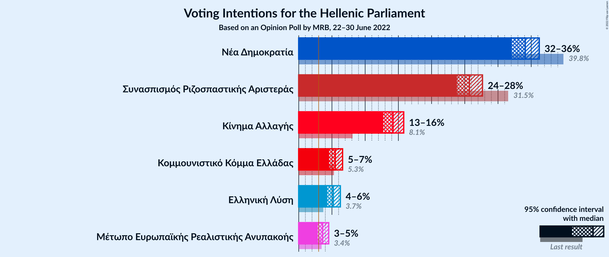
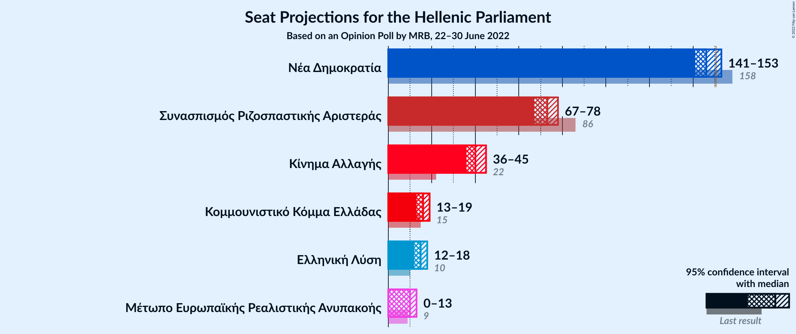

# Opinion Poll by MRB, 22–30 June 2022

<a href="#voting-intentions">Voting Intentions</a> | <a href="#seats">Seats</a> | <a href="#coalitions">Coalitions</a> | <a href="#technical-information">Technical Information</a>

## Voting Intentions

### Confidence Intervals

| Party | Last Result | Poll Result | 80% Confidence Interval | 90% Confidence Interval | 95% Confidence Interval | 99% Confidence Interval |
|:-----:|:-----------:|:-----------:|:-----------------------:|:-----------------------:|:-----------------------:|:-----------------------:|
| Νέα Δημοκρατία | 39.8% | 34.1% | 32.8–35.5% |32.4–35.9% |32.1–36.2% |31.4–36.9% |
| Συνασπισμός Ριζοσπαστικής Αριστεράς | 31.5% | 25.7% | 24.5–27.0% |24.1–27.4% |23.8–27.7% |23.2–28.3% |
| Κίνημα Αλλαγής | 8.1% | 14.2% | 13.2–15.3% |13.0–15.5% |12.7–15.8% |12.3–16.3% |
| Κομμουνιστικό Κόμμα Ελλάδας | 5.3% | 5.5% | 4.9–6.2% |4.7–6.4% |4.6–6.6% |4.3–7.0% |
| Ελληνική Λύση | 3.7% | 5.2% | 4.6–5.9% |4.5–6.1% |4.3–6.3% |4.0–6.6% |
| Μέτωπο Ευρωπαϊκής Ρεαλιστικής Ανυπακοής | 3.4% | 3.6% | 3.1–4.2% |3.0–4.4% |2.9–4.5% |2.7–4.8% |

*Note:* The poll result column reflects the actual value used in the calculations. Published results may vary slightly, and in addition be rounded to fewer digits.

## Seats

### Confidence Intervals

| Party | Last Result | Median | 80% Confidence Interval | 90% Confidence Interval | 95% Confidence Interval | 99% Confidence Interval |
|:-----:|:-----------:|:------:|:-----------------------:|:-----------------------:|:-----------------------:|:-----------------------:|
| <a href="#νέα-δημοκρατία">Νέα Δημοκρατία</a> | 158 | 146 | 143–150 |142–152 |141–153 |139–155 |
| <a href="#συνασπισμός-ριζοσπαστικής-αριστεράς">Συνασπισμός Ριζοσπαστικής Αριστεράς</a> | 86 | 73 | 69–76 |68–77 |67–78 |66–80 |
| <a href="#κίνημα-αλλαγής">Κίνημα Αλλαγής</a> | 22 | 40 | 37–43 |37–44 |36–45 |35–46 |
| <a href="#κομμουνιστικό-κόμμα-ελλάδας">Κομμουνιστικό Κόμμα Ελλάδας</a> | 15 | 16 | 14–18 |13–18 |13–19 |12–20 |
| <a href="#ελληνική-λύση">Ελληνική Λύση</a> | 10 | 15 | 13–17 |13–17 |12–18 |11–19 |
| <a href="#μέτωπο-ευρωπαϊκής-ρεαλιστικής-ανυπακοής">Μέτωπο Ευρωπαϊκής Ρεαλιστικής Ανυπακοής</a> | 9 | 10 | 9–12 |0–12 |0–13 |0–14 |

### Νέα Δημοκρατία

*For a full overview of the results for this party, see the [Νέα Δημοκρατία](party-νέαδημοκρατία.html) page.*

| Number of Seats | Probability | Accumulated | Special Marks |
|:---------------:|:-----------:|:-----------:|:-------------:|
| 137 | 0.1% | 100% |  |
| 138 | 0.2% | 99.9% |  |
| 139 | 0.5% | 99.7% |  |
| 140 | 1.2% | 99.2% |  |
| 141 | 2% | 98% |  |
| 142 | 4% | 95% |  |
| 143 | 7% | 91% |  |
| 144 | 11% | 85% |  |
| 145 | 10% | 74% |  |
| 146 | 14% | 64% | Median |
| 147 | 15% | 50% |  |
| 148 | 10% | 35% |  |
| 149 | 9% | 26% |  |
| 150 | 7% | 17% |  |
| 151 | 4% | 10% | Majority |
| 152 | 2% | 5% |  |
| 153 | 1.5% | 3% |  |
| 154 | 0.7% | 1.5% |  |
| 155 | 0.4% | 0.7% |  |
| 156 | 0.2% | 0.4% |  |
| 157 | 0.1% | 0.2% |  |
| 158 | 0% | 0.1% | Last Result |
| 159 | 0% | 0% |  |

### Συνασπισμός Ριζοσπαστικής Αριστεράς

*For a full overview of the results for this party, see the [Συνασπισμός Ριζοσπαστικής Αριστεράς](party-συνασπισμόςριζοσπαστικήςαριστεράς.html) page.*

| Number of Seats | Probability | Accumulated | Special Marks |
|:---------------:|:-----------:|:-----------:|:-------------:|
| 64 | 0.1% | 100% |  |
| 65 | 0.2% | 99.9% |  |
| 66 | 0.7% | 99.7% |  |
| 67 | 2% | 99.0% |  |
| 68 | 3% | 97% |  |
| 69 | 6% | 94% |  |
| 70 | 8% | 88% |  |
| 71 | 13% | 80% |  |
| 72 | 13% | 67% |  |
| 73 | 14% | 54% | Median |
| 74 | 13% | 40% |  |
| 75 | 9% | 26% |  |
| 76 | 8% | 17% |  |
| 77 | 4% | 9% |  |
| 78 | 2% | 5% |  |
| 79 | 1.3% | 2% |  |
| 80 | 0.6% | 1.1% |  |
| 81 | 0.3% | 0.5% |  |
| 82 | 0.1% | 0.2% |  |
| 83 | 0.1% | 0.1% |  |
| 84 | 0% | 0% |  |
| 85 | 0% | 0% |  |
| 86 | 0% | 0% | Last Result |

### Κίνημα Αλλαγής

*For a full overview of the results for this party, see the [Κίνημα Αλλαγής](party-κίνημααλλαγής.html) page.*

| Number of Seats | Probability | Accumulated | Special Marks |
|:---------------:|:-----------:|:-----------:|:-------------:|
| 22 | 0% | 100% | Last Result |
| 23 | 0% | 100% |  |
| 24 | 0% | 100% |  |
| 25 | 0% | 100% |  |
| 26 | 0% | 100% |  |
| 27 | 0% | 100% |  |
| 28 | 0% | 100% |  |
| 29 | 0% | 100% |  |
| 30 | 0% | 100% |  |
| 31 | 0% | 100% |  |
| 32 | 0% | 100% |  |
| 33 | 0.1% | 100% |  |
| 34 | 0.3% | 99.9% |  |
| 35 | 1.0% | 99.7% |  |
| 36 | 3% | 98.7% |  |
| 37 | 6% | 96% |  |
| 38 | 11% | 90% |  |
| 39 | 15% | 78% |  |
| 40 | 17% | 63% | Median |
| 41 | 16% | 46% |  |
| 42 | 14% | 29% |  |
| 43 | 8% | 16% |  |
| 44 | 4% | 7% |  |
| 45 | 2% | 3% |  |
| 46 | 1.0% | 1.3% |  |
| 47 | 0.3% | 0.4% |  |
| 48 | 0.1% | 0.1% |  |
| 49 | 0% | 0% |  |

### Κομμουνιστικό Κόμμα Ελλάδας

*For a full overview of the results for this party, see the [Κομμουνιστικό Κόμμα Ελλάδας](party-κομμουνιστικόκόμμαελλάδας.html) page.*

| Number of Seats | Probability | Accumulated | Special Marks |
|:---------------:|:-----------:|:-----------:|:-------------:|
| 11 | 0.1% | 100% |  |
| 12 | 0.9% | 99.9% |  |
| 13 | 5% | 99.0% |  |
| 14 | 14% | 94% |  |
| 15 | 25% | 80% | Last Result |
| 16 | 27% | 55% | Median |
| 17 | 17% | 28% |  |
| 18 | 8% | 11% |  |
| 19 | 2% | 3% |  |
| 20 | 0.6% | 0.7% |  |
| 21 | 0.1% | 0.1% |  |
| 22 | 0% | 0% |  |

### Ελληνική Λύση

*For a full overview of the results for this party, see the [Ελληνική Λύση](party-ελληνικήλύση.html) page.*

| Number of Seats | Probability | Accumulated | Special Marks |
|:---------------:|:-----------:|:-----------:|:-------------:|
| 10 | 0% | 100% | Last Result |
| 11 | 0.5% | 100% |  |
| 12 | 4% | 99.5% |  |
| 13 | 13% | 96% |  |
| 14 | 25% | 83% |  |
| 15 | 27% | 58% | Median |
| 16 | 19% | 31% |  |
| 17 | 8% | 12% |  |
| 18 | 3% | 3% |  |
| 19 | 0.6% | 0.8% |  |
| 20 | 0.1% | 0.1% |  |
| 21 | 0% | 0% |  |

### Μέτωπο Ευρωπαϊκής Ρεαλιστικής Ανυπακοής

*For a full overview of the results for this party, see the [Μέτωπο Ευρωπαϊκής Ρεαλιστικής Ανυπακοής](party-μέτωποευρωπαϊκήςρεαλιστικήςανυπακοής.html) page.*

| Number of Seats | Probability | Accumulated | Special Marks |
|:---------------:|:-----------:|:-----------:|:-------------:|
| 0 | 6% | 100% |  |
| 1 | 0% | 94% |  |
| 2 | 0% | 94% |  |
| 3 | 0% | 94% |  |
| 4 | 0% | 94% |  |
| 5 | 0% | 94% |  |
| 6 | 0% | 94% |  |
| 7 | 0% | 94% |  |
| 8 | 0.5% | 94% |  |
| 9 | 19% | 94% | Last Result |
| 10 | 33% | 75% | Median |
| 11 | 26% | 41% |  |
| 12 | 11% | 15% |  |
| 13 | 3% | 4% |  |
| 14 | 0.5% | 0.6% |  |
| 15 | 0.1% | 0.1% |  |
| 16 | 0% | 0% |  |

## Coalitions

### Confidence Intervals

| Coalition | Last Result | Median | Majority? | 80% Confidence Interval | 90% Confidence Interval | 95% Confidence Interval | 99% Confidence Interval |
|:---------:|:-----------:|:------:|:---------:|:-----------------------:|:-----------------------:|:-----------------------:|:-----------------------:|
| Νέα Δημοκρατία – Κίνημα Αλλαγής | 180 | 187 | 100% | 183–191 | 182–192 | 181–194 | 179–197 |
| Νέα Δημοκρατία | 158 | 146 | 10% | 143–150 | 142–152 | 141–153 | 139–155 |
| Συνασπισμός Ριζοσπαστικής Αριστεράς – Μέτωπο Ευρωπαϊκής Ρεαλιστικής Ανυπακοής | 95 | 83 | 0% | 79–86 | 77–88 | 75–89 | 72–90 |
| Συνασπισμός Ριζοσπαστικής Αριστεράς | 86 | 73 | 0% | 69–76 | 68–77 | 67–78 | 66–80 |

### Νέα Δημοκρατία – Κίνημα Αλλαγής

| Number of Seats | Probability | Accumulated | Special Marks |
|:---------------:|:-----------:|:-----------:|:-------------:|
| 177 | 0.1% | 100% |  |
| 178 | 0.2% | 99.9% |  |
| 179 | 0.5% | 99.7% |  |
| 180 | 2% | 99.2% | Last Result |
| 181 | 2% | 98% |  |
| 182 | 3% | 96% |  |
| 183 | 7% | 92% |  |
| 184 | 8% | 85% |  |
| 185 | 10% | 77% |  |
| 186 | 14% | 66% | Median |
| 187 | 12% | 52% |  |
| 188 | 12% | 40% |  |
| 189 | 9% | 28% |  |
| 190 | 6% | 19% |  |
| 191 | 6% | 13% |  |
| 192 | 3% | 7% |  |
| 193 | 2% | 5% |  |
| 194 | 1.1% | 3% |  |
| 195 | 0.8% | 2% |  |
| 196 | 0.4% | 0.9% |  |
| 197 | 0.2% | 0.5% |  |
| 198 | 0.1% | 0.3% |  |
| 199 | 0.1% | 0.1% |  |
| 200 | 0% | 0% |  |

### Νέα Δημοκρατία

| Number of Seats | Probability | Accumulated | Special Marks |
|:---------------:|:-----------:|:-----------:|:-------------:|
| 137 | 0.1% | 100% |  |
| 138 | 0.2% | 99.9% |  |
| 139 | 0.5% | 99.7% |  |
| 140 | 1.2% | 99.2% |  |
| 141 | 2% | 98% |  |
| 142 | 4% | 95% |  |
| 143 | 7% | 91% |  |
| 144 | 11% | 85% |  |
| 145 | 10% | 74% |  |
| 146 | 14% | 64% | Median |
| 147 | 15% | 50% |  |
| 148 | 10% | 35% |  |
| 149 | 9% | 26% |  |
| 150 | 7% | 17% |  |
| 151 | 4% | 10% | Majority |
| 152 | 2% | 5% |  |
| 153 | 1.5% | 3% |  |
| 154 | 0.7% | 1.5% |  |
| 155 | 0.4% | 0.7% |  |
| 156 | 0.2% | 0.4% |  |
| 157 | 0.1% | 0.2% |  |
| 158 | 0% | 0.1% | Last Result |
| 159 | 0% | 0% |  |

### Συνασπισμός Ριζοσπαστικής Αριστεράς – Μέτωπο Ευρωπαϊκής Ρεαλιστικής Ανυπακοής

| Number of Seats | Probability | Accumulated | Special Marks |
|:---------------:|:-----------:|:-----------:|:-------------:|
| 69 | 0% | 100% |  |
| 70 | 0.1% | 99.9% |  |
| 71 | 0.2% | 99.8% |  |
| 72 | 0.3% | 99.6% |  |
| 73 | 0.4% | 99.3% |  |
| 74 | 0.8% | 98.8% |  |
| 75 | 0.8% | 98% |  |
| 76 | 2% | 97% |  |
| 77 | 2% | 96% |  |
| 78 | 3% | 94% |  |
| 79 | 6% | 91% |  |
| 80 | 7% | 85% |  |
| 81 | 10% | 78% |  |
| 82 | 13% | 67% |  |
| 83 | 14% | 55% | Median |
| 84 | 12% | 40% |  |
| 85 | 10% | 29% |  |
| 86 | 8% | 18% |  |
| 87 | 5% | 10% |  |
| 88 | 3% | 5% |  |
| 89 | 2% | 3% |  |
| 90 | 0.6% | 1.0% |  |
| 91 | 0.3% | 0.4% |  |
| 92 | 0.1% | 0.1% |  |
| 93 | 0% | 0% |  |
| 94 | 0% | 0% |  |
| 95 | 0% | 0% | Last Result |

### Συνασπισμός Ριζοσπαστικής Αριστεράς

| Number of Seats | Probability | Accumulated | Special Marks |
|:---------------:|:-----------:|:-----------:|:-------------:|
| 64 | 0.1% | 100% |  |
| 65 | 0.2% | 99.9% |  |
| 66 | 0.7% | 99.7% |  |
| 67 | 2% | 99.0% |  |
| 68 | 3% | 97% |  |
| 69 | 6% | 94% |  |
| 70 | 8% | 88% |  |
| 71 | 13% | 80% |  |
| 72 | 13% | 67% |  |
| 73 | 14% | 54% | Median |
| 74 | 13% | 40% |  |
| 75 | 9% | 26% |  |
| 76 | 8% | 17% |  |
| 77 | 4% | 9% |  |
| 78 | 2% | 5% |  |
| 79 | 1.3% | 2% |  |
| 80 | 0.6% | 1.1% |  |
| 81 | 0.3% | 0.5% |  |
| 82 | 0.1% | 0.2% |  |
| 83 | 0.1% | 0.1% |  |
| 84 | 0% | 0% |  |
| 85 | 0% | 0% |  |
| 86 | 0% | 0% | Last Result |

## Technical Information

### Opinion Poll

+ **Polling firm:** MRB
+ **Commissioner(s):** —
+ **Fieldwork period:** 22–30 June 2022

### Calculations

+ **Sample size:** 2000
+ **Simulations done:** 1,048,576
+ **Error estimate:** 0.34%

