# Opinion Poll by GPO for Powergame.gr, 28 June–1 July 2022

<a href="#voting-intentions">Voting Intentions</a> | <a href="#seats">Seats</a> | <a href="#coalitions">Coalitions</a> | <a href="#technical-information">Technical Information</a>

## Voting Intentions

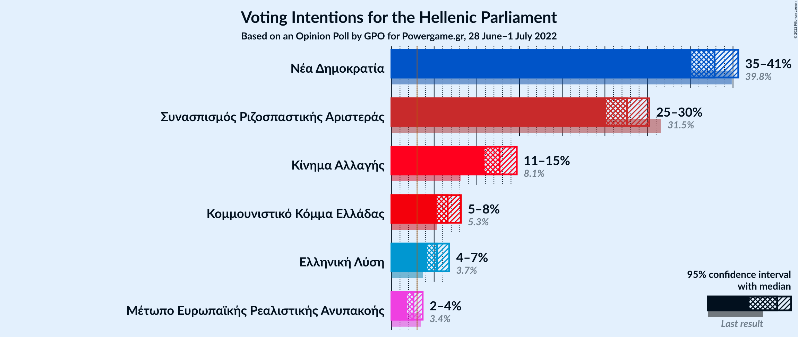

### Confidence Intervals

| Party | Last Result | Poll Result | 80% Confidence Interval | 90% Confidence Interval | 95% Confidence Interval | 99% Confidence Interval |
|:-----:|:-----------:|:-----------:|:-----------------------:|:-----------------------:|:-----------------------:|:-----------------------:|
| Νέα Δημοκρατία | 39.8% | 37.8% | 36.1–39.7% |35.6–40.2% |35.1–40.6% |34.3–41.5% |
| Συνασπισμός Ριζοσπαστικής Αριστεράς | 31.5% | 27.6% | 26.0–29.3% |25.5–29.8% |25.1–30.2% |24.4–31.0% |
| Κίνημα Αλλαγής | 8.1% | 12.7% | 11.5–14.0% |11.2–14.4% |10.9–14.7% |10.4–15.3% |
| Κομμουνιστικό Κόμμα Ελλάδας | 5.3% | 6.6% | 5.7–7.6% |5.5–7.9% |5.3–8.1% |4.9–8.6% |
| Ελληνική Λύση | 3.7% | 5.3% | 4.6–6.3% |4.4–6.5% |4.2–6.8% |3.9–7.2% |
| Μέτωπο Ευρωπαϊκής Ρεαλιστικής Ανυπακοής | 3.4% | 2.6% | 2.1–3.3% |1.9–3.5% |1.8–3.7% |1.6–4.0% |

*Note:* The poll result column reflects the actual value used in the calculations. Published results may vary slightly, and in addition be rounded to fewer digits.

## Seats

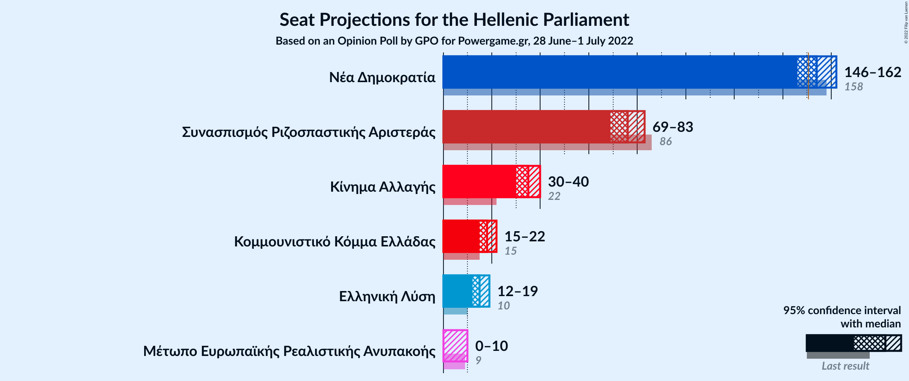

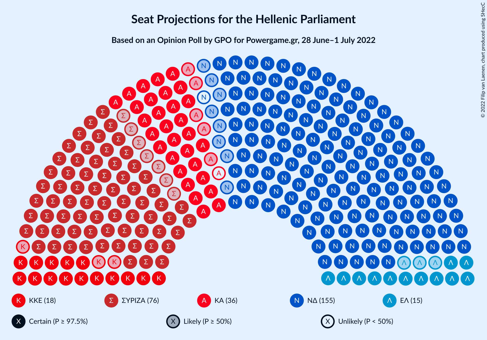

### Confidence Intervals

| Party | Last Result | Median | 80% Confidence Interval | 90% Confidence Interval | 95% Confidence Interval | 99% Confidence Interval |
|:-----:|:-----------:|:------:|:-----------------------:|:-----------------------:|:-----------------------:|:-----------------------:|
| <a href="#νέα-δημοκρατία">Νέα Δημοκρατία</a> | 158 | 154 | 149–159 |147–160 |146–162 |143–164 |
| <a href="#συνασπισμός-ριζοσπαστικής-αριστεράς">Συνασπισμός Ριζοσπαστικής Αριστεράς</a> | 86 | 76 | 71–81 |70–82 |69–83 |67–85 |
| <a href="#κίνημα-αλλαγής">Κίνημα Αλλαγής</a> | 22 | 35 | 32–38 |31–39 |30–40 |28–42 |
| <a href="#κομμουνιστικό-κόμμα-ελλάδας">Κομμουνιστικό Κόμμα Ελλάδας</a> | 15 | 18 | 16–21 |15–22 |15–22 |14–24 |
| <a href="#ελληνική-λύση">Ελληνική Λύση</a> | 10 | 15 | 13–17 |12–18 |12–19 |11–20 |
| <a href="#μέτωπο-ευρωπαϊκής-ρεαλιστικής-ανυπακοής">Μέτωπο Ευρωπαϊκής Ρεαλιστικής Ανυπακοής</a> | 9 | 0 | 0–9 |0–9 |0–10 |0–11 |

### Νέα Δημοκρατία

*For a full overview of the results for this party, see the [Νέα Δημοκρατία](party-νέαδημοκρατία.html) page.*

| Number of Seats | Probability | Accumulated | Special Marks |
|:---------------:|:-----------:|:-----------:|:-------------:|
| 141 | 0.1% | 100% |  |
| 142 | 0.1% | 99.9% |  |
| 143 | 0.3% | 99.8% |  |
| 144 | 0.4% | 99.5% |  |
| 145 | 1.0% | 99.1% |  |
| 146 | 1.1% | 98% |  |
| 147 | 2% | 97% |  |
| 148 | 3% | 95% |  |
| 149 | 5% | 92% |  |
| 150 | 6% | 87% |  |
| 151 | 8% | 81% | Majority |
| 152 | 8% | 73% |  |
| 153 | 10% | 64% |  |
| 154 | 8% | 54% | Median |
| 155 | 10% | 46% |  |
| 156 | 8% | 36% |  |
| 157 | 8% | 28% |  |
| 158 | 7% | 20% | Last Result |
| 159 | 5% | 13% |  |
| 160 | 3% | 8% |  |
| 161 | 2% | 5% |  |
| 162 | 1.3% | 3% |  |
| 163 | 0.8% | 2% |  |
| 164 | 0.5% | 0.9% |  |
| 165 | 0.2% | 0.4% |  |
| 166 | 0.1% | 0.2% |  |
| 167 | 0% | 0.1% |  |
| 168 | 0% | 0% |  |

### Συνασπισμός Ριζοσπαστικής Αριστεράς

*For a full overview of the results for this party, see the [Συνασπισμός Ριζοσπαστικής Αριστεράς](party-συνασπισμόςριζοσπαστικήςαριστεράς.html) page.*

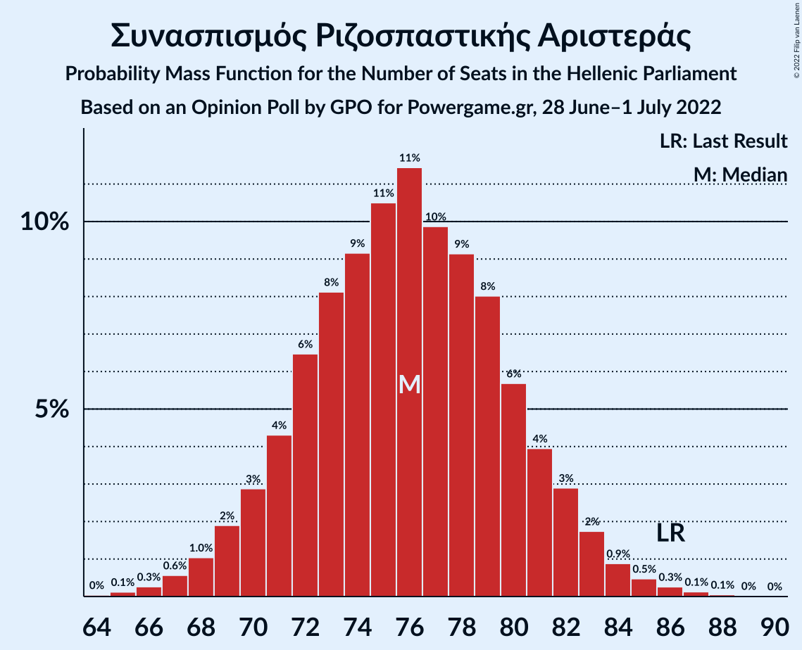

| Number of Seats | Probability | Accumulated | Special Marks |
|:---------------:|:-----------:|:-----------:|:-------------:|
| 64 | 0% | 100% |  |
| 65 | 0.1% | 99.9% |  |
| 66 | 0.3% | 99.8% |  |
| 67 | 0.6% | 99.5% |  |
| 68 | 1.0% | 99.0% |  |
| 69 | 2% | 98% |  |
| 70 | 3% | 96% |  |
| 71 | 4% | 93% |  |
| 72 | 6% | 89% |  |
| 73 | 8% | 82% |  |
| 74 | 9% | 74% |  |
| 75 | 11% | 65% |  |
| 76 | 11% | 55% | Median |
| 77 | 10% | 43% |  |
| 78 | 9% | 33% |  |
| 79 | 8% | 24% |  |
| 80 | 6% | 16% |  |
| 81 | 4% | 10% |  |
| 82 | 3% | 6% |  |
| 83 | 2% | 4% |  |
| 84 | 0.9% | 2% |  |
| 85 | 0.5% | 1.0% |  |
| 86 | 0.3% | 0.5% | Last Result |
| 87 | 0.1% | 0.2% |  |
| 88 | 0.1% | 0.1% |  |
| 89 | 0% | 0% |  |

### Κίνημα Αλλαγής

*For a full overview of the results for this party, see the [Κίνημα Αλλαγής](party-κίνημααλλαγής.html) page.*

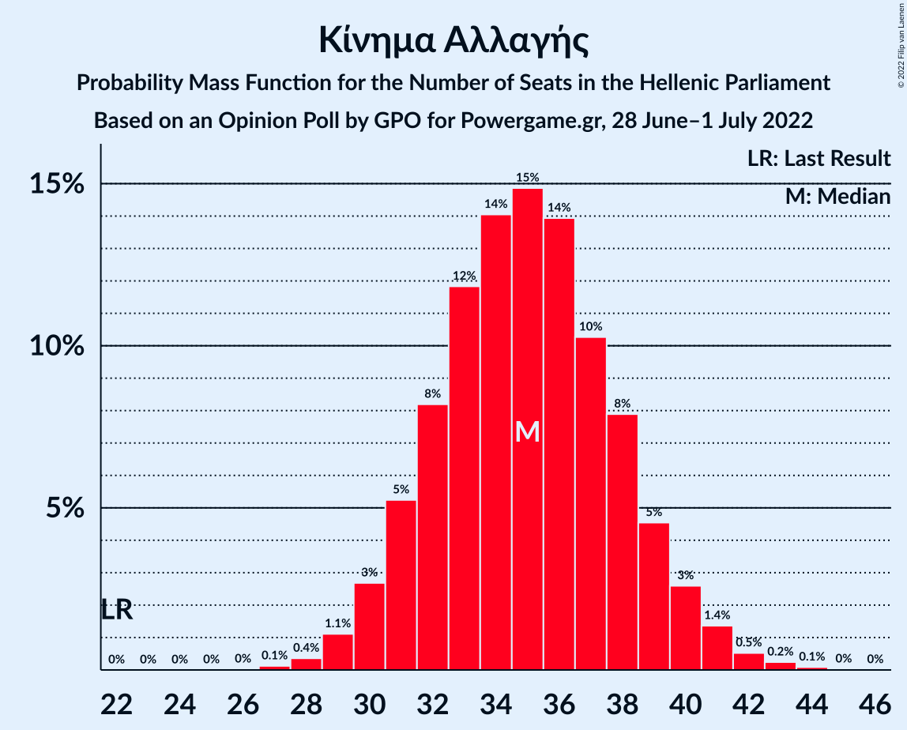

| Number of Seats | Probability | Accumulated | Special Marks |
|:---------------:|:-----------:|:-----------:|:-------------:|
| 22 | 0% | 100% | Last Result |
| 23 | 0% | 100% |  |
| 24 | 0% | 100% |  |
| 25 | 0% | 100% |  |
| 26 | 0% | 100% |  |
| 27 | 0.1% | 100% |  |
| 28 | 0.4% | 99.8% |  |
| 29 | 1.1% | 99.5% |  |
| 30 | 3% | 98% |  |
| 31 | 5% | 96% |  |
| 32 | 8% | 90% |  |
| 33 | 12% | 82% |  |
| 34 | 14% | 70% |  |
| 35 | 15% | 56% | Median |
| 36 | 14% | 41% |  |
| 37 | 10% | 28% |  |
| 38 | 8% | 17% |  |
| 39 | 5% | 9% |  |
| 40 | 3% | 5% |  |
| 41 | 1.4% | 2% |  |
| 42 | 0.5% | 0.9% |  |
| 43 | 0.2% | 0.4% |  |
| 44 | 0.1% | 0.1% |  |
| 45 | 0% | 0% |  |

### Κομμουνιστικό Κόμμα Ελλάδας

*For a full overview of the results for this party, see the [Κομμουνιστικό Κόμμα Ελλάδας](party-κομμουνιστικόκόμμαελλάδας.html) page.*

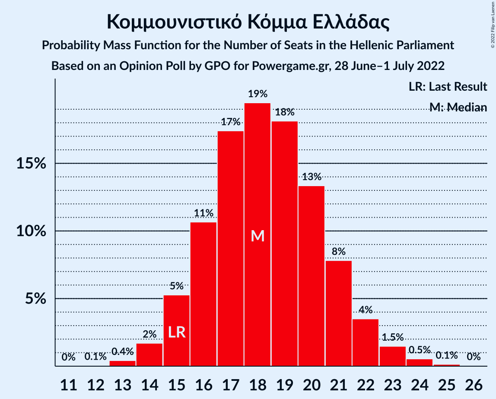

| Number of Seats | Probability | Accumulated | Special Marks |
|:---------------:|:-----------:|:-----------:|:-------------:|
| 12 | 0.1% | 100% |  |
| 13 | 0.4% | 99.9% |  |
| 14 | 2% | 99.5% |  |
| 15 | 5% | 98% | Last Result |
| 16 | 11% | 93% |  |
| 17 | 17% | 82% |  |
| 18 | 19% | 64% | Median |
| 19 | 18% | 45% |  |
| 20 | 13% | 27% |  |
| 21 | 8% | 14% |  |
| 22 | 4% | 6% |  |
| 23 | 1.5% | 2% |  |
| 24 | 0.5% | 0.7% |  |
| 25 | 0.1% | 0.2% |  |
| 26 | 0% | 0% |  |

### Ελληνική Λύση

*For a full overview of the results for this party, see the [Ελληνική Λύση](party-ελληνικήλύση.html) page.*

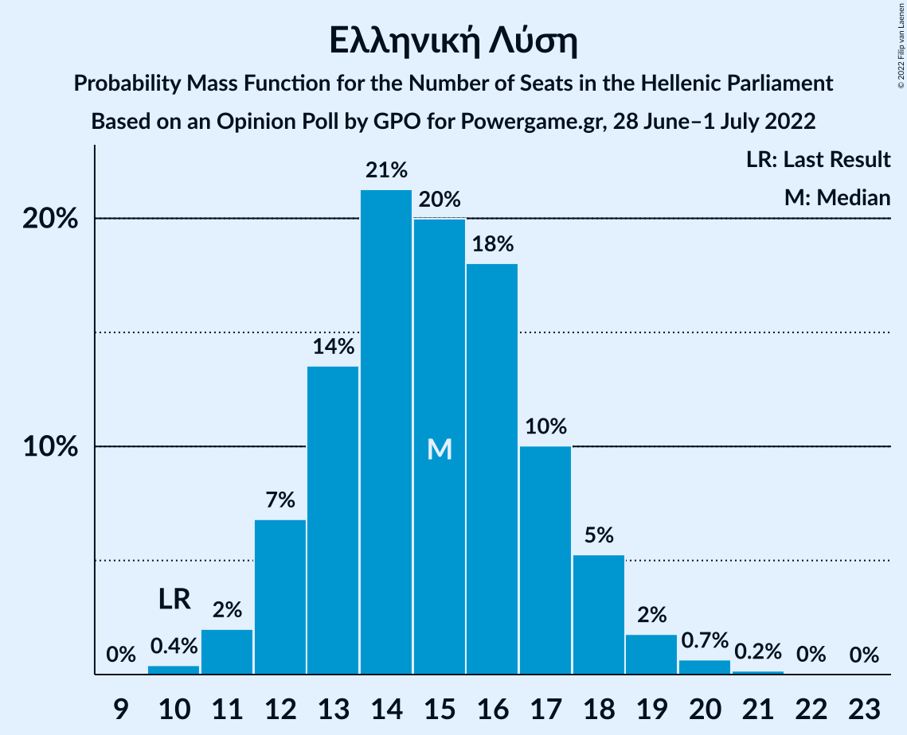

| Number of Seats | Probability | Accumulated | Special Marks |
|:---------------:|:-----------:|:-----------:|:-------------:|
| 10 | 0.4% | 100% | Last Result |
| 11 | 2% | 99.6% |  |
| 12 | 7% | 98% |  |
| 13 | 14% | 91% |  |
| 14 | 21% | 77% |  |
| 15 | 20% | 56% | Median |
| 16 | 18% | 36% |  |
| 17 | 10% | 18% |  |
| 18 | 5% | 8% |  |
| 19 | 2% | 3% |  |
| 20 | 0.7% | 0.9% |  |
| 21 | 0.2% | 0.2% |  |
| 22 | 0% | 0.1% |  |
| 23 | 0% | 0% |  |

### Μέτωπο Ευρωπαϊκής Ρεαλιστικής Ανυπακοής

*For a full overview of the results for this party, see the [Μέτωπο Ευρωπαϊκής Ρεαλιστικής Ανυπακοής](party-μέτωποευρωπαϊκήςρεαλιστικήςανυπακοής.html) page.*

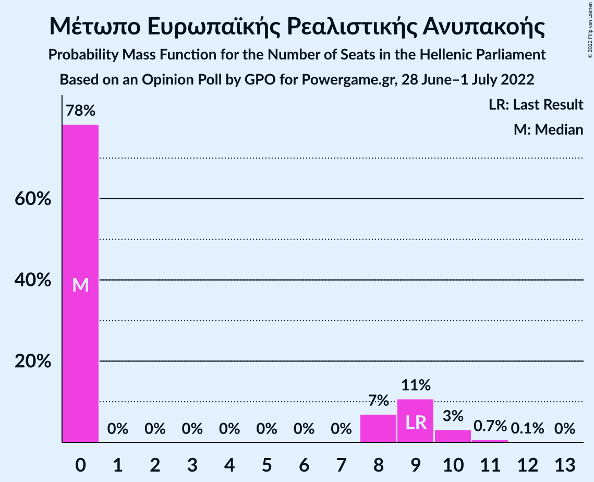

| Number of Seats | Probability | Accumulated | Special Marks |
|:---------------:|:-----------:|:-----------:|:-------------:|
| 0 | 78% | 100% | Median |
| 1 | 0% | 22% |  |
| 2 | 0% | 22% |  |
| 3 | 0% | 22% |  |
| 4 | 0% | 22% |  |
| 5 | 0% | 22% |  |
| 6 | 0% | 22% |  |
| 7 | 0% | 22% |  |
| 8 | 7% | 22% |  |
| 9 | 11% | 15% | Last Result |
| 10 | 3% | 4% |  |
| 11 | 0.7% | 0.8% |  |
| 12 | 0.1% | 0.1% |  |
| 13 | 0% | 0% |  |

## Coalitions

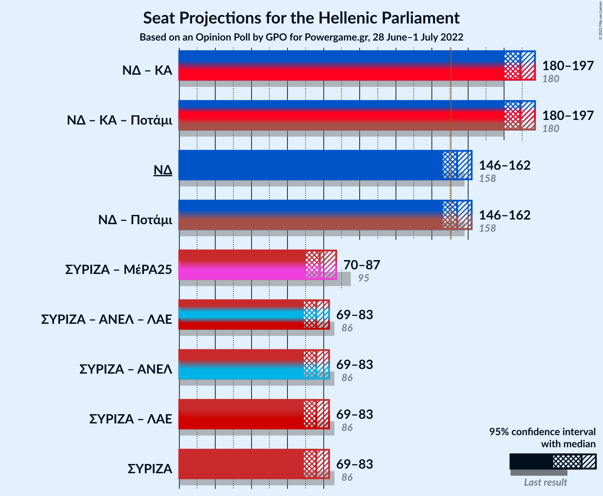

### Confidence Intervals

| Coalition | Last Result | Median | Majority? | 80% Confidence Interval | 90% Confidence Interval | 95% Confidence Interval | 99% Confidence Interval |
|:---------:|:-----------:|:------:|:---------:|:-----------------------:|:-----------------------:|:-----------------------:|:-----------------------:|
| Νέα Δημοκρατία – Κίνημα Αλλαγής | 180 | 189 | 100% | 183–194 | 182–196 | 180–197 | 178–199 |
| Νέα Δημοκρατία | 158 | 154 | 81% | 149–159 | 147–160 | 146–162 | 143–164 |
| Συνασπισμός Ριζοσπαστικής Αριστεράς – Μέτωπο Ευρωπαϊκής Ρεαλιστικής Ανυπακοής | 95 | 78 | 0% | 72–84 | 71–85 | 70–87 | 68–90 |
| Συνασπισμός Ριζοσπαστικής Αριστεράς | 86 | 76 | 0% | 71–81 | 70–82 | 69–83 | 67–85 |

### Νέα Δημοκρατία – Κίνημα Αλλαγής

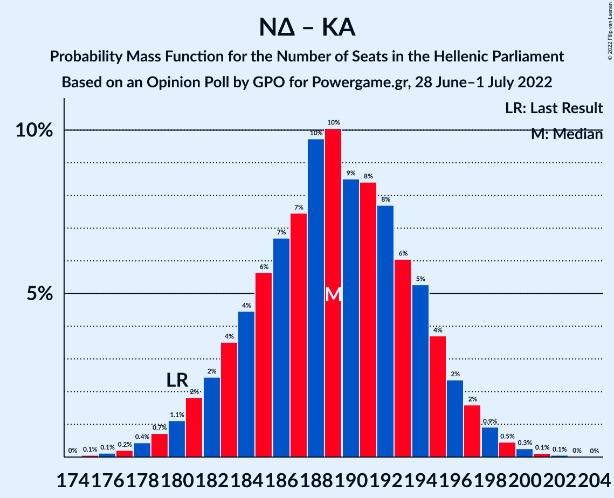

| Number of Seats | Probability | Accumulated | Special Marks |
|:---------------:|:-----------:|:-----------:|:-------------:|
| 175 | 0.1% | 100% |  |
| 176 | 0.1% | 99.9% |  |
| 177 | 0.2% | 99.8% |  |
| 178 | 0.4% | 99.6% |  |
| 179 | 0.7% | 99.1% |  |
| 180 | 1.1% | 98% | Last Result |
| 181 | 2% | 97% |  |
| 182 | 2% | 95% |  |
| 183 | 4% | 93% |  |
| 184 | 4% | 90% |  |
| 185 | 6% | 85% |  |
| 186 | 7% | 79% |  |
| 187 | 7% | 73% |  |
| 188 | 10% | 65% |  |
| 189 | 10% | 56% | Median |
| 190 | 9% | 45% |  |
| 191 | 8% | 37% |  |
| 192 | 8% | 29% |  |
| 193 | 6% | 21% |  |
| 194 | 5% | 15% |  |
| 195 | 4% | 10% |  |
| 196 | 2% | 6% |  |
| 197 | 2% | 3% |  |
| 198 | 0.9% | 2% |  |
| 199 | 0.5% | 0.9% |  |
| 200 | 0.3% | 0.5% |  |
| 201 | 0.1% | 0.2% |  |
| 202 | 0.1% | 0.1% |  |
| 203 | 0% | 0% |  |

### Νέα Δημοκρατία

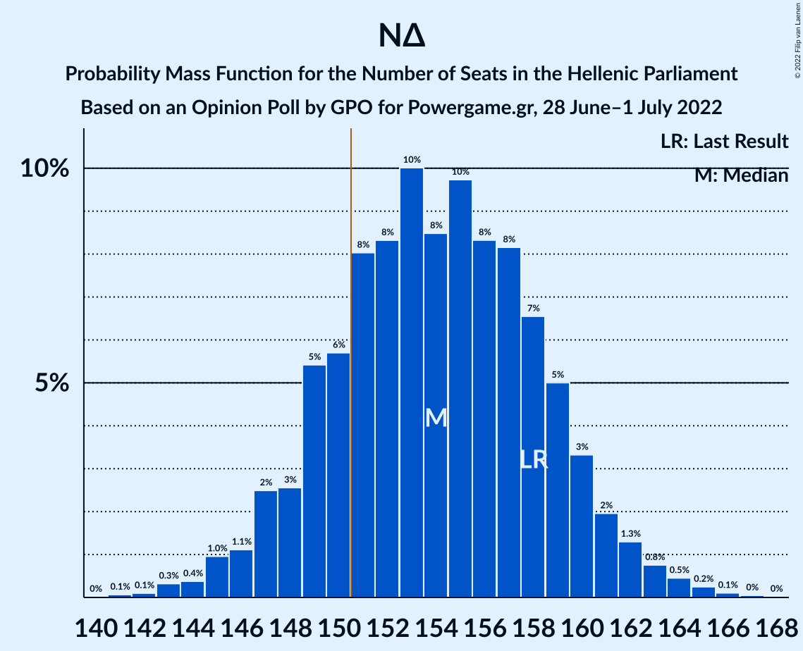

| Number of Seats | Probability | Accumulated | Special Marks |
|:---------------:|:-----------:|:-----------:|:-------------:|
| 141 | 0.1% | 100% |  |
| 142 | 0.1% | 99.9% |  |
| 143 | 0.3% | 99.8% |  |
| 144 | 0.4% | 99.5% |  |
| 145 | 1.0% | 99.1% |  |
| 146 | 1.1% | 98% |  |
| 147 | 2% | 97% |  |
| 148 | 3% | 95% |  |
| 149 | 5% | 92% |  |
| 150 | 6% | 87% |  |
| 151 | 8% | 81% | Majority |
| 152 | 8% | 73% |  |
| 153 | 10% | 64% |  |
| 154 | 8% | 54% | Median |
| 155 | 10% | 46% |  |
| 156 | 8% | 36% |  |
| 157 | 8% | 28% |  |
| 158 | 7% | 20% | Last Result |
| 159 | 5% | 13% |  |
| 160 | 3% | 8% |  |
| 161 | 2% | 5% |  |
| 162 | 1.3% | 3% |  |
| 163 | 0.8% | 2% |  |
| 164 | 0.5% | 0.9% |  |
| 165 | 0.2% | 0.4% |  |
| 166 | 0.1% | 0.2% |  |
| 167 | 0% | 0.1% |  |
| 168 | 0% | 0% |  |

### Συνασπισμός Ριζοσπαστικής Αριστεράς – Μέτωπο Ευρωπαϊκής Ρεαλιστικής Ανυπακοής

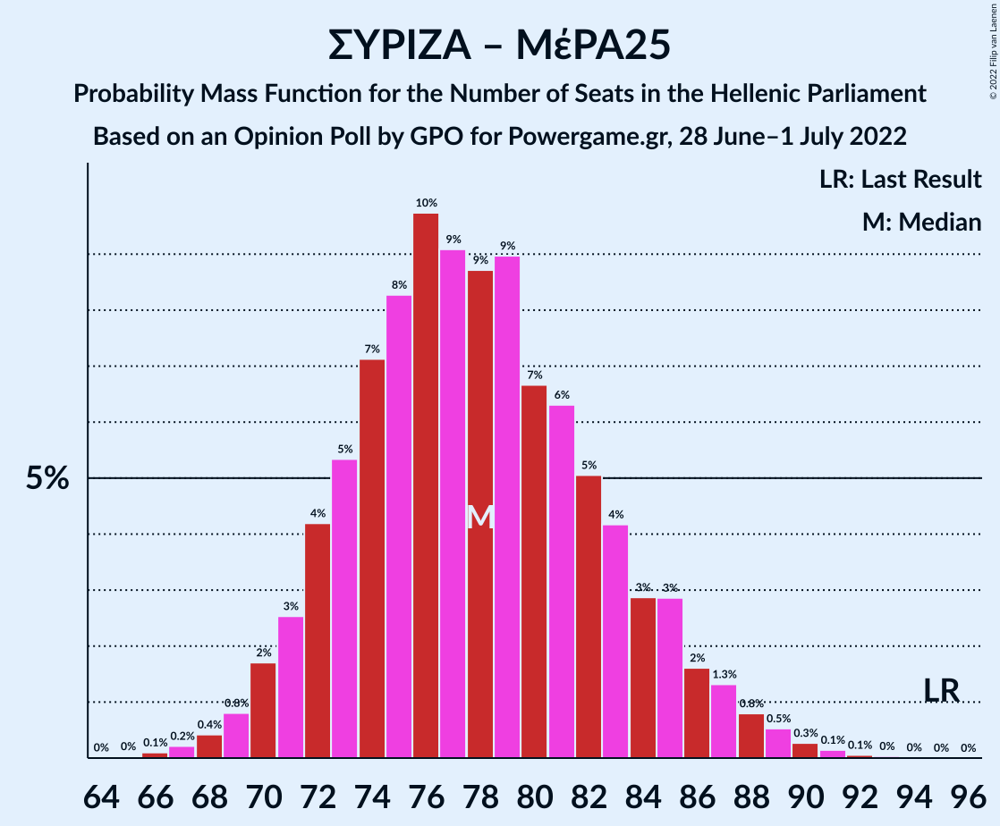

| Number of Seats | Probability | Accumulated | Special Marks |
|:---------------:|:-----------:|:-----------:|:-------------:|
| 66 | 0.1% | 100% |  |
| 67 | 0.2% | 99.9% |  |
| 68 | 0.4% | 99.6% |  |
| 69 | 0.8% | 99.2% |  |
| 70 | 2% | 98% |  |
| 71 | 3% | 97% |  |
| 72 | 4% | 94% |  |
| 73 | 5% | 90% |  |
| 74 | 7% | 85% |  |
| 75 | 8% | 78% |  |
| 76 | 10% | 69% | Median |
| 77 | 9% | 59% |  |
| 78 | 9% | 50% |  |
| 79 | 9% | 42% |  |
| 80 | 7% | 33% |  |
| 81 | 6% | 26% |  |
| 82 | 5% | 20% |  |
| 83 | 4% | 15% |  |
| 84 | 3% | 11% |  |
| 85 | 3% | 8% |  |
| 86 | 2% | 5% |  |
| 87 | 1.3% | 3% |  |
| 88 | 0.8% | 2% |  |
| 89 | 0.5% | 1.1% |  |
| 90 | 0.3% | 0.5% |  |
| 91 | 0.1% | 0.3% |  |
| 92 | 0.1% | 0.1% |  |
| 93 | 0% | 0.1% |  |
| 94 | 0% | 0% |  |
| 95 | 0% | 0% | Last Result |

### Συνασπισμός Ριζοσπαστικής Αριστεράς

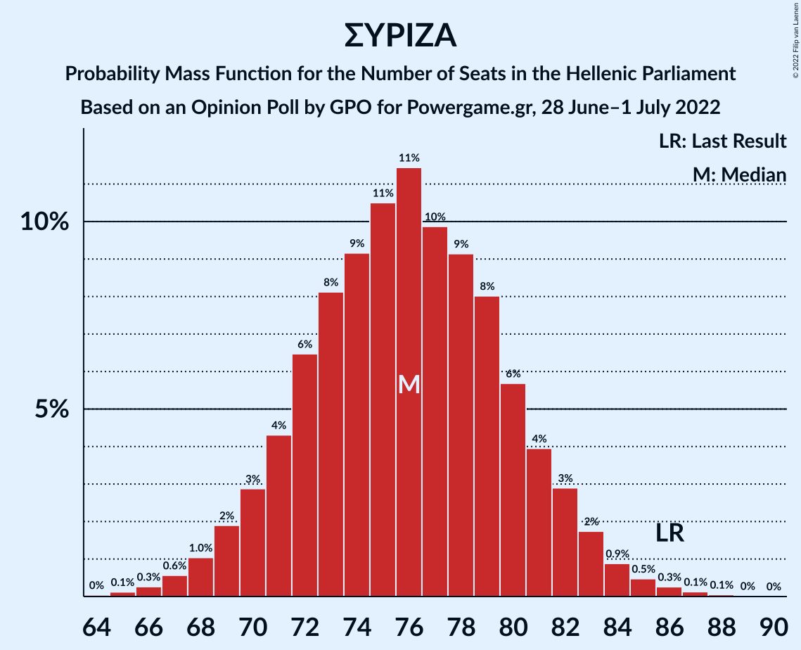

| Number of Seats | Probability | Accumulated | Special Marks |
|:---------------:|:-----------:|:-----------:|:-------------:|
| 64 | 0% | 100% |  |
| 65 | 0.1% | 99.9% |  |
| 66 | 0.3% | 99.8% |  |
| 67 | 0.6% | 99.5% |  |
| 68 | 1.0% | 99.0% |  |
| 69 | 2% | 98% |  |
| 70 | 3% | 96% |  |
| 71 | 4% | 93% |  |
| 72 | 6% | 89% |  |
| 73 | 8% | 82% |  |
| 74 | 9% | 74% |  |
| 75 | 11% | 65% |  |
| 76 | 11% | 55% | Median |
| 77 | 10% | 43% |  |
| 78 | 9% | 33% |  |
| 79 | 8% | 24% |  |
| 80 | 6% | 16% |  |
| 81 | 4% | 10% |  |
| 82 | 3% | 6% |  |
| 83 | 2% | 4% |  |
| 84 | 0.9% | 2% |  |
| 85 | 0.5% | 1.0% |  |
| 86 | 0.3% | 0.5% | Last Result |
| 87 | 0.1% | 0.2% |  |
| 88 | 0.1% | 0.1% |  |
| 89 | 0% | 0% |  |

## Technical Information

### Opinion Poll

+ **Polling firm:** GPO
+ **Commissioner(s):** Powergame.gr
+ **Fieldwork period:** 28 June–1 July 2022

### Calculations

+ **Sample size:** 1200
+ **Simulations done:** 1,048,576
+ **Error estimate:** 0.96%

