# Opinion Poll by Pulse RC for ΣΚΑΪ, 11–13 July 2022

<a href="#voting-intentions">Voting Intentions</a> | <a href="#seats">Seats</a> | <a href="#coalitions">Coalitions</a> | <a href="#technical-information">Technical Information</a>

## Voting Intentions

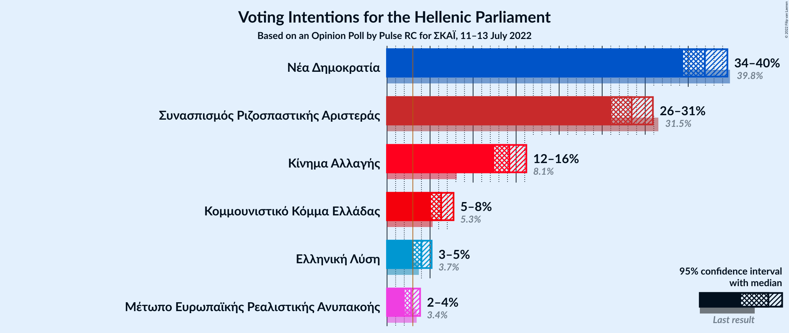

### Confidence Intervals

| Party | Last Result | Poll Result | 80% Confidence Interval | 90% Confidence Interval | 95% Confidence Interval | 99% Confidence Interval |
|:-----:|:-----------:|:-----------:|:-----------------------:|:-----------------------:|:-----------------------:|:-----------------------:|
| Νέα Δημοκρατία | 39.8% | 36.9% | 35.3–38.7% |34.8–39.1% |34.4–39.6% |33.6–40.4% |
| Συνασπισμός Ριζοσπαστικής Αριστεράς | 31.5% | 28.4% | 26.9–30.0% |26.4–30.5% |26.1–30.9% |25.3–31.7% |
| Κίνημα Αλλαγής | 8.1% | 14.2% | 13.0–15.5% |12.7–15.9% |12.5–16.2% |11.9–16.8% |
| Κομμουνιστικό Κόμμα Ελλάδας | 5.3% | 6.3% | 5.5–7.2% |5.3–7.5% |5.1–7.7% |4.8–8.2% |
| Ελληνική Λύση | 3.7% | 4.0% | 3.4–4.8% |3.2–5.0% |3.1–5.2% |2.8–5.6% |
| Μέτωπο Ευρωπαϊκής Ρεαλιστικής Ανυπακοής | 3.4% | 2.8% | 2.3–3.5% |2.2–3.7% |2.1–3.8% |1.8–4.2% |

*Note:* The poll result column reflects the actual value used in the calculations. Published results may vary slightly, and in addition be rounded to fewer digits.

## Seats

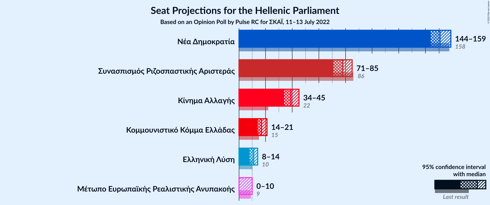

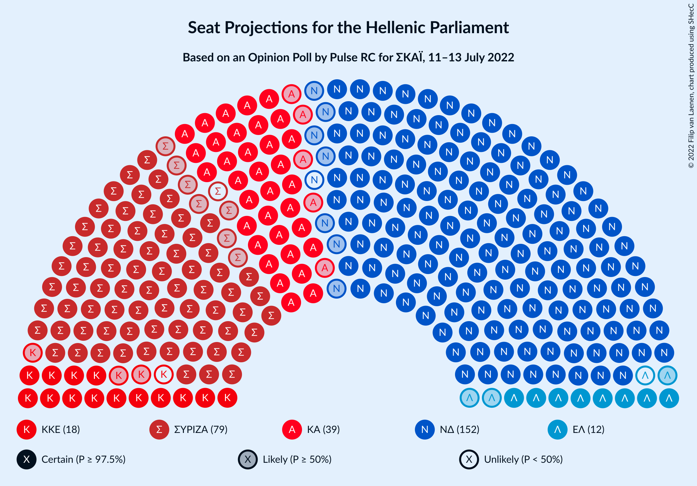

### Confidence Intervals

| Party | Last Result | Median | 80% Confidence Interval | 90% Confidence Interval | 95% Confidence Interval | 99% Confidence Interval |
|:-----:|:-----------:|:------:|:-----------------------:|:-----------------------:|:-----------------------:|:-----------------------:|
| <a href="#νέα-δημοκρατία">Νέα Δημοκρατία</a> | 158 | 151 | 146–156 |145–158 |144–159 |141–161 |
| <a href="#συνασπισμός-ριζοσπαστικής-αριστεράς">Συνασπισμός Ριζοσπαστικής Αριστεράς</a> | 86 | 78 | 73–83 |72–84 |71–85 |69–87 |
| <a href="#κίνημα-αλλαγής">Κίνημα Αλλαγής</a> | 22 | 39 | 36–42 |35–44 |34–45 |32–46 |
| <a href="#κομμουνιστικό-κόμμα-ελλάδας">Κομμουνιστικό Κόμμα Ελλάδας</a> | 15 | 17 | 15–20 |14–21 |14–21 |13–23 |
| <a href="#ελληνική-λύση">Ελληνική Λύση</a> | 10 | 11 | 9–13 |9–14 |8–14 |0–15 |
| <a href="#μέτωπο-ευρωπαϊκής-ρεαλιστικής-ανυπακοής">Μέτωπο Ευρωπαϊκής Ρεαλιστικής Ανυπακοής</a> | 9 | 0 | 0–9 |0–10 |0–10 |0–11 |

### Νέα Δημοκρατία

*For a full overview of the results for this party, see the [Νέα Δημοκρατία](party-νέαδημοκρατία.html) page.*

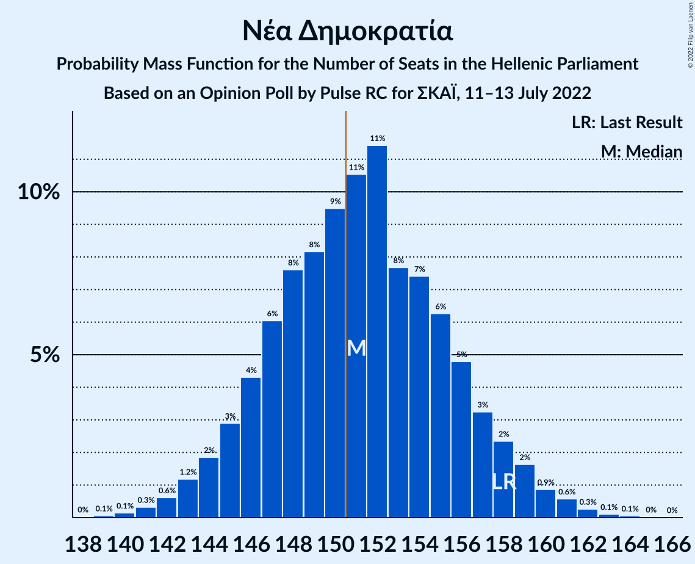

| Number of Seats | Probability | Accumulated | Special Marks |
|:---------------:|:-----------:|:-----------:|:-------------:|
| 139 | 0.1% | 100% |  |
| 140 | 0.1% | 99.9% |  |
| 141 | 0.3% | 99.7% |  |
| 142 | 0.6% | 99.4% |  |
| 143 | 1.2% | 98.8% |  |
| 144 | 2% | 98% |  |
| 145 | 3% | 96% |  |
| 146 | 4% | 93% |  |
| 147 | 6% | 89% |  |
| 148 | 8% | 83% |  |
| 149 | 8% | 75% |  |
| 150 | 9% | 67% |  |
| 151 | 11% | 57% | Median, Majority |
| 152 | 11% | 47% |  |
| 153 | 8% | 35% |  |
| 154 | 7% | 28% |  |
| 155 | 6% | 20% |  |
| 156 | 5% | 14% |  |
| 157 | 3% | 9% |  |
| 158 | 2% | 6% | Last Result |
| 159 | 2% | 4% |  |
| 160 | 0.9% | 2% |  |
| 161 | 0.6% | 1.0% |  |
| 162 | 0.3% | 0.5% |  |
| 163 | 0.1% | 0.2% |  |
| 164 | 0.1% | 0.1% |  |
| 165 | 0% | 0% |  |

### Συνασπισμός Ριζοσπαστικής Αριστεράς

*For a full overview of the results for this party, see the [Συνασπισμός Ριζοσπαστικής Αριστεράς](party-συνασπισμόςριζοσπαστικήςαριστεράς.html) page.*

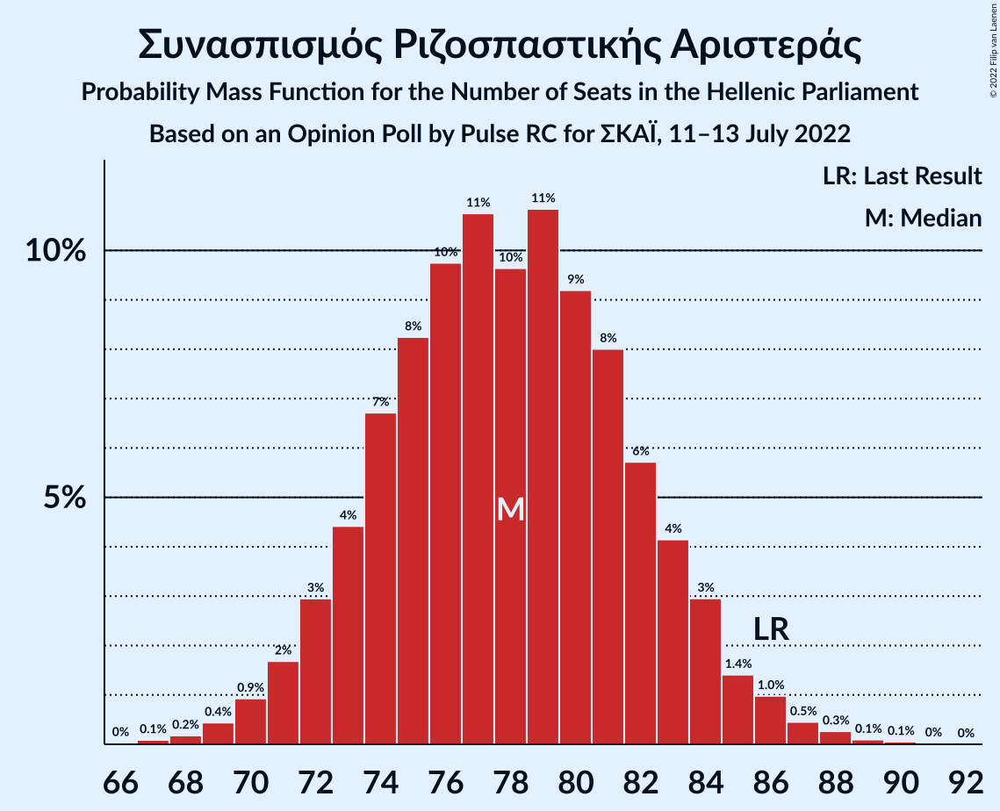

| Number of Seats | Probability | Accumulated | Special Marks |
|:---------------:|:-----------:|:-----------:|:-------------:|
| 67 | 0.1% | 100% |  |
| 68 | 0.2% | 99.9% |  |
| 69 | 0.4% | 99.7% |  |
| 70 | 0.9% | 99.2% |  |
| 71 | 2% | 98% |  |
| 72 | 3% | 97% |  |
| 73 | 4% | 94% |  |
| 74 | 7% | 89% |  |
| 75 | 8% | 83% |  |
| 76 | 10% | 74% |  |
| 77 | 11% | 65% |  |
| 78 | 10% | 54% | Median |
| 79 | 11% | 44% |  |
| 80 | 9% | 33% |  |
| 81 | 8% | 24% |  |
| 82 | 6% | 16% |  |
| 83 | 4% | 10% |  |
| 84 | 3% | 6% |  |
| 85 | 1.4% | 3% |  |
| 86 | 1.0% | 2% | Last Result |
| 87 | 0.5% | 0.9% |  |
| 88 | 0.3% | 0.5% |  |
| 89 | 0.1% | 0.2% |  |
| 90 | 0.1% | 0.1% |  |
| 91 | 0% | 0% |  |

### Κίνημα Αλλαγής

*For a full overview of the results for this party, see the [Κίνημα Αλλαγής](party-κίνημααλλαγής.html) page.*

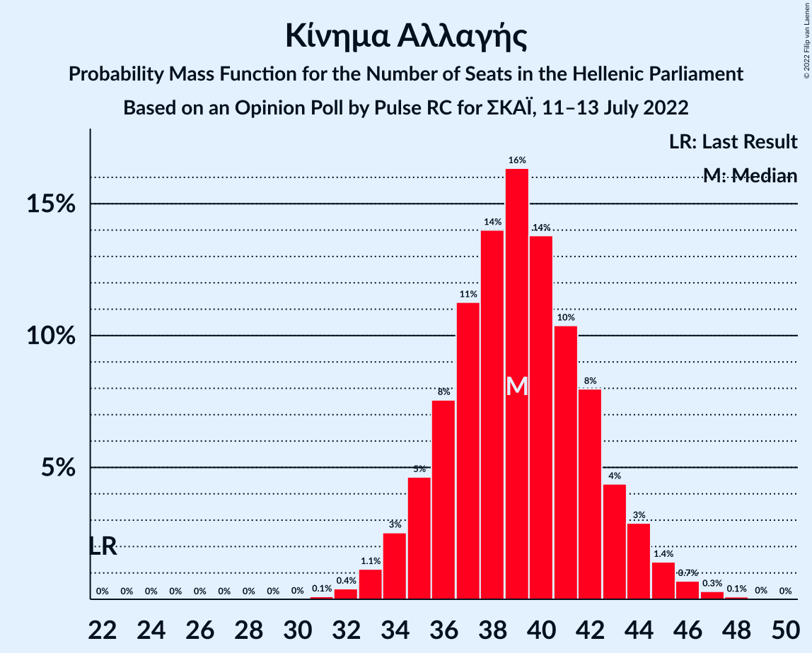

| Number of Seats | Probability | Accumulated | Special Marks |
|:---------------:|:-----------:|:-----------:|:-------------:|
| 22 | 0% | 100% | Last Result |
| 23 | 0% | 100% |  |
| 24 | 0% | 100% |  |
| 25 | 0% | 100% |  |
| 26 | 0% | 100% |  |
| 27 | 0% | 100% |  |
| 28 | 0% | 100% |  |
| 29 | 0% | 100% |  |
| 30 | 0% | 100% |  |
| 31 | 0.1% | 100% |  |
| 32 | 0.4% | 99.9% |  |
| 33 | 1.1% | 99.5% |  |
| 34 | 3% | 98% |  |
| 35 | 5% | 96% |  |
| 36 | 8% | 91% |  |
| 37 | 11% | 84% |  |
| 38 | 14% | 72% |  |
| 39 | 16% | 58% | Median |
| 40 | 14% | 42% |  |
| 41 | 10% | 28% |  |
| 42 | 8% | 18% |  |
| 43 | 4% | 10% |  |
| 44 | 3% | 5% |  |
| 45 | 1.4% | 3% |  |
| 46 | 0.7% | 1.1% |  |
| 47 | 0.3% | 0.4% |  |
| 48 | 0.1% | 0.1% |  |
| 49 | 0% | 0% |  |

### Κομμουνιστικό Κόμμα Ελλάδας

*For a full overview of the results for this party, see the [Κομμουνιστικό Κόμμα Ελλάδας](party-κομμουνιστικόκόμμαελλάδας.html) page.*

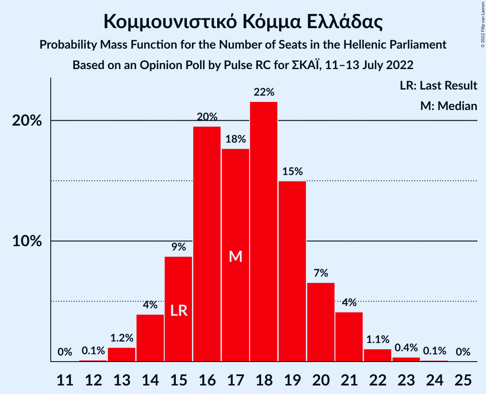

| Number of Seats | Probability | Accumulated | Special Marks |
|:---------------:|:-----------:|:-----------:|:-------------:|
| 12 | 0.1% | 100% |  |
| 13 | 1.2% | 99.9% |  |
| 14 | 4% | 98.7% |  |
| 15 | 9% | 95% | Last Result |
| 16 | 20% | 86% |  |
| 17 | 18% | 66% | Median |
| 18 | 22% | 49% |  |
| 19 | 15% | 27% |  |
| 20 | 7% | 12% |  |
| 21 | 4% | 6% |  |
| 22 | 1.1% | 2% |  |
| 23 | 0.4% | 0.5% |  |
| 24 | 0.1% | 0.1% |  |
| 25 | 0% | 0% |  |

### Ελληνική Λύση

*For a full overview of the results for this party, see the [Ελληνική Λύση](party-ελληνικήλύση.html) page.*

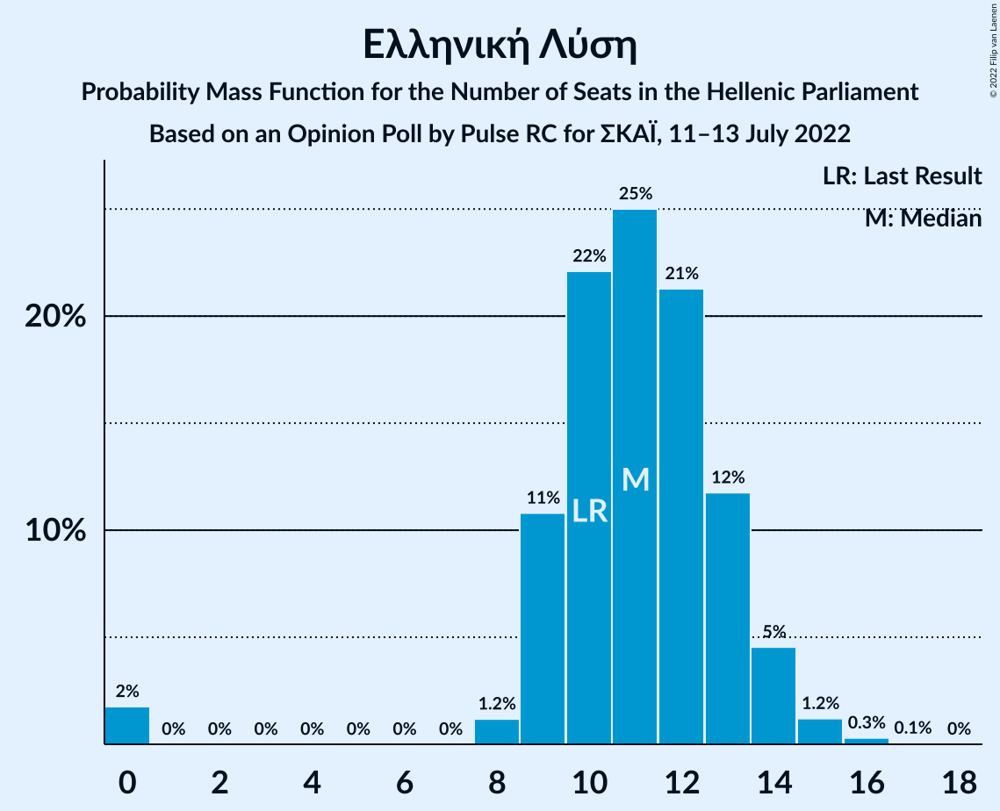

| Number of Seats | Probability | Accumulated | Special Marks |
|:---------------:|:-----------:|:-----------:|:-------------:|
| 0 | 2% | 100% |  |
| 1 | 0% | 98% |  |
| 2 | 0% | 98% |  |
| 3 | 0% | 98% |  |
| 4 | 0% | 98% |  |
| 5 | 0% | 98% |  |
| 6 | 0% | 98% |  |
| 7 | 0% | 98% |  |
| 8 | 1.2% | 98% |  |
| 9 | 11% | 97% |  |
| 10 | 22% | 86% | Last Result |
| 11 | 25% | 64% | Median |
| 12 | 21% | 39% |  |
| 13 | 12% | 18% |  |
| 14 | 5% | 6% |  |
| 15 | 1.2% | 2% |  |
| 16 | 0.3% | 0.4% |  |
| 17 | 0.1% | 0.1% |  |
| 18 | 0% | 0% |  |

### Μέτωπο Ευρωπαϊκής Ρεαλιστικής Ανυπακοής

*For a full overview of the results for this party, see the [Μέτωπο Ευρωπαϊκής Ρεαλιστικής Ανυπακοής](party-μέτωποευρωπαϊκήςρεαλιστικήςανυπακοής.html) page.*

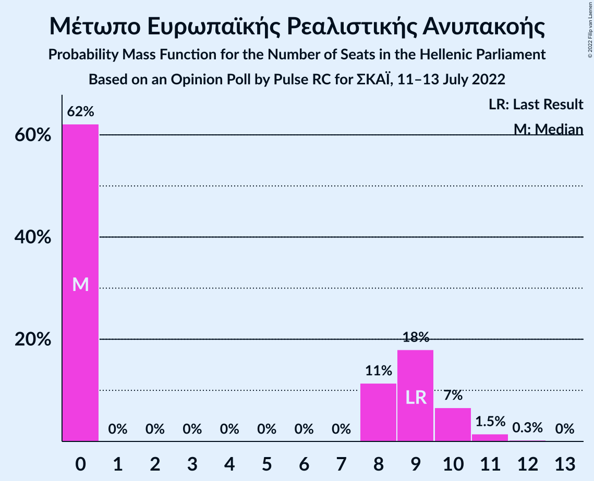

| Number of Seats | Probability | Accumulated | Special Marks |
|:---------------:|:-----------:|:-----------:|:-------------:|
| 0 | 62% | 100% | Median |
| 1 | 0% | 38% |  |
| 2 | 0% | 38% |  |
| 3 | 0% | 38% |  |
| 4 | 0% | 38% |  |
| 5 | 0% | 38% |  |
| 6 | 0% | 38% |  |
| 7 | 0% | 38% |  |
| 8 | 11% | 38% |  |
| 9 | 18% | 26% | Last Result |
| 10 | 7% | 8% |  |
| 11 | 1.5% | 2% |  |
| 12 | 0.3% | 0.3% |  |
| 13 | 0% | 0% |  |

## Coalitions

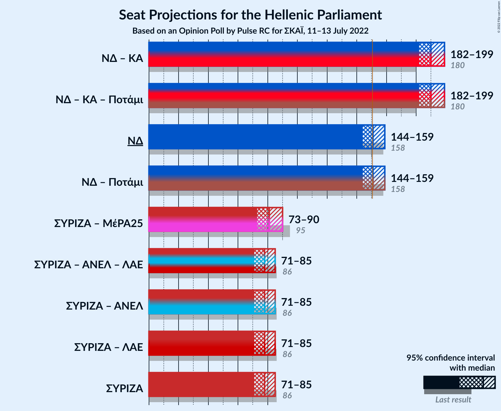

### Confidence Intervals

| Coalition | Last Result | Median | Majority? | 80% Confidence Interval | 90% Confidence Interval | 95% Confidence Interval | 99% Confidence Interval |
|:---------:|:-----------:|:------:|:---------:|:-----------------------:|:-----------------------:|:-----------------------:|:-----------------------:|
| Νέα Δημοκρατία – Κίνημα Αλλαγής | 180 | 190 | 100% | 185–196 | 183–197 | 182–199 | 179–202 |
| Νέα Δημοκρατία | 158 | 151 | 57% | 146–156 | 145–158 | 144–159 | 141–161 |
| Συνασπισμός Ριζοσπαστικής Αριστεράς – Μέτωπο Ευρωπαϊκής Ρεαλιστικής Ανυπακοής | 95 | 81 | 0% | 76–87 | 74–89 | 73–90 | 71–93 |
| Συνασπισμός Ριζοσπαστικής Αριστεράς | 86 | 78 | 0% | 73–83 | 72–84 | 71–85 | 69–87 |

### Νέα Δημοκρατία – Κίνημα Αλλαγής

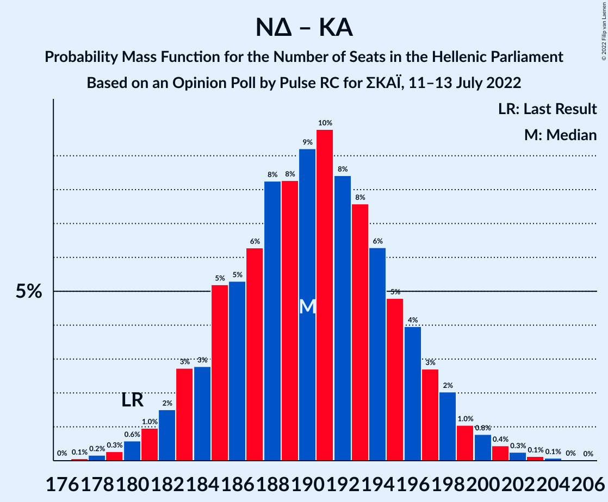

| Number of Seats | Probability | Accumulated | Special Marks |
|:---------------:|:-----------:|:-----------:|:-------------:|
| 176 | 0% | 100% |  |
| 177 | 0.1% | 99.9% |  |
| 178 | 0.2% | 99.9% |  |
| 179 | 0.3% | 99.7% |  |
| 180 | 0.6% | 99.4% | Last Result |
| 181 | 1.0% | 98.9% |  |
| 182 | 2% | 98% |  |
| 183 | 3% | 96% |  |
| 184 | 3% | 94% |  |
| 185 | 5% | 91% |  |
| 186 | 5% | 86% |  |
| 187 | 6% | 80% |  |
| 188 | 8% | 74% |  |
| 189 | 8% | 66% |  |
| 190 | 9% | 58% | Median |
| 191 | 10% | 48% |  |
| 192 | 8% | 39% |  |
| 193 | 8% | 30% |  |
| 194 | 6% | 23% |  |
| 195 | 5% | 16% |  |
| 196 | 4% | 11% |  |
| 197 | 3% | 8% |  |
| 198 | 2% | 5% |  |
| 199 | 1.0% | 3% |  |
| 200 | 0.8% | 2% |  |
| 201 | 0.4% | 1.0% |  |
| 202 | 0.3% | 0.5% |  |
| 203 | 0.1% | 0.3% |  |
| 204 | 0.1% | 0.1% |  |
| 205 | 0% | 0.1% |  |
| 206 | 0% | 0% |  |

### Νέα Δημοκρατία

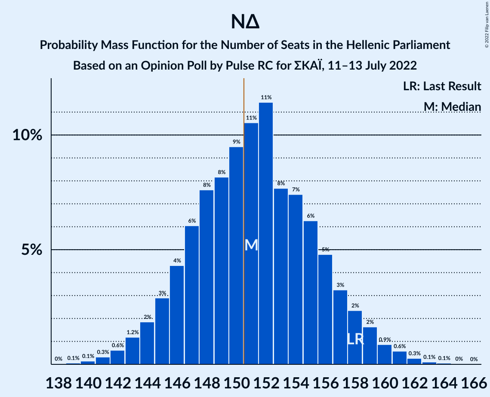

| Number of Seats | Probability | Accumulated | Special Marks |
|:---------------:|:-----------:|:-----------:|:-------------:|
| 139 | 0.1% | 100% |  |
| 140 | 0.1% | 99.9% |  |
| 141 | 0.3% | 99.7% |  |
| 142 | 0.6% | 99.4% |  |
| 143 | 1.2% | 98.8% |  |
| 144 | 2% | 98% |  |
| 145 | 3% | 96% |  |
| 146 | 4% | 93% |  |
| 147 | 6% | 89% |  |
| 148 | 8% | 83% |  |
| 149 | 8% | 75% |  |
| 150 | 9% | 67% |  |
| 151 | 11% | 57% | Median, Majority |
| 152 | 11% | 47% |  |
| 153 | 8% | 35% |  |
| 154 | 7% | 28% |  |
| 155 | 6% | 20% |  |
| 156 | 5% | 14% |  |
| 157 | 3% | 9% |  |
| 158 | 2% | 6% | Last Result |
| 159 | 2% | 4% |  |
| 160 | 0.9% | 2% |  |
| 161 | 0.6% | 1.0% |  |
| 162 | 0.3% | 0.5% |  |
| 163 | 0.1% | 0.2% |  |
| 164 | 0.1% | 0.1% |  |
| 165 | 0% | 0% |  |

### Συνασπισμός Ριζοσπαστικής Αριστεράς – Μέτωπο Ευρωπαϊκής Ρεαλιστικής Ανυπακοής

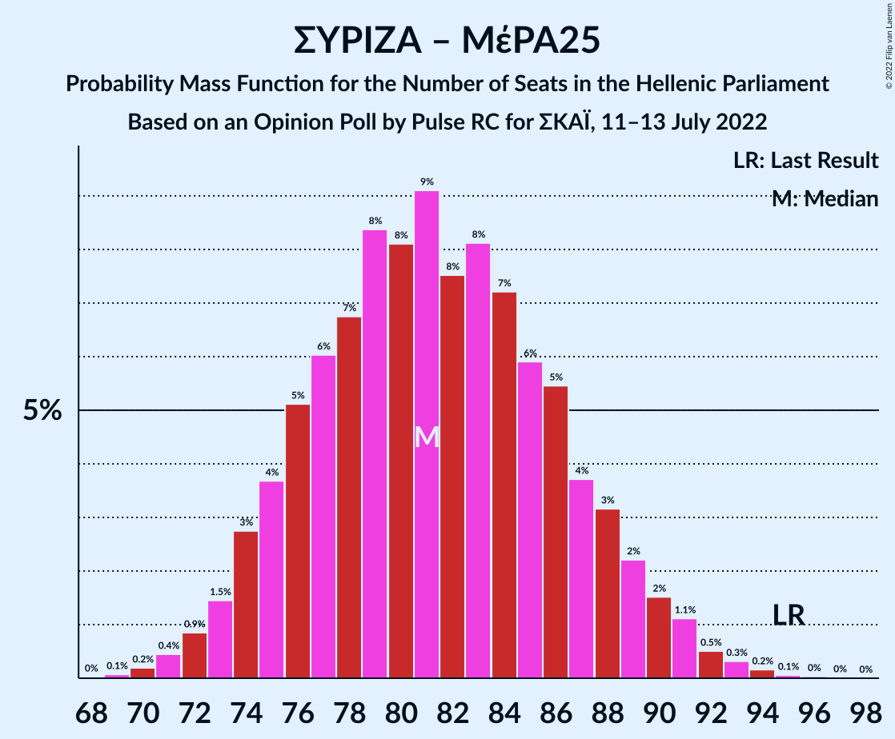

| Number of Seats | Probability | Accumulated | Special Marks |
|:---------------:|:-----------:|:-----------:|:-------------:|
| 69 | 0.1% | 100% |  |
| 70 | 0.2% | 99.9% |  |
| 71 | 0.4% | 99.7% |  |
| 72 | 0.9% | 99.2% |  |
| 73 | 1.5% | 98% |  |
| 74 | 3% | 97% |  |
| 75 | 4% | 94% |  |
| 76 | 5% | 91% |  |
| 77 | 6% | 85% |  |
| 78 | 7% | 79% | Median |
| 79 | 8% | 73% |  |
| 80 | 8% | 64% |  |
| 81 | 9% | 56% |  |
| 82 | 8% | 47% |  |
| 83 | 8% | 40% |  |
| 84 | 7% | 31% |  |
| 85 | 6% | 24% |  |
| 86 | 5% | 18% |  |
| 87 | 4% | 13% |  |
| 88 | 3% | 9% |  |
| 89 | 2% | 6% |  |
| 90 | 2% | 4% |  |
| 91 | 1.1% | 2% |  |
| 92 | 0.5% | 1.1% |  |
| 93 | 0.3% | 0.6% |  |
| 94 | 0.2% | 0.3% |  |
| 95 | 0.1% | 0.1% | Last Result |
| 96 | 0% | 0.1% |  |
| 97 | 0% | 0% |  |

### Συνασπισμός Ριζοσπαστικής Αριστεράς

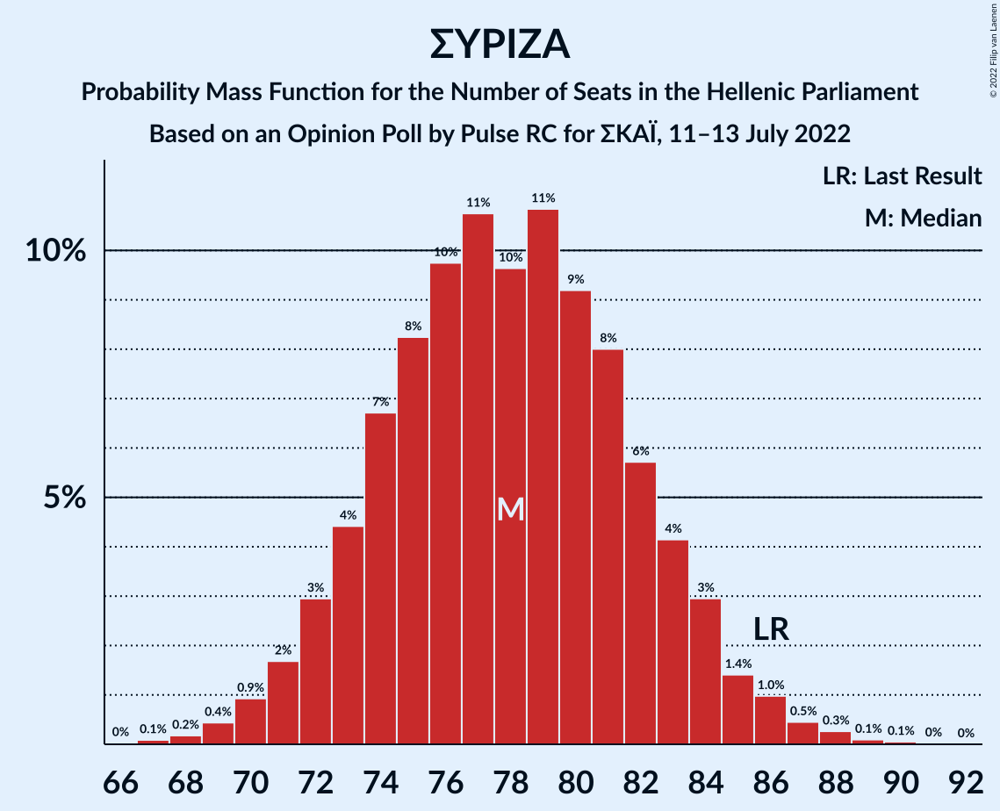

| Number of Seats | Probability | Accumulated | Special Marks |
|:---------------:|:-----------:|:-----------:|:-------------:|
| 67 | 0.1% | 100% |  |
| 68 | 0.2% | 99.9% |  |
| 69 | 0.4% | 99.7% |  |
| 70 | 0.9% | 99.2% |  |
| 71 | 2% | 98% |  |
| 72 | 3% | 97% |  |
| 73 | 4% | 94% |  |
| 74 | 7% | 89% |  |
| 75 | 8% | 83% |  |
| 76 | 10% | 74% |  |
| 77 | 11% | 65% |  |
| 78 | 10% | 54% | Median |
| 79 | 11% | 44% |  |
| 80 | 9% | 33% |  |
| 81 | 8% | 24% |  |
| 82 | 6% | 16% |  |
| 83 | 4% | 10% |  |
| 84 | 3% | 6% |  |
| 85 | 1.4% | 3% |  |
| 86 | 1.0% | 2% | Last Result |
| 87 | 0.5% | 0.9% |  |
| 88 | 0.3% | 0.5% |  |
| 89 | 0.1% | 0.2% |  |
| 90 | 0.1% | 0.1% |  |
| 91 | 0% | 0% |  |

## Technical Information

### Opinion Poll

+ **Polling firm:** Pulse RC
+ **Commissioner(s):** ΣΚΑΪ
+ **Fieldwork period:** 11–13 July 2022

### Calculations

+ **Sample size:** 1351
+ **Simulations done:** 1,048,576
+ **Error estimate:** 0.70%

