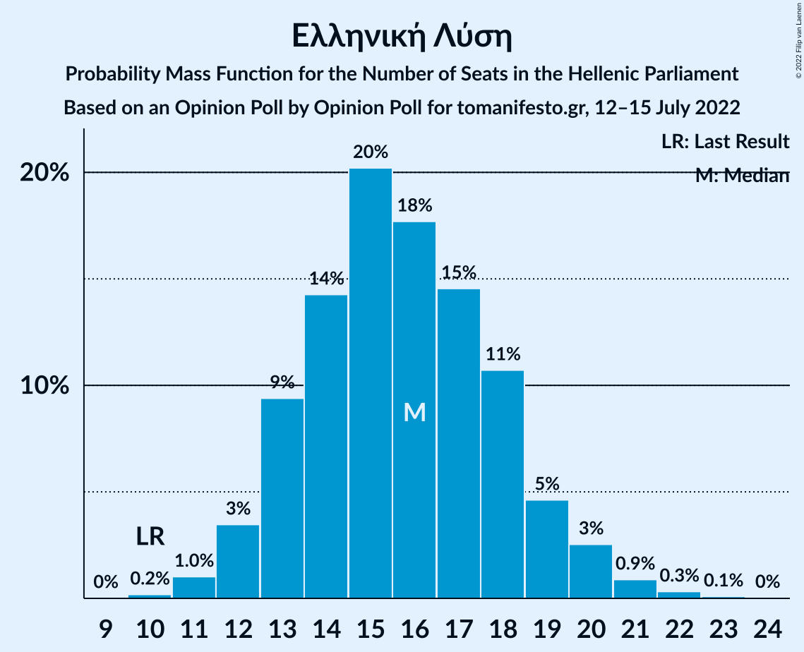

# Opinion Poll by Opinion Poll for tomanifesto.gr, 12–15 July 2022

<a href="#voting-intentions">Voting Intentions</a> | <a href="#seats">Seats</a> | <a href="#coalitions">Coalitions</a> | <a href="#technical-information">Technical Information</a>

## Voting Intentions

### Confidence Intervals

| Party | Last Result | Poll Result | 80% Confidence Interval | 90% Confidence Interval | 95% Confidence Interval | 99% Confidence Interval |
|:-----:|:-----------:|:-----------:|:-----------------------:|:-----------------------:|:-----------------------:|:-----------------------:|
| Νέα Δημοκρατία | 39.8% | 36.9% | 35.0–38.9% |34.5–39.5% |34.0–40.0% |33.1–40.9% |
| Συνασπισμός Ριζοσπαστικής Αριστεράς | 31.5% | 26.6% | 24.9–28.4% |24.4–29.0% |24.0–29.4% |23.2–30.3% |
| Κίνημα Αλλαγής | 8.1% | 13.8% | 12.5–15.3% |12.1–15.7% |11.8–16.1% |11.2–16.8% |
| Κομμουνιστικό Κόμμα Ελλάδας | 5.3% | 5.9% | 5.1–7.0% |4.8–7.3% |4.6–7.5% |4.2–8.1% |
| Ελληνική Λύση | 3.7% | 5.6% | 4.8–6.7% |4.6–7.0% |4.4–7.2% |4.0–7.7% |
| Μέτωπο Ευρωπαϊκής Ρεαλιστικής Ανυπακοής | 3.4% | 2.9% | 2.3–3.7% |2.1–3.9% |2.0–4.1% |1.8–4.5% |
| Πλεύση Ελευθερίας | 1.5% | 1.3% | 0.9–1.9% |0.8–2.0% |0.7–2.2% |0.6–2.5% |

*Note:* The poll result column reflects the actual value used in the calculations. Published results may vary slightly, and in addition be rounded to fewer digits.

## Seats

### Confidence Intervals

| Party | Last Result | Median | 80% Confidence Interval | 90% Confidence Interval | 95% Confidence Interval | 99% Confidence Interval |
|:-----:|:-----------:|:------:|:-----------------------:|:-----------------------:|:-----------------------:|:-----------------------:|
| <a href="#νέα-δημοκρατία">Νέα Δημοκρατία</a> | 158 | 152 | 146–158 |145–159 |143–161 |141–164 |
| <a href="#συνασπισμός-ριζοσπαστικής-αριστεράς">Συνασπισμός Ριζοσπαστικής Αριστεράς</a> | 86 | 74 | 69–78 |67–80 |66–81 |63–84 |
| <a href="#κίνημα-αλλαγής">Κίνημα Αλλαγής</a> | 22 | 38 | 34–42 |33–43 |32–44 |31–47 |
| <a href="#κομμουνιστικό-κόμμα-ελλάδας">Κομμουνιστικό Κόμμα Ελλάδας</a> | 15 | 16 | 14–19 |13–20 |13–21 |12–22 |
| <a href="#ελληνική-λύση">Ελληνική Λύση</a> | 10 | 16 | 13–18 |13–19 |12–20 |11–21 |
| <a href="#μέτωπο-ευρωπαϊκής-ρεαλιστικής-ανυπακοής">Μέτωπο Ευρωπαϊκής Ρεαλιστικής Ανυπακοής</a> | 9 | 0 | 0–10 |0–10 |0–11 |0–12 |
| <a href="#πλεύση-ελευθερίας">Πλεύση Ελευθερίας</a> | 0 | 0 | 0 |0 |0 |0 |

### Νέα Δημοκρατία

*For a full overview of the results for this party, see the [Νέα Δημοκρατία](party-νέαδημοκρατία.html) page.*

| Number of Seats | Probability | Accumulated | Special Marks |
|:---------------:|:-----------:|:-----------:|:-------------:|
| 138 | 0.1% | 100% |  |
| 139 | 0.1% | 99.9% |  |
| 140 | 0.2% | 99.8% |  |
| 141 | 0.4% | 99.6% |  |
| 142 | 0.8% | 99.2% |  |
| 143 | 1.2% | 98% |  |
| 144 | 2% | 97% |  |
| 145 | 3% | 95% |  |
| 146 | 3% | 93% |  |
| 147 | 5% | 89% |  |
| 148 | 7% | 84% |  |
| 149 | 5% | 77% |  |
| 150 | 8% | 72% |  |
| 151 | 8% | 64% | Majority |
| 152 | 10% | 56% | Median |
| 153 | 9% | 46% |  |
| 154 | 7% | 36% |  |
| 155 | 7% | 30% |  |
| 156 | 5% | 23% |  |
| 157 | 7% | 18% |  |
| 158 | 3% | 11% | Last Result |
| 159 | 3% | 8% |  |
| 160 | 2% | 5% |  |
| 161 | 2% | 3% |  |
| 162 | 0.7% | 2% |  |
| 163 | 0.4% | 1.0% |  |
| 164 | 0.2% | 0.5% |  |
| 165 | 0.2% | 0.3% |  |
| 166 | 0% | 0.1% |  |
| 167 | 0% | 0.1% |  |
| 168 | 0% | 0% |  |

### Συνασπισμός Ριζοσπαστικής Αριστεράς

*For a full overview of the results for this party, see the [Συνασπισμός Ριζοσπαστικής Αριστεράς](party-συνασπισμόςριζοσπαστικήςαριστεράς.html) page.*

| Number of Seats | Probability | Accumulated | Special Marks |
|:---------------:|:-----------:|:-----------:|:-------------:|
| 61 | 0% | 100% |  |
| 62 | 0.1% | 99.9% |  |
| 63 | 0.4% | 99.8% |  |
| 64 | 0.4% | 99.4% |  |
| 65 | 0.8% | 99.0% |  |
| 66 | 2% | 98% |  |
| 67 | 3% | 96% |  |
| 68 | 3% | 93% |  |
| 69 | 6% | 90% |  |
| 70 | 8% | 84% |  |
| 71 | 7% | 76% |  |
| 72 | 8% | 69% |  |
| 73 | 10% | 60% |  |
| 74 | 11% | 50% | Median |
| 75 | 10% | 39% |  |
| 76 | 7% | 29% |  |
| 77 | 6% | 22% |  |
| 78 | 6% | 16% |  |
| 79 | 3% | 10% |  |
| 80 | 2% | 6% |  |
| 81 | 2% | 5% |  |
| 82 | 1.1% | 2% |  |
| 83 | 0.5% | 1.2% |  |
| 84 | 0.3% | 0.7% |  |
| 85 | 0.2% | 0.4% |  |
| 86 | 0.1% | 0.2% | Last Result |
| 87 | 0% | 0.1% |  |
| 88 | 0% | 0% |  |

### Κίνημα Αλλαγής

*For a full overview of the results for this party, see the [Κίνημα Αλλαγής](party-κίνημααλλαγής.html) page.*

| Number of Seats | Probability | Accumulated | Special Marks |
|:---------------:|:-----------:|:-----------:|:-------------:|
| 22 | 0% | 100% | Last Result |
| 23 | 0% | 100% |  |
| 24 | 0% | 100% |  |
| 25 | 0% | 100% |  |
| 26 | 0% | 100% |  |
| 27 | 0% | 100% |  |
| 28 | 0% | 100% |  |
| 29 | 0.1% | 100% |  |
| 30 | 0.2% | 99.9% |  |
| 31 | 0.6% | 99.7% |  |
| 32 | 2% | 99.0% |  |
| 33 | 3% | 97% |  |
| 34 | 6% | 95% |  |
| 35 | 7% | 89% |  |
| 36 | 10% | 82% |  |
| 37 | 12% | 72% |  |
| 38 | 13% | 60% | Median |
| 39 | 13% | 47% |  |
| 40 | 11% | 33% |  |
| 41 | 8% | 23% |  |
| 42 | 6% | 15% |  |
| 43 | 4% | 9% |  |
| 44 | 3% | 5% |  |
| 45 | 1.1% | 2% |  |
| 46 | 0.7% | 1.2% |  |
| 47 | 0.3% | 0.5% |  |
| 48 | 0.1% | 0.2% |  |
| 49 | 0% | 0.1% |  |
| 50 | 0% | 0% |  |

### Κομμουνιστικό Κόμμα Ελλάδας

*For a full overview of the results for this party, see the [Κομμουνιστικό Κόμμα Ελλάδας](party-κομμουνιστικόκόμμαελλάδας.html) page.*

| Number of Seats | Probability | Accumulated | Special Marks |
|:---------------:|:-----------:|:-----------:|:-------------:|
| 10 | 0% | 100% |  |
| 11 | 0.4% | 99.9% |  |
| 12 | 2% | 99.6% |  |
| 13 | 5% | 98% |  |
| 14 | 11% | 93% |  |
| 15 | 17% | 83% | Last Result |
| 16 | 18% | 66% | Median |
| 17 | 18% | 48% |  |
| 18 | 13% | 30% |  |
| 19 | 8% | 17% |  |
| 20 | 5% | 9% |  |
| 21 | 2% | 3% |  |
| 22 | 1.0% | 1.4% |  |
| 23 | 0.3% | 0.4% |  |
| 24 | 0.1% | 0.1% |  |
| 25 | 0% | 0% |  |

### Ελληνική Λύση

*For a full overview of the results for this party, see the [Ελληνική Λύση](party-ελληνικήλύση.html) page.*

| Number of Seats | Probability | Accumulated | Special Marks |
|:---------------:|:-----------:|:-----------:|:-------------:|
| 10 | 0.2% | 100% | Last Result |
| 11 | 1.0% | 99.8% |  |
| 12 | 3% | 98.8% |  |
| 13 | 9% | 95% |  |
| 14 | 14% | 86% |  |
| 15 | 20% | 72% |  |
| 16 | 18% | 51% | Median |
| 17 | 15% | 34% |  |
| 18 | 11% | 19% |  |
| 19 | 5% | 8% |  |
| 20 | 3% | 4% |  |
| 21 | 0.9% | 1.3% |  |
| 22 | 0.3% | 0.4% |  |
| 23 | 0.1% | 0.1% |  |
| 24 | 0% | 0% |  |

### Μέτωπο Ευρωπαϊκής Ρεαλιστικής Ανυπακοής

*For a full overview of the results for this party, see the [Μέτωπο Ευρωπαϊκής Ρεαλιστικής Ανυπακοής](party-μέτωποευρωπαϊκήςρεαλιστικήςανυπακοής.html) page.*

| Number of Seats | Probability | Accumulated | Special Marks |
|:---------------:|:-----------:|:-----------:|:-------------:|
| 0 | 57% | 100% | Median |
| 1 | 0% | 43% |  |
| 2 | 0% | 43% |  |
| 3 | 0% | 43% |  |
| 4 | 0% | 43% |  |
| 5 | 0% | 43% |  |
| 6 | 0% | 43% |  |
| 7 | 0% | 43% |  |
| 8 | 7% | 43% |  |
| 9 | 21% | 35% | Last Result |
| 10 | 10% | 15% |  |
| 11 | 3% | 5% |  |
| 12 | 1.1% | 1.4% |  |
| 13 | 0.2% | 0.3% |  |
| 14 | 0.1% | 0.1% |  |
| 15 | 0% | 0% |  |

### Πλεύση Ελευθερίας

*For a full overview of the results for this party, see the [Πλεύση Ελευθερίας](party-πλεύσηελευθερίας.html) page.*

| Number of Seats | Probability | Accumulated | Special Marks |
|:---------------:|:-----------:|:-----------:|:-------------:|
| 0 | 100% | 100% | Last Result, Median |

## Coalitions

### Confidence Intervals

| Coalition | Last Result | Median | Majority? | 80% Confidence Interval | 90% Confidence Interval | 95% Confidence Interval | 99% Confidence Interval |
|:---------:|:-----------:|:------:|:---------:|:-----------------------:|:-----------------------:|:-----------------------:|:-----------------------:|
| Νέα Δημοκρατία – Κίνημα Αλλαγής | 180 | 190 | 100% | 184–197 | 182–198 | 181–200 | 178–203 |
| Νέα Δημοκρατία | 158 | 152 | 64% | 146–158 | 145–159 | 143–161 | 141–164 |
| Συνασπισμός Ριζοσπαστικής Αριστεράς – Μέτωπο Ευρωπαϊκής Ρεαλιστικής Ανυπακοής | 95 | 78 | 0% | 71–84 | 70–85 | 68–87 | 66–90 |
| Συνασπισμός Ριζοσπαστικής Αριστεράς | 86 | 74 | 0% | 69–78 | 67–80 | 66–81 | 63–84 |

### Νέα Δημοκρατία – Κίνημα Αλλαγής

| Number of Seats | Probability | Accumulated | Special Marks |
|:---------------:|:-----------:|:-----------:|:-------------:|
| 175 | 0.1% | 100% |  |
| 176 | 0.1% | 99.9% |  |
| 177 | 0.2% | 99.8% |  |
| 178 | 0.5% | 99.7% |  |
| 179 | 0.6% | 99.2% |  |
| 180 | 0.7% | 98.6% | Last Result |
| 181 | 1.4% | 98% |  |
| 182 | 2% | 96% |  |
| 183 | 3% | 95% |  |
| 184 | 3% | 92% |  |
| 185 | 4% | 88% |  |
| 186 | 6% | 85% |  |
| 187 | 9% | 79% |  |
| 188 | 7% | 70% |  |
| 189 | 8% | 63% |  |
| 190 | 6% | 55% | Median |
| 191 | 7% | 50% |  |
| 192 | 9% | 42% |  |
| 193 | 5% | 34% |  |
| 194 | 7% | 29% |  |
| 195 | 8% | 21% |  |
| 196 | 3% | 13% |  |
| 197 | 3% | 11% |  |
| 198 | 3% | 7% |  |
| 199 | 1.0% | 4% |  |
| 200 | 1.2% | 3% |  |
| 201 | 0.8% | 2% |  |
| 202 | 0.4% | 0.9% |  |
| 203 | 0.3% | 0.6% |  |
| 204 | 0.1% | 0.2% |  |
| 205 | 0% | 0.1% |  |
| 206 | 0% | 0% |  |

### Νέα Δημοκρατία

| Number of Seats | Probability | Accumulated | Special Marks |
|:---------------:|:-----------:|:-----------:|:-------------:|
| 138 | 0.1% | 100% |  |
| 139 | 0.1% | 99.9% |  |
| 140 | 0.2% | 99.8% |  |
| 141 | 0.4% | 99.6% |  |
| 142 | 0.8% | 99.2% |  |
| 143 | 1.2% | 98% |  |
| 144 | 2% | 97% |  |
| 145 | 3% | 95% |  |
| 146 | 3% | 93% |  |
| 147 | 5% | 89% |  |
| 148 | 7% | 84% |  |
| 149 | 5% | 77% |  |
| 150 | 8% | 72% |  |
| 151 | 8% | 64% | Majority |
| 152 | 10% | 56% | Median |
| 153 | 9% | 46% |  |
| 154 | 7% | 36% |  |
| 155 | 7% | 30% |  |
| 156 | 5% | 23% |  |
| 157 | 7% | 18% |  |
| 158 | 3% | 11% | Last Result |
| 159 | 3% | 8% |  |
| 160 | 2% | 5% |  |
| 161 | 2% | 3% |  |
| 162 | 0.7% | 2% |  |
| 163 | 0.4% | 1.0% |  |
| 164 | 0.2% | 0.5% |  |
| 165 | 0.2% | 0.3% |  |
| 166 | 0% | 0.1% |  |
| 167 | 0% | 0.1% |  |
| 168 | 0% | 0% |  |

### Συνασπισμός Ριζοσπαστικής Αριστεράς – Μέτωπο Ευρωπαϊκής Ρεαλιστικής Ανυπακοής

| Number of Seats | Probability | Accumulated | Special Marks |
|:---------------:|:-----------:|:-----------:|:-------------:|
| 63 | 0.1% | 100% |  |
| 64 | 0.1% | 99.9% |  |
| 65 | 0.2% | 99.8% |  |
| 66 | 0.3% | 99.6% |  |
| 67 | 1.2% | 99.3% |  |
| 68 | 1.3% | 98% |  |
| 69 | 1.2% | 97% |  |
| 70 | 3% | 96% |  |
| 71 | 5% | 92% |  |
| 72 | 5% | 88% |  |
| 73 | 4% | 83% |  |
| 74 | 8% | 78% | Median |
| 75 | 10% | 70% |  |
| 76 | 4% | 60% |  |
| 77 | 6% | 56% |  |
| 78 | 10% | 50% |  |
| 79 | 6% | 40% |  |
| 80 | 5% | 34% |  |
| 81 | 5% | 29% |  |
| 82 | 7% | 24% |  |
| 83 | 5% | 17% |  |
| 84 | 3% | 12% |  |
| 85 | 4% | 9% |  |
| 86 | 1.3% | 5% |  |
| 87 | 1.3% | 4% |  |
| 88 | 1.2% | 2% |  |
| 89 | 0.5% | 1.0% |  |
| 90 | 0.3% | 0.6% |  |
| 91 | 0.1% | 0.3% |  |
| 92 | 0.1% | 0.2% |  |
| 93 | 0% | 0.1% |  |
| 94 | 0% | 0% |  |
| 95 | 0% | 0% | Last Result |

### Συνασπισμός Ριζοσπαστικής Αριστεράς

| Number of Seats | Probability | Accumulated | Special Marks |
|:---------------:|:-----------:|:-----------:|:-------------:|
| 61 | 0% | 100% |  |
| 62 | 0.1% | 99.9% |  |
| 63 | 0.4% | 99.8% |  |
| 64 | 0.4% | 99.4% |  |
| 65 | 0.8% | 99.0% |  |
| 66 | 2% | 98% |  |
| 67 | 3% | 96% |  |
| 68 | 3% | 93% |  |
| 69 | 6% | 90% |  |
| 70 | 8% | 84% |  |
| 71 | 7% | 76% |  |
| 72 | 8% | 69% |  |
| 73 | 10% | 60% |  |
| 74 | 11% | 50% | Median |
| 75 | 10% | 39% |  |
| 76 | 7% | 29% |  |
| 77 | 6% | 22% |  |
| 78 | 6% | 16% |  |
| 79 | 3% | 10% |  |
| 80 | 2% | 6% |  |
| 81 | 2% | 5% |  |
| 82 | 1.1% | 2% |  |
| 83 | 0.5% | 1.2% |  |
| 84 | 0.3% | 0.7% |  |
| 85 | 0.2% | 0.4% |  |
| 86 | 0.1% | 0.2% | Last Result |
| 87 | 0% | 0.1% |  |
| 88 | 0% | 0% |  |

## Technical Information

### Opinion Poll

+ **Polling firm:** Opinion Poll
+ **Commissioner(s):** tomanifesto.gr
+ **Fieldwork period:** 12–15 July 2022

### Calculations

+ **Sample size:** 1015
+ **Simulations done:** 1,048,576
+ **Error estimate:** 1.30%

