# Opinion Poll by Marc for Πρώτο ΘΕΜΑ, 16–20 July 2022

<a href="#voting-intentions">Voting Intentions</a> | <a href="#seats">Seats</a> | <a href="#coalitions">Coalitions</a> | <a href="#technical-information">Technical Information</a>

## Voting Intentions

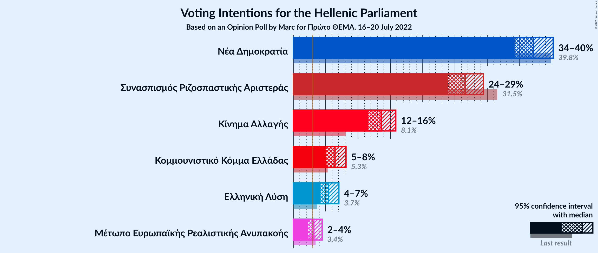

### Confidence Intervals

| Party | Last Result | Poll Result | 80% Confidence Interval | 90% Confidence Interval | 95% Confidence Interval | 99% Confidence Interval |
|:-----:|:-----------:|:-----------:|:-----------------------:|:-----------------------:|:-----------------------:|:-----------------------:|
| Νέα Δημοκρατία | 39.8% | 37.2% | 35.2–39.2% |34.7–39.7% |34.2–40.2% |33.3–41.2% |
| Συνασπισμός Ριζοσπαστικής Αριστεράς | 31.5% | 26.6% | 24.8–28.4% |24.3–28.9% |23.9–29.4% |23.1–30.3% |
| Κίνημα Αλλαγής | 8.1% | 13.6% | 12.3–15.1% |11.9–15.5% |11.6–15.8% |11.0–16.6% |
| Κομμουνιστικό Κόμμα Ελλάδας | 5.3% | 6.4% | 5.5–7.5% |5.3–7.9% |5.1–8.1% |4.7–8.7% |
| Ελληνική Λύση | 3.7% | 5.5% | 4.6–6.5% |4.4–6.8% |4.2–7.0% |3.8–7.6% |
| Μέτωπο Ευρωπαϊκής Ρεαλιστικής Ανυπακοής | 3.4% | 3.2% | 2.6–4.0% |2.4–4.2% |2.3–4.5% |2.0–4.9% |

*Note:* The poll result column reflects the actual value used in the calculations. Published results may vary slightly, and in addition be rounded to fewer digits.

## Seats

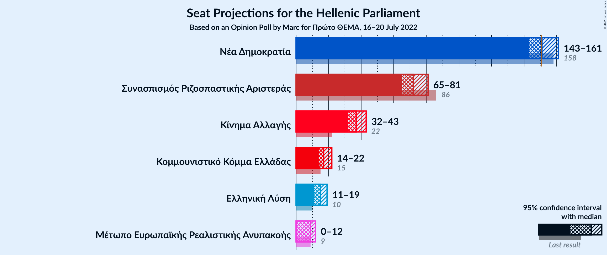

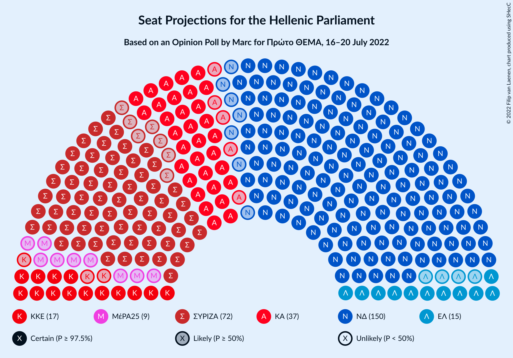

### Confidence Intervals

| Party | Last Result | Median | 80% Confidence Interval | 90% Confidence Interval | 95% Confidence Interval | 99% Confidence Interval |
|:-----:|:-----------:|:------:|:-----------------------:|:-----------------------:|:-----------------------:|:-----------------------:|
| <a href="#νέα-δημοκρατία">Νέα Δημοκρατία</a> | 158 | 151 | 146–157 |144–159 |143–161 |140–164 |
| <a href="#συνασπισμός-ριζοσπαστικής-αριστεράς">Συνασπισμός Ριζοσπαστικής Αριστεράς</a> | 86 | 72 | 67–78 |66–79 |65–81 |62–84 |
| <a href="#κίνημα-αλλαγής">Κίνημα Αλλαγής</a> | 22 | 37 | 33–41 |32–42 |32–43 |30–46 |
| <a href="#κομμουνιστικό-κόμμα-ελλάδας">Κομμουνιστικό Κόμμα Ελλάδας</a> | 15 | 17 | 15–21 |14–21 |14–22 |13–24 |
| <a href="#ελληνική-λύση">Ελληνική Λύση</a> | 10 | 15 | 13–18 |12–18 |11–19 |10–20 |
| <a href="#μέτωπο-ευρωπαϊκής-ρεαλιστικής-ανυπακοής">Μέτωπο Ευρωπαϊκής Ρεαλιστικής Ανυπακοής</a> | 9 | 9 | 0–11 |0–12 |0–12 |0–13 |

### Νέα Δημοκρατία

*For a full overview of the results for this party, see the [Νέα Δημοκρατία](party-νέαδημοκρατία.html) page.*

| Number of Seats | Probability | Accumulated | Special Marks |
|:---------------:|:-----------:|:-----------:|:-------------:|
| 137 | 0% | 100% |  |
| 138 | 0.1% | 99.9% |  |
| 139 | 0.2% | 99.9% |  |
| 140 | 0.3% | 99.7% |  |
| 141 | 0.6% | 99.4% |  |
| 142 | 0.8% | 98.8% |  |
| 143 | 1.5% | 98% |  |
| 144 | 2% | 97% |  |
| 145 | 3% | 94% |  |
| 146 | 5% | 91% |  |
| 147 | 5% | 86% |  |
| 148 | 7% | 81% |  |
| 149 | 6% | 74% |  |
| 150 | 9% | 68% |  |
| 151 | 8% | 58% | Median, Majority |
| 152 | 10% | 50% |  |
| 153 | 9% | 40% |  |
| 154 | 7% | 31% |  |
| 155 | 7% | 25% |  |
| 156 | 4% | 17% |  |
| 157 | 5% | 14% |  |
| 158 | 2% | 9% | Last Result |
| 159 | 3% | 7% |  |
| 160 | 1.1% | 4% |  |
| 161 | 1.0% | 3% |  |
| 162 | 0.7% | 2% |  |
| 163 | 0.3% | 0.9% |  |
| 164 | 0.3% | 0.5% |  |
| 165 | 0.1% | 0.2% |  |
| 166 | 0.1% | 0.1% |  |
| 167 | 0% | 0% |  |

### Συνασπισμός Ριζοσπαστικής Αριστεράς

*For a full overview of the results for this party, see the [Συνασπισμός Ριζοσπαστικής Αριστεράς](party-συνασπισμόςριζοσπαστικήςαριστεράς.html) page.*

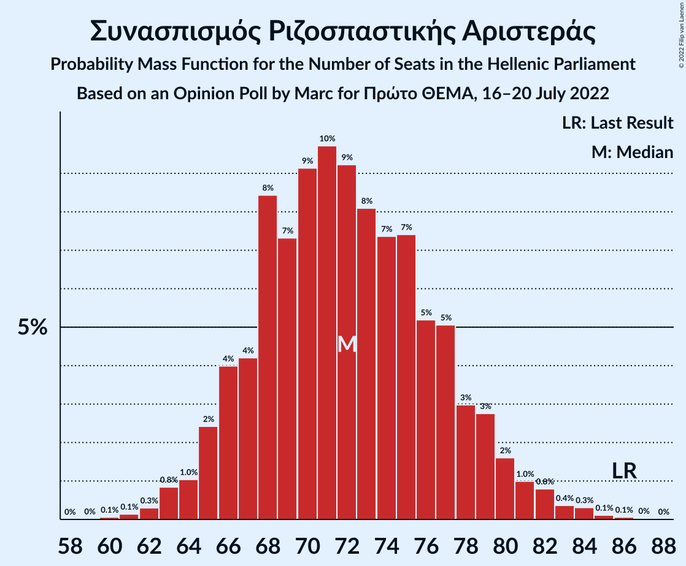

| Number of Seats | Probability | Accumulated | Special Marks |
|:---------------:|:-----------:|:-----------:|:-------------:|
| 60 | 0.1% | 100% |  |
| 61 | 0.1% | 99.9% |  |
| 62 | 0.3% | 99.8% |  |
| 63 | 0.8% | 99.5% |  |
| 64 | 1.0% | 98.6% |  |
| 65 | 2% | 98% |  |
| 66 | 4% | 95% |  |
| 67 | 4% | 91% |  |
| 68 | 8% | 87% |  |
| 69 | 7% | 79% |  |
| 70 | 9% | 71% |  |
| 71 | 10% | 62% |  |
| 72 | 9% | 52% | Median |
| 73 | 8% | 43% |  |
| 74 | 7% | 35% |  |
| 75 | 7% | 28% |  |
| 76 | 5% | 20% |  |
| 77 | 5% | 15% |  |
| 78 | 3% | 10% |  |
| 79 | 3% | 7% |  |
| 80 | 2% | 4% |  |
| 81 | 1.0% | 3% |  |
| 82 | 0.8% | 2% |  |
| 83 | 0.4% | 0.9% |  |
| 84 | 0.3% | 0.5% |  |
| 85 | 0.1% | 0.2% |  |
| 86 | 0.1% | 0.1% | Last Result |
| 87 | 0% | 0% |  |

### Κίνημα Αλλαγής

*For a full overview of the results for this party, see the [Κίνημα Αλλαγής](party-κίνημααλλαγής.html) page.*

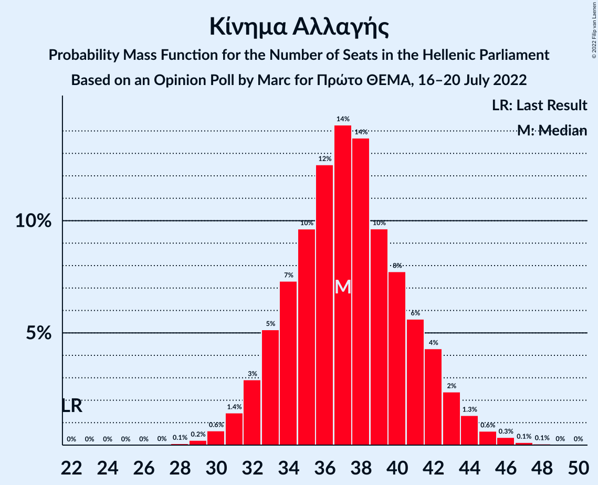

| Number of Seats | Probability | Accumulated | Special Marks |
|:---------------:|:-----------:|:-----------:|:-------------:|
| 22 | 0% | 100% | Last Result |
| 23 | 0% | 100% |  |
| 24 | 0% | 100% |  |
| 25 | 0% | 100% |  |
| 26 | 0% | 100% |  |
| 27 | 0% | 100% |  |
| 28 | 0.1% | 100% |  |
| 29 | 0.2% | 99.9% |  |
| 30 | 0.6% | 99.7% |  |
| 31 | 1.4% | 99.0% |  |
| 32 | 3% | 98% |  |
| 33 | 5% | 95% |  |
| 34 | 7% | 90% |  |
| 35 | 10% | 82% |  |
| 36 | 12% | 73% |  |
| 37 | 14% | 60% | Median |
| 38 | 14% | 46% |  |
| 39 | 10% | 32% |  |
| 40 | 8% | 23% |  |
| 41 | 6% | 15% |  |
| 42 | 4% | 9% |  |
| 43 | 2% | 5% |  |
| 44 | 1.3% | 2% |  |
| 45 | 0.6% | 1.2% |  |
| 46 | 0.3% | 0.5% |  |
| 47 | 0.1% | 0.2% |  |
| 48 | 0.1% | 0.1% |  |
| 49 | 0% | 0% |  |

### Κομμουνιστικό Κόμμα Ελλάδας

*For a full overview of the results for this party, see the [Κομμουνιστικό Κόμμα Ελλάδας](party-κομμουνιστικόκόμμαελλάδας.html) page.*

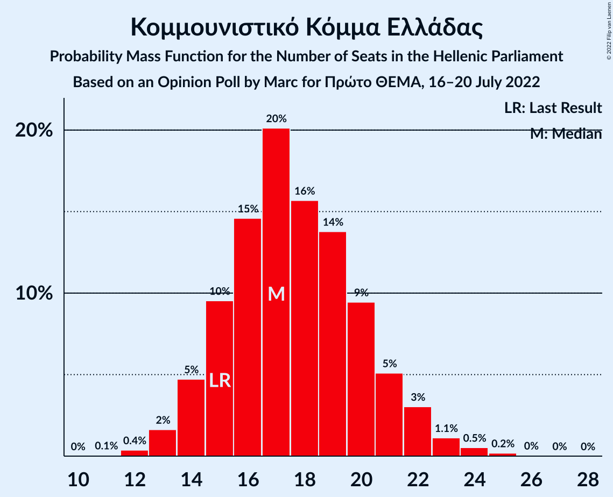

| Number of Seats | Probability | Accumulated | Special Marks |
|:---------------:|:-----------:|:-----------:|:-------------:|
| 11 | 0.1% | 100% |  |
| 12 | 0.4% | 99.9% |  |
| 13 | 2% | 99.6% |  |
| 14 | 5% | 98% |  |
| 15 | 10% | 93% | Last Result |
| 16 | 15% | 84% |  |
| 17 | 20% | 69% | Median |
| 18 | 16% | 49% |  |
| 19 | 14% | 33% |  |
| 20 | 9% | 19% |  |
| 21 | 5% | 10% |  |
| 22 | 3% | 5% |  |
| 23 | 1.1% | 2% |  |
| 24 | 0.5% | 0.8% |  |
| 25 | 0.2% | 0.3% |  |
| 26 | 0% | 0.1% |  |
| 27 | 0% | 0% |  |

### Ελληνική Λύση

*For a full overview of the results for this party, see the [Ελληνική Λύση](party-ελληνικήλύση.html) page.*

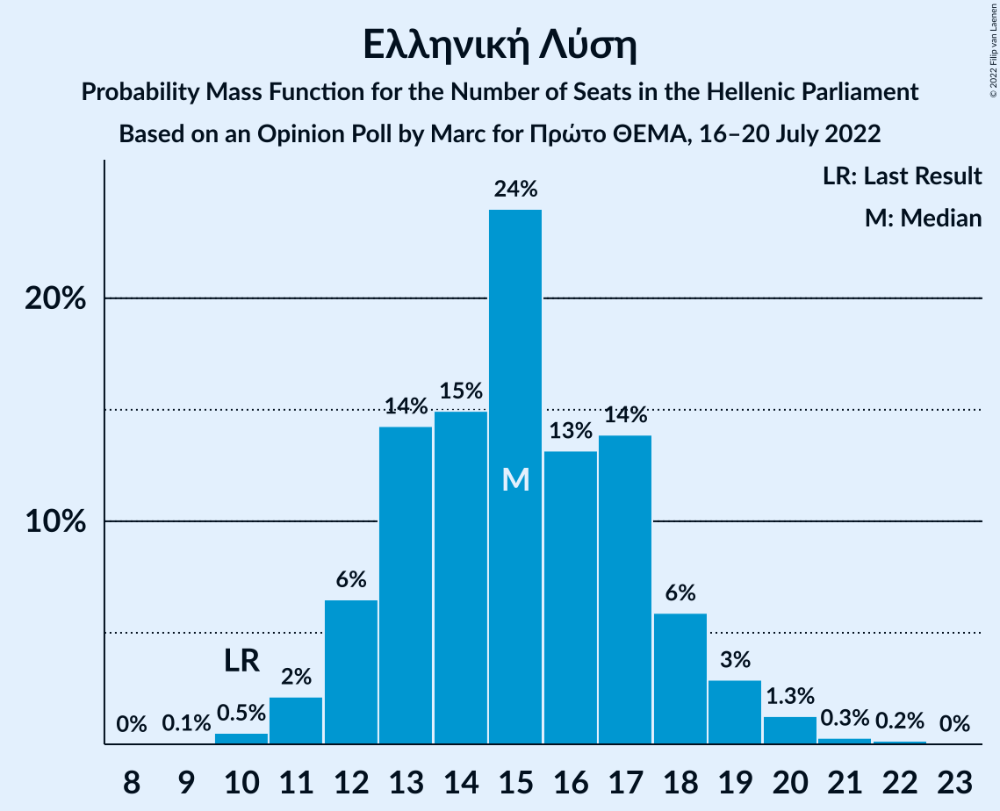

| Number of Seats | Probability | Accumulated | Special Marks |
|:---------------:|:-----------:|:-----------:|:-------------:|
| 9 | 0.1% | 100% |  |
| 10 | 0.5% | 99.9% | Last Result |
| 11 | 2% | 99.4% |  |
| 12 | 6% | 97% |  |
| 13 | 14% | 91% |  |
| 14 | 15% | 77% |  |
| 15 | 24% | 62% | Median |
| 16 | 13% | 38% |  |
| 17 | 14% | 24% |  |
| 18 | 6% | 11% |  |
| 19 | 3% | 5% |  |
| 20 | 1.3% | 2% |  |
| 21 | 0.3% | 0.5% |  |
| 22 | 0.2% | 0.2% |  |
| 23 | 0% | 0% |  |

### Μέτωπο Ευρωπαϊκής Ρεαλιστικής Ανυπακοής

*For a full overview of the results for this party, see the [Μέτωπο Ευρωπαϊκής Ρεαλιστικής Ανυπακοής](party-μέτωποευρωπαϊκήςρεαλιστικήςανυπακοής.html) page.*

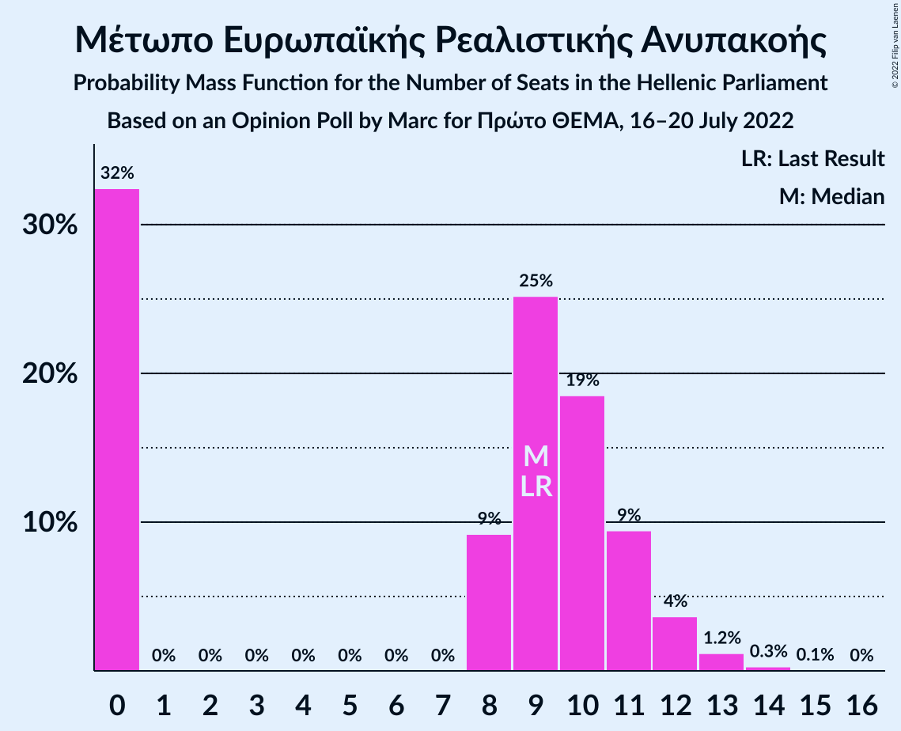

| Number of Seats | Probability | Accumulated | Special Marks |
|:---------------:|:-----------:|:-----------:|:-------------:|
| 0 | 32% | 100% |  |
| 1 | 0% | 68% |  |
| 2 | 0% | 68% |  |
| 3 | 0% | 68% |  |
| 4 | 0% | 68% |  |
| 5 | 0% | 68% |  |
| 6 | 0% | 68% |  |
| 7 | 0% | 68% |  |
| 8 | 9% | 68% |  |
| 9 | 25% | 58% | Last Result, Median |
| 10 | 19% | 33% |  |
| 11 | 9% | 15% |  |
| 12 | 4% | 5% |  |
| 13 | 1.2% | 2% |  |
| 14 | 0.3% | 0.4% |  |
| 15 | 0.1% | 0.1% |  |
| 16 | 0% | 0% |  |

## Coalitions

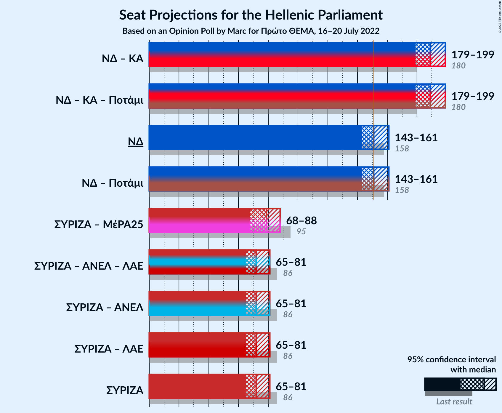

### Confidence Intervals

| Coalition | Last Result | Median | Majority? | 80% Confidence Interval | 90% Confidence Interval | 95% Confidence Interval | 99% Confidence Interval |
|:---------:|:-----------:|:------:|:---------:|:-----------------------:|:-----------------------:|:-----------------------:|:-----------------------:|
| Νέα Δημοκρατία – Κίνημα Αλλαγής | 180 | 189 | 100% | 182–195 | 181–197 | 179–199 | 176–202 |
| Νέα Δημοκρατία | 158 | 151 | 58% | 146–157 | 144–159 | 143–161 | 140–164 |
| Συνασπισμός Ριζοσπαστικής Αριστεράς – Μέτωπο Ευρωπαϊκής Ρεαλιστικής Ανυπακοής | 95 | 79 | 0% | 72–85 | 70–86 | 68–88 | 66–90 |
| Συνασπισμός Ριζοσπαστικής Αριστεράς | 86 | 72 | 0% | 67–78 | 66–79 | 65–81 | 62–84 |

### Νέα Δημοκρατία – Κίνημα Αλλαγής

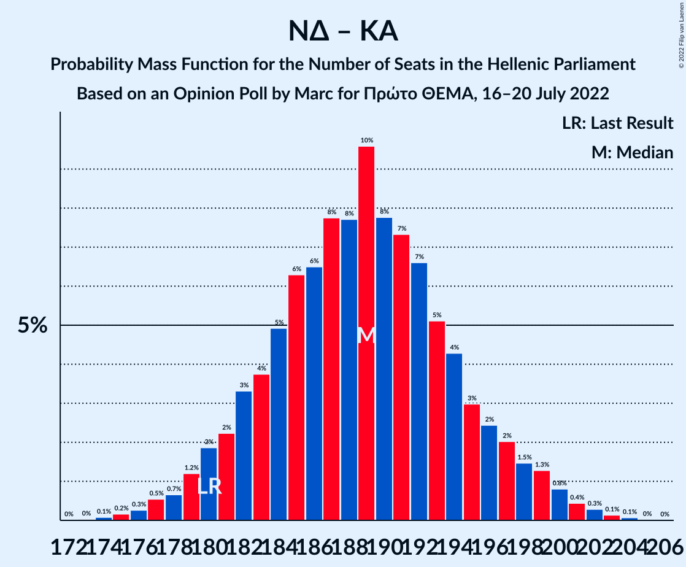

| Number of Seats | Probability | Accumulated | Special Marks |
|:---------------:|:-----------:|:-----------:|:-------------:|
| 173 | 0% | 100% |  |
| 174 | 0.1% | 99.9% |  |
| 175 | 0.2% | 99.9% |  |
| 176 | 0.3% | 99.7% |  |
| 177 | 0.5% | 99.4% |  |
| 178 | 0.7% | 98.9% |  |
| 179 | 1.2% | 98% |  |
| 180 | 2% | 97% | Last Result |
| 181 | 2% | 95% |  |
| 182 | 3% | 93% |  |
| 183 | 4% | 90% |  |
| 184 | 5% | 86% |  |
| 185 | 6% | 81% |  |
| 186 | 6% | 75% |  |
| 187 | 8% | 68% |  |
| 188 | 8% | 60% | Median |
| 189 | 10% | 53% |  |
| 190 | 8% | 43% |  |
| 191 | 7% | 35% |  |
| 192 | 7% | 28% |  |
| 193 | 5% | 21% |  |
| 194 | 4% | 16% |  |
| 195 | 3% | 12% |  |
| 196 | 2% | 9% |  |
| 197 | 2% | 7% |  |
| 198 | 1.5% | 5% |  |
| 199 | 1.3% | 3% |  |
| 200 | 0.8% | 2% |  |
| 201 | 0.4% | 1.0% |  |
| 202 | 0.3% | 0.5% |  |
| 203 | 0.1% | 0.2% |  |
| 204 | 0.1% | 0.1% |  |
| 205 | 0% | 0% |  |

### Νέα Δημοκρατία

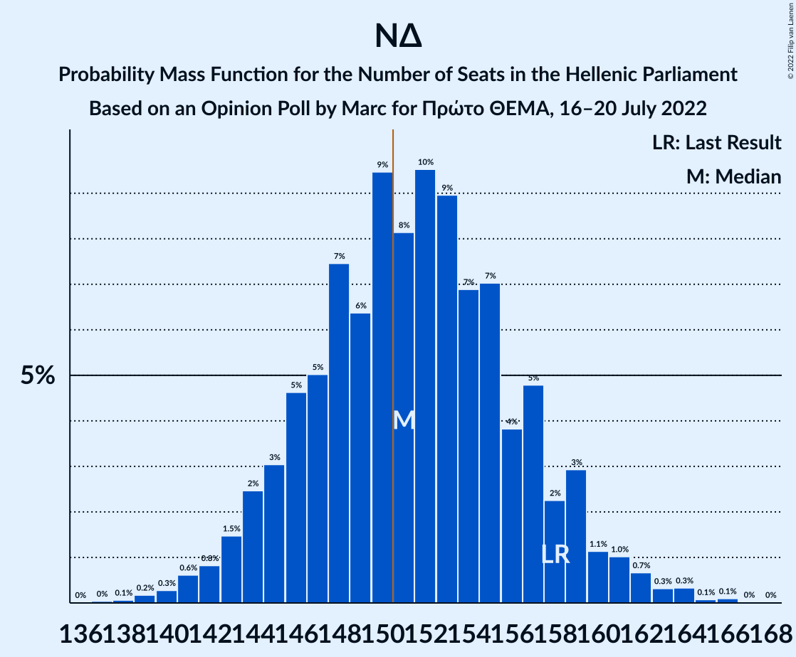

| Number of Seats | Probability | Accumulated | Special Marks |
|:---------------:|:-----------:|:-----------:|:-------------:|
| 137 | 0% | 100% |  |
| 138 | 0.1% | 99.9% |  |
| 139 | 0.2% | 99.9% |  |
| 140 | 0.3% | 99.7% |  |
| 141 | 0.6% | 99.4% |  |
| 142 | 0.8% | 98.8% |  |
| 143 | 1.5% | 98% |  |
| 144 | 2% | 97% |  |
| 145 | 3% | 94% |  |
| 146 | 5% | 91% |  |
| 147 | 5% | 86% |  |
| 148 | 7% | 81% |  |
| 149 | 6% | 74% |  |
| 150 | 9% | 68% |  |
| 151 | 8% | 58% | Median, Majority |
| 152 | 10% | 50% |  |
| 153 | 9% | 40% |  |
| 154 | 7% | 31% |  |
| 155 | 7% | 25% |  |
| 156 | 4% | 17% |  |
| 157 | 5% | 14% |  |
| 158 | 2% | 9% | Last Result |
| 159 | 3% | 7% |  |
| 160 | 1.1% | 4% |  |
| 161 | 1.0% | 3% |  |
| 162 | 0.7% | 2% |  |
| 163 | 0.3% | 0.9% |  |
| 164 | 0.3% | 0.5% |  |
| 165 | 0.1% | 0.2% |  |
| 166 | 0.1% | 0.1% |  |
| 167 | 0% | 0% |  |

### Συνασπισμός Ριζοσπαστικής Αριστεράς – Μέτωπο Ευρωπαϊκής Ρεαλιστικής Ανυπακοής

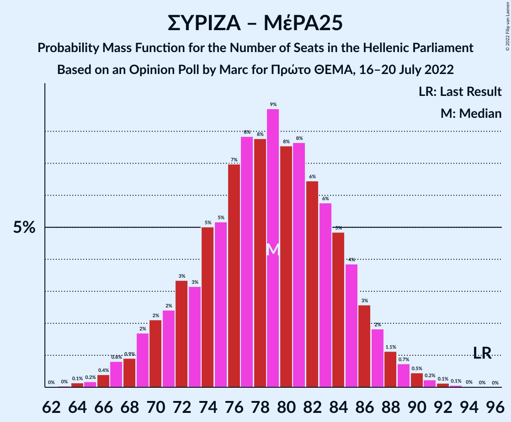

| Number of Seats | Probability | Accumulated | Special Marks |
|:---------------:|:-----------:|:-----------:|:-------------:|
| 63 | 0% | 100% |  |
| 64 | 0.1% | 99.9% |  |
| 65 | 0.2% | 99.8% |  |
| 66 | 0.4% | 99.6% |  |
| 67 | 0.8% | 99.2% |  |
| 68 | 0.9% | 98% |  |
| 69 | 2% | 97% |  |
| 70 | 2% | 96% |  |
| 71 | 2% | 94% |  |
| 72 | 3% | 91% |  |
| 73 | 3% | 88% |  |
| 74 | 5% | 85% |  |
| 75 | 5% | 80% |  |
| 76 | 7% | 75% |  |
| 77 | 8% | 68% |  |
| 78 | 8% | 60% |  |
| 79 | 9% | 52% |  |
| 80 | 8% | 43% |  |
| 81 | 8% | 36% | Median |
| 82 | 6% | 28% |  |
| 83 | 6% | 22% |  |
| 84 | 5% | 16% |  |
| 85 | 4% | 11% |  |
| 86 | 3% | 7% |  |
| 87 | 2% | 5% |  |
| 88 | 1.1% | 3% |  |
| 89 | 0.7% | 2% |  |
| 90 | 0.5% | 0.9% |  |
| 91 | 0.2% | 0.5% |  |
| 92 | 0.1% | 0.2% |  |
| 93 | 0.1% | 0.1% |  |
| 94 | 0% | 0% |  |
| 95 | 0% | 0% | Last Result |

### Συνασπισμός Ριζοσπαστικής Αριστεράς

| Number of Seats | Probability | Accumulated | Special Marks |
|:---------------:|:-----------:|:-----------:|:-------------:|
| 60 | 0.1% | 100% |  |
| 61 | 0.1% | 99.9% |  |
| 62 | 0.3% | 99.8% |  |
| 63 | 0.8% | 99.5% |  |
| 64 | 1.0% | 98.6% |  |
| 65 | 2% | 98% |  |
| 66 | 4% | 95% |  |
| 67 | 4% | 91% |  |
| 68 | 8% | 87% |  |
| 69 | 7% | 79% |  |
| 70 | 9% | 71% |  |
| 71 | 10% | 62% |  |
| 72 | 9% | 52% | Median |
| 73 | 8% | 43% |  |
| 74 | 7% | 35% |  |
| 75 | 7% | 28% |  |
| 76 | 5% | 20% |  |
| 77 | 5% | 15% |  |
| 78 | 3% | 10% |  |
| 79 | 3% | 7% |  |
| 80 | 2% | 4% |  |
| 81 | 1.0% | 3% |  |
| 82 | 0.8% | 2% |  |
| 83 | 0.4% | 0.9% |  |
| 84 | 0.3% | 0.5% |  |
| 85 | 0.1% | 0.2% |  |
| 86 | 0.1% | 0.1% | Last Result |
| 87 | 0% | 0% |  |

## Technical Information

### Opinion Poll

+ **Polling firm:** Marc
+ **Commissioner(s):** Πρώτο ΘΕΜΑ
+ **Fieldwork period:** 16–20 July 2022

### Calculations

+ **Sample size:** 1009
+ **Simulations done:** 1,048,576
+ **Error estimate:** 1.02%

