# Opinion Poll by Marc for Πρώτο ΘΕΜΑ, 22–25 August 2022

<a href="#voting-intentions">Voting Intentions</a> | <a href="#seats">Seats</a> | <a href="#coalitions">Coalitions</a> | <a href="#technical-information">Technical Information</a>

## Voting Intentions

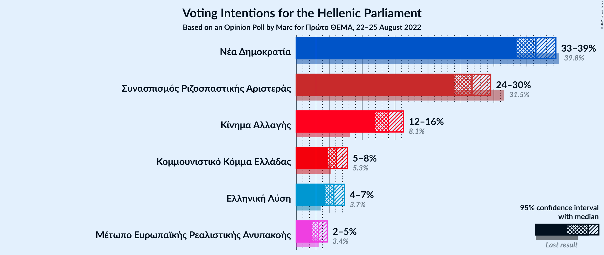

### Confidence Intervals

| Party | Last Result | Poll Result | 80% Confidence Interval | 90% Confidence Interval | 95% Confidence Interval | 99% Confidence Interval |
|:-----:|:-----------:|:-----------:|:-----------------------:|:-----------------------:|:-----------------------:|:-----------------------:|
| Νέα Δημοκρατία | 39.8% | 36.4% | 34.4–38.3% |33.9–38.9% |33.4–39.4% |32.5–40.4% |
| Συνασπισμός Ριζοσπαστικής Αριστεράς | 31.5% | 26.7% | 24.9–28.5% |24.4–29.1% |24.0–29.5% |23.2–30.4% |
| Κίνημα Αλλαγής | 8.1% | 14.0% | 12.7–15.5% |12.3–15.9% |12.0–16.3% |11.4–17.0% |
| Κομμουνιστικό Κόμμα Ελλάδας | 5.3% | 6.1% | 5.2–7.2% |5.0–7.5% |4.8–7.8% |4.4–8.3% |
| Ελληνική Λύση | 3.7% | 5.7% | 4.8–6.8% |4.6–7.1% |4.4–7.3% |4.0–7.8% |
| Μέτωπο Ευρωπαϊκής Ρεαλιστικής Ανυπακοής | 3.4% | 3.4% | 2.8–4.3% |2.6–4.5% |2.4–4.7% |2.2–5.2% |

*Note:* The poll result column reflects the actual value used in the calculations. Published results may vary slightly, and in addition be rounded to fewer digits.

## Seats

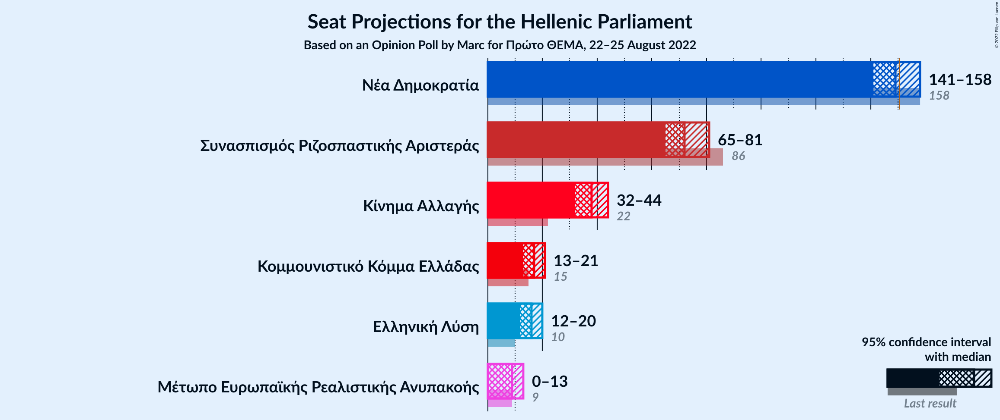

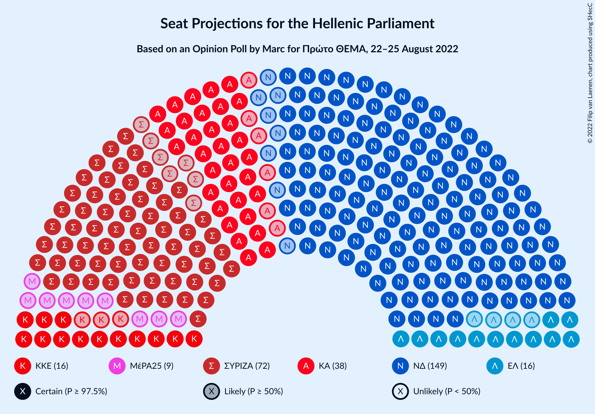

### Confidence Intervals

| Party | Last Result | Median | 80% Confidence Interval | 90% Confidence Interval | 95% Confidence Interval | 99% Confidence Interval |
|:-----:|:-----------:|:------:|:-----------------------:|:-----------------------:|:-----------------------:|:-----------------------:|
| <a href="#νέα-δημοκρατία">Νέα Δημοκρατία</a> | 158 | 149 | 143–155 |142–156 |141–158 |138–160 |
| <a href="#συνασπισμός-ριζοσπαστικής-αριστεράς">Συνασπισμός Ριζοσπαστικής Αριστεράς</a> | 86 | 72 | 68–78 |66–79 |65–81 |63–83 |
| <a href="#κίνημα-αλλαγής">Κίνημα Αλλαγής</a> | 22 | 38 | 34–42 |33–43 |32–44 |31–46 |
| <a href="#κομμουνιστικό-κόμμα-ελλάδας">Κομμουνιστικό Κόμμα Ελλάδας</a> | 15 | 17 | 14–20 |14–20 |13–21 |12–23 |
| <a href="#ελληνική-λύση">Ελληνική Λύση</a> | 10 | 16 | 13–18 |13–19 |12–20 |11–21 |
| <a href="#μέτωπο-ευρωπαϊκής-ρεαλιστικής-ανυπακοής">Μέτωπο Ευρωπαϊκής Ρεαλιστικής Ανυπακοής</a> | 9 | 9 | 0–11 |0–12 |0–13 |0–14 |

### Νέα Δημοκρατία

*For a full overview of the results for this party, see the [Νέα Δημοκρατία](party-νέαδημοκρατία.html) page.*

| Number of Seats | Probability | Accumulated | Special Marks |
|:---------------:|:-----------:|:-----------:|:-------------:|
| 135 | 0% | 100% |  |
| 136 | 0.1% | 99.9% |  |
| 137 | 0.1% | 99.9% |  |
| 138 | 0.4% | 99.7% |  |
| 139 | 0.6% | 99.3% |  |
| 140 | 1.0% | 98.7% |  |
| 141 | 2% | 98% |  |
| 142 | 3% | 96% |  |
| 143 | 3% | 93% |  |
| 144 | 5% | 90% |  |
| 145 | 6% | 85% |  |
| 146 | 8% | 78% |  |
| 147 | 9% | 70% |  |
| 148 | 9% | 62% |  |
| 149 | 10% | 53% | Median |
| 150 | 9% | 43% |  |
| 151 | 7% | 34% | Majority |
| 152 | 7% | 27% |  |
| 153 | 5% | 20% |  |
| 154 | 4% | 15% |  |
| 155 | 3% | 10% |  |
| 156 | 2% | 7% |  |
| 157 | 2% | 4% |  |
| 158 | 1.2% | 3% | Last Result |
| 159 | 0.6% | 2% |  |
| 160 | 0.5% | 1.0% |  |
| 161 | 0.2% | 0.5% |  |
| 162 | 0.1% | 0.3% |  |
| 163 | 0.1% | 0.1% |  |
| 164 | 0% | 0.1% |  |
| 165 | 0% | 0% |  |

### Συνασπισμός Ριζοσπαστικής Αριστεράς

*For a full overview of the results for this party, see the [Συνασπισμός Ριζοσπαστικής Αριστεράς](party-συνασπισμόςριζοσπαστικήςαριστεράς.html) page.*

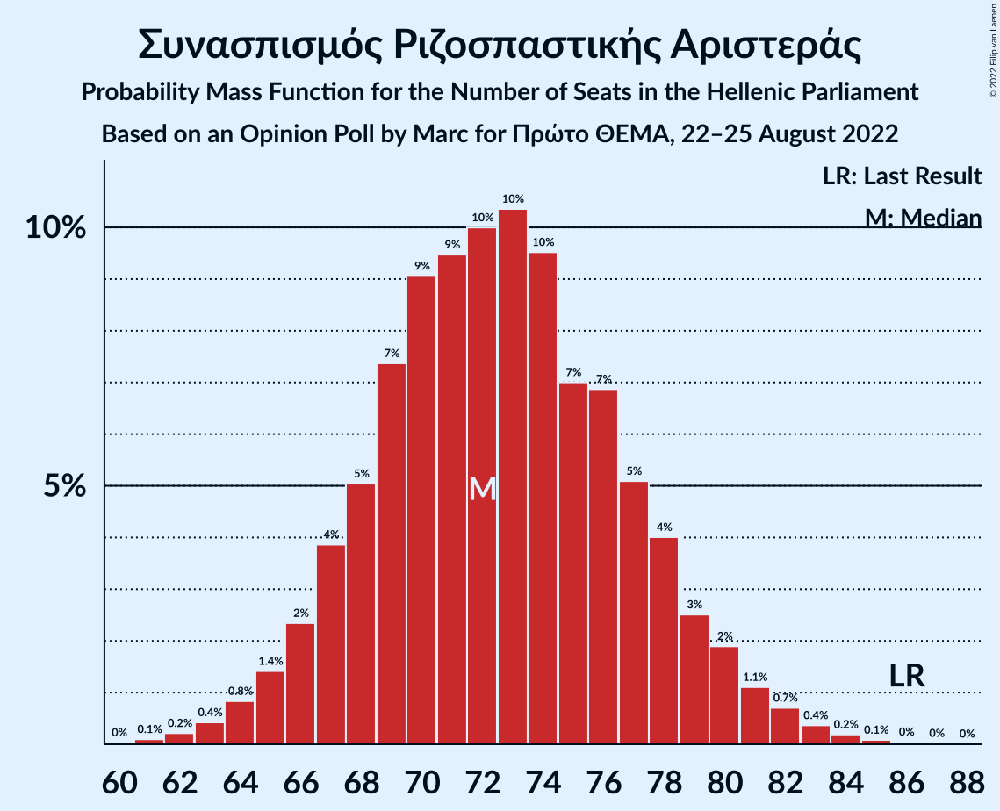

| Number of Seats | Probability | Accumulated | Special Marks |
|:---------------:|:-----------:|:-----------:|:-------------:|
| 60 | 0% | 100% |  |
| 61 | 0.1% | 99.9% |  |
| 62 | 0.2% | 99.8% |  |
| 63 | 0.4% | 99.6% |  |
| 64 | 0.8% | 99.2% |  |
| 65 | 1.4% | 98% |  |
| 66 | 2% | 97% |  |
| 67 | 4% | 95% |  |
| 68 | 5% | 91% |  |
| 69 | 7% | 86% |  |
| 70 | 9% | 78% |  |
| 71 | 9% | 69% |  |
| 72 | 10% | 60% | Median |
| 73 | 10% | 50% |  |
| 74 | 10% | 39% |  |
| 75 | 7% | 30% |  |
| 76 | 7% | 23% |  |
| 77 | 5% | 16% |  |
| 78 | 4% | 11% |  |
| 79 | 3% | 7% |  |
| 80 | 2% | 4% |  |
| 81 | 1.1% | 3% |  |
| 82 | 0.7% | 1.4% |  |
| 83 | 0.4% | 0.7% |  |
| 84 | 0.2% | 0.4% |  |
| 85 | 0.1% | 0.2% |  |
| 86 | 0% | 0.1% | Last Result |
| 87 | 0% | 0% |  |

### Κίνημα Αλλαγής

*For a full overview of the results for this party, see the [Κίνημα Αλλαγής](party-κίνημααλλαγής.html) page.*

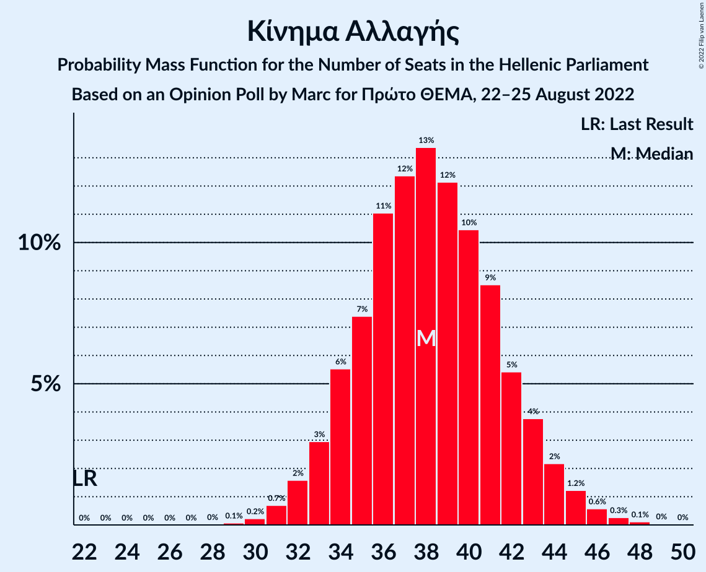

| Number of Seats | Probability | Accumulated | Special Marks |
|:---------------:|:-----------:|:-----------:|:-------------:|
| 22 | 0% | 100% | Last Result |
| 23 | 0% | 100% |  |
| 24 | 0% | 100% |  |
| 25 | 0% | 100% |  |
| 26 | 0% | 100% |  |
| 27 | 0% | 100% |  |
| 28 | 0% | 100% |  |
| 29 | 0.1% | 100% |  |
| 30 | 0.2% | 99.9% |  |
| 31 | 0.7% | 99.7% |  |
| 32 | 2% | 99.0% |  |
| 33 | 3% | 97% |  |
| 34 | 6% | 94% |  |
| 35 | 7% | 89% |  |
| 36 | 11% | 82% |  |
| 37 | 12% | 70% |  |
| 38 | 13% | 58% | Median |
| 39 | 12% | 45% |  |
| 40 | 10% | 33% |  |
| 41 | 9% | 22% |  |
| 42 | 5% | 14% |  |
| 43 | 4% | 8% |  |
| 44 | 2% | 4% |  |
| 45 | 1.2% | 2% |  |
| 46 | 0.6% | 1.0% |  |
| 47 | 0.3% | 0.5% |  |
| 48 | 0.1% | 0.2% |  |
| 49 | 0% | 0.1% |  |
| 50 | 0% | 0% |  |

### Κομμουνιστικό Κόμμα Ελλάδας

*For a full overview of the results for this party, see the [Κομμουνιστικό Κόμμα Ελλάδας](party-κομμουνιστικόκόμμαελλάδας.html) page.*

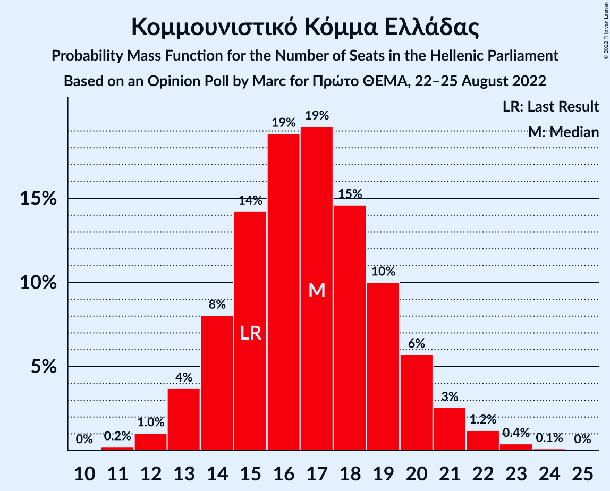

| Number of Seats | Probability | Accumulated | Special Marks |
|:---------------:|:-----------:|:-----------:|:-------------:|
| 11 | 0.2% | 100% |  |
| 12 | 1.0% | 99.8% |  |
| 13 | 4% | 98.7% |  |
| 14 | 8% | 95% |  |
| 15 | 14% | 87% | Last Result |
| 16 | 19% | 73% |  |
| 17 | 19% | 54% | Median |
| 18 | 15% | 35% |  |
| 19 | 10% | 20% |  |
| 20 | 6% | 10% |  |
| 21 | 3% | 4% |  |
| 22 | 1.2% | 2% |  |
| 23 | 0.4% | 0.6% |  |
| 24 | 0.1% | 0.2% |  |
| 25 | 0% | 0% |  |

### Ελληνική Λύση

*For a full overview of the results for this party, see the [Ελληνική Λύση](party-ελληνικήλύση.html) page.*

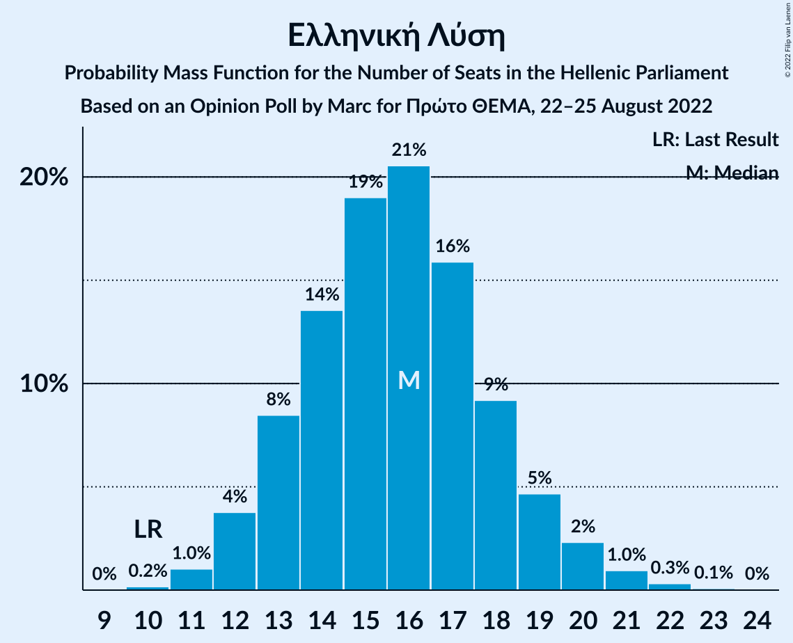

| Number of Seats | Probability | Accumulated | Special Marks |
|:---------------:|:-----------:|:-----------:|:-------------:|
| 10 | 0.2% | 100% | Last Result |
| 11 | 1.0% | 99.8% |  |
| 12 | 4% | 98.8% |  |
| 13 | 8% | 95% |  |
| 14 | 14% | 87% |  |
| 15 | 19% | 73% |  |
| 16 | 21% | 54% | Median |
| 17 | 16% | 33% |  |
| 18 | 9% | 18% |  |
| 19 | 5% | 8% |  |
| 20 | 2% | 4% |  |
| 21 | 1.0% | 1.4% |  |
| 22 | 0.3% | 0.4% |  |
| 23 | 0.1% | 0.1% |  |
| 24 | 0% | 0% |  |

### Μέτωπο Ευρωπαϊκής Ρεαλιστικής Ανυπακοής

*For a full overview of the results for this party, see the [Μέτωπο Ευρωπαϊκής Ρεαλιστικής Ανυπακοής](party-μέτωποευρωπαϊκήςρεαλιστικήςανυπακοής.html) page.*

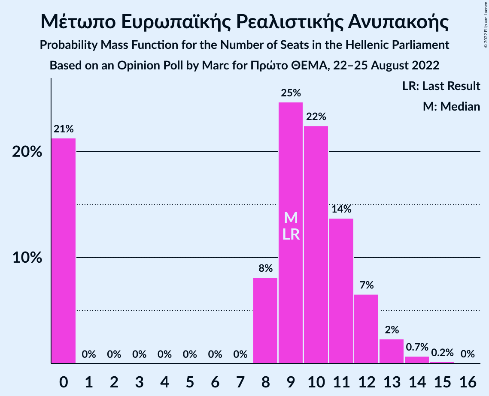

| Number of Seats | Probability | Accumulated | Special Marks |
|:---------------:|:-----------:|:-----------:|:-------------:|
| 0 | 21% | 100% |  |
| 1 | 0% | 79% |  |
| 2 | 0% | 79% |  |
| 3 | 0% | 79% |  |
| 4 | 0% | 79% |  |
| 5 | 0% | 79% |  |
| 6 | 0% | 79% |  |
| 7 | 0% | 79% |  |
| 8 | 8% | 79% |  |
| 9 | 25% | 71% | Last Result, Median |
| 10 | 22% | 46% |  |
| 11 | 14% | 23% |  |
| 12 | 7% | 10% |  |
| 13 | 2% | 3% |  |
| 14 | 0.7% | 0.9% |  |
| 15 | 0.2% | 0.2% |  |
| 16 | 0% | 0% |  |

## Coalitions

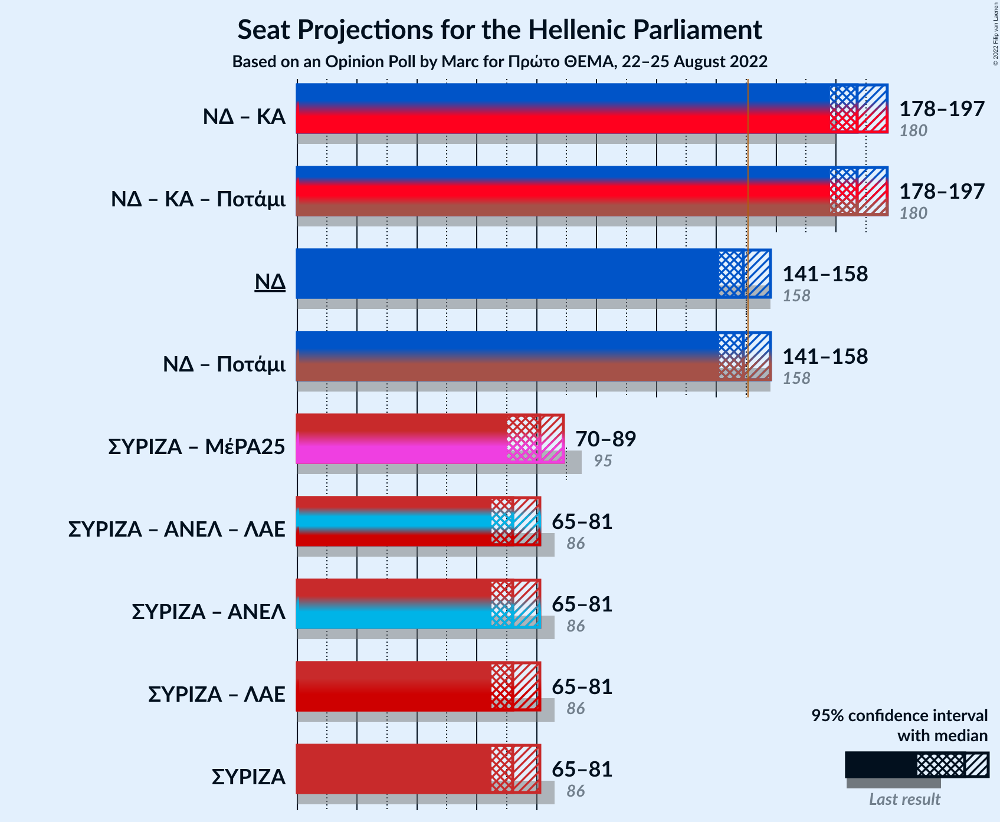

### Confidence Intervals

| Coalition | Last Result | Median | Majority? | 80% Confidence Interval | 90% Confidence Interval | 95% Confidence Interval | 99% Confidence Interval |
|:---------:|:-----------:|:------:|:---------:|:-----------------------:|:-----------------------:|:-----------------------:|:-----------------------:|
| Νέα Δημοκρατία – Κίνημα Αλλαγής | 180 | 187 | 100% | 181–193 | 180–195 | 178–197 | 176–200 |
| Νέα Δημοκρατία | 158 | 149 | 34% | 143–155 | 142–156 | 141–158 | 138–160 |
| Συνασπισμός Ριζοσπαστικής Αριστεράς – Μέτωπο Ευρωπαϊκής Ρεαλιστικής Ανυπακοής | 95 | 81 | 0% | 74–86 | 72–88 | 70–89 | 67–92 |
| Συνασπισμός Ριζοσπαστικής Αριστεράς | 86 | 72 | 0% | 68–78 | 66–79 | 65–81 | 63–83 |

### Νέα Δημοκρατία – Κίνημα Αλλαγής

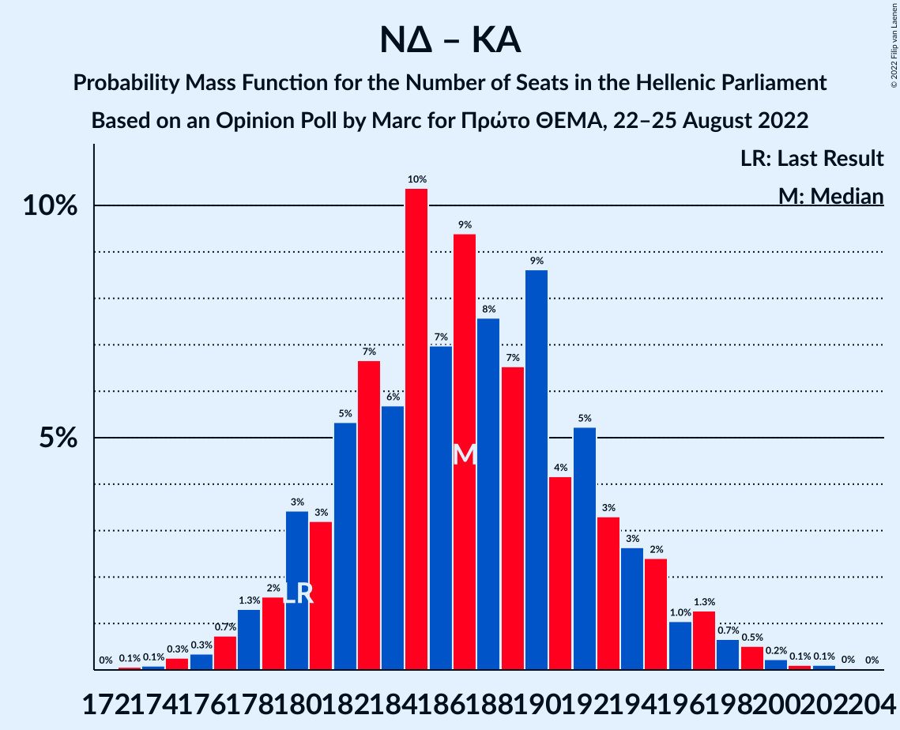

| Number of Seats | Probability | Accumulated | Special Marks |
|:---------------:|:-----------:|:-----------:|:-------------:|
| 173 | 0.1% | 100% |  |
| 174 | 0.1% | 99.9% |  |
| 175 | 0.3% | 99.8% |  |
| 176 | 0.3% | 99.5% |  |
| 177 | 0.7% | 99.2% |  |
| 178 | 1.3% | 98% |  |
| 179 | 2% | 97% |  |
| 180 | 3% | 96% | Last Result |
| 181 | 3% | 92% |  |
| 182 | 5% | 89% |  |
| 183 | 7% | 84% |  |
| 184 | 6% | 77% |  |
| 185 | 10% | 71% |  |
| 186 | 7% | 61% |  |
| 187 | 9% | 54% | Median |
| 188 | 8% | 45% |  |
| 189 | 7% | 37% |  |
| 190 | 9% | 30% |  |
| 191 | 4% | 22% |  |
| 192 | 5% | 18% |  |
| 193 | 3% | 12% |  |
| 194 | 3% | 9% |  |
| 195 | 2% | 6% |  |
| 196 | 1.0% | 4% |  |
| 197 | 1.3% | 3% |  |
| 198 | 0.7% | 2% |  |
| 199 | 0.5% | 1.0% |  |
| 200 | 0.2% | 0.5% |  |
| 201 | 0.1% | 0.3% |  |
| 202 | 0.1% | 0.2% |  |
| 203 | 0% | 0.1% |  |
| 204 | 0% | 0% |  |

### Νέα Δημοκρατία

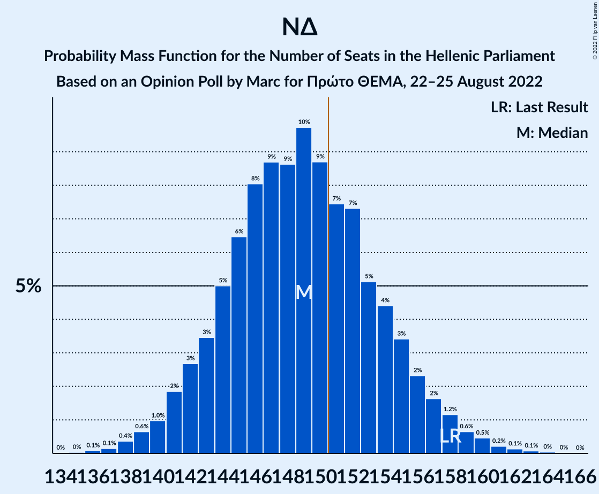

| Number of Seats | Probability | Accumulated | Special Marks |
|:---------------:|:-----------:|:-----------:|:-------------:|
| 135 | 0% | 100% |  |
| 136 | 0.1% | 99.9% |  |
| 137 | 0.1% | 99.9% |  |
| 138 | 0.4% | 99.7% |  |
| 139 | 0.6% | 99.3% |  |
| 140 | 1.0% | 98.7% |  |
| 141 | 2% | 98% |  |
| 142 | 3% | 96% |  |
| 143 | 3% | 93% |  |
| 144 | 5% | 90% |  |
| 145 | 6% | 85% |  |
| 146 | 8% | 78% |  |
| 147 | 9% | 70% |  |
| 148 | 9% | 62% |  |
| 149 | 10% | 53% | Median |
| 150 | 9% | 43% |  |
| 151 | 7% | 34% | Majority |
| 152 | 7% | 27% |  |
| 153 | 5% | 20% |  |
| 154 | 4% | 15% |  |
| 155 | 3% | 10% |  |
| 156 | 2% | 7% |  |
| 157 | 2% | 4% |  |
| 158 | 1.2% | 3% | Last Result |
| 159 | 0.6% | 2% |  |
| 160 | 0.5% | 1.0% |  |
| 161 | 0.2% | 0.5% |  |
| 162 | 0.1% | 0.3% |  |
| 163 | 0.1% | 0.1% |  |
| 164 | 0% | 0.1% |  |
| 165 | 0% | 0% |  |

### Συνασπισμός Ριζοσπαστικής Αριστεράς – Μέτωπο Ευρωπαϊκής Ρεαλιστικής Ανυπακοής

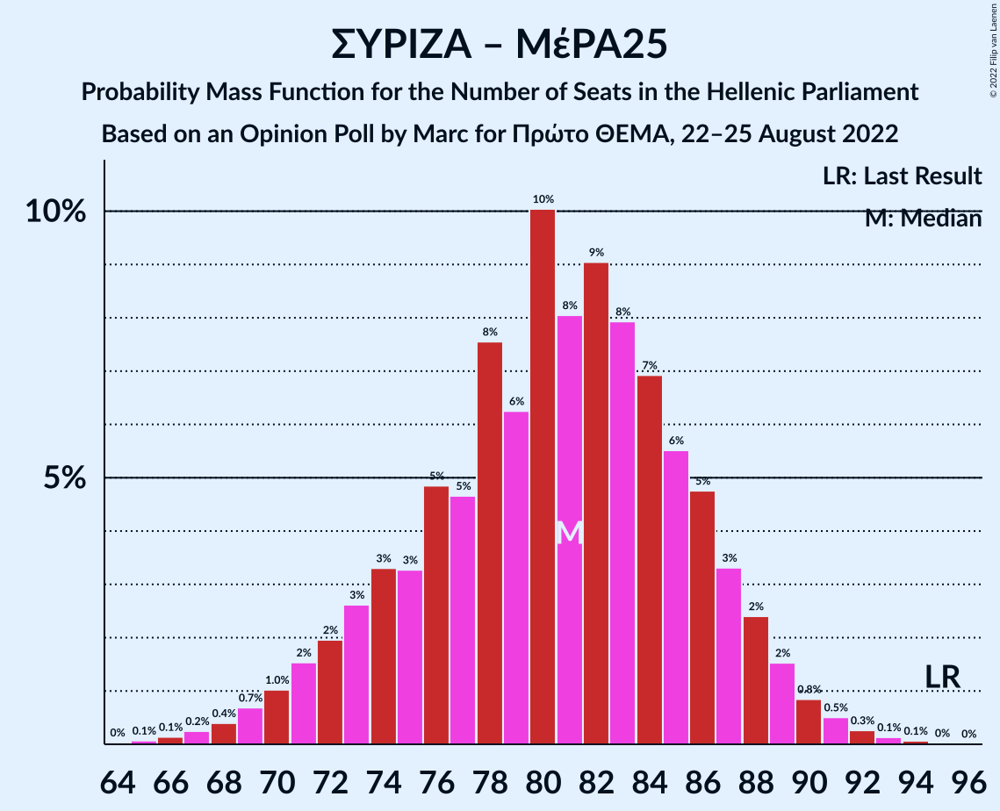

| Number of Seats | Probability | Accumulated | Special Marks |
|:---------------:|:-----------:|:-----------:|:-------------:|
| 64 | 0% | 100% |  |
| 65 | 0.1% | 99.9% |  |
| 66 | 0.1% | 99.9% |  |
| 67 | 0.2% | 99.7% |  |
| 68 | 0.4% | 99.5% |  |
| 69 | 0.7% | 99.1% |  |
| 70 | 1.0% | 98% |  |
| 71 | 2% | 97% |  |
| 72 | 2% | 96% |  |
| 73 | 3% | 94% |  |
| 74 | 3% | 91% |  |
| 75 | 3% | 88% |  |
| 76 | 5% | 85% |  |
| 77 | 5% | 80% |  |
| 78 | 8% | 75% |  |
| 79 | 6% | 68% |  |
| 80 | 10% | 61% |  |
| 81 | 8% | 51% | Median |
| 82 | 9% | 43% |  |
| 83 | 8% | 34% |  |
| 84 | 7% | 26% |  |
| 85 | 6% | 19% |  |
| 86 | 5% | 14% |  |
| 87 | 3% | 9% |  |
| 88 | 2% | 6% |  |
| 89 | 2% | 3% |  |
| 90 | 0.8% | 2% |  |
| 91 | 0.5% | 1.0% |  |
| 92 | 0.3% | 0.5% |  |
| 93 | 0.1% | 0.2% |  |
| 94 | 0.1% | 0.1% |  |
| 95 | 0% | 0% | Last Result |

### Συνασπισμός Ριζοσπαστικής Αριστεράς

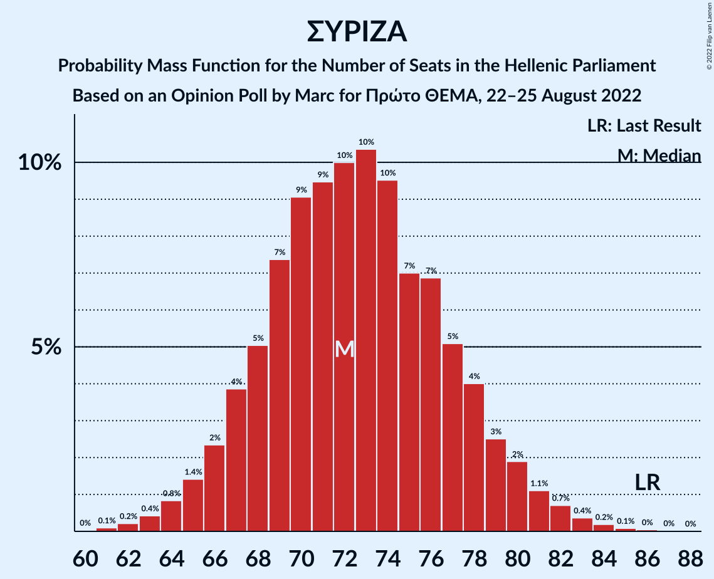

| Number of Seats | Probability | Accumulated | Special Marks |
|:---------------:|:-----------:|:-----------:|:-------------:|
| 60 | 0% | 100% |  |
| 61 | 0.1% | 99.9% |  |
| 62 | 0.2% | 99.8% |  |
| 63 | 0.4% | 99.6% |  |
| 64 | 0.8% | 99.2% |  |
| 65 | 1.4% | 98% |  |
| 66 | 2% | 97% |  |
| 67 | 4% | 95% |  |
| 68 | 5% | 91% |  |
| 69 | 7% | 86% |  |
| 70 | 9% | 78% |  |
| 71 | 9% | 69% |  |
| 72 | 10% | 60% | Median |
| 73 | 10% | 50% |  |
| 74 | 10% | 39% |  |
| 75 | 7% | 30% |  |
| 76 | 7% | 23% |  |
| 77 | 5% | 16% |  |
| 78 | 4% | 11% |  |
| 79 | 3% | 7% |  |
| 80 | 2% | 4% |  |
| 81 | 1.1% | 3% |  |
| 82 | 0.7% | 1.4% |  |
| 83 | 0.4% | 0.7% |  |
| 84 | 0.2% | 0.4% |  |
| 85 | 0.1% | 0.2% |  |
| 86 | 0% | 0.1% | Last Result |
| 87 | 0% | 0% |  |

## Technical Information

### Opinion Poll

+ **Polling firm:** Marc
+ **Commissioner(s):** Πρώτο ΘΕΜΑ
+ **Fieldwork period:** 22–25 August 2022

### Calculations

+ **Sample size:** 1001
+ **Simulations done:** 1,048,576
+ **Error estimate:** 0.70%

