# Opinion Poll by Metron Analysis for Mega TV, 29–31 August 2022

<a href="#voting-intentions">Voting Intentions</a> | <a href="#seats">Seats</a> | <a href="#coalitions">Coalitions</a> | <a href="#technical-information">Technical Information</a>

## Voting Intentions

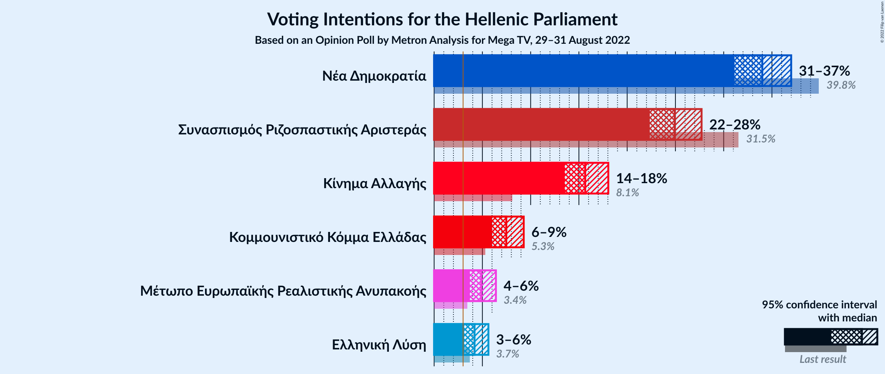

### Confidence Intervals

| Party | Last Result | Poll Result | 80% Confidence Interval | 90% Confidence Interval | 95% Confidence Interval | 99% Confidence Interval |
|:-----:|:-----------:|:-----------:|:-----------------------:|:-----------------------:|:-----------------------:|:-----------------------:|
| Νέα Δημοκρατία | 39.8% | 34.0% | 32.1–36.0% |31.6–36.5% |31.1–37.0% |30.2–37.9% |
| Συνασπισμός Ριζοσπαστικής Αριστεράς | 31.5% | 24.9% | 23.2–26.7% |22.8–27.3% |22.3–27.7% |21.6–28.6% |
| Κίνημα Αλλαγής | 8.1% | 15.7% | 14.3–17.2% |13.9–17.6% |13.5–18.0% |12.9–18.8% |
| Κομμουνιστικό Κόμμα Ελλάδας | 5.3% | 7.5% | 6.5–8.7% |6.2–9.0% |6.0–9.3% |5.6–9.9% |
| Μέτωπο Ευρωπαϊκής Ρεαλιστικής Ανυπακοής | 3.4% | 4.9% | 4.1–5.9% |3.9–6.2% |3.7–6.4% |3.4–6.9% |
| Ελληνική Λύση | 3.7% | 4.2% | 3.5–5.1% |3.3–5.4% |3.1–5.6% |2.8–6.1% |

*Note:* The poll result column reflects the actual value used in the calculations. Published results may vary slightly, and in addition be rounded to fewer digits.

## Seats

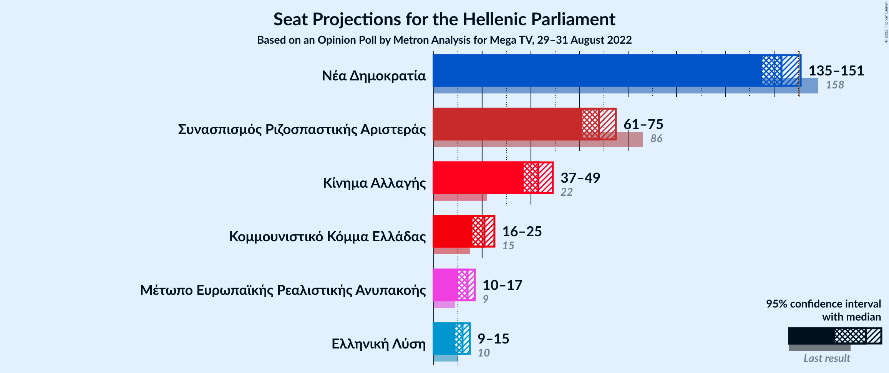

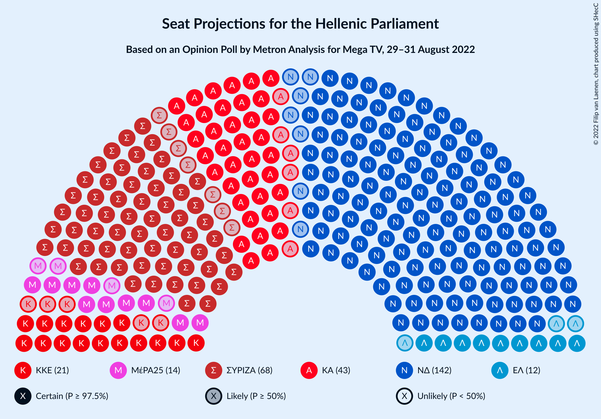

### Confidence Intervals

| Party | Last Result | Median | 80% Confidence Interval | 90% Confidence Interval | 95% Confidence Interval | 99% Confidence Interval |
|:-----:|:-----------:|:------:|:-----------------------:|:-----------------------:|:-----------------------:|:-----------------------:|
| <a href="#νέα-δημοκρατία">Νέα Δημοκρατία</a> | 158 | 143 | 138–148 |136–150 |135–151 |133–154 |
| <a href="#συνασπισμός-ριζοσπαστικής-αριστεράς">Συνασπισμός Ριζοσπαστικής Αριστεράς</a> | 86 | 68 | 64–73 |62–75 |61–75 |59–78 |
| <a href="#κίνημα-αλλαγής">Κίνημα Αλλαγής</a> | 22 | 43 | 39–47 |38–48 |37–49 |35–51 |
| <a href="#κομμουνιστικό-κόμμα-ελλάδας">Κομμουνιστικό Κόμμα Ελλάδας</a> | 15 | 21 | 18–24 |17–25 |16–25 |15–27 |
| <a href="#μέτωπο-ευρωπαϊκής-ρεαλιστικής-ανυπακοής">Μέτωπο Ευρωπαϊκής Ρεαλιστικής Ανυπακοής</a> | 9 | 14 | 11–16 |11–17 |10–17 |9–19 |
| <a href="#ελληνική-λύση">Ελληνική Λύση</a> | 10 | 12 | 10–14 |9–15 |9–15 |0–17 |

### Νέα Δημοκρατία

*For a full overview of the results for this party, see the [Νέα Δημοκρατία](party-νέαδημοκρατία.html) page.*

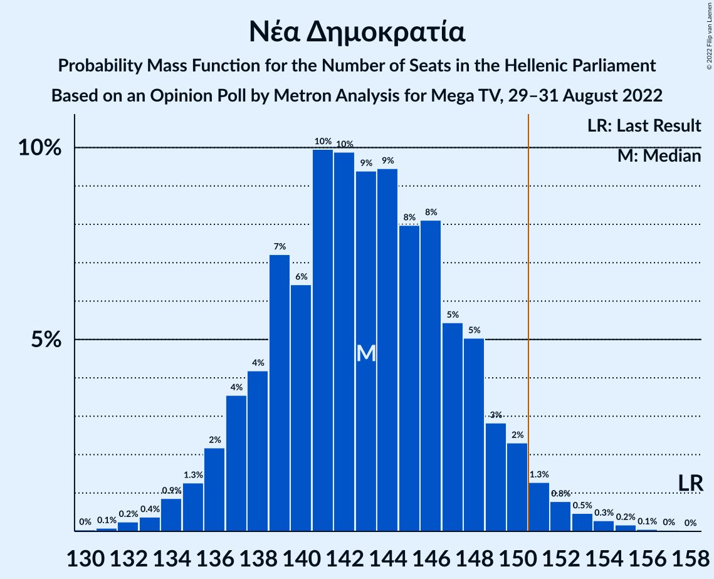

| Number of Seats | Probability | Accumulated | Special Marks |
|:---------------:|:-----------:|:-----------:|:-------------:|
| 130 | 0% | 100% |  |
| 131 | 0.1% | 99.9% |  |
| 132 | 0.2% | 99.8% |  |
| 133 | 0.4% | 99.6% |  |
| 134 | 0.9% | 99.2% |  |
| 135 | 1.3% | 98% |  |
| 136 | 2% | 97% |  |
| 137 | 4% | 95% |  |
| 138 | 4% | 91% |  |
| 139 | 7% | 87% |  |
| 140 | 6% | 80% |  |
| 141 | 10% | 74% |  |
| 142 | 10% | 64% |  |
| 143 | 9% | 54% | Median |
| 144 | 9% | 44% |  |
| 145 | 8% | 35% |  |
| 146 | 8% | 27% |  |
| 147 | 5% | 19% |  |
| 148 | 5% | 13% |  |
| 149 | 3% | 8% |  |
| 150 | 2% | 5% |  |
| 151 | 1.3% | 3% | Majority |
| 152 | 0.8% | 2% |  |
| 153 | 0.5% | 1.0% |  |
| 154 | 0.3% | 0.6% |  |
| 155 | 0.2% | 0.3% |  |
| 156 | 0.1% | 0.1% |  |
| 157 | 0% | 0.1% |  |
| 158 | 0% | 0% | Last Result |

### Συνασπισμός Ριζοσπαστικής Αριστεράς

*For a full overview of the results for this party, see the [Συνασπισμός Ριζοσπαστικής Αριστεράς](party-συνασπισμόςριζοσπαστικήςαριστεράς.html) page.*

| Number of Seats | Probability | Accumulated | Special Marks |
|:---------------:|:-----------:|:-----------:|:-------------:|
| 57 | 0.1% | 100% |  |
| 58 | 0.3% | 99.9% |  |
| 59 | 0.4% | 99.6% |  |
| 60 | 0.5% | 99.2% |  |
| 61 | 2% | 98.7% |  |
| 62 | 3% | 97% |  |
| 63 | 2% | 93% |  |
| 64 | 5% | 91% |  |
| 65 | 11% | 86% |  |
| 66 | 8% | 75% |  |
| 67 | 6% | 67% |  |
| 68 | 15% | 61% | Median |
| 69 | 12% | 46% |  |
| 70 | 5% | 34% |  |
| 71 | 9% | 29% |  |
| 72 | 9% | 20% |  |
| 73 | 3% | 11% |  |
| 74 | 3% | 8% |  |
| 75 | 3% | 5% |  |
| 76 | 1.0% | 2% |  |
| 77 | 0.4% | 1.3% |  |
| 78 | 0.5% | 0.9% |  |
| 79 | 0.2% | 0.4% |  |
| 80 | 0% | 0.1% |  |
| 81 | 0% | 0.1% |  |
| 82 | 0% | 0% |  |
| 83 | 0% | 0% |  |
| 84 | 0% | 0% |  |
| 85 | 0% | 0% |  |
| 86 | 0% | 0% | Last Result |

### Κίνημα Αλλαγής

*For a full overview of the results for this party, see the [Κίνημα Αλλαγής](party-κίνημααλλαγής.html) page.*

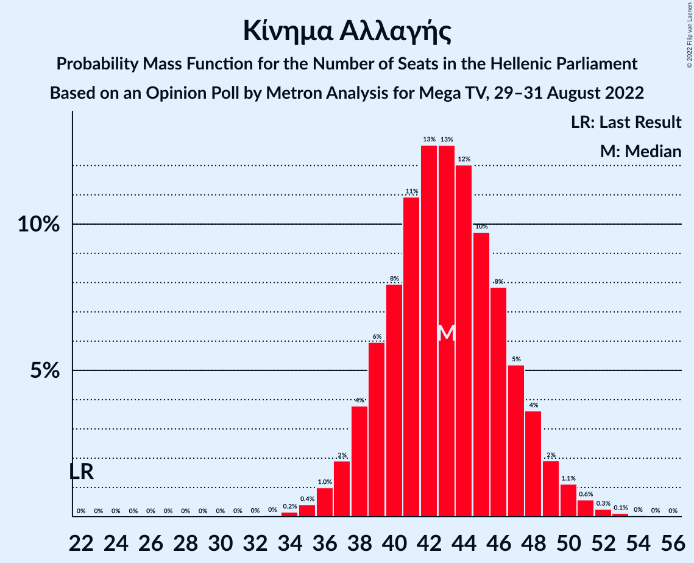

| Number of Seats | Probability | Accumulated | Special Marks |
|:---------------:|:-----------:|:-----------:|:-------------:|
| 22 | 0% | 100% | Last Result |
| 23 | 0% | 100% |  |
| 24 | 0% | 100% |  |
| 25 | 0% | 100% |  |
| 26 | 0% | 100% |  |
| 27 | 0% | 100% |  |
| 28 | 0% | 100% |  |
| 29 | 0% | 100% |  |
| 30 | 0% | 100% |  |
| 31 | 0% | 100% |  |
| 32 | 0% | 100% |  |
| 33 | 0% | 100% |  |
| 34 | 0.2% | 99.9% |  |
| 35 | 0.4% | 99.8% |  |
| 36 | 1.0% | 99.4% |  |
| 37 | 2% | 98% |  |
| 38 | 4% | 96% |  |
| 39 | 6% | 93% |  |
| 40 | 8% | 87% |  |
| 41 | 11% | 79% |  |
| 42 | 13% | 68% |  |
| 43 | 13% | 55% | Median |
| 44 | 12% | 42% |  |
| 45 | 10% | 30% |  |
| 46 | 8% | 21% |  |
| 47 | 5% | 13% |  |
| 48 | 4% | 8% |  |
| 49 | 2% | 4% |  |
| 50 | 1.1% | 2% |  |
| 51 | 0.6% | 1.0% |  |
| 52 | 0.3% | 0.4% |  |
| 53 | 0.1% | 0.2% |  |
| 54 | 0% | 0.1% |  |
| 55 | 0% | 0% |  |

### Κομμουνιστικό Κόμμα Ελλάδας

*For a full overview of the results for this party, see the [Κομμουνιστικό Κόμμα Ελλάδας](party-κομμουνιστικόκόμμαελλάδας.html) page.*

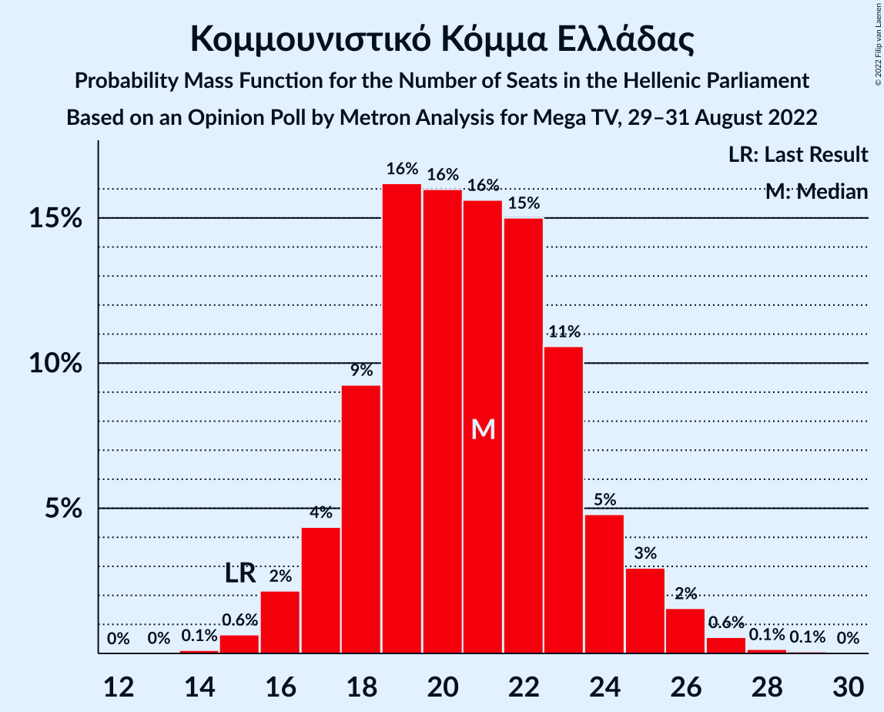

| Number of Seats | Probability | Accumulated | Special Marks |
|:---------------:|:-----------:|:-----------:|:-------------:|
| 14 | 0.1% | 100% |  |
| 15 | 0.6% | 99.9% | Last Result |
| 16 | 2% | 99.2% |  |
| 17 | 4% | 97% |  |
| 18 | 9% | 93% |  |
| 19 | 16% | 83% |  |
| 20 | 16% | 67% |  |
| 21 | 16% | 51% | Median |
| 22 | 15% | 36% |  |
| 23 | 11% | 21% |  |
| 24 | 5% | 10% |  |
| 25 | 3% | 5% |  |
| 26 | 2% | 2% |  |
| 27 | 0.6% | 0.8% |  |
| 28 | 0.1% | 0.2% |  |
| 29 | 0.1% | 0.1% |  |
| 30 | 0% | 0% |  |

### Μέτωπο Ευρωπαϊκής Ρεαλιστικής Ανυπακοής

*For a full overview of the results for this party, see the [Μέτωπο Ευρωπαϊκής Ρεαλιστικής Ανυπακοής](party-μέτωποευρωπαϊκήςρεαλιστικήςανυπακοής.html) page.*

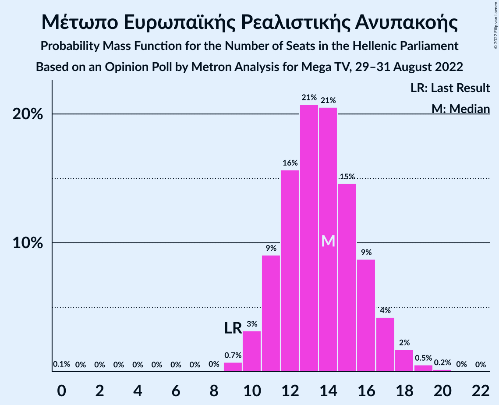

| Number of Seats | Probability | Accumulated | Special Marks |
|:---------------:|:-----------:|:-----------:|:-------------:|
| 0 | 0.1% | 100% |  |
| 1 | 0% | 99.9% |  |
| 2 | 0% | 99.9% |  |
| 3 | 0% | 99.9% |  |
| 4 | 0% | 99.9% |  |
| 5 | 0% | 99.9% |  |
| 6 | 0% | 99.9% |  |
| 7 | 0% | 99.9% |  |
| 8 | 0% | 99.9% |  |
| 9 | 0.7% | 99.9% | Last Result |
| 10 | 3% | 99.2% |  |
| 11 | 9% | 96% |  |
| 12 | 16% | 87% |  |
| 13 | 21% | 71% |  |
| 14 | 21% | 51% | Median |
| 15 | 15% | 30% |  |
| 16 | 9% | 15% |  |
| 17 | 4% | 7% |  |
| 18 | 2% | 2% |  |
| 19 | 0.5% | 0.8% |  |
| 20 | 0.2% | 0.2% |  |
| 21 | 0% | 0.1% |  |
| 22 | 0% | 0% |  |

### Ελληνική Λύση

*For a full overview of the results for this party, see the [Ελληνική Λύση](party-ελληνικήλύση.html) page.*

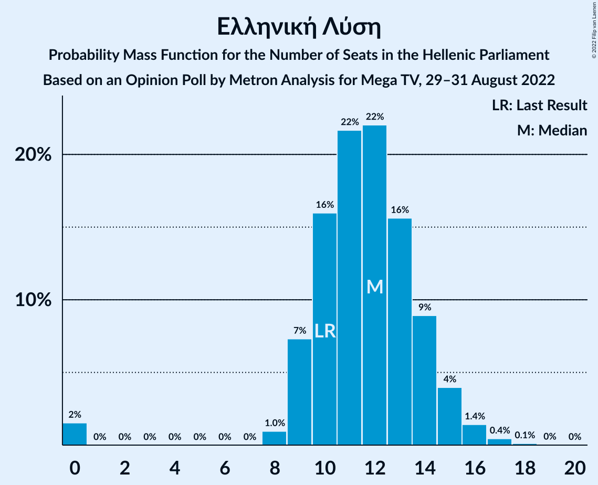

| Number of Seats | Probability | Accumulated | Special Marks |
|:---------------:|:-----------:|:-----------:|:-------------:|
| 0 | 2% | 100% |  |
| 1 | 0% | 98% |  |
| 2 | 0% | 98% |  |
| 3 | 0% | 98% |  |
| 4 | 0% | 98% |  |
| 5 | 0% | 98% |  |
| 6 | 0% | 98% |  |
| 7 | 0% | 98% |  |
| 8 | 1.0% | 98% |  |
| 9 | 7% | 98% |  |
| 10 | 16% | 90% | Last Result |
| 11 | 22% | 74% |  |
| 12 | 22% | 53% | Median |
| 13 | 16% | 31% |  |
| 14 | 9% | 15% |  |
| 15 | 4% | 6% |  |
| 16 | 1.4% | 2% |  |
| 17 | 0.4% | 0.6% |  |
| 18 | 0.1% | 0.1% |  |
| 19 | 0% | 0% |  |

## Coalitions

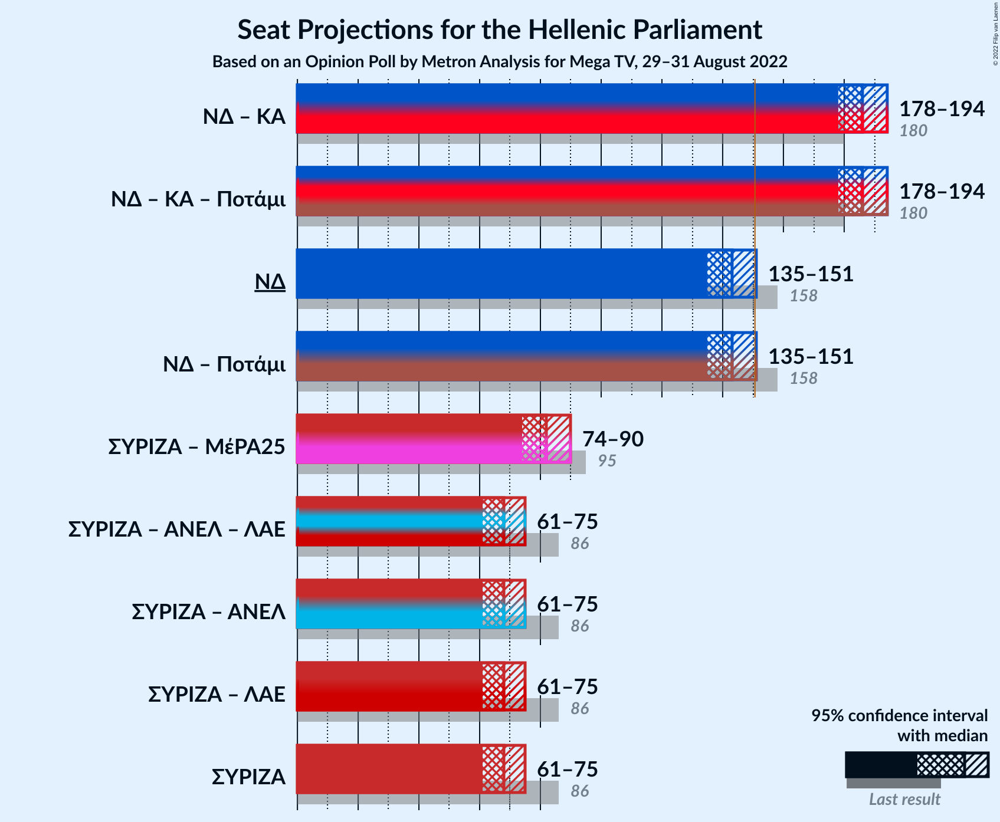

### Confidence Intervals

| Coalition | Last Result | Median | Majority? | 80% Confidence Interval | 90% Confidence Interval | 95% Confidence Interval | 99% Confidence Interval |
|:---------:|:-----------:|:------:|:---------:|:-----------------------:|:-----------------------:|:-----------------------:|:-----------------------:|
| Νέα Δημοκρατία – Κίνημα Αλλαγής | 180 | 186 | 100% | 181–191 | 179–193 | 178–194 | 175–197 |
| Νέα Δημοκρατία | 158 | 143 | 3% | 138–148 | 136–150 | 135–151 | 133–154 |
| Συνασπισμός Ριζοσπαστικής Αριστεράς – Μέτωπο Ευρωπαϊκής Ρεαλιστικής Ανυπακοής | 95 | 82 | 0% | 77–87 | 75–88 | 74–90 | 72–92 |
| Συνασπισμός Ριζοσπαστικής Αριστεράς | 86 | 68 | 0% | 64–73 | 62–75 | 61–75 | 59–78 |

### Νέα Δημοκρατία – Κίνημα Αλλαγής

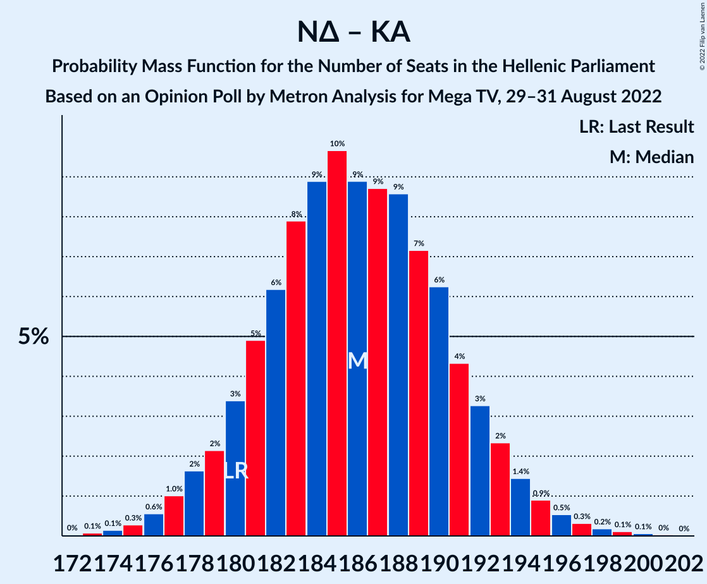

| Number of Seats | Probability | Accumulated | Special Marks |
|:---------------:|:-----------:|:-----------:|:-------------:|
| 172 | 0% | 100% |  |
| 173 | 0.1% | 99.9% |  |
| 174 | 0.1% | 99.9% |  |
| 175 | 0.3% | 99.7% |  |
| 176 | 0.6% | 99.4% |  |
| 177 | 1.0% | 98.9% |  |
| 178 | 2% | 98% |  |
| 179 | 2% | 96% |  |
| 180 | 3% | 94% | Last Result |
| 181 | 5% | 91% |  |
| 182 | 6% | 86% |  |
| 183 | 8% | 80% |  |
| 184 | 9% | 72% |  |
| 185 | 10% | 63% |  |
| 186 | 9% | 53% | Median |
| 187 | 9% | 44% |  |
| 188 | 9% | 36% |  |
| 189 | 7% | 27% |  |
| 190 | 6% | 20% |  |
| 191 | 4% | 14% |  |
| 192 | 3% | 9% |  |
| 193 | 2% | 6% |  |
| 194 | 1.4% | 4% |  |
| 195 | 0.9% | 2% |  |
| 196 | 0.5% | 1.3% |  |
| 197 | 0.3% | 0.7% |  |
| 198 | 0.2% | 0.4% |  |
| 199 | 0.1% | 0.2% |  |
| 200 | 0.1% | 0.1% |  |
| 201 | 0% | 0.1% |  |
| 202 | 0% | 0% |  |

### Νέα Δημοκρατία

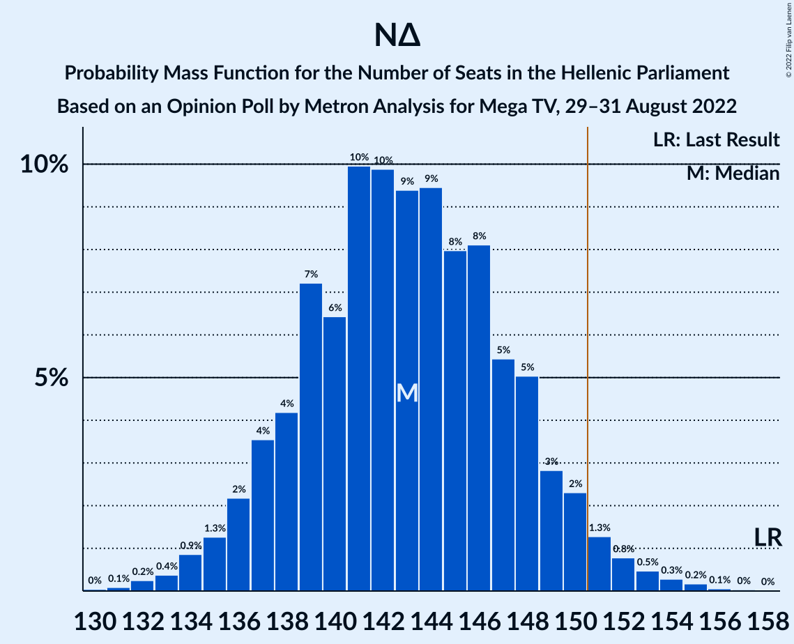

| Number of Seats | Probability | Accumulated | Special Marks |
|:---------------:|:-----------:|:-----------:|:-------------:|
| 130 | 0% | 100% |  |
| 131 | 0.1% | 99.9% |  |
| 132 | 0.2% | 99.8% |  |
| 133 | 0.4% | 99.6% |  |
| 134 | 0.9% | 99.2% |  |
| 135 | 1.3% | 98% |  |
| 136 | 2% | 97% |  |
| 137 | 4% | 95% |  |
| 138 | 4% | 91% |  |
| 139 | 7% | 87% |  |
| 140 | 6% | 80% |  |
| 141 | 10% | 74% |  |
| 142 | 10% | 64% |  |
| 143 | 9% | 54% | Median |
| 144 | 9% | 44% |  |
| 145 | 8% | 35% |  |
| 146 | 8% | 27% |  |
| 147 | 5% | 19% |  |
| 148 | 5% | 13% |  |
| 149 | 3% | 8% |  |
| 150 | 2% | 5% |  |
| 151 | 1.3% | 3% | Majority |
| 152 | 0.8% | 2% |  |
| 153 | 0.5% | 1.0% |  |
| 154 | 0.3% | 0.6% |  |
| 155 | 0.2% | 0.3% |  |
| 156 | 0.1% | 0.1% |  |
| 157 | 0% | 0.1% |  |
| 158 | 0% | 0% | Last Result |

### Συνασπισμός Ριζοσπαστικής Αριστεράς – Μέτωπο Ευρωπαϊκής Ρεαλιστικής Ανυπακοής

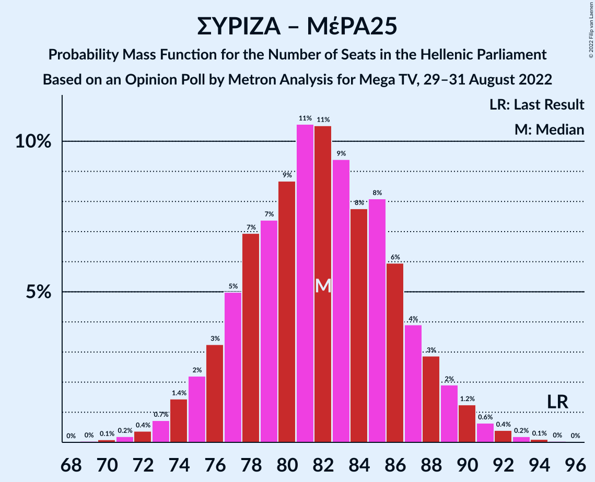

| Number of Seats | Probability | Accumulated | Special Marks |
|:---------------:|:-----------:|:-----------:|:-------------:|
| 69 | 0% | 100% |  |
| 70 | 0.1% | 99.9% |  |
| 71 | 0.2% | 99.8% |  |
| 72 | 0.4% | 99.6% |  |
| 73 | 0.7% | 99.3% |  |
| 74 | 1.4% | 98.5% |  |
| 75 | 2% | 97% |  |
| 76 | 3% | 95% |  |
| 77 | 5% | 92% |  |
| 78 | 7% | 87% |  |
| 79 | 7% | 80% |  |
| 80 | 9% | 72% |  |
| 81 | 11% | 64% |  |
| 82 | 11% | 53% | Median |
| 83 | 9% | 43% |  |
| 84 | 8% | 33% |  |
| 85 | 8% | 25% |  |
| 86 | 6% | 17% |  |
| 87 | 4% | 11% |  |
| 88 | 3% | 7% |  |
| 89 | 2% | 5% |  |
| 90 | 1.2% | 3% |  |
| 91 | 0.6% | 1.4% |  |
| 92 | 0.4% | 0.8% |  |
| 93 | 0.2% | 0.4% |  |
| 94 | 0.1% | 0.2% |  |
| 95 | 0% | 0.1% | Last Result |
| 96 | 0% | 0% |  |

### Συνασπισμός Ριζοσπαστικής Αριστεράς

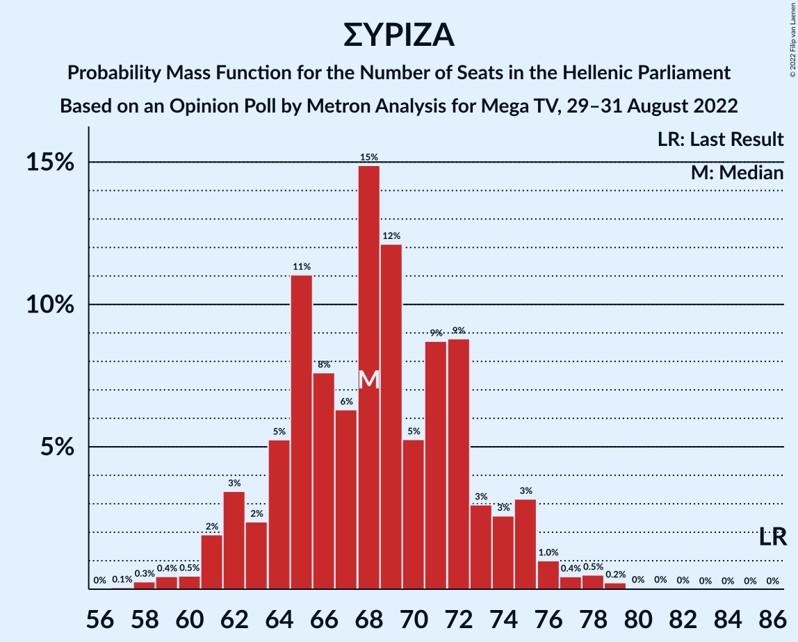

| Number of Seats | Probability | Accumulated | Special Marks |
|:---------------:|:-----------:|:-----------:|:-------------:|
| 57 | 0.1% | 100% |  |
| 58 | 0.3% | 99.9% |  |
| 59 | 0.4% | 99.6% |  |
| 60 | 0.5% | 99.2% |  |
| 61 | 2% | 98.7% |  |
| 62 | 3% | 97% |  |
| 63 | 2% | 93% |  |
| 64 | 5% | 91% |  |
| 65 | 11% | 86% |  |
| 66 | 8% | 75% |  |
| 67 | 6% | 67% |  |
| 68 | 15% | 61% | Median |
| 69 | 12% | 46% |  |
| 70 | 5% | 34% |  |
| 71 | 9% | 29% |  |
| 72 | 9% | 20% |  |
| 73 | 3% | 11% |  |
| 74 | 3% | 8% |  |
| 75 | 3% | 5% |  |
| 76 | 1.0% | 2% |  |
| 77 | 0.4% | 1.3% |  |
| 78 | 0.5% | 0.9% |  |
| 79 | 0.2% | 0.4% |  |
| 80 | 0% | 0.1% |  |
| 81 | 0% | 0.1% |  |
| 82 | 0% | 0% |  |
| 83 | 0% | 0% |  |
| 84 | 0% | 0% |  |
| 85 | 0% | 0% |  |
| 86 | 0% | 0% | Last Result |

## Technical Information

### Opinion Poll

+ **Polling firm:** Metron Analysis
+ **Commissioner(s):** Mega TV
+ **Fieldwork period:** 29–31 August 2022

### Calculations

+ **Sample size:** 1003
+ **Simulations done:** 1,048,576
+ **Error estimate:** 0.88%

