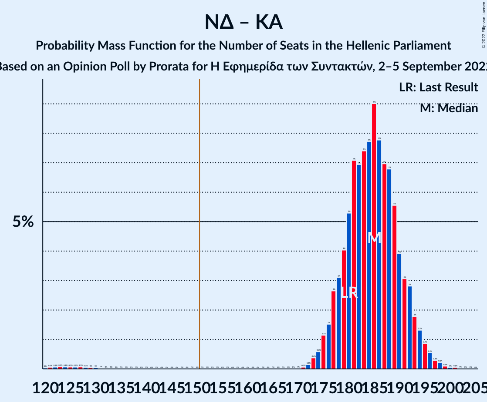

# Opinion Poll by Prorata for Η Εφημερίδα των Συντακτών, 2–5 September 2022

<a href="#voting-intentions">Voting Intentions</a> | <a href="#seats">Seats</a> | <a href="#coalitions">Coalitions</a> | <a href="#technical-information">Technical Information</a>

## Voting Intentions

### Confidence Intervals

| Party | Last Result | Poll Result | 80% Confidence Interval | 90% Confidence Interval | 95% Confidence Interval | 99% Confidence Interval |
|:-----:|:-----------:|:-----------:|:-----------------------:|:-----------------------:|:-----------------------:|:-----------------------:|
| Νέα Δημοκρατία | 39.8% | 35.7% | 33.8–37.7% |33.3–38.3% |32.8–38.8% |31.9–39.7% |
| Συνασπισμός Ριζοσπαστικής Αριστεράς | 31.5% | 29.8% | 28.0–31.7% |27.5–32.2% |27.1–32.7% |26.2–33.6% |
| Κίνημα Αλλαγής | 8.1% | 13.1% | 11.8–14.5% |11.4–14.9% |11.1–15.3% |10.5–16.0% |
| Κομμουνιστικό Κόμμα Ελλάδας | 5.3% | 6.0% | 5.2–7.1% |4.9–7.4% |4.7–7.7% |4.3–8.2% |
| Ελληνική Λύση | 3.7% | 4.2% | 3.4–5.1% |3.2–5.3% |3.1–5.6% |2.8–6.1% |
| Μέτωπο Ευρωπαϊκής Ρεαλιστικής Ανυπακοής | 3.4% | 3.0% | 2.4–3.8% |2.2–4.0% |2.1–4.2% |1.8–4.6% |

*Note:* The poll result column reflects the actual value used in the calculations. Published results may vary slightly, and in addition be rounded to fewer digits.

## Seats

### Confidence Intervals

| Party | Last Result | Median | 80% Confidence Interval | 90% Confidence Interval | 95% Confidence Interval | 99% Confidence Interval |
|:-----:|:-----------:|:------:|:-----------------------:|:-----------------------:|:-----------------------:|:-----------------------:|
| <a href="#νέα-δημοκρατία">Νέα Δημοκρατία</a> | 158 | 148 | 143–154 |141–156 |140–157 |90–160 |
| <a href="#συνασπισμός-ριζοσπαστικής-αριστεράς">Συνασπισμός Ριζοσπαστικής Αριστεράς</a> | 86 | 82 | 77–87 |76–89 |74–91 |72–140 |
| <a href="#κίνημα-αλλαγής">Κίνημα Αλλαγής</a> | 22 | 36 | 32–40 |31–41 |31–42 |29–44 |
| <a href="#κομμουνιστικό-κόμμα-ελλάδας">Κομμουνιστικό Κόμμα Ελλάδας</a> | 15 | 17 | 14–20 |14–20 |13–21 |12–23 |
| <a href="#ελληνική-λύση">Ελληνική Λύση</a> | 10 | 12 | 9–14 |9–15 |8–15 |0–17 |
| <a href="#μέτωπο-ευρωπαϊκής-ρεαλιστικής-ανυπακοής">Μέτωπο Ευρωπαϊκής Ρεαλιστικής Ανυπακοής</a> | 9 | 8 | 0–10 |0–11 |0–11 |0–13 |

### Νέα Δημοκρατία

*For a full overview of the results for this party, see the [Νέα Δημοκρατία](party-νέαδημοκρατία.html) page.*

| Number of Seats | Probability | Accumulated | Special Marks |
|:---------------:|:-----------:|:-----------:|:-------------:|
| 85 | 0.1% | 100% |  |
| 86 | 0.1% | 99.9% |  |
| 87 | 0.1% | 99.8% |  |
| 88 | 0.1% | 99.7% |  |
| 89 | 0.1% | 99.6% |  |
| 90 | 0.1% | 99.5% |  |
| 91 | 0.1% | 99.5% |  |
| 92 | 0.1% | 99.4% |  |
| 93 | 0% | 99.3% |  |
| 94 | 0% | 99.3% |  |
| 95 | 0% | 99.3% |  |
| 96 | 0% | 99.3% |  |
| 97 | 0% | 99.3% |  |
| 98 | 0% | 99.3% |  |
| 99 | 0% | 99.3% |  |
| 100 | 0% | 99.3% |  |
| 101 | 0% | 99.3% |  |
| 102 | 0% | 99.3% |  |
| 103 | 0% | 99.3% |  |
| 104 | 0% | 99.3% |  |
| 105 | 0% | 99.3% |  |
| 106 | 0% | 99.3% |  |
| 107 | 0% | 99.3% |  |
| 108 | 0% | 99.3% |  |
| 109 | 0% | 99.3% |  |
| 110 | 0% | 99.3% |  |
| 111 | 0% | 99.3% |  |
| 112 | 0% | 99.3% |  |
| 113 | 0% | 99.3% |  |
| 114 | 0% | 99.3% |  |
| 115 | 0% | 99.3% |  |
| 116 | 0% | 99.3% |  |
| 117 | 0% | 99.3% |  |
| 118 | 0% | 99.3% |  |
| 119 | 0% | 99.3% |  |
| 120 | 0% | 99.3% |  |
| 121 | 0% | 99.3% |  |
| 122 | 0% | 99.3% |  |
| 123 | 0% | 99.3% |  |
| 124 | 0% | 99.3% |  |
| 125 | 0% | 99.3% |  |
| 126 | 0% | 99.3% |  |
| 127 | 0% | 99.3% |  |
| 128 | 0% | 99.3% |  |
| 129 | 0% | 99.3% |  |
| 130 | 0% | 99.3% |  |
| 131 | 0% | 99.3% |  |
| 132 | 0% | 99.3% |  |
| 133 | 0% | 99.3% |  |
| 134 | 0% | 99.3% |  |
| 135 | 0% | 99.3% |  |
| 136 | 0.1% | 99.2% |  |
| 137 | 0.2% | 99.2% |  |
| 138 | 0.4% | 99.0% |  |
| 139 | 0.7% | 98.6% |  |
| 140 | 1.4% | 98% |  |
| 141 | 2% | 96% |  |
| 142 | 2% | 94% |  |
| 143 | 4% | 92% |  |
| 144 | 5% | 87% |  |
| 145 | 7% | 82% |  |
| 146 | 7% | 75% |  |
| 147 | 10% | 68% |  |
| 148 | 8% | 58% | Median |
| 149 | 10% | 49% |  |
| 150 | 8% | 39% |  |
| 151 | 7% | 31% | Majority |
| 152 | 7% | 24% |  |
| 153 | 5% | 17% |  |
| 154 | 4% | 12% |  |
| 155 | 3% | 8% |  |
| 156 | 2% | 6% |  |
| 157 | 1.3% | 4% |  |
| 158 | 0.9% | 2% | Last Result |
| 159 | 0.6% | 1.3% |  |
| 160 | 0.3% | 0.7% |  |
| 161 | 0.2% | 0.4% |  |
| 162 | 0.1% | 0.2% |  |
| 163 | 0.1% | 0.1% |  |
| 164 | 0% | 0.1% |  |
| 165 | 0% | 0% |  |

### Συνασπισμός Ριζοσπαστικής Αριστεράς

*For a full overview of the results for this party, see the [Συνασπισμός Ριζοσπαστικής Αριστεράς](party-συνασπισμόςριζοσπαστικήςαριστεράς.html) page.*

| Number of Seats | Probability | Accumulated | Special Marks |
|:---------------:|:-----------:|:-----------:|:-------------:|
| 69 | 0% | 100% |  |
| 70 | 0.1% | 99.9% |  |
| 71 | 0.2% | 99.9% |  |
| 72 | 0.6% | 99.6% |  |
| 73 | 1.1% | 99.0% |  |
| 74 | 1.2% | 98% |  |
| 75 | 1.3% | 97% |  |
| 76 | 3% | 96% |  |
| 77 | 6% | 92% |  |
| 78 | 8% | 86% |  |
| 79 | 9% | 78% |  |
| 80 | 6% | 70% |  |
| 81 | 7% | 63% |  |
| 82 | 8% | 56% | Median |
| 83 | 10% | 48% |  |
| 84 | 9% | 38% |  |
| 85 | 9% | 29% |  |
| 86 | 7% | 21% | Last Result |
| 87 | 5% | 14% |  |
| 88 | 2% | 9% |  |
| 89 | 2% | 7% |  |
| 90 | 2% | 5% |  |
| 91 | 1.5% | 3% |  |
| 92 | 0.6% | 2% |  |
| 93 | 0.2% | 1.0% |  |
| 94 | 0% | 0.8% |  |
| 95 | 0% | 0.8% |  |
| 96 | 0% | 0.8% |  |
| 97 | 0% | 0.8% |  |
| 98 | 0% | 0.7% |  |
| 99 | 0% | 0.7% |  |
| 100 | 0% | 0.7% |  |
| 101 | 0% | 0.7% |  |
| 102 | 0% | 0.7% |  |
| 103 | 0% | 0.7% |  |
| 104 | 0% | 0.7% |  |
| 105 | 0% | 0.7% |  |
| 106 | 0% | 0.7% |  |
| 107 | 0% | 0.7% |  |
| 108 | 0% | 0.7% |  |
| 109 | 0% | 0.7% |  |
| 110 | 0% | 0.7% |  |
| 111 | 0% | 0.7% |  |
| 112 | 0% | 0.7% |  |
| 113 | 0% | 0.7% |  |
| 114 | 0% | 0.7% |  |
| 115 | 0% | 0.7% |  |
| 116 | 0% | 0.7% |  |
| 117 | 0% | 0.7% |  |
| 118 | 0% | 0.7% |  |
| 119 | 0% | 0.7% |  |
| 120 | 0% | 0.7% |  |
| 121 | 0% | 0.7% |  |
| 122 | 0% | 0.7% |  |
| 123 | 0% | 0.7% |  |
| 124 | 0% | 0.7% |  |
| 125 | 0% | 0.7% |  |
| 126 | 0% | 0.7% |  |
| 127 | 0% | 0.7% |  |
| 128 | 0% | 0.7% |  |
| 129 | 0% | 0.7% |  |
| 130 | 0% | 0.7% |  |
| 131 | 0% | 0.7% |  |
| 132 | 0% | 0.7% |  |
| 133 | 0% | 0.7% |  |
| 134 | 0% | 0.7% |  |
| 135 | 0% | 0.7% |  |
| 136 | 0% | 0.7% |  |
| 137 | 0.1% | 0.7% |  |
| 138 | 0.1% | 0.6% |  |
| 139 | 0% | 0.5% |  |
| 140 | 0% | 0.5% |  |
| 141 | 0.1% | 0.5% |  |
| 142 | 0.1% | 0.4% |  |
| 143 | 0.1% | 0.3% |  |
| 144 | 0.1% | 0.3% |  |
| 145 | 0.1% | 0.2% |  |
| 146 | 0.1% | 0.1% |  |
| 147 | 0% | 0% |  |

### Κίνημα Αλλαγής

*For a full overview of the results for this party, see the [Κίνημα Αλλαγής](party-κίνημααλλαγής.html) page.*

| Number of Seats | Probability | Accumulated | Special Marks |
|:---------------:|:-----------:|:-----------:|:-------------:|
| 22 | 0% | 100% | Last Result |
| 23 | 0% | 100% |  |
| 24 | 0% | 100% |  |
| 25 | 0% | 100% |  |
| 26 | 0% | 100% |  |
| 27 | 0.1% | 100% |  |
| 28 | 0.2% | 99.9% |  |
| 29 | 0.6% | 99.7% |  |
| 30 | 1.4% | 99.1% |  |
| 31 | 3% | 98% |  |
| 32 | 5% | 95% |  |
| 33 | 8% | 90% |  |
| 34 | 11% | 82% |  |
| 35 | 13% | 70% |  |
| 36 | 13% | 58% | Median |
| 37 | 12% | 44% |  |
| 38 | 12% | 32% |  |
| 39 | 7% | 20% |  |
| 40 | 6% | 13% |  |
| 41 | 3% | 7% |  |
| 42 | 2% | 4% |  |
| 43 | 1.1% | 2% |  |
| 44 | 0.6% | 0.9% |  |
| 45 | 0.2% | 0.4% |  |
| 46 | 0.1% | 0.2% |  |
| 47 | 0% | 0.1% |  |
| 48 | 0% | 0% |  |

### Κομμουνιστικό Κόμμα Ελλάδας

*For a full overview of the results for this party, see the [Κομμουνιστικό Κόμμα Ελλάδας](party-κομμουνιστικόκόμμαελλάδας.html) page.*

| Number of Seats | Probability | Accumulated | Special Marks |
|:---------------:|:-----------:|:-----------:|:-------------:|
| 11 | 0.2% | 100% |  |
| 12 | 1.1% | 99.8% |  |
| 13 | 3% | 98.7% |  |
| 14 | 8% | 95% |  |
| 15 | 13% | 87% | Last Result |
| 16 | 19% | 74% |  |
| 17 | 19% | 55% | Median |
| 18 | 15% | 36% |  |
| 19 | 10% | 21% |  |
| 20 | 6% | 11% |  |
| 21 | 3% | 5% |  |
| 22 | 1.1% | 2% |  |
| 23 | 0.4% | 0.6% |  |
| 24 | 0.1% | 0.2% |  |
| 25 | 0% | 0.1% |  |
| 26 | 0% | 0% |  |

### Ελληνική Λύση

*For a full overview of the results for this party, see the [Ελληνική Λύση](party-ελληνικήλύση.html) page.*

| Number of Seats | Probability | Accumulated | Special Marks |
|:---------------:|:-----------:|:-----------:|:-------------:|
| 0 | 2% | 100% |  |
| 1 | 0% | 98% |  |
| 2 | 0% | 98% |  |
| 3 | 0% | 98% |  |
| 4 | 0% | 98% |  |
| 5 | 0% | 98% |  |
| 6 | 0% | 98% |  |
| 7 | 0% | 98% |  |
| 8 | 0.8% | 98% |  |
| 9 | 8% | 97% |  |
| 10 | 16% | 90% | Last Result |
| 11 | 22% | 74% |  |
| 12 | 22% | 52% | Median |
| 13 | 16% | 30% |  |
| 14 | 9% | 15% |  |
| 15 | 4% | 6% |  |
| 16 | 1.5% | 2% |  |
| 17 | 0.4% | 0.6% |  |
| 18 | 0.1% | 0.2% |  |
| 19 | 0% | 0% |  |

### Μέτωπο Ευρωπαϊκής Ρεαλιστικής Ανυπακοής

*For a full overview of the results for this party, see the [Μέτωπο Ευρωπαϊκής Ρεαλιστικής Ανυπακοής](party-μέτωποευρωπαϊκήςρεαλιστικήςανυπακοής.html) page.*

| Number of Seats | Probability | Accumulated | Special Marks |
|:---------------:|:-----------:|:-----------:|:-------------:|
| 0 | 48% | 100% |  |
| 1 | 0% | 52% |  |
| 2 | 0% | 52% |  |
| 3 | 0% | 52% |  |
| 4 | 0% | 52% |  |
| 5 | 0% | 52% |  |
| 6 | 0% | 52% |  |
| 7 | 0% | 52% |  |
| 8 | 8% | 52% | Median |
| 9 | 23% | 43% | Last Result |
| 10 | 13% | 20% |  |
| 11 | 5% | 7% |  |
| 12 | 2% | 2% |  |
| 13 | 0.4% | 0.5% |  |
| 14 | 0.1% | 0.1% |  |
| 15 | 0% | 0% |  |

## Coalitions

### Confidence Intervals

| Coalition | Last Result | Median | Majority? | 80% Confidence Interval | 90% Confidence Interval | 95% Confidence Interval | 99% Confidence Interval |
|:---------:|:-----------:|:------:|:---------:|:-----------------------:|:-----------------------:|:-----------------------:|:-----------------------:|
| Νέα Δημοκρατία – Κίνημα Αλλαγής | 180 | 185 | 99.3% | 178–191 | 177–193 | 175–194 | 127–197 |
| Νέα Δημοκρατία | 158 | 148 | 31% | 143–154 | 141–156 | 140–157 | 90–160 |
| Συνασπισμός Ριζοσπαστικής Αριστεράς – Μέτωπο Ευρωπαϊκής Ρεαλιστικής Ανυπακοής | 95 | 87 | 0.1% | 80–93 | 79–95 | 78–97 | 74–145 |
| Συνασπισμός Ριζοσπαστικής Αριστεράς | 86 | 82 | 0% | 77–87 | 76–89 | 74–91 | 72–140 |

### Νέα Δημοκρατία – Κίνημα Αλλαγής

| Number of Seats | Probability | Accumulated | Special Marks |
|:---------------:|:-----------:|:-----------:|:-------------:|
| 120 | 0% | 100% |  |
| 121 | 0.1% | 99.9% |  |
| 122 | 0.1% | 99.9% |  |
| 123 | 0.1% | 99.8% |  |
| 124 | 0.1% | 99.7% |  |
| 125 | 0.1% | 99.7% |  |
| 126 | 0.1% | 99.6% |  |
| 127 | 0.1% | 99.5% |  |
| 128 | 0.1% | 99.5% |  |
| 129 | 0% | 99.4% |  |
| 130 | 0% | 99.4% |  |
| 131 | 0% | 99.3% |  |
| 132 | 0% | 99.3% |  |
| 133 | 0% | 99.3% |  |
| 134 | 0% | 99.3% |  |
| 135 | 0% | 99.3% |  |
| 136 | 0% | 99.3% |  |
| 137 | 0% | 99.3% |  |
| 138 | 0% | 99.3% |  |
| 139 | 0% | 99.3% |  |
| 140 | 0% | 99.3% |  |
| 141 | 0% | 99.3% |  |
| 142 | 0% | 99.3% |  |
| 143 | 0% | 99.3% |  |
| 144 | 0% | 99.3% |  |
| 145 | 0% | 99.3% |  |
| 146 | 0% | 99.3% |  |
| 147 | 0% | 99.3% |  |
| 148 | 0% | 99.3% |  |
| 149 | 0% | 99.3% |  |
| 150 | 0% | 99.3% |  |
| 151 | 0% | 99.3% | Majority |
| 152 | 0% | 99.3% |  |
| 153 | 0% | 99.3% |  |
| 154 | 0% | 99.3% |  |
| 155 | 0% | 99.3% |  |
| 156 | 0% | 99.3% |  |
| 157 | 0% | 99.3% |  |
| 158 | 0% | 99.3% |  |
| 159 | 0% | 99.3% |  |
| 160 | 0% | 99.3% |  |
| 161 | 0% | 99.3% |  |
| 162 | 0% | 99.3% |  |
| 163 | 0% | 99.3% |  |
| 164 | 0% | 99.3% |  |
| 165 | 0% | 99.3% |  |
| 166 | 0% | 99.3% |  |
| 167 | 0% | 99.3% |  |
| 168 | 0% | 99.3% |  |
| 169 | 0% | 99.3% |  |
| 170 | 0% | 99.2% |  |
| 171 | 0.1% | 99.2% |  |
| 172 | 0.1% | 99.2% |  |
| 173 | 0.4% | 99.0% |  |
| 174 | 0.6% | 98.6% |  |
| 175 | 1.1% | 98% |  |
| 176 | 2% | 97% |  |
| 177 | 3% | 95% |  |
| 178 | 3% | 93% |  |
| 179 | 4% | 90% |  |
| 180 | 5% | 86% | Last Result |
| 181 | 7% | 80% |  |
| 182 | 7% | 73% |  |
| 183 | 7% | 66% |  |
| 184 | 8% | 59% | Median |
| 185 | 9% | 51% |  |
| 186 | 8% | 42% |  |
| 187 | 7% | 34% |  |
| 188 | 7% | 27% |  |
| 189 | 6% | 21% |  |
| 190 | 4% | 15% |  |
| 191 | 3% | 11% |  |
| 192 | 3% | 8% |  |
| 193 | 2% | 5% |  |
| 194 | 1.3% | 3% |  |
| 195 | 0.9% | 2% |  |
| 196 | 0.5% | 1.3% |  |
| 197 | 0.3% | 0.7% |  |
| 198 | 0.2% | 0.5% |  |
| 199 | 0.1% | 0.2% |  |
| 200 | 0% | 0.1% |  |
| 201 | 0.1% | 0.1% |  |
| 202 | 0% | 0% |  |

### Νέα Δημοκρατία

| Number of Seats | Probability | Accumulated | Special Marks |
|:---------------:|:-----------:|:-----------:|:-------------:|
| 85 | 0.1% | 100% |  |
| 86 | 0.1% | 99.9% |  |
| 87 | 0.1% | 99.8% |  |
| 88 | 0.1% | 99.7% |  |
| 89 | 0.1% | 99.6% |  |
| 90 | 0.1% | 99.5% |  |
| 91 | 0.1% | 99.5% |  |
| 92 | 0.1% | 99.4% |  |
| 93 | 0% | 99.3% |  |
| 94 | 0% | 99.3% |  |
| 95 | 0% | 99.3% |  |
| 96 | 0% | 99.3% |  |
| 97 | 0% | 99.3% |  |
| 98 | 0% | 99.3% |  |
| 99 | 0% | 99.3% |  |
| 100 | 0% | 99.3% |  |
| 101 | 0% | 99.3% |  |
| 102 | 0% | 99.3% |  |
| 103 | 0% | 99.3% |  |
| 104 | 0% | 99.3% |  |
| 105 | 0% | 99.3% |  |
| 106 | 0% | 99.3% |  |
| 107 | 0% | 99.3% |  |
| 108 | 0% | 99.3% |  |
| 109 | 0% | 99.3% |  |
| 110 | 0% | 99.3% |  |
| 111 | 0% | 99.3% |  |
| 112 | 0% | 99.3% |  |
| 113 | 0% | 99.3% |  |
| 114 | 0% | 99.3% |  |
| 115 | 0% | 99.3% |  |
| 116 | 0% | 99.3% |  |
| 117 | 0% | 99.3% |  |
| 118 | 0% | 99.3% |  |
| 119 | 0% | 99.3% |  |
| 120 | 0% | 99.3% |  |
| 121 | 0% | 99.3% |  |
| 122 | 0% | 99.3% |  |
| 123 | 0% | 99.3% |  |
| 124 | 0% | 99.3% |  |
| 125 | 0% | 99.3% |  |
| 126 | 0% | 99.3% |  |
| 127 | 0% | 99.3% |  |
| 128 | 0% | 99.3% |  |
| 129 | 0% | 99.3% |  |
| 130 | 0% | 99.3% |  |
| 131 | 0% | 99.3% |  |
| 132 | 0% | 99.3% |  |
| 133 | 0% | 99.3% |  |
| 134 | 0% | 99.3% |  |
| 135 | 0% | 99.3% |  |
| 136 | 0.1% | 99.2% |  |
| 137 | 0.2% | 99.2% |  |
| 138 | 0.4% | 99.0% |  |
| 139 | 0.7% | 98.6% |  |
| 140 | 1.4% | 98% |  |
| 141 | 2% | 96% |  |
| 142 | 2% | 94% |  |
| 143 | 4% | 92% |  |
| 144 | 5% | 87% |  |
| 145 | 7% | 82% |  |
| 146 | 7% | 75% |  |
| 147 | 10% | 68% |  |
| 148 | 8% | 58% | Median |
| 149 | 10% | 49% |  |
| 150 | 8% | 39% |  |
| 151 | 7% | 31% | Majority |
| 152 | 7% | 24% |  |
| 153 | 5% | 17% |  |
| 154 | 4% | 12% |  |
| 155 | 3% | 8% |  |
| 156 | 2% | 6% |  |
| 157 | 1.3% | 4% |  |
| 158 | 0.9% | 2% | Last Result |
| 159 | 0.6% | 1.3% |  |
| 160 | 0.3% | 0.7% |  |
| 161 | 0.2% | 0.4% |  |
| 162 | 0.1% | 0.2% |  |
| 163 | 0.1% | 0.1% |  |
| 164 | 0% | 0.1% |  |
| 165 | 0% | 0% |  |

### Συνασπισμός Ριζοσπαστικής Αριστεράς – Μέτωπο Ευρωπαϊκής Ρεαλιστικής Ανυπακοής

| Number of Seats | Probability | Accumulated | Special Marks |
|:---------------:|:-----------:|:-----------:|:-------------:|
| 72 | 0% | 100% |  |
| 73 | 0.1% | 99.9% |  |
| 74 | 0.3% | 99.8% |  |
| 75 | 0.4% | 99.5% |  |
| 76 | 0.6% | 99.0% |  |
| 77 | 0.6% | 98% |  |
| 78 | 1.4% | 98% |  |
| 79 | 3% | 96% |  |
| 80 | 4% | 93% |  |
| 81 | 4% | 89% |  |
| 82 | 3% | 85% |  |
| 83 | 4% | 81% |  |
| 84 | 6% | 78% |  |
| 85 | 9% | 72% |  |
| 86 | 10% | 62% |  |
| 87 | 9% | 52% |  |
| 88 | 7% | 43% |  |
| 89 | 4% | 36% |  |
| 90 | 5% | 32% | Median |
| 91 | 6% | 26% |  |
| 92 | 6% | 20% |  |
| 93 | 5% | 14% |  |
| 94 | 3% | 9% |  |
| 95 | 2% | 6% | Last Result |
| 96 | 1.2% | 4% |  |
| 97 | 1.1% | 3% |  |
| 98 | 0.7% | 2% |  |
| 99 | 0.3% | 1.3% |  |
| 100 | 0.2% | 1.0% |  |
| 101 | 0.1% | 0.8% |  |
| 102 | 0% | 0.8% |  |
| 103 | 0% | 0.8% |  |
| 104 | 0% | 0.7% |  |
| 105 | 0% | 0.7% |  |
| 106 | 0% | 0.7% |  |
| 107 | 0% | 0.7% |  |
| 108 | 0% | 0.7% |  |
| 109 | 0% | 0.7% |  |
| 110 | 0% | 0.7% |  |
| 111 | 0% | 0.7% |  |
| 112 | 0% | 0.7% |  |
| 113 | 0% | 0.7% |  |
| 114 | 0% | 0.7% |  |
| 115 | 0% | 0.7% |  |
| 116 | 0% | 0.7% |  |
| 117 | 0% | 0.7% |  |
| 118 | 0% | 0.7% |  |
| 119 | 0% | 0.7% |  |
| 120 | 0% | 0.7% |  |
| 121 | 0% | 0.7% |  |
| 122 | 0% | 0.7% |  |
| 123 | 0% | 0.7% |  |
| 124 | 0% | 0.7% |  |
| 125 | 0% | 0.7% |  |
| 126 | 0% | 0.7% |  |
| 127 | 0% | 0.7% |  |
| 128 | 0% | 0.7% |  |
| 129 | 0% | 0.7% |  |
| 130 | 0% | 0.7% |  |
| 131 | 0% | 0.7% |  |
| 132 | 0% | 0.7% |  |
| 133 | 0% | 0.7% |  |
| 134 | 0% | 0.7% |  |
| 135 | 0% | 0.7% |  |
| 136 | 0% | 0.7% |  |
| 137 | 0% | 0.7% |  |
| 138 | 0% | 0.7% |  |
| 139 | 0% | 0.7% |  |
| 140 | 0% | 0.7% |  |
| 141 | 0% | 0.7% |  |
| 142 | 0% | 0.7% |  |
| 143 | 0% | 0.6% |  |
| 144 | 0.1% | 0.6% |  |
| 145 | 0.1% | 0.5% |  |
| 146 | 0.1% | 0.4% |  |
| 147 | 0.1% | 0.3% |  |
| 148 | 0.1% | 0.3% |  |
| 149 | 0% | 0.2% |  |
| 150 | 0% | 0.2% |  |
| 151 | 0% | 0.1% | Majority |
| 152 | 0% | 0.1% |  |
| 153 | 0% | 0% |  |

### Συνασπισμός Ριζοσπαστικής Αριστεράς

| Number of Seats | Probability | Accumulated | Special Marks |
|:---------------:|:-----------:|:-----------:|:-------------:|
| 69 | 0% | 100% |  |
| 70 | 0.1% | 99.9% |  |
| 71 | 0.2% | 99.9% |  |
| 72 | 0.6% | 99.6% |  |
| 73 | 1.1% | 99.0% |  |
| 74 | 1.2% | 98% |  |
| 75 | 1.3% | 97% |  |
| 76 | 3% | 96% |  |
| 77 | 6% | 92% |  |
| 78 | 8% | 86% |  |
| 79 | 9% | 78% |  |
| 80 | 6% | 70% |  |
| 81 | 7% | 63% |  |
| 82 | 8% | 56% | Median |
| 83 | 10% | 48% |  |
| 84 | 9% | 38% |  |
| 85 | 9% | 29% |  |
| 86 | 7% | 21% | Last Result |
| 87 | 5% | 14% |  |
| 88 | 2% | 9% |  |
| 89 | 2% | 7% |  |
| 90 | 2% | 5% |  |
| 91 | 1.5% | 3% |  |
| 92 | 0.6% | 2% |  |
| 93 | 0.2% | 1.0% |  |
| 94 | 0% | 0.8% |  |
| 95 | 0% | 0.8% |  |
| 96 | 0% | 0.8% |  |
| 97 | 0% | 0.8% |  |
| 98 | 0% | 0.7% |  |
| 99 | 0% | 0.7% |  |
| 100 | 0% | 0.7% |  |
| 101 | 0% | 0.7% |  |
| 102 | 0% | 0.7% |  |
| 103 | 0% | 0.7% |  |
| 104 | 0% | 0.7% |  |
| 105 | 0% | 0.7% |  |
| 106 | 0% | 0.7% |  |
| 107 | 0% | 0.7% |  |
| 108 | 0% | 0.7% |  |
| 109 | 0% | 0.7% |  |
| 110 | 0% | 0.7% |  |
| 111 | 0% | 0.7% |  |
| 112 | 0% | 0.7% |  |
| 113 | 0% | 0.7% |  |
| 114 | 0% | 0.7% |  |
| 115 | 0% | 0.7% |  |
| 116 | 0% | 0.7% |  |
| 117 | 0% | 0.7% |  |
| 118 | 0% | 0.7% |  |
| 119 | 0% | 0.7% |  |
| 120 | 0% | 0.7% |  |
| 121 | 0% | 0.7% |  |
| 122 | 0% | 0.7% |  |
| 123 | 0% | 0.7% |  |
| 124 | 0% | 0.7% |  |
| 125 | 0% | 0.7% |  |
| 126 | 0% | 0.7% |  |
| 127 | 0% | 0.7% |  |
| 128 | 0% | 0.7% |  |
| 129 | 0% | 0.7% |  |
| 130 | 0% | 0.7% |  |
| 131 | 0% | 0.7% |  |
| 132 | 0% | 0.7% |  |
| 133 | 0% | 0.7% |  |
| 134 | 0% | 0.7% |  |
| 135 | 0% | 0.7% |  |
| 136 | 0% | 0.7% |  |
| 137 | 0.1% | 0.7% |  |
| 138 | 0.1% | 0.6% |  |
| 139 | 0% | 0.5% |  |
| 140 | 0% | 0.5% |  |
| 141 | 0.1% | 0.5% |  |
| 142 | 0.1% | 0.4% |  |
| 143 | 0.1% | 0.3% |  |
| 144 | 0.1% | 0.3% |  |
| 145 | 0.1% | 0.2% |  |
| 146 | 0.1% | 0.1% |  |
| 147 | 0% | 0% |  |

## Technical Information

### Opinion Poll

+ **Polling firm:** Prorata
+ **Commissioner(s):** Η Εφημερίδα των Συντακτών
+ **Fieldwork period:** 2–5 September 2022

### Calculations

+ **Sample size:** 1010
+ **Simulations done:** 1,048,576
+ **Error estimate:** 1.13%

